# 介绍

IO 的方式通常分为几种： 同步阻塞的 BIO、 同步非阻塞的 NIO、 异步非阻塞的 AIO。

BIO 方式适用于连接数目比较小且固定的架构， 这种方式对服务器资源要求比较高， 并发局限于应用中， JDK1.4 以前的唯一选择， 但程序直观简单易理解。

NIO 方式适用于连接数目多且连接比较短（轻操作） 的架构， 比如聊天服务器， 并发局限于应用中， 编程比较复杂， JDK1.4 开始支持。java主动查找有没有请求才开启线程处理。

AIO 方式使用于连接数目多且连接比较长（重操作） 的架构， 比如相册服务器， 充分调用 OS 参与并发操作， 编程比较复杂， JDK7 开始支持。底层系统查看传递给java。

AIO：一个有效请求一个线程，客户端的I/O请求都是由OS先完成了再通知服务器应用去启动线程进行处理。

举个例子再理解一下：

同步阻塞： 你到饭馆点餐， 然后在那等着， 啥都干不了， 饭馆没做好， 你就必须等着！
同步非阻塞： 你在饭馆点完餐， 就去玩儿了。 不过玩一会儿， 就回饭馆问一声： 好了没啊！
异步非阻塞： 饭馆打电话说， 我们知道您的位置， 一会给你送过来， 安心玩儿就可以了，类似于现在的外卖。  

| 对比总结     | BIO      | NIO                    | AIO        |
| ------------ | -------- | ---------------------- | ---------- |
| IO 方式      | 同步阻塞 | 同步非阻塞（多路复用） | 异步非阻塞 |
| API 使用难度 | 简单     | 复杂                   | 复杂       |
| 可靠性       | 差       | 好                     | 好         |
| 吞吐量       | 低       | 高                     | 高         |

同步阻塞 IO，IO 操作时会阻塞线程，并发处理能力低 。

我们熟知的 Socket 编程就是 BIO，一个 socket 连接一个处理线程（这个线程负责这个 Socket 连接的一系列数据传输操作）。

阻塞的原因在于：操作系统允许的线程数量是有限的，多个 socket 申请与服务端建立连接时，服务端不能提供相应数量的处理线程，没有分配到处理线程的连接就会阻塞等待或被拒绝。

# 阻塞和同步

### 阻塞与非阻塞

- **介绍**

  主要指的是访问 IO 的线程是否会阻塞（或者说是等待）

  线程访问资源， 该资源是否准备就绪的一种处理方式。  

  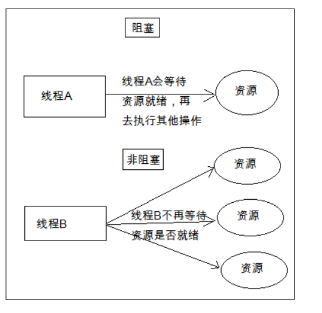

### 同步和异步

主要是指的数据的请求方式
同步和异步是指访问数据的一种机制  

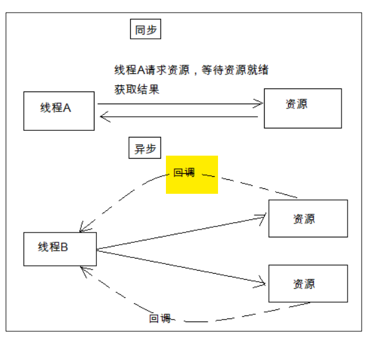

### 区别

上两个概念完全不相关。联系当前线程。阻塞指的是阻塞**io读写和连接的那个线程。**

同步会导致当前线程阻塞。异步不会，但是用多线程作异步也会导致新开的那个线程阻塞。

### BIO

在 Java 中编写 Socket 服务器， 通常有以下几种模式  ：（**区别在于服务端的线程数量**）

1. BIO

   可以检测到很多个socket，网络连接，但是由于读是阻塞的，因此需要分给一个线程处理每个socket。

   - 一个客户端连接用一个新的线程， 优点： 程序编写简单； 缺点： 如果连接非常多， 分配的线程也会非常多， 服务器可能会因为资源耗尽而崩溃。 
   - 接收到每一个客户端连接后，交给一个拥有固定数量线程的连接池去开启线程处理， 优点： 程序编写相对简单，可以处理大量的连接。 确定： 线程的开销非常大， 连接如果非常多， 排队现象会比较严重。   （连接通了，但是没有线程处理，不读取请求，不输出。）

2. NIO

   使用 Java 的 NIO， 用非阻塞的 IO 方式处理。 这种模式可以用一个线程， 处理大量的客户端连接。 

   NIO 是对 BIO 的改进，基于 Reactor 模型。我们知道，一个 socket 连接只有在特点时候才会发生数据传输 IO 操作，大部分时间这个“数据通道”是空闲的，但还是占用着线程。NIO 作出的改进就是“一个请求一个线程”，在连接到服务端的众多 socket 中，只有需要进行 IO 操作的才能获取服务端的处理线程进行 IO。这样就不会因为线程不够用而限制了 socket 的接入。

   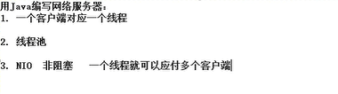 

### I/O多路复用技术

> 待解决

1. 第一种选择：**按顺序逐个检查**，先检查A，然后是B，之后是C、D。。。这中间如果有一个学生卡主，全班都会被耽误。
   这种模式就好比，你用循环挨个处理socket，根本不具有并发能力。

2. 第二种选择：你**创建30个分身**，每个分身检查一个学生的答案是否正确。 这种类似于为每一个用户创建一个进程或者线程处理连接。

3. 第三种选择，你**站在讲台上等，谁解答完谁举手**。这时C、D举手，表示他们解答问题完毕，你下去依次检查C、D的答案，然后继续回到讲台上等。此时E、A又举手，然后去处理E和A。。。 
   这种就是IO复用模型，Linux下的select、poll和epoll就是干这个的。将用户socket对应的fd注册进epoll，然后epoll帮你监听哪些socket上有消息到达，这样就避免了大量的无用操作。此时的socket应该采用**非阻塞模式**。
   这样，整个过程只在调用select、poll、epoll这些调用的时候才会阻塞，收发客户消息是不会阻塞的，整个进程或者线程就被充分利用起来，这就是**事件驱动**，所谓的reactor模式。


作者：柴小喵
链接：https://www.zhihu.com/question/28594409/answer/52835876
来源：知乎
著作权归作者所有。商业转载请联系作者获得授权，非商业转载请注明出处。

# BIO

## TCP-BIO

### 2.1 BIO

TCP通信能实现两台计算机之间的数据交互，通信的两端，要严格区分为客户端（Client）与服务端（Server）。

在 JDK1.4 之前， 我们建立网络连接的时候只能采用 BIO， 需要先在服务端启动一个
ServerSocket， 然后在客户端启动 Socket 来对服务端进行通信  

都是会阻塞的，除非对面主动关闭。

```java
Socket s = ss.accept(); //阻塞
Socket s = new Socket("127.0.0.1", 9999); // 不阻塞，直接报错
read()//阻塞
```


### 2.2 Socket

`Socket` 类：该类实现客户端套接字，套接字指的是两台设备之间通讯的端点。

### 构造方法

```java
Socket client = new Socket("127.0.0.1", 6666);
```

> 小贴士：回送地址(127.x.x.x) 是本机回送地址（Loopback Address），主要用于网络软件测试以及本地机进程间通信，无论什么程序，一旦使用回送地址发送数据，立即返回，不进行任何网络传输。

### 常用方法

```java
//如果此Scoket具有相关联的通道，则生成的InputStream 的所有操作也关联该通道。
//关闭生成的InputStream也将关闭相关的Socket。
public InputStream getInputStream() 

//如果此Scoket具有相关联的通道，则生成的OutputStream 的所有操作也关联该通道。
//关闭生成的OutputStream也将关闭相关的Socket。
public OutputStream getOutputStream()  

//一旦一个socket被关闭，它不可再使用。
//关闭此socket也将关闭相关的InputStream和OutputStream 。
public void close()  

//任何先前写出的数据将被发送，随后终止输出流。
public void shutdownOutput()  
```

### 2.3 ServerSocket

这个类实现了服务器套接字，该对象等待通过网络的请求。

**浏览器和客户端都可以访问。应该是Tomcat的底层**

### 构造方法

```java
ServerSocket server = new ServerSocket(6666);
```

### 成员方法

```java
public Socket accept() 
//侦听并接受连接，返回一个新的Socket对象，用于和客户端实现通信。该方法会一直阻塞直到建立连接。 
```

### 2.4 C\S服务器

两个java程序之间的访问。

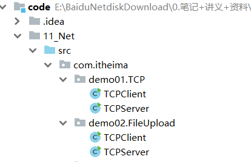

1个客户端连接到服务端的情况，一共3个程序

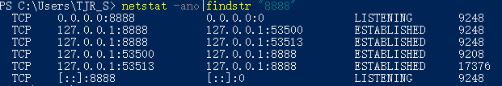

### 2.5 B\S服务器

模拟网站服务器，使用浏览器访问自己编写的服务端程序，查看网页效果。

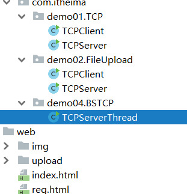

1. 我们模拟服务器端，ServerSocket类监听端口，使用浏览器访问

   ~~~java
   public static void main(String[] args) throws IOException {
       ServerSocket server = new ServerSocket(8000);
       Socket socket = server.accept();//这里有很多个连接，都是系统分配过来，数据也在底下，但是不一定分配线程处理这个socket连接，这里就只分配
       InputStream in = socket.getInputStream();
       byte[] bytes = new byte[1024];
       int len = in.read(bytes);
       System.out.println(new String(bytes,0,len));
       server.close();
   }
   ~~~

   服务器程序中字节输入流可以读取到浏览器发来的请求信息

   

   结果无法访问，是因为没有按照http协议规定的格式相应任何东西

   

2. 解释请求

   GET/web/index.html HTTP/1.1是浏览器的请求消息。/web/index.html为浏览器想要请求的服务器端的资源,使用字符串切割方式获取到请求的资源。

~~~java
//转换流,读取浏览器请求第一行
BufferedReader readWb = new BufferedReader(new InputStreamReader(socket.getInputStream()));
String requst = readWb.readLine();
//取出请求资源的路径
String[] strArr = requst.split(" ");
//去掉web前面的/
String path = strArr[1].substring(1);
System.out.println(path);
~~~

浏览器工作原理是遇到图片会开启一个线程进行单独的访问,因此在服务器端加入线程技术。

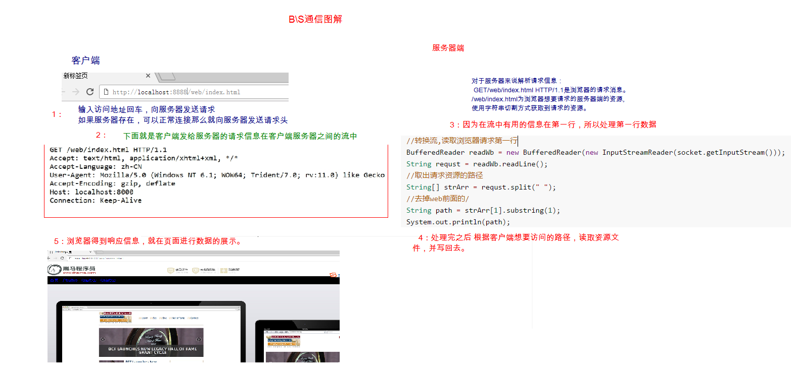

## Servlet、Socket

- **Servlet是Socket的一种应用，在每次请求时，会产生三次握手**

  - Socket：使用TCP/IP或者UDP协议在服务器与客户端之间进行传输的技术，是网络编程的基础
    Servlet：使用http协议在服务器与客户端之间通信的技术。是Socket的一种应用。
  - tcp/ip协议：关注的是客户端与服务器之间的数据传输是否成功（三次握手，传输失败会重发）
    http协议：是在tcp/ip协议之上进一步封装的一层协议，**关注的事数据传输的格式是否规范**，底层的数据传输还是运用了socket和tcp/ip

- **Tomcat中使用Socket编程**

  > Tomcat是非常流行的Web Server，它还是一个满足Servlet规范的容器。那么想一想，Tomcat和我们的Web应用是什么关系？
  >
  > 从感性上来说，我们一般需要把Web应用打成WAR包部署到Tomcat中，在我们的Web应用中，我们要指明URL被哪个类的哪个方法所处理（不论是原始的Servlet开发，还是现在流行的Spring MVC都必须指明）。
  >
  > 由于我们的Web应用是运行在Tomcat中，那么显然，请求必定是先到达Tomcat的。Tomcat对于请求实际上会进行下面的处理：
  >
  > **第一：提供Socket服务**
  >
  > **Tomcat的启动，必然是Socket服务，只不过它支持HTTP协议而已！**
  >
  > **这里其实可以扩展思考下，Tomcat既然是基于Socket，那么是基于BIO or NIO or AIO呢？**
  >
  > **第二：进行请求的分发**
  >
  > **要知道一个Tomcat可以为多个Web应用提供服务，那么很显然，Tomcat可以把URL下发到不同的Web应用。**
  >
  > **第三：需要把请求和响应封装成request/response**
  >
  > **我们在Web应用这一层，可从来没有封装过request/response的，我们都是直接使用的，这就是因为Tomcat已经为你做好了！**

## 手写MiniTomcat

写一个迷你版的tomcat

1. Tomcat负责启动服务器（socket），初始化servlet和url的对应关系，负责初始化servlet。
2. 监听连接，然后输出输入流包装成request和response，根据url分发给不同的servlet。
3. servle负责根据方法调用doPost和doGet
4. 然后写完后close socket。

https://blog.csdn.net/zl1zl2zl3/article/details/84388200

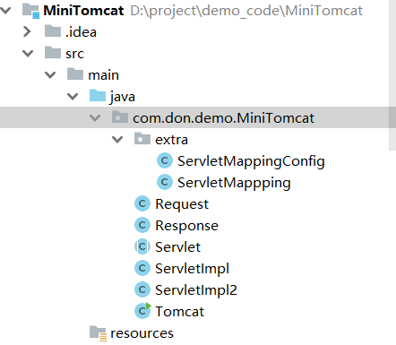

# NIO

## 介绍

java.nio 全称 java non-blocking IO， 是指 JDK 提供的新 API。 从 JDK1.4 开始， Java 提供了一系列改进的输入/输出的新特性， 被统称为 NIO(即 New IO)。 新增了许多用于处理输入输出的类， 这些类都被放在 java.nio 包及子包下， 并且对原 java.io 包中的很多类进行改写， 新增了满足 NIO 的功能。  

NIO 和 BIO 有着相同的目的和作用， 但是它们的实现方式完全不同， BIO 以**流的方式**处理数据,而 NIO 以**块的方式**处理数据，块 I/O 的效率比流 I/O 高很多。 另外， NIO 是**非阻塞式**的，这一点跟 BIO 也很不相同， 使用它可以**提供非阻塞式的高伸缩性网络**。  但是NIO是同步的。

NIO 主要有三大核心部分： Channel(通道)， Buffer(缓冲区), Selector(选择器)。

 传统的 BIO基于字节流和字符流进行操作， 而 NIO 基于 Channel(通道)和 Buffer(缓冲区)进行操作， **数据总是从通道读取到缓冲区中， 或者从缓冲区写入到通道中**。 Selector(选择区)用于监听多个通道的事件（比如： 连接请求， 数据到达等） ， 因此使用单个线程就可以监听多个客户端通道。  

Java NIO 中的网络通道是非阻塞 IO 的实现， 基于事件驱动， 非常适用于服务器需要维持大量连接， 但是数据交换量不大的情况， 例如一些即时通信的服务等等  ....

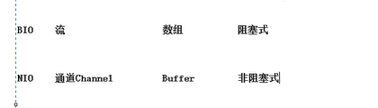

## 组件

### Buffer

> Don猜想：以前使用缓冲区是需要装饰类缓冲流，现在所有nio都需要内置buff

缓冲区， **实际上是一个容器， 是一个特殊的数组**， 缓冲区对象内置了一些机制， 能够跟踪和记录缓冲区的状态变化情况。 Channel 提供从文件、 网络读取数据的渠道，但是读取或写入的数据都必须经由 Buffer， 如下图所示：  

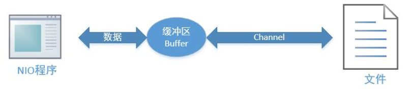

在 NIO 中， Buffer 是一个顶层父类， 它是一个抽象类， 常用的 Buffer 子类有：

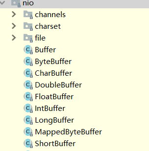

```
ByteBuffer， 存储字节数据到缓冲区
ShortBuffer， 存储字符串数据到缓冲区 
CharBuffer， 存储字符数据到缓冲区
IntBuffer， 存储整数数据到缓冲区
LongBuffer， 存储长整型数据到缓冲区
DoubleBuffer， 存储小数到缓冲区
FloatBuffer， 存储小数到缓冲区 
```

对于 Java 中的基本数据类型， 都有一个 Buffer 类型与之相对应， 最常用的自然是ByteBuffer 类（ 二进制数据） ， 该类的主要方法如下所示：  

```java
public abstract ByteBuffer put(byte[] b)// 存储字节数据到缓冲区
public abstract byte[] get()// 从缓冲区获得字节数据
public final byte[] array()// 把缓冲区数据转换成字节数组
public static ByteBuffer allocate(int capacity)// 设置缓冲区的初始容量
public static ByteBuffer wrap(byte[] array)// 把一个现成的数组放到缓冲区中使用
public final Buffer flip()// 翻转缓冲区， 重置位置到初始位置
```

### Channel

> stream，流的概念其实没有体现在java层面，都是JNI方法。

通道。类似于 BIO 中的 **stream**， 例如 FileInputStream 对象， 用来建立到目标（ 文件， 网络套接字， 硬件设备等） 的一个连接。Channel也是建立在stream的基础上的。

但是需要注意： **BIO 中的 stream 是单向的**， 例如 FileInputStream 对象只能进行读取数据的操作， 而 **NIO 中的Channel是双向的**，既可以用来进行读操作， 也可以用来进行写操作。 

常用的 Channel 类有：

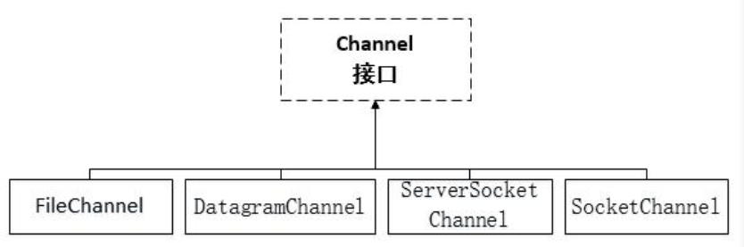

FileChannel 用于文件的数据读写

DatagramChannel 用于 UDP 的数据读写

 ServerSocketChannel 和 SocketChannel 用于 TCP 的数据读写，客户端和服务器端。  

**FileChannel常用方法** 

```java
public int read(ByteBuffer dst)		// 从通道读取数据并放到缓冲区中
public int write(ByteBuffer src)	// 把缓冲区的数据写到通道中
public long transferFrom(ReadableByteChannel src, long position, long count)	// 从目标通道中复制数据到当前通道
public long transferTo(long position, long count, WritableByteChannel target)	//把数据从当前通道复制给目标通道
```

NIO 中的通道是从输出流对象里通过 getChannel 方法获取到的， 该通道是双向的， 既可以读， 又可以写。 在往通道里写数据之前， 必须通过 put 方法把数据存到 ByteBuffer 中， 然后通过通道的 write 方法写数据。 在 write 之前， 需要调用 flip 方法翻转缓冲区， 把内部重置到初始位置， 这样在接下来写数据时才能把所有数据写到通道里。   

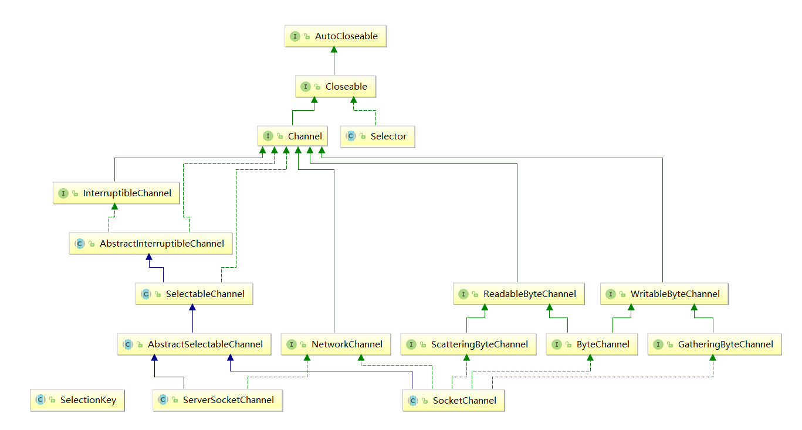

### 网络nio

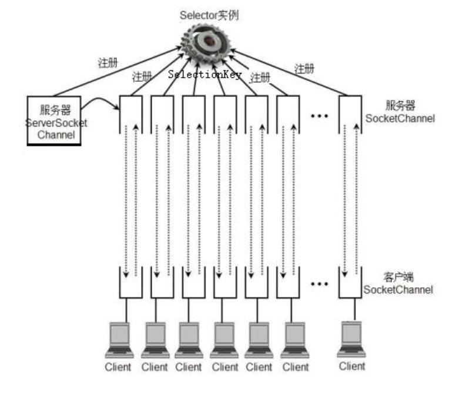

由`Selector`负责监控所有的`SocketChannel` 和`ServerSocketChannel`  的状态，有事件发生就会去返回相应的参数。

`ServerSocketChannel`  负责接收客户端的连接，接收几个就生成几个`SocketChannel`  ，和BIO是一样的，但是这里并不开一个线程处理。

`SocketChannel` 的事件发生就是对面客户端发过来的信息。

### Selector

选择器。 能够检测多个注册的通道上是否有事件发生， 如果有事件发生， 便获取事件然后针对每个事件进行相应的处理。 这样就可以只用一个单线程去管理多个通道， 也就是管理多个连接。 这样使得只有在连接真正有读写事件发生时， 才会调用函数来进行读写，就大大地减少了系统开销， 并且不必为每个连接都创建一个线程， 不用去维护多个线程， 并且避免了多线程之间的上下文切换导致的开销。  

> 待解决：底层处理难道是交由selector来处理的吗，也就是一个selector同一时间只能处理一个channel。

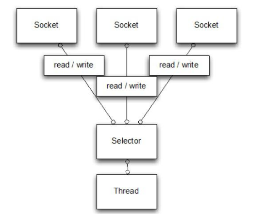

只有四个类，三个都是抽象类，只有一个是实现类，后面两个都是sun包的

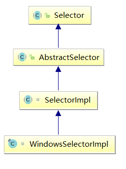

### SelectionKey  

 代表了 Selector 和SocketChannel的注册关系

```java
//四种注册关系
int OP_ACCEPT： 有新的网络连接可以 accept// 值为 16
int OP_CONNECT： 代表连接已经建立// 值为 8
int OP_READ 和 int OP_WRITE： 代表了读、 写操作// 值为 1 和 4  
  
//常用方法
public abstract Selector selector()// 得到与之关联的 Selector 对象
public abstract SelectableChannel channel()// 得到与之关联的通道
public final Object attachment()// 得到与之关联的共享数据
public abstract SelectionKey interestOps(int ops)// 设置或改变监听事件
public final boolean isAcceptable()// 是否可以 accept
public final boolean isReadable()// 是否可以读
public final boolean isWritable()// 是否可以写
```

### ServerSocketChannel

 用来在服务器端监听新的客户端 Socket 连接

```java
public static ServerSocketChannel open()// 得到一个 ServerSocketChannel 通道
public final ServerSocketChannel bind(SocketAddress local)// 设置服务器端端口号
public final SelectableChannel configureBlocking(boolean block)// 设置阻塞或非阻塞模式//取值 false 表示采用非阻塞模式
public SocketChannel accept()// 接受一个连接// 返回代表这个连接的通道对象
public final SelectionKey register(Selector sel, int ops)// 注册一个选择器并设置监听事件
```

### SocketChannel

网络 IO 通道，具体负责进行读写操作。 NIO 总是把缓冲区的数据写入通道，或者	缓冲区。 

```java
public static SocketChannel open()// 得到一个 SocketChannel 通道
public final SelectableChannel configureBlocking(boolean block)// 设置阻塞或非阻塞模式//取值 false 表示采用非阻塞模式
public boolean connect(SocketAddress remote)// 连接服务器
public boolean finishConnect()// 如果上面的方法连接失败// 接下来就要通过该方法完成连接操作
public int write(ByteBuffer src)// 往通道里写数据
public int read(ByteBuffer dst)// 从通道里读数据
public final SelectionKey register(Selector sel, int ops, Object att)// 注册一个选择器并设置监听事件// 最后一个参数可以设置共享数据
public final void close()// 关闭通道
```

## 代码

#### 文件io

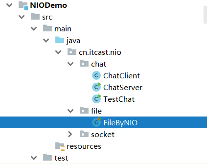

#### B/S架构

> 待解决，内部源码还不清楚。有问题，容易诸塞

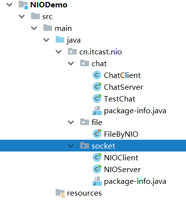

#### 聊天室

还没有处理好客户端关闭的异常情况

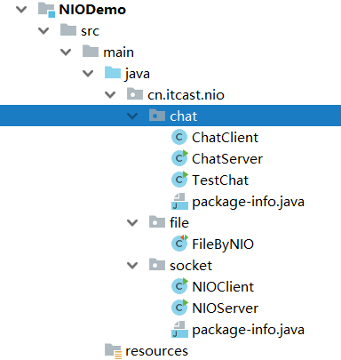

## 参考文献

 [关于Java NIO的『一切』](http://xintq.net/2017/06/12/everything-about-java-nio/)：**翻译自**  [Java NIO Tutorial](http://tutorials.jenkov.com/java-nio/index.html)

[漫谈Java IO之 Netty与NIO服务器](https://www.cnblogs.com/xing901022/p/8678869.html)

# AIO

JDK 7 引入了 Asynchronous I/O， 即 AIO。 在进行 I/O 编程中， 常用到两种模式： Reactor和 Proactor。 Java 的 NIO 就是 Reactor， 当有事件触发时， 服务器端得到通知， 进行相应的处理。
AIO 即 NIO2.0， 叫做异步不阻塞的 IO。 AIO 引入异步通道的概念， 采用了 Proactor 模式，简化了程序编写， 一个有效的请求才启动一个线程， 它的特点是**先由操作系统完成后才通知服务端程序启动线程去处理**， 一般适用于连接数较多且连接时间较长的应用。  

Java AIO就是Java作为对异步IO提供支持的NIO.2 ，Java NIO2 (JSR 203)定义了更多的 New I/O APIs， 提案2003提出，直到2011年才发布， 最终在JDK 7中才实现。JSR 203除了提供更多的文件系统操作API(包括可插拔的自定义的文件系统)， 还提供了对socket和文件的异步 I/O操作。 同时实现了JSR-51提案中的socket channel全部功能,包括对绑定， option配置的支持以及多播multicast的实现。

从编程模式上来看AIO相对于NIO的区别在于，NIO需要使用者线程不停的轮询IO对象，来确定是否有数据准备好可以读了，而AIO则是在数据准备好之后，才会通知数据使用者，这样使用者就不需要不停地轮询了。当然AIO的异步特性并不是Java实现的伪异步，而是使用了系统底层API的支持，在Unix系统下，采用了epoll IO模型，而windows便是使用了IOCP模型。关于Java AIO，本篇只做一个抛砖引玉的介绍，如果你在实际工作中用到了，那么可以参考Netty在高并发下使用AIO的相关技术。

# 总 结

IO实质上与线程没有太多的关系，但是不同的IO模型改变了应用程序使用线程的方式，NIO与AIO的出现解决了很多BIO无法解决的并发问题，当然任何技术抛开适用场景都是耍流氓，复杂的技术往往是为了解决简单技术无法解决的问题而设计的，在系统开发中能用常规技术解决的问题，绝不用复杂技术，否则大大增加系统代码的维护难度，学习IT技术不是为了炫技，而是要实实在在解决问题。
