# 介绍

JavaEE：Java语言在企业级开发中使用的技术规范的总和，一共规定了13项大的规范

对于一个初学者来说，可以这样认为，当在一台机器上配置好Apache 服务器，可利用它响应[HTML](https://baike.baidu.com/item/HTML)（[标准通用标记语言](https://baike.baidu.com/item/标准通用标记语言/6805073)下的一个应用）页面的访问请求。实际上Tomcat是Apache 服务器的扩展，但运行时它是独立运行的，所以当你运行tomcat 时，它实际上作为一个与Apache 独立的进程单独运行的。

**Tomcat容器级别**

 Tomcat容器分为四个等级，属于核心组件，可以通过server.xml文件来查看三者关系

- Container 容器，集装箱           
  - Engine 引擎容器             
    - Host 主机               
      - Servlet容器（tomcat最低级别的容器）里面包含了一个或多个Context，一个Context代表一个Web项目，因此servlet容器会把不同虚拟路径的url映射到不同的容器

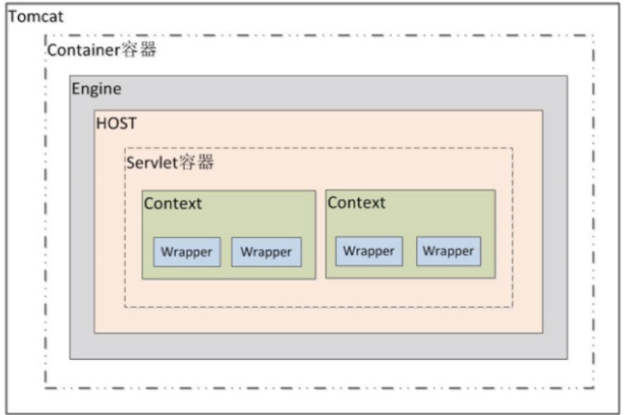

**Tomcat是一个容器**

java的领域中，谈及容器服务，就是指容器会是供一系列的对象管理、生命周期管理、安全管理，甚至交易(Transaction)等服务的虚拟盒子对象。在容器里面封装了http服务，使得容器可以接收客户端的清求以及吧相应的处理结果响应到客户端。这就正好符合了双站运行模式了，当然也可以说WEB容器就是为了WEB的运行而存在的吧。


在Tomcat 4以前，用的就是TOMCAT_HOME来表示Tomcat的安装目录，在Tomcat 4以后，采用了新的Servlet容器Catalina，所以环境变量的名字也改为了CATALINA_HOME。


# 目录

## 主目录

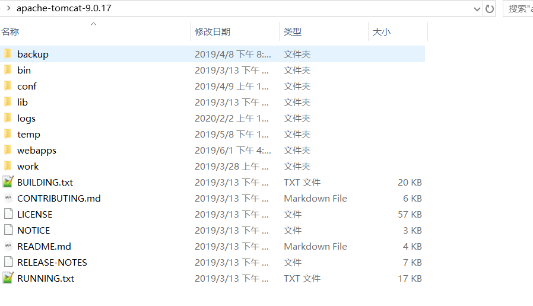

## logs

日志文件，一共有5种不同的配置文件

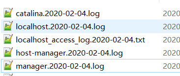

## conf

主要配置和默认配置，web.xml可以在各自的web项目中覆写。有什么问题都可以来这里配置。

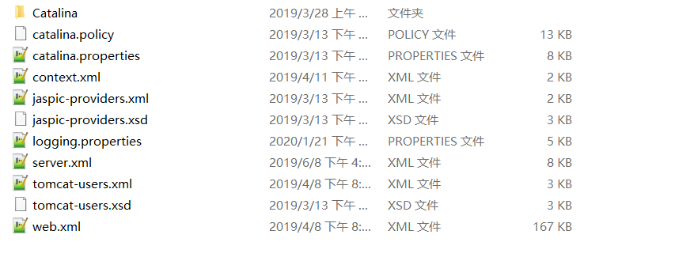

## lib

所有的jar包，外部tomcat中，自己在IDEA中只能使用导入需要使用的类的那一部分，因此debug的时候看不到，需要引入源码才可以debug。

这是外部tomcat的缺点，使用嵌入式tomcat就可以看到所有代码，只要jar导入就可以了。

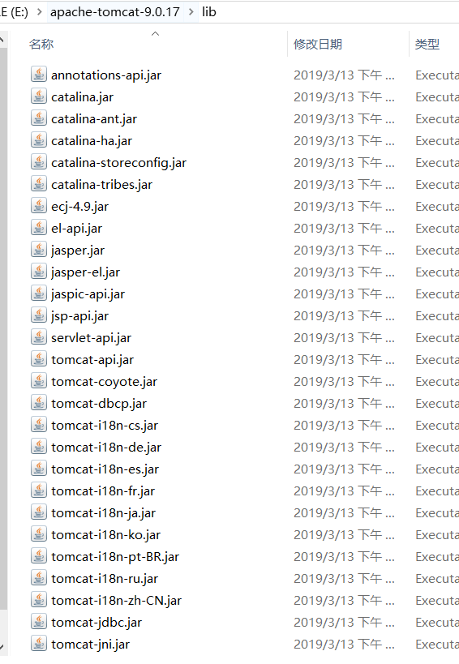

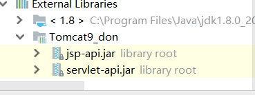

## webapps

部署在这个tomcat的所有的web的项目，ROOT是虚拟路径为“”的web项目。其他文件夹都有各自的虚拟路径，默认文件夹同名。

右图是其中的一个ROOT项目里面的文件，下图是IDEA中的文件，IDEA通过映射，不需要把web项目放在webapps文件夹中。

```java
-- 项目的根目录
    -- WEB-INF目录：
        -- web.xml：web项目的核心配置文件
        -- classes目录：放置字节码文件的目录
        -- lib目录：放置依赖的jar包
    -- 其他静态资源和模板资源jsp
```

 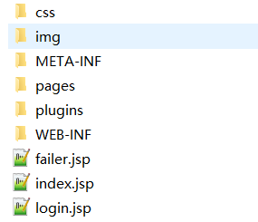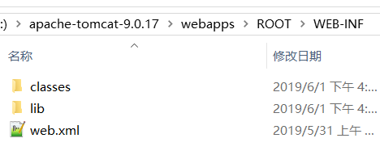

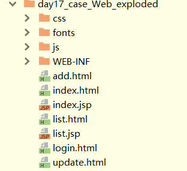

## work

和webapps配合使用，里面存放着运行时实时生成的jsp的java和class文件。

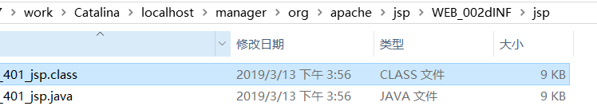

## src

官网额外下载，不能用于启动tomcat，但是如果找到程序main入口，那么可以用src驱动项目。

如果是外置tomcat，那么可以关联到IDEA中，便于调式，但是不如嵌入式tomcat容器好用，有些类 找不到，需要主动搜索。

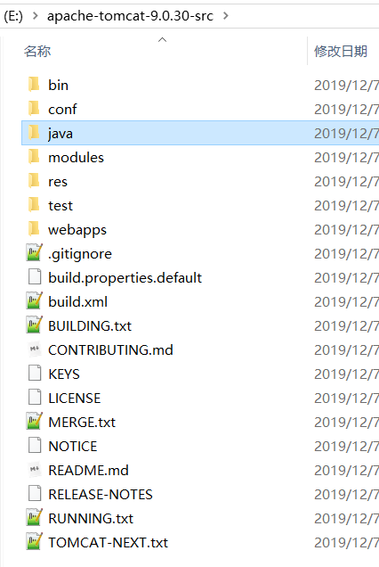

# 原理

外部Tomcat就是一个完整的java程序（单体程序就有main入口，分体就有多个入口，没看过源码不知道），我们写的web项目只是给他映射url并且处理业务逻辑的程序。因此不需要把所有的tomcat的jar包都导入。

主要是两个jar包依赖，写业务代码需要用到的，令程序编译不报错，并且有提示功能。实际运行的时候并不在IDEA中运行，而是在tomcat中运行，因此scope是Provided，不是compile。

- 接收请求的那一部分浅显的原理
  1. 当服务器接受到客户端浏览器的请求后，会解析请求URL路径，获取访问的Servlet的资源路径
  2. 查找web.xml文件，是否有对应的<url-pattern>标签体内容。
  3. 如果有，则在找到对应的<servlet-class>全类名
  4. tomcat会将字节码文件加载进内存，并且创建其对象
  5. 调用其方法


# 入门

## 下载安装启动关闭

	1. 下载：http://tomcat.apache.org/
	2. 安装：解压压缩包即可。
		* 注意：安装目录建议不要有中文和空格，
			不能使用src包，需要使用distribution版本
	3. 卸载：删除目录就行了
	4. 启动：bin/startup.bat 
	5. 关闭：
		1. 正常关闭：
	    	* bin/shutdown.bat
	    	* ctrl+c
		2. 强制关闭：
	    	* 点击启动窗口的×
## demo

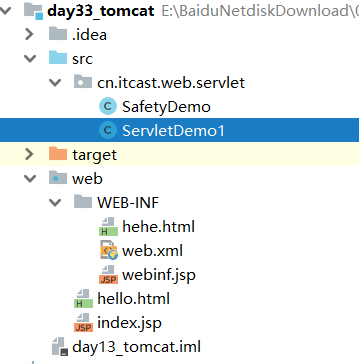

## 部署

直接将项目放到webapps目录下即可。

 /hello：项目的访问路径-->虚拟目录。

 简化部署：将项目打成一个war包，再将war包放置到webapps目录下。war包会自动解压缩

## 修改端口

```xml
 conf/server.xml
<Connector port="8888" protocol="HTTP/1.1" connectionTimeout="20000" redirectPort="8445" />
```

一般会将tomcat的默认端口号修改为80。80端口号是http协议的默认端口号。好处：在访问时，就不用输入端口号

## 访问资源

静态资源和servelt都可以直接通过浏览器访问，协议+虚拟路径+资源路径（webapp文件夹下）

http://localhost:8080/

http://localhost:8080/safety（tomcat更新项目延迟，WEB-INF下文件需要内部转发）

# session共享

1. 以负载均衡服务器本身提供的 session 共享策略，每种服务期的配置是不一样的并且nginx 本身是没有的。

2. 利用 web 容器本身的 session 共享策略来配置共享。针对于 weblogic 这种方式还是靠普的。但是针对于 tomcat 这种方式存在很大的缺陷，主要因为是依靠广播方式来实现的 session 复制，会浪费很多带宽导致整个网络反映缓慢。官网也建议这种方式最好不要超过 4 台 tomcat,具体的内容可参考/webapps/docs/cluster-howto.html 里面有详细的说明。下面是具体的配置过程

   - 修改 server.xml 文件，最简单的集群配置只需要将节点中注释掉的下面这句取消注释即可：
     Xml 代码：

   ```xml
   <Cluster className="org.apache.catalina.ha.tcp.SimpleTcpCluster"/>
   ```

   使用这样方法配置的集群会将 Session 同步到所在网段上的所有配置了集群属性的实例上(此处讲所在网段可能不准确，是使用 Membership 的 address 和 port 来区分的。 tomcat 集群的实例如果在 Membership 配置中有相同的 address 和 port 值的 tomcat 被分到同一个集群里边。他们的 session 是相互共享的，同一个 session的集群被称为一个 cluster。可以配置多个 cluster，但是 cluster 和 cluster 之间的 session 是不共享的)。也就是说如果该广播地址下的所有 Tomcat 实例都会共享 Session，那么假如有几个互不相关的集群，就可能造成Session 复制浪费，所以为了避免浪费就需要对节点多做点设置了，如下：  

   ```xml
   <Cluster className="org.apache.catalina.ha.tcp.SimpleTcpCluster">
   	<Channel className="org.apache.catalina.tribes.group.GroupChannel">
   		<Membership
   			className="org.apache.catalina.tribes.membership.McastService"
   			address="228.0.0.4"
   			port="45564"
   			frequency="500"
   			dropTime="3000"/>
   	</Channel>
   </Cluster>
   ```

   加了一个 Channel，里面包了个 Membership，咱们要关注的就是 membership 的 port 属性和 address 属性，不同的集群设置不同的 port 值或 address 值，从目前的使用来看，基本上是隔离开了。  

   - 修改项目的 web.xml 文件：

     web.xml 文件的修改很简单：只需要在节点中添加这个节点<distributable/>就可以了。
     OK，有了这二步就实现了 Tomcat 的集群和 Session 的共享了。  

3. Tomcat 集群+redis 的 Session 共享配置方法  


# 虚拟目录

```xml
2. 配置conf/server.xml文件
	在<Host>标签体中配置
    <Context docBase="D:\hello" path="/hehe" />
    * docBase:项目存放的路径
    * path：虚拟目录

    3. 在conf\Catalina\localhost创建任意名称的xml文件。在文件中编写
    <Context docBase="D:\hello" />
    * 虚拟目录：xml文件的名称
```

**前因：**

1. 在Tomcat服务器上部署项目只要将项目打包，然后放到webapps目录下就可以
2. 使用虚拟路径也可以为搭载Tomcat服务器的盘符容量分压
3. cmd和IDE也可以同时访问项目

**原理**

Tomcat的加载web顺序是先加载 $Tomcat_home$\conf\Catalina\localhost下面的xml文件(文件中配置了web项目所在路径),然后再加载webapps下的web项目.

**方法1**

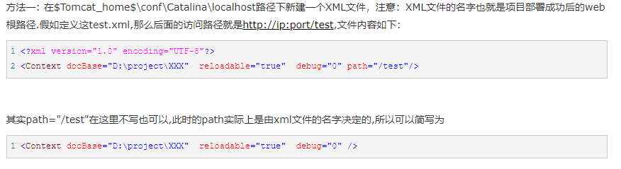

**方法2** 

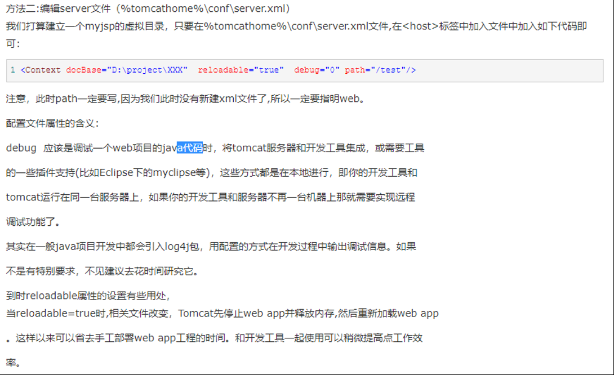

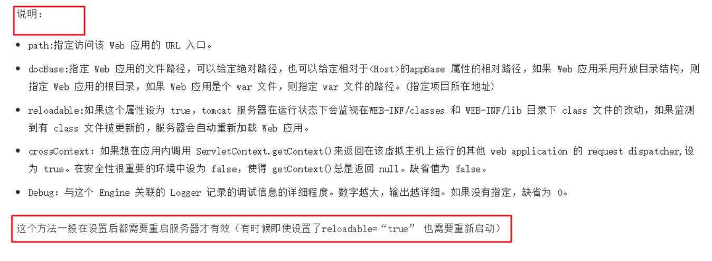

https://blog.csdn.net/a258831020/article/details/49934571

# 控制反转

```xml
....
<!--相当于注册一个bean-->
	<env-entry>
		<env-entry-name>Bean</env-entry-name>
		<env-entry-type>java.lang.String</env-entry-type>
		<env-entry-value>Hello,World</env-entry-value>
	</env-entry>

</web-app>

```

```java
			//aphche文档可以找到，控制反转
			Context context = new InitialContext();
			Context evnContext = (Context) context.lookup("java:comp/env");
			dataSource = (DataSource) evnContext.lookup("jdbc/TestDB");

			String bean = (String) evnContext.lookup("Bean");
```

例子在datasource中

# Datasource

tomcat自己内部的数据源DBCP

## 步骤

1. 全局context.xml配置，看有没有办法使用项目的context.xml

   ```xml
   	<Resource name="jdbc/TestDB" auth="Container" type="javax.sql.DataSource"
   		username="root" password="1234" driverClassName="com.mysql.jdbc.Driver"
   		url="jdbc:mysql://localhost:3306/ssm?useSSL=false" />
   ```

2. 项目web.xml设置

   ```xml
       <!--注册一个datasource，需要在context.xml中配置，相当于注册一个bean，控制反转-->
   	<resource-ref>
   		<res-ref-name>jdbc/TestDB</res-ref-name>
   		<res-type>javax.sql.DataSource</res-type>
   		<res-auth>Container</res-auth>
   	</resource-ref>
   ```

3. ```java
   package com.segmentfault.lesson5.servlet;
   
   import java.io.IOException;
   import java.io.Writer;
   import java.sql.Connection;
   import java.sql.ResultSet;
   import java.sql.SQLException;
   import java.sql.Statement;
   
   import javax.naming.Context;
   import javax.naming.InitialContext;
   import javax.servlet.ServletConfig;
   import javax.servlet.ServletException;
   import javax.servlet.http.HttpServlet;
   import javax.servlet.http.HttpServletRequest;
   import javax.servlet.http.HttpServletResponse;
   import javax.sql.DataSource;
   
   public class JDBCTestServlet extends HttpServlet {
   
   	/**
   	 * 大多数情况servlet不需要序列化
   	 */
   	private static final long serialVersionUID = 6917571910801949833L;
   
   	private DataSource dataSource;
   
   	public void init(ServletConfig servletConfig) throws ServletException {
   
   		try {
   			//aphche文档可以找到，控制反转
   			Context context = new InitialContext();
   			Context evnContext = (Context) context.lookup("java:comp/env");
   			dataSource = (DataSource) evnContext.lookup("jdbc/TestDB");
   
   			String bean = (String) evnContext.lookup("Bean");
   			
   			System.out.println(bean);
   
   		} catch (Exception e) {
   			throw new ServletException(e);
   		}
   
   	}
   
   	public void service(HttpServletRequest request, HttpServletResponse response) throws ServletException, IOException {
   
   		Writer writer = response.getWriter();
   
   		response.setContentType("text/html;charset=UTF-8");
   
   		try {
   
   			Connection connection = dataSource.getConnection();
   
   			Statement statement = connection.createStatement();
   
   			ResultSet resultSet = statement.executeQuery("SHOW DATABASES;");
   
   			while (resultSet.next()) {
   
   				String dataname = resultSet.getString(1);
   				writer.write(dataname);
   				writer.write("<br />");
   				writer.flush();
   			}
   
   		} catch (SQLException e) {
   			throw new ServletException(e);
   		}
   
   	}
   
   }
   
   ```

   

## 例子

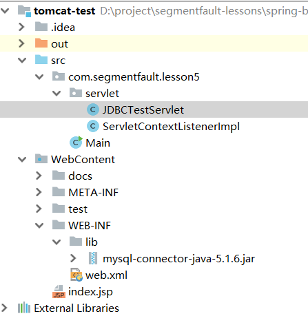

# WEB-INF

安全文件夹

Tomcat WEB-INF目录下的文件，浏览器一般无法直接方法，只能通过重定向后才可以访问，如果需要直接访问，可以放在和WEB-INF同级目录下。一般为jsp等模板文件或者html等静态文件。

jsp放在webroot目录下 这样就可以让用户直接访问，jsp放在web-inf目录下就必须要通过请求才能访问。因此放在web-inf下jsp页面显得要安全。

**设置映射**

1. 本来WEB-INF中的jsp就是无法通过地址栏访问的.所以安全.如果说你要访问这个文件夹中的jsp文件需要在项目的web.xml文件中去配置servlet格式差不多的配置就ok了。如下:

   ```xml
       <!--访问WEB-INF下的文件的路由-->
       <servlet>
           <servlet-name>safety2</servlet-name>
           <!--<jsp-file>/WEB-INF/webinf.jsp</jsp-file>-->
           <jsp-file>/WEB-INF/hehe.html</jsp-file>
       </servlet>
   
       <servlet-mapping>
           <servlet-name>safety2</servlet-name>
           <url-pattern>/safety</url-pattern>
       </servlet-mapping>
   ```

2. <jsp:forward page ="/WEB-INF/jsp/test/test.jsp" />

3. 转发

   ```java
   servletRequest.getRequestDispatcher("/WEB-INF/webinf.jsp").forward(servletRequest, servletResponse);//访问安全文件夹WEB-INF
   ```

# JNDI

基本类型
资源（Resource）
环境（Environment）

配置方式
context.xml 配置
web.xml 配置

# connectors

server.xml

连接器（Connectors）

端口（port）

协议（protocol）

线程池（Thread Pool）

超时时间（Timeout）

# 问题

## 黑窗口一闪而过

* 原因： 没有正确配置JAVA_HOME环境变量
* 解决方案：正确配置JAVA_HOME环境变量

## 启动报错

​	关闭程序修改端口

## 控制台乱码

控制台就是程序内存输出到控制台的，显示编码和文件log的编码可以不一样。

### cmd控制台乱码

缺点：会导致get/post乱码，idea乱码（修改idea的显示编码）

```
1、找到${CATALINA_HOME}/conf/logging.properties 
2、添加语句：java.util.logging.ConsoleHandler.encoding = GBK 
3、重启tomcat，查看日志数据即可
```

### Idea乱码

1. 设置中File Encodings中 UTF-8

2. tomcat启动Run/DeBug Configurations，在VM options填写-Dfile.encoding=UTF-8：
3. help中vmoption文件 ：-Dfile.encoding=UTF-8 
4. 上面的logging properties不要修改为GBK

缺点：cmd控制台乱码

### 原理

1. 首先要分清是tomcat日志编码，与idea的日志显示控制台编码
2. tomcat日志编码：cmd内 "cd /d tomcat根目录" "bin\catalina.bat run" 运行，"chcp65001"切换cmd为utf8，"chcp 936"切换cmd为gbk，确定tomcat日志编码，一般因为tomcat/conf/logging.properties java.util.logging.ConsoleHandler.encoding = UTF-8已设置为utf8
3. idea显示编码：windows默认用gbk所以idea显示默认为gbk编码，【一定】在 Help-- custom vm options 添加-Dfile.encoding=UTF-8，强制为utf8编码显示，不要自己改.vmoptions可能位置不对，idea会在用户目录复制一个
4. 【切忌】自己改tomcat的logging.properties 为GBk 会导致调试时get/post参数乱码

# 路径

1. **绝对路径**


缺点：（工程移动位置到服务器后无法找到资源文件）

2. **相对路径**

相对于自己的目标文件位置。


 


./ 表示当前路径


3. **（相对）虚拟路径**

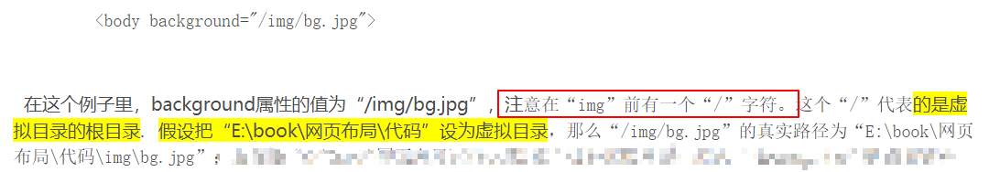


# 配置

一共有三个配置文件

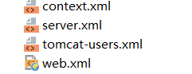

 [详解Tomcat 配置文件server.xml](https://www.cnblogs.com/kismetv/p/7228274.html)

[Tomcat配置任意目录下的Web应用程序：类似IDEA、eclipse映射web项目](https://blog.csdn.net/zhenyusoso/article/details/6168288)

## web.xml

### 静态资源处理

```xml
上面还有很多说明，应该是直接转发静态资源，默认的servlet，如果url没有匹配的话，走这个
	<servlet>
        <servlet-name>default</servlet-name>
        <servlet-class>org.apache.catalina.servlets.DefaultServlet</servlet-class>
        <init-param>
            <param-name>debug</param-name>
            <param-value>0</param-value>
        </init-param>
        <init-param>
            <param-name>listings</param-name>
            <param-value>false</param-value>
        </init-param>
        <load-on-startup>1</load-on-startup>
    </servlet>
```

### JSP处理

```xml
    <servlet>
        <servlet-name>jsp</servlet-name>
        <servlet-class>org.apache.jasper.servlet.JspServlet</servlet-class>
        <init-param>
            <param-name>fork</param-name>
            <param-value>false</param-value>
        </init-param>
        <init-param>
            <param-name>xpoweredBy</param-name>
            <param-value>false</param-value>
        </init-param>
        <load-on-startup>3</load-on-startup>
    </servlet>
```

### 欢迎页面

```xml
  <!-- ==================== Default Welcome File List ===================== -->
  <!-- When a request URI refers to a directory, the default servlet looks  -->
  <!-- for a "welcome file" within that directory and, if present, to the   -->
  <!-- corresponding resource URI for display.                              -->
  <!-- If no welcome files are present, the default servlet either serves a -->
  <!-- directory listing (see default servlet configuration on how to       -->
  <!-- customize) or returns a 404 status, depending on the value of the    -->
  <!-- listings setting.                                                    -->
  <!--                                                                      -->
  <!-- If you define welcome files in your own application's web.xml        -->
  <!-- deployment descriptor, that list *replaces* the list configured      -->
  <!-- here, so be sure to include any of the default values that you wish  -->
  <!-- to use within your application.                                       -->

    <welcome-file-list>
        <welcome-file>index.html</welcome-file>
        <welcome-file>index.htm</welcome-file>
        <welcome-file>index.jsp</welcome-file>
    </welcome-file-list>
```

# 异步

[Servlet 3.0 异步处理](https://zditect.com/article/10790770.html)

[关于使用Servlet3.0 出现： java.lang.IllegalStateException: 当前链的筛选器或servlet不支持异步操作 的异常的可能原因](https://www.jianshu.com/p/dd3feccf1388)

[AsyncContext异步处理http请求](https://blog.csdn.net/qq_31086797/article/details/108455482#:~:text=AsyncContext%E6%98%AFServlet%203.0%E6%8F%90%E4%BE%9B,%E5%8E%BB%E5%A4%84%E7%90%86%E5%88%AB%E7%9A%84%E8%AF%B7%E6%B1%82%E3%80%82)

[想去配置servlet3.0支持异步](https://blog.csdn.net/dmw412724/article/details/83038193)