fJavaWeb三大组件（Servlet、Filter、Listener）](https://blog.csdn.net/xiaojie119120/article/details/73274759)

# 整体架构

## Servlet 3.0 前时代

web.xml

#### 服务组件

```
javax.servlet.Servlet
javax.servlet.Filter（since Servlet 2.3）
```

#### 上下文组件

```
javax.servlet.ServletContext
javax.servlet.http.HttpSession
javax.servlet.http.HttpServletRequest
javax.servlet.http.HttpServletResponse
javax.servlet.http.Cookie（客户端）
```

#### 配置


	javax.servlet.ServletConfig
	javax.servlet.FilterConfig（since Servlet 2.3 ）

#### 输入输出

```
javax.servlet.ServletInputStream，二进制内容，文件
javax.servlet.ServletOutputStream  
```

#### 异常

```
javax.servlet.ServletException
还有一个IOException
```

#### 事件

```java
（since Servlet 2.3 ）
生命周期类型
javax.servlet.ServletContextEvent
javax.servlet.http.HttpSessionEvent
java.servlet.ServletRequestEvent

属性上下文类型
javax.servlet.ServletContextAttributeEvent
javax.servlet.http.HttpSessionBindingEvent
javax.servlet.ServletRequestAttributeEvent
```
#### 	监听器

```java
（since Servlet 2.3）都是回调方法，监听者模式、reactive类似
	生命周期类型
	javax.servlet.ServletContextListener
	javax.servlet.http.HttpSessionListener
	javax.servlet.http.HttpSessionActivationListener
	javax.servlet.ServletRequestListener
	
	属性上下文类型
	javax.servlet.ServletContextAttributeListener
	javax.servlet.http.HttpSessionAttributeListener
	javax.servlet.http.HttpSessionBindingListener
	javax.servlet.ServletRequestAttributeListener
```

## Servlet 3.0 后时代 

web.xml改为注解

#### 组件申明注解

```java
@javax.servlet.annotation.WebServlet
@javax.servlet.annotation.WebFilter
@javax.servlet.annotation.WebListener
@javax.servlet.annotation.ServletSecurity
@javax.servlet.annotation.HttpMethodConstraint
@javax.servlet.annotation.HttpConstraint
```
#### 配置申明

```java
@javax.servlet.annotation.WebInitParam
```

#### 异步上下文

```
javax.servlet.AsyncContext
```

#### 事件

```
javax.servlet.AsyncEvent
```

#### 监听器

```
javax.servlet.AsyncListener
```

#### 动态注册

	Servlet 组件注册
	javax.servlet.ServletContext#addServlet()
	javax.servlet.ServletRegistration
	
	Filter 组件注册
	javax.servlet.ServletContext#addFilter()
	javax.servlet.FilterRegistration
	
	监听器注册
	javax.servlet.ServletContext#addListener()
	javax.servlet.AsyncListener
#### 自动装配

```
初始器
javax.servlet.ServletContainerInitializer

类型过滤
@javax.servlet.annotation.HandlesTypes
```

## 区别

the following is copied from [here](https://stackoverflow.com/questions/1638865/what-are-the-differences-between-servlet-2-5-and-3). 

Just as an update and to be more explicit, these are the main differences between servlets 2.5 and 3 (I'm not trying to be exhaustive, I'm just mentioning the most interesting parts):

### Annotations to declare servlets, filters and listeners (ease of development)

In servlets 2.5, to declare a servlet with one init parameter you need to add this to **web.xml**:

```xml
<servlet>
    <servlet-name>myServlet</servlet-name>
    <servlet-class>my.server.side.stuff.MyAwesomeServlet</servlet-class>
    <init-param>
        <param-name>configFile</param-name>
        <param-value>config.xml</param-value>
    </init-param>
</servlet>

<servlet-mapping>
    <servlet-name>myServlet</servlet-name>
    <url-pattern>/path/to/my/servlet</url-pattern>
</servlet-mapping>
```

In servlets 3, **web.xml** is optional and you can use annotations instead of XML. The same example:

```java
@WebServlet(name="myServlet",
    urlPatterns={"/path/to/my/servlet"},
    initParams={@InitParam(name="configFile", value="config.xml")})
public class MyAwesomeServlet extends HttpServlet { ... }
```

For filters, you need to add this in **web.xml** in servlets 2.5:

```xml
<filter>
    <filter-name>myFilter</filter-name>
    <filter-class>my.server.side.stuff.MyAwesomeServlet</filter-class>
</filter>
<filter-mapping>
    <filter-name>myFilter</filter-name>
    <url-pattern>/path/to/my/filter</url-pattern>
</filter-mapping>
```

Equivalent using annotations in servlets 3:

```java
@ServletFilter(name="myFilter", urlPatterns={"/path/to/my/filter"})
public class MyAwesomeFilter implements Filter { ... }
```

For a listener (in this case a ServletContextListener), in servlets 2.5:

```xml
<listener>
    <listener-class>my.server.side.stuff.MyAwesomeListener</listener-class>
</listener>
```

The same using annotations:

```java
@WebServletContextListener
public class MyAwesomeListener implements ServletContextListener { ... }
```

### Modularization of web.xml (Pluggability)

- In servlets 2.5 there is just one monolithic **web.xml** file.
- In servlets 3, each "loadable" jar can have a **web-fragment.xml** in its **META-INF** directory specifying servlets, filters, etc. This is to allow libraries and frameworks to specify their own servlets or other objects.

### Dynamic registration of servlets, filters and listeners at context initialization time (Pluggability)

In servlets 3, a `ServletContextListener` can add dynamically servlets, filters and listeners using the following methods added to `SevletContext`: `addServlet()`, `addFilter()` and `addListener()`

### Asynchronous support

Example: say that some servlet container has five threads in its thread pool, and there is a time-consuming process to be executed per request (like a complex SQL query).

- With servlets 2.5 this servlet container would run out of available threads if it receives five requests at the same time and the five available threads start doing the process, because the threads wouldn't return until `service()` (or `doGet()`, `doPost()`, etc.) is executed from start to end and returns a response.
- With servlets 3.0, this long-time process can be delegated to another thread and finish `service()` before sending the response (the response now will be sent by the latest thread). This way the thread is free to receive new responses.

An example of asynchronous support:

Servlets 2.5:

```java
public class MyAwesomeServlet extends HttpSerlvet {

    @Override
    public void doGet(HttpServletRequest request, HttpServletResponse response) {
        // ...

        runSlowProcess();
        // no async support, thread will be free when runSlowProcess() and
        // doGet finish

        // ...
    }

}
```

Servlets 3:

```java
@WebServlet(name="myServlet",
             urlPatterns={"/mySlowProcess"},
             asyncSupported=true) // asyncSupported MUST be specified for
                                  // servlets that support asynchronous
                                  // processing
public class MyAwesomeServlet extends HttpSerlvet {

    @Override
    public void doGet(HttpServletRequest request, HttpServletResponse response) {


        // an AsyncContext is created, now the response will be completed
        // not when doGet finalizes its execution, but when
        // myAsyncContext.complete() is called.
        AsyncContext myAsyncContext = request.startAsync(request, response);

        // ...

        // myAsyncContext is passed to another thread
        delegateExecutionToProcessingThread(myAsyncContext);

        // done, now this thread is free to serve another request
    }

}

// ... and somewhere in another part of the code:

public class MyProcessingObject {

    public void doSlowProcess() {

        // ...

        runSlowProcess();
        myAsyncContext.complete(); // request is now completed.

        // ...

    }

}
```

The interface `AsyncContext` also has methods to get the request object, response object and add listeners to notify them when a process has finished.

### Programmatic login and logout (security enhancements)

In servlets 3, the interface `HttpServletRequest` has been added two new methods: `login(username, password)` and `logout()`.

For more details, have a look at the [Java EE 6 API](http://docs.oracle.com/javaee/6/api/).

# servlet

Servlet 是一种基于 Java 技术的 Web 组件，用于生成动态内容，由容器管理。类似于其他 Java 技术组件，Servlet 是平台无关的 Java 类组成，并且由 Java Web 服务器加载执行。

Servlet是在服务器上运行的小程序。一个Servlet就是一个java类，并且可以通过“请求-响应”编程模型来访问的这个驻留在服务器内存里的Servlet程序。

Servlet 容器，有时候也称作为 Servlet 引擎，作为Web服务器或应用服务器的一部分。通过请求和响应对话，提供 Web 客户端与 Servlets 交互的能力。容器管理Servlets实例以及它们的生命周期。

 1997年六月，Servlet 1.0 版本发行，最新版本 Servlet 4.0 处于研发状态。

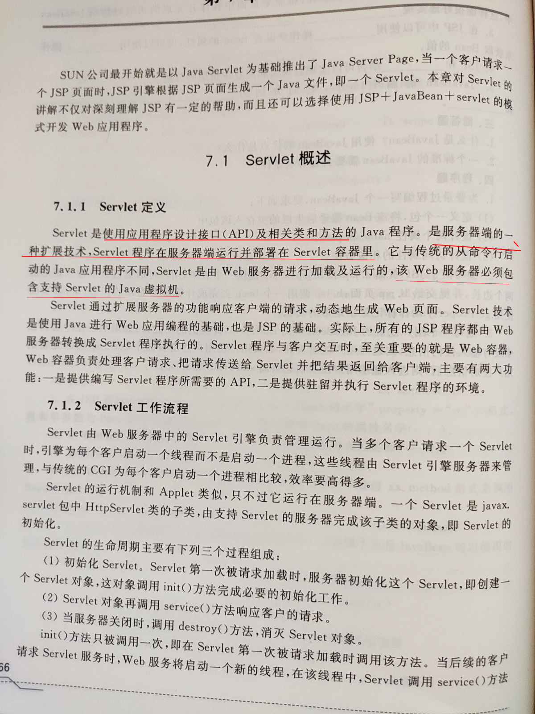

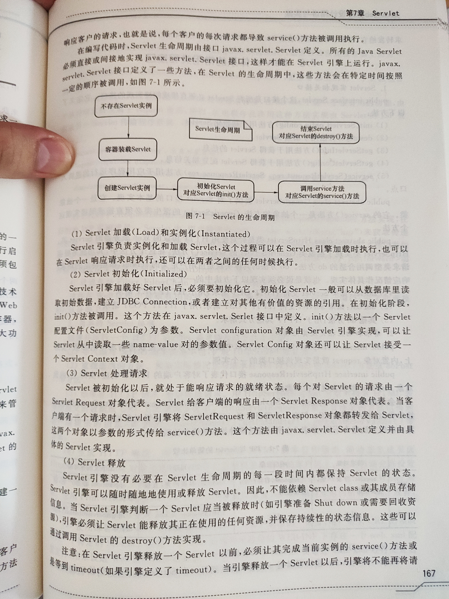

## 常用类和接口

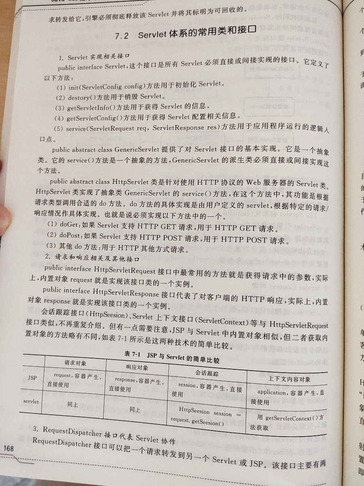

> https://www.cnblogs.com/wy-NB/p/3861523.html 
>
> ​	RequestDispatcher接口的include()方法与forward()方法的区别


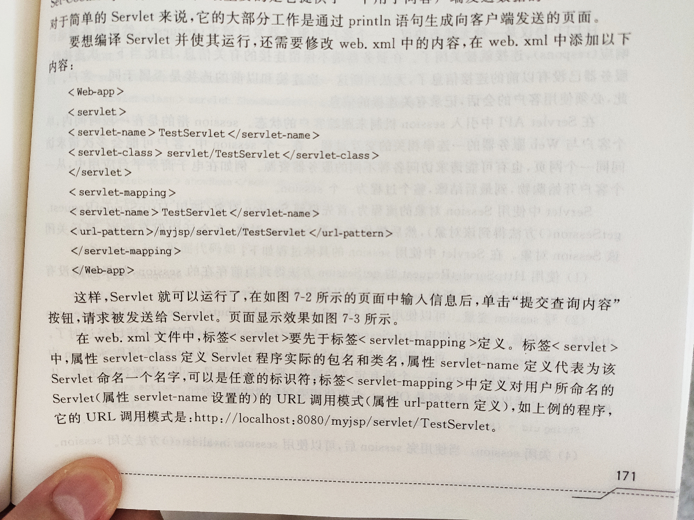

## servlet会话（session）


## servlet体系

```
	Servlet -- 接口
		|
	GenericServlet -- 抽象类
		|
	HttpServlet  -- 抽象类

	* GenericServlet：将Servlet接口中其他的方法做了默认空实现，只将service()方法作为抽象
		* 将来定义Servlet类时，可以继承GenericServlet，实现service()方法即可

	* HttpServlet：对http协议的一种封装，简化操作
		1. 定义类继承HttpServlet
		2. 复写doGet/doPost方法
```


## 生命周期

### 方法

Servlet是长期驻留在内存里的。某个Servlet一旦被加载，就会长期存在于服务器的内存里，直到服务器关闭。

1. 被创建：执行init方法，只执行一次

   * Servlet什么时候被创建？
     * 默认情况下，第一次被访问时，Servlet被创建
     * 可以配置执行Servlet的创建时机。
       ```xml
       在<servlet>标签下配置
       第一次被访问时创建，值为负数；在服务器启动时创建，值为0或正整数
            <!-- 数字越小表示该servlet的优先级越高，会先于其他自动装载的优先级较低的先装载  -->
       <Servlet>
       	<load-on-startup>1</load-on-startup>
       </Servlet>
       ```

   - Servlet的init方法，只执行一次，说明一个Servlet在内存中只存在一个对象，Servlet是单例的
     - 多个用户同时访问时，可能存在线程安全问题。
     - 解决：尽量不要在Servlet中定义成员变量。即使定义了成员变量，也不要对修改值

2. 提供服务：执行service方法，执行多次

   - 每次访问Servlet时，Service方法都会被调用一次。

3. 被销毁：执行destroy方法，只执行一次
   - Servlet被销毁时执行。服务器关闭时，Servlet被销毁
   - 只有服务器正常关闭时，才会执行destroy方法。
   - destroy方法在Servlet被销毁之前执行，一般用于释放资源

## Request

### 体系

request封装请求消息

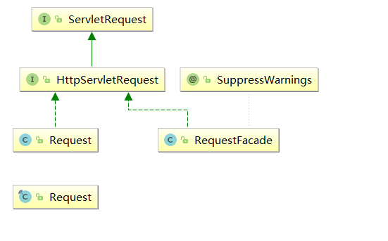

```java
/**
	Defines an object to provide client request information to a servlet. The servlet container creates a ServletRequest object and passes it as an argument to the servlet's service method.
	A ServletRequest object provides data including parameter name and values, attributes, and an input stream. Interfaces that extend ServletRequest can provide additional protocol-specific data (for example, HTTP data is provided by javax.servlet.http.HttpServletRequest.
*/
public interface ServletRequest {..}

/**
	Extends the ServletRequest interface to provide request information for HTTP servlets.
	The servlet container creates an HttpServletRequest object and passes it as an argument to the servlet's service methods (doGet, doPost, etc).
 */
public interface HttpServletRequest extends ServletRequest {..}

//Facade class that wraps a Coyote request object. All methods are delegated to the wrapped request.
public class RequestFacade implements HttpServletRequest {..}

//Wrapper object for the Coyote request.
public class Request implements HttpServletRequest {..}

//最底层的request，前面都是wrapper
/**
	This is a low-level, efficient representation of a server request. Most fields are GC-free, expensive operations are delayed until the user code needs the information. Processing is delegated to modules, using a hook mechanism. 
	This class is not intended for user code - it is used internally by tomcat for processing the request in the most efficient way. 
	Users ( servlets ) can access the information using a facade, which provides the high-level view of the request. Tomcat defines a number of attributes:
	"org.apache.tomcat.request" - allows access to the low-level request object in trusted applications
*/
public final class Request {..}
```

传到servlet的request和response

这几个对象是会复用的，不是每次请求都创建一个，当然多线程多对象


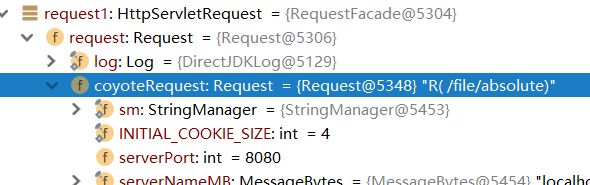

### 获取请求消息

##### 请求行

```java
//例如： GET /day14/demo1?name=zhangsan HTTP/1.1
String getMethod()  	// 获取请求方式 ：GET
String getContextPath() // 获取虚拟目录：/day14
String getServletPath() // 获取Servlet路径: /demo1
String getQueryString() // 获取get方式请求参数：name=zhangsan
    
// URI：统一资源标识符  URL: 统一资源定位符  
String getRequestURI()		// " /day14/demo1 "
StringBuffer getRequestURL()  // " http://localhost/day14/demo1 "

String getProtocol() // 获取协议及版本：HTTP/1.1
String getRemoteAddr() // 获取客户机的IP地址
```

##### 请求头

```java
String getHeader(String name):通过请求头的名称获取请求头的值
Enumeration<String> getHeaderNames():获取所有的请求头名称
```

##### 请求体

```java
只有POST请求方式，才有请求体，在请求体中封装了POST请求的请求参数
    	
1. 获取流对象
   BufferedReader getReader()：获取字符输入流，只能操作字符数据
   ServletInputStream getInputStream()：获取字节输入流，可以操作所有类型数据
2. 再从流对象中拿数据
```

##### 请求参数

```java
// 不论get还是post请求方式都可以使用下列方法来获取请求参数
 String getParameter(String name):根据参数名称获取参数值    username=zs&password=123
 String[] getParameterValues(String name):根据参数名称获取参数值的数组  hobby=xx&hobby=game
 Enumeration<String> getParameterNames():获取所有请求的参数名称
 Map<String,String[]> getParameterMap():获取所有参数的map集合
```

##### 乱码

在spring-mvc中有写

### 转发请求

```java
		2. 请求转发：一种在服务器内部的资源跳转方式
			1. 步骤：
				1. 通过request对象获取请求转发器对象：RequestDispatcher getRequestDispatcher(String path)
				2. 使用RequestDispatcher对象来进行转发：forward(ServletRequest request, ServletResponse response) 

			2. 特点：
				1. 浏览器地址栏路径不发生变化
				2. 只能转发到当前服务器内部资源中。
				3. 转发是一次请求
```

### 内部通信

```java
		3. 共享数据：
			* 域对象：一个有作用范围的对象，可以在范围内共享数据
			* request域：代表一次请求的范围，一般用于请求转发的多个资源中共享数据
			* 方法：
				1. void setAttribute(String name,Object obj):存储数据
				2. Object getAttitude(String name):通过键获取值
				3. void removeAttribute(String name):通过键移除键值对

		4. 获取ServletContext：
			* ServletContext getServletContext()
			String path = request.getSession().getServletContext().getRealPath("/uploads/");// 获取虚拟路径所在的目录的下一个目录的物理路径
			String realPath = servletContext.getRealPath("/WEB-INF/classes/敏感词汇.txt");
```

### parameter、attribute

parameter和Attribute

- **来源不同：**  	
  - 参数（parameter）是从客户端（浏览器）中由用户提供的，若是GET方法是从URL中 提供的，若是POST方法是从请求体（request body）中提供的； 
  -  属性（attribute）是服务器端的组件（JSP或者Servlet）利用requst.setAttribute（）设置的
- **操作不同：** 
  -  参数（parameter）的值只能读取不能修改，读取可以使用request.getParameter()读取； 
  -  属性（attribute）的值既可以读取亦可以修改，读取可以使用request.setAttribute()，设置可使用request.getAttribute()
- **数据类型不同：**  
  - 参数（parameter）不管前台传来的值语义是什么，在服务器获取时都以String类型看待，并且客户端的参数值只能是简单类型的值，不能是复杂类型，比如一个对象。 
  - 属性（attribute）的值可以是任意一个Object类型。 

## Response

### 体系

response对象是来设置动态响应消息，也就是写http响应报文

​	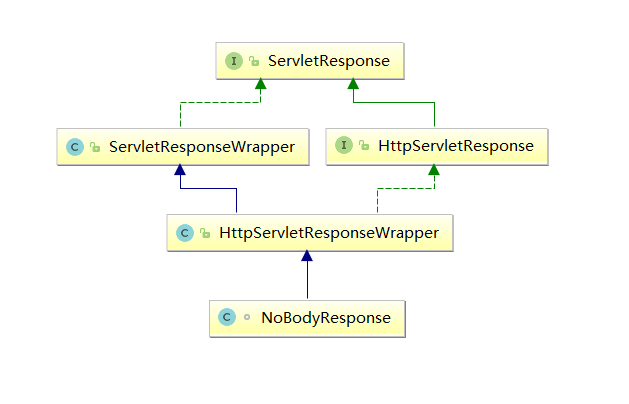

### 响应信息

```java
1. 设置响应行
    设置状态码：setStatus(int sc) 格式：HTTP/1.1 200 ok
2. 设置响应头
    setHeader(String name, String value) 	
3. 设置响应体：
    字符输出流：PrintWriter pw = response.getWriter()  //获取的流的默认编码是ISO-8859-1，需要设置该流的默认编码，告诉浏览器响应体使用的编码
    字节输出流：ServletOutputStream getOutputStream()

    response.setStatus(302);
	response.setHeader("location","/day15/responseDemo2");
	
//重定向
//实质等于response.setHeader("location","/day15/responseDemo2")，同时把response.getWriter().write(..)的东西从buffer中抹去，毕竟已经重定向，没必要输出无用信息
//因为浏览器事通过http响应报文来的header来决定是否再次请求
response.getWriter().write("播放电影...."); 
response.sendRedirect("/day15/responseDemo2"); //执行到这里上一句已经无效，


//写入报文主体到缓冲流
response.setContentType("text/html;charset=utf-8");
response.getWriter().write("播放电影....");//jsp中的内容也已经写入了，这里可以追加

//发送图片
ImageIO.write(image,"PNG",response.getOutputStream());
```

###  forward 和 redirect

* 重定向的特点: redirect
	1. 地址栏发生变化
	2. 重定向可以访问其他站点(服务器)的资源
	3. 重定向是两次请求。不能使用request对象来共享数据
	
* 转发的特点：forward
	1. 转发地址栏路径不变
	2. 转发只能访问当前服务器下的资源
	3. 转发是一次请求，可以使用request对象来共享数据
	
* 不能同时forward和redirect，报错

  ```java
  //以下是在filter中作处理的，之前request和response没有做过任何处理
  HttpServletResponse response2 =(HttpServletResponse) response;
  //重定向
  response2.sendRedirect("middle.jsp");
  
  //转发  报错java.lang.IllegalStateException: Cannot forward after response has been committed
  // req.getRequestDispatcher("main.jsp").forward(request, response);
  // req.getRequestDispatcher("main.jsp").include(request, response);
  System.out.println("end------doFilter--FirstFilter");
  ```

### 路径

	1. 相对路径：通过相对路径不可以确定唯一资源
		* 如：./index.html
		* 不以/开头，以.开头路径
		* 规则：找到当前资源和目标资源之间的相对位置关系
			* ./：当前目录
			* ../:后退一级目录
2. 绝对路径：通过绝对路径可以确定唯一资源
  * 如：http://localhost/day15/responseDemo2		/day15/responseDemo2
  * 以/开头的路径

3. 规则：判断定义的路径是给谁用的？判断请求将来从哪儿发出

   - 给客户端浏览器使用：需要加虚拟目录(项目的访问路径)，不然的话就是原域名，不能跨域

     ​	建议虚拟目录动态获取：request.getContextPath()

     ​	<a> , <form> 重定向...

   - 给服务器使用：不需要加虚拟目录

     ​	转发路径

## session

https://www.cnblogs.com/iammackong/archive/2013/03/23/2976707.html

### 介绍

主菜，会话，服务器端会话技术，在一次会话的多次请求间共享数据，将数据保存在服务器端的对象中。HttpSession。

从一个客户端的使用者打开浏览器并连接到服务器开始，到客户端的使用者关闭浏览器离开这个服务器结束，被称为一个会话。

当客户端的使用者访问服务器时，可能会在这个服务器的几个页面之间反复连接或反复刷新一个页面，服务器会通过session对象知道是否为同一个客户端使用者。

### 原理

当程序需要为某个客户端的请求创立一个session的时候，服务器首先检查这个客户端的请求里是否已包含了一个session标识，即**sessionID**。如果已包括一个sessionid则说明以前已经为此客户端创建过session，**服务器就依照sessionid把这个session检索出来使用**，如果客户端请求不包括sessionid，则为此客户端创建一个session并且生成一个与此session相关联的sessionid，**sessionid的值是唯一的**。

Session的实现是依赖于Cookie的。

### 获取使用

```java
	HttpSession session = request.getSession();

//在实际应用中使用频率最高的是存人变量与读取变量
Object getAttribute(String name)  
 void setAttribute(String name, Object value)
 void removeAttribute(String name)  
```

### 设置

```xml
	1. 当客户端关闭后，服务器不关闭，两次获取session是否为同一个？
		* 默认情况下。不是。
		* 如果需要相同，则可以创建Cookie,键为JSESSIONID，设置最大存活时间，让cookie持久化保存。
			 Cookie c = new Cookie("JSESSIONID",session.getId());
	         c.setMaxAge(60*60);
	         response.addCookie(c);

	2. 客户端不关闭，服务器关闭后，两次获取的session是同一个吗？
		* 不是同一个，但是要确保数据不丢失。tomcat自动完成以下工作
			* session的钝化：
				* 在服务器正常关闭之前，将session对象系列化到硬盘上
			* session的活化：
				* 在服务器启动后，将session文件转化为内存中的session对象即可。
			
	3. session什么时候被销毁？
		1. 服务器关闭
		2. session对象调用invalidate() 。
		3. session默认失效时间 30分钟
			选择性配置修改	
			<session-config>
		        <session-timeout>30</session-timeout>
		    </session-config>
```

###  session、Cookie

```java
1. session存储数据在服务器端，Cookie在客户端
2. session没有数据大小限制，Cookie有
3. session数据安全，Cookie相对于不安全
```
### **例子**

	1. 案例需求：
		1. 访问带有验证码的登录页面login.jsp
		2. 用户输入用户名，密码以及验证码。
			* 如果用户名和密码输入有误，跳转登录页面，提示:用户名或密码错误
			* 如果验证码输入有误，跳转登录页面，提示：验证码错误
			* 如果全部输入正确，则跳转到主页success.jsp，显示：用户名,欢迎您
	2. 分析：

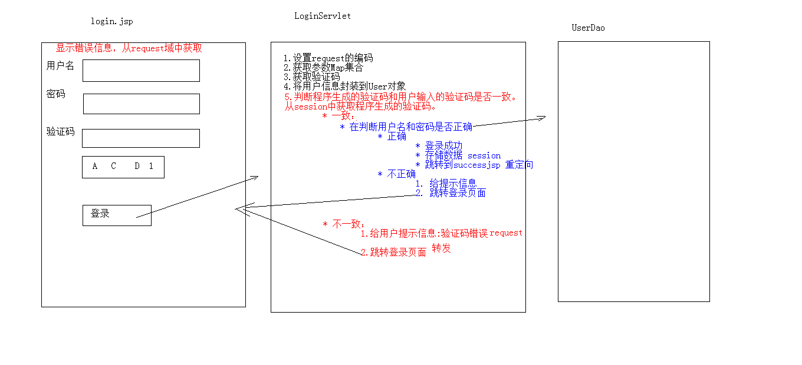


## ServletContext

### 介绍

代表整个web应用，可以和程序的容器(服务器)来通信。它开始于服务器的启动，消于服务器的关闭。在此期间，此对象将一直存在，不同用户可以对此对象的同一属性进行操乍．并且在任何地方对此对象属性的操作，都将影响到其他用户对此对象的访问。

有很多层包装。不止这两个类

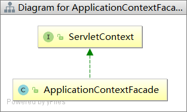

### 获取

```java
//1. 通过request对象获取
request.getServletContext();
//2. 通过HttpServlet获取，在servlet中使用
this.getServletContext();
```

### 全局Attributes

```java

	1. 获取MIME类型：
		* MIME类型:在互联网通信过程中定义的一种文件数据类型
			* 格式： 大类型/小类型   text/html		image/jpeg

		* 获取：String getMimeType(String file)  
	2. 域对象：共享数据，全局变量
		1. setAttribute(String name,Object value)
		2. getAttribute(String name)
		3. removeAttribute(String name)

		* ServletContext对象范围：所有用户所有请求的数据
     
     3. 全局配置   
            public String getInitParameter(String name);
```

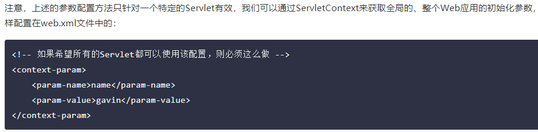

### 获取路径

```java
//获取文件的真实(服务器)路径
    1. 方法：String getRealPath(String path)  
    String b = context.getRealPath("/b.txt");//web目录下资源访问
    System.out.println(b);

    String c = context.getRealPath("/WEB-INF/c.txt");//WEB-INF目录下的资源访问
    System.out.println(c);

    String a = context.getRealPath("/WEB-INF/classes/a.txt");//src目录下的资源访问
    System.out.println(a);
```

## cookie

### 会话技术

一次会话，多次请求，但是每次请求都是无状态的，因此需要保存同一个会话的状态。

注意这个会话是逻辑上的，也就是业务上人为定义的。

```
1. 会话：一次会话中包含多次请求和响应。
	* 一次会话：浏览器第一次给服务器资源发送请求，会话建立，直到有一方断开为止
2. 功能：在一次会话的范围内的多次请求间，共享数据
3. 方式：
	1. 客户端会话技术：Cookie
	2. 服务器端会话技术：Session
```

### cookie

小甜点

客户端会话技术，将数据保存到客户端

### 快速入门

```java

	* 使用步骤：
		1. 创建Cookie对象，绑定数据
			* new Cookie(String name, String value) 
		2. 发送Cookie对象
			* response.addCookie(Cookie cookie) 
		3. 获取Cookie，拿到数据
			* Cookie[]  request.getCookies()  
3. 实现原理
	* 基于响应头set-cookie和请求头cookie实现

4. cookie的细节
	1. 一次可不可以发送多个cookie?
		* 可以
		* 可以创建多个Cookie对象，使用response调用多次addCookie方法发送cookie即可。
	2. cookie在浏览器中保存多长时间？
		1. 默认情况下，当浏览器关闭后，Cookie数据被销毁
		2. 持久化存储：
			* setMaxAge(int seconds)
				1. 正数：将Cookie数据写到硬盘的文件中。持久化存储。并指定cookie存活时间，时间到后，cookie文件自动失效
				2. 负数：默认值
				3. 零：删除cookie信息
	3. cookie能不能存中文？
		* 在tomcat 8 之前 cookie中不能直接存储中文数据。
			* 需要将中文数据转码---一般采用URL编码(%E3)
		* 在tomcat 8 之后，cookie支持中文数据。特殊字符还是不支持，建议使用URL编码存储，URL解码解析
	4. cookie共享问题？
		1. 假设在一个tomcat服务器中，部署了多个web项目，那么在这些web项目中cookie能不能共享？
			* 默认情况下cookie不能共享

			* setPath(String path):设置cookie的获取范围。默认情况下，设置当前的虚拟目录
				* 如果要共享，则可以将path设置为"/"
		2. 不同的tomcat服务器间cookie共享问题？
			* setDomain(String path):如果设置一级域名相同，那么多个服务器之间cookie可以共享
				* setDomain(".baidu.com"),那么tieba.baidu.com和news.baidu.com中cookie可以共享
```

### 特点和作用

```

	1. cookie存储数据在客户端浏览器
	2. 浏览器对于单个cookie 的大小有限制(4kb) 以及 对同一个域名下的总cookie数量也有限制(20个)

	* 作用：
		1. cookie一般用于存出少量的不太敏感的数据
		2. 在不登录的情况下，完成服务器对客户端的身份识别
```

### 编码问题

```java
解决Cookie无法保存中文字符串的问题
1.java.net包下的URLEncoder类来进行编码
public static encode(String string, String enco);
2.URLDecoder类进行解码
URLDecoder.decode(String string, String enco);
3.如果在登录界面把username和password的值设为了null，那么在登陆框就会出现null
最好是设为""
4.查找Cookie时,是按照k值进行查找的
-----------------------------------
使用URLEncoder（在java.net包下）解决无法在Cookie当中保存中文字符串问题：

String username = URLEncoder.encode(request.getParameter("username"),"utf-8");//编码，防止中文乱码
String password = URLEncoder.encode(request.getParameter("password"),"utf-8");//编码，防止中文乱码
```

**例子**

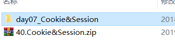

```
6. 案例：记住上一次访问时间
	1. 需求：
		1. 访问一个Servlet，如果是第一次访问，则提示：您好，欢迎您首次访问。
		2. 如果不是第一次访问，则提示：欢迎回来，您上次访问时间为:显示时间字符串

	2. 分析：
		1. 可以采用Cookie来完成
		2. 在服务器中的Servlet判断是否有一个名为lastTime的cookie
			1. 有：不是第一次访问
				1. 响应数据：欢迎回来，您上次访问时间为:2018年6月10日11:50:20
				2. 写回Cookie：lastTime=2018年6月10日11:50:01
			2. 没有：是第一次访问
				1. 响应数据：您好，欢迎您首次访问
				2. 写回Cookie：lastTime=2018年6月10日11:50:01
```

### HttpOnly属性

```
A：Tomcat 中维持Java webapp的Http会话是以Cookie形式实现的存储在服务端用户状态信息的；

B：服务端可以自定义建立Cookie对象及属性传递到客户端；
服务端建立的Cookie如果没有设置HttpOnly属性，则在客户端可以用js读取Cookie中的内容（客户端脚本可以读取Session Cookie内容进行诸如CSRF/XSS恶意http攻击）；
如果在Cookie中设置了"HttpOnly"属性，那么通过程序(JS脚本、Applet等)将无法读取到Cookie信息，这样能有效的防止XSS攻击。

在Java的web应用里，我们要保护的有JSESSIONID这个cookie，因为类似于tomact的容器就是用这个cookie来辨别你的服务器端会话的。

解决方法：
在tomcat6之前只能按照如下方法设置HttpOnly：
String sessionid = request.getSession().getId(); response.setHeader("SET-COOKIE", "JSESSIONID=" + sessionid + "; HttpOnly"); 

对于tomcat6支持对JSESSIONID的cookie设置HttpOnly, 具体的设置是在context.xml配置文件中进行设置的，为Context标签添加如下属性即可开启或禁止HttpOnly：
为HttpSession安全性考虑，防止客户端脚本读取Session Cookie内容进行诸如CSRF/XSS恶意http攻击，可在tomcat6的conf/context.xml配置文件中配置：
<Context useHttpOnly="true">
为自定义Cookie及属性添加HttpOnly属性，在Set-Cookie头部信息设置时可以添加“HttpOnly”

在tomcat7中默认是true，不用修改
tomcat7返回的js代码Set-Cookie: JSESSIONID=B7587AE3765290179B8CE4027545391F; Path=/cems2; HttpOnly

验证：
1，抓包验证任意http响应的内容，确实任意客户端请求的回应包含“Set-Cookie: JSESSIONID=717C91AF20E245B100EEFBF5EDDB29C3; Path=/monitor; HttpOnly”
2，在浏览器端调试js脚本，确实使用document.cookie读取在服务端设置的Cookie对象时，读取内容为空：document.cookie    ""
```

### Secure属性

当设置为true时，表示创建的 Cookie 会被以安全的形式向服务器传输，也就是只能在 HTTPS 连接中被浏览器传递到服务器端进行会话验证，如果是 HTTP 连接则不会传递该信息，所以不会被窃取到Cookie 的具体内容。

## ServletConfig

初始化方法就可以获取，xml也可以设置，只对特定的servlet有效

config对象是在一个Servlet初始化时向它传递信息用的，此信息包括Servlet初始化时所要用到的参数（通过属性名和属性值构成）以及服务器的有关信息（通过传递一个ServletContext对象）。c

可以用来获取设置。比如spring的xml文件位置，然后通过classloader获取初始化容器。

```java
//方法
getServlctContext()
getlnitParameter(String name)
getlnitParameterNames()
    
//例子
@WebServlet(value = "/userListServlet", initParams = {@WebInitParam(name = "hello", value = "aaaa")})
public class UserListServlet extends HttpServlet {
	@Override
	public void init(ServletConfig config) throws ServletException {
		System.out.println(config.getInitParameter("hello"));
		super.init(config);
	}
```

## 文件下载

```
* 文件下载需求：
	1. 页面显示超链接
	2. 点击超链接后弹出下载提示框
	3. 完成图片文件下载
	4. 验证码图片 
	5. ...

* 分析：
	1. 超链接指向的资源如果能够被浏览器解析，则在浏览器中展示，如果不能解析，则弹出下载提示框。不满足需求
	2. 任何资源都必须弹出下载提示框
	3. 使用响应头设置资源的打开方式：
		* content-disposition:attachment;filename=xxx

* 步骤：
	1. 定义页面，编辑超链接href属性，指向Servlet，传递资源名称filename
	2. 定义Servlet
		1. 获取文件名称
		2. 使用字节输入流加载文件进内存
		3. 指定response的响应头： content-disposition:attachment;filename=xxx
		4. 将数据写出到response.getOutputStream().write(...)
		
* 问题：
	* 中文文件问题
		* 解决思路：
			1. 获取客户端使用的浏览器版本信息
			2. 根据不同的版本信息，设置不同的filename的编码方式
```

## 代码

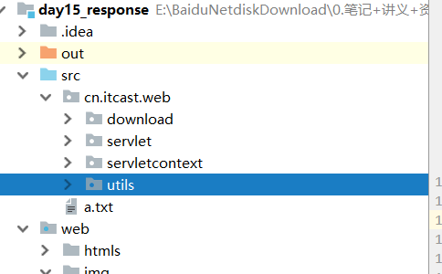


# Filter

javaWeb三大组件之一

## 书

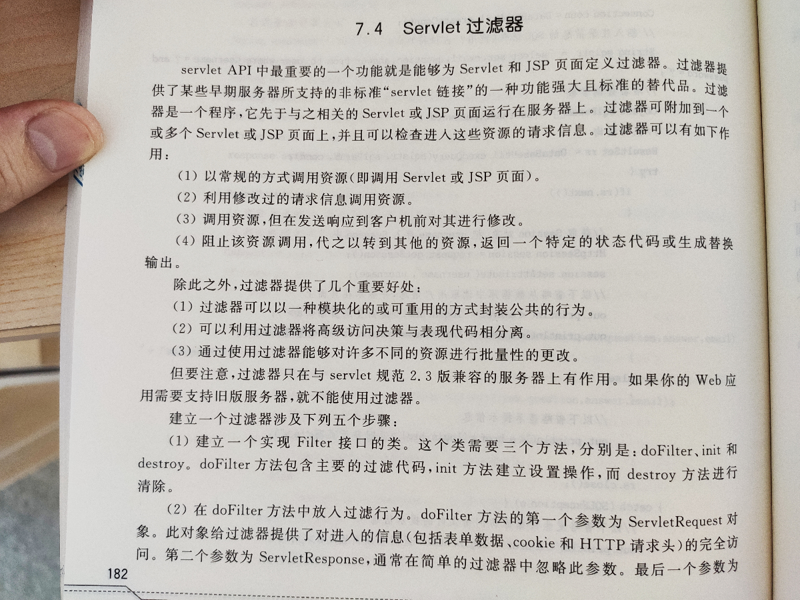


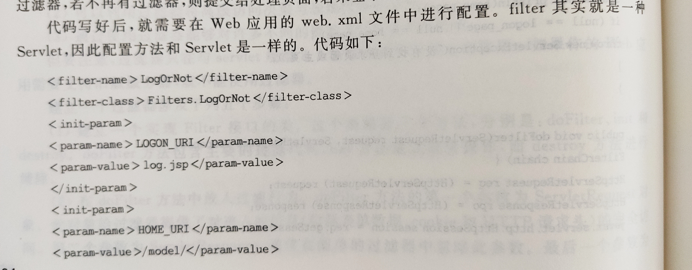

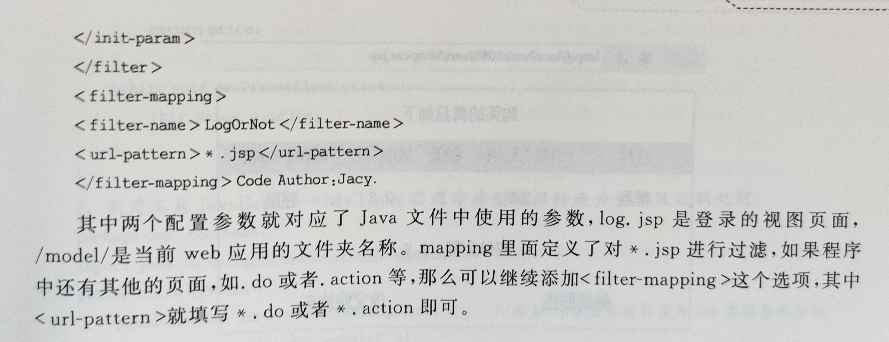

## 作用

* web中的过滤器：当访问服务器的资源时，过滤器可以将请求拦截下来，完成一些共同的特殊的功能。类似于切面编程
* 过滤器的作用：
	* 一般用于完成通用的操作。如：登录验证、统一编码处理、敏感字符过滤、统一修改response（响应报文）：比如 `response.getWriter().write("新的添加到末尾的text")`、舍弃之前的输入然后重定向（没有访问权限）、setCharacterEncoding()、统一压缩响应内容、转化图像格式
* 实际，按需使用，spring-mvc就不使用，直接一个dispathServlet就能包括了所有功能。spring-securty

## 快速入门

1. #### 步骤：
	
	1. 定义一个类，实现接口Filter
	2. 复写方法
	3. 配置拦截路径
		1. web.xml
		2. 注解
	
2. #### 代码：
	
	```java
	@WebFilter("/*")//访问所有资源之前，都会执行该过滤器
	public class FilterDemo1 implements Filter {
	    @Override
	    public void init(FilterConfig filterConfig) throws ServletException {
	
	    }
	
	    @Override
	    public void doFilter(ServletRequest servletRequest, ServletResponse servletResponse, FilterChain filterChain) throws IOException, ServletException {
	        System.out.println("filterDemo1被执行了....");
	        //放行
	        filterChain.doFilter(servletRequest,servletResponse);
	
	    }
	
	    @Override
	    public void destroy() {
	
	    }
	
	}
	```

## web.xml

```xml
<filter>
     <filter-name>demo1</filter-name>
     <filter-class>cn.itcast.web.filter.FilterDemo1</filter-class>
 </filter>
 <filter-mapping>
     <filter-name>demo1</filter-name>
	<!-- 拦截路径 -->
     <url-pattern>/*</url-pattern>
 </filter-mapping>
```

#### 过滤器配置详解

* ```
  * 拦截路径配置：
    1. 具体资源路径： /index.jsp   只有访问index.jsp资源时，过滤器才会被执行
    2. 拦截目录： /user/*	访问/user下的所有资源时，过滤器都会被执行
    3. 后缀名拦截： *.jsp		访问所有后缀名为jsp资源时，过滤器都会被执行
    4. 拦截所有资源：/*		访问所有资源时，过滤器都会被执行
  * 拦截方式配置：资源被访问的方式
    * 注解配置：
      * 设置dispatcherTypes属性，触发时机，也就是过滤器的类别
        1. REQUEST：默认值。浏览器直接请求资源
        2. FORWARD：转发访问资源
        3. INCLUDE：包含访问资源
        4. ERROR：错误跳转资源
        5. ASYNC：异步访问资源
    * web.xml配置
      * 设置<dispatcher></dispatcher>标签即可
  ```

#### 过滤器链(配置多个过滤器)

* ```
  * 执行顺序：如果有两个过滤器：过滤器1和过滤器2
    1. 过滤器1
    2. 过滤器2
    3. 资源执行
    4. 过滤器2
    5. 过滤器1 
  
  * 过滤器先后顺序问题：
    1. 注解配置：按照类名的字符串比较规则比较，值小的先执行
       * 如： AFilter 和 BFilter，AFilter就先执行了。
    2. web.xml配置： <filter-mapping>谁定义在上边，谁先执行
  ```

## @WebFilter

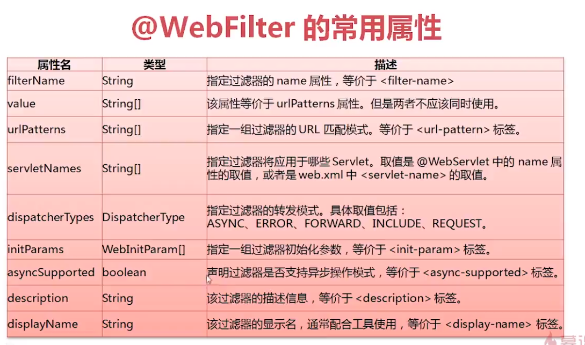


## 执行流程

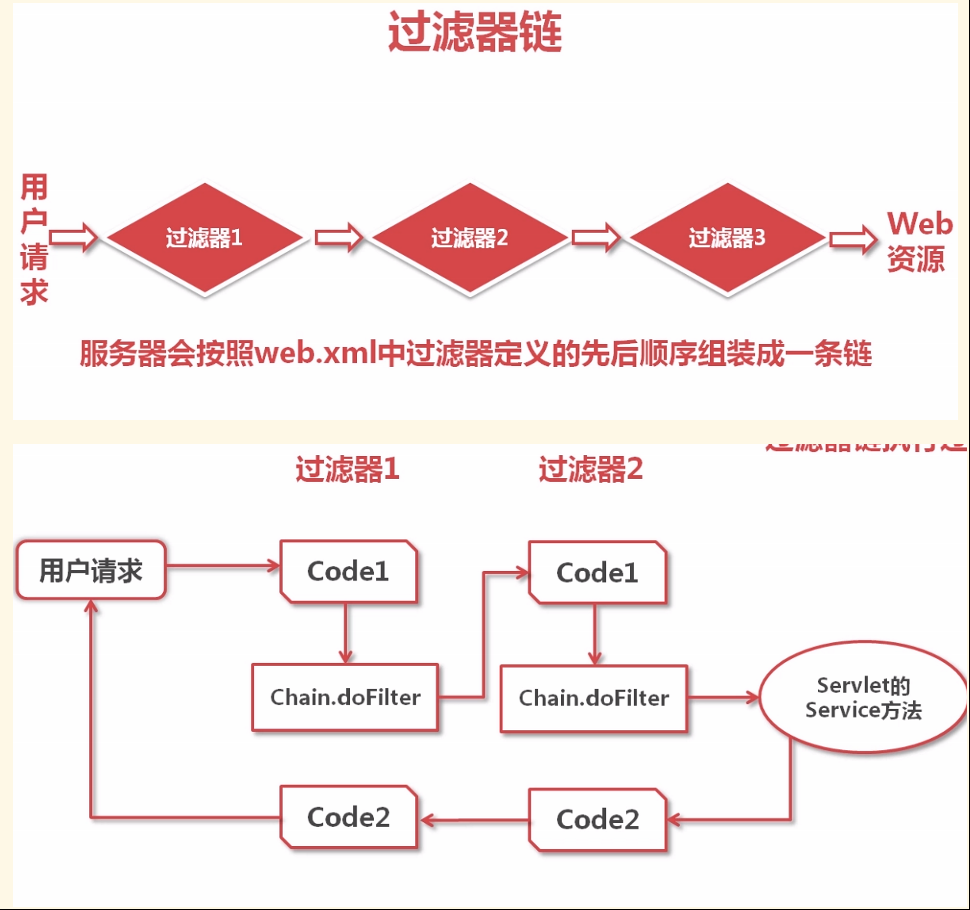


## 生命周期方法

1. init:在服务器启动后，会创建Filter对象，然后调用init方法。只执行一次。用于加载资源
2. doFilter:每一次请求被拦截资源时，会执行。执行多次
3. destroy:在服务器关闭后，Filter对象被销毁。如果服务器是正常关闭，则会执行destroy方法。只执行一次。用于释放资源

## 案例

1. 案例1_登录验证
	* 需求：
		1. 访问day17_case案例的资源。验证其是否登录
		2. 如果登录了，则直接放行。
		3. 如果没有登录，则跳转到登录页面，提示"您尚未登录，请先登录"。
	
2. 案例2_敏感词汇过滤
	
	```
	
	   * 需求：

	     1. 对day17_case案例录入的数据进行敏感词汇过滤
	     2. 敏感词汇参考《敏感词汇.txt》
	     3. 如果是敏感词汇，替换为 *** 
	
	   * 分析：
	
	     1. 对request对象进行增强。增强获取参数相关方法
	     2. 放行。传递代理对象
	
	   * 增强对象的功能：
	
	     * 设计模式：一些通用的解决固定问题的方式
	
	     1. 装饰模式
	     2. 代理模式
	        * 概念：
	          1. 真实对象：被代理的对象
	          2. 代理对象：
	          3. 代理模式：代理对象代理真实对象，达到增强真实对象功能的目的

	       * 实现方式：
	
	         1. 静态代理：有一个类文件描述代理模式
	
	           2. 动态代理：在内存中形成代理类
	
	               * 实现步骤：
	
	                 1. 代理对象和真实对象实现相同的接口
	                    2. 代理对象 = Proxy.newProxyInstance();
	                    3. 使用代理对象调用方法。
	                    4. 增强方法
	
	                 * 增强方式：
	                   1. 增强参数列表
	                   2. 增强返回值类型
	                   3. 增强方法体执行逻辑	
	
	
	```

## java

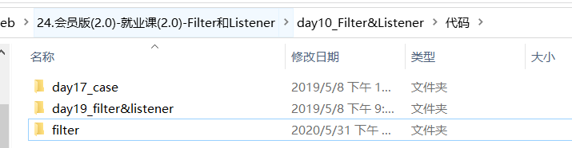

# listener

## 介绍

javaWeb的三大组件之一

```
	* 事件监听机制，监听一定有事件
		* 事件	：一件事情
		* 事件源 ：事件发生的地方
		* 监听器 ：一个对象
		* 注册监听：将事件、事件源、监听器绑定在一起。 当事件源上发生某个事件后，执行监听器代码
```

## EventListener

java内部的，所有的listener都要继承，不止javaEE

```java
package java.util;

/**
 * A tagging interface that all event listener interfaces must extend.
 * @since JDK1.1
 */
public interface EventListener {
}
```

## ServletContextListener

```java
//监听ServletContext对象的创建和销毁
public interface ServletContextListener extends EventListener {
 	void contextDestroyed(ServletContextEvent sce) 	// ServletContext对象被销毁之前会调用该方法
	void contextInitialized(ServletContextEvent sce)	// ServletContext对象创建后会调用该方法
}		
```

```xml
1. 定义一个类，实现ServletContextListener接口
2. 复写方法
3. 配置
	1. web.xml
        <listener>
            <listener-class>cn.itcast.web.listener.ContextLoaderListener</listener-class>	
        </listener>
        指定初始化参数<context-param>
    2. 注解：
   		 @WebListener
```

   				

