# 0. 总结

> Jsp 就是最终转化成servelet，里面的html被out出来，java代码继续运行（脚本和动作），指令用作设置

# 1. 静态页面和动态页面

> 

​     

# 2.  JSP

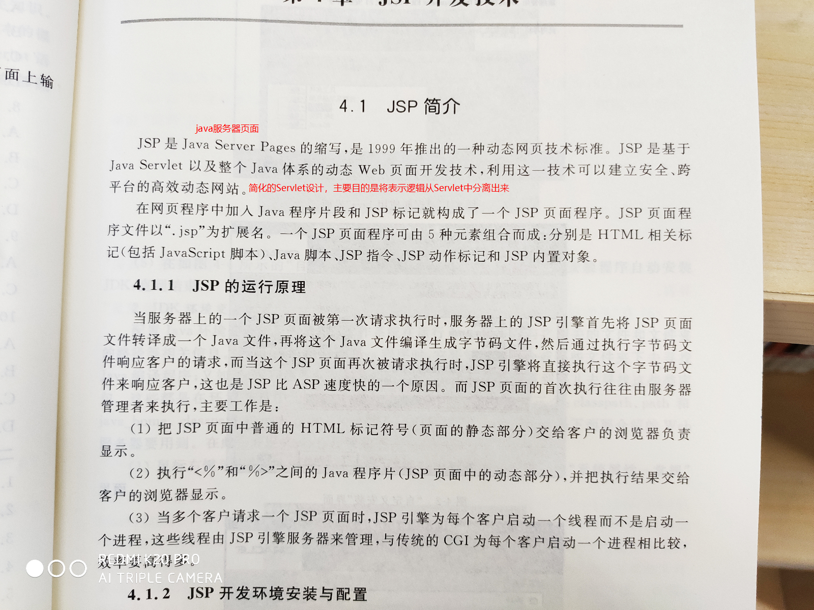

## 2.1 基本语法

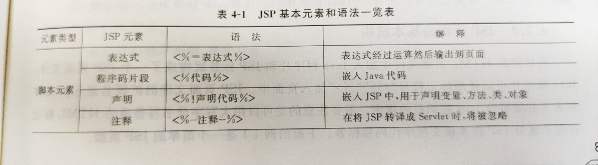


## 2.2 脚本


## 2.3 指令

> page指令，include指令，taglib指令（EL表达式）

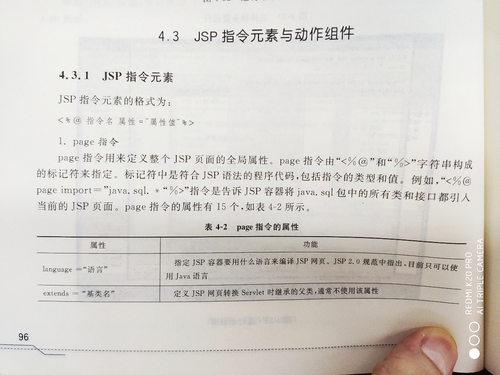


> pageEncoding没什么用，contentType就可以了，


## 2.4 动作


> flush参数用于减缓网页输出延迟，首先输出某些内容

## 2.5例子

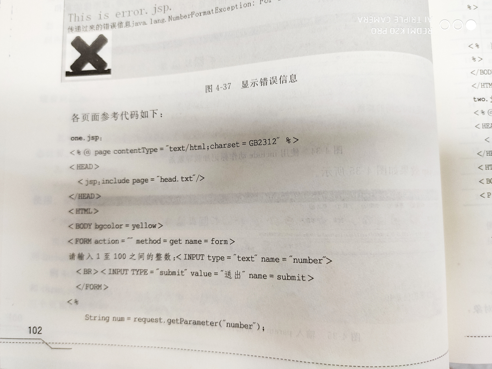


## 2.6 九大内置对象

### 0. 定义9个变量


只有url写明访问到该index的时候才会渲染，有很多类都没有

> 都是局部变量

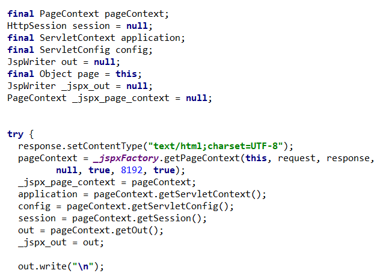

### 1. request

看Tomcat内部

### 2. response

看Tomcat内部

### 3. session

看Tomcat内部

### 4. application

就是ServletContext，换了个变量名字，同一个对象。

### 5. out

JSP特有的

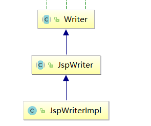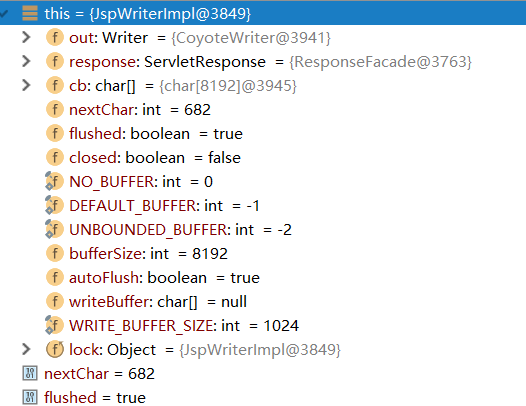

其实就是缓冲流。持有Writer指针。

flush后在底层使用`response.getWriter().write`写出，避免直接使用Writer加大io操作次数，影响性能；底层实现要看使用buff不，默认使用。

```
The actions and template data in a JSP page is written using the JspWriter object that is referenced by the implicit variable out which is initialized automatically using methods in the PageContext object.
This abstract class emulates some of the functionality found in the java.io.BufferedWriter and java.io.PrintWriter classes, however it differs in that it throws java.io.IOException from the print methods while PrintWriter does not.
Buffering
The initial JspWriter object is associated with the PrintWriter object of the ServletResponse in a way that depends on whether the page is or is not buffered. If the page is not buffered, output written to this JspWriter object will be written through to the PrintWriter directly, which will be created if necessary by invoking the getWriter() method on the response object. But if the page is buffered, the PrintWriter object will not be created until the buffer is flushed and operations like setContentType() are legal. Since this flexibility simplifies programming substantially, buffering is the default for JSP pages.
```

 [response.getWriter().write()与out.print()的区别](https://www.cnblogs.com/zhwl/p/3623688.html)

1. 首先介绍write()和print()方法的区别：

   - write()：仅支持输出字符类型数据，字符、字符数组、字符串等
   - print()：可以将各种类型（包括Object）的数据通过默认编码转换成bytes字节形式，这些字节都通过write(int c)方法被输出

2. 介绍response.getWriter()和out的区别：

   - out和response.getWriter的类不一样，一个是JspWriter，另一个是java.io.PrintWriter。

   - 执行原理不同:JspWriter相当于一个带缓存功能的printWriter，它不是直接将数据输出到页面，而是将数据刷新到response的缓冲区后再输出，

        response.getWriter直接输出数据（response.print()），所以（out.print）只能在其后输出。 

   - out为jsp的内置对象，刷新jsp页面，自动初始化获得out对象，所以使用out对象是需要刷新页面的，
         而response.getWriter()响应信息通过out对象输出到网页上，当响应结束时它自动被关闭，与jsp页面无关，无需刷新页面
         形象的比喻：当我们调用response.getWriter()这个对象同时获得了网页的画笔，这时你就可以通过这个画笔在网页上画任何你想要显示的东西。

   - out的print()方法和println()方法在缓冲区溢出并且没有自动刷新时候会产生ioexception，
         而response.getWrite()方法的print和println中都是抑制ioexception异常的，不会有ioexception 

  out.println(""); 方法并不能也页面布局换行，只能领html代码换行，要实现页面布局换行可以：out.println("</br>");

> 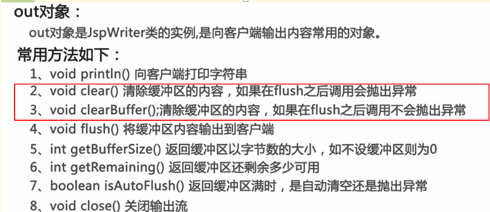  
>
> 

### 6. page

page对象就是指向当前JSP页面本身，有点类似类中的this指针，它是java.lang.Object。用来获取内部field，

### 7. config

就是 ServletConfig

### 8. exception，pageContext

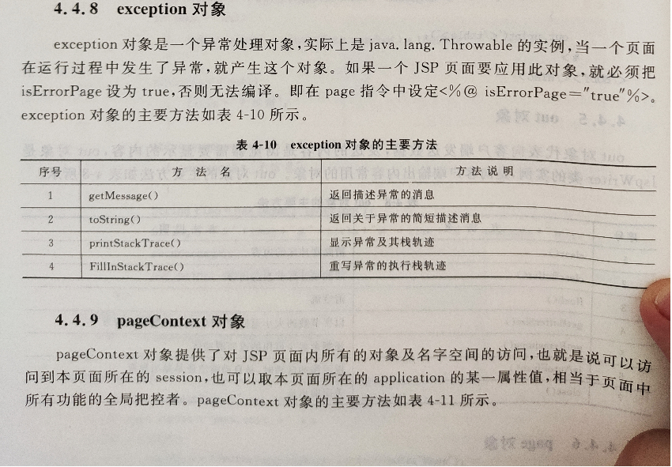

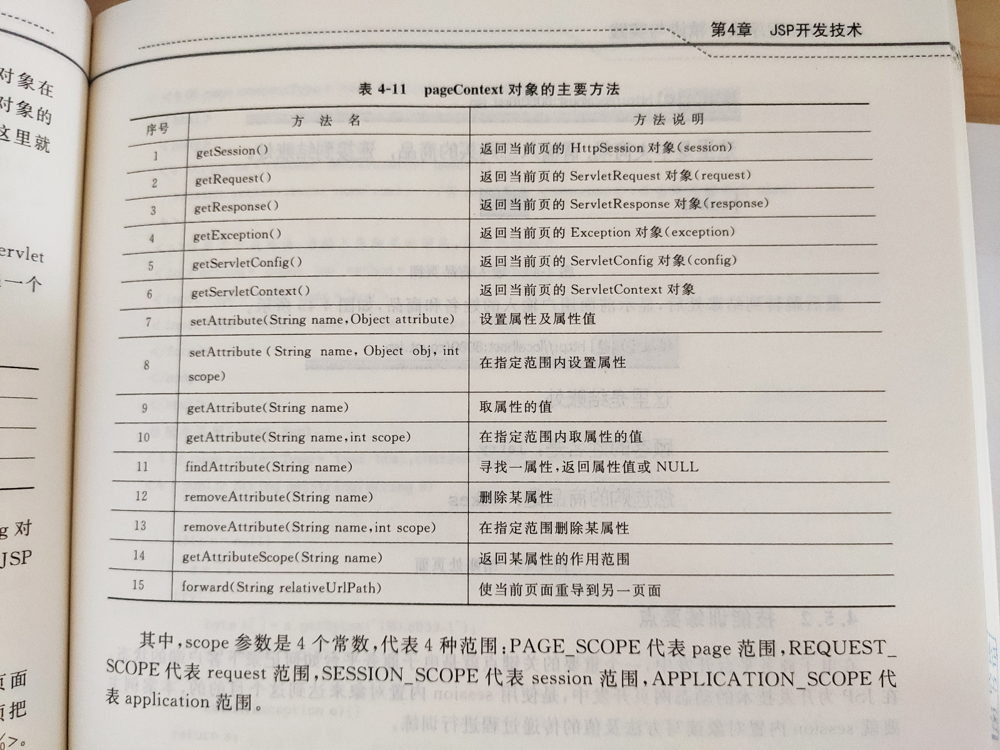	

# Javabean


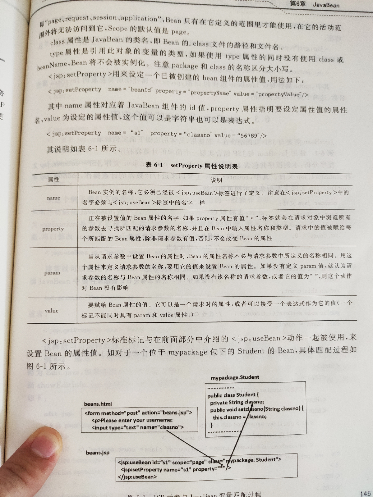

# 生命周期

jsp修改后，request再重新请求会重新编译一个新的servlet

 


![当 sp 文 亻 牛 第 一 次 被 处 理 时 ， jsp 引 掌 首 先 吧 p 文 亻 牛 转 化 成 一 个 java 源 文 亻 牛 ， 如 果 在 转 化 过 程 中 发 生 错 误 的  话 ， 会 立 刻 中 止 ， 同 时 向 服 务 器 端 和 客 户 端 发 法 错 误 信 患 报 告 如 果 转 化 成 了 ， 就 会 产 生 一 个 class 类 。  然 后 冉 创 建 一 个 Servlet 对 象 ， 首 先 扌 sp | nitO 方 氵 去 进 行 初 始 化 操 作 ， 由 于 整 个 执 行 过 sp 《 nitO 方 氵 去 只 执  行 一 次 ， 所 以 可 以 在 汶 个 方 氵 去 中 进 行 一 匙 必 要 的 操 作 比 如 j 与 妾 数 啹 库 ， 初 始 化 部 分 参 数 等 等 接 巷 执 行 一 jsp  Service0 方 法， 对 客 户 端 的 清 甚 行 处 理 ， 对 莓 一 个 情 求 会 创 建 一 个 线 程 ， ， 如 果 由 于 某 种 原 因 蚴 sp 双  页 关 闭 或 者 毁 的 话 会 执 行 pDestroyO 方 法 。 ](img/clip_image003-1580720519864.png)


http://www.runoob.com/jsp/jsp-life-cycle.html 菜鸟

https://blog.csdn.net/Evankaka/article/details/46673051

[https://www.google.com/search?q=jsp%E9%A1%B5%E9%9D%A2%E7%94%9F%E5%91%BD%E5%91%A8%E6%9C%9F%E6%98%AF%E4%BB%80%E4%B9%88&oq=jsp%E9%A1%B5%E9%9D%A2%E7%94%9F%E5%91%BD%E5%91%A8%E6%9C%9F%E6%98%AF%E4%BB%80%E4%B9%88&aqs=chrome..69i57.5539j0j0&sourceid=chrome&ie=UTF-8](https://www.google.com/search?q=jsp页面生命周期是什么&oq=jsp页面生命周期是什么&aqs=chrome..69i57.5539j0j0&sourceid=chrome&ie=UTF-8)

用自带的tomcat服务器怎么去查看他的生命周期？

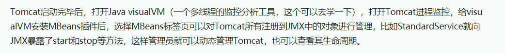

# 4个作用域

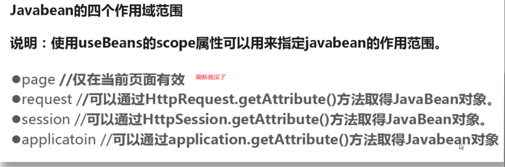


# EL表达式

	1. 概念：Expression Language 表达式语言
	2. 作用：替换和简化jsp页面中java代码的编写
	3. 语法：${表达式}
	4. 注意：
		* jsp默认支持el表达式的。如果要忽略el表达式
			1. 设置jsp中page指令中：isELIgnored="true" 忽略当前jsp页面中所有的el表达式
			2. \${表达式} ：忽略当前这个el表达式
	5. 使用：
		1. 运算：
			* 运算符：
				1. 算数运算符： + - * /(div) %(mod)
				2. 比较运算符： > < >= <= == !=
				3. 逻辑运算符： &&(and) ||(or) !(not)
				4. 空运算符： empty
					* 功能：用于判断字符串、集合、数组对象是否为null或者长度是否为0
					* ${empty list}:判断字符串、集合、数组对象是否为null或者长度为0
					* ${not empty str}:表示判断字符串、集合、数组对象是否不为null 并且 长度>0
		2. 获取值
			1. el表达式只能从域对象中获取值
			2. 语法：
				1. ${域名称.键名}：从指定域中获取指定键的值
					* 域名称：
						1. pageScope		--> pageContext
						2. requestScope 	--> request
						3. sessionScope 	--> session
						4. applicationScope --> application（ServletContext）
					* 举例：在request域中存储了name=张三
					* 获取：${requestScope.name}
	
				2. ${键名}：表示依次从最小的域中查找是否有该键对应的值，直到找到为止。
				3. 获取对象、List集合、Map集合的值
					1. 对象：${域名称.键名.属性名}
						* 本质上会去调用对象的getter方法
	
					2. List集合：${域名称.键名[索引]}
	
					3. Map集合：
						* ${域名称.键名.key名称}
						* ${域名称.键名["key名称"]}
		3. 隐式对象：
			* el表达式中有11个隐式对象
			* pageContext：
				* 获取jsp其他八个内置对象
					* ${pageContext.request.contextPath}：动态获取虚拟目录


# JSTL标签库

	1. 概念：JavaServer Pages Tag Library  JSP标准标签库
		* 是由Apache组织提供的开源的免费的jsp标签		<标签>
	
	2. 作用：用于简化和替换jsp页面上的java代码		
	
	3. 使用步骤：
		1. 导入jstl相关jar包
		2. 引入标签库：taglib指令：  <%@ taglib %>
		3. 使用标签
	
	4. 常用的JSTL标签
		1. if:相当于java代码的if语句
			1. 属性：
	            * test 必须属性，接受boolean表达式
	                * 如果表达式为true，则显示if标签体内容，如果为false，则不显示标签体内容
	                * 一般情况下，test属性值会结合el表达式一起使用
	   		 2. 注意：
	       		 * c:if标签没有else情况，想要else情况，则可以在定义一个c:if标签
		2. choose:相当于java代码的switch语句
			1. 使用choose标签声明         			相当于switch声明
	        2. 使用when标签做判断         			相当于case
	        3. 使用otherwise标签做其他情况的声明    	相当于default
	
		3. foreach:相当于java代码的for语句
	
	5. 练习：
		* 需求：在request域中有一个存有User对象的List集合。需要使用jstl+el将list集合数据展示到jsp页面的表格table中

# java代码

看ide和tomcat的md文件的项目

```HTML
<%@ page contentType="text/html;charset=utf-8" language="java" %>

<!DOCTYPE html>
<html lang="zh-CN">
    <head>
        <meta charset="utf-8"/>
        <meta http-equiv="X-UA-Compatible" content="IE=edge"/>
        <meta name="viewport" content="width=device-width, initial-scale=1"/>
        <title>首页1</title>

        <!-- 1. 导入CSS的全局样式 -->
        <link href="css/bootstrap.min.css" rel="stylesheet">
        <!-- 2. jQuery导入，建议使用1.9以上的版本 -->
        <script src="js/jquery-2.1.0.min.js"></script>
        <!-- 3. 导入bootstrap的js文件 -->
        <script src="js/bootstrap.min.js"></script>
        <script type="text/javascript">
        </script>
    </head>
    <body>
        <div align="center">
            <a
                    href="${pageContext.request.contextPath}/userListServlet"
                    style="text-decoration:none;font-size:33px">查询所有用户信息
            </a>

            <jsp:useBean id="page1" class="cn.itcast.domain.User" scope="page"/>
            <% System.out.println(page1.hashCode()); %>
            <% JspWriter out1 = pageContext.getOut();
                System.out.println(out);
                System.out.println(out1);
            %>


        </div>
    </body>
</html>
```

```JAVA
/*
 * Generated by the Jasper component of Apache Tomcat
 * Version: Apache Tomcat/9.0.17
 * Generated at: 2020-02-03 04:07:04 UTC
 * Note: The last modified time of this file was set to
 *       the last modified time of the source file after
 *       generation to assist with modification tracking.
 */
package org.apache.jsp;

import javax.servlet.ServletException;
import javax.servlet.http.HttpServletResponse;
import javax.servlet.jsp.JspWriter;

public final class index_jsp extends org.apache.jasper.runtime.HttpJspBase
		implements org.apache.jasper.runtime.JspSourceDependent,
		org.apache.jasper.runtime.JspSourceImports {

	private static final javax.servlet.jsp.JspFactory _jspxFactory =
			javax.servlet.jsp.JspFactory.getDefaultFactory();

	private static java.util.Map<java.lang.String, java.lang.Long> _jspx_dependants;

	private static final java.util.Set<java.lang.String> _jspx_imports_packages;

	private static final java.util.Set<java.lang.String> _jspx_imports_classes;

	static {
		_jspx_imports_packages = new java.util.HashSet<>();
		_jspx_imports_packages.add("javax.servlet");
		_jspx_imports_packages.add("javax.servlet.http");
		_jspx_imports_packages.add("javax.servlet.jsp");
		_jspx_imports_classes = null;
	}

	private volatile javax.el.ExpressionFactory _el_expressionfactory;
	private volatile org.apache.tomcat.InstanceManager _jsp_instancemanager;

	public java.util.Map<java.lang.String, java.lang.Long> getDependants() {
		return _jspx_dependants;
	}

	public java.util.Set<java.lang.String> getPackageImports() {
		return _jspx_imports_packages;
	}

	public java.util.Set<java.lang.String> getClassImports() {
		return _jspx_imports_classes;
	}

	public javax.el.ExpressionFactory _jsp_getExpressionFactory() {
		if (_el_expressionfactory == null) {
			synchronized (this) {
				if (_el_expressionfactory == null) {
					_el_expressionfactory = _jspxFactory.getJspApplicationContext(getServletConfig().getServletContext()).getExpressionFactory();
				}
			}
		}
		return _el_expressionfactory;
	}

	public org.apache.tomcat.InstanceManager _jsp_getInstanceManager() {
		if (_jsp_instancemanager == null) {
			synchronized (this) {
				if (_jsp_instancemanager == null) {
					_jsp_instancemanager = org.apache.jasper.runtime.InstanceManagerFactory.getInstanceManager(getServletConfig());
				}
			}
		}
		return _jsp_instancemanager;
	}

	public void _jspInit() {
	}

	public void _jspDestroy() {
	}

	public void _jspService(final javax.servlet.http.HttpServletRequest request, final javax.servlet.http.HttpServletResponse response)
			throws java.io.IOException, javax.servlet.ServletException {

		if (!javax.servlet.DispatcherType.ERROR.equals(request.getDispatcherType())) {
			final java.lang.String _jspx_method = request.getMethod();
			if ("OPTIONS".equals(_jspx_method)) {
				response.setHeader("Allow", "GET, HEAD, POST, OPTIONS");
				return;
			}
			if (!"GET".equals(_jspx_method) && !"POST".equals(_jspx_method) && !"HEAD".equals(_jspx_method)) {
				response.setHeader("Allow", "GET, HEAD, POST, OPTIONS");
				response.sendError(HttpServletResponse.SC_METHOD_NOT_ALLOWED, "JSP 只允许 GET、POST 或 HEAD。Jasper 还允许 OPTIONS");
				return;
			}
		}

		final javax.servlet.jsp.PageContext pageContext;
		javax.servlet.http.HttpSession session = null;
		final javax.servlet.ServletContext application;
		final javax.servlet.ServletConfig config;
		javax.servlet.jsp.JspWriter out = null;
		final java.lang.Object page = this;
		javax.servlet.jsp.JspWriter _jspx_out = null;
		javax.servlet.jsp.PageContext _jspx_page_context = null;

		try {
			response.setContentType("text/html;charset=utf-8");
			pageContext = _jspxFactory.getPageContext(this, request, response,
					null, true, 8192, true);
			_jspx_page_context = pageContext;
			application = pageContext.getServletContext();
			config = pageContext.getServletConfig();
			session = pageContext.getSession();
			out = pageContext.getOut();
			_jspx_out = out;

			out.write("\n");
			out.write("\n");
			out.write("<!DOCTYPE html>\n");
			out.write("<html lang=\"zh-CN\">\n");
			out.write("<head>\n");
			out.write("  <meta charset=\"utf-8\"/>\n");
			out.write("  <meta http-equiv=\"X-UA-Compatible\" content=\"IE=edge\"/>\n");
			out.write("  <meta name=\"viewport\" content=\"width=device-width, initial-scale=1\"/>\n");
			out.write("  <title>首页1</title>\n");
			out.write("\n");
			out.write("  <!-- 1. 导入CSS的全局样式 -->\n");
			out.write("  <link href=\"css/bootstrap.min.css\" rel=\"stylesheet\">\n");
			out.write("  <!-- 2. jQuery导入，建议使用1.9以上的版本 -->\n");
			out.write("  <script src=\"js/jquery-2.1.0.min.js\"></script>\n");
			out.write("  <!-- 3. 导入bootstrap的js文件 -->\n");
			out.write("  <script src=\"js/bootstrap.min.js\"></script>\n");
			out.write("  <script type=\"text/javascript\">\n");
			out.write("  </script>\n");
			out.write("</head>\n");
			out.write("<body>\n");
			out.write("<div align=\"center\">\n");
			out.write("  <a\n");
			out.write("          href=\"");
			out.write((java.lang.String) org.apache.jasper.runtime.PageContextImpl.proprietaryEvaluate("${pageContext.request.contextPath}", java.lang.String.class, (javax.servlet.jsp.PageContext) _jspx_page_context, null));
			out.write("/userListServlet\" style=\"text-decoration:none;font-size:33px\">查询所有用户信息\n");
			out.write("  </a>\n");
			out.write("\n");
			out.write("  ");
			cn.itcast.domain.User page1 = null;
			page1 = (cn.itcast.domain.User) _jspx_page_context.getAttribute("page1", javax.servlet.jsp.PageContext.PAGE_SCOPE);
			if (page1 == null) {
				page1 = new cn.itcast.domain.User();
				_jspx_page_context.setAttribute("page1", page1, javax.servlet.jsp.PageContext.PAGE_SCOPE);
			}
			out.write('\n');
			out.write(' ');
			out.write(' ');
			System.out.println(page1.hashCode());
			out.write("\n");
			out.write("    ");
			JspWriter out1 = pageContext.getOut();
			System.out.println(out);
			System.out.println(out1);

			out.write("\n");
			out.write("\n");
			out.write("\n");
			out.write("\n");
			out.write("</div>\n");
			out.write("</body>\n");
			out.write("</html>");
		} catch (java.lang.Throwable t) {
			if (!(t instanceof javax.servlet.jsp.SkipPageException)) {
				out = _jspx_out;
				if (out != null && out.getBufferSize() != 0)
					try {
						if (response.isCommitted()) {
							out.flush();
						} else {
							out.clearBuffer();
						}
					} catch (java.io.IOException e) {
					}
				if (_jspx_page_context != null) _jspx_page_context.handlePageException(t);
				else throw new ServletException(t);
			}
		} finally {
			_jspxFactory.releasePageContext(_jspx_page_context);
		}
	}
}

```

