[IntelliJ IDEA 没有Tomcat 也没有Application Servers的解决办法](https://blog.csdn.net/qq_25595025/article/details/82050927)

# 2. 工作项目添加依赖

> tomcat依赖（provide），lib依赖（compile依赖）

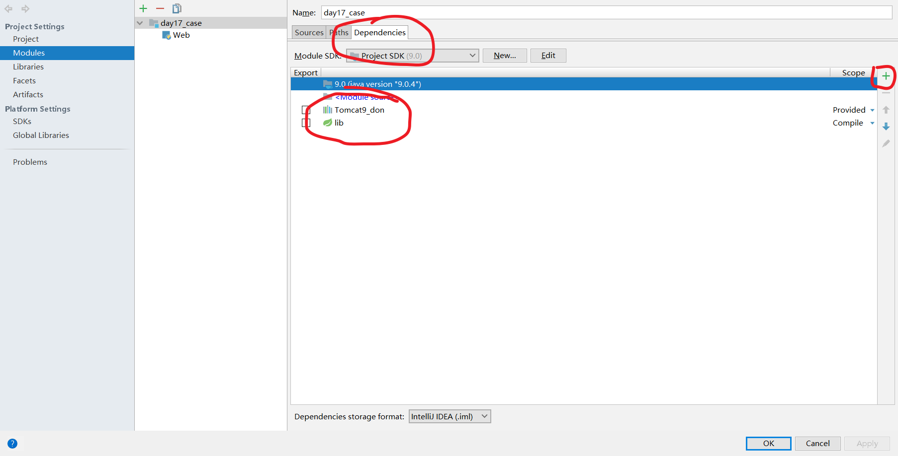

主要是两个jar包依赖，写业务代码需要用到的，令程序编译不报错，并且有提示功能。实际运行的时候并不在IDEA中运行，而是在tomcat中运行，因此scope是Provided，不是compile。


# 3. 添加web项目

​	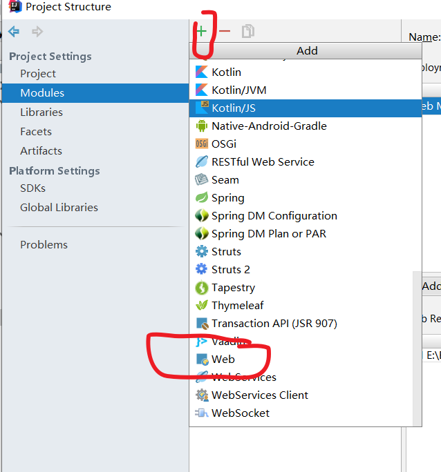

# 4. 配置web项目

> 4个地方
>
> descriptor：web.xml文件
>
> resource：WEB-INF上一层的web，有很多静态资源。
>
> source root：很好理解，.class文件
>
> IDEA会把这些web项目的各个配件build成一个web项目

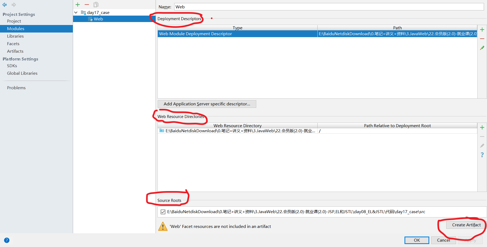

# 5. 创建artifact

artifact是就是tomcat部署的项目，artifact的名字可以和module的名字不一样，那么build和部署的生存的名字都不一样。

注意添加依赖

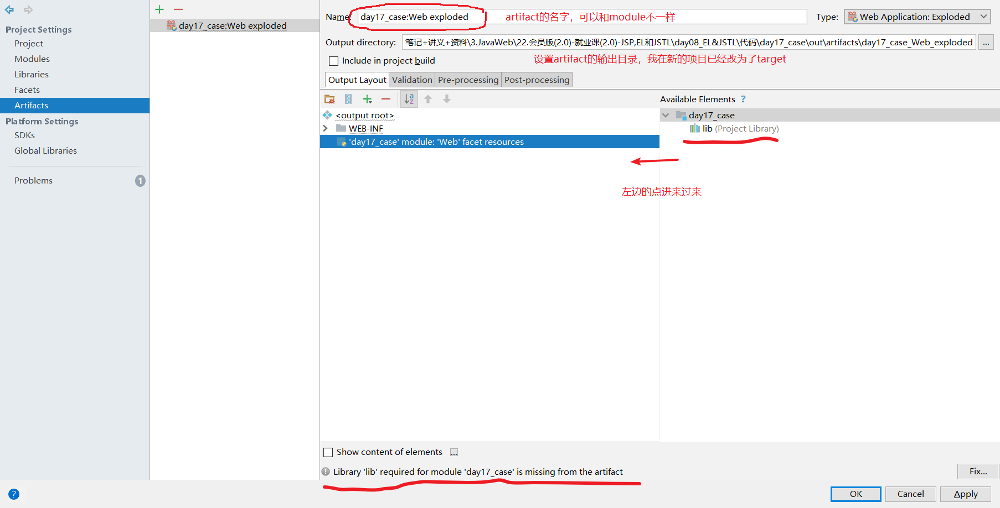

# 6. 配置artifact

tomcat用什么形式部署，通常测试期间使用exploded

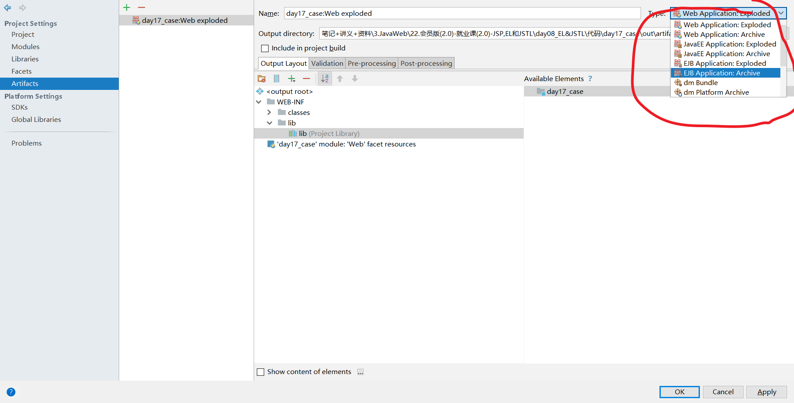

# 7. 配置tomcat服务器

部署项目

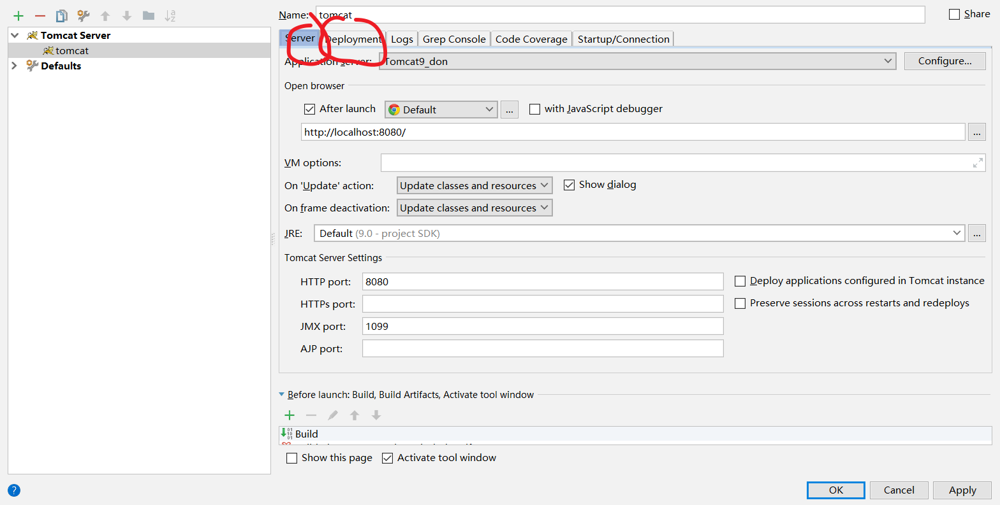

# 8.目录

## IDEA工作空间

就是写代码的地方，主要有 src 文件夹（动态）和 web resources文件夹（静态）（都可以择一省略）。

外部jar包需要引入lib文件夹中，一边一起打包

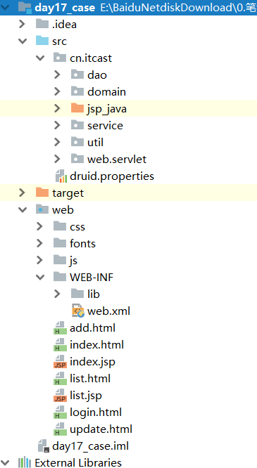

## webapps

src所处的目录的是工作空间目录，artifact是部署的web项目所在的路径，上面可以设置，production是编译的.class文件，也就是

```java
String path = request.getSession().getServletContext().getRealPath("/uploads/");// 获取虚拟路径所在的目录的下一个目录的物理路径
```

​	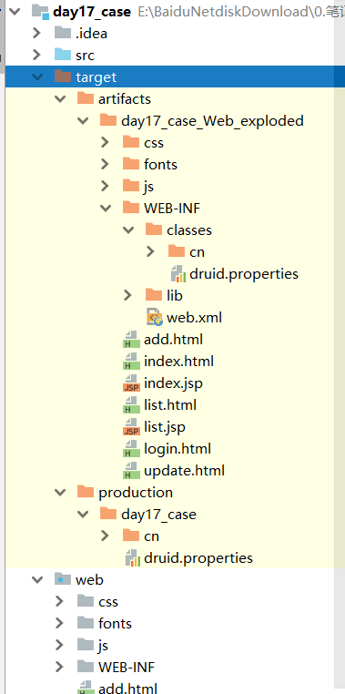

## work文件夹

临时渲染的ejsp的java和class文件在work中，这个文件夹的位置属于IDEA设置的。开启服务器时有得提示。

该项目的日志文件在logs，${catalina_home}的logs目录是使用bat文件启动的项目的日志文件。

临时配置文件在conf里面，从${catalina_home}中复制过来

```log
03-Feb-2020 12:01:21.829 信息 [main] org.apache.catalina.startup.VersionLoggerListener.log Server.服务器版本:        Apache Tomcat/9.0.17
03-Feb-2020 12:01:21.832 信息 [main] org.apache.catalina.startup.VersionLoggerListener.log Server.构建:          Mar 13 2019 15:55:27 UTC
03-Feb-2020 12:01:21.832 信息 [main] org.apache.catalina.startup.VersionLoggerListener.log Server version number: 9.0.17.0
03-Feb-2020 12:01:21.832 信息 [main] org.apache.catalina.startup.VersionLoggerListener.log OS Name:               Windows 10
03-Feb-2020 12:01:21.832 信息 [main] org.apache.catalina.startup.VersionLoggerListener.log OS.版本:            10.0
03-Feb-2020 12:01:21.832 信息 [main] org.apache.catalina.startup.VersionLoggerListener.log 结.造:          amd64
03-Feb-2020 12:01:21.832 信息 [main] org.apache.catalina.startup.VersionLoggerListener.log Java 环境变量:             C:\Program Files\Java\jdk1.8.0_202\jre
03-Feb-2020 12:01:21.832 信息 [main] org.apache.catalina.startup.VersionLoggerListener.log JVM 版本:           1.8.0_202-b08
03-Feb-2020 12:01:21.832 信息 [main] org.apache.catalina.startup.VersionLoggerListener.log JVM.供应商:            Oracle Corporation
03-Feb-2020 12:01:21.832 信息 [main] org.apache.catalina.startup.VersionLoggerListener.log CATALINA_BASE:         C:\Users\TJR_S\.IntelliJIdea2017.3\system\tomcat\Unnamed_day17_case_2
03-Feb-2020 12:01:21.832 信息 [main] org.apache.catalina.startup.VersionLoggerListener.log CATALINA_HOME:         E:\apache-tomcat-9.0.17
03-Feb-2020 12:01:21.833 信息 [main] org.apache.catalina.startup.VersionLoggerListener.log Command line argument: -Djava.util.logging.config.file=C:\Users\TJR_S\.IntelliJIdea2017.3\system\tomcat\Unnamed_day17_case_2\conf\logging.properties
03-Feb-2020 12:01:21.833 信息 [main] org.apache.catalina.startup.VersionLoggerListener.log Command line argument: -Djava.util.logging.manager=org.apache.juli.ClassLoaderLogManager
03-Feb-2020 12:01:21.833 信息 [main] org.apache.catalina.startup.VersionLoggerListener.log Command line argument: -agentlib:jdwp=transport=dt_socket,address=127.0.0.1:57971,suspend=y,server=n

```


# 热部署更新项目


​	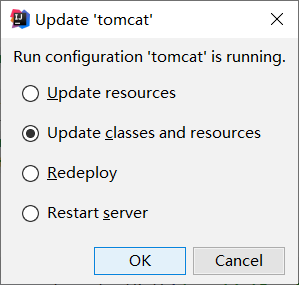


> 涉及类和jsp的都要update classes
>
> 静态只需要resource

# IDEA与tomcat的相关配置

```
1. IDEA会为每一个tomcat部署的项目单独建立一份配置文件
	* 查看控制台的log：Using CATALINA_BASE:   "C:\Users\fqy\.IntelliJIdea2018.1\system\tomcat\_itcast"

2. 工作空间项目    和     tomcat部署的web项目
	* tomcat真正访问的是“tomcat部署的web项目”，"tomcat部署的web项目"对应着"工作空间项目" 的web目录下的所有资源
	* WEB-INF目录下的资源不能被浏览器直接访问。
```

# 改用Maven

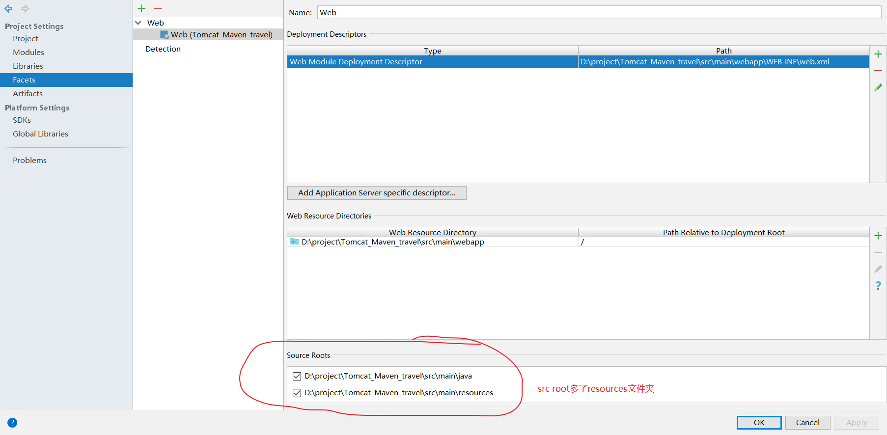

子级目录结构还是一样

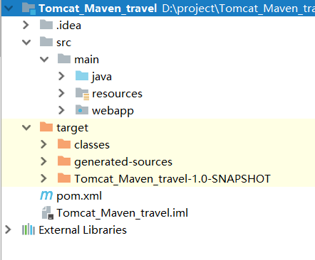

# 问题

**IDEA控制台乱码**

> 待解决，下面的方法都试过了都没能解决，tomcat8好很多，看这个窗口
>
> 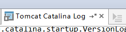

https://blog.csdn.net/nan_cheung/article/details/79337273

https://blog.csdn.net/dandandeshangni/article/details/48544221