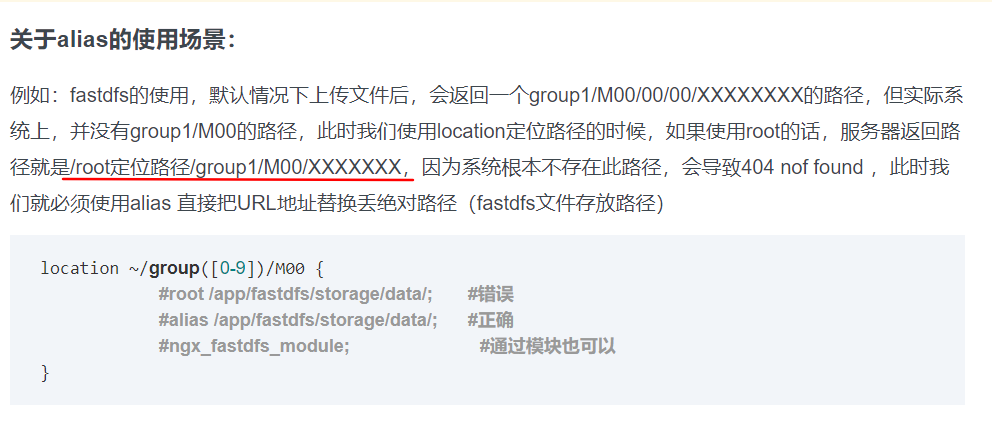

# 介绍

Nginx ("engine x") 是一个高性能的 HTTP 和反向代理服务器，也是一个 IMAP/POP3/SMTP 服务器。  

正向代理：


反向代理


很多大网站都是使用 nginx 做反向代理，应用非常广泛。Nginx 是一款高性能的 http 服务器/反向代理服务器及电子邮件（IMAP/POP3）代理服务器。由俄罗斯的程序设计师 Igor Sysoev 所开发，官方测试 nginx 能够支支撑 5 万并发链接，并且 cpu、内存等资源消耗却非常低，运行非常稳定。  

应用场景
1、 http 服务器，可以做静态网页的 http 服务器。
2、 配置虚拟机。一个域名可以被多个 ip 绑定。可以根据域名的不同吧请求转发给运行在不同端口的服务器。
3、 反向代理，负载均衡。把请求转发给不同的服务器。  

官方网站： http://nginx.org/  

# 命令

- **启动**

  在 nginx 目录下有一个 sbin 目录， sbin 目录下有一个 nginx 可执行程序。

  ```
  ./nginx  
  ```

- **关闭**

  关闭命令：相当于找到 nginx 进程 kill。

    ```shell
  ./nginx -s stop
    ```

- **退出**

  ```
  ./nginx -s quit
  ```


  等程序执行完毕后关闭，建议使用此命令。  

- **动态加载配置文件**

  可以不关闭 nginx 的情况下更新配置文件。  

  ```
  ./nginx -s reload
  ```


# 配置

## [root和alias](https://www.cnblogs.com/tintin1926/archive/2012/07/11/2586813.html)

```ini
#若如下述配置的话，则访问/img/目录里面的文件时，ningx会自动去/var/www/image/目录找文件
location /img/ {
	# 转发url时，把prefix去掉，夹在alias，不会自动添加'/'，因此最好加上，不然拼字符串会少了一个'/'
    alias /var/www/image/; 
}

#若按照这种配置的话，则访问/img/目录下的文件时，nginx会去/var/www/image/img/目录下找文件。]
location /img/ {
	# 转发url时，连同prefix直接加在root路径后，由于prefix前面已经有'/'，root则不需要加，最后加上
    root /var/www/image; 
}

```

alias是一个目录别名的定义，root则是最上层目录的定义。

还有一个重要的区别是alias后面必须要用“/”结束，否则会找不到文件的。。。而root则可有可无~~

例子



## [location](https://www.bo56.com/nginx-location%E5%9C%A8%E9%85%8D%E7%BD%AE%E4%B8%AD%E7%9A%84%E4%BC%98%E5%85%88%E7%BA%A7/)

**location表达式类型**

~ 表示执行一个正则匹配，区分大小写

~* 表示执行一个正则匹配，不区分大小写

^~ 表示普通字符匹配。使用前缀匹配。如果匹配成功，则不再匹配其他location。

= 进行普通字符精确匹配。也就是完全匹配。

@ "@" 定义一个命名的 location，使用在内部定向时，例如 error_page, try_files

**location优先级说明**

在nginx的location和配置中location的顺序没有太大关系。正location表达式的类型有关。相同类型的表达式，字符串长的会优先匹配。

以下是按优先级排列说明：

第一优先级：等号类型（=）的优先级最高。一旦匹配成功，则不再查找其他匹配项。

第二优先级：^~类型表达式。一旦匹配成功，则不再查找其他匹配项。

第三优先级：正则表达式类型（~ ~*）的优先级次之。如果有多个location的正则能匹配的话，则使用正则表达式最长的那个。

第四优先级：常规字符串匹配类型。按前缀匹配。

**location优先级示例**

配置项如下:  注意，匹配和在配置文件中定义的顺序无关。

```ini
location = / {
# 仅仅匹配请求 /
[ configuration A ]
}
location / {
# 匹配所有以 / 开头的请求。但是如果有更长的同类型的表达式，则选择更长的表达式。如果有正则表达式可以匹配，则
# 优先匹配正则表达式。
[ configuration B ]
}
location /documents/ {
# 匹配所有以 /documents/ 开头的请求。但是如果有更长的同类型的表达式，则选择更长的表达式。
#如果有正则表达式可以匹配，则优先匹配正则表达式。
[ configuration C ]
}
location ^~ /images/ {
# 匹配所有以 /images/ 开头的表达式，如果匹配成功，则停止匹配查找。所以，即便有符合的正则表达式location，也
# 不会被使用
[ configuration D ]
}
location ~* \.(gif|jpg|jpeg)$ {
# 匹配所有以 gif jpg jpeg结尾的请求。但是 以 /images/开头的请求，将使用 Configuration D
[ configuration E ]
}

请求匹配示例
/ -> configuration A
/index.html -> configuration B
/documents/document.html -> configuration C
/images/1.gif -> configuration D
/documents/1.jpg -> configuration E
```

## server_name

**运行原理**

1. 要解析域名成ip地址才能进来nginx所在的服务器,然后交给nginx管理,

2. 然后匹配域名,匹配不到去第一个,匹配到就交由该server管理


1. Nginx的server_name怎么写都行,有什么用
刚开始127.0.0.1不会匹配到第一个server,后来加上/才会,然后一直就是第一个server,还是域名访问比较妥当
二级域名需要配置host,除非localhost或者IP地址
只要通过ip地址和域名解析(DNS解析进来就能够匹配,没有匹配上的server_name就会取第一个)
所以尽量域名对应上
2. 如果域名匹配上了,但是没有默认,会回到经典默认界面