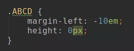
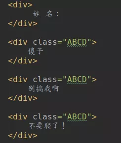
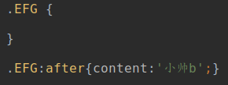
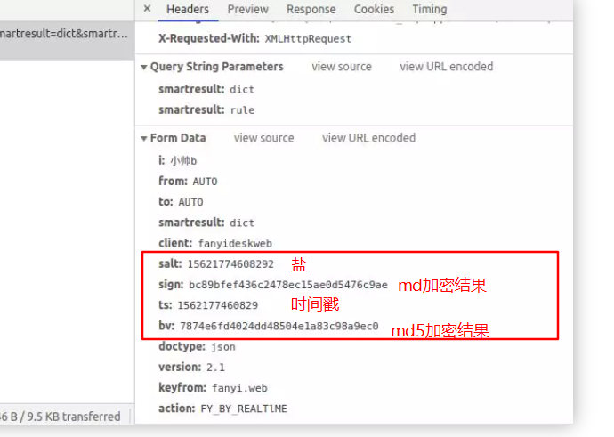

# 诀窍

自动化配置爬虫

1. 少量的，能用selenium能解决的用selenium，webScraper也可以，比如获取门户分类，不需要逆向js，

2. 试错登录和请求，不要输入正确的数据，来查看调用什么js和url，然后进入断点

3. 请求参数，搜索请求结果和参数name，找出来，找不到可以用fiddler查找，再找不到只能打断点 逆向js

4. 前置cookie，找前置请求response，一般是主页的set-cookie

5. 不要漏了**时间戳**

   

1. H5移动端更好爬

2. header cookie，useragent（不同浏览器权限不一样，带上）不要忘记啊，爬虫用到

3. js模拟引擎 ：nashorn

4. 快速

   1. chrome插件 ： web-scraper

   2. [浏览器自动化框架比较：Selenium,Puppeteer和Cypress.io](https://bbs.huaweicloud.com/blogs/198008)

      [为什么puppeteer比selenium好?](https://juejin.cn/post/6844903913825501191)

      https://github.com/fanyong920/jvppeteer


web-harvest：基于xpath信息抽取平台，火车头，把代码爬虫转变为配置文件爬虫

大数据 Nutch

## 多线程分布式

1. myutil的并发工具，比较原始，可以采用先注入list，再取出来每个跑，类似webmagic这样的架构。

2. webmagic，重量级，需要提前选一台server注入scheduler，然后初始化各个组件，比较重，但是功能多

## 增量爬取

按天数增量爬页数的流程：有keyword，从from-end，from没有就初始化为三个月前,end没有就初始化为今天
开始：

1. start_page为null，初始化为1，表示从今天从第一页开始，end更新为今天
2. start_page>1 续爬，
3. 成功爬完，from更新为end，下次增量，start_page=1

# 字体加密

- **工具**

  [iconfont 在线预览工具及其解析](https://segmentfault.com/a/1190000020121850)

  [解析ttf字体](http://blog.luckly-mjw.cn/tool-show/iconfont-preview/index.html)

  [加密字体](http://fontello.com/)

- **科普**

  [字体加密破解技术分享-01](https://zhuanlan.zhihu.com/p/108207403)

- **例子**

  [起点中文网](https://book.qidian.com/info/1013562540)

# css加密

 

这里定义了两个属性

一个是用来将它移除屏幕

一个就是不要占了行高

反正就是用来隐藏我们的干扰信息

接着 HTML 就可以这样写

 

再来定义一个 css 属性

 

意思就是说在 EFG 选择器的这个标签后追加内容

# Eval加密

js中的eval()方法就是一个js语言的执行器，它能把其中的参数按照JavaScript语法进行解析并执行，简单来说就是把原本的js代码变成了eval的参数，变成参数后代码就成了字符串，其中的一些字符就会被按照特定格式“编码”，像下面：
**源码**

```js
var showmsg="粘贴要加密/解密的javascript代码到这里";
if(1==1){
  alert(showmsg);
}
```

**eval加密后**

```js
eval(function(p,a,c,k,e,d){e=function(c){return(c<a?'':e(parseInt(c/a)))+((c=c%a)>35?String.fromCharCode(c+29):c.toString(36))};if(!''.replace(/^/,String)){while(c--)d[e(c)]=k[c]||e(c);k=[function(e){return d[e]}];e=function(){return'\\w+'};c=1};while(c--)if(k[c])p=p.replace(new RegExp('\\b'+e(c)+'\\b','g'),k[c]);return p}('5 4="粘贴要加密/解密的3代码到这里";2(0==0){  1(4);}',62,6,'1|alert|if|javascript|showmsg|var'.split('|'),0,{}))
```

**解密**

直接在浏览器调试模式下使用开发者工具的控制台，复制执行包含在eval（）的代码，注意括号转码

https://tool.lu/js 解密网站

# selenium

注意各种检测

1. 模拟浏览器认为操作
2. 直接调用接口，不使用鼠标，键盘什么

# js引擎直接执行大段js

python的库比较多，

或者调用nod.js

https://zhuanlan.zhihu.com/p/78846012

**缺陷**

js代码中需要window、document、cookie之类的对象就会失败

# md5加密

md5结果是128位二进制，那么对应32个16进制




[例子：有道翻译](https://mp.weixin.qq.com/s?__biz=MzU2ODYzNTkwMg==&mid=2247484997&idx=1&sn=b304304aacb3cba31f5f7a6c6bb1ba69&chksm=fc8bbed4cbfc37c29db631c187295757c164ae75ff3e0381dbbf685a9f3d1410098e5b751e33&scene=21#wechat_redirect)


# sojson加密

1. 混淆

2. hex

3. unicode，转码

   ```js
   /*源码*/
   '\u8fd9\u4e2a\u662f\u4e00\u4e2a\u672c\u7ad9\u5bf9\x4a\x61\x76\x61\x53\x63\x72\x69\x70\x74\x20\u811a\u672c\u7684\u4e00\u4e2a\u9ad8\u7ea7\u52a0\u5bc6\uff0c\u517c\u5bb9\u6027\u8f83\u5f3a'
   /*结果*/
   "这个是一个本站对JavaScript 脚本的一个高级加密，兼容性较强"
   
   '\x73\x74\x61\x74\x65\x4f\x62\x6a\x65\x63\x74'
   "stateObject"
   ```

   

4. 多余函数参数，多于步骤，冗余操作

5. eval()

6. 修改变量名字

7. 无限debugger

   ```js
   var i;
   for (i = 0; i < 99999; i++) {
    clearInterval(i)
   }
   ```

   

- 将所有函数调用,对象属性访问改为数组+字符串索引的方式, 如:`a.b() ===> a['b']()`
- 在处理完所有函数调用,对象属性后, 将源码中所有的字符串进行加密操作
- 将剩余的变量名,函数名,对象名进行随机化操作 如`__0x123456`
- 将if语句改为逻辑与运算 如`if(a==1){b=2} ===> __0xAAA==1 && b=2`逻辑与当前面判断为false时不进行后面的判断,和if很像,这个混淆方式学到了
- 将数字拆分运算, 很傻逼的混淆,脚本就可以脱,就是恶心,比如把1变为`3-5-6+9` 一份大点的JS能改上万处数字常量
- 将false改为![] 将true改为!![] 将NaN改为+[![]] 将undefined改为[][[]]等等,也是经典fuckjs的操作

[[原创]简单思路去sojson各版本的js混淆](https://bbs.pediy.com/thread-264326.htm)

[obfuscator混淆](https://github.com/javascript-obfuscator/javascript-obfuscator)

# 框架

[推荐一些优秀的开源Java爬虫项目](https://zhuanlan.zhihu.com/p/24844250)

[Java爬虫框架调研](https://blog.csdn.net/dejing6575/article/details/101473811)

[50 种最棒的开源爬虫框架/项目](https://zhuanlan.zhihu.com/p/64305013)

# 滑块验证

api请求距离+selenium尽量模拟自然拖曳

除了识别缺口位置外，拖动也是验证中的一部分，有下面行为之一的可能会无法通过

- 拖动过快，0.1s内完成验证
- 总是1像素偏差都没有
- 从头到尾都是均匀移动

按照此规则，制定一个拖动的方案：每次以20ms随机拖动2-10像素，超过预期的偏差值时停止拖动：

[震惊，Python破解BiliBili滑块验证码，完美避开人机识别](https://blog.csdn.net/Mingyueyixi/article/details/104345623)

[极验滑块验证码的破解](https://www.jianshu.com/p/c94be62b8065)