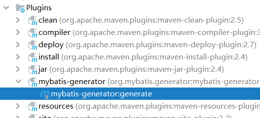
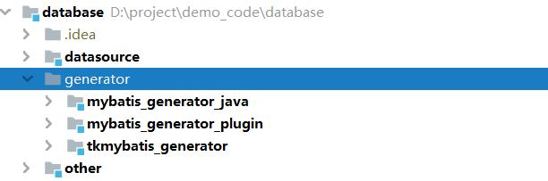
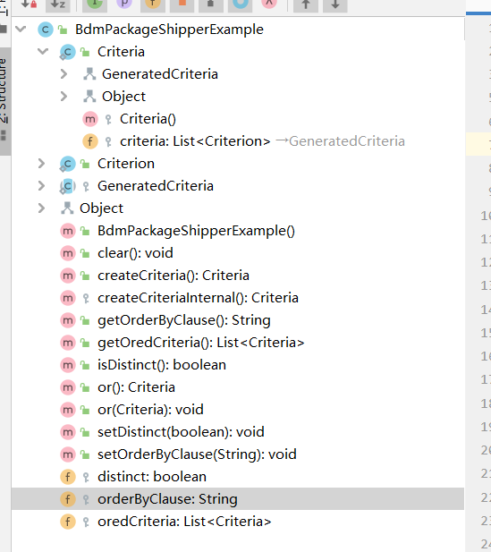
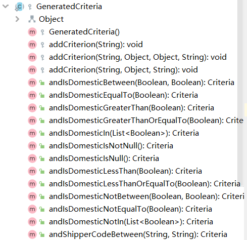
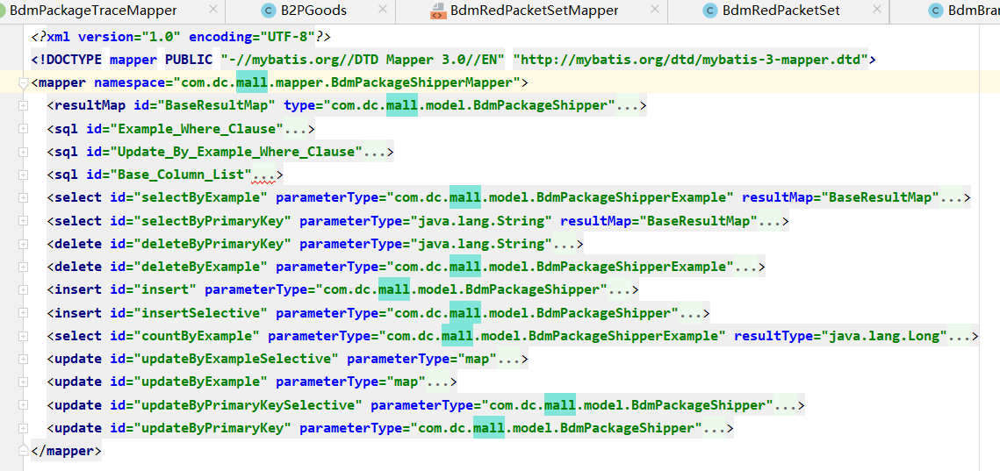
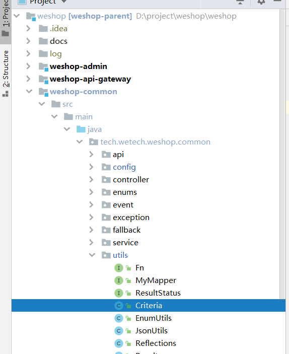

## 官网

文档：http://www.mybatis.org/generator/index.html


## 逆向工程

maven插件式部署和java程序或者jar包，看官网



**代码**



**错误**

```log
ser Error on line 18: 对实体 "characterEncoding" 的引用必须以 ';' 分隔符结尾。
```

```java
把JDBC连接mysql的URL中，所有的&符号，都改为&amp;  （有分号！！！）
如我的：
jdbc.url=jdbc:mariadb://localhost:3306/dili_wms?useUnicode=true&amp;characterEncoding=utf8
```


## Example

### 介绍

Criteria是Criterion的复数形式

```sql
distinct ... where （Criteria：{Criterion and Criterion ...}） or（Criteria：{Criterion and Criterion...} ） or...
```

```java
//构建大的条件 Criteria，存储在oredCriteria中：or条件
public class BdmPackageShipperExample {
    protected String orderByClause;

    protected boolean distinct;

    protected List<Criteria> oredCriteria; //每个Criteria，or分隔，调用`or()`方法。
```

```java
//构建小的条件Criterion，存储在criteria中，and连接
public static class Criteria extends GeneratedCriteria {

    protected Criteria() {
        super();
    }
}

//Criteria只是GeneratedCriteria的简单实现，底层还是GeneratedCriteria
protected abstract static class GeneratedCriteria {
    protected List<Criterion> criteria;//每个Criteria内有很多Criterion，and连接，代表每个条件，用于组装具体的条件
```

```java
//具体的小的条件，where （Criterion and Criterion） or（ ）
//最重要的三个构造器
//一些的属性定义了该条件的的性质，如何组装条件，使用什么handler

public static class Criterion {

    private String condition;

    private Object value;

    private Object secondValue;

    private boolean noValue;

    private boolean singleValue;

    private boolean betweenValue;

    private boolean listValue;

    private String typeHandler;

    public String getTypeHandler() {
        return typeHandler;
    }

    //单个条件，is null， not null之类
    protected Criterion(String condition) {
        super();
        this.condition = condition;
        this.typeHandler = null;
        this.noValue = true;
    }

    //==，》之类，需要一个value或者list （in，not in）
    protected Criterion(String condition, Object value, String typeHandler) {
        super();
        this.condition = condition;
        this.value = value;
        this.typeHandler = typeHandler;
        if (value instanceof List<?>) {
            this.listValue = true;
        } else {
            this.singleValue = true;
        }
    }

    //between
    protected Criterion(String condition, Object value, Object secondValue, String typeHandler) {
        super();
        this.condition = condition;
        this.value = value;
        this.secondValue = secondValue;
        this.typeHandler = typeHandler;
        this.betweenValue = true;
    }
```





## pojo

 数据表实体类，简单，没什么可说了

## Mapper

Java Client .

如果是两个会使用 `@Param` 指明别名

```java
int updateByExampleSelective(@Param("record") BdmPackageTrace record, @Param("example") BdmPackageTraceExample example);

int updateByExample(@Param("record") BdmPackageTrace record, @Param("example") BdmPackageTraceExample example);
```

## Mapper.xml

里面就会揭示了example怎么使用，使用了大量的动态sql



## 使用模板类

1. excample本身可以是null	
2. example插入的where条件都不能是null，会抛异常

```java
		protected void addCriterion(String condition) {
            if (condition == null) {
                throw new RuntimeException("Value for condition cannot be null");
            }
            criteria.add(new Criterion(condition));
        }
```

3. 模板语言 模糊匹配需要加 `%%` criteria.andNameLike
4. 更新插入都是用selective，尽量不要带入null（会抹去数据、触发not null约束）

## 另一个版本的Criteira

差不多，不过xml部分转移成为了java。里面有解析



#