# 	介绍


MyBatis 本是[apache](https://baike.baidu.com/item/apache/6265)的一个开源项目[iBatis](https://baike.baidu.com/item/iBatis), 2010年这个项目由apache software foundation 迁移到了google code，并且改名为MyBatis 。2013年11月迁移到Github。

iBATIS一词来源于“internet”和“abatis”的组合，是一个基于Java的[持久层](https://baike.baidu.com/item/持久层/3584971)框架。iBATIS提供的持久层框架包括SQL Maps和Data Access Objects（DAOs）

当前，最新版本是MyBatis 3.5.3 ，其发布时间是2019年10月20日。

它封装了jdbc操作的很多细节，使开发者只需要关注sql语句本身，而无需关注注册驱动，创建连接等繁杂过程。它使用了ORM思想实现了结果集的封装。

# 原理

## 介绍

创建mapper的代理类，然后缓存xml或者注解上的sql语句，保存起来，方法和sql做一一对应，然后反射的时候根据方法找到对应的sql，执行。

## 具体流程

[具体流程](file:///C:/Users/TJR_S/OneDrive/%E7%BC%96%E7%A8%8B/3.%20%E4%B8%BB%E6%B5%81%E6%A1%86%E6%9E%B6/DAO/MyBatis/%E5%85%B7%E4%BD%93%E6%B5%81%E7%A8%8B/)

## 核心API

### SqlSessionFactoryBuilder

```java
org.apache.ibatis.session.SqlSessionFactoryBuilder
//SqlSessionFactory 构建器，创建 SqlSessionFactory 实例。通过重载方法build，控制实例行为，其中方法参数如下：
	MyBatis全局配置流（java.io.InputStream、java.io.Reader）
	Mybatis环境名称（environment）
	Mybatis属性（java.util.Properties）
//相关API
	配置构建器：org.apache.ibatis.builder.xml.XMLConfigBuilder
	MyBatis配置：org.apache.ibatis.session.Configuration
	MyBatis环境：org.apache.ibatis.mapping.Environment
```

### SqlSessionFactory

```
org.apache.ibatis.session.SqlSessionFactory
SqlSession 工厂类，创建 SqlSession 实例，通过重载方法openSession，控制实例特性，其中方法参数如下：
	是否需要自动提交
	JDBC 数据库连接（java.sql.Connection）
	Mybatis SQL语句执行器类型（org.apache.ibatis.session.ExecutorType）
	Mybatis 事务隔离级别（org.apache.ibatis.session.TransactionIsolationLevel）
```

### SqlSession

```
org.apache.ibatis.session.SqlSession
	MyBatis SQL 会话对象，类似于JDBC Connection
	职责
        封装java.sql.Connection
        屏蔽java.sql.Statement（以及派生接口）的细节
        映射java.sql.ResultSet 到Java类型
        事务控制
        缓存
        代理映射（Mapper）

```

### Configuration、

org.apache.ibatis.session.Configuration

核心类，储存了所有的sql和mapper方法的映射`MappedStatement`。

### MappedStatement

org.apache.ibatis.mapping.MappedStatement。

sql和mapper方法的映射

# 入门

不管使用XML还是注解配置，Mybatis它是支持写dao实现类的。但是我们在实际开发中，都是越简便越好，所以都是采用不写dao实现类的方式。

## Mapper 接口代理开发方式

**接口代理类在底层依赖于SqlSession的方法**

```java
	mybatis的环境搭建
		第一步：创建maven工程并导入坐标
		第二步：创建实体类和dao的接口
		第三步：创建Mybatis的主配置文件
				SqlMapConifg.xml
		第四步：创建映射配置文件
				IUserDao.xml
				
	环境搭建的注意事项：
		第一个：创建IUserDao.xml 和 IUserDao.java时名称是为了和我们之前的知识保持一致。
			在Mybatis中它把持久层的操作接口名称和映射文件也叫做：Mapper
			所以：IUserDao 和 IUserMapper是一样的
		第二个：在idea中创建目录的时候，它和包是不一样的
			包在创建时：com.itheima.dao它是三级结构
			目录在创建时：com.itheima.dao是一级目录
		第三个：mybatis的映射配置文件位置必须和dao接口的包结构相同
		第四个：映射配置文件的mapper标签namespace属性的取值必须是dao接口的全限定类名
		第五个：映射配置文件的操作配置（select），id属性的取值必须是dao接口的方法名
		
    mybatis的入门案例
		第一步：读取配置文件
		第二步：创建SqlSessionFactory工厂
		第三步：创建SqlSession，一个sqlSession代表一个connnection，sqlSession同时具有事务的相关方法
		第四步：创建Dao接口的代理对象，getMapper，spring是一开始就在容器中创建所有的代理对象
		第五步：执行dao中的方法
		第六步：释放资源
        
   // 关键：使用sqlSession生成代理类
        //3.使用工厂生产SqlSession对象
		SqlSession session = factory.openSession();
		//4.使用SqlSession创建Dao接口的代理对象
		IUserDao userDao = session.getMapper(IUserDao.class);
```


## 原始 Dao 开发方式

有实现类，调用其他工具类的方法。mybatis也支持，不过把sql单独提取到xml文件中

基于接口SqlSession的方法，配置都是一样的

```java
//关键： 直接使用sqlSession进行crud
//1.使用工厂创建SqlSession对象,每一个sqlSession对象代表一connection
SqlSession session = factory.openSession();
//2.使用session执行所有方法
List<User> users = session.selectList("com.itheima.dao.IUserDao.findAll");
session.insert("com.itheima.dao.IUserDao.saveUser",user);
session.update("com.itheima.dao.IUserDao.updateUser",user);
session.update("com.itheima.dao.IUserDao.deleteUser",userId);
User user = session.selectOne("com.itheima.dao.IUserDao.findById",userId);
```

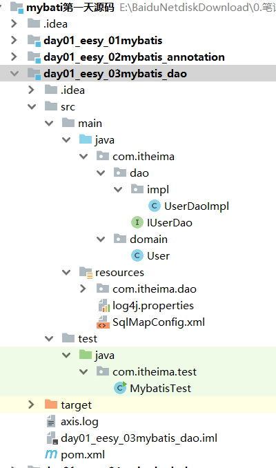


# SQL Mapper xml

SQL Mapper XML 配置用于映射SQL 模板语句与Java类型的配置。如何写sql

## 4种操作

select返回查询结果，增删改返回影响行数

```xml
<!-- 根据名称模糊查询 -->
<select id="findByName" resultType="com.itheima.domain.User" parameterType="String">
	select * from user where username like #{username}
</select>
<select id="findByName" parameterType="string" resultType="com.itheima.domain.User">
	<!-- ${value}的写法就是固定的，不能写成其它名字。 -->
	select * from user where username like '%${value}%' 
</select>

<!-- 聚合函数 -->
<select id="findTotal" resultType="int">
    select count(id) from user;
</select>

<!-- pojo参数，保证user不为null，空指针异常 -->
<select id="findByVo" resultType="com.itheima.domain.User" parameterType="com.itheima.domain.QueryVo">
	select * from user where username like #{user.username};
</select>

<!-- 增删改 -->
<insert id="saveUser" parameterType="com.itheima.domain.User">
    	<!-- 新增后将自动增长 auto_increment 的值返回 -->
    <selectKey keyColumn="id" keyProperty="id" resultType="int">
 	   select last_insert_id();
    </selectKey>
	insert into user(username,birthday,sex,address) values(#{username},#{birthday},#{sex},#{address})
</insert>

<update id="updateUser" parameterType="com.itheima.domain.User">
    update user set username=#{username},birthday=#{birthday},sex=#{sex},address=#{address} where id=#{id}
</update>

<delete id="deleteUser" parameterType="java.lang.Integer">
	delete from user where id = #{uid} <!-- 占位符，随便起 -->
</delete>
```

## resultType

### 介绍

用于指定结果集的类型。它支持基本类型和实体类类型。  

它和 parameterType 一样，如果注册过类型别名的，可以直接使用别名。没有注册过的必须使用全限定类名。例如：我们的实体类此时必须是全限定类名  。

### 映射

1. 默认映射：实体类中的属性名称必须和查询语句中的列名保持一致，否则无法实现封装。 **但是 mysql 在 windows 系统中不区分大小写**！  

2. 修改映射配置，使用列别名

   ```xml
   <select id="findAll" resultType="com.itheima.domain.User">
   	select id as userId,username as userName,birthday as userBirthday, sex as userSex,address as userAddress from user
   </select>
   ```

## resultMap

resultMap 标签可以建立查询的列名和实体类的属性名称不一致时建立对应关系。从而实现封装。在 select 标签中使用 resultMap 属性指定引用即可。同时 resultMap 可以实现将查询结果映射为复杂类型的 pojo，比如在查询结果映射对象中包括 pojo 和 list 实现一对一查询和一对多查询。  

```xml
<!-- 建立 User 实体和数据库表的对应关系
type 属性：指定实体类的全限定类名
id 属性：给定一个唯一标识，是给查询 select 标签引用用的。
-->
  <resultMap id="BaseResultMap" type="com.dc.mall.model.BdmPackageShipper">
    <id column="shipper_code" jdbcType="VARCHAR" property="shipperCode" />
    <result column="shipper_name" jdbcType="VARCHAR" property="shipperName" />
    <result column="is_domestic" jdbcType="BIT" property="isDomestic" />
      <!-- 利用命名空间+resultMapID就可以直接引用其他Mapper文件的resultMap，其中resultMap的column在本文件中也有用，也可以对应sql语句中的column别名。 -->
      <!-- 注意,mapper.xml初始化有先后顺序,尤其是引用,如果引用mapper.xml文件尚未初始化完毕就调用client,那么就会fast fail,spring容器出现-->
    <association property="teacher" javaType="Teacher" resultMap="com.lsj.test.mybatis.mapper.TeacherMapper.teacherMap" ></association>
    <collection property="studentList" ofType="Student" resultMap="com.lsj.test.mybatis.mapper.StudentMapper.studentMap" ></collection>
  </resultMap>

<!-- 
id 标签：用于指定主键字段
result 标签：用于指定非主键字段
column 属性：用于指定数据库列名
property 属性：用于指定实体类属性名称 
-->

<!-- 配置查询所有操作 -->
<select id="findAll" resultMap="userMap">
	select * from user
</select>
```


## parameterType

### 介绍

1. 单个参数代表参数的类型，该属性的取值可以是基本类型，引用类型（例如:String 类型），还可以是实体类类型（POJO 类）。同时也可以使用实体类的包装类   。

2. 多个参数，底层封装成map，用key来引用。

3. 如果添加了 `@param`那么就需要从value处开始查询，不加就可以直接使用pojo里面的field

   **xml**

   ```java
       int updateByExampleSelective(@Param("record") BdmPackageShipper record, @Param("example") BdmPackageShipperExample example);
   // 需要加@param ，否则有如下错误，可能是，mybatis把参数封装进map
   ```


   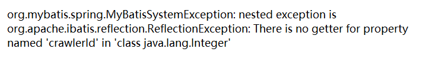

   ```xml
     <update id="updateByExample" parameterType="map"> <!-- 这里 -->
       update bdm_package_shipper
       set shipper_code = #{record.shipperCode,jdbcType=VARCHAR},
         shipper_name = #{record.shipperName,jdbcType=VARCHAR},
         is_domestic = #{record.isDomestic,jdbcType=BIT}
       <if test="_parameter != null">
         <include refid="Update_By_Example_Where_Clause" />
    </if>
     </update>
   ```

   **annotation**

   ```java
	@Select("${sql} ${table}") //直接组装sql语句
   	List<T> selectBySql(@Param("sql") String sql,@Param("table") String table);
   ```

   

## 别名

基 本 类 型 和 String 我 们 可 以 直 接 写 类 型 名 称 ， 也 可 以 使 用 包 名 . 类 名 的 方 式 ， 例 如 ：java.lang.String。

实体类类型，目前我们只能使用全限定类名。

究其原因，是 mybaits 在加载时已经把常用的数据类型注册了别名，从而我们在使用时可以不写包名，而我们的是实体类并没有注册别名，所以必须写全限定类名。  

在 mybatis 的官方文档的说明(第 19 页)  这些都是支持的默认别名。我们也可以从源码角度来看它们分别都是如何定义出来的。可以参考 TypeAliasRegistery.class 的源码。  

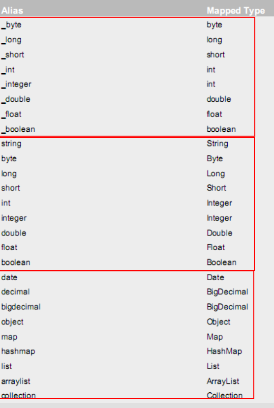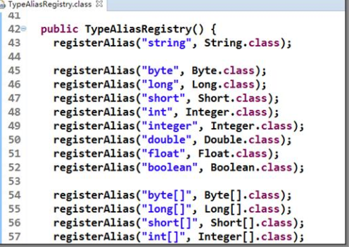

### 注册别名

在 全局Config xml --> typeAliases

## #{}与${}

- **sql 语句中使用#{}字符**
  它代表占位符， 相当于原来 jdbc 部分所学的?，都是用于执行语句时替换实际的数据。

  - 数据类型是基本类型，所以此处可以随意写一个占位符。

  -  复杂对象，使用 ognl 表达式。
    它是 apache 提供的一种表达式语言， 全称是：Object Graphic Navigation Language 对象图导航语言.  它是按照一定的语法格式来获取数据的。

    ```
    #{对象.对象}的方式
    
    例子：
    #{user.username}它会先去找 user 对象，然后在 user 对象中找到 username 属性，并调用getUsername()方法把值取出来。但是我们在 parameterType 属性上指定了实体类名称，所以可以省略 user.而直接写 username。
    ```

- **#{}与${}的区别**

  - **#{}表示一个占位符号**
    通过#{}可以实现 preparedStatement 向占位符中设置值，**自动进行 java 类型和 jdbc 类型转换**，#{}可以**有效防止 sql 注入**。 #{}可以接收简单类型值或 pojo 属性值。 如果 parameterType 传输单个简单类
    型值， #{}括号中可以是 value 或其它名称。

  - **${}表示拼接 sql 串**
    通过${}可以将 parameterType 传入的内容拼接在 sql 中且不进行 jdbc 类型转换， ${}可以接收简单类型值或 pojo 属性值，如果 parameterType 传输单个简单类型值， **${}括号中只能是 value**。就是传入字符串，不能防止sql注入

    ```java
        //部分源码，源码指定了key的名字就是‘value’
        public String handleToken(String content) {
          Object parameter = context.getBindings().get("_parameter");
          if (parameter == null) {
            context.getBindings().put("value", null);
          } else if (SimpleTypeRegistry.isSimpleType(parameter.getClass())) {
            context.getBindings().put("value", parameter);
          }
          Object value = OgnlCache.getValue(content, context.getBindings());
          String srtValue = (value == null ? "" : String.valueOf(value)); // issue #274 return "" instead of "null"
          checkInjection(srtValue);
          return srtValue;
        }
    ```
    
    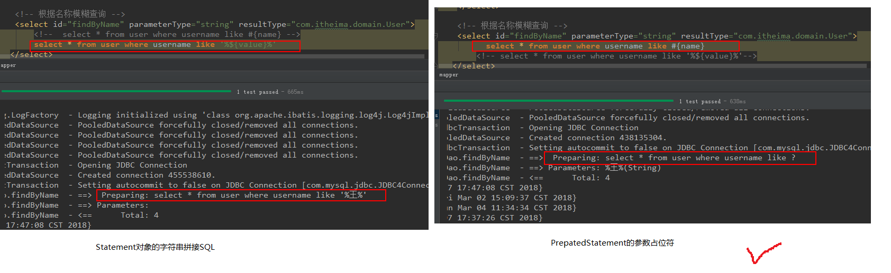

## 动态标签

### 介绍

https://mybatis.org/mybatis-3/dynamic-sql.html

 `<if>`

判断，内容就是java if()括号里面的判断语句

```xml
<select id="findByUser" resultType="user" parameterType="user">
	select * from user where 1=1
	<if test="username!=null and username != '' ">
		and username like #{username}
	</if>
	<if test="address != null">
		and address like #{address}
	</if>
</select>
注意： <if>标签的 test 属性中写的是对象的属性名，如果是包装类的对象要使用 OGNL 表达式的写法。
	另外要注意 where 1=1 的作用~！
```

 `<where>`

替代where

```xml
<!-- 为了简化上面 where 1=1 的条件拼装，我们可以采用<where>标签来简化开发。 -->
<select id="findByUser" resultType="user" parameterType="user">
	<include refid="defaultSql"></include>
	<where>
		<if test="username!=null and username != '' ">
			and username like #{username}
		</if>
		<if test="address != null">
			and address like #{address}
		</if>
	</where>
</select>
```

`<foreach>`

解析集合参数  

```java
public class QueryVo implements Serializable {
	private List<Integer> ids;  
}
```

```xml
<!-- 查询所有用户在 id 的集合之中 -->
<select id="findInIds" resultType="user" parameterType="queryvo">
	<!-- select * from user where id in (1,2,3,4,5); -->
	<include refid="defaultSql"></include>
	<where>
		<if test="ids != null and ids.size() > 0">
			<foreach collection="ids" open="id in ( " close=")" item="uid"
					separator=",">
				#{uid}
			</foreach>
		</if>
	</where>
</select>
```

```properties
SQL 语句：
select 字段 from user where id in (?)
<foreach>标签用于遍历集合，它的属性：
	collection: 	代表要遍历的集合元素，注意编写时不要写#{}
	open: 	代表语句的开始部分
	close:	代表结束部分
	item:	代表遍历集合的每个元素，生成的变量名
	sperator:	代表分隔符
```

`<sql>`

引用代码片段  

```xml
<!-- 抽取重复的语句代码片段 -->
<sql id="defaultSql">
	select * from user
</sql>
<!-- 根据 id 查询 -->
<select id="findById" resultType="UsEr" parameterType="int">
	<include refid="defaultSql"></include>
	where id = #{uid}
</select>
```

`choose, when, otherwise`

类似switch

`trim, where, set`	

类似的功能，剔除前面，然后加入需要的，where属于特殊的trim

### 内置参数

```xml
 <!-- mybatis动态sql的两个内置参数
           不只是方法传递过来的参数可以被用来判断，取值
       mybatis默认还有两个内置参数
           _parameter:代表整个参数
						  单个参数：_parameter就是这个参数
						  多个参数：参数会被封装为一个map:_parameter就是代表这个map             
           _databaseId:如果配置了databaseIdProvider标签
                _databaseId 就是代表当前数据库的别名Oracle
      -->


<!-- List<Employee> getEmpsTestInnerParameter(Employee employee); -->
<select id="getEmpsTestInnerParameter" resultType="com.hand.mybatis.bean.Employee">
	SELECT * FROM emp
	<if test="_parameter!=null">      <!-- _parameter相当于传入的参数employee,判断employee是否为空，若不为空则执行where条件 -->
		where ename=#{_parameter.eName}  
	</if>
</select>
```


### 例子

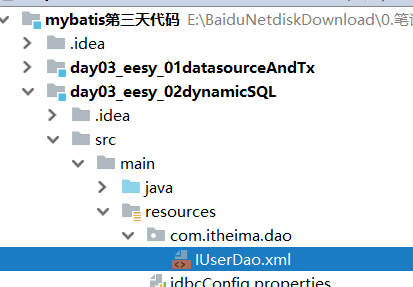


## 复杂查询

### 查询结果赋值到对象的复杂对象 field

account  有 field user  ，user内才是简单类型。

```java
public class Account implements Serializable {
    private Integer id;
    private Integer uid;
    private Double money;
    private User user;
}
```

实质就是一个映射

```xml
<?xml version="1.0" encoding="UTF-8"?>
<!DOCTYPE mapper
PUBLIC "-//mybatis.org//DTD Mapper 3.0//EN"
"http://mybatis.org/dtd/mybatis-3-mapper.dtd">
<mapper namespace="com.itheima.dao.IAccountDao">
	<!-- 建立对应关系 -->
	<resultMap type="account" id="accountMap">
		<id column="aid" property="id"/>
		<result column="uid" property="uid"/>
		<result column="money" property="money"/>
		<!-- 它是用于指定从表方的引用实体属性的 -->
		<association property="user" javaType="user">
			<id column="id" property="id"/>
			<result column="username" property="username"/>
			<result column="sex" property="sex"/>
			<result column="birthday" property="birthday"/>
			<result column="address" property="address"/>
		</association>
	</resultMap>
	<select id="findAll" resultMap="accountMap">
		<!-- 起别名的原因是因为赋值时不混乱 -->
		select u.*,a.id as aid,a.uid,a.money from account a,user u where a.uid =u.id;
	</select>
</mapper>
```

### 查询结果赋值到对象的list field

```java
public class BusJwGoodsUploadCategoryDto extends BusJwGoodsUploadCategory {

    @ApiModelProperty(value = "所有子分类")
    private List<BusJwGoodsUploadCategoryDto> childCategories; //递归
    
}
```

```xml
    <resultMap id="categoryMap" type="com.dc.mall.commonDto.BusJwGoodsUploadCategoryDto">
        <id column="id" property="id" jdbcType="INTEGER"/>
        <result column="cat_name" property="catName" jdbcType="VARCHAR"/>
        <result column="parent_cat_id" property="parentCatId" jdbcType="INTEGER"/>
        <result column="cat_level" property="catLevel" jdbcType="INTEGER"/>
        <collection property="childCategories" ofType="com.dc.mall.commonDto.BusJwGoodsUploadCategoryDto">

            <id column="i2" property="id" jdbcType="INTEGER"/>
            <result column="n2" property="catName" jdbcType="VARCHAR"/>
            <result column="p2" property="parentCatId" jdbcType="INTEGER"/>
            <result column="l2" property="catLevel" jdbcType="INTEGER"/>
            <collection property="childCategories" ofType="com.dc.mall.commonDto.BusJwGoodsUploadCategoryDto">

                <id column="i3" property="id" jdbcType="INTEGER"/>
                <result column="n3" property="catName" jdbcType="VARCHAR"/>
                <result column="p3" property="parentCatId" jdbcType="INTEGER"/>
                <result column="l3" property="catLevel" jdbcType="INTEGER"/>

            </collection>

        </collection>
    </resultMap>

	
    <select id="queryActive" resultMap="categoryMap">
        <!-- 起别名的原因是因为赋值时不混乱 -->
        SELECT
            c1.*,
            c2.id AS i2, c2.cat_name as n2, c2.parent_cat_id as p2, c2.cat_level as l2, c2.is_active as a2,
            c3.id AS i3, c3.cat_name as n3, c3.parent_cat_id as p3, c3.cat_level as l3, c3.is_active as a3
        FROM
            bus_jw_goods_upload_category c1
            inner JOIN bus_jw_goods_upload_category c2 ON c1.id = c2.parent_cat_id and c2.is_active=1
            inner JOIN bus_jw_goods_upload_category c3 ON c2.id = c3.parent_cat_id and c3.is_active=1
        WHERE
            c1.cat_level = 1 and c1.is_active=1;
    </select>
```

### 代码

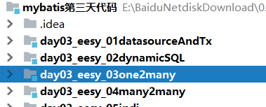

# SQL Mapper Annotation

## 介绍

注解开发

> 待解决，看pdf文件和例子

@Insert:实现新增
@Update:实现更新
@Delete:实现删除
@Select:实现查询
@Result:实现结果集封装
@Results:可以与@Result 一起使用，封装多个结果集
@ResultMap:实现引用@Results 定义的封装
@One:实现一对一结果集封装
@Many:实现一对多结果集封装
@SelectProvider: 实现动态 SQL映射
@CacheNamespace:实现注解二级缓存的使用
@SelectKey：获取自增主键  

@Param : 参数的key

# Config xml

全局XML配置文件包含影响MyBatis行为的设置和属性。

## 介绍

**xml文档类型约束方式**

- DTD：Document Type Definition

- skenma：[http](http://mybatis.org/dtd/mybatis-3-config.dtd)[://mybatis.org/dtd/mybatis-3-](http://mybatis.org/dtd/mybatis-3-config.dtd)[config.dtd](http://mybatis.org/dtd/mybatis-3-config.dtd)

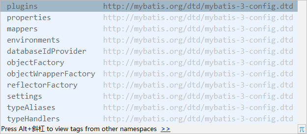

**映射接口**

org.apache.ibatis.session.Configuration


## properties

在使用 properties 标签配置时，我们可以采用两种方式指定属性配置，也可以合并起来写。

### 直接配置

```xml
 <properties>
	<property name="driver" value="com.mysql.jdbc.Driver"></property>
	<property name="url" value="jdbc:mysql://localhost:3306/eesy_mybatis"></property>
	<property name="username" value="root"></property>
	<property name="password" value="1234"></property>
</properties>
```

### 引用配置文件

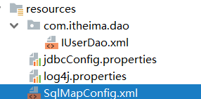

```xml
<!-- 配置properties
	两种引用方法
	1. resource属性： 常用的
            用于指定配置文件的位置，是按照类路径的写法来写，并且必须存在于类路径下。在其他包下那么用/分隔包名。
	2. url属性： 使用不灵活，迁移到tomcat服务器时地址变了
            是要求按照Url的写法来写地址
            URL：Uniform Resource Locator 统一资源定位符。它是可以唯一标识一个资源的位置。
            它的写法：
                http://localhost:8080/mybatisserver/demo1Servlet
                协议      主机     端口       URI

            URI:Uniform Resource Identifier 统一资源标识符。它是在应用中可以唯一定位一个资源的。
    -->
<properties resource="jdbcConfig.properties" />
<properties url="file:///D:/IdeaProjects/day02_eesy_01mybatisCRUD/src/main/resources/jdbcConfig.properties"/>
```

### 引用属性	

其实就是一种占位符，但是没有spring EL那么强大

```xml
<property name="driver" value="${jdbc.driver}"></property>
<property name="url" value="${jdbc.url}"></property>
<property name="username" value="${jdbc.username}"></property>
<property name="password" value="${jdbc.password}"></property>
```

### API

#### API方式

组装API接口：org.apache.ibatis.session.Configuration#variables

填充配置：org.apache.ibatis.builder.xml.XMLConfigBuilder(XPathParser,String, Properties)

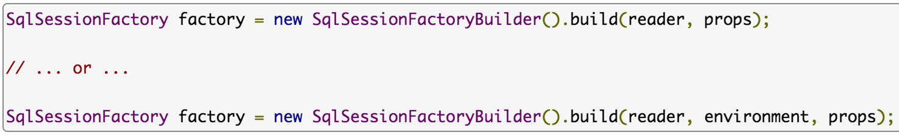

#### 顺序

会覆盖，尽量不重复

1. <property> 元素

2. <properties> 元素 resource属性

3. SqlSessionFactoryBuilder().build(reader, props)

## typeAliases

类型别名

Mybatis 支持的默认别名，我们也可以采用自定义别名方式来开发。  一般使用更短的名称替代。

```xml
    <!--使用typeAliases配置别名，它只能配置domain中类的别名 -->
    <typeAliases>
        <!--typeAlias用于配置别名。type属性指定的是实体类全限定类名。alias属性指定别名，当指定了别名就再区分大小写-->
        <typeAlias type="com.itheima.domain.User" alias="user"/>

        <!-- 用于指定要配置别名的包，当指定之后，该包下的实体类都会注册别名，并且类名就是别名，不再区分大小写-->
        <package name="com.itheima.domain"/>
        <package name="其它包"/>
    </typeAliases>
```

组装API接口：org.apache.ibatis.session.Configuration#typeAliasRegistry

API定义：org.apache.ibatis.type.TypeAliasRegistry

填充配置：org.apache.ibatis.builder.xml.XMLConfigBuilder#typeAliasesElement(XNode)

## mappers  

映射器，注册mapper，4种方法

```xml
    <!-- 配置映射文件的位置 -->
    <mappers>
        <!--使用相对于类路径的资源-->
        <mapper resource="com/itheima/dao/IUserDao.xml"/>

        <!--使用 mapper接口类路径-->
        <mapper class="com.itheima.dao.UserDao"/>

        <!--协议端口路径-->
        <mapper url="file:///com/itheima/dao/IUserDao.xml"/>
        
        <!-- package标签是用于指定dao接口所在的包,当指定了之后就不需要在写mapper以及resource或者class了,注册所有接口 -->
        <package name="com.itheima.dao"/>
    </mappers>
```

## environments

MyBatis 允许配置多个环境，在运行时，通过传递环境信息，切换关联的SqlSessionFactory 实例。因此，MyBatis 中的环境（environments）类似于Maven 或者 Spring 中的Profile。

```xml
    <environments default="mysql">
        <!-- 配置mysql的环境-->
        <environment id="mysql">
            <!-- 配置事务 -->
            <transactionManager type="JDBC"/>

            <!--配置连接池-->
            <dataSource type="POOLED">
                <property name="driver" value="${jdbc.driver}"/>
                <property name="url" value="${jdbc.url}"/>
                <property name="username" value="${jdbc.username}"/>
                <property name="password" value="${jdbc.password}"/>
            </dataSource>
        </environment>
    </environments>
```

```java
//选择不同的环境
SqlSessionFactory sqlSessionFactory = builder.build(reader, "dev", new Properties());
```


## settings

用于修改MyBatis的运行时行为

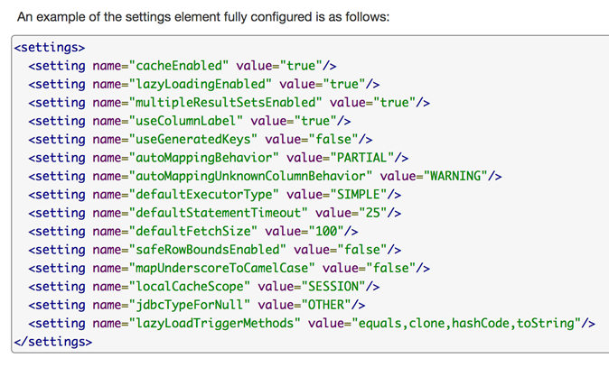

组装API接口：org.apache.ibatis.session.Configuration#setXXX(*)
填充配置：org.apache.ibatis.builder.xml. XMLConfigBuilder#settingsElement(Properties)

## typeHandlers

类型转换器，用于将预编译语句（PreparedStatement）或结果集（ResultSet）中的 JDBC 类型转化成 Java 类型。

如：BooleanTypeHandler  将 JDBC类型中的BOOLEAN转化成Java类型中的java.lang.Boolean 或者 boolean。
若需要转换 Java 8 新增的Date与Time API，即JSR-310，需要再引入mybatis-typehandlers-jsr310：

```xml
<dependency>
 	<groupId>org.mybatis</groupId>
 	<artifactId>mybatis-typehandlers-jsr310</artifactId>
	 <version>1.0.2</version>
</dependency>
```

组装API接口：org.apache.ibatis.session.Configuration#typeHandlerRegistry

API定义：org.apache.ibatis.type.TypeHandlerRegistry

填充配置：org.apache.ibatis.builder.xml.XMLConfigBuilder#typeHandlerElement (XNode)	

- **直接使用**

  ```xml
      <resultMap id="UserResultMap" type="com.segmentfault.springbootlesson7.entity.User">
  
          <id property="id" column="id"/>
          <result property="name" column="name" javaType="java.lang.String"/>
          <result property="age" column="age"/>
          <result property="description" column="desc"
                  typeHandler="com.segmentfault.springbootlesson7.handler.DescriptionTypeHandler"/>
          <result property="height" column="height"/>
  
      </resultMap>
  ```

- **先在xml配置后后使用**

- 默认handler，springboot有配置

  org.apache.ibatis.type.EnumOrdinalTypeHandler


## objectFactory

用于创建结果对象实例，提供默认构造器或者执行构造参数初始化目标类型的对象。通常使用场景，不需要调整默认的实现。

意义不大。

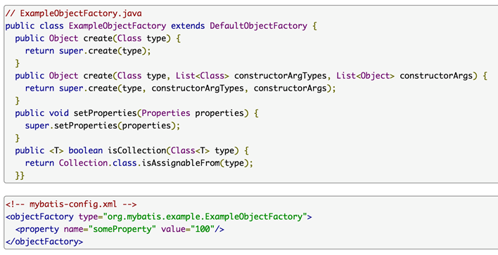

## plugins

插件，实则是拦截器链
Mybatis提供插件的方式来拦截映射语句（mapped statement）的执行，如以下方法：

```java
//一般有加工和转化两种，handler一般用于加工，所以命名有问题
- Executor (update, query, flushStatements, commit, rollback, getTransaction, close, isClosed)
- ParameterHandler (getParameterObject, setParameters)
- ResultSetHandler (handleResultSets, handleOutputParameters)
- StatementHandler (prepare, parameterize, batch, update, query)
```

官网例子

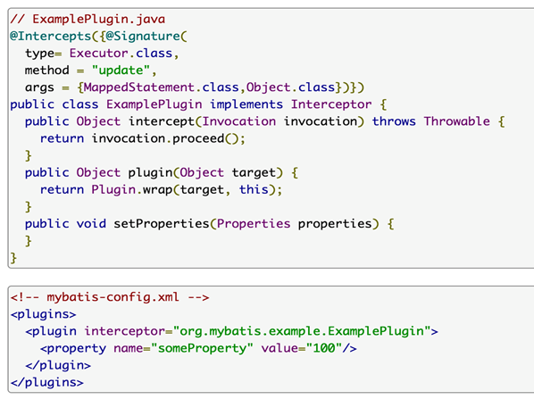

## databaseIdProvider

数据库标识供应器

MyBatis 是面向SQL的映射框架，所执行SQL语句的语法依赖于数据库提供商的实现，比如：MySQL、Oracle、SQL Server等。在配置映射SQL语句时，可为其指定具体的数据库提供商的实现。因此，在全局XML配置文件中可以定义多个数据库标识供应器（databaseIdProvider）。

不同的数据库的sql可能不一样，可能函数不一样，insert语句不一样。

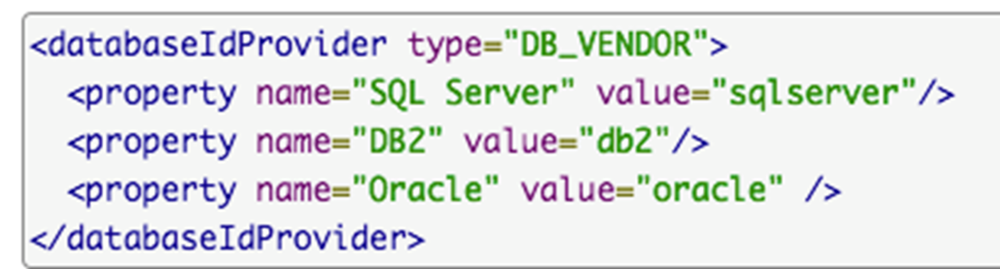

```java
public class MyVendorDatabaseIdProvider extends VendorDatabaseIdProvider {
}
```

```xml
    <typeAliases>
        <typeAlias alias="MY_DB_VENDOR" type="com.segmentfault.springbootlesson7.mapping.MyVendorDatabaseIdProvider"/>
    </typeAliases>

    <databaseIdProvider type="MY_DB_VENDOR">
        <property name="MySQL" value="mysql"/>
    </databaseIdProvider>
```


## 例子

```xml
<?xml version="1.0" encoding="UTF-8"?>
<!DOCTYPE configuration
        PUBLIC "-//mybatis.org//DTD Config 3.0//EN"
        "http://mybatis.org/dtd/mybatis-3-config.dtd">
<configuration>
    <!-- 配置properties-->
    <properties resource="jdbcConfig.properties"/>

    <!--使用typeAliases配置别名，它只能配置domain中类的别名 -->
    <typeAliases>
        <package name="com.itheima.domain"/>
    </typeAliases>

    <!--配置环境-->
    <environments default="mysql">
        <!-- 配置mysql的环境-->
        <environment id="mysql">
            <!-- 配置事务 -->
            <transactionManager type="JDBC"/>

            <!--配置连接池-->
            <dataSource type="POOLED">
                <property name="driver" value="${jdbc.driver}"/>
                <property name="url" value="${jdbc.url}"/>
                <property name="username" value="${jdbc.username}"/>
                <property name="password" value="${jdbc.password}"/>
            </dataSource>
        </environment>
    </environments>
    <!-- 配置映射文件的位置 -->
    <mappers>
        <package name="com.itheima.dao"/>
    </mappers>
</configuration>
```

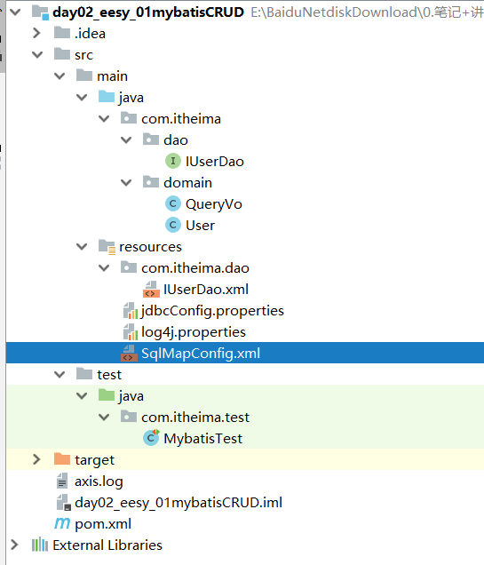

# DataSource

## 介绍

Mybatis 中也有连接池技术，但是它采用的是自己的连接池技术。

-  Mybatis 将它自己的数据源分为三类：在这三种数据源中，我们一般采用的是 POOLED 数据源  

  UNPOOLED ： 不使用连接池的数据源，会创建 UnpooledDataSource 实例
  POOLED ：使用连接池的数据源，会创建 PooledDataSource 实例
  JNDI  ：使用 JNDI 实现的数据源，会从 JNDI 服务上查找 DataSource 实例，然后返回使用  

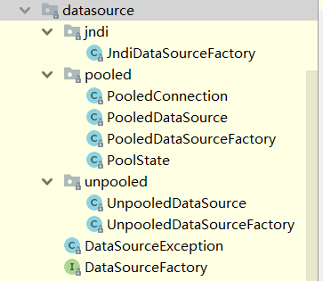 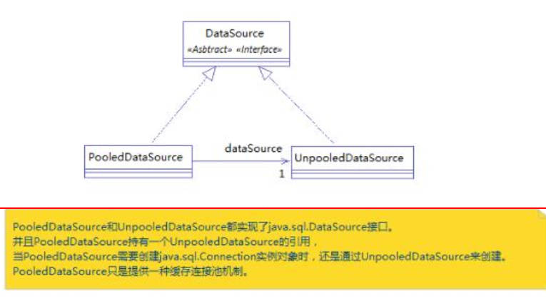

## 配置

在上面environments中，还可以配置以下，自己上官网查资料

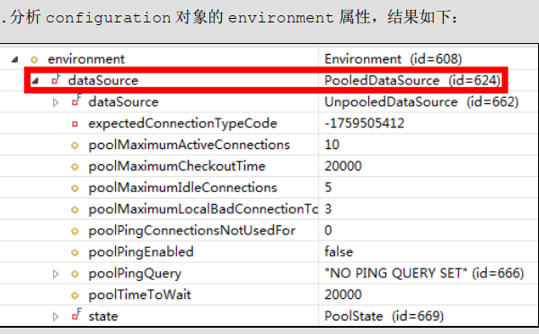

# 事务

通过sqlsession对象的commit方法和rollback方法实现事务的提交和回滚  

```java
在连接池中取出的连接，都会将调用 connection.setAutoCommit(false)方法，  
 //7.提交事务
 session.commit();
//8.释放资源
session.close();

session = factory.openSession(true);   // 设置为自动提交
```


# 延迟加载

## 介绍

- 什么是延迟加载

  ​	在真正使用数据时才发起查询，不用的时候不查询。按需加载（懒加载）

- 什么是立即加载
  	不管用不用，只要一调用方法，马上发起查询。

- 问题：在一对多中，当我们有一个用户，它有100个账户。
        在查询用户的时候，要不要把关联的账户查出来？  用户下的账户信息应该是，什么时候使用，什么时候查询的。延迟加载
        在查询账户的时候，要不要把关联的用户查出来？ 账户的所属用户信息应该是随着账户查询时一起查询出来。立即加载。

- 在对应的四种表关系中：一对多，多对一，一对一，多对多
  	一对多，多对多：通常情况下我们都是采用延迟加载。
    	多对一，一对一：通常情况下我们都是采用立即加载。
- association、 collection 具备延迟加载功能。  

## assocation

## collection

# 缓存

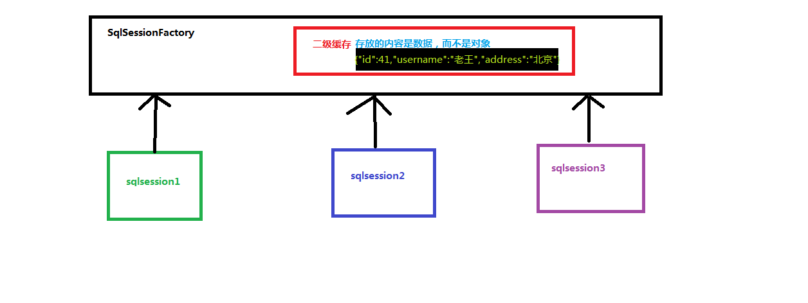

- **什么是缓存**
  	存在于内存中的临时数据。
- **为什么使用缓存**
  	减少和数据库的交互次数，提高执行效率。
- **什么样的数据能使用缓存，什么样的数据不能使用**
  - 适用于缓存
    		经常查询并且不经常改变的。
      		数据的正确与否对最终结果影响不大的。
  - 不适用于缓存：
    		经常改变的数据
      		数据的正确与否对最终结果影响很大的。
      		例如：商品的库存，银行的汇率，股市的牌价。
- **Mybatis中的一级缓存和二级缓存**
  - 一级缓存：
    		它指的是Mybatis中SqlSession对象的缓存。
      		当我们执行查询之后，查询的结果会同时存入到SqlSession为我们提供一块区域中。
      		该区域的结构是一个Map。当我们再次查询同样的数据，mybatis会先去sqlsession中
      		查询是否有，有的话直接拿出来用。
      		当SqlSession对象消失时，mybatis的一级缓存也就消失了。
  - 二级缓存:
    	它指的是Mybatis中SqlSessionFactory对象的缓存。由同一个SqlSessionFactory对象创建的SqlSession共享其缓存。
      	二级缓存的使用步骤：
      		第一步：让Mybatis框架支持二级缓存（在SqlMapConfig.xml中配置）
      		第二步：让当前的映射文件支持二级缓存（在IUserDao.xml中配置）
      		第三步：让当前的操作支持二级缓存（在select标签中配置）

## 使用

> 待解决，看pdf文件和例子

# 代码：手写mybatis框架

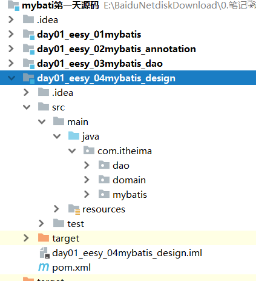

# 参考资源

http://mybatis.org/generator/index.html#

https://www.one-tab.com/page/6shhUxseTk6ZWTWh-iAYTg

> https://blog.csdn.net/f641385712/article/details/82017574?ops_request_misc=%257B%2522request%255Fid%2522%253A%2522168906816916800182132563%2522%252C%2522scm%2522%253A%252220140713.130102334.pc%255Fblog.%2522%257D&request_id=168906816916800182132563&biz_id=0&utm_medium=distribute.pc_search_result.none-task-blog-2~blog~first_rank_ecpm_v1~rank_v31_ecpm-1-82017574-null-null.268^v1^koosearch&utm_term=mybatis&spm=1018.2226.3001.4450 | 【方向盘】MyBatis基础知识33问（详解面试题）_YourBatman的博客-CSDN博客
> https://so.csdn.net/so/search?q=mybatis%E6%BA%90%E7%A0%81&t=all&urw= | mybatis源码- CSDN搜索
> https://blog.csdn.net/daysbetter/article/details/126742266?ops_request_misc=&request_id=&biz_id=102&utm_term=mybatis%E6%BA%90%E7%A0%81&utm_medium=distribute.pc_search_result.none-task-blog-2~all~sobaiduweb~default-0-126742266.142^v88^control_2,239^v2^insert_chatgpt&spm=1018.2226.3001.4449 | Mybatis底层源码分析（最详细的版本）_dayday1130的博客-CSDN博客
> https://blog.csdn.net/qq_31359923/article/details/126582701?ops_request_misc=&request_id=&biz_id=102&utm_term=mybatis%E6%BA%90%E7%A0%81&utm_medium=distribute.pc_search_result.none-task-blog-2~all~sobaiduweb~default-3-126582701.142^v88^control_2,239^v2^insert_chatgpt&spm=1018.2226.3001.4449 | mybatis源码深度解析_@interface的博客-CSDN博客
> https://blog.csdn.net/qq_34295193/article/details/111193065?ops_request_misc=%257B%2522request%255Fid%2522%253A%2522168921737616800188518409%2522%252C%2522scm%2522%253A%252220140713.130102334..%2522%257D&request_id=168921737616800188518409&biz_id=0&utm_medium=distribute.pc_search_result.none-task-blog-2~all~top_positive~default-1-111193065-null-null.142^v88^control,239^v2^insert_chatgpt&utm_term=mybatis%E6%BA%90%E7%A0%81&spm=1018.2226.3001.4449 | Mybatis源码详细分析（最新最全）_mybatis 源码_Leewen_Dong的博客-CSDN博客
> https://blog.csdn.net/qq_38082304/article/details/126384132?csdn_share_tail=%7B%22type%22:%22blog%22,%22rType%22:%22article%22,%22rId%22:%22126384132%22,%22source%22:%22qq_38082304%22%7D | 【源码系列】MyBatis与Spring整合原理源码_mybatis与spring整合源代碼_苏雨丶的博客-CSDN博客
> https://blog.csdn.net/qq_38082304/article/details/123688289?ops_request_misc=&request_id=&biz_id=102&utm_term=mybatis%E6%BA%90%E7%A0%81&utm_medium=distribute.pc_search_result.none-task-blog-2~all~sobaiduweb~default-4-123688289.142^v88^control_2,239^v2^insert_chatgpt&spm=1018.2226.3001.4449 | 【源码系列】MyBatis原理源码_mybatis源码_苏雨丶的博客-CSDN博客
> https://download.csdn.net/download/qq_39081437/11380349?utm_medium=distribute.pc_relevant_download.none-task-download-2~default~TOP_INCOME_CLICK~Position-3-11380349-download-10710954.257%5Ev14%5Epc_dl_relevant_base1_a&depth_1-utm_source=distribute.pc_relevant_download.none-task-download-2~default~TOP_INCOME_CLICK~Position-3-11380349-download-10710954.257%5Ev14%5Epc_dl_relevant_base1_a&spm=1003.2020.3001.6616.3 | 一本小小的MyBatis源码分析书.rar_一本小小的mybatis源码分析书-Java文档类资源-CSDN文库
> https://download.csdn.net/download/weixin_42162216/16049000?utm_medium=distribute.pc_relevant_download.none-task-download-2~default~TOP_INCOME_CLICK~Position-1-16049000-download-10710954.257%5Ev14%5Epc_dl_relevant_base1_a&depth_1-utm_source=distribute.pc_relevant_download.none-task-download-2~default~TOP_INCOME_CLICK~Position-1-16049000-download-10710954.257%5Ev14%5Epc_dl_relevant_base1_a&spm=1003.2020.3001.6616.1 | MyBatisCN:《通用通用阅读指导书——MyBatis源码详解》配套注释版_mybatis源码资源-CSDN文库
> https://download.csdn.net/download/PeterLee3333/85444285?utm_medium=distribute.pc_relevant_download.none-task-download-2~default~TOP_INCOME_CLICK~Position-2-85444285-download-10710954.257%5Ev14%5Epc_dl_relevant_base1_a&depth_1-utm_source=distribute.pc_relevant_download.none-task-download-2~default~TOP_INCOME_CLICK~Position-2-85444285-download-10710954.257%5Ev14%5Epc_dl_relevant_base1_a&spm=1003.2020.3001.6616.2 | MyBatis源码分析.pdf_mybatis源码详解pdf,mybatis源码深度解析pdf资源-CSDN文库
> https://download.csdn.net/download/a1257427517/10757507?utm_medium=distribute.pc_relevant_download.none-task-download-2~default~TOP_INCOME_CLICK~Position-4-10757507-download-10710954.257%5Ev14%5Epc_dl_relevant_base1_a&depth_1-utm_source=distribute.pc_relevant_download.none-task-download-2~default~TOP_INCOME_CLICK~Position-4-10757507-download-10710954.257%5Ev14%5Epc_dl_relevant_base1_a&spm=1003.2020.3001.6616.4 | Mybatis最新jar及源码资源-CSDN文库
> https://download.csdn.net/download/friend785694123/10172693?utm_medium=distribute.pc_relevant_download.none-task-download-2~default~TOP_INCOME_CLICK~Position-5-10172693-download-10710954.257%5Ev14%5Epc_dl_relevant_base1_a&depth_1-utm_source=distribute.pc_relevant_download.none-task-download-2~default~TOP_INCOME_CLICK~Position-5-10172693-download-10710954.257%5Ev14%5Epc_dl_relevant_base1_a&spm=1003.2020.3001.6616.5 | mybatis-plus实践及架构原理_mybatisplus原理,mybatisplus原理资源-CSDN文库

