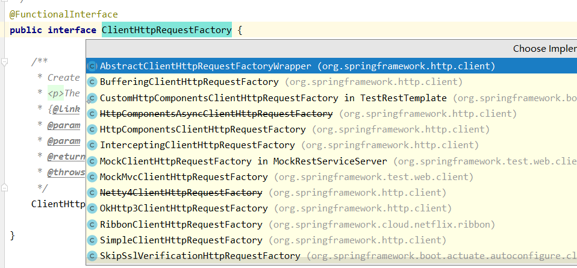

内部有很多种实现http连接的方式，okhttp等

```java
public class RestClient {

    public static void main(String[] args) {

        HttpClientBuilder httpClientBuilder = HttpClientBuilder.create();

        HttpClient httpClient = httpClientBuilder.build();

        //RestTemplate restTemplate = new RestTemplate(new OkHttp3ClientHttpRequestFactory())
        HttpComponentsClientHttpRequestFactory factory = new HttpComponentsClientHttpRequestFactory(httpClient);

        RestTemplate restTemplate = new RestTemplate(factory);

        //        String content = restTemplate.getForObject("http://localhost:8888/json/user", String.class);

        User user = restTemplate.getForObject("http://localhost:8888/json/user", User.class);

        //User user = restTemplate.getForObject("http://localhost:8888/xml/user", User.class);

        System.out.println(user);

    }
}
```

```java
//1. 发送json，使用MediaType，body为dto，转化为String
RestTemplate restTemplate = new RestTemplate(new OkHttp3ClientHttpRequestFactory());
ReceiveData receiveData = new ObjectMapper().readValue(requestData, ReceiveData.class);
RequestEntity<ReceiveData> requestEntity = RequestEntity.post(new URI("http://localhost:8080/bdmPackage/receive")).accept(MediaType.APPLICATION_JSON).body(receiveData);
ResponseEntity<ReceiveData> entity = restTemplate.postForEntity("http://localhost:8080/bdmPackage/receive", requestEntity, ReceiveData.class);
ReceiveData body = entity.getBody();

//2. 发送json，使用header，直接发送String
RequestEntity<String> askProvince = RequestEntity.post(new URI("http://www.pbzy.com/dzsc/goods/getProvince_1_0"))
    .header("Content-Type", "application/json")
    .header("cache-control", "no-cache")
    .body("{\n" +
          "    \"MsgHeader\": {\n" +
          "        \"systemId\": \"7bab0c78739316564ea5231131ecc718\",\n" +
          "        \"tokenStr\": \"1d3244b1b8ca3a947f8cde6948ab890b\",\n" +
          "        \"systemName\": \"德致商成\"\n" +
          "    },\n" +
          "    \"MsgBody\": {\n" +
          "        \n" +
          "        \"parent_id\": \"373\"\n" +
          "       \n" +
          "    }\n" +
          "}");
received = restTemplate.postForEntity("http://www.pbzy.com/dzsc/goods/getProvince_1_0", askProvince, BdmYzAreaUpdateDto.class).getBody();

```


factory子接口

