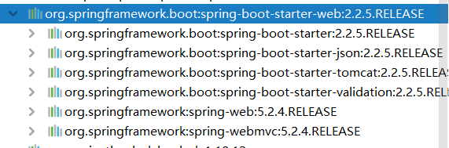
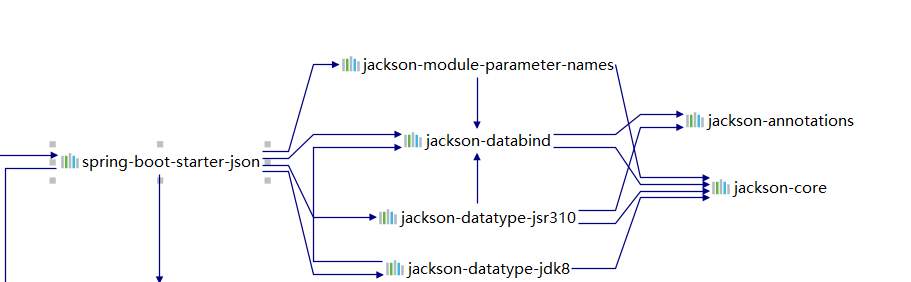
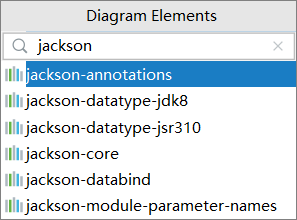
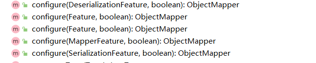
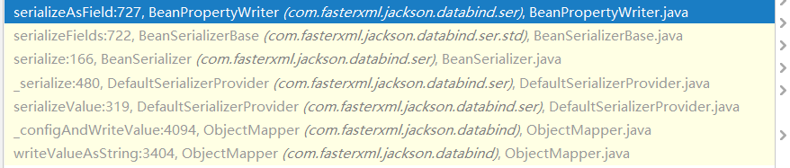
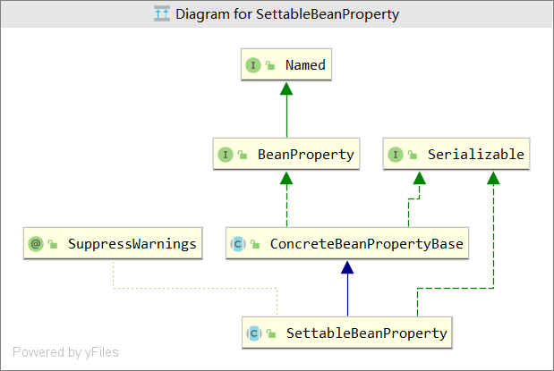
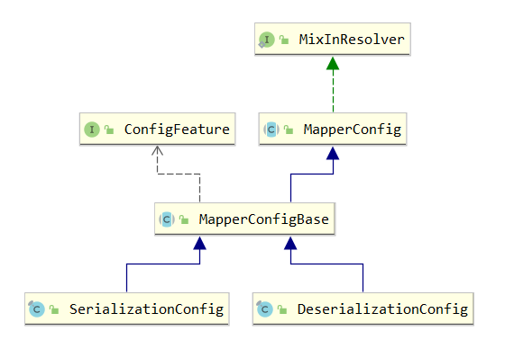
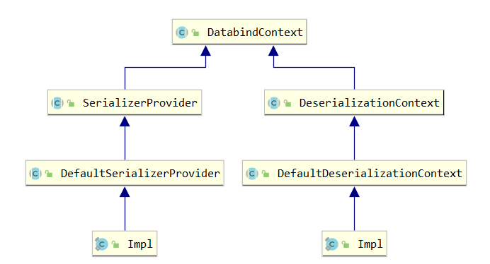
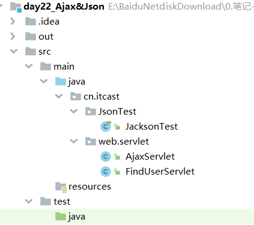
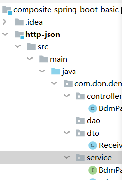

# 简介

Jackson框架是基于Java平台的一套数据处理工具，被称为“最好的Java Json解析器”。

Jackson有两个主要分支，1.x处于维护状态，只会发布bug修复版本。2.x还在积极地开发当中。这两个版本的Java包名和Maven artifact不一样，所以它们不互相兼容，但是可以和平共存，也就是项目可以同时依赖1.x和2.x而不会发生冲突。

Jackson版本： 1.x (目前版本从1.1~1.9)与2.x。1.x与2.x从包的命名上可以看出来，1.x的类库中，包命名以：org.codehaus.jackson.xxx开头，而2.x类库中包命令：com.fastxml.jackson.xxx开头。

本文以2.x为主…

## 主要模块

### 核心模块

核心模块是扩展模块构建的基础，到2.7版本为止，共有3个核心模块（依赖关系从上到下）:

```
 ***Streaming*** :   jackson-core jar，定义了底层的streaming API和实现了Json特性。
 ***Annotations*** :  jackson-annotations jar，包含了标准的Jackson注解。
 ***Databind*** :   jackson-databind jar，实现了数据绑定和对象序列化，它依赖于streaming和annotations的包。
```

### 第三方数据类型模块

这些扩展是插件式的Jackson模块，用ObjectMapper.registerModule()注册，并且通过添加serializers和deserializers以便Databind包（ObjectMapper / ObjectReader / ObjectWriter）可以读写这些类型，来增加对各种常用的Java库的数据类型的支持。参考https://github.com/FasterXML/jacksonThird-party datatype modules。

### 数据格式模块

Jackson也有处理程序对JAX-RS标准实现者例如Jersey, RESTeasy, CXF等提供了数据格式支持。处理程序实现了MessageBodyReader和MessageBodyWriter，目前支持的数据格式包括JSON, Smile, XML, YAML和CBOR。

数据格式提供了除了Json之外的数据格式支持，它们绝大部分仅仅实现了streaming API abstractions，以便数据绑定	组件可以按照原来的方式使用。另一些（几乎不需要）提供了databind标准功能来处理例如

# 依赖

```xml
<dependency>
  <groupId>com.fasterxml.jackson.core</groupId>
  <artifactId>jackson-core</artifactId>
  <version>2.7.4</version>
</dependency>

<dependency>
  <groupId>com.fasterxml.jackson.core</groupId>
  <artifactId>jackson-annotations</artifactId>
  <version>2.7.4</version>
</dependency>

<dependency>
  <groupId>com.fasterxml.jackson.core</groupId>
  <artifactId>jackson-databind</artifactId>
  <version>2.7.4</version>
</dependency>
```


- **spring-boot-starter -web也是使用jackson**








# Streaming API

是效率最高的处理方式(开销低、读写速度快，但程序编写复杂度高)

Jackson提供了一套底层API来解析Json字符串，这个API为每个Json对象提供了符号。例如， ‘{’ 是解析器提供的第一个对象（writeStartObject()），键值对是解析器提供的另一个单独对象（writeString(key,value)）。这些API很强大，但是需要大量的代码。大多数情况下，Tree Model和Data Binding可以代替Streaming API。

## Jackson Generator

```java
JsonFactory // core，生成 JsonGenerator ，JsonParser
	int DEFAULT_FACTORY_FEATURE_FLAGS //factory级别feature
    int DEFAULT_PARSER_FEATURE_FLAGS
    int DEFAULT_GENERATOR_FEATURE_FLAGS
JsonGenerator // 
	IOContext // 管理buff[]、底层io流，allocConcatBuffer
    	BufferRecycler // 使用 ThreadLocal<SoftReference<BufferRecycler>> _recyclerRef 策略
    JsonWriteContext // 很重要，对应每一个json部分，公共类，负责判断和写其他seperator，配合JsonGenerator的write方法使用，并且确定下一个属性的位置前是否需要写seperator。顶层parent是 / ，一开始就创建 JsonWriteContext.createRootContext(dups);然后会根据子object或者子array创建child
    	clearAndGetParent() // 每写完一个就返回parent
    DupDetector
    _features
    ObjectCodec //代理给ObjectMapper
	_writeStringSegment(name, 0, len); // 字符串短
	_writeStringSegments(name, 0, len);// 字符串长
	.. //真正的各种序列化操作，write
	writeEndObject() //结束对象
    flush() // 先 _flushBuffer()到用户提供的io流，如果能manage，那么io流flush()
	close()// 关闭本 JsonGenerator instance ,写结束标志} ];flush，释放buffer，
```

1. Jackson Generator用于生成JSON。对于简单的变量这种数据类型，Jackson Generator和Jackson JsonParser一样从JsonFactory中创建。

   ```java
   JsonFactory jsonFactory = new JsonFactory();
   JsonGenerator generator = jsonFactory.createGenerator(outputStream, JsonEncoding.UTF8);
   ```

2. 但是对于复杂的数据类型，Jackson Generator必须从ObjectMapper.getJsonFactory()的JsonFactory中创建，否则会报一下错误：

   ```java
   protected void _writeSimpleObject(Object value)  throws IOException
   	....
       throw new IllegalStateException("No ObjectCodec defined for the generator, can only serialize simple wrapper types (type passed "
                                       +value.getClass().getName()+")");
   ```

3. 其中，ObjectMapper.getJsonFactory()方法被标记为deprecated，不过这并没有关系，这种情况在Java编程中经常遇到，这是可以用的。但是对于那种建议不要使用的方法，最好弃之不用。

   ```java
   JsonFactory jsonFactory = new ObjectMapper().getJsonFactory();
   JsonGenerator generator = jsonFactory.createGenerator(outputStream, JsonEncoding.UTF8);
   ```

## JsonParser

JsonParser 比 Jackson OjectMapper更底层，这就使得Jackson JsonParser比ObjectMapper更快，但是也更加笨重。

Jackson JsonParser的工作方式是：将JSON分成一个记号序列，让你迭代记号（Token）序列进行解析。

同Jackson ObjectMapper一样，你也可以解析String、Reader、InputStream、URL、byte数组、char数组。

```java
JsonFactory // core，生成 JsonGenerator ，JsonParser
    JsonToken
	    IOContext
    JsonReadContext //很重要，对应json的每一个部分新建一个
   		JsonReadContext.createRootContext(dups)//
	    expectComma()// 一个JsonReadContext内json属性的间隔
    JsonParser
	    nextToken()// field names are special。读取field_name token后会顺便读取下一个token作为_nextToken,下一次直接拿到。
    //真正的各种逆序列化操作，read，下面三个方法用作拿value或者name
    	getValueAsString()//
    	getText()//
	    getCurrentName()；
   		close()
    
```

## 其他的类

```
TokenFilter
JsonPointer
JsonToken
ObjectCodec
TreeNode
```

# Tree Model

是最灵活的处理方式，看代码

# Data Binding

是最常用的处理方式。主要使用ObjectMapper来操作Json，默认情况下会使用BeanSerializer来序列化POJO。底层还是Stream Api。

复杂的部分为反射对象，如何正确地按照自定义config序列化和反序列对象和json

## 入门

### 序列化

**java -- > json** ; **property --> json属性**

**序列化**(Serialization)是将对象的状态信息转换为可以存储或传输的形式的过程。 

```java
ObjectMapper mapper = new ObjectMapper();

Person p  = new Person();
String json = mapper.writeValueAsString(p);
 //writeValue.将数据关联到Writer中
mapper.writeValue(new FileWriter("d://b.txt"),p);
```

**注意**
默认会把getter和setter的第一个小写字母之前的变为小写，和之后的原样拼接。

```java
com.fasterxml.jackson.databind.util.BeanUtil#legacyManglePropertyName
    
private String EBusinessID;  
{"ebusinessID" : null,}
```

### 反序列化

 **json --> java**

com.fasterxml.jackson.databind.ObjectMapper在Jackson Databind中。

ObjectMapper可以从String，File，InputStream，URL，自定义的Java类中读取JSON，ObjectMapper中的重载方法readValue()实现了这些功能。	

如果属性不存在，那么field为null

```java
ObjectMapper mapper = new ObjectMapper();

String json = "{\"gender\":\"男\",\"name\":\"张三\",\"age\":\"23\"}";//字符串是数字
//也可以由文本读出生成对象

//集合，使用TypeReference类
 List<City> list = mapper.readValue(listJsonStr, new  TypeReference<List<City>>(){} )
```

## 配置

### 方法

ObjectMapper提供了很多方法个性化配置



```java
//允许json属性存在但是java对象filed不存在
objectMapper.configure(DeserializationFeature.FAIL_ON_UNKNOWN_PROPERTIES, false);

//忽略大小写
objectMapper.configure(MapperFeature.ACCEPT_CASE_INSENSITIVE_PROPERTIES, true);
mapper.configure(SerializationFeature.INDENT_OUTPUT, true);     // 为了使JSON视觉上的可读性，在生产中不需如此，会增大Json的内容  
mapper.setSerializationInclusion(Include.NON_EMPTY);  // 配置mapper忽略空属性  

//忽略空field，当反序列化json时，未知属性会引起的反序列化被打断，这里我们禁用未知属性打断反序列化功能，因为，例如json里有10个属性，而我们的bean中只定义了2个属性，其它8个属性将被忽略  
mapper.disable(DeserializationFeature.FAIL_ON_UNKNOWN_PROPERTIES);
```


### 注解

```java
@JsonIgnore // 忽略该属性
@JsonFormat(pattern = "yyyy-MM-dd HH:mm:ss", timezone = "GMT+8") 
private Date birthday;
//该注解作用于field的时候作用于getter和setter，但是只在spring-boot种起作用，普通main函数不能，需要使用 set函数
objectMapper.setDateFormat(new SimpleDateFormat("yyyy-MM-dd HH:mm:ss"));
```

## 源码

### 序列化



```java
//提供符合type的serializer serialize 根对象，对field的value使用各个对应的serializer
com.fasterxml.jackson.databind.ser.DefaultSerializerProvider#serializeValue(com.fasterxml.jackson.core.JsonGenerator, java.lang.Object);
	//创建未知对象的serializer时候会做很多反射，解析类，获取method、field等和获取解析jackson特有注解
	final JsonSerializer<Object> ser = findTypedValueSerializer(cls, true, null);

//序列化rootValue，这里就是Serializer其中一个实现类BeanSerializer的具体实现，一般pojo从这里开始
com.fasterxml.jackson.databind.ser.BeanSerializer#serialize(Object bean, JsonGenerator gen, SerializerProvider provider);
  	//序列化每个field的name和value
	@Override
    public final void serialize(Object bean, JsonGenerator gen, SerializerProvider provider)
        throws IOException
    {
        if (_objectIdWriter != null) {
            gen.setCurrentValue(bean); // [databind#631]
            _serializeWithObjectId(bean, gen, provider, true);
            return;
        }
        gen.writeStartObject(bean); //序列化name
        if (_propertyFilterId != null) {
            serializeFieldsFiltered(bean, gen, provider);
        } else {
            serializeFields(bean, gen, provider);//序列化各个field，对于value也是 ser.serialize(value, gen, prov);
        }
        gen.writeEndObject();
    }
```

类情况

```java
//反射的type类
com.fasterxml.jackson.databind.type.*
com.fasterxml.jackson.databind.type.TypeFactory
com.fasterxml.jackson.databind.JavaType

//config类
com.fasterxml.jackson.databind.cfg.BaseSettings
com.fasterxml.jackson.databind.SerializationConfig
com.fasterxml.jackson.databind.DeserializationConfig

//context和工厂
com.fasterxml.jackson.databind.ser.DefaultSerializerProvider
com.fasterxml.jackson.databind.deser.DefaultDeserializationContext
com.fasterxml.jackson.databind.ser.SerializerFactory

//字符串操作
com.fasterxml.jackson.databind.JsonSerializer
//每个field的代理序列化类，在这里反射getter方法，序列化出field 的name和value
com.fasterxml.jackson.databind.ser.BeanPropertyWriter   
//执行序列化的类，使用JsonGenerator去序列化，根据field的类型有不同的实现， 序列化 field 的 value 到 writer 中
com.fasterxml.jackson.databind.JsonSerializer
```


### 反序列化

#### 类情况

```java
	//context，每次都是新的，事实上new的时候会解析好java类，分好property
package com.fasterxml.jackson.databind
public abstract class DeserializationContext
extends DatabindContext
implements Serializable 

     	//储存了json，一个一个地获取，解析出来，配合 JsonDeserializer 生成pojo
package com.fasterxml.jackson.core
public abstract class JsonParser
extends Object 
implements Closeable , Versioned
 
    //使用内置 JsonParser 进行反序列化的，针对每一种 JsonToken 使用不同的实现 ，有一个_findRootDeserializer()的过程，对象使用BeanDeserializer开头 ，
package com.fasterxml.jackson.databind                                                                                                          
public abstract class JsonDeserializer<T>
extends Object 
implements NullValueProvider                              
                                                                                                            
   //Mapping of property names to properties, built when all properties to use have been successfully resolved.
package com.fasterxml.jackson.databind.deser.impl
public class BeanPropertyMap
extends Object 
implements Iterable <SettableBeanProperty>, Serializable                                                                                            

	//一开始根据java对象初始化好的field的property  ，有很多其他的兄弟实现类                                                                                           
package com.fasterxml.jackson.databind.deser
public abstract class SettableBeanProperty
extends ConcreteBeanPropertyBase
implements Serializable                                                                          
```




真正解析的过程

```java
//com.fasterxml.jackson.databind.deser.BeanDeserializer#vanillaDeserialize    
    /**
     * Streamlined version that is only used when no "special"
     * features are enabled.
     */
	private final Object vanillaDeserialize(JsonParser p,
    		DeserializationContext ctxt, JsonToken t)
        throws IOException
    {
        final Object bean = _valueInstantiator.createUsingDefault(ctxt);
        // [databind#631]: Assign current value, to be accessible by custom serializers
        p.setCurrentValue(bean);
        if (p.hasTokenId(JsonTokenId.ID_FIELD_NAME)) {
            String propName = p.getCurrentName(); //property名字
            //循环解析所有token
            do {
                p.nextToken();
                SettableBeanProperty prop = _beanProperties.find(propName); //根据property名字找到SettableBeanProperty，包含了field的所有的信息，包括Deserializer

                if (prop != null) { // normal case
                    try {
                        prop.deserializeAndSet(p, ctxt, bean); //里面根据field的类型调用Deserializer，递归，最终得出对象或者基本类型，反射调用setter方法，设置value
                    } catch (Exception e) {
                        wrapAndThrow(e, bean, propName, ctxt);
                    }
                    continue;
                }
                handleUnknownVanilla(p, ctxt, bean, propName);
            } while ((propName = p.nextFieldName()) != null);
        }
        return bean;
    }

//com.fasterxml.jackson.databind.deser.impl.MethodProperty#deserializeAndSet
    @Override
    public void deserializeAndSet(JsonParser p, DeserializationContext ctxt,
            Object instance) throws IOException
    {
        Object value;
        if (p.hasToken(JsonToken.VALUE_NULL)) {
            if (_skipNulls) {
                return;
            }
            value = _nullProvider.getNullValue(ctxt);
        } else if (_valueTypeDeserializer == null) {
            value = _valueDeserializer.deserialize(p, ctxt);//解析出该段json
            // 04-May-2018, tatu: [databind#2023] Coercion from String (mostly) can give null
            if (value == null) {
                if (_skipNulls) {
                    return;
                }
                value = _nullProvider.getNullValue(ctxt);//json该属性为null
            }
        } else {
            value = _valueDeserializer.deserializeWithType(p, ctxt, _valueTypeDeserializer); //另一种解析方法
        }
        try {
            _setter.invoke(instance, value);
        } catch (Exception e) {
            _throwAsIOE(p, e, value);
        }
    }
```

### context和config

这两个类是公共的





## 自定义JsonSerializer、JsonDeSerializer

### 场景

```json
[{"id":null,"cityName":"gz"},{"id":2,"cityName":"dg"}]
```

但假如想让id为null的不输出，不为null的输出除了 `mapper.setSerializationInclusion(Include.NON_EMPTY); // 配置mapper忽略空属性` 这种方法外，还可以在ObjectMapper中注册一个自定义的序列化JsonSerializer和反序列化JsonDeSerializer:

```java
package com.myjackson.databinding;

import java.io.IOException;

import com.fasterxml.jackson.core.JsonGenerator;
import com.fasterxml.jackson.core.JsonProcessingException;
import com.fasterxml.jackson.databind.JsonSerializer;
import com.fasterxml.jackson.databind.SerializerProvider;

public class CityJsonSerializer  extends JsonSerializer<City>{

    @Override
    public void serialize(City city, JsonGenerator jsonGenerator, SerializerProvider arg2)
            throws IOException, JsonProcessingException {
         jsonGenerator.writeStartObject();  
         if ( city.getId()!=null) {
             jsonGenerator.writeNumberField("id", city.getId());  
         }
         jsonGenerator.writeStringField("cityName", city.getCityName());  
         jsonGenerator.writeEndObject();  

    }

}
```

```java
package com.myjackson.databinding;

import java.io.IOException;
import java.util.ArrayList;
import java.util.List;
import com.fasterxml.jackson.core.JsonParser;
import com.fasterxml.jackson.core.JsonProcessingException;
import com.fasterxml.jackson.core.JsonToken;
import com.fasterxml.jackson.databind.DeserializationContext;
import com.fasterxml.jackson.databind.JsonDeserializer;

public class CityJsonDeSerializer  extends JsonDeserializer<List<City>>{


    @Override
    public List<City> deserialize(JsonParser parser,DeserializationContext deserializationcontext) throws IOException,
            JsonProcessingException {
        List<City> list = new ArrayList<City>();
        // 开始解析数组，第一个JsonToken必须是JsonToken.START_ARRAY"["
         if (!JsonToken.START_ARRAY.equals(parser.getCurrentToken())) {
             System.out.println(parser.getCurrentToken());
             return null;
         }
        // 解析符号直到字符串结尾  
        while (!parser.isClosed()) { 
            // 如果有必要的话，这个方法会沿着流前进直到足以确下一个JsonToken的类型  
            JsonToken token = parser.nextToken();  
            // 如果是最后一个JsonToken，那么就结束了  
            if (token == null)  
                break; 
            // 数组的每个元素都是对象，因此下一个JsonToken是JsonToken.START_OBJECT"{"  
            if (!JsonToken.START_OBJECT.equals(token)) {  
                break;  
            }  
            City city = null;
            // 输出id字段的值  
            while (true) { 
                if (JsonToken.START_OBJECT.equals(token)) {  
                    city = new City();
                } 
                token = parser.nextToken();  
                if (token == null)  
                    break;  

                if (JsonToken.FIELD_NAME.equals(token) ) {

                    if("id".equals(parser.getCurrentName())){
                        token = parser.nextToken();  
                        city.setId(parser.getIntValue());
                    }else if("cityName".equals(parser.getCurrentName())){
                        token = parser.nextToken();
                        city.setCityName(parser.getText());
                    }

                }  
                if(JsonToken.END_OBJECT.equals(token)){
                    list.add(city);
                }

            }  

        }  
        return list;
    }
}
```

使用

```java
@Test
    public void StreamJsonStr2List() throws IOException{
         City city1 = new City();
         //city1.setId(1);
         city1.setCityName("gz");
         City city2 = new City();
         city2.setId(2);
         city2.setCityName("dg");

         List<City> cities = new ArrayList<City>();
         cities.add(city1);
         cities.add(city2);

         ObjectMapper mapper = new ObjectMapper();  
         SimpleModule module = new SimpleModule();  
         module.addSerializer(City.class, new CityJsonSerializer());  
         mapper.registerModule(module);  
         String listJsonStr = mapper.writeValueAsString(cities);

         System.out.println(listJsonStr);

         ObjectMapper mapper2 = new ObjectMapper();  
         SimpleModule module2 = new SimpleModule();  
         module2.addDeserializer(List.class, new CityJsonDeSerializer());  
         mapper2.registerModule(module2);  
         List<City> list = mapper2.readValue(listJsonStr, new  TypeReference<List<City>>(){} );

         for (City city: list) {
            System.out.println("id:"+city.getId()+" cityName:"+city.getCityName());
         }

    }
```

也可以简单一点，使用注解，省去在ObjectMapper 中注册SimpleModule

```
import com.fasterxml.jackson.databind.annotation.JsonSerialize;
@JsonSerialize(using=CityJsonSerializer.class)
public class City {
    ...
}
```

## property和field转换

类中的叫field。

property根据getter或者setter转化，也可以根据field转化，一般需要设置。并且json属性一般就是property。

```java
   // @JsonProperty("PushTime") 使用注解，property就是注解所确定的，不使用注解，那么就是pushTime，小写
    private String PushTime; {"PushTime": "2015-3-11 16:21:06",} //默认是不能匹配的
```

# 代码





# 结束

Stream API方式是开销最低、效率最高，但编写代码复杂度也最高，在生成Json时，需要逐步编写符号和字段拼接json,在解析Json时，需要根据token指向也查找json值，生成和解析json都不是很方便，代码可读性也很低。

Databinding处理Json是最常用的json处理方式，生成json时，创建相关的java对象，并根据json内容结构把java对象组装起来，最后调用writeValue方法即可生成json,
解析时，就更简单了，直接把json映射到相关的java对象，然后就可以遍历java对象来获取值了。底层还是使用Stream API。

TreeModel处理Json，是以树型结构来生成和解析json，生成json时，根据json内容结构，我们创建不同类型的节点对象，组装这些节点生成json。解析json时，它不需要绑定json到java bean，根据json结构，使用path或get方法轻松查找内容。
