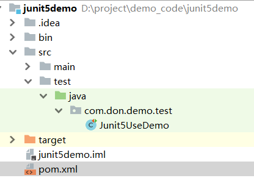

虽然JUnit5 的测试版本早就出来了，但正式版直到几年9月份推出，目前最新版5.0.1。几乎所有的Java 开发人员都会使用JUnit 来做测试，但其实很多自动化测试人员也会使用Junit 。目前，Android单元测试默认使用 Junit4，相信不久的将来也会使用 JUnit5 。

但是介绍 JUnit5 安装与使用资料并不算太多。本文普及一下JUnit5 安装与基本使用。

先看来个公式：

  JUnit 5 = JUnit Platform + JUnit Jupiter + JUnit Vintage

  这看上去比Junit4 复杂，实际上在导入包时也会复杂一些。

  **JUnit Platform**是在JVM上启动测试框架的基础。

  **JUnit Jupiter**是JUnit5扩展的新的编程模型和扩展模型，用来编写测试用例。Jupiter子项目为在平台上运行Jupiter的测试提供了一个TestEngine （测试引擎）。

  **JUnit Vintage**提供了一个在平台上运行JUnit 3和JUnit 4的TestEngine 。

 

环境：

   IDE：IntelliJ IDEA 

   版本工具：Maven

**依赖**

```xml
<?xml version="1.0" encoding="UTF-8"?>
<project xmlns="http://maven.apache.org/POM/4.0.0"
         xmlns:xsi="http://www.w3.org/2001/XMLSchema-instance"
         xsi:schemaLocation="http://maven.apache.org/POM/4.0.0 http://maven.apache.org/xsd/maven-4.0.0.xsd">
    <modelVersion>4.0.0</modelVersion>

    <groupId>groupId</groupId>
    <artifactId>junit5demo</artifactId>
    <version>1.0-SNAPSHOT</version>

    <dependencies>

        <dependency>
            <groupId>junit</groupId>
            <artifactId>junit</artifactId>
            <version>4.13-beta-3</version>
            <scope>test</scope>
        </dependency>
        <dependency>
            <groupId>org.junit.platform</groupId>
            <artifactId>junit-platform-launcher</artifactId>
            <version>1.0.1</version>
            <scope>test</scope>
        </dependency>
        <dependency>
            <groupId>org.junit.jupiter</groupId>
            <artifactId>junit-jupiter-engine</artifactId>
            <version>5.0.1</version>
            <scope>test</scope>
        </dependency>
        <dependency>
            <groupId>org.junit.vintage</groupId>
            <artifactId>junit-vintage-engine</artifactId>
            <version>4.12.1</version>
            <scope>test</scope>
        </dependency>

    </dependencies>

 <build>
         <plugins>
             <plugin>
                 <groupId>org.apache.maven.plugins</groupId>
                 <artifactId>maven-compiler-plugin</artifactId>
                 <configuration>
                     <target>1.8</target>
                     <source>1.8</source>
                     <encoding>UTF-8</encoding>
                     <showWarnings>true</showWarnings>
                 </configuration>
             </plugin>
         </plugins>
     </build>
</project>
```

明显看出和Junit4 还是有些不同的。首先，导入测试测试注解（@Test）和断言方法（assertEquals）的路径不同。其次，不需要手动把测试和测试方法声明为 public 了。

```java
package com.itheima.test;

import org.junit.jupiter.api.*;

import static junit.framework.Assert.assertEquals;
import static org.junit.Assert.assertTrue;
import static org.junit.jupiter.api.Assertions.assertAll;

public class Junit5UseDemo {


	@BeforeEach
	@DisplayName("每条用例开始时执行")
	void start() {
		
	}

	@AfterEach
	@DisplayName("每条用例结束时执行")
	void end() {

	}

	@Test
	void myFirstTest() {
		assertEquals(2, 1 + 1);
	}

	@Test
	@DisplayName("描述测试用例╯°□°）╯")
	void testWithDisplayName() {

	}

	@Test
	@Disabled("这条用例暂时跑不过，忽略!")
	void myFailTest() {
		assertEquals(1, 2);
	}

	@Test
	@DisplayName("运行一组断言")
	public void assertAllCase() {
		assertAll("groupAssert", () -> assertEquals(2, 1 + 1), () -> assertTrue(1 > 0));
	}

	@Test
	@DisplayName("依赖注入1")
	public void testInfo(final TestInfo testInfo) {
		System.out.println(testInfo.getDisplayName());
	}

	@Test
	@DisplayName("依赖注入2")
	public void testReporter(final TestReporter testReporter) {
		testReporter.publishEntry("name", "Alex");
	}

}

```

