# 介绍

Netty 是由 JBOSS 提供的一个 Java 开源框架。 Netty 提供异步的、基于事件驱动的网络应用程序框架，用以快速开发  高性能、高可靠性的网络 IO 程序。

Netty 是一个基于 NIO 的网络编程框架，**既可以是NIO，也可以是AIO**，使用 Netty 可以帮助你快速、简单的开发出一个网络应用，相当于简化和流程化了 NIO 的开发过程。

作为当前最流行的 NIO 框架， Netty 在互联网领域、大数据分布式计算领域、游戏行业、通信行业等获得了广泛的应用，知名的 Elasticsearch 、 Dubbo 框架内部都采用了 Netty。  


# 高并发痛点

**1. 内存消耗**

一个线程一个连接内存顶不住，因此需要线程池，但这不是BIO和NIO的区别。

**2. IO阻塞消耗**

IO阻塞导致线程切换，带来线程开销。

线程开销包括：内存开销（创建一个线程需要为其分配和维护一个tcb线程控制块保存上下文，一个线程私有的栈）、线程上下文切换的时间开销（保存上下文，加载下一个线程的上下文），在高并发环境下多出来的这一点点开销积累起来是非常可观的。

若使用bio，高并发必然引起激烈contention，导致大量的上下文切换，，若采用一个io一个线程模型，一个线程M级的空间消耗，内存消耗d不起。而netty采用nio加selector加线程池基本上解决了上述问题：一是线程池限制了内存消耗，二是采用selector。

使得只有处于活动状态的io才会去占用线程，不会使线程白白因为io而阻塞，提高了线程利用率。

nio的适用场景是高并发环境，线程池、io多路复用都是关键，前者使得资源消耗可控，并且节省了大量的调度开销，后者使得线程资源不会浪费在阻塞上。

**3. 深入**

如果网络条件好到爆，换句话说io开销小到可以忽略不计的话，bio的效率会比nio更高。

NIO相比BIO就是为了应对阻塞，增加一个selector进行预判阻塞与否。也就是说如果网络条件好到爆，永远不会有阻塞，直接省略seletor。

# IO多路复用、reactor模型

IO复用模型，Linux下的select、poll和epoll就是干这个的。将用户socket对应的fd注册进epoll，然后epoll帮你监听哪些socket上有消息到达，这样就避免了大量的无用操作。此时的socket应该采用**非阻塞模式**。

这样，整个过程只在调用select、poll、epoll这些调用的时候才会阻塞，收发客户消息是不会阻塞的，整个进程或者线程就被充分利用起来，这就是**事件驱动**，所谓的reactor模式。

一个请求一个线程，但客户端发送的连接请求都会注册到**多路复用器**上，多路复用器轮询到连接有I/O请求时才启动一个线程进行处理。

[I/O多路复用技术（multiplexing）是什么？](https://www.zhihu.com/question/28594409)

[为什么 IO 多路复用要搭配非阻塞 IO?](https://www.zhihu.com/question/37271342)

先看unix编程等书再来看实现细节

# 模型

## 线程模型

### 单线程模型


服务器端用一个线程通过多路复用搞定所有的 IO 操作（包括连接， 读、 写等） ， 编码简单， 清晰明了， 但是如果客户端连接数量较多， 将无法支撑， 咱们前面的 NIO 案例就属于这种模型 。

用户发起 IO 请求到 Reactor 线程，Ractor 线程将用户的 IO 请求放入到通道，然后再进行后续处理处理完成后，Reactor 线程重新获得控制权，继续其他客户端的处理。

**这种模型一个时间点只有一个任务在执行，这个任务执行完了，再去执行下一个任务。**

*1.*    *但单线程的* *Reactor* *模型每一个用户事件都在一个线程中执行：*

*2.*    *性能有极限，不能处理成百上千的事件*

*3.*    *当负荷达到一定程度时，性能将会下降*

*4.*    *某一个事件处理器发生故障，不能继续处理其他事件*

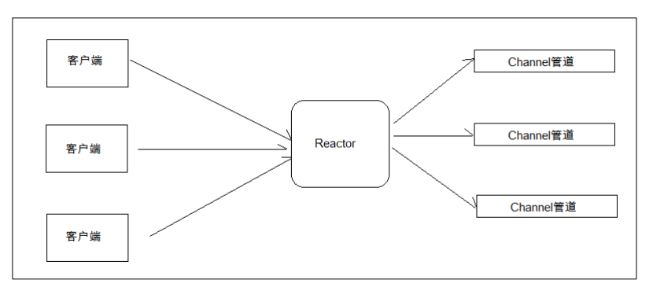

例子：足浴店只有一个接待人员，就是技师，因此技师接待完一个客人（通道读写）才能接待下一个客人

### 线程池模型

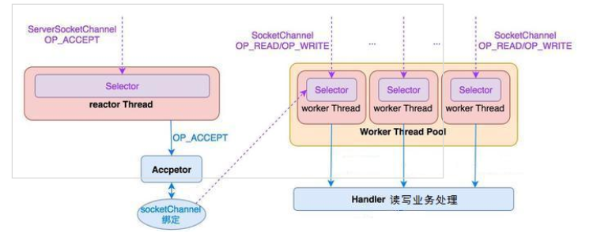

服务器端采用一个线程专门**处理客户端连接请求**， 采用一个线程池负责 **IO 操作**。 在绝大多数场景下， 该模型都能满足使用。  

**这种模式使用多个线程执行多个任务， 任务可以同时执行**

但是如果并发仍然很大， Reactor 仍然无法处理大量的客户端请求  

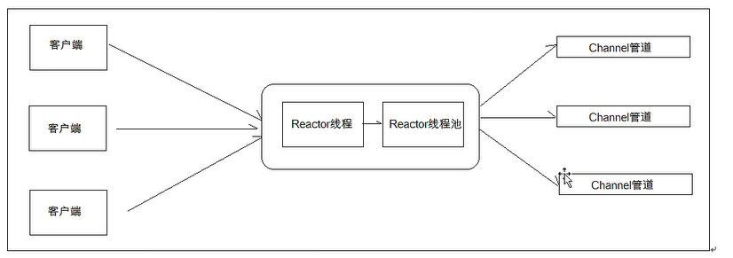

**例子：**一个接待人员，然后把客人引给不同的技师处理。

### Netty模型

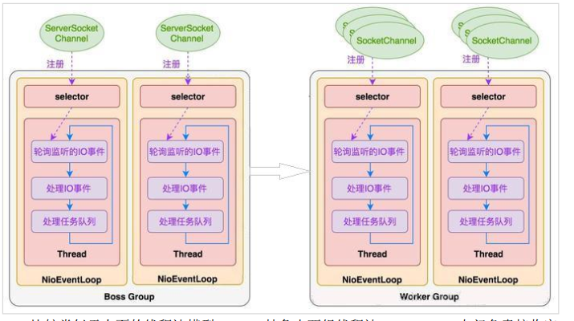

比较类似于上面的线程池模型， Netty 抽象出两组线程池， BossGroup 专门负责接收客户端连接， WorkerGroup 专门负责网络读写操作。 NioEventLoop 表示一个不断循环执行处理任务的线程， 每个 NioEventLoop 都有一个 selector， 用于监听绑定在其上的 socket 网络通道。NioEventLoop 内部采用串行化设计， 从消息的读取->解码->处理->编码->发送， 始终由 IO 线程 NioEventLoop 负责。  

一个 NioEventLoopGroup 下包含多个 NioEventLoop
每个 NioEventLoop 中包含有一个 Selector， 一个 taskQueue
每个 NioEventLoop 的 Selector 上可以注册监听多个 NioChannel
每个 NioChannel 只会绑定在唯一的 NioEventLoop 上
每个 NioChannel 都绑定有一个自己的 ChannelPipeline  

**例子：**多个接待人员和技师接待客人。

## 工作模式

**类似异步模型**

UTURE, CALLBACK 和 HANDLER  

Netty 的异步模型是建立在 future 和 callback 的之上的。 callback 大家都比较熟悉了， 这里重点说说 Future， 它的核心思想是： 假设一个方法 fun， 计算过程可能非常耗时， 等待 fun返回显然不合适。 那么可以在调用 fun 的时候， 立马返回一个 Future， 后续可以通过 Future去监控方法 fun 的处理过程。

在使用 Netty 进行编程时， 拦截操作和转换出入站数据只需要您提供 callback 或利用future 即可。 这使得链式操作简单、 高效, 并有利于编写可重用的、 通用的代码。 Netty 框架的目标就是让你的业务逻辑从网络基础应用编码中分离出来、 解脱出来  。

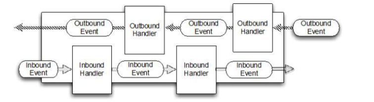

# 核心API

### ChannelHandler

ChannelHandler 接口定义了许多事件处理的方法， 我们可以通过重写这些方法去实现具体的业务逻辑。 API 关系如下图所示：  


我们经常需要自定义一个 Handler 类去继承 ChannelInboundHandlerAdapter， 然后通过重写相应方法实现业务逻辑， 我们接下来看看一般都需要重写哪些方法：  

```java
public void channelActive(ChannelHandlerContext ctx)// 通道就绪事件
public void channelRead(ChannelHandlerContext ctx, Object msg)// 通道读取数据事件
public void channelReadComplete(ChannelHandlerContext ctx) // 数据读取完毕事件
public void exceptionCaught(ChannelHandlerContext ctx, Throwable cause)// 通道发生异常事件
```

### Pipeline 和 ChannelPipeline

ChannelPipeline 是一个 Handler 的集合， 它负责处理和拦截 inbound 或者 outbound 的事件和操作， 相当于一个贯穿 Netty 的链。  任何事件的处理都要通过这条链，类似于Java EE的filter


```java
ChannelPipeline addFirst(ChannelHandler... handlers)// 把一个业务处理类（ handler） 添加到链中的第一个位置
ChannelPipeline addLast(ChannelHandler... handlers)// 把一个业务处理类（ handler） 添加到链中的最后一个位置  
```

### ChannelHandlerContext

这 是 事 件 处 理 器 上 下 文 对 象 ， Pipeline 链 中 的 实 际 处 理 节 点 。 每 个 处 理 节 点ChannelHandlerContext 中 包 含 一 个 具 体 的 事 件 处 理 器 ChannelHandler ， 同 时ChannelHandlerContext 中也绑定了对应的 pipeline 和 Channel 的信息， 方便对 ChannelHandler进行调用。 常用方法如下所示：  

### ChannelOption

Netty 在创建 Channel 实例后,一般都需要设置 ChannelOption 参数。 ChannelOption 是Socket 的标准参数， 而非 Netty 独创的。 常用的参数配置有：

1. ChannelOption.SO_BACKLOG
   对应 TCP/IP 协议 listen 函数中的 backlog 参数， 用来初始化服务器可连接队列大小。 服务端处理客户端连接请求是顺序处理的， 所以同一时间只能处理一个客户端连接。 多个客户端来的时候， 服务端将不能处理的客户端连接请求放在队列中等待处理， backlog 参数指定了队列的大小。

2. ChannelOption.SO_KEEPALIVE ， 一直保持连接活动状态。  

### ChannelFuture

表示 Channel 中异步 I/O 操作的结果， 在 Netty 中所有的 I/O 操作都是异步的， I/O 的调用会直接返回， 调用者并不能立刻获得结果， 但是**可以通过 ChannelFuture 来获取 I/O 操作的处理状态。**（这个很好实现，JDK的线程池本身就有future，获取future会阻塞，封装后再添加一个状态就可以了）  

```java
Channel channel() //返回当前正在进行 IO 操作的通道
ChannelFuture sync() //等待异步操作执行完毕
```

### EventLoopGroup 、 NioEventLoopGroup

EventLoopGroup 是一组 EventLoop 的抽象， Netty 为了更好的利用多核 CPU 资源， 一般会有多个 EventLoop 同时工作， 每个 EventLoop 维护着一个 Selector 实例。

EventLoopGroup 提供 next 接口， 可以从组里面按照一定规则获取其中一个 EventLoop来处理任务。 在 Netty 服务器端编程中， 我们一般都需要提供两个 EventLoopGroup， 例如：BossEventLoopGroup 和 WorkerEventLoopGroup。

通常一个服务端口即一个 ServerSocketChannel对应一个Selector 和一个EventLoop线程。BossEventLoop 负责接收客户端的连接并将 SocketChannel 交给 WorkerEventLoopGroup 来进行 IO 处理， 如下图所示：  

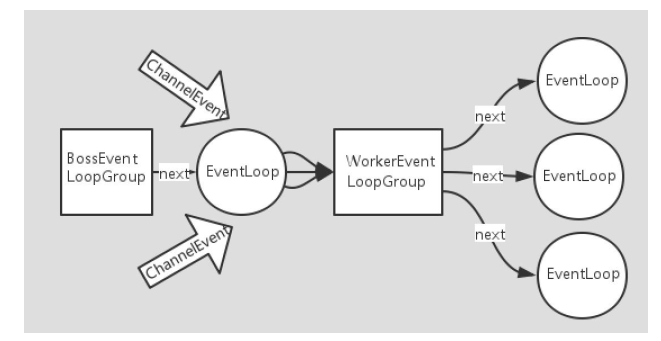

BossEventLoopGroup 通常是一个单线程的 EventLoop， EventLoop 维护着一个注册了ServerSocketChannel 的 Selector 实例， BossEventLoop 不断轮询 Selector 将连接事件分离出来，通常是 OP_ACCEPT 事件， 然后将接收到的 SocketChannel 交给 WorkerEventLoopGroup，WorkerEventLoopGroup 会由 next 选择其中一个 EventLoopGroup 来将这个 SocketChannel 注册到其维护的 Selector 并对其后续的 IO 事件进行处理。  

```java
public NioEventLoopGroup()//构造方法
public Future<?> shutdownGracefully() // 断开连接， 关闭线程
```

### ServerBootstrap 和 Bootstrap

ServerBootstrap 是 Netty 中的服务器端启动助手， 通过它可以完成服务器端的各种配置；Bootstrap 是 Netty 中的客户端启动助手， 通过它可以完成客户端的各种配置。 常用方法如下所示：  

```java
public ServerBootstrap group(EventLoopGroup parentGroup, EventLoopGroup childGroup)//该方法用于服务器端// 用来设置两个 EventLoop
public B group(EventLoopGroup group) // 该方法用于客户端// 用来设置一个 EventLoop
public B channel(Class<? extends C> channelClass)// 该方法用来设置一个服务器端的通道实现
public <T> B option(ChannelOption<T> option, T value)// 用来给 ServerChannel 添加配置
public <T> ServerBootstrap childOption(ChannelOption<T> childOption, T value)// 用来给接收到的通道添加配置
public ServerBootstrap childHandler(ChannelHandler childHandler)// 该方法用来设置业务处理类（自定义的 handler）
public ChannelFuture bind(int inetPort) // 该方法用于服务器端// 用来设置占用的端口号
public ChannelFuture connect(String inetHost, int inetPort) // 该方法用于客户端// 用来连接服务器端
```

### Unpooled 类

这是 Netty 提供的一个专门用来操作缓冲区的工具类， 常用方法如下所示：

```java
public static ByteBuf copiedBuffer(CharSequence string, Charset charset) // 通过给定的数据和字符编码返回一个 ByteBuf 对象（ 类似于 NIO 中的 ByteBuffer 对象）  
```

# 例子

### C/S架构

netty本质还是tcp协议通信，因此是不会自动解析http协议的。

建立服务器，设置参数，异步开启和关闭，通道监听，事件处理

#### Demo

一个普通的用Netty框架搭建的一个c/s架构的入门模块，就是实现[之前NIO模块C/S](0.6.java 网络IO)的功能，不过监控和接收请求的动作框架都帮我们做了，而且通过各种架构和线程大大加强了框架的可扩展性和稳定性。

> 一个handler处理从bytebuffer到string的所有编码解码过程。

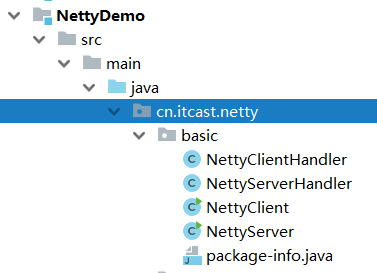

#### 多人聊天室

> byte到string是一个handler，然后如何处理string也是一个handler，解耦协议和业务。

 

### B/S架构

#### 多人聊天室

后端需要解析http协议的请求，因此需要解码器

前端使用webSocket协议，并且是html5之后才支持的。

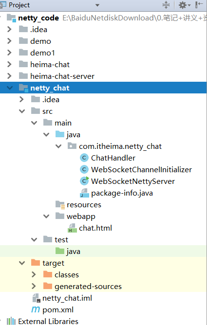

# 编码和解码

## 介绍

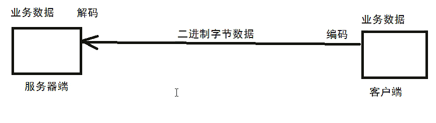

我们在编写网络应用程序的时候需要注意 codec (编解码器)， 因为数据在网络中传输的都是二进制字节码数据， 而我们拿到的目标数据往往不是字节码数据。 因此在发送数据时就需要编码， 接收数据时就需要解码。

codec 的组成部分有两个： decoder(解码器)和 encoder(编码器)。 encoder 负责把业务数据转换成字节码数据， decoder 负责把字节码数据转换成业务数据。  

- **java序列化**

其实 Java 的序列化技术就可以作为 codec 去使用， 但是它的硬伤太多：

1. 无法跨语言， 这应该是 Java 序列化最致命的问题了。

2. 序列化后的体积太大， 是二进制编码的 5 倍多。

3. 序列化性能太低。

- **netty**

由于 Java 序列化技术硬伤太多， 因此 Netty 自身提供了一些 codec， 如下所示：Netty 提供的解码器：都有对应的编码器

1. StringDecoder, 对字符串数据进行解码
2. ObjectDecoder， 对 Java 对象进行解码  

3. ... ... ...  

Netty 本身自带的 ObjectDecoder 和 ObjectEncoder 可以用来实现 POJO 对象或各种业务对象的编码和解码， 但其内部使用的仍是 Java 序列化技术， 所以我们不建议使用。 因此对于 POJO 对象或各种业务对象要实现编码和解码， 我们需要更高效更强的技术。  

## Google 的 Protobuf

### 介绍

Protobuf 是 Google 发布的开源项目， 全称 Google Protocol Buffers， 特点如下：

- 支持跨平台、 多语言（支持目前绝大多数语言， 例如 C++、 C#、 Java、 python 等）

- 高性能， 高可靠性

- 使用 protobuf 编译器能自动生成代码， Protobuf 是将类的定义使用.proto 文件进行描述，然后通过 protoc.exe 编译器根据.proto 自动生成.java 文件 。

### 使用

和之前的案例一样，只改动了传输的数据和继承的类


目前在使用 Netty 开发时， 经常会结合 Protobuf 作为 codec (编解码器)去使用， 具体用法如下所示。  

第1步：上述代码在 pom 文件中分别引入 netty 和 protobuf 的坐标。

```xml
<dependencies>
<dependency>
<groupId>io.netty</groupId>
<artifactId>netty</artifactId>
<version>4.1.8.Final</version>
</dependency>
<dependency>
<groupId>com.google.protobuf</groupId>
<artifactId>protobuf-java</artifactId>
<version>3.6.1</version>
</dependency>
</dependencies>
```

第 2 步：假设我们要处理的数据是图书信息，那就需要为此编写 proto 文件


第 3 步：通过 protoc.exe 根据描述文件生成 Java 类，具体操作如下所示：

.表示当前目录


第四步：把生成的 BookMessage.java 拷贝到自己的项目中打开，如下图所示：


这个类我们不要编辑它，直接拿着用即可，该类内部有一个内部类，这个内部类才是真正的POJO，一定要注意。

 


第 5 步：在 Netty 中去使用

代码在编写客户端程序时，要向 Pipeline 链中添加 ProtobufEncoder 编码器对象。


代码在往服务器端发送图书（POJO）时就可以使用生成的 BookMessage 类搞定，非常方便。


代码在编写服务器端程序时，要向 Pipeline 链中添加 ProtobufDecoder 解码器对象。

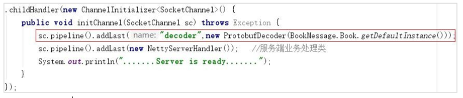

代码在服务器端接收数据时，直接就可以把数据转换成 POJO 使用，非常方便。

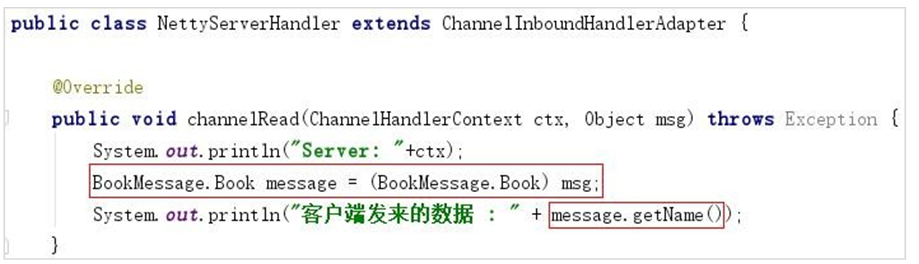

# 自定义RPC

## 介绍

**原理**

**客户端把想要调用的方法和参数封装成对象，然后转化为二进制数字，然后通过netty传过去，（其实底层跟socket通信差不多）。**

RPC（Remote Procedure Call)，即远程过程调用，它是一种通过网络从远程计算机程序上请求服务，而不需要了解底层网络实现的技术。常见的 RPC 框架有:  源自阿里的 Dubbo，Spring 旗下的 Spring Cloud，Google 出品的 grpc 等等。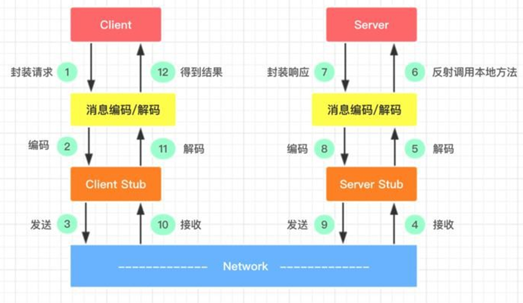

和多人聊人室基本一样，都是发送信息，然后解析。然后再写回信息。

1.	服务消费方(client)以本地调用方式调用服务
2.	client stub 接收到调用后负责将**方法、参数等封装成能够进行网络传输的消息体**
3.	client stub 将消息进行编码并发送到服务端
4.	server stub 收到消息后进行解码
5.	server stub 根据解码结果调用本地的服务
6.	本地服务执行并将结果返回给 server stub
7.	server stub 将返回导入结果进行编码并发送至消费方
8.	client stub 接收到消息并进行解码
9.	服务消费方(client)得到结果

RPC 的目标就是将 2-8 这些步骤都封装起来，用户无需关心这些细节，可以像调用本地方法一样即可完成远程服务调用。接下来我们基于 Netty 自己动手搞定一个 RPC。

## 结构设计

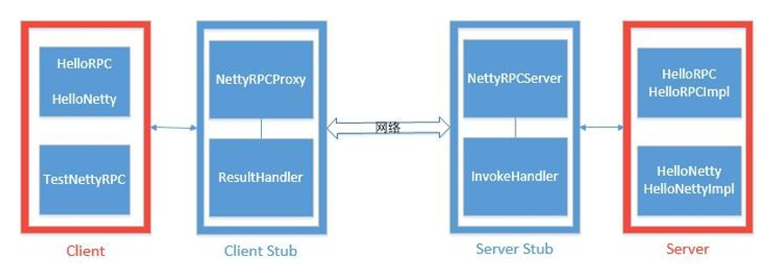

- Client(服务的调用方):  两个接口 +  一个包含 main 方法的测试类
- Client Stub:  一个客户端代理类 +  一个客户端业务处理类
- Server(服务的提供方):  两个接口 +  两个实现类
- Server Stub:  一个网络处理服务器 +  一个服务器业务处理类

注意：服务调用方的接口必须跟服务提供方的接口保持一致（包路径可以不一致）最终要实现的目标是：在 TestNettyRPC 中远程调用 HelloRPCImpl 或 HelloNettyImpl 中的法

## 例子

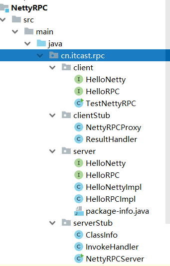

**服务端**

关键是`InvokeHandler`，服务器读取客户端发来的数据classInfo，找到具体的实现类，并通过反射调用实现类的方法

**客户端**

主要是`NettyRPCProxy`。客户端代理类，当想要远程调用接口的时候，由于接口不能调用方法，因此先通过代理创建一个代理类，由代理类封装好调用参数，然后通过netty传输，并且返回接收的结果。

# 类似wechat

需要配合[pdf文件](基于Netty网络编程项目实战笔记.pdf)一起看，都是业务逻辑，实际上的技术都在上面。

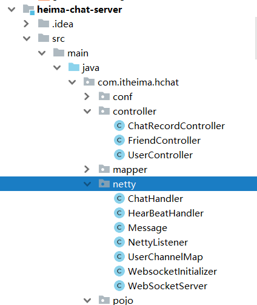

有些业务不一定需要netty，需要controller配合

netty是做即时通信的，建立通道后发送的信息才需要通过netty。

**心跳管理，空闲检查**

​	 ，

# 参考文献

https://github.com/netty/netty

https://netty.io/