# 介绍

## 概念

Spring 是分层的 Java SE/EE 应用 full-stack 轻量级开源框架，以 IoC（Inverse Of Control：反转控制）和 AOP（Aspect Oriented Programming：面向切面编程）为内核，提供了展现层 SpringMVC 和持久层 Spring JDBC 以及业务层事务管理等众多的企业级应用技术，还能整合开源世界众多著名的第三方框架和类库，逐渐成为使用最多的 Java EE 企业应用开源框架。  

## 优势

- **方便解耦，简化开发**
  通过 Spring 提供的 IoC 容器，可以将对象间的依赖关系交由 Spring 进行控制，避免硬编码所造成的过度程序耦合。用户也不必再为单例模式类、属性文件解析等这些很底层的需求编写代码，可以更专注于上层的应用。
  
- **AOP 编程的支持**
  通过 Spring 的 AOP 功能，方便进行面向切面的编程，许多不容易用传统 OOP 实现的功能可以  通过 AOP 轻松应付。

- **声明式事务的支持**
  可以将我们从单调烦闷的事务管理代码中解脱出来，通过声明式方式灵活的进行事务的管理，提高开发效率和质量。

- **方便程序的测试**
  可以用非容器依赖的编程方式进行几乎所有的测试工作，测试不再是昂贵的操作，而是随手可做的事情。

- **方便集成各种优秀框架**
  Spring 可以降低各种框架的使用难度，提供了对各种优秀框架（ Struts、 Hibernate、 Hessian、 Quartz等）的直接支持。

- **降低 JavaEE API 的使用难度**
  Spring 对 JavaEE API（如 JDBC、 JavaMail、远程调用等）进行了薄薄的封装层，使这些 API 的使用难度大为降低。

- **Java 源码是经典学习范例**
  Spring 的源代码设计精妙、结构清晰、匠心独用，处处体现着大师对 Java 设计模式灵活运用以及对 Java 技术的高深造诣。它的源代码无意是 Java 技术的最佳实践的范例。  

- **注解**

  Spring 在 2.5 版本以后开始支持注解的方式来配置依赖注入。    注解注入将会被容器在 XML 注入之前被处理，所以后者会覆盖掉前者对于同一个属性的处理结果。

# 组件

## 介绍


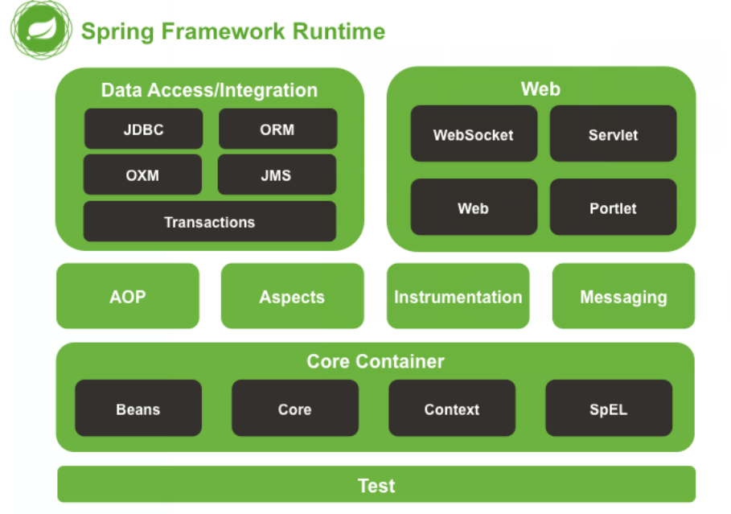

1. 核心容器：包括 Core、 Beans、 Context、 EL 模块。
   - Core 模块：封装了框架依赖的最底层部分，包括资源访问、类型转换及一些常用工具类。
   - Beans 模块：提供了框架的基础部分，包括反转控制和依赖注入。其中 Bean Factory 是容器核心，本质是“工厂设计模式”的实现，而且无需编程实现“单例设计模式”，单例完全由容器控制，而且提倡**面向接口编程**，而非面向实现编程；所有应用程序对象及对象间关系由框架管理，从而真正把你从程序逻辑中把维护对象之间的依赖关系提取出来，所有这些依赖关系都由 BeanFactory 来维护。
   - Context 模块：以 Core 和 Beans 为基础，集成 Beans 模块功能并添加资源绑定、数据验证、国际化、 Java EE 支持、容器生命周期、事件传播等；核心接口是 ApplicationContext。
   - EL 模块：提供强大的表达式语言支持，支持访问和修改属性值，方法调用，支持访问及修改数组、容器和索引器，命名变量，支持算数和逻辑运算，支持从 Spring 容器获取 Bean，它也支持列表投影、选择和一般的列表聚合等。
2. AOP、 Aspects 模块：
   - AOP 模块： Spring AOP 模块提供了符合 AOP Alliance 规范的面向方面的编程（aspect-oriented programming）实现，提供比如**日志记录、权限控制、性能统计**等通用功能和业务逻辑分离的技术，并且能动态的把这些功能添加到需要的代码中；这样各专其职，降低业务逻辑和通用功能的耦合。
   - Aspects 模块：提供了对 AspectJ 的集成， AspectJ 提供了比 Spring ASP 更强大的功能。
   - 数据访问/集成模块：该模块包括了 JDBC、 ORM、 OXM、 JMS 和事务管理。
   - 事务模块：该模块用于 Spring 管理事务，只要是 Spring 管理对象都能得到 Spring 管理事务的好处，无需在代码中进行事务控制了，而且支持编程和声明性的事务管理。
   - JDBC 模块：提供了一个 JBDC 的样例模板， 使用这些模板能消除传统冗长的 JDBC 编码还有必须的事务控制，而且能享受到 Spring 管理事务的好处。
   - ORM 模块：提供与流行的“对象-关系”映射框架的无缝集成，包括 Hibernate、 JPA、 MyBatis 等。而且可以使用 Spring 事务管理，无需额外控制事务。
   - OXM 模块：提供了一个对 Object/XML 映射实现，将 java 对象映射成 XML 数据，或者将 XML 数据映射成 java对象， Object/XML 映射实现包括 JAXB、 Castor、 XMLBeans 和 XStream。
   - JMS 模块：用于 JMS(Java Messaging Service)，提供一套 “消息生产者、消息消费者”模板用于更加简单的使用 JMS， JMS 用于用于在两个应用程序之间，或分布式系统中发送消息，进行异步通信。
   - Web/Remoting 模块： Web/Remoting 模块包含了 Web、 Web-Servlet、 Web-Struts、 Web-Porlet 模块。
   - Web 模块：构建在 application context 模块基础之上  ，提供一个适合 web 应用的上下文  ，提供了基础的 web 功能。例如多文件上传、集成 IoC 容器、远程过程访问（RMI、 Hessian、 Burlap）以及 Web Service 支持，并提供一个 RestTemplate 类来提供方便的 Restful services 访问。
   - Web-Servlet 模块：提供了一个 Spring MVC Web 框架实现。 Spring MVC 框架提供了基于注解的请求资源注入、更简单的数据绑定、数据验证等及一套非常易用的 JSP 标签，完全无缝与 Spring 其他技术协作。
   - Web-Struts 模块：提供了与 Struts 无缝集成， Struts1.x 和 Struts2.x 都支持
   - Test 模块： Spring 支持 Junit 和 TestNG 测试框架，而且还额外提供了一些基于 Spring 的测试功能，比如在测试 Web 框架时，模拟 Http 请求的功能。  

## Spring JDBC、 Spring DAO 和 Spring ORM  

**Spring-DAO** 并非 Spring 的一个模块，它实际上是指示你写 DAO 操作、写好 DAO 操作的一些规范。因此，对于访问你的数据它既没有提供接口也没有提供实现更没有提供模板。在写一个 DAO 的时候，你应该使用 `@Repository` 对其进行注解，这样底层技术(JDBC， Hibernate， JPA，等等)的相关异常才能一致性地翻译为相应 DataAccessException 子类。

**Spring-JDBC** 提供了 Jdbc 模板类，它移除了连接代码以帮你专注于 SQL 查询和相关参数。 Spring-JDBC 还提供了一个 JdbcDaoSupport，这样你可以对你的 DAO 进行扩展开发。它主要定义了两个属性：一个 DataSource和一个 JdbcTemplate，它们都可以用来实现 DAO 方法。 JdbcDaoSupport 还提供了一个将 SQL 异常转换为Spring DataAccessExceptions 的异常翻译器。

**Spring-ORM** 是一个囊括了很多持久层技术(JPA， JDO， Hibernate， iBatis)的总括模块。对于这些技术中的每一个， Spring 都提供了集成类，这样每一种技术都能够在遵循 Spring 的配置原则下进行使用，并平稳地和 Spring 事务管理进行集成。

对 于 每 一 种 技 术 ， 配 置 主 要 在 于 将 一 个 DataSource bean 注 入 到 某 种 SessionFactory 或者 EntityManagerFactory 等 bean 中。纯 JDBC 不需要这样的一个集成类(JdbcTemplate 除外)，因为 JDBC 仅依赖于一个 DataSource。

如果你计划使用一种 ORM 技术，比如 JPA 或者 Hibernate，那么你就不需要 Spring-JDBC 模块了，你需要的是这个 Spring-ORM 模块。  

# IOC

## 介绍

Spring IOC 负责创建对象，管理对象。通过依赖注入（DI），装配对象，配置对象，并且管理这些对象的整个生命周期。  

作用：削减计算机程序的耦合(解除我们代码中的依赖关系)。

### 耦合

#### 介绍

耦合性(Coupling)，也叫耦合度，是对模块间关联程度的度量。耦合的强弱取决于模块间接口的复杂性、调用模块的方式以及通过界面传送数据的多少。模块间的耦合度是指模块之间的依赖关系，包括控制关系、调用关系、数据传递关系。模块间联系越多，其耦合性越强，同时表明其独立性越差( 降低耦合性，可以提高其独立性)。 耦合性存在于各个领域，而非软件设计中独有的，但是我们只讨论软件工程中的耦合。

在软件工程中， 耦合指的就是就是对象之间的依赖性。对象之间的耦合越高，维护成本越高。因此对象的设计应使类和构件之间的耦合最小。 软件设计中通常用耦合度和内聚度作为衡量模块独立程度的标准。 划分模块的一个准则就是**高内聚低耦合**。

它有如下分类：

1. 内容耦合。当一个模块直接修改或操作另一个模块的数据时，或一个模块不通过正常入口而转入另一个模块时，这样的耦合被称为内容耦合。内容耦合是最高程度的耦合，应该避免使用之。
2. 公共耦合。两个或两个以上的模块共同引用一个全局数据项，这种耦合被称为公共耦合。在具有大量公共耦合的结构中，确定究竟是哪个模块给全局变量赋了一个特定的值是十分困难的。
3. 外部耦合 。一组模块都访问同一全局简单变量而不是同一全局数据结构，而且不是通过参数表传递该全局变量的信息，则称之为外部耦合。
4. 控制耦合 。一个模块通过接口向另一个模块传递一个控制信号，接受信号的模块根据信号值而进行适当的动作，这种耦合被称为控制耦合。
5. 标记耦合 。若一个模块 A 通过接口向两个模块 B 和 C 传递一个公共参数，那么称模块 B 和 C 之间存在一个标记耦合。
6. 数据耦合。模块之间通过参数来传递数据，那么被称为数据耦合。数据耦合是最低的一种耦合形式，系统中一般都存在这种类型的耦合，因为为了完成一些有意义的功能，往往需要将某些模块的输出数据作为另一些模块的输入数据。
7. 非直接耦合 。两个模块之间没有直接关系，它们之间的联系完全是通过主模块的控制和调用来实现的。

**总结**

耦合是影响软件复杂程度和设计质量的一个重要因素，在设计上我们应采用以下原则：如果模块间必须存在耦合，就尽量使用数据耦合，少用控制耦合，限制公共耦合的范围，尽量避免使用内容耦合。

#### **内聚与耦合**

内聚标志一个模块内各个元素彼此结合的紧密程度，它是信息隐蔽和局部化概念的自然扩展。 内聚是从功能角度来度量模块内的联系，一个好的内聚模块应当恰好做一件事。它描述的是模块内的功能联系。耦合是软件结构中各模块之间相互连接的一种度量，耦合强弱取决于模块间接口的复杂程度、进入或访问一个模块的点以及通过接口的数据。 程序讲究的是低耦合，高内聚。就是同一个模块内的各个元素之间要高度紧密，但是各个模块之间的相互依存度却要不那么紧密。

内聚和耦合是密切相关的，同其他模块存在高耦合的模块意味着低内聚，而高内聚的模块意味着该模块同其他模块之间是低耦合。在进行软件设计时，应力争做到高内聚，低耦合。  

### 解耦

- 降低程序间的依赖关系，编译期不依赖，运行时才依赖。

- **解耦的思路**
      第一步：使用反射来创建对象，而避免使用new关键字。
      第二步：通过读取配置文件来获取要创建的对象全限定类名。

- **工厂模式解耦**	

  在实际开发中我们可以把三层的对象都使用配置文件配置起来，当启动服务器应用加载的时候， 让一个类中的方法通过读取配置文件，把这些对象创建出来并存起来。在接下来的使用的时候，直接拿过来用就好了  

### 控制反转

我们在获取对象时，都是采用 new 的方式。 是主动的。  

我们获取对象时，同时跟工厂要，有工厂为我们查找或者创建对象。 是被动的。  这种被动接收的方式获取对象的思想就是控制反转，它是 spring 框架的核心之一。

## 底层细节

### 类结构

工厂类

还有其他实现类没有显示出来。

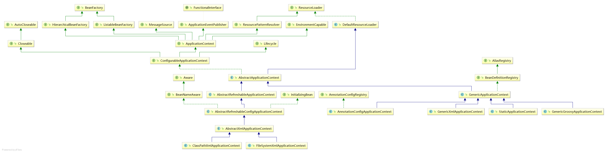


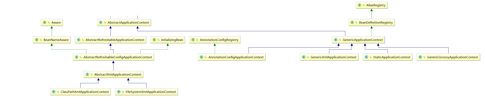

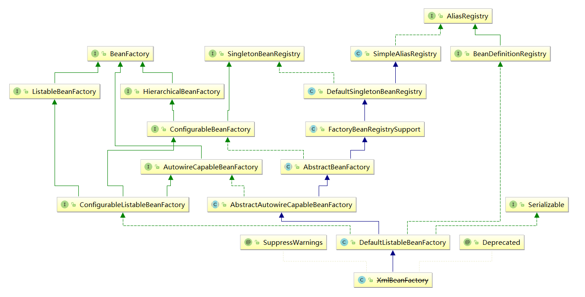

### BeanFactory

1. This interface is implemented by objects that **hold** a number of bean definitions, each uniquely identified by a String name. 

2. The point of this approach is that the BeanFactory is a **central registry** of application components, and **centralizes configuration** of application components (no more do individual objects need to read properties files, for example). 

3. Note that it is generally better to rely on **Dependency Injection** ("push" configuration) to configure application objects through setters or constructors, rather than use any form of "pull" configuration like a BeanFactory lookup. Spring's Dependency Injection functionality is implemented using this BeanFactory interface and its subinterfaces.节约性能

4. Normally a BeanFactory will load bean definitions stored in a configuration source (such as an XML document), and use the org.springframework.beans package to configure the beans. However, an implementation could simply return Java objects it creates as necessary directly in Java code. **There are no constraints on how the definitions could be stored:** LDAP, RDBMS, XML, properties file, etc. Implementations are encouraged to support references amongst beans (Dependency Injection).

   

### BeanFactory 和 ApplicationContext 的区别

1. BeanFactory 是 Spring 容器中的顶层接口。基础类型的 IOC 容器，提供完成的 IOC 服务支持。如果没有特殊指定，默认采用**延迟初始化策略**。相对来说，容器启动初期速度较快，所需资源有限。  

2. ApplicationContext 是它的子接口，ApplicationContext 是在 BeanFactory 的基础上构建，是相对比较高级的容器实现，除了 BeanFactory 的所有支持外， ApplicationContext 还提供了事件发布、国际化支持等功能。 ApplicationContext 管理的对象，在容器启动后默认全部初始化并且绑定完成。  

### ApplicationContext 接口的实现类  

- `ClassPathXmlApplicationContext`

  它是从类的根路径下加载配置文件 推荐使用这种

- `FileSystemXmlApplicationContext`

  它是从磁盘路径上加载配置文件，配置文件可以在磁盘的任意位置，ML Bean 配置文件的全路径名必须提供给它的构造函数。  

- `AnnotationConfigApplicationContext`

  当我们使用注解配置容器对象时，需要使用此类来创建 spring 容器。它用来读取注解。


## 使用

## 创建、关闭Spring容器

#### xml

```java
    public static void main(String[] args) {
        //1.获取核心容器对象
        ClassPathXmlApplicationContext ac = new ClassPathXmlApplicationContext("bean.xml"); //不用加classpath：
        //2.根据id获取Bean对象
        IAccountService as  = (IAccountService)ac.getBean("accountService");
        as.saveAccount();
        ac.close();
        ((ClassPathXmlApplicationContext)factory).registerShutdownHook(); //关闭容器使用的是实际是AbstractApplicationContext的钩子方法。
    }
```

#### ano

开启注解那里有

## 开启注解

##### 引入依赖

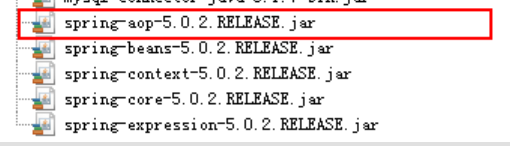

##### 使用注解

注解装配在 spring 中默认是关闭的。所以需要在 spring 的核心配置文件中配置一下才能使用基于注解的装配模式。  

1. xml方式开启注解支持

   ```xml
   <?xml version="1.0" encoding="UTF-8"?>
   <beans xmlns="http://www.springframework.org/schema/beans"
          xmlns:xsi="http://www.w3.org/2001/XMLSchema-instance"
          xmlns:context="http://www.springframework.org/schema/context"
          xsi:schemaLocation="http://www.springframework.org/schema/beans
           http://www.springframework.org/schema/beans/spring-beans.xsd
           http://www.springframework.org/schema/context
           http://www.springframework.org/schema/context/spring-context.xsd">
   
       <!--告知spring在创建容器时要扫描的包,需要扫描哪个包下的注解，不然不知道使用注解
       配置所需要的标签不是在beans的约束中，而是一个名称为context名称空间和约束中-->
       <context:component-scan base-package="com.itheima"></context:component-scan>
   </beans>
   ```

   
   
2. @Configuration  

   ```JAVA
   //@Configuration
   @ComponentScan("com.itheima")
   @Import(JdbcConfig.class)
   @PropertySource("classpath:jdbcConfig.properties")
   public class SpringConfiguration { }
   
       public  void  testQueryRunner(){
           //1.生成容器
           ApplicationContext ac = new AnnotationConfigApplicationContext(SpringConfiguration.class);
           //2.获取queryRunner对象
           QueryRunner runner = ac.getBean("runner",QueryRunner.class);
           QueryRunner runner1 = ac.getBean("runner",QueryRunner.class);
           System.out.println(runner == runner1);
       }
   ```

## 配置

替代xml配置

##### @Configuration

用于指定当前类是一个 spring 配置类， 当创建容器时会从该类上加载注解。 获取容器时需要使用`AnnotationApplicationContext(有@Configuration 注解的类.class)`。  

当配置类作为AnnotationConfigApplicationContext对象创建的参数时，该注解可以不写。

```java
@Configuration
@ComponentScan("com.itheima")
public class OtherConfiguration {
	//..其他bean方法和属性注入
}
```

##### @ComponentScan

与@Configuration一起使用，用于指定 spring 在初始化容器时要扫描的包。   

```xml
<context:component-scan base-package="com.itheima"/>
```

##### @Import

作用：
用于导入其他配置类，在引入其他配置类时，可以不用再写@Configuration 注解。 当然，写上也没问题。
属性：
value[]：用于指定其他配置类的字节码。  

有Import注解的类就父配置类，而导入的都是子配置类

```java
//@Configuration
@ComponentScan("com.itheima")
@Import(JdbcConfig.class)
@PropertySource("classpath:jdbcConfig.properties")
public class SpringConfiguration { }
```

#### 参考文件

https://blog.csdn.net/weixin_43849277/article/details/120728182 | @PropertySource与@ConfigurationProperties多种方式读取配置文件详解，附带@PropertySources使用说明_存在多个相同文件 如何使用properties读取正确配置文件-CSDN博客
https://blog.csdn.net/wangmx1993328/article/details/81005170 | Spring Boot @PropertySource 加载配置文件、@ImportResource 导入Spring 配置文件、YamlPropertiesFactoryBean 读取 yml 文件-CSDN博客
https://blog.csdn.net/weixin_44060488/article/details/134049105 | @PropertySource(“/application.yml“)用途介绍-CSDN博客

## 创建bean

### xml

##### Bean标签

```xml
<!--spring对bean的管理细节
    1.创建bean的三种方式
    2.bean对象的作用范围
    3.bean对象的生命周期
-->

<!--创建Bean的三种方式 -->
<!-- 第一种方式：使用默认构造函数创建。
        在spring的配置文件中使用bean标签，配以id和class属性之后，且没有其他属性和标签时。
        采用的就是默认构造函数创建bean对象，此时如果类中没有默认构造函数，则对象无法创建。 -->
<bean id="accountService" class="com.itheima.service.impl.AccountServiceImpl"></bean>


<!-- 第二种方式： 使用普通工厂中的方法创建对象（使用某个类中的方法创建对象，并存入spring容器）-->
<bean id="instanceFactory" class="com.itheima.factory.InstanceFactory"></bean>
<bean id="accountService" factory-bean="instanceFactory" factory-method="getAccountService"></bean>


<!-- 第三种方式：使用工厂中的静态方法创建对象（使用某个类中的静态方法创建对象，并存入spring容器) -->
<bean id="accountService" class="com.itheima.factory.StaticFactory" factory-method="getAccountService"></bean>
```

```java
public class InstanceFactory {
    //模拟一个工厂类（该类可能是存在于jar包中的，我们无法通过修改源码的方式来提供默认构造函数）
    public IAccountService getAccountService(){
        return new AccountServiceImpl();
    }
}
public class StaticFactory {
    //模拟一个工厂类（该类可能是存在于jar包中的，我们无法通过修改源码的方式来提供默认构造函数）
    public static IAccountService getAccountService(){
        return new AccountServiceImpl(); 
    }
}
```

##### 内部bean

当一个 bean 仅被用作另一个 bean 的属性时，它能被声明为一个内部 bean，为了定义 inner bean，在Spring 的 基于 XML 的 配置元数据中，可以在 <property/>或 <constructor-arg/> 元素内使用<bean/> 元素，内部 bean 通常是匿名的，它们的 Scope 一般是 prototype。  

### ano

```xml
 <bean id="" class=""> 
```

####  @Component

作用：把资源让 spring 来管理。相当于在 xml 中配置一个 `<bean id="" class="">  `。  

value：指定 bean 的 id。如果不指定 value 属性，默认 bean 的 id 是当前类的类名。首字母小写。  

#### @Controller @Service @Repository

表现层  、业务层、持久层

#### @Bean

该注解只能写在方法上，表明使用此方法创建一个对象，并且放入 spring 容器。  

name：给当前@Bean 注解方法创建的对象指定一个名称(即 bean 的 id）。*默认方法名字*

当我们使用注解配置方法时，如果方法有参数，spring框架会去容器中查找有没有可用的bean对象。查找的方式和Autowired注解的作用是一样的

```java
    @Bean(name="runner")
    @Scope("prototype")
    public QueryRunner createQueryRunner(@Qualifier("ds2") DataSource dataSource){
        return new QueryRunner(dataSource);
    }

    @Bean(name="ds2")
    public DataSource createDataSource(){
        try {
            ComboPooledDataSource ds = new ComboPooledDataSource();
            ds.setDriverClass(driver);
            ds.setJdbcUrl(url);
            ds.setUser(username);
            ds.setPassword(password);
            return ds;
        }catch (Exception e){
            throw new RuntimeException(e);
        }
    }
```

#### @Conditional

按条件创建Bean，配合@Bean使用

```java
@Bean 
@ConditionalOnMissingBean(name = "imageValidateCodeGenerator")//有bean就不使用这个
public ImageCodeGenerator imageValidateCodeGenerator() {。。}

@Bean("smsCodeSender")
@ConditionalOnMissingBean(SmsCodeSender.class)//有bean就不使用这个
public SmsCodeSender defaultSmsCodeSender() {
    return new DefaultSmsCodeSender();
}

@Bean
@ConditionalOnBean(TokenEnhancer.class)//该bean是TokenEnhancer的子类，因此需要配合@ConditionalOnBean
public TokenEnhancer jwtTokenEnhancer() {

@Bean
@ConditionalOnProperty(prefix = "imooc.security.oauth2", name = "tokenStore", havingValue = "redis")//必须配redis才生效，jwt是默认

@Configuration
@ConditionalOnProperty(prefix = "imooc.security.social.weixin", name = "app-id")
public class WeixinAutoConfiguration extends SocialAutoConfigurerAdapter {
```

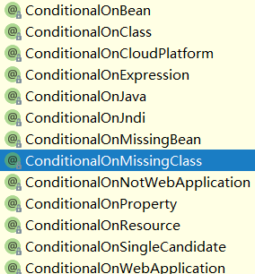

## 作用范围

#### 介绍

  取值： 常用的就是单例的和多例的

- singleton：单例的（默认值），每次使用的时候必须返回同一个实例 ，**不是线程安全的**  。
- prototype：多例的，涉及线程问题的时候就需要多例模式，每次访问对象时，都会重新创建对象实例。
- request：作用于web应用的请求范围，每次 http 请求都会创建一个 bean，该作用域仅在基于 web 的 Spring ApplicationContext 情形下有效。  
- session：作用于web应用的会话范围，在 一 个 HTTP Session 中 ， 一 个 bean 定 义 对 应 一 个 实 例 。 该 作 用 域 仅 在 基 于 web 的Spring ApplicationContext 情形下有效。  
- global-session：作用于集群环境的会话范围（全局会话范围），当不是集群环境时，它就是session。在一个全局的 HTTP Session 中，一个 bean 定义对应一个实例。该作用域仅在基于 web 的Spring ApplicationContext 情形下有效。  

#### xml

```xml
<bean id="accountService" class="com.itheima.service.impl.AccountServiceImpl" scope="prototype"></bean>
```

#### ano

##### @Scope

只作用于当前类，不会作用于成员变量，位置只是类，因此成员变量类为外部类时不可更改，默认单例。

作用：
	指定 bean 的作用范围。
属性：
	value：指定范围的值。
	取值： singleton prototype request session globalsession  


## 生命周期

#### 介绍

生命周期的很多接口都可以提供ApplicationContext的很多信息。

bean对象的生命周期
        单例对象
            出生：当容器创建时对象出生
            活着：只要容器还在，对象一直活着
            死亡：容器销毁，对象消亡
            总结：单例对象的生命周期和容器相同
        多例对象
            出生：当我们使用对象时spring框架为我们创建
            活着：对象只要是在使用过程中就一直活着。
            死亡：当对象长时间不用，且没有别的对象引用时，由Java的垃圾回收器回收

#### 工厂生命周期

BeanFactoryPostProcessor

工厂级别的，在所有bean创建前调用

```java
/**
    Allows for custom modification of an application context's bean definitions, adapting the bean property values of the context's underlying bean factory.
    Application contexts can auto-detect BeanFactoryPostProcessor beans in their bean definitions and apply them before any other beans get created.
    Useful for custom config files targeted at system administrators that override bean properties configured in the application context.
    See PropertyResourceConfigurer and its concrete implementations for out-of-the-box solutions that address such configuration needs.
    A BeanFactoryPostProcessor may interact with and modify bean definitions, but never bean instances. Doing so may cause premature bean instantiation, violating the container and causing unintended side-effects. If bean instance interaction is required, consider implementing BeanPostProcessor instead.
*/
@FunctionalInterface
public interface BeanFactoryPostProcessor {

	/**
	 * Modify the application context's internal bean factory after its standard
	 * initialization. All bean definitions will have been loaded, but no beans
	 * will have been instantiated yet. This allows for overriding or adding
	 * properties even to eager-initializing beans.
	 * @param beanFactory the bean factory used by the application context
	 * @throws org.springframework.beans.BeansException in case of errors
	 */
	void postProcessBeanFactory(ConfigurableListableBeanFactory beanFactory) throws BeansException;

}
```


#### Bean的生命周期

##### **BeanFactory的文档显示的接口**

- Bean factory implementations should support the standard **bean lifecycle** interfaces as far as possible. The full set of initialization methods and their standard order is:

  ```java
  BeanNameAware's setBeanName
  BeanClassLoaderAware's setBeanClassLoader
  BeanFactoryAware's setBeanFactory
  EnvironmentAware's setEnvironment
  EmbeddedValueResolverAware's setEmbeddedValueResolver
  ResourceLoaderAware's setResourceLoader (only applicable when running in an application context)
  ApplicationEventPublisherAware's setApplicationEventPublisher (only applicable when running in an application context)
  MessageSourceAware's setMessageSource (only applicable when running in an application context)
  ApplicationContextAware's setApplicationContext (only applicable when running in an application context)
  ServletContextAware's setServletContext (only applicable when running in a web application context)
  postProcessBeforeInitialization methods of BeanPostProcessor
  InitializingBean's afterPropertiesSet
  a custom init-method definition
  postProcessAfterInitialization methods of BeanPostProcessor
  ```

- On shutdown of a bean factory, the following lifecycle methods apply:

  ```java
  postProcessBeforeDestruction methods of DestructionAwareBeanPostProcessors
  DisposableBean's destroy
  a custom destroy-method definition
  ```

#### 总结


1. Bean自身的方法　　：　　这个包括了Bean本身调用的方法和通过配置文件中<bean>的init-method和destroy-method指定的方法

2. Bean级生命周期接口方法  ：这个包括了BeanNameAware、BeanFactoryAware、InitializingBean和DiposableBean这些接口的方法，bean自己实现，只对特定一个Bean起作用，用于获取东西的。

3. 容器级生命周期接口方法　：这个包括了InstantiationAwareBeanPostProcessor 和 BeanPostProcessor 这两个接口实现，一般称它们的实现类为“后处理器”。并且前者继承后者。所有bean的生成都会调用。

   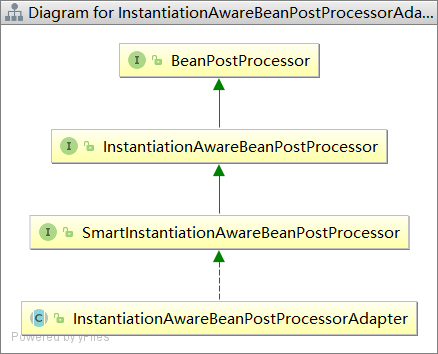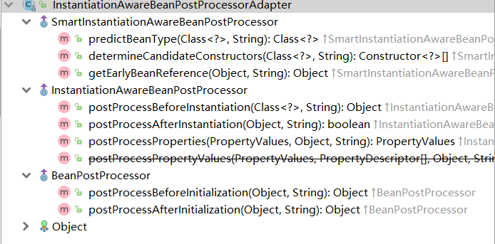

4. 工厂后处理器接口方法　　：这个包括了BeanFactoryPostProcessor、AspectJWeavingEnabler, ConfigurationClassPostProcessor, CustomAutowireConfigurer等等非常有用的工厂后处理器接口的方法。工厂后处理器也是容器级的。在应用上下文装配配置文件之后立即调用。

#### 整体次序

运行后就知道

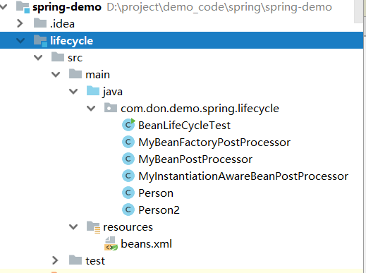

```CQL
现在开始初始化容器
-------------------------------------------------------------
【BeanFactoryPostProcessor】实现类构造器！！
【BeanFactoryPostProcessor】调用postProcessBeanFactory方法
【B——eanPostProcessor】实现类构造器！！
【I—nstantiationAwareBeanPostProcessorAdapter】实现类构造器！！
-------------------------------------------------------------
【I—nstantiationAwareBeanPostProcessorAdapter】调用 postProcessBeforeInstantiation 方法
准备初始化class com.don.demo.spring.lifecycle.Person:person
调用Person的构造器实例化
【I—nstantiationAwareBeanPostProcessorAdapter】调用 postProcessAfterInstantiation 方法
【I—nstantiationAwareBeanPostProcessorAdapter】调用postProcessPropertyValues方法
注入属性address
注入属性name
注入属性phone
【BeanNameAware】调用BeanNameAware.setBeanName()
【BeanFactoryAware】调用BeanFactoryAware.setBeanFactory()
【B—eanPostProcessor】接口方法postProcessBeforeInitialization对属性进行更改！
【I—nstantiationAwareBeanPostProcessorAdapter】调用 postProcessBeforeInitialization 方法
【InitializingBean】调用InitializingBean.afterPropertiesSet()
【init-method】调用<bean>的init-method属性指定的初始化方法
【B—eanPostProcessor】接口方法postProcessAfterInitialization对属性进行更改！
【I—nstantiationAwareBeanPostProcessorAdapter】调用 postProcessAfterInitialization 方法
-------------------------------------------------------------
【I—nstantiationAwareBeanPostProcessorAdapter】调用 postProcessBeforeInstantiation 方法
准备初始化class com.don.demo.spring.lifecycle.Person2:person2
调用Person2的构造器实例化
【I—nstantiationAwareBeanPostProcessorAdapter】调用 postProcessAfterInstantiation 方法
【I—nstantiationAwareBeanPostProcessorAdapter】调用postProcessPropertyValues方法
【B—eanPostProcessor】接口方法postProcessBeforeInitialization对属性进行更改！
【I—nstantiationAwareBeanPostProcessorAdapter】调用 postProcessBeforeInitialization 方法
【B—eanPostProcessor】接口方法postProcessAfterInitialization对属性进行更改！
【I—nstantiationAwareBeanPostProcessorAdapter】调用 postProcessAfterInitialization 方法
-------------------------------------------------------------
-------------------------------------------------------------
容器初始化成功
Person [address=广州, name=张三, phone=110]
-------------------------------------------------------------
现在开始关闭容器！
【DiposibleBean】调用DiposibleBean.destory()
【destroy-method】调用<bean>的destroy-method属性指定的初始化方法
```


#### xml

```xml
    <bean id="accountService" class="com.itheima.service.impl.AccountServiceImpl"
          scope="prototype" init-method="init" destroy-method="destroy"></bean>
```

```java
public class AccountServiceImpl implements IAccountService {
    
    public AccountServiceImpl(){
        System.out.println("对象创建了");
    }

    public void  saveAccount(){
        System.out.println("service中的saveAccount方法执行了。。。");
    }

    public void  init(){
        System.out.println("对象初始化了。。。");
    }
    public void  destroy(){
        System.out.println("对象销毁、了。。。");
    }

}
```

#### ano

```xml
<bean id="" class="" init-method="" destroy-method="" />
```

##### @PostConstruct

用于指定初始化方法。  

##### @PreDestroy

用于指定销毁方法。

#### 接口类型

初始化：实现 org.springframwork.beans.factory.InitializingBean 接口  

销毁：  实现 org.springframwork.bean.factory.DisposableBean接口  

#### 应用

利用生命周期接口来获取bean的工具类

```java
@Component
public class SpringUtil implements ApplicationContextAware {
	
	private static ApplicationContext applicationContext;

	@Override
	public void setApplicationContext(ApplicationContext applicationContext) throws BeansException {
		if (SpringUtil.applicationContext == null) {
			SpringUtil.applicationContext = applicationContext;
		}
	}

	// 获取applicationContext
	public static ApplicationContext getApplicationContext() {
		return applicationContext;
	}

	// 通过name获取 Bean.
	public static Object getBean(String name) {
		return getApplicationContext().getBean(name);
	}

	// 通过class获取Bean.
	public static <T> T getBean(Class<T> clazz) {
		return getApplicationContext().getBean(clazz);
	}

	// 通过name,以及Clazz返回指定的Bean
	public static <T> T getBean(String name, Class<T> clazz) {
		return getApplicationContext().getBean(name, clazz);
	}

}
```


## 依赖注入

#### xml

Dependency Injection。 它是 spring 框架核心 ioc 的具体实现  

spring 使用 javaBean 对象的 set 方法或者带参数的构造方法为我们在创建所需对象时将其属性自动设置所需要的值的过程，就是依赖注入的思想。  

如果是经常变化的数据，并不适用于注入的方式

```properties
   能注入的数据：有三类
       基本类型和String
       其他bean类型（在配置文件中或者注解配置过的bean）
       复杂类型/集合类型
    注入的方式：有三种
       第一种：使用构造函数提供
       第二种：使用set方法提供
```

##### 构造函数注入

```xml
    <!--构造函数注入：
        使用的标签:constructor-arg
        标签出现的位置：bean标签的内部
        标签中的属性
            type：用于指定要注入的数据的数据类型，该数据类型也是构造函数中某个或某些参数的类型
            index：用于指定要注入的数据给构造函数中指定索引位置的参数赋值。索引的位置是从0开始
            name：用于指定给构造函数中指定名称的参数赋值                                        常用的
            =============以上三个用于指定给构造函数中哪个参数赋值===============================
            value：用于提供基本类型和String类型的数据
            ref：用于指定其他的bean类型数据。它指的就是在spring的Ioc核心容器中出现过的bean对象

        优势：
            在获取bean对象时，注入数据是必须的操作，否则对象无法创建成功。
        弊端：
            改变了bean对象的实例化方式，使我们在创建对象时，如果用不到这些数据，也必须提供。
    -->
    <bean id="accountService" class="com.itheima.service.impl.AccountServiceImpl">
        <constructor-arg name="name" value="泰斯特"></constructor-arg>
        <constructor-arg name="age" value="18"></constructor-arg>
        <constructor-arg name="birthday" ref="now"></constructor-arg>
    </bean>
```

```java
    public AccountServiceImpl(String name,Integer age,Date birthday){
        this.name = name;
        this.age = age;
        this.birthday = birthday;
    }
```

##### set注入

```xml
    <!-- 配置一个日期对象 -->
    <bean id="now" class="java.util.Date"></bean>

    <!-- set方法注入                更常用的方式
        涉及的标签：property
        出现的位置：bean标签的内部
        标签的属性
            name：用于指定注入时所调用的set方法名称
            value：用于提供基本类型和String类型的数据
            ref：用于指定其他的bean类型数据。它指的就是在spring的Ioc核心容器中出现过的bean对象
        优势：
            创建对象时没有明确的限制，可以直接使用默认构造函数
        弊端：
            如果有某个成员必须有值，则获取对象是有可能set方法没有执行。
    -->
    <bean id="accountService2" class="com.itheima.service.impl.AccountServiceImpl2">
        <property name="name" value="TEST" ></property>
        <property name="age" value="21"></property>
        <property name="birthday" ref="now"></property>
    </bean>
```

```java
public class AccountServiceImpl2 implements IAccountService {

    //如果是经常变化的数据，并不适用于注入的方式
    private String name;
    private Integer age;
    private Date birthday;

    public void setName(String name) {
        this.name = name;
    }

    public void setAge(Integer age) {
        this.age = age;
    }

    public void setBirthday(Date birthday) {
        this.birthday = birthday;
    }

    public void  saveAccount(){
        System.out.println("service中的saveAccount方法执行了。。。"+name+","+age+","+birthday);
    }
}
```

##### 集合注入

```xml
    <!-- 复杂类型的注入/集合类型的注入
        用于给List结构集合注入的标签：
            list array set
        用于个Map结构集合注入的标签:
            map  props
        结构相同，标签可以互换
    -->
    <bean id="accountService3" class="com.itheima.service.impl.AccountServiceImpl3">
        <property name="myStrs">
            <set>
                <value>AAA</value>
                <value>BBB</value>
                <value>CCC</value>
            </set>
        </property>

        <property name="myList">
            <array>
                <value>AAA</value>
                <value>BBB</value>
                <value>CCC</value>
            </array>
        </property>

        <property name="mySet">
            <list>
                <value>AAA</value>
                <value>BBB</value>
                <value>CCC</value>
            </list>
        </property>

        <property name="myMap">
            <props>
                <prop key="testC">ccc</prop>
                <prop key="testD">ddd</prop>
            </props>
        </property>

        <property name="myProps">
            <map>
                <entry key="testA" value="aaa"></entry>
                <entry key="testB">
                    <value>BBB</value>
                </entry>
            </map>
        </property>

    </bean>
```

```java
public class AccountServiceImpl3 implements IAccountService {

    private String[] myStrs;
    private List<String> myList;
    private Set<String> mySet;
    private Map<String,String> myMap;
    private Properties myProps;

    public void setMyStrs(String[] myStrs) {
        this.myStrs = myStrs;
    }

    public void setMyList(List<String> myList) {
        this.myList = myList;
    }

    public void setMySet(Set<String> mySet) {
        this.mySet = mySet;
    }

    public void setMyMap(Map<String, String> myMap) {
        this.myMap = myMap;
    }

    public void setMyProps(Properties myProps) {
        this.myProps = myProps;
    }

    public void  saveAccount(){
        System.out.println(Arrays.toString(myStrs));
        System.out.println(myList);
        System.out.println(mySet);
        System.out.println(myMap);
        System.out.println(myProps);
    }


}
```

##### p名称空间注入

本质还是调用类中的 set 方法  

```xml
<bean id="accountService"
class="com.itheima.service.impl.AccountServiceImpl4"
p:name="test" p:age="21" p:birthday-ref="now"/>
```

#### ano

```xml
 <property name="" ref="">
<property name="" value="">
```

##### @Autowired

自动按照类型注入。当使用注解注入属性时， **set 方法可以省略**，使用暴力反射,不用setter。

它只能注入其他 bean 类型。当有多个类型匹配时，使用要注入的对象变量名称作为 bean 的 id，在 spring 容器查找，找到了也可以注入成功。找不到就报错。  

应用于有值设值方法、非设值方法、构造方法和变量  。

##### @Qualifier

在自动按照类型注入的基础之上，再按照 Bean 的 id 注入。它在给字段注入时不能独立使用，必须和@Autowire 一起使用；但是**给方法参数**注入时，可以独立使用。  


##### @Resource

作用：

​	直接按照 Bean 的 id 注入。它也只能注入其他 bean 类型。

属性：
	name：指定 bean 的 id  

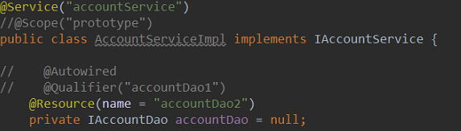

##### @Value

作用：
注入基本数据类型和 String 类型数据的，配合@PropertySource，使用EL表达式  
属性：
value：用于指定值  

```java
@PropertySource("jdbcConfig.properties")
public class JdbcConfig {
    @Value("${jdbc.driver}")
    private String driver;
    @Value("${jdbc.url}")
    private String url;
    @Value("${jdbc.username}")
    private String username;
    @Value("${jdbc.password}")
    ...
}
```

```properties
jdbc.driver=com.mysql.jdbc.Driver
jdbc.url=jdbc:mysql://localhost:3306/eesy
jdbc.username=root
jdbc.password=1234
```

##### @PropertySource

用于加载.properties 文件中的配置。例如我们配置数据源时，可以把连接数据库的信息写到properties 配置文件中，就可以使用此注解指定 properties 配置文件的位置。  

value[]：用于指定 properties 文件位置。如果是在类路径下，需要写上 classpath:

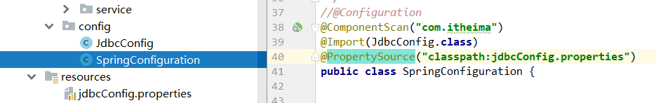

##### @Required

```java
// Marks a method (typically a JavaBean setter method) as being 'required': that is, the setter method must be configured to be dependency-injected with a value.

//例子
public class Student {
    private Integer age;
    private String name;
    
    @Required
    public void setAge(Integer age){
        this.age = age;
    }
    
    ...
}
```

```xml
  <!-- 抛出的异常为：BeanInitializationException。 -->
  <bean id="student" class="com.jsoft.testspring.testannotationrequired.Student">
        <property name="name" value="Jim"/>
   </bean>
   
  <!--运行结果一切正常 -->
    <bean id="student" class="com.jsoft.testspring.testannotationrequired.Student">
        <property name="name" value="Jim"/>
        <property name="age" value="27"/>
   </bean>
```

## 代码


## 注解和 XML 的选择

1. 注解配置和 xml 配置要实现的功能都是一样的，都是要降低程序间的耦合。只是配置的形式不一样。  

2. 注解的优势：
   配置简单，维护方便（我们找到类，就相当于找到了对应的配置）。

3. XML 的优势：
   修改时，不用改源码。不涉及重新编译和部署。  

4. 注解注入将会被容器在 XML 注入之前被处理，所以后者会覆盖掉前者对于同一个属性的处理结果。


# AOP

## 介绍

AOP（Aspect Oriented Programming），即面向切面编程，可以说是 OOP（Object Oriented Programming，面向对象编程）的补充和完善。 OOP 引入封装、继承、多态等概念来建立一种对象层次结构，用于模拟公共行为的一个集合。不过 OOP 允许开发者定义纵向的关系，但并不适合定义横向的关系，例如日志功能。日志代码往往横向地散布在所有对象层次中，而与它对应的对象的核心功能毫无关系对于其他类型的代码，如安全性、异常处理和透明的持续性也都是如此，这种散布在各处的无关的代码被称为横切（cross cutting），在 OOP 设计中，它导致了大量代码的重复，而不利于各个模块的重用。

AOP 技术恰恰相反，它利用一种称为"横切"的技术，剖解开封装的对象内部，并将那些影响了多个类的公共行为封装到一个可重用模块，并将其命名为"Aspect"，即切面。所谓"切面"，简单说就是那些与业务无关，却为业务模块所共同调用的逻辑或责任封装起来，便于减少系统的重复代码，降低模块之间的耦合度，并有利于未来的可操作性和可维护性。

使用"横切"技术， AOP 把软件系统分为两个部分：**核心关注点和横切关注点**。业务处理的主要流程是核心关注点，与之关系不大的部分是横切关注点。横切关注点的一个特点是，他们经常发生在核心关注点的多处，而各处基本相似，比如权限认证、日志、事物。 AOP 的作用在于分离系统中的各种关注点，将核心关注点和横切关注点分离开来。AOP 核心就是切面，它将多个类的通用行为封装成可重用的模块，该模块含有一组 API 提供横切功能。比如，一个日志模块可以被称作日志的 AOP 切面。根据需求的不同，一个应用程序可以有若干切面。在 Spring AOP 中，切面通过带有@Aspect 注解的类实现。  

在面向对象编程（oop）思想中，我们将事物纵向抽成一个个的对象。而在面向切面编程中，我们将一个个的对象某些类似的方面横向抽成一个切面，对这个切面进行一些如权限控制、事物管理，记录日志等公用操作处理的过程就是面向切面编程的思想。 AOP 底层是动态代理，如果是接口采用 JDK 动态代理，如果是类采用CGLIB 方式实现动态代理。  

- 通知：是个在方法执行前或执行后要做的动作，实际上是程序执行时要通过 SpringAOP 框架触发的代码段。  
- 切入点：是一个或一组连接点，通知将在这些位置执行。可以通过表达式或匹配的方式指明切入点。  
- 目标对象：被一个或者多个切面所通知的对象。它通常是一个代理对象。也指被通知（advised）对象。  
- 代理：是通知目标对象后创建的对象。从客户端的角度看，代理对象和目标对象是一样的  
- 织入：是将切面和到其他应用类型或对象连接或创建一个被通知对象的过程。织入可以在编译时，加载时，或运行时完成。  

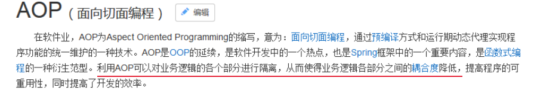

- a、开发阶段（我们做的）

  编写核心业务代码（开发主线）：大部分程序员来做，要求熟悉业务需求,因为事务管理是属于系统层面的服务，而不是业务逻辑的一部分，如果想要改变事务管理策划的话，也只需要在定义文件中重新配置即可，这样维护起来极其方便。

  把公用代码抽取出来，制作成通知。（开发阶段最后再做），在配置文件中，声明切入点与通知间的关系，即切面。： AOP 编程人员来做。

- b、运行阶段（ Spring 框架完成的）

  Spring 框架监控切入点方法的执行。一旦监控到切入点方法被运行，使用代理机制，动态创建目标对象的代理对象，根据通知类别，在代理对象的对应位置，将通知对应的功能织入，完成完整的代码逻辑运行。  

## 原理

动态代理，在 spring 中，框架会根据目标类是否实现了接口来决定采用哪种动态代理的方式。

## 使用

### 依赖

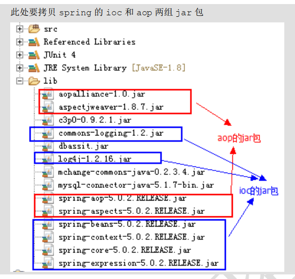

### xml

#### 配置

1. 把通知Bean也交给spring来管理
2. 使用aop:config标签表明开始AOP的配置
3. 使用aop:aspect标签表明配置切面
       id属性：是给切面提供一个唯一标识
        ref属性：是指定通知类bean的Id。
4. 使用 aop:pointcut 配置切入点表达式 ，全局的，可以不使用
5. 在aop:aspect标签的内部使用对应标签来配置通知的类型

```xml
<?xml version="1.0" encoding="UTF-8"?>
<beans xmlns="http://www.springframework.org/schema/beans"
       xmlns:xsi="http://www.w3.org/2001/XMLSchema-instance"
       xmlns:aop="http://www.springframework.org/schema/aop"
       xsi:schemaLocation="http://www.springframework.org/schema/beans
        http://www.springframework.org/schema/beans/spring-beans.xsd
        http://www.springframework.org/schema/aop
        http://www.springframework.org/schema/aop/spring-aop.xsd">

    <!-- 配置srping的Ioc,把service对象配置进来-->
    <bean id="accountService" class="com.itheima.service.impl.AccountServiceImpl"></bean>

    <!--我们现在示例是让printLog方法在切入点方法执行之前之前：所以是前置通知
               aop:before：表示配置前置通知
                    method属性：用于指定Logger类中哪个方法是前置通知
                    pointcut属性：用于指定切入点表达式，该表达式的含义指的是对业务层中哪些方法增强
    -->

    <!-- 配置Logger类 -->
    <bean id="logger" class="com.itheima.utils.Logger"></bean>

    <!--配置AOP-->
    <aop:config>
        <!--配置切面 -->
        <aop:aspect id="logAdvice" ref="logger">
            <!-- 配置通知的类型，并且建立通知方法和切入点方法的关联-->
            <aop:before method="printLog" pointcut="execution(* com.itheima.service.impl.*.*(..))"></aop:before>
        </aop:aspect>

    </aop:config>

</beans>
```

```java
public class Logger {

    /**
     * 用于打印日志：计划让其在切入点方法执行之前执行（切入点方法就是业务层方法）
     */
    public  void printLog(){
        System.out.println("Logger类中的pringLog方法开始记录日志了。。。");
    }
}

package com.itheima.service.impl;

import com.itheima.service.IAccountService;

/**
 * 账户的业务层实现类
 */
public class AccountServiceImpl implements IAccountService{

    @Override
    public void saveAccount() {
        System.out.println("执行了保存");
    }

    @Override
    public void updateAccount(int i) {
        System.out.println("执行了更新"+i);

    }

    @Override
    public int deleteAccount() {
        System.out.println("执行了删除");
        return 0;
    }
}

```

#### 切入点表达式

```xml
   <!--         切入点表达式的写法：
                关键字：execution(表达式)
                表达式：
                    访问修饰符  返回值  包名.包名.包名...类名.方法名(参数列表)
                标准的表达式写法：
                    public void com.itheima.service.impl.AccountServiceImpl.saveAccount()
                访问修饰符可以省略
                    void com.itheima.service.impl.AccountServiceImpl.saveAccount()
                返回值可以使用通配符，表示任意返回值
                    * com.itheima.service.impl.AccountServiceImpl.saveAccount()
                包名可以使用通配符，表示任意包。但是有几级包，就需要写几个*.
                    * *.*.*.*.AccountServiceImpl.saveAccount())
                包名可以使用..表示当前包及其子包
                    * *..AccountServiceImpl.saveAccount()
                类名和方法名都可以使用*来实现通配
                    * *..*.*()
                参数列表：
                    可以直接写数据类型：
                        基本类型直接写名称           int
                        引用类型写包名.类名的方式   java.lang.String
                    可以使用通配符表示任意类型，但是必须有参数
                    可以使用..表示有无参数均可，有参数可以是任意类型
                全通配写法：
                    * *..*.*(..)

                实际开发中切入点表达式的通常写法：
                    切到业务层实现类下的所有方法
                        * com.itheima.service.impl.*.*(..)
```

#### 通知

##### 单个通知

```xml
    <!--配置AOP-->
    <aop:config>
        <!-- 配置切入点表达式 id属性用于指定表达式的唯一标识。expression属性用于指定表达式内容
              此标签写在aop:aspect标签内部只能当前切面使用。
              它还可以写在aop:aspect外面，此时就变成了所有切面可用(只能在aop:aspect前使用)
          -->
        <aop:pointcut id="pt1" expression="execution(* com.itheima.service.impl.*.*(..))"></aop:pointcut>
        <!--配置切面 -->
        <aop:aspect id="logAdvice" ref="logger">

            <!-- 配置前置通知：在切入点方法执行之前执行
            <aop:before method="beforePrintLog" pointcut-ref="pt1" ></aop:before>-->

            <!-- 配置后置通知：在切入点方法正常执行之后值。它和异常通知永远只能执行一个
            <aop:after-returning method="afterReturningPrintLog" pointcut-ref="pt1"></aop:after-returning>-->

            <!-- 配置异常通知：在切入点方法执行产生异常之后执行。它和后置通知永远只能执行一个
            <aop:after-throwing method="afterThrowingPrintLog" pointcut-ref="pt1"></aop:after-throwing>-->

            <!-- 配置最终通知：无论切入点方法是否正常执行它都会在其后面执行
            <aop:after method="afterPrintLog" pointcut-ref="pt1"></aop:after>-->

            <!-- 配置环绕通知 详细的注释请看Logger类中-->
            <aop:around method="aroundPringLog" pointcut-ref="pt1"></aop:around>
        </aop:aspect>
    </aop:config>
```

##### 环绕通知

```java
    /**
     * 环绕通知
     * 问题：
     *      当我们配置了环绕通知之后，切入点方法没有执行，而通知方法执行了。
     * 分析：
     *      通过对比动态代理中的环绕通知代码，发现动态代理的环绕通知有明确的切入点方法调用，而我们的代码中没有。
     * 解决：
     *      Spring框架为我们提供了一个接口：ProceedingJoinPoint。该接口有一个方法proceed()，此方法就相当于明确调用切入点方法。
     *      该接口可以作为环绕通知的方法参数，在程序执行时，spring框架会为我们提供该接口的实现类供我们使用。
     *
     * spring中的环绕通知： v
     *      它是spring框架为我们提供的一种可以在代码中手动控制增强方法何时执行的方式。
     */
    public Object aroundPringLog(ProceedingJoinPoint pjp){
        Object rtValue = null;
        try{
            Object[] args = pjp.getArgs();//得到方法执行所需的参数

            System.out.println("Logger类中的aroundPringLog方法开始记录日志了。。。前置");

            rtValue = pjp.proceed(args);//明确调用业务层方法（切入点方法）

            System.out.println("Logger类中的aroundPringLog方法开始记录日志了。。。后置");

            return rtValue;
        }catch (Throwable t){
            System.out.println("Logger类中的aroundPringLog方法开始记录日志了。。。异常");
            throw new RuntimeException(t);
        }finally {
            System.out.println("Logger类中的aroundPringLog方法开始记录日志了。。。最终");
        }
    }

```

#### 代码

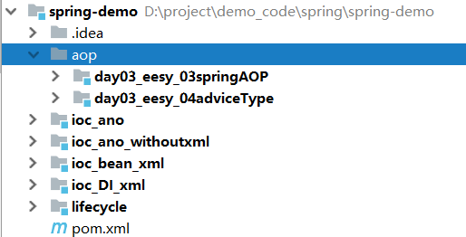


### 注解

#### 开启注解

##### xml方式

```xml
<?xml version="1.0" encoding="UTF-8"?>
<beans xmlns="http://www.springframework.org/schema/beans"
       xmlns:xsi="http://www.w3.org/2001/XMLSchema-instance"
       xmlns:aop="http://www.springframework.org/schema/aop"
       xmlns:context="http://www.springframework.org/schema/context"
       xsi:schemaLocation="http://www.springframework.org/schema/beans
        http://www.springframework.org/schema/beans/spring-beans.xsd
        http://www.springframework.org/schema/aop
        http://www.springframework.org/schema/aop/spring-aop.xsd
        http://www.springframework.org/schema/context
        http://www.springframework.org/schema/context/spring-context.xsd">

    <!-- 配置spring创建容器时要扫描的包-->
    <context:component-scan base-package="com.itheima"></context:component-scan>

    <!-- 配置spring开启注解AOP的支持 -->
    <aop:aspectj-autoproxy></aop:aspectj-autoproxy>
</beans>
```

##### ano

@EnableAspectJAutoProxy

```java
@Configuration
@ComponentScan(basePackages="com.itheima")
@EnableAspectJAutoProxy
public class SpringConfiguration {
}
```


#### 声明切面

@Aspect   

```java
@Component("logger")
@Aspect//表示当前类是一个切面类
public class Logger {
    ...
```


#### 切入点表达式

全局使用

@Pointcut

```java
@Pointcut("execution(* com.itheima.service.impl.*.*(..))")
@Before("pt1()")
 public  void beforePrintLog(){
        System.out.println("前置通知Logger类中的beforePrintLog方法开始记录日志了。。。");
    }
```

#### 通知

##### 单个通知

```java
@Before //前置通知
@AfterReturning("pt1()") // 后置通知
@AfterThrowing("pt1()") // 异常通知
@After("pt1()") // 最后通知
```

**例子**

```java
@Before("execution(* com.itheima.service.impl.*.*(..))")

@Pointcut("execution(* com.itheima.service.impl.*.*(..))")
@Before("pt1()")
public  void beforePrintLog(){
    System.out.println("前置通知Logger类中的beforePrintLog方法开始记录日志了。。。");
}
```

##### 环绕通知

@Around

```java
	@Around("execution(* com.itheima.service.impl.*.*(..))")
	public Object transactionAround(ProceedingJoinPoint pjp) {
		//定义返回值
		Object rtValue = null;
		try {
			//获取方法执行所需的参数
			Object[] args = pjp.getArgs();
			//前置通知：开启事务
			beginTransaction();
			//执行方法
			rtValue = pjp.proceed(args);
			//后置通知：提交事务
			commit();
		} catch (Throwable e) {
			//异常通知：回滚事务
			rollback();
			e.printStackTrace();
		} finally {
			//最终通知：释放资源
			release();
		}
		return rtValue;
	}
```

#### 代码

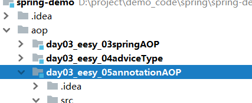

# 事务

## 介绍

第一： JavaEE 体系进行分层开发，事务处理位于业务层， Spring 提供了分层设计业务层的事务处理解决方案。
第二： spring 框架为我们提供了一组事务控制的接口。具体在后面的第二小节介绍。这组接口是在spring-tx-5.0.2.RELEASE.jar 中。
第三： spring 的事务控制都是基于 AOP 的，它既可以使用编程的方式实现，也可以使用配置的方式实现。 我们学习的重点是使用配置的方式实现。  

## API

### PlatformTransactionManager 

此接口是 spring 的事务管理器，它里面提供了我们常用的操作事务的方法，我们在开发中都是使用它的实现类。

真正管理事务的对象

```java
org.springframework.jdbc.datasource.DataSourceTransactionManager //使用 SpringJDBC 或 iBatis 进行持久化数据时使用
org.springframework.orm.hibernate5.HibernateTransactionManager //使用Hibernate 版本进行持久化数据时使用  
```

### TransactionDefinition

它是事务的定义信息对象 

### TransactionStatus

此接口提供的是事务具体的运行状态

## 传播行为

#### 介绍

```java
PROPAGION_XXX :事务的传播行为

//保证同一个事务中
  PROPAGATION_REQUIRED  	支持当前事务，如果不存在 就新建一个(默认)。通常能满足处理大多数的业务场景。
  PROPAGATION_SUPPORTS  	支持当前事务，如果不存在，就不使用事务。这个通常是用来处理那些并非原子性的非核心业务逻辑操作。应用场景较少。
  PROPAGATION_MANDATORY 	支持当前事务，如果不存在，抛出异常
    
// 保证没有在同一个事务中
  PROPAGATION_REQUIRES_NEW 	如果有事务存在，挂起当前事务，创建一个新的事务
  PROPAGATION_NOT_SUPPORTED 以非事务方式运行，如果有事务存在，挂起当前事务
  PROPAGATION_NEVER 		以非事务方式运行，如果有事务存在，抛出异常
  PROPAGATION_NESTED 		如果当前事务存在，则嵌套事务执行

https://blog.csdn.net/m0_37034934/article/details/81903564#commentBox

```

即然是传播，那么至少有两个东西，才可以发生传播。单体不存在传播这个行为。

**事务传播行为（propagation behavior）指的就是当一个事务方法被另一个事务方法调用时，这个事务方法应该如何进行。**
例如：methodA事务方法调用methodB事务方法时，methodB是继续在调用者methodA的事务中运行呢，还是为自己开启一个新事务运行，这就是由methodB的事务传播行为决定的。

 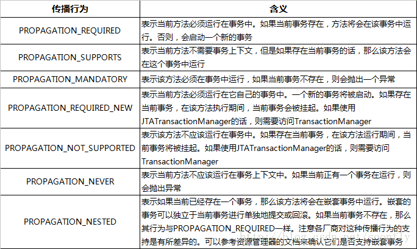


#### 1、REQUIRED

如果存在一个事务，则支持当前事务。如果没有事务则开启一个新的事务。
可以把事务想像成一个胶囊，在这个场景下方法B用的是方法A产生的胶囊（事务）。

 

```java
@Transactional(propagation = Propagation.REQUIRED)
public void methodA() {
 methodB();
// do something
}

@Transactional(propagation = Propagation.REQUIRED)
public void methodB() {
    // do something
}

```

单独调用methodB方法时，因为当前上下文不存在事务，所以会开启一个新的事务。
调用methodA方法时，因为当前上下文不存在事务，所以会开启一个新的事务。当执行到methodB时，methodB发现当前上下文有事务，因此就加入到当前事务中来。

#### 2、SUPPORTS

如果存在一个事务，支持当前事务。如果没有事务，则非事务的执行。但是对于事务同步的事务管理器，PROPAGATION_SUPPORTS与不使用事务有少许不同。 

```java
@Transactional(propagation = Propagation.REQUIRED)
public void methodA() {
 methodB();
// do something
}
 
// 事务属性为SUPPORTS
@Transactional(propagation = Propagation.SUPPORTS)
public void methodB() {
    // do something
}
```

单纯的调用methodB时，methodB方法是非事务的执行的。当调用methdA时,methodB则加入了methodA的事务中,事务地执行。

#### 3、MANDATORY

如果已经存在一个事务，支持当前事务。如果没有一个活动的事务，则抛出异常。

```java
@Transactional(propagation = Propagation.REQUIRED)
public void methodA() {
 methodB();
// do something
}
 
// 事务属性为MANDATORY
@Transactional(propagation = Propagation.MANDATORY)
public void methodB() {
    // do something
}
```

当单独调用methodB时，因为当前没有一个活动的事务，则会抛出异常throw new IllegalTransactionStateException(“Transaction propagation ‘mandatory’ but no existing transaction found”);当调用methodA时，methodB则加入到methodA的事务中，事务地执行。

> 注意
>
> ​		单元测试的时候直接调用update1()，会有异常，但是间接调用没有

 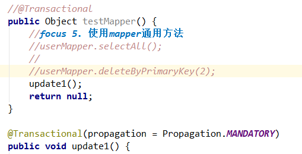

#### 4、REQUIRES_NEW

 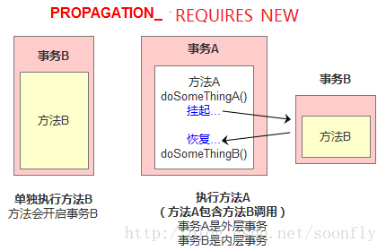

使用PROPAGATION_REQUIRES_NEW,需要使用 JtaTransactionManager作为事务管理器。 它会开启一个新的事务。如果一个事务已经存在，则先将这个存在的事务挂起。

```java
@Transactional(propagation = Propagation.REQUIRED)
public void methodA() {
    doSomeThingA();
    methodB();
    doSomeThingB();
    // do something else
}
 
 
// 事务属性为REQUIRES_NEW
@Transactional(propagation = Propagation.REQUIRES_NEW)
public void methodB() {
    // do something
}
```

```java
//当调用
main{  
methodA();
}

//相当于调用
main(){
    TransactionManager tm = null;
    try{
        //获得一个JTA事务管理器
        tm = getTransactionManager();
        tm.begin();//开启一个新的事务
        Transaction ts1 = tm.getTransaction();
        doSomeThing();
        tm.suspend();//挂起当前事务
        try{
            tm.begin();//重新开启第二个事务
            Transaction ts2 = tm.getTransaction();
            methodB();
            ts2.commit();//提交第二个事务
        } Catch(RunTimeException ex) {
            ts2.rollback();//回滚第二个事务
        } finally {
            //释放资源
        }
        //methodB执行完后，恢复第一个事务
        tm.resume(ts1);
        doSomeThingB();
        ts1.commit();//提交第一个事务
    } catch(RunTimeException ex) {
        ts1.rollback();//回滚第一个事务
    } finally {
        //释放资源
    }
}
```

在这里，我把ts1称为外层事务，ts2称为内层事务。从上面的代码可以看出，ts2与ts1是两个独立的事务，互不相干。Ts2是否成功并不依赖于 ts1。如果methodA方法在调用methodB方法后doSomeThingB方法失败了，而methodB方法所做的结果依然被提交。而除了 methodB之外的其它代码导致的结果却被回滚了。

#### 5、NOT_SUPPORTED

PROPAGATION_NOT_SUPPORTED 总是非事务地执行，并挂起任何存在的事务。使用PROPAGATION_NOT_SUPPORTED,也需要使用 JtaTransactionManager 作为事务管理器。

 

#### 6、NEVER

总是非事务地执行，如果存在一个活动事务，则抛出异常。

#### 7、NESTED

 

如果一个活动的事务存在，则运行在一个嵌套的事务中。 如果没有活动事务, 则按TransactionDefinition.PROPAGATION_REQUIRED 属性执行。 

这是一个嵌套事务,使用JDBC 3.0驱动时,仅仅支持DataSourceTransactionManager作为事务管理器。 需要JDBC 驱动的java.sql.Savepoint类。使用PROPAGATION_NESTED，还需要把`PlatformTransactionManager`的nestedTransactionAllowed属性设为true(属性值默认为false)。

这里关键是嵌套执行。（**使用savePoint模拟**）

```java
@Transactional(propagation = Propagation.REQUIRED)
methodA(){
  doSomeThingA();
  methodB();
  doSomeThingB();
}
 
@Transactional(propagation = Propagation.NEWSTED)
methodB(){
  ……
}
```

```java
//如果单独调用methodB方法，则按REQUIRED属性执行。如果调用methodA方法，相当于下面的效果：	
main(){
    Connection con = null;
    Savepoint savepoint = null;
    try{
        con = getConnection();
        con.setAutoCommit(false);
        doSomeThingA();
        savepoint = con2.setSavepoint();
        try{
            methodB();
        } catch(RuntimeException ex) {
            con.rollback(savepoint);
        } finally {
            //释放资源
        }
        doSomeThingB();
        con.commit();
    } catch(RuntimeException ex) {
        con.rollback();
    } finally {
        //释放资源
    }
}
```

当methodB方法调用之前，调用`setSavepoint`方法，保存当前的状态到`savepoint`。如果methodB方法调用失败，则恢复到之前保存的状态。但是需要注意的是，这时的事务并没有进行提交，如果后续的代码(doSomeThingB()方法)调用失败，则回滚包括methodB方法的所有操作。嵌套事务一个非常重要的概念就是内层事务依赖于外层事务。**外层事务失败时，会回滚内层事务所做的动作。而内层事务操作失败并不会引起外层事务的回滚。**

**PROPAGATION_NESTED 与PROPAGATION_REQUIRES_NEW的区别:**

它们非常类似,都像一个嵌套事务，如果不存在一个活动的事务，都会开启一个新的事务。 
使用 PROPAGATION_REQUIRES_NEW时，内层事务与外层事务就像两个独立的事务一样，一旦内层事务进行了提交后，外层事务不能对其进行回滚。两个事务互不影响。两个事务不是一个真正的嵌套事务。同时它需要JTA事务管理器的支持。

使用PROPAGATION_NESTED时，外层事务的回滚可以引起内层事务的回滚。而内层事务的异常并不会导致外层事务的回滚，它是一个真正的嵌套事务。DataSourceTransactionManager使用savepoint支持PROPAGATION_NESTED时，需要JDBC 3.0以上驱动及1.4以上的JDK版本支持。其它的JTATrasactionManager实现可能有不同的支持方式。

PROPAGATION_REQUIRES_NEW 启动一个新的, 不依赖于环境的 “内部” 事务. 这个事务将被完全 commited 或 rolled back 而不依赖于外部事务, 它拥有自己的隔离范围, 自己的锁, 等等. 当内部事务开始执行时, 外部事务将被挂起, 内务事务结束时, 外部事务将继续执行。

另一方面, PROPAGATION_NESTED 开始一个 “嵌套的” 事务, 它是已经存在事务的一个真正的子事务. 潜套事务开始执行时, 它将取得一个 savepoint. 如果这个嵌套事务失败, 我们将回滚到此 savepoint. 潜套事务是外部事务的一部分, 只有外部事务结束后它才会被提交。

由此可见, PROPAGATION_REQUIRES_NEW 和 PROPAGATION_NESTED 的最大区别在于, PROPAGATION_REQUIRES_NEW 完全是一个新的事务, 而 PROPAGATION_NESTED 则是外部事务的子事务, 如果外部事务 commit, 嵌套事务也会被 commit, 这个规则同样适用于 roll back.

## 自己实现事务

自己写一个aop，并且仅限于 jdbc onnection

### 实现事务管理器

```java
package com.itheima.utils;

import javax.sql.DataSource;
import java.sql.Connection;

/**
 * 连接的工具类，它用于从数据源中获取一个连接，并且实现和线程的绑定，方便整个线程的不同时候都可以拿到同一个connection，
 * 因为一个线程处理的东西有可能很多，并且在不同的模块中
 */
public class ConnectionUtils {

	private ThreadLocal<Connection> tl = new ThreadLocal<Connection>();

	private DataSource dataSource;

	public void setDataSource(DataSource dataSource) {
		this.dataSource = dataSource;
	}

	/**
	 * 获取当前线程上的连接
	 */
	public Connection getThreadConnection() {
		try {
			//1.先从ThreadLocal上获取
			Connection conn = tl.get();
			//2.判断当前线程上是否有连接
			if (conn == null) {
				//3.从数据源中获取一个连接，并且存入ThreadLocal中
				conn = dataSource.getConnection();
				tl.set(conn);
			}
			//4.返回当前线程上的连接
			return conn;
		} catch (Exception e) {
			throw new RuntimeException(e);
		}
	}

	/**
	 * 把连接和线程解绑
	 */
	public void removeConnection() {
		tl.remove();
	}
}

/**
 * 和事务管理相关的工具类，它包含了，开启事务，提交事务，回滚事务和释放连接,
 * 所有的connection都是线程相关的，因此从线程中拿，方便整个线程使用
 */
public class TransactionManager {

	private ConnectionUtils connectionUtils;

	public void setConnectionUtils(ConnectionUtils connectionUtils) {
		this.connectionUtils = connectionUtils;
	}

	/**
	 * 开启事务
	 */
	public void beginTransaction() {
		try {
			connectionUtils.getThreadConnection().setAutoCommit(false);
		} catch (Exception e) {
			e.printStackTrace();
		}
	}

	/**
	 * 提交事务
	 */
	public void commit() {
		try {
			connectionUtils.getThreadConnection().commit();
		} catch (Exception e) {
			e.printStackTrace();
		}
	}

	/**
	 * 回滚事务
	 */
	public void rollback() {
		try {
			connectionUtils.getThreadConnection().rollback();
		} catch (Exception e) {
			e.printStackTrace();
		}
	}

	/**
	 * 释放连接
	 */
	public void release() {
		try {
			connectionUtils.getThreadConnection().close();//还回连接池中
			connectionUtils.removeConnection();
		} catch (Exception e) {
			e.printStackTrace();
		}
	}
}

```

### 配置AOP实现事务

```xml
    <!-- 配置事务管理器-->
    <bean id="txManager" class="com.itheima.utils.TransactionManager">
        <!-- 注入ConnectionUtils -->
        <property name="connectionUtils" ref="connectionUtils"></property>
    </bean>

    <!--配置aop-->
    <aop:config>
        <!--配置通用切入点表达式-->
        <aop:pointcut id="pt1" expression="execution(* com.itheima.service.impl.*.*(..))"></aop:pointcut>
        <aop:aspect id="txAdvice" ref="txManager">
            <!--配置前置通知：开启事务-->
            <aop:before method="beginTransaction" pointcut-ref="pt1"></aop:before>
            <!--配置后置通知：提交事务-->
            <aop:after-returning method="commit" pointcut-ref="pt1"></aop:after-returning>
            <!--配置异常通知：回滚事务-->
            <aop:after-throwing method="rollback" pointcut-ref="pt1"></aop:after-throwing>
            <!--配置最终通知：释放连接-->
            <aop:after method="release" pointcut-ref="pt1"></aop:after>
        </aop:aspect>
    </aop:config>
```

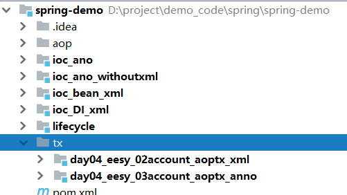

## 声明式事务

### tx标签

基于 <tx> 命名空间的声明式事务治理：在前两种方法的基础上， Spring 2.x 引入了 <tx> 命名空间，连络行使 <aop> 命名空间，带给开发人员设置配备声明式事务的全新体验。  

#### 0.  前提

```xml
<?xml version="1.0" encoding="UTF-8"?>
<beans xmlns="http://www.springframework.org/schema/beans"
       xmlns:xsi="http://www.w3.org/2001/XMLSchema-instance"
       xmlns:aop="http://www.springframework.org/schema/aop"
       xmlns:tx="http://www.springframework.org/schema/tx" //命名空间
       xsi:schemaLocation="
        http://www.springframework.org/schema/beans
        http://www.springframework.org/schema/beans/spring-beans.xsd
        http://www.springframework.org/schema/tx
        http://www.springframework.org/schema/tx/spring-tx.xsd
        http://www.springframework.org/schema/aop
        http://www.springframework.org/schema/aop/spring-aop.xsd">

    <!-- 配置业务层-->
    <bean id="accountService" class="com.itheima.service.impl.AccountServiceImpl">
        <property name="accountDao" ref="accountDao"></property>
    </bean>

    <!-- 配置账户的持久层-->
    <bean id="accountDao" class="com.itheima.dao.impl.AccountDaoImpl">
        <property name="dataSource" ref="dataSource"></property>
    </bean>


    <!-- 配置数据源-->
    <bean id="dataSource" class="org.springframework.jdbc.datasource.DriverManagerDataSource">
        <property name="driverClassName" value="com.mysql.jdbc.Driver"></property>
        <property name="url" value="jdbc:mysql://localhost:3306/eesy"></property>
        <property name="username" value="root"></property>
        <property name="password" value="1234"></property>
    </bean>
```

#### 1. 事务管理器

```xml
<!-- 配置事务管理器 -->
<bean id="transactionManager" class="org.springframework.jdbc.datasource.DataSourceTransactionManager">
    <property name="dataSource" ref="dataSource"></property>
</bean>
```

#### 2. 配置事务的通知

​    此时我们需要导入事务的约束 tx名称空间和约束，同时也需要aop的（前面）
​    使用tx:advice标签配置事务通知，需要引用事务管理器
​        属性：
​            id：给事务通知起一个唯一标识
​            transaction-manager：给事务通知提供一个事务管理器引用

```xml
    <!-- 配置事务的通知-->
    <tx:advice id="txAdvice" transaction-manager="transactionManager">
        <!-- 配置事务的属性
                name :The method name(s) with which the transaction attributes are to be associated. The wildcard (*) character can be used to associate the same transaction attribute settings with a number of methods; for example, 'get*', 'handle*', '*Order', 'on*Event', etc.
                propagation：用于指定事务的传播行为。默认值是REQUIRED，表示一定会有事务，增删改的选择。查询方法可以选择SUPPORTS。
                isolation：用于指定事务的隔离级别。默认值是DEFAULT，表示使用数据库的默认隔离级别。
                read-only：用于指定事务是否只读。只有查询方法才能设置为true。默认值是false，表示读写。
                timeout：用于指定事务的超时时间，默认值是-1，表示永不超时。如果指定了数值，以秒为单位。
                rollback-for：用于指定一个异常，当产生该异常时，事务回滚，产生其他异常时，事务不回滚。没有默认值。表示任何异常都回滚。
                no-rollback-for：用于指定一个异常，当产生该异常时，事务不回滚，产生其他异常时事务回滚。没有默认值。表示任何异常都回滚。
        -->
        <tx:attributes>
            <tx:method name="*" propagation="REQUIRED" read-only="false"/>
            <tx:method name="find*" propagation="SUPPORTS" read-only="true"  ></tx:method>
        </tx:attributes>
    </tx:advice>
```

#### 3. 配置AOP

建立事务通知和切入点表达式的对应关系

```xml
	<!-- 配置aop-->
    <aop:config>
        <!-- 配置切入点表达式-->
        <aop:pointcut id="pt1" expression="execution(* com.itheima.service.impl.*.*(..))"></aop:pointcut>
        <!--建立切入点表达式和事务通知的对应关系 -->
        <aop:advisor advice-ref="txAdvice" pointcut-ref="pt1"></aop:advisor>

    </aop:config>

</beans>
```

### @Transactional  

基于 @Transactional 的声明式事务管理： Spring 2.x 还引入了基于 Annotation 的体式格式，具体次要触及@Transactional 标注。 @Transactional 可以浸染于接口、接口方法、类和类方法上。算作用于类上时，该类的一切public 方法将都具有该类型的事务属性。  

#### 1 配置事务管理器

##### xml

```xml
<!-- 配置事务管理器 -->
<bean id="transactionManager" class="org.springframework.jdbc.datasource.DataSourceTransactionManager">
    <property name="dataSource" ref="dataSource"></property>
</bean>
```

##### ano

```java
@Bean(name = "transactionManager")
public PlatformTransactionManager createTransactionManager(DataSource dataSource) {
    return new DataSourceTransactionManager(dataSource);
}
```

#### 2. 开启事务注解支持

##### xml

```xml
    <!-- 开启spring对注解事务的支持-->
    <tx:annotation-driven transaction-manager="transactionManager"></tx:annotation-driven>
```

##### ano

```java
@Configuration
@ComponentScan("com.itheima")
@Import({JdbcConfig.class,TransactionConfig.class})
@PropertySource("jdbcConfig.properties")
@EnableTransactionManagement //支持事务
public class SpringConfiguration {
}
```

#### 3. @Transactional

##### 提交事务

1. 最外层`@Transaction`注解的方法一结束，就会提交事务，数据库操作就会完成。

2. 只要有异常才会回滚

3. 手动强制回滚，不需要异常触发，并且方法可以返回自定义数据

   ```
   TransactionAspectSupport.currentTransactionStatus().setRollbackOnly(); 
   ```

##### 使用

一个sql语句不需要`@Transaction`，如果不行需要看spring有没有取消自动提交

```java
@Transactional(propagation= Propagation.SUPPORTS,readOnly=true)//只读型事务的配置
public class AccountServiceImpl implements IAccountService{
	...
	
	//需要的是读写型事务配置
    @Transactional(propagation= Propagation.REQUIRED,readOnly=false)
    @Override
    public void transfer(String sourceName, String targetName, Float money) {
    	...
    }
 
 	...
 }
```

#### 其他

[失效和不建议过度使用（可去你的，自己把握啊）](https://mp.weixin.qq.com/s/mIosTjVnrE31cVbI9PAvRw)


## 编程式事物管理

在代码中显式挪用 beginTransaction()、 commit()、 rollback()等事务治理相关的方法，这就是编程式事务管理。 Spring 对事物的编程式管理有基于底层 API 的编程式管理和基于 TransactionTemplate 的编程式事务管理两种方式。  

####  底 层 API

基 于 底 层 API 的 编 程 式 管 理 ： 凭借PlatformTransactionManager 、 TransactionDefinition 和TransactionStatus 三个焦点接口，来实现编程式事务管理。  

```java
Public class BankServiceImpl implements BancService {
	Private BanckDao bankDao;
	private TransactionDefinition txDefinition;
	private PlatformTransactionManager txManager;
	...
	public boolean transfer(Long fromId， Long toId， double amount) {
		TransactionStatus txStatus = txManager.getTransaction(txDefinition);
		boolean result = false;
		try {
			result = bankDao.transfer(fromId， toId， amount);
			txManager.commit(txStatus);
		} catch (Exception e) {
			result = false;
			txManager.rollback(txStatus);
			System.out.println("Transfer Error!");
		}
		return result;
	}
}
```

#### TransactionTemplate

基于 TransactionTemplate 的编程式事务管理:为了不损坏代码原有的条理性，避免出现每一个方法中都包括相同的启动事物、提交、回滚事物样板代码的现象， spring 提供了 transactionTemplate 模板来实现编程式事务管理。  

```java
public class BankServiceImpl implements BankService {
	private BankDao bankDao;
	private TransactionTemplate transactionTemplate;
	......
	public boolean transfer(final Long fromId， final Long toId， final double amount) {
		return (Boolean) transactionTemplate.execute(new TransactionCallback() {
			public Object doInTransaction(TransactionStatus status) {
				Object result;
				try {
					result = bankDao.transfer(fromId， toId， amount);
				} catch (Exception e) {
					status.setRollbackOnly();
					result = false;
					System.out.println("Transfer Error!");
				}
				return result;
			}
		});
	}
}
```

#### TransactionInterceptor+ProxyFactoryBean

基于 TransactionInterceptor 的声明式事务管理：两个次要的属性： transactionManager，用来指定一个事务治 理器，并 将具体事务相 关的操作请托给它；其 他一个是 Properties 类型的transactionAttributes 属性，该属性的每一个键值对中，键指定的是方法名，方法名可以行使通配符，而值就是表现呼应方法的所运用的事务属性。  

```xml
<beans>
...    
	<bean id="transactionInterceptor"
          class="org.springframework.transaction.interceptor.TransactionInterceptor">
        <property name="transactionManager" ref="transactionManager"/>
        <property name="transactionAttributes">
            <props>
                <prop key="transfer">PROPAGATION_REQUIRED</prop>
            </props>
        </property>
    </bean>
    <bean id="bankServiceTarget"
          class="footmark.spring.core.tx.declare.origin.BankServiceImpl">
        <property name="bankDao" ref="bankDao"/>
    </bean>
    <bean id="bankService"
          class="org.springframework.aop.framework.ProxyFactoryBean">
        <property name="target" ref="bankServiceTarget"/>
        <property name="interceptorNames">
            <list>
                <idref bean="transactionInterceptor"/>
            </list>
        </property>
    </bean>
...
</beans>
```

#### TransactionProxyFactoryBean

基于 TransactionProxyFactoryBean 的声明式事务管理：设置配置文件与先前比照简化了许多。我们把这类设置配置文件格式称为 Spring 经典的声明式事务治理 。

```xml
<beans>
......
	<bean id="bankServiceTarget" class="footmark.spring.core.tx.declare.classic.BankServiceImpl">
		<property name="bankDao" ref="bankDao"/>
	</bean>
	<bean id="bankService" class="org.springframework.transaction.interceptor.TransactionProxyFactoryBean">
		<property name="target" ref="bankServiceTarget"/>
		<property name="transactionManager" ref="transactionManager"/>
		<property name="transactionAttributes">
			<props>
				<prop key="transfer">PROPAGATION_REQUIRED</prop>
			</props>
		</property>
	</bean>
 ......
</beans>
```

## 代码

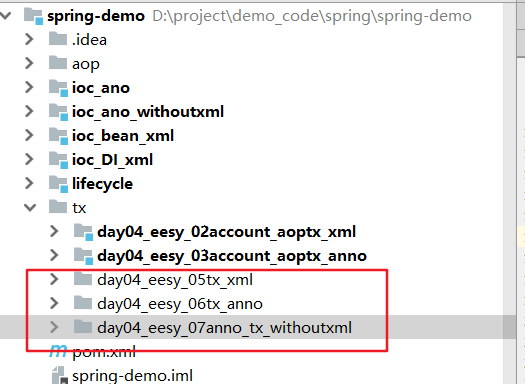

# Listener

1. *监听器，比如**application**启动的时候运行一些东西*

```java
//As of Spring 3.0, an ApplicationListener can generically declare the event type that it is interested in. When registered with a Spring ApplicationContext, events will be filtered accordingly, with the listener getting invoked for matching event objects only. 
@FunctionalInterface
public interface ApplicationListener<E extends ApplicationEvent> extends EventListener { ..}

//例子
@Component
public class NettyListener implements ApplicationListener<ContextRefreshedEvent> {

    @Autowired
    private WebSocketServer websocketServer;

    @Override
    public void onApplicationEvent(ContextRefreshedEvent event) {
        if(event.getApplicationContext().getParent() == null) {
            try {
                websocketServer.start();
            } catch (Exception e) {
                e.printStackTrace();
            }
        }
    }
}
```

# Junit

## 普通

```java
public class QueryRunnerTest {

    @Test
    public  void  testQueryRunner(){
        //1.获取容器
        ApplicationContext ac = new AnnotationConfigApplicationContext(SpringConfiguration.class);
        //2.获取queryRunner对象
        QueryRunner runner = ac.getBean("runner",QueryRunner.class);
        QueryRunner runner1 = ac.getBean("runner",QueryRunner.class);
        System.out.println(runner == runner1);
    }
}
```

## 问题

在测试类中，每个测试方法都有以下两行代码：

```java
ApplicationContext ac = new ClassPathXmlApplicationContext("bean.xml");
IAccountService as = ac.getBean("accountService",IAccountService.class);
```

这两行代码的作用是获取容器，如果不写的话，直接会提示空指针异常。所以又不能轻易删掉。  

## 解决思路分析  

针对上述问题，我们需要的是程序能自动帮我们创建容器。一旦程序能自动为我们创建 spring 容器，我们就无须手动创建了，问题也就解决了。
我们都知道， junit 单元测试的原理（在 web 阶段课程中讲过），但显然， junit 是无法实现的，因为它自己都无法知晓我们是否使用了 spring 框架，更不用说帮我们创建 spring 容器了。不过好在， junit 给我们暴露
了一个注解，可以让我们替换掉它的**运行器**。
这时，我们需要依靠 spring 框架，因为它提供了一个运行器，可以读取配置文件（或注解）来创建容器。我们只需要告诉它配置文件在哪就行了。  

## 新的

```xml
        <dependency>
            <groupId>org.springframework</groupId>
            <artifactId>spring-test</artifactId>
            <version>5.0.2.RELEASE</version>
        </dependency>
```

```java
/**
 * 使用Junit单元测试：测试我们的配置
 * Spring整合junit的配置
 *      1、导入spring整合junit的jar(坐标)
 *      2、使用Junit提供的一个注解把原有的main方法替换了，替换成spring提供的
 *             @Runwith
 *      3、告知spring的运行器，spring和ioc创建是基于xml还是注解的，并且说明位置
 *          @ContextConfiguration
 *                  locations：指定xml文件的位置，加上classpath关键字，表示在类路径下
 *                  classes：指定注解类所在地位置
 *      4、使用@Autowired 给测试类中的变量注入数据
 *
 *   当我们使用spring 5.x版本的时候，要求junit的jar必须是4.12及以上
 */
@RunWith(SpringJUnit4ClassRunner.class)
@ContextConfiguration(classes = SpringConfiguration.class) // @ContextConfiguration(locations= {"classpath:bean.xml"})
public class AccountServiceTest {

    @Autowired
    private IAccountService as = null;


    @Test
    public void testFindAll() {
        //3.执行方法
        List<Account> accounts = as.findAllAccount();
        for(Account account : accounts){
            System.out.println(account);
        }
    }
    
}
```

# Spring5

spring5.0 在 2017 年 9 月发布了它的 GA（通用）版本。该版本是基于 jdk8 编写的， 所以 jdk8 以下版本将无法使用。 同时，可以兼容 jdk9 版本。
tomcat 版本要求 8.5 及以上。

## 与 JDK 相关的升级    

1. 基于 JDK8 的反射增强 ，new对象，反射创建对象，set方法都加快了

2. @NonNull 注解和@Nullable 注解的使用

   用 @Nullable 和 @NotNull 注解来显示表明可为空的参数和以及返回值。这样就够在编译的时候处理空值而不是在运行时抛出 NullPointerExceptions。

3. 日志记录方面

   Spring Framework 5.0 带来了 Commons Logging 桥接模块的封装, 它被叫做 spring-jcl 而不是标准的 Commons Logging。

   当然，无需任何额外的桥接，新版本也会对 Log4j 2.x, SLF4J, JUL( java.util.logging) 进行自动检测。  

## 核心容器

Spring Framework 5.0 现在支持候选组件索引作为类路径扫描的替代方案。该功能已经在类路径扫描器中添加，以简化添加候选组件标识的步骤。

应用程序构建任务可以定义当前项目自己的 META-INF/spring.components 文件。在编译时，源模型是自包含的，JPA 实体和 Spring 组件是已被标记的。

从索引读取实体而不是扫描类路径对于小于 200 个类的小型项目是没有明显差异。但对大型项目影响较大。加载组件索引开销更低。因此，随着类数的增加，索引读取的启动时间将保持不变。

加载组件索引的耗费是廉价的。因此当类的数量不断增长，加上构建索引的启动时间仍然可以维持一个常数,不过对于组件扫描而言，启动时间则会有明显的增长。

这个对于我们处于大型 Spring 项目的开发者所意味着的，是应用程序的启动时间将被大大缩减。虽然 20或者 30 秒钟看似没什么，但如果每天要这样登上好几百次，加起来就够你受的了。使用了组件索引的话，就能帮助你每天过的更加高效。

你可以在 [Spring 的 Jira ](https://jira.spring.io/browse/SPR-11890)上了解更多关于组件索引的相关信息。

## 响应式编程风格  

 此次 Spring 发行版本的一个激动人心的特性就是新的响应式堆栈 WEB 框架。这个堆栈完全的响应式且非阻塞，适合于事件循环风格的处理，可以进行少量线程的扩展。
Reactive Streams 是来自于 Netflix, Pivotal, Typesafe, Red Hat, Oracle, Twitter 以及
Spray.io 的工程师特地开发的一个 API 。它为响应式编程实现的实现提供一个公共的 API ，好实现
Hibernate 的 JPA。这里 JPA 就是这个 API, 而 Hibernate 就是实现。
Reactive Streams API 是 Java 9 的官方版本的一部分。在 Java 8 中, 你会需要专门引入依赖来使用 Reactive Streams API。
Spring Framework 5.0 对于流式处理的支持依赖于 Project Reactor 来构建, 其专门实现了
Reactive Streams API。
Spring Framework 5.0 拥有一个新的 spring-webflux 模块，支持响应式 HTTP 和 WebSocket 客户端。Spring Framework 5.0 还提供了对于运行于服务器之上，包含了 REST, HTML, 以及 WebSocket 风格交互的响应式网页应用程序的支持。
在 spring-webflux 中包含了两种独立的服务端编程模型：
基于注解：使用到了@Controller 以及 Spring MVC 的其它一些注解；使用 Java 8 lambda 表达式的函数式风格的路由和处理。
有了  Spring Webflux, 你现在可以创建出 WebClient, 它是响应式且非阻塞的，可以 作为 
RestTemplate 的一个替代方案。
这里有一个使用 Spring 5.0 的 REST 端点的 WebClient 实现：

```java
WebClient webClient = WebClient.create();
 Mono person = webClient.get()
    .uri("http://localhost:8080/movie/42")
    .accept(MediaType.APPLICATION_JSON)
    .exchange()
    .then(response -> response.bodyToMono(Movie.class));

```


## Junit5 支持

完全支持 JUnit 5 Jupiter，所以可以使用 JUnit 5 来编写测试以及扩展。此外还提供了一个编程以及
扩展模型， Jupiter 子项目提供了一个测试引擎来在 Spring 上运行基于 Jupiter 的测试。
另外， Spring Framework 5 还提供了在 Spring TestContext Framework 中进行并行测试的扩展。
针对响应式编程模型， spring-test 现在还引入了支持 Spring WebFlux 的 WebTestClient 集成测
试的支持，类似于 MockMvc，并不需要一个运行着的服务端。使用一个模拟的请求或者响应， WebTestClient
就可以直接绑定到 WebFlux 服务端设施。
你可以在这里找到这个激动人心的 TestContext 框架所带来的增强功能的完整列表。
当然， Spring Framework 5.0 仍然支持我们的老朋友 JUnit! 在我写这篇文章的时候， JUnit 5 还
只是发展到了 GA 版本。对于 JUnit4， Spring Framework 在未来还是要支持一段时间的。  

## 依赖类库的更新  

**终止支持的类库**

Portlet. Velocity. JasperReports. XMLBeans.

JDO.

Guava.

**支持的类库**

Jackson 2.6+

EhCache 2.10+ / 3.0 GA

Hibernate 5.0+

JDBC 4.0+

XmlUnit 2.x+ OkHttp 3.x+ Netty 4.1

# 参考文献

[神器SpringDoc横空出世，最牛掰的API工具来了，赶紧看Spring吧！](https://mp.weixin.qq.com/s/rDtROZV3JPdVHZXwSW8wow)

