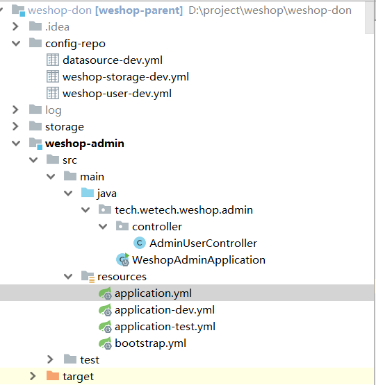
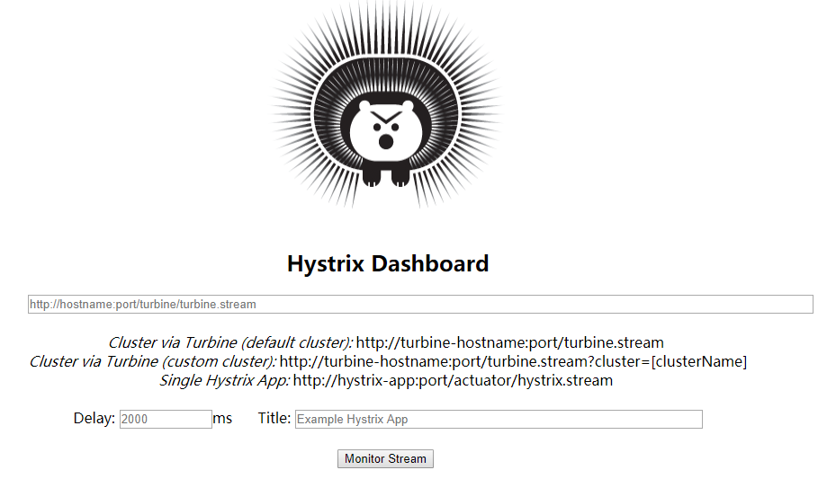
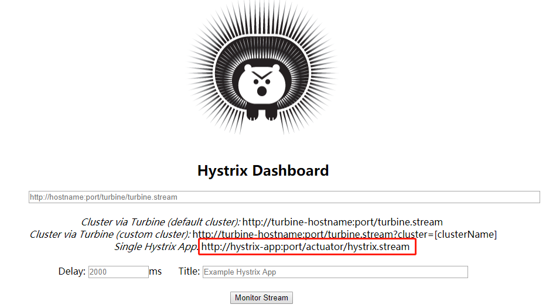

# 雪崩效应

前面几篇文章分析了 Spring Cloud 中的 Ribbon 和 Feign 实现负载均衡机制。但是有个问题需要注意下：

多个微服务之间调用的时候，假设微服务A调用微服务B和微服务C，微服务B和微服务C又在调用其他的微服务，这就是所谓的“扇出”。如果扇出的链路上某个微服务的调用响应时间过长或者不可用，那么对微服务A的调用就会占用越来越多的系统资源，进而引起系统崩溃，这就是所谓的“雪崩效应”。

# Hystrix 登场

出现这种“雪崩效应”肯定是可怕的，在分布式系统中，我们无法保证某个服务一定不出问题，Hystrix 可以解决。

Hystrix 是一个用于处理分布式系统的延迟和容错的开源库，在分布式系统里，许多服务无法避免会调用失败，比如超时、异常等等，Hystrix能够保证在一个服务出现问题的情况下，不会导致整体服务的失败，避免级联故障，以提高分布式系统的弹性。

所以叫“断路器”。“断路器”是一种开关装置，就好比我们家里的熔断保险丝，当出现突发情况，会自动跳闸，避免整个电路烧坏。那么当某个服务发生故障时，通过 Hystrix，会向调用方返回一个符合预期的、可处理的默认响应（也称备选响应，即fallBack），而不是长时间的等待或者直接返回一个异常信息。这样就能保证服务调用方可以顺利的处理逻辑，而不是那种漫长的等待或者其他故障。

这就叫“服务熔断”，就跟熔断保险丝一个道理。

**服务熔断和服务降级**

服务熔断机制是应对雪崩效应的一种微服务链路保护机制。当扇出链路的某个微服务不可用或者响应时间太长，就会进行服务的降级，快速熔断该节点微服务的调用，返回默认的响应信息。当检测到该节点微服务调用响应正常后即可恢复。

上面提到服务的降级，什么意思呢？我打个比方：比如你去银行办理业务，本来有四个窗口都可以办理，现在3号窗口和4号窗口的办理人员有事要离开，那么自然地，用户就会跑去1号窗口或者2号窗口办理，所以1号和2号窗口就会承担更多的压力。

3号窗口和4号窗口的人有事走了，不能让人还在这排队等着吧，否则就出现了上文说的雪崩了，所以会挂一个牌子：暂停服务。这个牌子好比上文提到的熔断，然后返回一个默认的信息，让用户知道。等3号和4号窗口的人回来了，就会把这个牌子拿走，这两个窗口又可以继续回复服务了。

服务降级是在客户端完成的，不是服务端，与服务端是没有关系的。就像银行某个窗口挂了“暂停服务”，那客户会自然去别的窗口。

# Hystrix 的使用

### 依赖

```xml
	<!--eureka-client客户端-->
    <dependency>
        <groupId>org.springframework.cloud</groupId>
        <artifactId>spring-cloud-starter-netflix-eureka-client</artifactId>
    </dependency>

	<!--暴露各种指标-->
        <dependency>
            <groupId>org.springframework.boot</groupId>
            <artifactId>spring-boot-starter-actuator</artifactId>
        </dependency>

        <!--hystrix熔断器-->
        <dependency>
            <groupId>org.springframework.cloud</groupId>
            <artifactId>spring-cloud-starter-hystrix</artifactId>
            <version>RELEASE</version>
        </dependency>
```

### 启动类

在启动类中，需要添加 `@EnableCircuitBreaker` 注解

```java
@SpringBootApplication
@EnableEurekaClient
@MapperScan("com.itcodai.springcloud.dao")
@EnableCircuitBreaker
public class OrderProvider01Hystrix {

    public static void main(String[] args) {
        SpringApplication.run(OrderProvider01Hystrix.class, args);
    }
}
```

```java
@Service
public class RibbonService {
    
    @Autowired
    private RestTemplate restTemplate;

    @HystrixCommand(fallbackMethod = "hystrixFallback")//HystrixCommond注解中的fallbackMethod指示的是：当该方法出异常时，调用  方法
    public String helloService(){
        //调用服务提供者接口，正常则返回hello字符串
        return restTemplate.getForEntity("http://hello-service/hello", String.class).getBody();
    }

    /**
     * 调用服务失败处理方法，返回了和上面接口一样的数据结构，只不过都是我们自己搞的默认值而已。
     * @return “error"
     */
    public String hystrixFallback(){
        return "error";
    }
}
```

# 面向接口使用

### 问题

上面介绍了 hystrix 的服务熔断和降级处理，但是有没有发现一个问题，这个 @HystrixCommand 注解是加在 Controller 层的接口方法上的，这会导致两个问题：

第一：如果接口方法很多，那么我是不是要在每个方法上都得加上该注解，而且，针对每个方法，我都要指定一个处理函数，这样会导致 Controller 变得越来越臃肿。

第二：这也不符合设计规范，理论上来说，Controller 层就是 Controller 层，我只管写接口即可。就像上一节介绍的 Feign，也是面向接口的，做均衡处理，我自己定义一个接口专门用来做均衡处理，在 Controller 层将该接口注入即可。那么 hystrix 是否也可以有类似的处理呢？

答案是肯定的，这跟面向切面编程一个道理，Cotroller 你只管处理接口逻辑，当出了问题，OK，交给我 hystrix ，我 hystrix 不在你 Controller 这捣蛋，我去其他地方呆着，你有问题了，我再来处理。这才是正确的、合理的设计方式。

### 定义 Hystrix 处理类

#### 1. 继承FallbackFactory

所以我们完全不用像上文那样新建一个带 hystrix 的订单提供服务：microservice-order-provider01-hystrix。我们新建一个 hystrix 处理类：OrderClientServiceFallbackFactory，要实现
FallbackFactory<OrderClientService> 接口，其中 OrderClientService 就是前面定义的 Feign 接口。

也就是说，把 hystrix 和 feign 绑起来，因为都是客户端的东东。我通过 feign 去调用服务的时候，如果出问题了，就来执行我自定义的 hystrix 处理类中的方法，返回默认数据。代码如下：

```java
/**
 * 统一处理熔断
 * OrderClientService是Feign接口，所有访问都会走feign接口
 * @author shengwu ni
 */
@Component
public class OrderClientServiceFallbackFactory implements FallbackFactory<OrderClientService> {

    @Override
    public OrderClientService create(Throwable throwable) {
        return new OrderClientService() {

            /**
             * 当订单服务的getOrder()方法出异常后的熔断处理方法
             * @param id id
             * @return 返回信息
             */
            @Override
            public TOrder getOrder(Long id) {
                return new TOrder().setId(id)
                        .setName("未找到该ID的结果")
                        .setPrice(0d)
                        .setDbSource("No this datasource");
            }

            @Override
            public List<TOrder> getAll() {
                return null;
            }
        };
    }
}
```

我来分析一下代码，实现了 FallbackFactory<OrderClientService> 接口后，需要重写 create 方法，还是返回 OrderClientService 接口对象，只不过对这个 feign 客户端做了默认处理。

#### 2.直接实现API

we-shop里面的不用实现FallbackFactory，直接写一个实现类就可以了



```java
@FeignClient(value = "weshop-user", path = "/shop/user", fallback = UserApiFallback.class)
public interface UserApi extends Api<User> {
```

```java
@Component
public class UserApiFallback extends ApiFallback<User> implements UserApi {

    @Override
    public Result<List<User>> testSql() {
        return (Result.failure(CommonResultStatus.REMOTE_SERVICE_ERROR));
    }
```


### 给 Feign 指定 hystrix

OK，现在 hystrix 是绑定了 Feign 接口了，但是 Feign 接口中的某个方法如果出问题了，它怎么知道找谁去做熔断呢？所以在 Feign 接口也需要绑定一下我们定义的 hystrix 处理类：

```java
  /**

 * feign客户端

 * @author shengwu ni
      */
      //@FeignClient(value = "MICROSERVICE-ORDER")
   @FeignClient(value = "MICROSERVICE-ORDER", fallbackFactory = OrderClientServiceFallbackFactory.class)
       public interface OrderClientService {

   @GetMapping("/provider/order/get/{id}")
   TOrder getOrder(@PathVariable(value = "id") Long id);

   @GetMapping("/provider/order/get/list")
   List<TOrder> getAll();
```


我把之前的注释掉了，新添加了个 fallbackFactory 属性，指定了自定义的 hystrix 处理类。这样的话，Controller 中的所有方法都可以在 hystrix 里有个默认实现了。

### 开启熔断

同时，别忘了在 application.yml 中开启熔断：

```yaml
feign:
  hystrix:
    enabled: true
```

OK，重新测一下，启动 eureka 集群，启动之前写好的未加 hystrix 的订单提供服务，三个当中随便起一个即可。再启动带有 hystrix 的 Feign 客户端，再测试一下上面的 url 即可。

# Hystrix Dashboard 监控

## 介绍

除了隔离依赖服务的调用以外，Hystrix 还提供了准实时的调用监控（Hystrix Dashboard），Hystrix 会持续记录所有通过 Hystrix 发起的请求的执行信息，并以统计报表和图形的形式展示给用户，包括每秒执行多少请求，有多少成功或者失败等。Spring Cloud 也提供了 Hystrix Dashboard 的整合，对监控内容转化成可视化界面。

## 使用

### 2.1 导入监控相关的依赖

首先要导入 dashboard 的依赖：

```xml
<dependencies>
    <!-- hystrix -->
    <dependency>
        <groupId>org.springframework.cloud</groupId>
        <artifactId>spring-cloud-starter-netflix-hystrix</artifactId>
    </dependency>
    <dependency>
        <groupId>org.springframework.cloud</groupId>
        <artifactId>spring-cloud-starter-netflix-hystrix-dashboard</artifactId>
    </dependency>
</dependencies>
```

### 2.2 添加启动注解

在启动类中，需要添加 @EnableHystrixDashboard 注解。

```java
@SpringBootApplication
@EnableHystrixDashboard
public class OrderConsumerHystrixDashboard {

    public static void main(String[] args) {
        SpringApplication.run(OrderConsumerHystrixDashboard.class, args);
    }
}
```

### 2.3 服务提供方需要添加监控依赖

在服务提供方，也需要添加一个 Spring Boot 监控依赖：

```xml
<!-- spring boot actuator 监控信息 -->
<dependency>
    <groupId>org.springframework.boot</groupId>
    <artifactId>spring-boot-starter-actuator</artifactId>
</dependency>
```

### 2.4 测试一下

OK，这样的话，hystrix dashboard 就基本配置好了，启动一下我们新建的这个监控项目，在浏览器中输入：http://localhost:9002/hystrix ，如果出现下面的这只豪猪兄，那说明 dashboard 没有问题。



## 监控其他服务

OK，上面我们能正常启动豪猪兄了，但是如何监控其他服务呢？我们以带有 hystrix 的订单提供服务为例（端口号为8001）。如果要实现被监控，我们需要在被监控的服务上做一些准备。

### 3.1 依赖导入

首先在这个订单服务上添加 hystrix 依赖（当然了，该8001端口的订单提供服务已经添加过了该依赖了）：

```xml
<!-- hystrix -->
<dependency>
    <groupId>org.springframework.cloud</groupId>
    <artifactId>spring-cloud-starter-netflix-hystrix</artifactId>
</dependency>
```

### 3.2 启动类注解

```java
@SpringBootApplication
@EnableEurekaClient
@MapperScan("com.itcodai.springcloud.dao")
@EnableCircuitBreaker
public class OrderProvider01 {

    public static void main(String[] args) {
        SpringApplication.run(OrderProvider01.class, args);
    }
}

```

### 3.3 application.yml 配置文件

最后，在配置文件中开启指标流端点，这个在后面监控时候需要用到，下文再来描述。

```yaml
# 配置hystrix dashboard的url访问
# 开启指标流端点
management:
  endpoints:
    web:
      exposure:
        include: hystrix.stream

```

### 3.4 测试一下

万事俱备，只欠东风了，接下来我们来测试一下效果。
首先：使用8001端口的订单服务为例，首先启动eureka集群，然后启动带有hsytrix的订单服务，我们在浏览器里输入 http://localhost:8001/provider/order/get/1 可以获取订单服务信息，确定订单服务正常。

然后打开 http://localhost:9002/hystrix 能出现豪猪兄，说明 dashboard 没有问题。




我们看到，这个url 就是用来监控某个服务的状态，上面在application.yml文件里配置的url就是作用于此，我们新打开一个浏览器窗口，输入：http://localhost:8001/actuator/hystrix.stream，可以看到一直在刷一些信息，这些信息就是该服务相关接口的信息，但是很不直观，接下来我们看一下直观的效果。

在豪猪兄的页面输入http://localhost:8001/actuator/hystrix.stream， delay延迟设置为2000（2秒），Title自己取个名字即可。打开后即可在可视化页面监控 8001 这个端口的接口调用信息，我们调用两个接口：

http://localhost:8001/provider/order/get/1
http://localhost:8001/provider/order/get/list
多次刷新几次调用，可以看到可视化界面的一些信息，如下：


从这个监控仪表盘中可以很清楚的看到服务被调用的状态，至于如何看，不同的部分表示什么？大家可以去百度一下，解释的很清楚，这里不再赘述。

注意一下：
Hystrix dashboard 面板正常显示，所监控的接口方法上必须要有@HystrixCommand 注解，否则会一直显示 Loading，这是一个注意的地方。

源码下载地址：https://gitee.com/eson15/springcloud_study


# 超时时间

## 介绍

feign和hystrix的超时时间各取一个最短的。hystrix在最外层，然后先经过ribbon，然后再到feign的http请求。hystrix可以设置每一个特定的接口的超时时间

```yml
#ribbon参数
ribbon:
  MaxAutoRetries: 3 #最大重试次数，当Eureka中可以找到服务，但是服务连不上时将会重试
  MaxAutoRetriesNextServer: 3  #切换实例的重试次数
  OkToRetryOnAllOperations: false #对所有操作请求都进行重试，如果是get则可以，如果是post，put等操作没有实现幂等的情况下是很危险的,所以设置为false
  ConnectTimeout: 40000 #请求连接的超时时间
  ReadTimeout: 120000 #请求处理的超时时间

feign:
  hystrix:
    enabled: true #使用熔断
  client:
    config:
      default:
        connectTimeout: 300000
        readTimeout: 300000
        loggerLevel: basic

#  httpclient:
#    connection-timeout: 120000
#    enabled: true
#    connection-timer-repeat: 50000

#设置hystrix超时时间，解决fegin第一次请求timeout的问题
hystrix:
  metrics:
    enabled: true
  command:
    default:
      execution:
        isolation:
          thread:
            timeoutInMilliseconds: 300000
#    CrawlerInfoApi#queryAll():
#      execution:
#        isolation:
#          thread:
#            timeoutInMilliseconds: 4000
```

## 参考文献

[Feign的各种超时时间（含局部方法设置超时案例）](https://blog.csdn.net/hhj13978064496/article/details/104653297)

[SpringBoot 关于Feign的超时时间配置](https://blog.csdn.net/catoop/article/details/107698575)

 [Zuul、Ribbon、Feign、Hystrix使用时的超时时间(timeout)设置问题](https://priesttomb.github.io/%E5%88%86%E5%B8%83%E5%BC%8F/2018/09/19/Zuul-Ribbon-Feign-Hystrix-%E8%B6%85%E6%97%B6%E6%97%B6%E9%97%B4%E8%AE%BE%E7%BD%AE%E9%97%AE%E9%A2%98/)


# 参考

https://blog.csdn.net/eson_15/article/details/86628622

https://www.cnblogs.com/hellxz/p/8961480.html