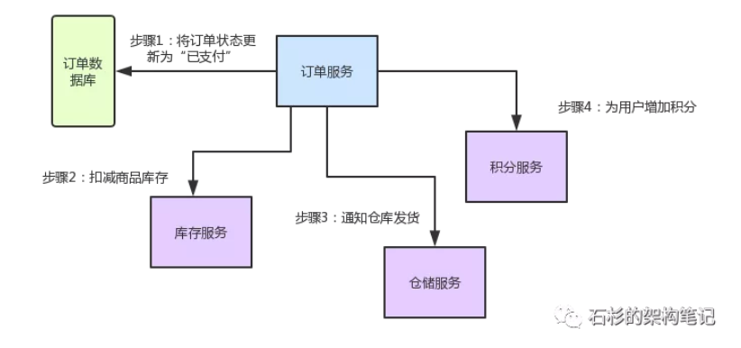
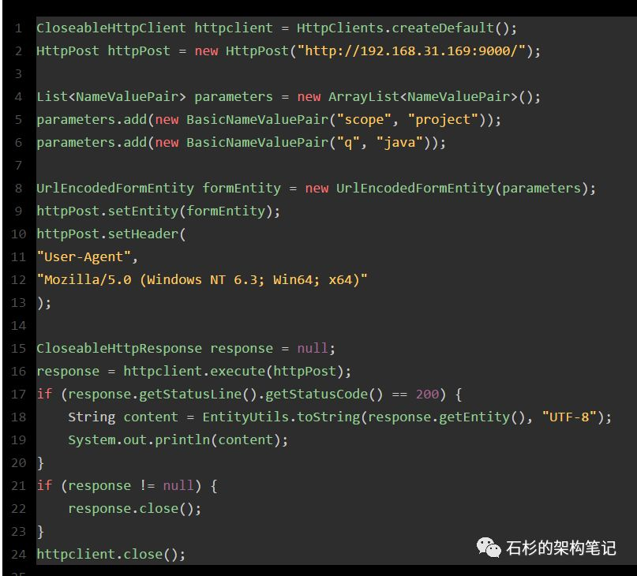
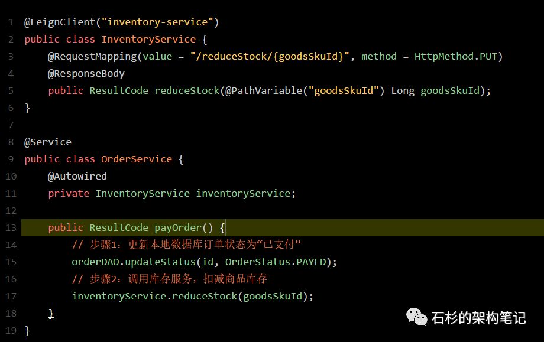
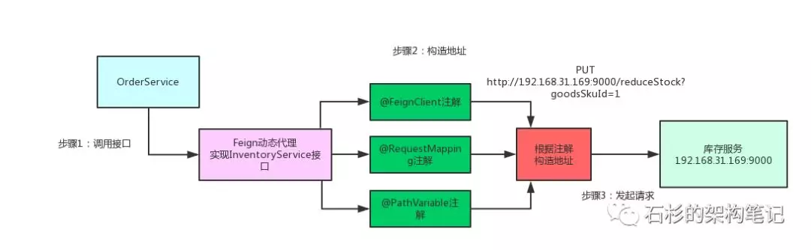
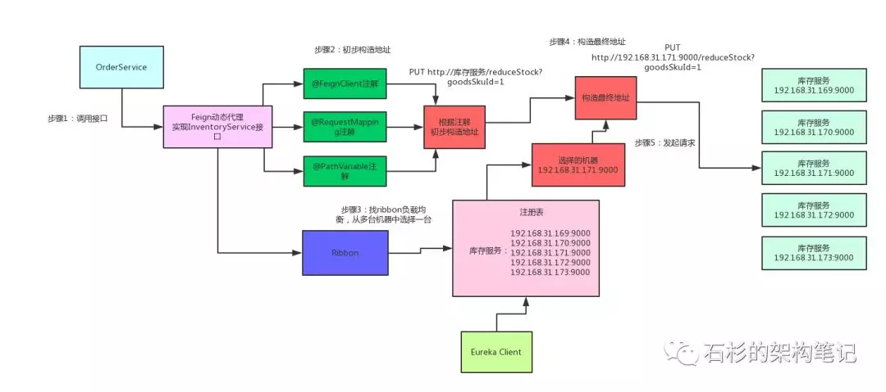
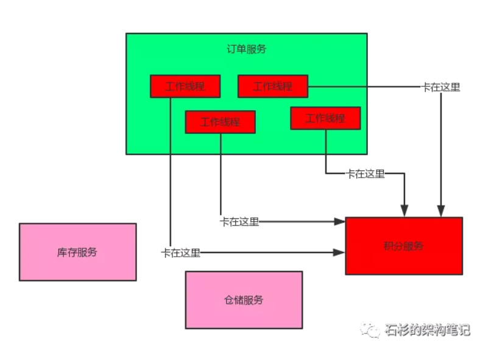
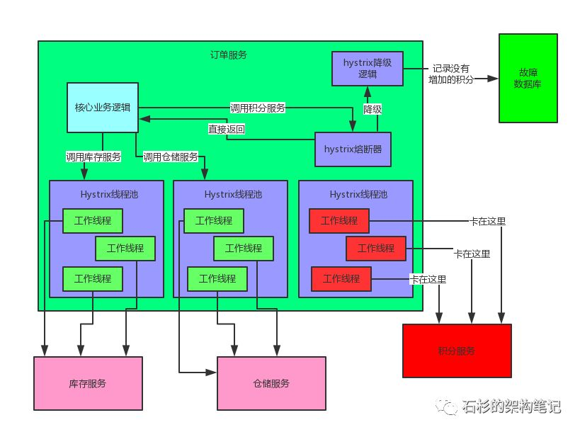
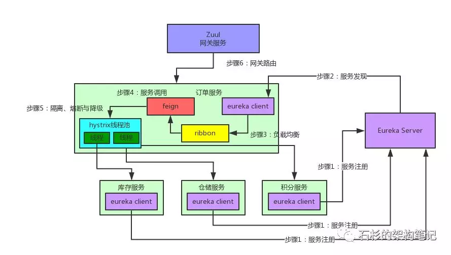

# 介绍

以下五大组件实现了保证了微服务的妥善实施

# 业务场景介绍

先来给大家说一个业务场景，假设咱们现在开发一个电商网站，要实现支付订单的功能，流程如下：

- 创建一个订单之后，如果用户立刻支付了这个订单，我们需要将订单状态更新为“已支付”
- 扣减相应的商品库存
- 通知仓储中心，进行发货
- 给用户的这次购物增加相应的积分

针对上述流程，**我们需要有订单服务、库存服务、仓储服务、积分服务**。整个流程的大体思路如下：

- 用户针对一个订单完成支付之后，就会去找订单服务，更新订单状态
- 订单服务调用库存服务，完成相应功能
- 订单服务调用仓储服务，完成相应功能
- 订单服务调用积分服务，完成相应功能

**至此，整个支付订单的业务流程结束**

下图这张图，清晰表明了各服务间的调用过程：

 

好！有了业务场景之后，咱们就一起来看看Spring Cloud微服务架构中，这几个组件如何相互协作，各自发挥的作用以及其背后的原理。

# Eureka

- **Eureka** **Client：**负责将这个服务的信息注册到Eureka Server中；从Eureka Server的注册表中拉取到自己本地缓存起来。
- **Eureka Server：**注册中心，里面有一个注册表，保存了各个服务所在的机器和端口号

# Feign

- **作用**：简化接口请求：把http请求转换成调用接口，底层使用动态代理直接请求

- **http请求**

  

-  **feign请求**

  

  Feign Client会在底层根据你的注解，跟你指定的服务建立连接、构造请求、发起靕求、获取响应、解析响应，等等。

-  **原理**

  那么问题来了，Feign是如何做到这么神奇的呢？很简单，**Feign的一个关键机制就是使用了动态代理**。咱们一起来看看下面的图，结合图来分析：

  - 首先，如果你对某个接口定义了@FeignClient注解，Feign就会针对这个接口创建一个动态代理
  - 接着你要是调用那个接口，本质就是会调用 Feign创建的动态代理，这是核心中的核心
  - Feign的动态代理会根据你在接口上的@RequestMapping等注解，来动态构造出你要请求的服务的地址
  - 最后针对这个地址，发起请求、解析响应

 

 

# Ribbon

- **作用**：负载均衡

- **过程**

   **此外，Ribbon是和Feign以及Eureka紧密协作，完成工作的，具体如下：**

  - 首先Ribbon会从 Eureka Client里获取到对应的服务注册表，也就知道了所有的服务都部署在了哪些机器上，在监听哪些端口号。

  - 然后Ribbon就可以使用默认的Round Robin算法，从中选择一台机器

  - Feign就会针对这台机器，构造并发起请求。

    ​	

 

# Hystrix

- **场景问题**
  - 如果系统处于高并发的场景下，大量请求涌过来的时候，订单服务的100个线程都会卡在请求积分服务这块。导致订单服务没有一个线程可以处理请求
  - 然后就会导致别人请求订单服务的时候，发现订单服务也挂了，不响应任何请求了

- **雪崩效应**

   上面这个，就是**微服务架构中恐怖的服务雪崩问题**，如下图所示：

  	

   如上图，这么多服务互相调用，要是不做任何保护的话，某一个服务挂了，就会引起连锁反应，导致别的服务也挂。比如积分服务挂了，会导致订单服务的线程全部卡在请求积分服务这里，没有一个线程可以工作，瞬间导致订单服务也挂了，别人请求订单服务全部会卡住，无法响应。

-  **解决思路**

  但是我们思考一下，就算积分服务挂了，订单服务也可以不用挂啊！**服务不重要，不需要即时生效。**

  - 我们结合业务来看：支付订单的时候，只要把库存扣减了，然后通知仓库发货就OK了
  - 如果积分服务挂了，大不了等他恢复之后，慢慢人肉手工恢复数据！为啥一定要因为一个积分服务挂了，就直接导致订单服务也挂了呢？不可以接受！

- **Hystrix作用**

   Hystrix是隔离、熔断以及降级的一个框架。啥意思呢？说白了，Hystrix会搞很多个小小的线程池，比如订单服务请求库存服务是一个线程池，请求仓储服务是一个线程池，请求积分服务是一个线程池。每个线程池里的线程就仅仅用于请求那个服务。

- **熔断**

  **如果积分服务都挂了，达到了一定程度，Hystrix感应到了，直接掐断该服务一段时间，或者5分钟，之后不再走http请求**，之后使用默认降级方案。

- **降级** 

  **熔断后的默认操作**

  每次调用积分服务，你就在数据库里记录一条消息，说给某某用户增加了多少积分，因为积分服务挂了，导致没增加成功！这样等积分服务恢复了，你可以根据这些记录手工加一下积分。

# Zuul

- **网关作用**，类似nginx
  -  像android、ios、pc前端、微信小程序、H5等等，不用去关心后端有几百个服务，就知道有一个网关，所有请求都往网关走，网关会根据请求中的一些特征，将请求转发给后端的各个服务。
  -  可以做统一的降级、限流、认证授权、安全，等等。

- **和nginx**

  Nginx相比zuul功能会更加强大，因为Nginx整合一些脚本语言（Nginx+lua）

  Nginx适合于服务器端负载均衡

  Zuul适合微服务中实现网关，采用ribbon+eureka。

# 总结

最后再来总结一下，上述几个Spring Cloud核心组件，在微服务架构中，分别扮演的角色：

- **Eureka**：各个服务启动时，Eureka Client都会将服务注册到Eureka Server，并且Eureka Client还可以反过来从Eureka Server拉取注册表，从而知道其他服务在哪里
- **Ribbon**：服务间发起请求的时候，基于Ribbon做负载均衡，从一个服务的多台机器中选择一台
- **Feign**：基于Feign的动态代理机制，根据注解和选择的机器，拼接请求URL地址，发起请求
- **Hystrix**：发起请求是通过Hystrix的线程池来走的，不同的服务走不同的线程池，实现了不同服务调用的隔离，避免了服务雪崩的问题
- **Zuul**：如果前端、移动端要调用后端系统，统一从Zuul网关进入，由Zuul网关转发请求给对应的服务

# 参考文章

[拜托！面试请不要再问我Spring Cloud底层原理](https://mp.weixin.qq.com/s?__biz=MzU0OTk3ODQ3Ng==&mid=2247483712&idx=1&sn=4cd88761830428a2e485ac4c2cf120f9&chksm=fba6e943ccd16055344222ce9c794358e1a4a84fdf4263eaa7c91e9756597bd06e49f9b390cb&scene=21#wechat_redirect)