# 介绍

Spring Cloud Config 是一种用来动态获取Git、SVN、本地的配置文件的一种工具

# server

负责发送config，server属于指定配置文件所在的git和svn的url

## 依赖

```xml
 <parent>
    <groupId>org.springframework.cloud</groupId>
    <artifactId>spring-cloud-starter-parent</artifactId>
    <version>Dalston.SR5</version>
    <relativePath/>
</parent>

<dependencies>
    <!--Spring Cloud Config 服务端依赖-->
    <dependency>
        <groupId>org.springframework.cloud</groupId>
        <artifactId>spring-cloud-config-server</artifactId>
    </dependency>
</dependencies>
```
## 配置

### config-repo

config的所在地，不一定在该项目中，但是应该上传到git或者svn中供config-server调用。

### git仓库

```yaml
spring:
  application:
    name: config-server
  cloud:
    config:
      server:
        git:
          uri: https://github.com/Walker-Don/spring-config
          search-paths: config-repo #子目录仓库
#          username: Walker-Don  #账号密码写真实的快一些我觉得，不使用也能访问有点慢
#          password: 1234
```

Spring Cloud Config默认使用Git，对Git的配置也最简单，这里Config Server只用到了uri、username、password这三个参数就可以读取配置了，通过Git的版本控制可以使Config Server适应特殊的场景。

#### 本地仓库

测试时我们也可以使用**本地仓库**的方式，使用`file://`前缀，那么uri的配置就可以写作

```yaml
spring:
  cloud: 
    config: 
      server: 
        git: 
          uri: file://${user.home}/config-repo
```

注意：

1. Windows系统需要使用`file:///`前缀
2. ${user.home}代表当前用户的家目录

#### **占位符配置URI**

`｛application｝`、`｛profile｝`、`{label}`这些占位符除了标识配置文件规则外，还可以对Git的uri配置，

如：`spring.cloud.config.server.git.uri=https://github.com/hellxz/SpringCloudlearn/config-repo/{application}`

> 此时`spring.application.name`的值会填充到这个uri中，从而达到动态获取不同位置的配置

#### **匹配并配置多个仓库**

Spring Cloud Config Server除了使用`{应用名}/{环境名}`来匹配配置仓库外，还支持通过带有通配符的表达式来匹配。

当有多个匹配规则的时候，可以用逗号分隔多个`{应用名}/{环境名}`配置规则。

以官方文档例子加减举例：

```yaml
spring:
  cloud:
    config:
      server:
        git:
          uri: https://github.com/spring-cloud-samples/config-repo   #默认的仓库
          repos:
            simple: https://github.com/simple/config-repo
            special:
              pattern: special*/dev*,*special*/dev*
              uri: https://github.com/special/config-repo
            local:
              pattern: local*
              uri: file:/home/configsvc/config-repo
            test: 
              pattern: 
                - '*/development'
                - '*/staging'
              uri: https://github.com/development/config-repo
```

如果`{应用名}/{环境名}`不能匹配到仓库，那么就在默认的uri下去查找配置文件。

上边的例子中，

- simple 仓库自动匹配到 `simple/*`
- special 仓库的pattern，第一个是应用名以special开头，环境名以dev开头；第二个是应用名包含special，环境名以dev开头；多个匹配到同一uri的pattern用逗号分割
- local 仓库的的pattern也会自动补全为`local*/*`
- test仓库中的 pattern 是以通配符开始的，需要使用单引号

> 注意：配置多个仓库时，Config Server 在启动时会直接克隆第一个仓库的配置库，其他配置库只有请求时才会clone到本地


#### **子目录存储**

通过`spring.cloud.config.server.git.searchPaths`来定位到Git仓库的子目录中，相当于在uri后加上searchPaths的目录。

searchPaths参数的配置也支持使用{应用名}、{环境名}、{分支名}占位符

比如`spring.cloud.config.server.git.searchPaths={应用名}`，通过这样的配置，我们能让每一个应用匹配到自己的目录中。

举例：

```xml
spring:
  cloud:
    config:
      server:
        git:
          uri: https://github.com/spring-cloud-samples/config-repo
          searchPaths: '{application}'
```

#### **访问权限**

使用Git仓库的时候，使用HTTP认证需要使用username和password属性来配置账户

举例

```yaml
spring:
  cloud:
    config:
      server:
        git:
          uri: https://github.com/spring-cloud-samples/config-repo
          username: trolley
          password: strongpassword
```

YAML

Copy

> 还可以使用SSH认证，Config Server本地的.ssh文件或使用私钥等进行配置，此处仅为提出这个用法，不作深究，使用方法见http://cloud.spring.io/spring-cloud-static/Finchley.RELEASE/single/spring-cloud.html#_git_ssh_configuration_using_properties

### SVN配置仓库

除了默认使用Git外，还可以使用SVN进行配置，如下：

在pom.xml中加入SVN的依赖配置，这里没写版本号，Spring Cloud中包含其版本号

        <!--SVN-->
        <dependency>
            <groupId>org.tmatesoft.svnkit</groupId>
            <artifactId>svnkit</artifactId>
        </dependency>
在bootstrap.yml加入

```yaml
spring:
  cloud:
    config:
      server:
        svn:
          uri: http://192.168.0.1/svn/repo/config-repo
          username: username
          password: password
        default-label: trunk
  profiles:
    active: subversion
```

和Git版本稍有区别，需要显示声明subversion，其他使用方法同Git

### 本地仓库

使用版本控制方式将配置文件clone到本地，往往都是克隆到一些临时目录中，但是**操作系统往往会清理这些临时目录**，这可以导致一些我们不期待的情况，比如丢配置，为了避免出现这种问题，可以通过`spring.cloud.config.server.svn.basedir`去更改本地仓库的位置。

### 本地文件系统

不同于Git和SVN以及他们的本地仓库的存储方式，Spring Cloud Config 提供了本地文件系统的存储方式来保存配置信息，实现方式很简单，设置属性`spring.profiles.active=native`，Config Server会从应用的src/main/resources目录下搜索配置文件。如果需要指定配置文件的路径，可以通过`spring.cloud.config.server.native.searchLocations`属性来指定具体配置文件位置。

> 放在本地应用中不如直接配置在bootstrap.yml中，这样一想，这个Config Server端就没什么用了，虽然有这个功能，但还是推荐使用Git和SVN仓库的方式。

## 获取配置

通过http从config-server中获取配置，监控信息

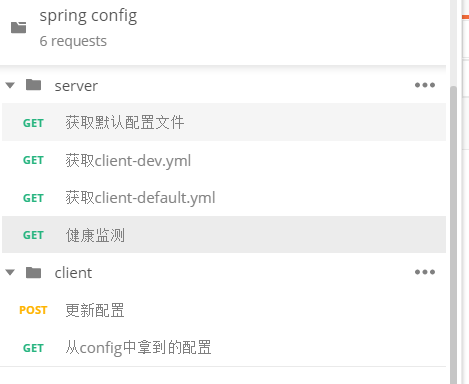

- **配置规则详解**

还记得最开始我们建的那几个测试文件的命名规则么？

- hellxztest.yml
- hellxztest-dev.yml
- hellxztest-stable.yml
- hellxztest-prod.yml

这里的application可以自定义为其它的名称，这里可以用应用的名称，即`应用名`，后边的dev、stable、prod这些都可以视为一个应用下多个不同的配置文件，可以当做环境名，以下均用`环境名`代称。

Config支持我们使用的请求的参数规则为：

- / { 应用名 } / { 环境名 } [ / { 分支名 } ]
- / { 应用名 } - { 环境名 }.yml
- / { 应用名 } - { 环境名 }.properties
- / { 分支名 } / { 应用名 } - { 环境名 }.yml
- / { 分支名 } / { 应用名 } - { 环境名 }.properties

> 注意：
>
> 1. 第一个规则的分支名是可以省略的，默认是master分支
> 2. 无论你的配置文件是properties，还是yml，只要是应用名+环境名能匹配到这个配置文件，那么就能取到
> 3. 如果是想直接定位到没有写环境名的默认配置，那么就可以使用default去匹配没有环境名的配置文件
> 4. 使用第一个规则会匹配到默认配置
> 5. 如果直接使用应用名来匹配，会出现404错误，此时可以加上分支名匹配到默认配置文件
> 6. 如果配置文件的命名很由多个-分隔，此时直接使用这个文件名去匹配的话，会出现直接将内容以源配置文件内容直接返回，内容前可能会有默认配置文件的内容（已测试）

## 原理

#### 架构

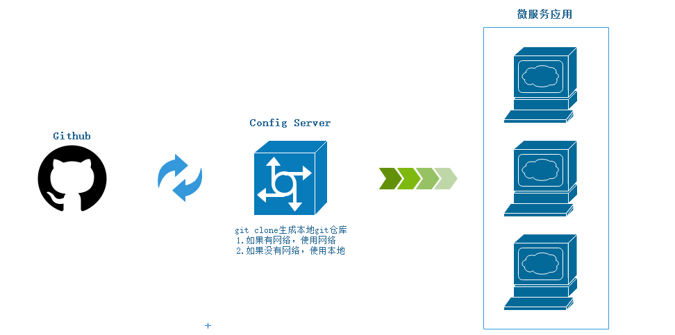

- 远程git仓库：用来存储配置文件的地方，多环境配置文件使用 hellxztest-{环境名}.yml
- Config Server：分布式配置中心，指定了`git仓库uri`、`搜索路径`、`访问账号`和`密码`
- 微服务应用：配置客户端（Config Client），指定`应用名`、`配置中心url`、`环境名`、`分支名`等

#### 流程

1. 微服务应用启动，根据bootstrap.yml（properties）中配置的应用名（application）、环境名（profile）、分支名（label），向Config Server请求配置信息
2. Config Server 根据自己bootstrap.yml（properties）中的Git（或SVN）仓库信息加上客户端传来的配置定位信息去查配置信息的路径
3. Config Server 执行git clone命令，将配置信息下载到本地Git仓库中，将配置信息加载到Spring的ApplicationContext读取内容返回给客户端（微服务应用）
4. 客户端将内容加载到ApplicationContext，配置内容的优先级大于客户端内部的配置内容，进行忽略

特殊情况： 当Config Server因为网络原因无法连接到Git或SVN时，客户端的请求过来后，会先连接Git或SVN，如果没连上，就使用本地仓库的配置文件内容进行返回给客户端

下面是config-server的控制台信息

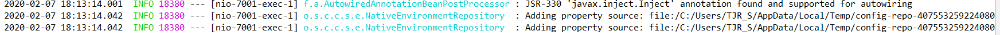

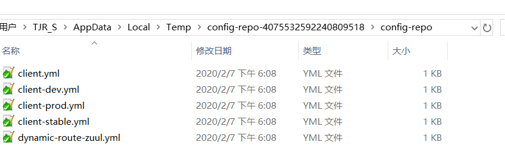


断网后测试正常，配置文件信息依旧被请求获取到了，该配置信息来自Config Server本地


## 健康监测

配置好了Git或SVN之后，为了能确保能连通仓库，我们需要为其实现健康监测功能，来判断Git或SVN仓库是否可以访问

我们配置了`spring.cloud.config.server.git.uri`，而且依赖了`spring-boot-actuator`的依赖，会自动mapped到/health的端点，我们可以访问测试一下

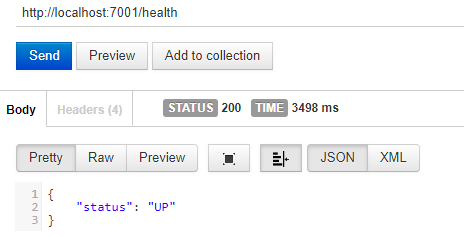

> 这里没有配具体的仓库路径，不然会显示出更多的信息

如果我们无法连接到配置仓库的uri那么`status`就会变成`DOWN`

在`org.springframework.cloud.config.server.config`包中有一个`ConfigServerHealthIndicator`的健康检测器，这个检测器会不断地检查配置的uri是否可以连通。

如果不想使用这个健康检测器，也可以通过使用`spring.cloud.config.server.health.enabled=false`来禁用它。

##  属性覆盖

Config Server提供一个叫`Property Overrides`即`属性覆盖`的功能，通过`spring.cloud.config.server.overrides`属性来设置键值对的参数，这些参数会以Map形式加载到所有Config Client的配置中。

官方举例：

```yaml
spring:
  cloud:
    config:
      server:
        overrides:
          foo: bar
```

通过属性覆盖配置的参数不会被Config Client修改，并且Config Client获取配置信息时就会得到这些信息，使用这种特性可以方便我们为客户端应用配置一些共同属性或默认属性。这些属性不是强制的，可以通过改变客户端中的更高优先我级的配置方式来选择是否使用这些属性覆盖的默认值。

## 安全保护

配置中心存储的内容很敏感，所以必需做一些安保措施，使用Spring Security更方便一些。

只需要引入依赖并配置用户名和密码

```xml
        <!--Spring Security依赖-->
        <dependency>
            <groupId>org.springframework.cloud</groupId>
            <artifactId>spring-cloud-security</artifactId>
        </dependency>
```

默认情况下会得到一名为user的用户，并在配置中心启动的时候在log中打印出来随机密码，当然大多数情况下我们不会使用这个随机密码，我们可以在配置文件中指定用户和密码

```yaml
security: 
  user:
    name: user
    password: xxxxxxx
```

通过上边的配置，配置中心已经开启了安全保护，这时候连接配置中心的客户端没有密码的情况下会返回401错误

只需要在客户端中加入账号密码来通过安全校验，举例

```yaml
spring: 
  cloud: 
    config: 
      username: user
      password: xxxxxxx
```

## 加密解密

微服务开发中往往都是所属组织成员自行维护，在配置文件中会有很多敏感信息，比如数据库密码等，这些信息如果以明文存储和传输是很危险的，为解决这个问题，Config提供了对属性加密解密的功能，只需要在敏感信息的值加密后加上前缀`{cipher}`，这主要是为了防止密文被用作密码并意外泄露。ps: 防的就是开发人员。。

> **重要**：要使用加密和解密功能，您需要在JVM中安装全功能JCE（默认情况下不包括它）。您可以从Oracle下载“Java Cryptography Extension（JCE）Unlimited Strength Jurisdiction Policy Files”并按照安装说明进行操作（实质上，您需要将JRE lib / security目录中的两个策略文件替换为您下载的那些）。
>
> **JCE for JDK8下载地址**：http://www.oracle.com/technetwork/java/javase/downloads/jce8-download-2133166.html
>
> **注意**：上边说的是官方的说法，但是我发现一个很气的事实是我下载好这JCE的文件后，发现jdk1.8中已经有了这些文件，如下图
>
> 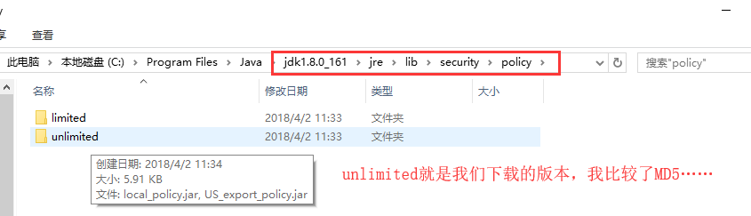
>
> 可能是1.8自带了这些吧，按Spring Cloud 文档中的说法，把unlimited下的两个jar包复制到`{JAVA_HOME}/jre/lib/security`目录下，这里当然也没有自带的JCE这两个包去被覆盖，limited和unlimited区别在于limited对加密解密的长度有限制。

用数据源举例：

```yaml
spring:
  datasource:
    username: dbuser
    password: '{cipher}FKSAJDFGYOS8F7GLHAKERGFHLSAJ'
```

> .yml配置文件需要使用单引号括起来要解密的内容，.properties文件中的加密值不得用引号括起来。否则，该值不会被解密。

**相关端点**

完成了JCE的安装后，可以尝试启动配置中心，Spring Cloud 暴露出了几个端点

- /encrypt/status：查看加密功能状态的端点
- /key：查看密钥的端点
- /encrypt：对请求的body内容进行加密的端点
- /decrypt：对请求的body内容进行解密的端点

在没有设置密钥的时候，访问/encrypt/status端点会出现

```json
{
    "description":"No key was installed for encryption service",
    "status":""
}
```

在bootstrap.yml中设置密钥(对称性密钥)

```yaml
encrypt:
  key: hellxz
```

> 这里发现如果放在application.yml中，调用/encrypt/status还是上边的情况，放到bootstrap.yml中正常了

重启Config Server，使用/encrypt端点测试加密效果：

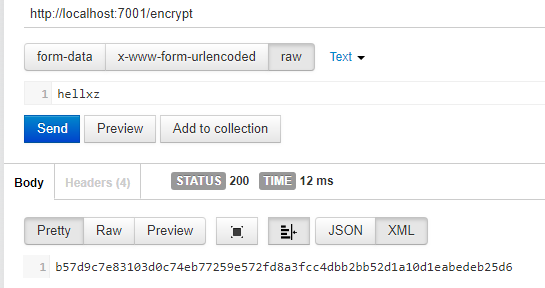

/decrypt解密测试：

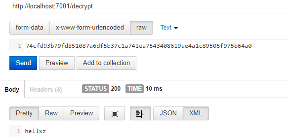

**非对称加密**

非对称加密相对对称加密的密钥生成与配置更加复杂，耗时也更多，但是更安全。

这里我们使用jdk自带的keytool工具来生成证书，它的位置在%JAVA_HOME%\bin\keytool.exe

生成密钥的命令如下，请酌情修改：

```bash
PS C:\Program Files\java\jdk1.8.0_161\bin> keytool -genkeypair -alias config-server -keyalg RSA -keystore D:\\config-server.keystore
输入密钥库口令:
再次输入新口令:
您的名字与姓氏是什么?
  [Unknown]:  Hellxz Zhang
您的组织单位名称是什么?
  [Unknown]:  SN
您的组织名称是什么?
  [Unknown]:  SN
您所在的城市或区域名称是什么?
  [Unknown]:  JiNan
您所在的省/市/自治区名称是什么?
  [Unknown]:  ShanDong
该单位的双字母国家/地区代码是什么?
  [Unknown]:  ZH
CN=Hellxz Zhang, OU=SN, O=SN, L=JiNan, ST=ShanDong, C=ZH是否正确?
  [否]:  y

输入 <config-server> 的密钥口令
        (如果和密钥库口令相同, 按回车):

Warning:
JKS 密钥库使用专用格式。建议使用 "keytool -importkeystore -srckeystore D:\\config-server.keystore -destkeystore D:\\conf
ig-server.keystore -deststoretype pkcs12" 迁移到行业标准格式 PKCS12。
```

这里使用的是PowerShell，在win下测试的，这样操作后，在D盘生成了config-server.keystore的文件，我们将这个文件放到Config Server 的resources下（classpath），然后在bootstrap.yml加入相关配置信息

```yaml
encrypt:
  key: hellxz
  key-store:
    location: config-server.keystore
    alias: config-server
    password: hellxz
    secret: hellxz
```

> 生成的时候密码都是盲输的，我都输的hellxz，如有修改，请用自己输入的

**加密测试**：

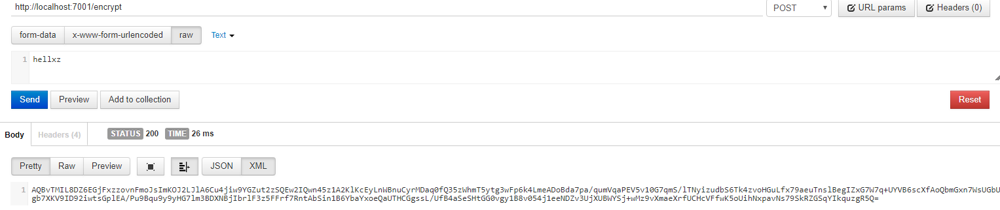

**解密测试：**

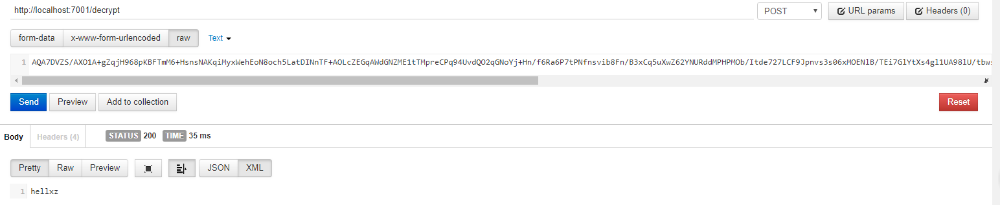

> 图片不清晰请复制图片地址，地址栏访问查看

# client

各个微服务，去config-sever拿配置文件f

### 依赖

```xml
<?xml version="1.0" encoding="UTF-8"?>
<project xmlns="http://maven.apache.org/POM/4.0.0"
         xmlns:xsi="http://www.w3.org/2001/XMLSchema-instance"
         xsi:schemaLocation="http://maven.apache.org/POM/4.0.0 http://maven.apache.org/xsd/maven-4.0.0.xsd">

    <modelVersion>4.0.0</modelVersion>

    <artifactId>server-client</artifactId>

    <parent>
        <groupId>com.don.demo</groupId>
        <artifactId>spring-config</artifactId>
        <version>1.0-SNAPSHOT</version>
    </parent>

    <dependencies>
        <!--Spring Cloud Config 客户端依赖-->
        <dependency>
            <groupId>org.springframework.cloud</groupId>
            <artifactId>spring-cloud-starter-config</artifactId>
        </dependency>
        <!-- web的依赖，必须加 -->
        <dependency>
            <groupId>org.springframework.boot</groupId>
            <artifactId>spring-boot-starter-web</artifactId>
        </dependency>
        <!--Spring Boot Actuator，感应服务端变化-->
        <dependency>
            <groupId>org.springframework.boot</groupId>
            <artifactId>spring-boot-starter-actuator</artifactId>
        </dependency>

</dependencies>

</project>
```

### 配置

```yaml
spring:
  application:
    name: client                  #指定了配置文件的应用名
  cloud:
    config:
      uri: http://localhost:7001/        #Config server的uri
      profile: dev                       #指定的环境
      label: master                      #指定分支

server:
  port: 7002

management:
  security:
    enabled: false     #SpringBoot 1.5.X 以上默认开通了安全认证，如果不关闭会要求权限


```

注意：

1. 参数：

- spring.application.name：对应文件规则的`应用名`
- spring.cloud.config.profile：对应`环境名`
- spring.cloud.config.label：对应`分支名`
- spring.cloud.config.uri：对应Config Server开放的地址

1. 如果要用到动态刷新，SpringBoot 1.5版本以上需要使用management.security.enabled=false

### 动态更新

修改配置文件再次提交到git，但是client并没有主动去server中获取新的配置文件，需要主动请求。

```http
http://localhost:7002/api/from   没有变化

http://localhost:7002/refresh
http://localhost:7002/api/from 变化了
```


一般我们不能每次修改配置都手动刷新（post方法调用/refresh），可以与github之类的webhook进行配合，如果有修改就发起post请求/refresh就可以了，svn也有类似的hook机制，这里就不多讲了。

### 原理

Config Client项目在启动的时候请求一次Config Server

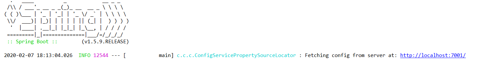

### URI指定配置中心

Spring Clout Config的客户端在启动的时候，默认会从工程的classpath下加载配置信息并启动应用，只有配置了`spring.cloud.config.uri`的时候，客户端才会尝试连接Config Server拉取配置信息并初始化Spring环境配置。我们必须将uri这个属性参数配置到bootstrap.yml(或.properties)中，这个配置文件的优先级大于application.yml和其它文件，这样才能保证能正确加载远程配置。启动的时候客户端会去连接uri属性的值。

举例：

```yaml
spring: 
  application:
    name: hellxztest
  cloud:
    config:
      uri: http://localhost:7001/
      profile: dev
```

> 例子中使用application.name和profile定位配置信息


### 3. 失败快速响应与重试

Spring Cloud Config的客户端会预先加载很多配置信息，然后才开始连接Config Server进行属性的注入，当应用复杂的时候，连接ConfigServer时间过长会直接影响项目的启动速度，我们还希望能知道Config Client 是否能从Config Server中取到信息。此时，只需在bootstrap.yml（.properties）中配置属性`spring.cloud.config.failfast=true`即可。

关闭Config Server，重启Config Client，项目直接报错无法启动

```bash
java.lang.IllegalStateException: Could not locate PropertySource and the fail fast property is set, failing
    …… 省略其他错误信息 …… 
```

Bash

Copy

直接失败似乎代价有些高，所以Config客户端还提供了自动重试的功能，开启前请确认`spring.cloud.config.failfast=true`参数已经配置，然后为ConfigClient的pom.xml增加spring-retry和spring-boot-starter-aop的依赖，如下：

```xml
        <!-- 连接配置中心重试的依赖 -->
        <dependency>
            <groupId>org.springframework.retry</groupId>
            <artifactId>spring-retry</artifactId>
        </dependency>
        <dependency>
            <groupId>org.springframework.boot</groupId>
            <artifactId>spring-boot-starter-aop</artifactId>
        </dependency>
```

XML

Copy

只需加入如上两个依赖就能实现自动重试，当第6次重试失败之后，那么就会上边那个快速失败报的错误

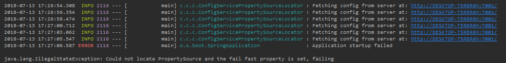

如果对最大重试次数和重试间隔等设置不满意，可以通过下面有参数进行调整。

```yaml
spring:
  cloud:
    fail-fast: true                 #快速失败
    retry:
      initial-interval: 1100        #首次重试间隔时间，默认1000毫秒
      multiplier: 1.1D              #下一次重试间隔时间的乘数，比如开始1000，下一次就是1000*1.1=1100
      max-interval: 2000            #最大重试时间，默认2000
      max-attempts: 3               #最大重试次数，默认6次
```

YAML

Copy

> 这块书中把inital-interval和multiplier的作用写反了，请注意。


# 高可用

为了实现配置中心的高可用，主要有两种方式

1. **传统模式**：不需做任何额外配置，起多个配置中心服务，所有配置中心都指向同一个Git仓库，客户端通过负载均衡进行调用配置中心服务，从而实现服务的高可用
2. **服务模式**：将配置中心注册为微服务到注册中心，通过Eureka的服务治理进行负载均衡，而且也实现了自维护，这块在后边的客户端详解中讲。

### 服务模式

服务端详解那一块说过可以把配置中心注册到注册中心，通过服务发现来访问Config Server拉取Git仓库中的配置信息。

下面的内容需要改造ConfigServer和ConfigClient

为ConfigServer和ConfigClient的pom.xml中分别加入Eureka的依赖

```xml
        <!-- Spring Cloud Eureka的依赖 -->
        <dependency>
            <groupId>org.springframework.cloud</groupId>
            <artifactId>spring-cloud-starter-eureka</artifactId>
        </dependency>
```

在上边说过，bootstrap.yml的优化级大于application.yml，这里我们需在将这两个服务都注册到注册中心，所以我选择在ConfigServer的resources下创建一个application.yml，在其中配置连接注册中心的通用信息

```yaml
applicaiton.yml
eureka:
  client:
    serviceUrl:
      defaultZone: http://localhost:1111/eureka/
```

将这个applicaiton.yml 的内容复制到ConfigClient的resources下的bootstrap.yml中。

依赖有了，注册中心的地址也有了，别忘了将这两个模块的主类加上`@EnableDiscoveryClient`。

完成这一步我们可以先启动注册中心、ConfigServer、ConfigClient 看一看是否注册成功，如图，

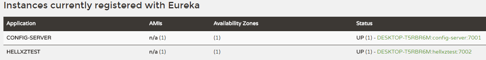

ConfigServer至此配置完毕。接下来我们为客户端使用服务发现的方式去调用ConfigServer

只需要在ConfigClient的bootstrap.yml中注掉spring.cloud.config.uri那一项，`spring.cloud.discovery.enabled=true`和`spring.cloud.discovery.serviceId=config-server`，为了更直观，下面把整个ConfigClient的bootstrap.yml粘出来

```yaml
spring:
  application:
    name: hellxztest                     #指定了配置文件的应用名
  cloud:
    config:
#      uri: http://localhost:7001/    #Config server的uri
      profile: dev                          #指定的环境
      label: master                        #指定分支
      discovery:
        enabled: true                     #开启配置服务发现
        serviceId: config-server        #配置中心服务名
server:
  port: 7002
management:
  security:
    enabled: false     #SpringBoot 1.5.X 以上默认开通了安全认证，如果不关闭会要求权限
eureka:
  client:
    serviceUrl:
      defaultZone: http://localhost:1111/eureka/
```

重启ConfigClient项目，我们之前提供了一个接口`/api/from`，这个接口会返回git上hellxztest-dev.yml中的from参数的值，现在我们只要调通这个接口就说明我们使用服务发现功能连接配置中心成功。


测试成功，服务化配置中心配置完成。

# 代码

有入门代码和高可用两个版本

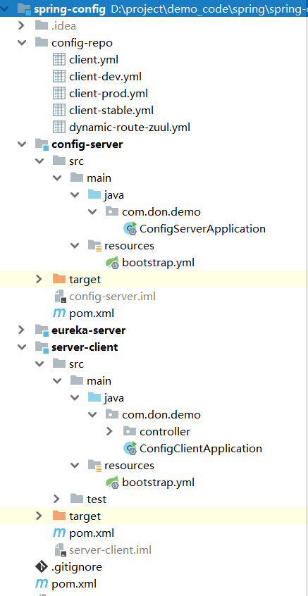

# 注解

## @EnableConfigServer

开启config 的server功能

## @RefreshScope 

开启更新功能

# 参考

 [Spring Cloud（十四）Config 配置中心与客户端的使用与详细](https://www.cnblogs.com/hellxz/p/9306507.html) 都是抄这里的