# 介绍

## **三层架构和MVC模型**

[Web.md](C:\Users\TJR_S\OneDrive\编程\2. Web\0.Web.md) 

SpringMVC 是一种基于 Java 的实现 MVC 设计模型的请求驱动类型的轻量级 Web 框架， 属于 SpringFrameWork 的后续产品，已经融合在 Spring Web Flow 里面。 Spring 框架提供了构建 Web 应用程序的全功能 MVC 模块。使用 Spring 可插入的 MVC 架构，从而在使用 Spring 进行 WEB 开发时，可以选择使用 Spring的 Spring MVC 框架或集成其他 MVC 开发框架，如 Struts1(现在一般不用)， Struts2 等。

SpringMVC 已经成为目前最主流的 MVC 框架之一， 并且随着 Spring3.0 的发布， 全面超越 Struts2，成为最优秀的 MVC 框架。

它通过一套注解，让一个简单的 Java 类成为处理请求的控制器，而无须实现任何接口。同时它还支持RESTful 编程风格的请求 。


## 优势

1. 清晰的角色划分：

    前端控制器（DispatcherServlet）

    请求到处理器映射（HandlerMapping）

    处理器适配器（HandlerAdapter）

    视图解析器（ViewResolver）

    处理器或页面控制器（Controller）验证器（ Validator）

    命令对象（Command 请求参数绑定到的对象就叫命令对象）

    表单对象（Form Object 提供给表单展示和提交到的对象就叫表单对象）。

2. 分工明确，而且扩展点相当灵活，可以很容易扩展，虽然几乎不需要。

3. 由于命令对象就是一个 POJO，无需继承框架特定 API，可以使用命令对象直接作为业务对象。

4. 和 Spring 其他框架无缝集成，是其它 Web 框架所不具备的。

5. 可适配，通过 HandlerAdapter 可以支持任意的类作为处理器。

6. 可定制性，HandlerMapping. ViewResolver 等能够非常简单的定制。

7. 功能强大的数据验证. 格式化. 绑定机制。

8. 利用 Spring 提供的 Mock 对象能够非常简单的进行 Web 层单元测试。

9. 本地化. 主题的解析的支持，使我们更容易进行国际化和主题的切换。

10. 强大的 JSP 标签库，使 JSP 编写更容易。

11. ………………还有比如RESTful 风格的支持. 简单的文件上传. 约定大于配置的契约式编程支持. 基于注解的零配置支持等等。

## SpringMVC 和 Struts2 的优略分析  

- **共同点**

  它们都是表现层框架，都是基于 MVC 模型编写的。
  它们的底层都离不开原始 ServletAPI。
  它们处理请求的机制都是一个核心控制器。

- **区别**

  Spring MVC 的入口是 Servlet, 而 Struts2 是 Filter

  Spring MVC 是基于方法设计的，而 Struts2 是基于类， Struts2 每次执行都会创建一个动作类。所以 Spring MVC 会稍微比 Struts2 快些。
  Spring MVC 使用更加简洁,同时还支持 JSR303, 处理 ajax 的请求更方便

  (JSR303 是一套 JavaBean 参数校验的标准，它定义了很多常用的校验注解，我们可以直接将这些注解加在我们 JavaBean 的属性上面，就可以在需要校验的时候进行校验了。 )

  Struts2 的 OGNL 表达式使页面的开发效率相比 Spring MVC 更高些，但执行效率并没有比 JSTL 提升，尤其是 struts2 的表单标签，远没有 html 执行效率高。

## 启动顺序

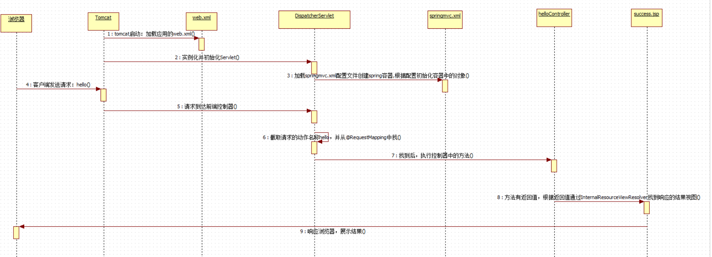

# 原理

## 流程图

1. 用户向服务器发送请求，请求被 springMVC 前端控制器 DispatchServlet 捕获；
2. DispatcherServle 对请求 URL 进行解析，得到请求资源标识符（URL），然后根据该 URL 调用 HandlerMapping将请求映射到处理器 HandlerExcutionChain；
3. DispatchServlet 根据获得 Handler 选择一个合适的 HandlerAdapter 适配器处理；
4. Handler 对数据处理完成以后将返回一个 ModelAndView（）对象给 DisPatchServlet;
5. Handler 返回的 ModelAndView()只是一个逻辑视图并不是一个正式的视图， DispatcherSevlet 通过ViewResolver 试图解析器将逻辑视图转化为真正的视图 View;
6. DispatcherServle 通过 model 解析出 ModelAndView()中的参数进行解析最终展现出完整的 view 并返回给客户端;  

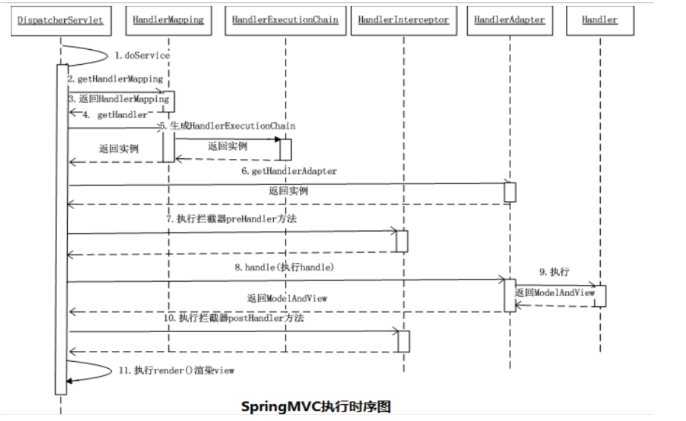

## DispatcherServlet

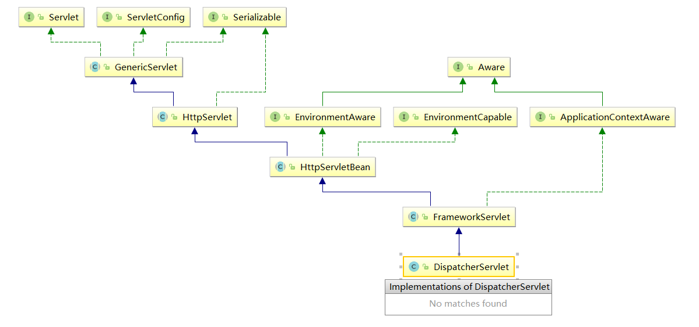

# 入门案例

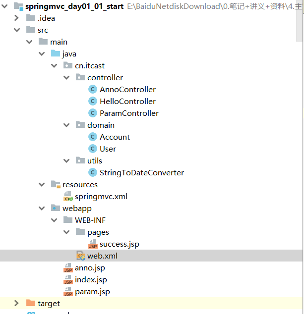

# 使用

## 定义

### @FrameworkEndpoint

和@controller一样的作用，但是自己的写的@controller可以覆盖

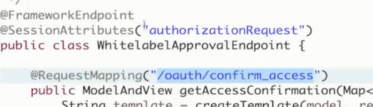

### @Controller

### @RestController

集合@ResponseBody

转化对象为默认视图（json,xml），如果不是对象不生效

## 请求

### @RequestMapping

用于建立请求 URL 和controller方法之间的对应关系。  可以使用正则表达式

- **属性**

  - value：用于指定请求的 URL。 它和 path 属性的作用是一样的。

  - method：用于指定请求的方式。

    ```java
    RequestMethod.POST
    ```

  - params：用于指定限制请求参数的条件。 它支持简单的表达式。 要求请求参数的 key 和 value 必须和配置的一模一样。

    ```java
    params = {"accountName"}，表示请求参数必须有 accountName
    params = {"moeny!100"}，表示请求参数中 money 不能是 100。
    params= {"accountName","money>100"}
    ```

  - headers：用于指定限制请求消息头的条件。

  - produces ：它的作用是指定返回值类型，不但可以设置返回值类型还可以设定返回值的字符编码；

  - consumes： 指定处理请求的提交内容类型（Content-Type），例如application/json, text/html;

    ```java
    @RequestMapping(value = "/pets/{petId}", method = RequestMethod.GET, produces="application/json")  //可以省略注解@responseBody
    @RequestMapping(value = "/pets/{petId}", produces="MediaType.APPLICATION_JSON_VALUE"+";charset=utf-8")  //返回json数据的字符编码为utf-8.：
    @RequestMapping(value = "/pets", method = RequestMethod.POST, consumes="application/json")  //仅处理request Content-Type为“application/json”类型的请求
    ```

- **注意**

  以上四个属性只要出现 2 个或以上时，他们的关系是与的关系。  

  不要在访问 URL 前面加/，否则无法找到资源。  ？

  ```html
  <a href="account/findAccount">查询账户</a>
  <a href="${pageContext.request.contextPath}/account/findAccount">
  ```

- **一个接口可以有多个url匹配，多个注解**

  ```java
  //HTML
  //    @RequestMapping(path = {"/html/demo", "/html/demo2"}, method = {RequestMethod.GET,RequestMapping.POST})  多个url映射
  @GetMapping(path = {"/html/demo"})
  @PostMapping(path = {"/html/demo2"})
  public String html() {
      return "<html><body>Hello,World</body></html>"; // 去模板文件夹templates找，找不到就直接返回html，即便@RestController
  }
  ```

- **正则表达式**

  ```java
  @GetMapping("/{id:\\d+}") // 相当于 
  ```

  
  
- **底层**

  ```java
  // Controller类的方法上的@RequestMapping不一定要写在Controller类（通过反射获取，方法注解不能继承）
  
  ```

  

### @PathVariable

 截取uri部分，并且可以使用正则表达式

```java
//：后为正则表达式，前一个\是转义字符，必须为正数
@RequestMapping(value = "/user/{id:\\d+}", method = RequestMethod.GET)
```

### @RequestParam

```java
public String htmlParam(@RequestParam(value = "p", required = false, defaultValue = "Empty") String param) {...}
```

 用不用关系不大，主要是改变参数名不同，String转Integer

### @RequestBody

映射请求体到 java 方法的参数，把Json数据转化java为对象

```java
    @PostMapping
    public User create(@RequestBody User user) {..} //发送json数据
```

### @RequestHeader

```java
	//@RequestHeader
	public String htmlHeader(@RequestHeader(value = "Accept") String acceptHeader, HttpServletRequest request)
```

### @JsonView 

控制返回的json数据，不是为null，而是直接忽略

```xml
		<dependency>
			<groupId>org.springframework.boot</groupId>
			<artifactId>spring-boot-starter-web</artifactId>
		</dependency>
```

* 使用接口来声明多个视图，可以继承
* 在值对象的 getter、field上指定视图
* 在 Controller 方法上指定视图  

```java
package com.immoc.dto;

import com.fasterxml.jackson.annotation.JsonView;

import java.util.Date;

public class User {

    public  interface UserSimpleView {};
    public interface UserDetailView extends  UserSimpleView {};

    private String id;

	@JsonView(UserSimpleView.class)//放在filed和getter方法
    private String username;

    private String password;

    private Date birthday;

    public String getUsername() {
        return username;
    }

    public User setUsername(String username) {
        this.username = username;
        return this;
    }

    @JsonView(UserDetailView.class)
    public String getPassword() {
        return password;
    }

    public User setPassword(String password) {
        this.password = password;
        return this;
    }

    @JsonView(UserSimpleView.class)
    public String getId() {
        return id;
    }

    public User setId(String id) {
        this.id = id;
        return this;
    }

    @JsonView(UserSimpleView.class)
    public Date getBirthday() {
        return birthday;
    }

    public void setBirthday(Date birthday) {
        this.birthday = birthday;
    }
}

	//[{"id":null,"username":"user1","birthday":null},{ ... 少一个password
    @GetMapping
    @JsonView(User.UserSimpleView.class)
    public List<User> query(User user, @PageableDefault(size = 10, page = 0) Pageable pageable) { .. }

	// {"id":null,"username":"user1","password":"1","birthday":null} 全部
    @GetMapping("/{id:\\d+}")
    @JsonView(User.UserDetailView.class)
    public User getInfo(@PathVariable String id) {..}
```

### 参数校验

实体类使用注解参数

#### Hibernate

http://hibernate.org/validator/

@Valid 注解和 BindingResult 验证请求参数的合法性并处理校验结果

```java
public class User {

    public interface UserSimpleView {}
    public interface UserDetailView extends  UserSimpleView {}

    private String id;

    @MyConstraint(message = "测试 MyConstraint")
    private String username;

    @NotBlank(message = "密码不能为空")
    private String password;

    @Past(message = "生日必须是过去的时间")
    ...
}
    
    @PutMapping("/{id:\\d+}")
    public User update(@Valid @RequestBody User user, BindingResult errors) {
        logger.info(ReflectionToStringBuilder.toString(user, ToStringStyle.MULTI_LINE_STYLE));

        if (errors.hasErrors()) {
            errors.getAllErrors().forEach(e -> logger.error(e.getDefaultMessage()));
        }

        return user;
    }
```


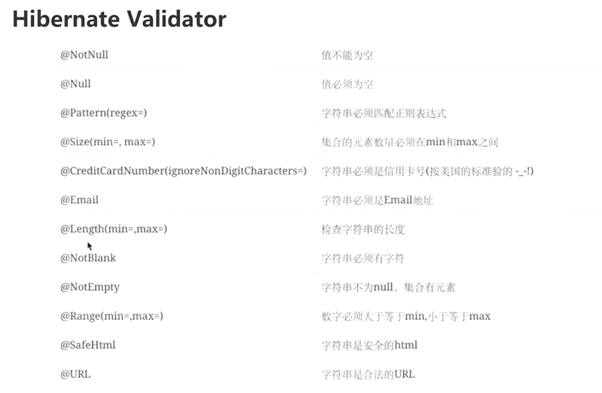


#### 自定义校验器

一个校验注解和实际的校验器

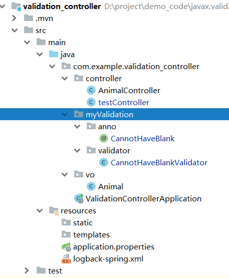

### @CookieValue

### RequestEntity

### @PageableDefault

指定分页参数默认值

```xml
        <dependency>
            <groupId>org.springframework.data</groupId>
            <artifactId>spring-data-commons</artifactId>
            <version>2.1.10.RELEASE</version>
        </dependency>
```

```java
	@RequestMapping(value = "/user", method = RequestMethod.GET)
	public List<User> query(User user, @PageableDefault(size = 10, page = 0) Pageable pageable) { ...}
	
	@Test
	public void whenQuerySeccuss() {
		try {
			mockMvc.perform(MockMvcRequestBuilders.get("/mock/user")
					.contentType(MediaType.APPLICATION_JSON_UTF8)
					.param("username", "user1")
					.param("size", "15")
					.param("page", "1")
					.param("sort", "username,desc")
			)
					.andExpect(MockMvcResultMatchers.status().isOk())
					.andExpect(MockMvcResultMatchers.jsonPath("$.length()").value(3))
			;
		} catch (Exception e) {
			e.printStackTrace();
		}
	}
```

@

### 请求参数的绑定

表单中请求参数都是基于 key=value 的，客户端提交的数据都是二进制数据。需要解码编码。

SpringMVC 绑定请求参数是自动实现的，但是要想使用，必须遵循使用要求。

基本类型参数：
		包括基本类型和 String 类型
POJO 类型参数：
包括实体类，以及关联的实体类
数组和集合类型参数：
包括 List 结构和 Map 结构的集合（包括数组）  

### request、response

#### 介绍

```java
// 在controller中获取request或者response
HttpServletResponse response = ((ServletRequestAttributes) RequestContextHolder.getRequestAttributes()).getResponse();
HttpServletRequest request = ((ServletRequestAttributes)RequestContextHolder.getRequestAttributes()).getRequest();

// ServletWebRequest 包装request和response
ServletWebRequest  extends ServletRequestAttributes implements NativeWebRequest
new ServletWebRequest(request)
    
//工具类
    //request参数
    ServletRequestUtils.getRequiredStringParameter(servletWebRequest.getRequest(),"mobile");

	//session操作
	private SessionStrategy sessionStrategy = new HttpSessionSessionStrategy();
	sessionStrategy.setAttribute(new ServletWebRequest(request), SESSION_KEY, validateCode);

	//重定向
	private RedirectStrategy redirectStrategy = new DefaultRedirectStrategy();
	redirectStrategy.sendRedirect(request, response, securityProperties.getBrowser().getLoginPage());
	
	// url匹配工具类
	private AntPathMatcher pathMatcher = new AntPathMatcher();
	pathMatcher.match(url,request.getRequestURI())

```


#### 底层Tocmat中

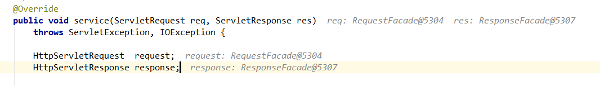

#### 上层springMVC中

```java
	//普通请求，都是同一个tomcat原生request
	@GetMapping("/hello")
	public Object hello(HttpServletRequest request) {
		HttpServletRequest request1 = ((ServletRequestAttributes) RequestContextHolder.getRequestAttributes()).getRequest();//获取request
		return "hello world";
	}
```

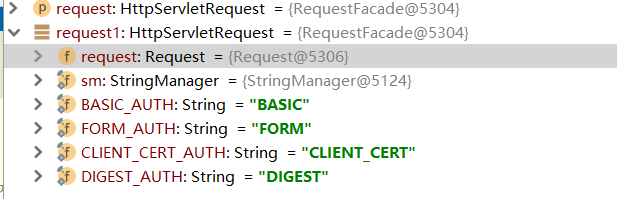

```java
	//上传文件的时候参数request包装了tomcat的request
	@PostMapping
	public FileInfo upload(MultipartFile multipartFile, HttpServletRequest request) throws IOException {
		HttpServletRequest request1 = ((ServletRequestAttributes) RequestContextHolder.getRequestAttributes()).getRequest();//获取request
        ..//request包装了request1，request1就是tomcat原生的request
    }
```

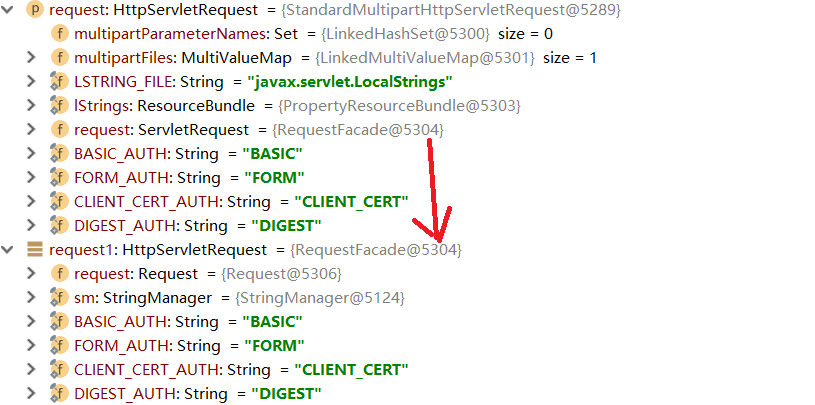

### 日期格式的处理

#### json body

jsonformat，在dto类上设置。

#### form和url

1. 使用**时间戳**传value会自动转化为Date对象

```java
Date date = new Date();
//  System.out.println(date);
//自身的格式不可以使用，需要使用时间戳，或者自定义格式转换  
System.out.println(date.getTime());  
String content = "{\"username\":\"tom\",\"password\":null,\"birthday\":"+date.getTime()+"}";
```

2. controller中注册一个转换器

   ```java
     @InitBinder
       public void init(WebDataBinder binder) {
           binder.registerCustomEditor(Date.class, new CustomDateEditor(new SimpleDateFormat("yyyy-MM-dd HH:mm:ss"), true));
       }
   ```

   

### 乱码

#### post

```xml
    1. 在获取参数前，设置request的编码request.setCharacterEncoding("utf-8");

	2. <!--配置解决中文乱码的过滤器-->
    <filter>
        <filter-name>characterEncodingFilter</filter-name>
        <filter-class>org.springframework.web.filter.CharacterEncodingFilter</filter-class>
        <init-param>
            <param-name>encoding</param-name>
            <param-value>UTF-8</param-value>
        </init-param>
    </filter>
    <filter-mapping>
        <filter-name>characterEncodingFilter</filter-name>
        <url-pattern>/*</url-pattern>
    </filter-mapping>
```

#### get

1. 修改 tomcat 配置文件添加编码与工程编码一致。tomcat 8 已经将get方式乱码问题解决了

2. 另 外 一 种 方 法 对 参 数 进 行 重 新 编 码 

   ```java
   String userName = New String(Request.getParameter(“userName”).getBytes(“ISO8859-1”), “utf-8”);
   ```

     

## 响应

### @ResponseBody

- 方法返回String，响应头都是一样的，并且把String放在body中，浏览器自己根据字符串内容自己解析

  ```http
  Content-Type →text/plain;charset=UTF-8
  ```

  - 单纯字符串，直接返回，无法解析

  - html，浏览器会解析成Dom树

    ```java
    public String html() {
        return "<html><body>Hello,World</body></html>";
    }
    ```

- 如果返回对象，那么对象转化为json

### @ResponseStatus

```java
/**
	Marks a method or exception class with the status code() and reason() that should be returned.
	The status code is applied to the HTTP response when the handler method is invoked and overrides status information set by other means, like ResponseEntity or "redirect:".
	Warning: when using this annotation on an exception class, or when setting the reason attribute of this annotation, the HttpServletResponse.sendError method will be used.
*/
	@ResponseStatus(HttpStatus.UNAUTHORIZED)

    @ExceptionHandler(UserNotExistException.class)
    @ResponseBody
    @ResponseStatus(HttpStatus.INTERNAL_SERVER_ERROR)
    public Map<String, Object> handleUserNotExistException(UserNotExistException e) {
```

### ResponseEntity

可以发送任何形式的数据

```java
    //ResponseEntity
 	@GetMapping(path = "/html/demo/response/entity")
	public ResponseEntity<String> htmlResponseEntity() {

		HttpHeaders httpHeaders = new HttpHeaders();

		httpHeaders.put("MyHeader", Arrays.asList("MyHeaderValue"));

		ResponseEntity responseEntity = new ResponseEntity("<html><body>HTML ResponseEntity </body></html>", httpHeaders, HttpStatus.OK);
		return responseEntity;
	}
```

### xml

添加依赖，RestController会默认转化为xml 

> 注意，此时如果想要返回json，需要显示指明 `@GetMapping(path = "/json/user", produces = MediaType.APPLICATION_JSON_VALUE)`

```xml
		<dependency>
			<groupId>com.fasterxml.jackson.dataformat</groupId>
			<artifactId>jackson-dataformat-xml</artifactId>
		</dependency>
```

```java
@RestController
public class XMLRestController {

	@GetMapping(path = "/xml/user", produces = MediaType.APPLICATION_XML_VALUE)//produces 可以不要，放在这里可以明确返回xml类型
	public User user() {

		User user = new User();

		user.setName("XML");
		user.setAge(30);

		return user;
	}

}
```

结果，看content-type

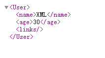 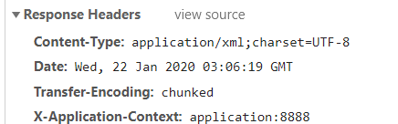

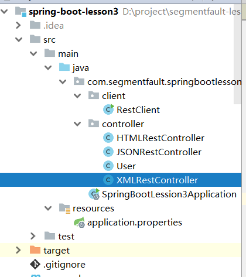

### html

- **直接返回静态页面最好**

- @ResponseBody直接输出String类的HTML页面，可以动态生成

  ```java
  //    @ResponseBody
  	public String html() {
  		return "<html><body>Hello,World</body></html>";
  	}
  ```

  

### resources文件夹

SpringBoot项目创建后,resources下默认有两个文件夹 static 和 templates.一般static存放静态资源，templates存放动态资源。在static文件夹下新建cc.html

- **resource/static**：浏览器输入localhost:8080/cc.html可以正常访问。通过接口访问，return cc.html。同样的操作在访问template下的html则找不到文件。
  - resources 和 static 的作用是一样的，因此不需要在 resources下再创建一个 resources，直接使用static就可以了,resources先于static。
  - 请求的时候不要带上**/static**，包括静态资源
- **templates**：浏览器不能访问，接口 return cc (需要引入**thymeleaf**)。但是会令上面两个文件夹的接口解释失败，只能通过浏览器访问。

```xml
            <dependency>
                <groupId>org.springframework.boot</groupId>
                <artifactId>spring-boot-starter-thymeleaf</artifactId>
            </dependency>
```

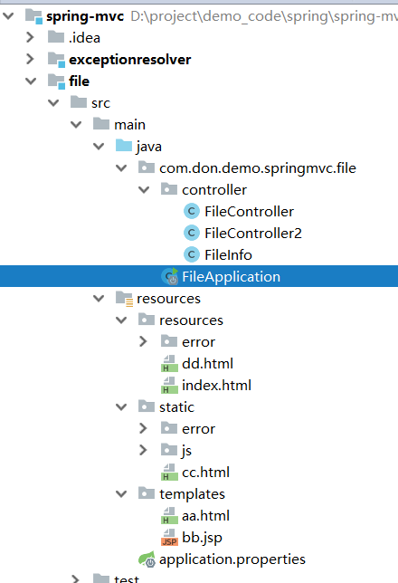 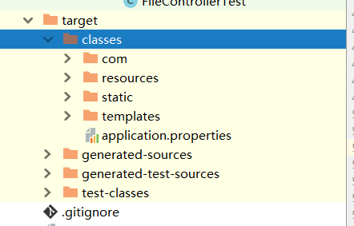

### 视图为bean

视图可以解析到bean中

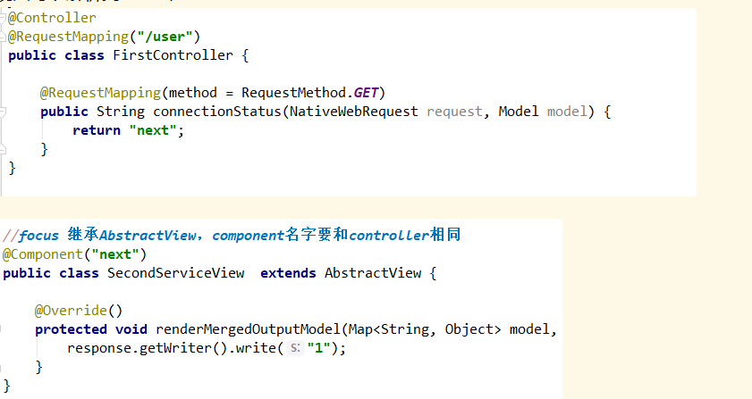

 

### 404

```java
//To avoid 404s 
@Bean
  ErrorViewResolver supportPathBasedLocationStrategyWithoutHashes() {
      return new ErrorViewResolver() {
          @Override
          public ModelAndView resolveErrorView(HttpServletRequest request, HttpStatus status, Map<String, Object> model) {
              return status == HttpStatus.NOT_FOUND
                      ?  new ModelAndView("index.html", Collections.<String, Object>emptyMap(), HttpStatus.OK)
                      : null;
          }
      };
  }
```


### 重定向

```
重定向("/session/invalid.html")和controller("/session/invalid")会冲突，报406，最好把controller删掉
```

## 异常处理

#### 默认机制

（当服务不存在）

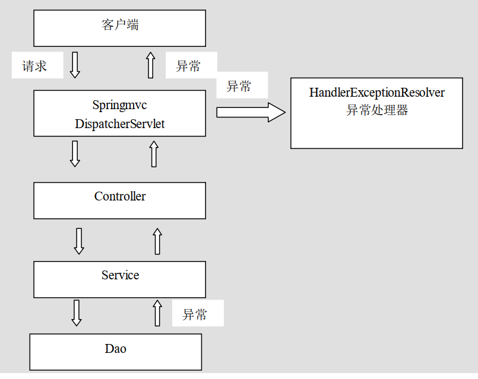

**以下是Spring Boot**

* **如果请求是浏览器发出的，那么返回的是html**

  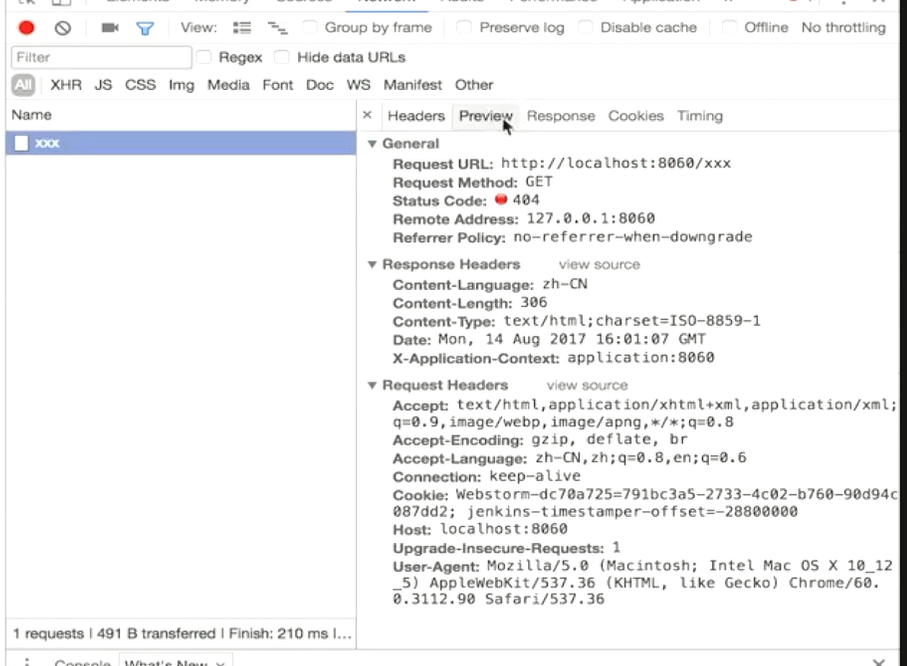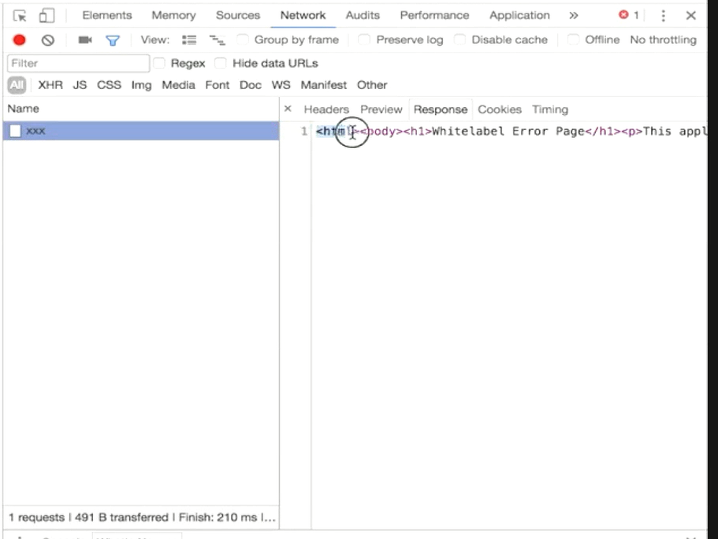

* **否则是json数据**

  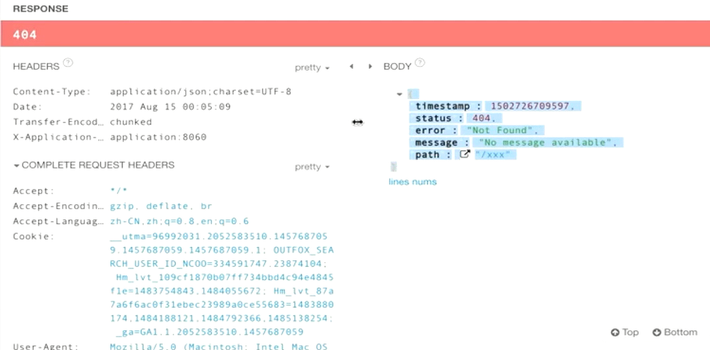

  

  

  - 源码解释

    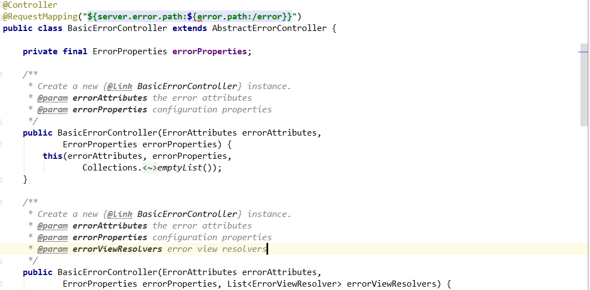

    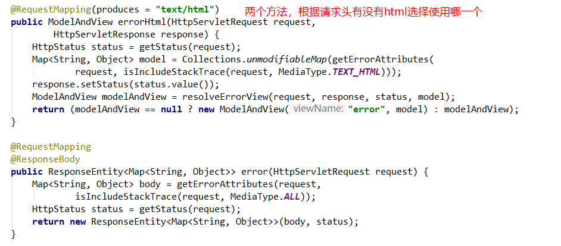

#### **自定义异常html页面**

异常还是由spring-boot内部处理，只是提供了一些默认的页面供其使用

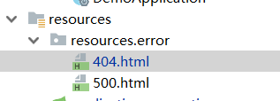

#### HandlerExceptionResolver处理异常

```java
/**
 * 异常处理器
 */
@Component("sysExceptionResolver")
public class SysExceptionResolver implements HandlerExceptionResolver {
	/**
	 * 处理异常业务逻辑
	 */
	public ModelAndView resolveException(HttpServletRequest request, HttpServletResponse response, Object handler, Exception ex) {
		// 获取到异常对象
		SysException e = null;
		if (ex instanceof SysException) {
			e = (SysException) ex;
		} else {
			e = new SysException("系统正在维护....");
		}
		// 创建ModelAndView对象
		ModelAndView mv = new ModelAndView();
		mv.addObject("errorMsg", e.getMessage());
		mv.setViewName("error");
		return mv;//todo 暂时还不知道怎么找到响应视图的位置
	}
}
```

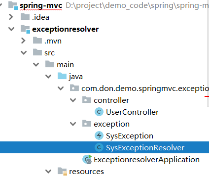

#### 增强控制器拦截异常

自己处理异常，不让内部处理，可以很灵活地处理异常

##### 自定义异常类

```java
@Data
public class CustomException extends RuntimeException {

	private ResultCode resultCode;

	public CustomException(ResultCode resultCode) {
		super("错误代码：" + resultCode.code() + "错误信息：" + resultCode.message());
		this.resultCode = resultCode;
	}
}
```

##### 在业务方法中自己抛出异常

```java
public class ExceptionCast {
	//使用此静态方法抛出自定义异常
	public static void cast(ResultCode resultCode) {
		throw new CustomException(resultCode);
	}
}
```

##### 增强控制器拦截自定义异常、服务器内部异常

```java
@ControllerAdvice//控制器增强
public class ExceptionCatch {
	private static final Logger LOGGER = LoggerFactory.getLogger(ExceptionCatch.class);

	//使用EXCEPTIONS存放异常类型和错误代码的映射，ImmutableMap的特点的一旦创建不可改变，并且线程安全
	private static ImmutableMap<Class<? extends Throwable>, ResultCode> EXCEPTIONS;
	//使用builder来构建一个异常类型和错误代码的异常
	protected static ImmutableMap.Builder<Class<? extends Throwable>, ResultCode> builder =
			ImmutableMap.builder();

	//捕获 CustomException异常,并且返回值必须是json
	@ExceptionHandler(CustomException.class)
	@ResponseBody
	// 内部服务器错误都会返回正确数据，所以没有http状态码
	// @ResponseStatus(HttpStatus.INTERNAL_SERVER_ERROR)
	public ResponseResult customException(CustomException e) {
		LOGGER.error("catch exception : {}\r\nexception: ", e.getMessage(), e);
		ResultCode resultCode = e.getResultCode();
		ResponseResult responseResult = new ResponseResult(resultCode);
		return responseResult;
	}

	//捕获Exception异常
	@ResponseBody
	@ExceptionHandler(Exception.class)
	//  @ResponseStatus(HttpStatus.INTERNAL_SERVER_ERROR)
	public ResponseResult exception(Exception e) {
		LOGGER.error("catch exception : {}\r\nexception: ", e.getMessage(), e);

		final ResultCode resultCode = EXCEPTIONS.get(e.getClass());
		final ResponseResult responseResult;
		if (resultCode != null) {
			responseResult = new ResponseResult(resultCode);
		} else {
			responseResult = new ResponseResult(CommonCode.SERVER_ERROR);
		}
		return responseResult;
	}

	static {
		//在这里加入一些基础的异常类型判断
		builder.put(HttpMessageNotReadableException.class, CommonCode.INVALID_PARAM);
	}

	public ExceptionCatch() {
		if (EXCEPTIONS == null)
			EXCEPTIONS = builder.build();
	}
}

```

##### 例子

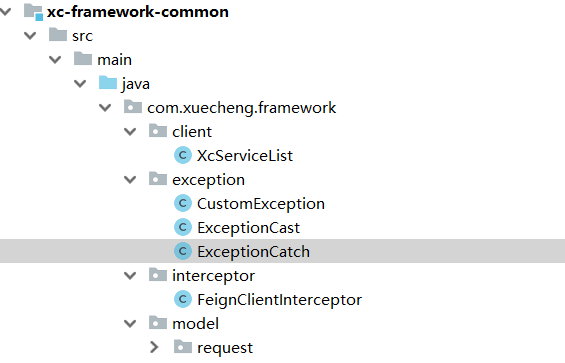

## 拦截体系

### 介绍

最外面就是tomcat，处理进来的url

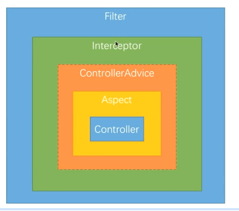


```java
//正常流的拦截日志
//Filter
2018-03-19 09:35:37.279  INFO 39197 --- [nio-8080-exec-2] com.imooc.web.filter.TimeFilter          : TimeFilter do start

    //interceptor
    2018-03-19 09:35:37.282  INFO 39197 --- [nio-8080-exec-2] c.immoc.web.interceptor.TimeInterceptor  : preHandle
    2018-03-19 09:35:37.282  INFO 39197 --- [nio-8080-exec-2] c.immoc.web.interceptor.TimeInterceptor  : com.imooc.web.controller.UserController$$EnhancerBySpringCGLIB$$40a99fc0    
    2018-03-19 09:35:37.282  INFO 39197 --- [nio-8080-exec-2] c.immoc.web.interceptor.TimeInterceptor  : getInfo
        
        //Aspect
        2018-03-19 09:35:37.282  INFO 39197 --- [nio-8080-exec-2] com.imooc.web.aspect.TimeAspect          : TimeAspect start
        2018-03-19 09:35:37.282  INFO 39197 --- [nio-8080-exec-2] com.imooc.web.aspect.TimeAspect          : args: {1}

			//controller
       		2018-03-19 09:35:37.282  INFO 39197 --- [nio-8080-exec-2] com.imooc.web.controller.UserController  : getInfo user_id = 1
                
        2018-03-19 09:35:37.282  INFO 39197 --- [nio-8080-exec-2] com.imooc.web.aspect.TimeAspect          : TimeAspect 耗时：0 毫秒
        2018-03-19 09:35:37.282  INFO 39197 --- [nio-8080-exec-2] com.imooc.web.aspect.TimeAspect          : TimeAspect end
        
    2018-03-19 09:35:37.283  INFO 39197 --- [nio-8080-exec-2] c.immoc.web.interceptor.TimeInterceptor  : postHandle
    2018-03-19 09:35:37.283  INFO 39197 --- [nio-8080-exec-2] c.immoc.web.interceptor.TimeInterceptor  : TimeInterceptor 耗时: 1 毫秒
        
    2018-03-19 09:35:37.283  INFO 39197 --- [nio-8080-exec-2] c.immoc.web.interceptor.TimeInterceptor  : afterCompletion
    2018-03-19 09:35:37.283  INFO 39197 --- [nio-8080-exec-2] c.immoc.web.interceptor.TimeInterceptor  : TimeInterceptor 耗时: 1 毫秒
    2018-03-19 09:35:37.283  INFO 39197 --- [nio-8080-exec-2] c.immoc.web.interceptor.TimeInterceptor  : ex is {}

2018-03-19 09:35:37.283  INFO 39197 --- [nio-8080-exec-2] com.imooc.web.filter.TimeFilter          : TimeFilter 耗时：4 毫秒
2018-03-19 09:35:37.283  INFO 39197 --- [nio-8080-exec-2] com.imooc.web.filter.TimeFilter          : TimeFilter do finish
```

### Filter

#### 介绍

过滤器，会拦截所有匹配的url，之前是xml设置。

> **缺陷**
>
> java2EE规范中的东西，无法知道哪个控制器处理，甚至不知道spring的存在
>
> **好处**
>
> 拿到原始的http请求和信息	

#### @Component 注册

```java
@Component
public class TimeFilter implements Filter {

    private static final Logger logger = LoggerFactory.getLogger(TimeFilter.class);

    @Override
    public void init(FilterConfig filterConfig) throws ServletException {
        logger.info("TimeFilter init");
    }

    @Override
    public void doFilter(ServletRequest request, ServletResponse response, FilterChain chain) throws IOException, ServletException {
        logger.info("TimeFilter do start");
        long start = System.currentTimeMillis();
        chain.doFilter(request, response);
        logger.info("TimeFilter 耗时：{} 毫秒", System.currentTimeMillis() - start);
        logger.info("TimeFilter do finish");
    }

    @Override
    public void destroy() {
        logger.info("TimeFilter destroy");
    }
}
```

#### Bean 注册

spring-boot提供的

```java
    @Bean
    public FilterRegistrationBean timefilter() {
        FilterRegistrationBean registrationBean = new FilterRegistrationBean();

        TimeFilter timeFilter = new TimeFilter();
        registrationBean.setFilter(timeFilter);

        List<String > urls = new ArrayList<>();
        urls.add("/*");
        registrationBean.setUrlPatterns(urls);

        return registrationBean;
    }
```

#### xml注册

> 未知

### Interceptor

#### 介绍

是 AOP 思想的具体应用  ，要求必须实现： HandlerInterceptor 接口  。

> 会拦截所有的handler（也就是所有的controller，不管是自己写的，还是spring内部自带的）。如果访问的是 jsp， html,css,image 或者 js 是不会进行拦截的。  
>
> **缺陷**
>
> handle只知道在bean类声明和方法声明，不知道具体的参数，参数是之后封装的，当然可以从request中获取，但是太麻烦了，
>
> **好处**
>
> 拿到原始的http请求和信息；和处理的方法的信息

- url存在，结合Filter，包围Intercepter

  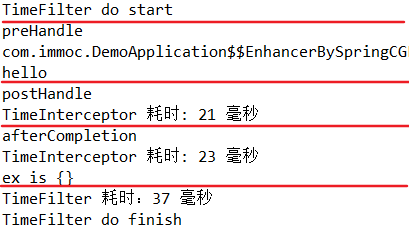

- url不存在，FIlter先结束

  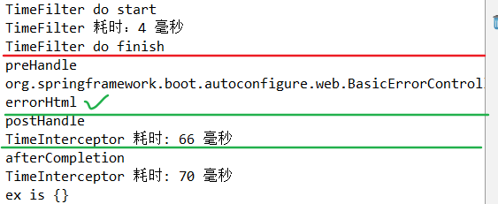

#### ano入门

如何配置，作用路径

```java
@Component
public class TimeInterceptor implements HandlerInterceptor {
    private static final Logger logger = LoggerFactory.getLogger(TimeInterceptor.class);

    /**
    * 如何调用： 按拦截器定义顺序调用
    * 何时调用：只要配置了都会调用
    * 有什么用：
    * 	如果程序员决定该拦截器对请求进行拦截处理后还要调用其他的拦截器，或者是业务处理器去进行处理，则返回 true。
    * 	如果程序员决定不需要再调用其他的组件去处理请求，则返回 false。
    */
    @Override
    public boolean preHandle(HttpServletRequest request, HttpServletResponse response, Object handler) throws Exception {
        logger.info("preHandle");
        request.setAttribute("startTime", System.currentTimeMillis());

        logger.info(((HandlerMethod) handler).getBean().getClass().getName());
        logger.info(((HandlerMethod) handler).getMethod().getName());

        return true;
    }

    /**
    * 如何调用： 按拦截器定义逆序调用
    * 何时调用： 在拦截器链内所有拦截器返成功调用
    * 有什么用：
    * 	在业务处理器处理完请求后，但是 DispatcherServlet 向客户端返回响应前被调用，
    * 	在该方法中对用户请求 request 进行处理。
    */
    @Override
    public void postHandle(HttpServletRequest request, HttpServletResponse response, Object handler, ModelAndView modelAndView) throws Exception {
        logger.info("postHandle");

        Long startTime = (Long) request.getAttribute("startTime");

        logger.info("TimeInterceptor 耗时: {} 毫秒", System.currentTimeMillis() - startTime);

    }

    /**
    * 如何调用： 按拦截器定义逆序调用
    * 何时调用： 只有 preHandle 返回 true 才调用
    * 有什么用：
    * 	在 DispatcherServlet 完全处理完请求后被调用，
    * 	可以在该方法中进行一些资源清理的操作。
    */
    @Override
    public void afterCompletion(HttpServletRequest request, HttpServletResponse response, Object handler, Exception ex) throws Exception {
        logger.info("afterCompletion");

        Long startTime = (Long) request.getAttribute("startTime");

        logger.info("TimeInterceptor 耗时: {} 毫秒", System.currentTimeMillis() - startTime);

        logger.info("ex is {}", ex);
    }
}
```

> 待解决：如果有多个拦截器，这时拦截器 1 的 preHandle 方法返回 true，但是拦截器 2 的 preHandle 方法返回 false，而此时拦截器 1 的 afterCompletion 方法是否执行？

#### xml配置

```xml
    <!--配置拦截器-->
    <mvc:interceptors>
        <!--配置拦截器-->
        <mvc:interceptor>
            <!--要拦截的具体的方法-->
            <mvc:mapping path="/user/*"/>
            <!--不要拦截的方法
            <mvc:exclude-mapping path=""/>
            -->
            <!--配置拦截器对象-->
            <bean class="cn.itcast.controller.cn.itcast.interceptor.MyInterceptor1" />
        </mvc:interceptor>

        <!--配置第二个拦截器-->
        <mvc:interceptor>
            <!--要拦截的具体的方法-->
            <mvc:mapping path="/**"/>
            <!--不要拦截的方法
            <mvc:exclude-mapping path=""/>
            -->
            <!--配置拦截器对象-->
            <bean class="cn.itcast.controller.cn.itcast.interceptor.MyInterceptor2" />
        </mvc:interceptor>
    </mvc:interceptors>
```

#### 连接器链

**执行顺序**


- **拦截器都返回true，都成功**

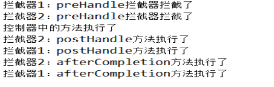

- **第二个拦截器返回false，中断**

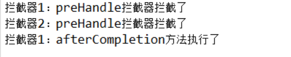

### Aspect

和spring的aop一样，不过在springboot中需要添加依赖

```xml
        <dependency>
            <groupId>org.springframework.boot</groupId>
            <artifactId>spring-boot-starter-aop</artifactId>
        </dependency>
```

```java
@Aspect
@Component
public class TimeAspect {

    private static final Logger logger = LoggerFactory.getLogger(TimeAspect.class);

    @Around("execution(* com.immoc.web.controller.UserController.*(..))")
    public Object handleControllerMethod(ProceedingJoinPoint pjp) throws Throwable {
        logger.info("TimeAspect start");

        logger.info("args: {}", ArrayUtils.toString(pjp.getArgs()));

        long start = System.currentTimeMillis();
        Object result = pjp.proceed();
        logger.info("TimeAspect 耗时：{} 毫秒", System.currentTimeMillis() - start);

        logger.info("TimeAspect end");

        return result;
    }

}
```


### 代码

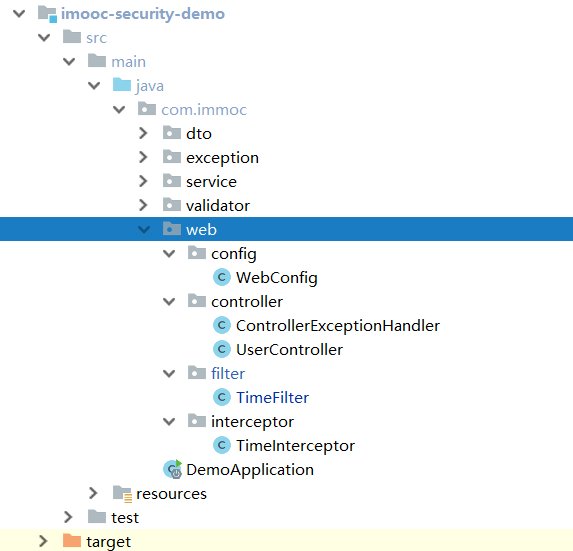

## 文件上传下载

### 原理

#### html如何写

```html
    <!-- 必须是post --> <!-- enctype 取值必须是： multipart/form-data (默认值是:application/x-www-form-urlencoded)   enctype:是表单请求正文的类型-->
	<form action="/user/fileupload1" method="post" enctype="multipart/form-data">
        选择文件：<input type="file" name="upload" /><br/> <!-- 提供一个文件选择域 -->
        <input type="submit" value="上传" />
    </form>
```

#### http请求体

当 form 表单的 enctype 取值不是默认值后， request.getParameter()将失效。`enctype=”application/x-www-form-urlencoded”`时， form 表单的正文内容是：`key=value&key=value&key=value`

当 form 表单的 enctype 取值为 `Mutilpart/form-data` 时，请求正文内容就变成：每一部分都是 MIME 类型描述的正文

```http
POST /file/absolute HTTP/1.1
Host: localhost:8080
Content-Type: multipart/form-data; boundary=----WebKitFormBoundary7MA4YWxkTrZu0gW
cache-control: no-cache
Postman-Token: 0442c94e-d2b6-4c14-b0cb-0bfac9c12146

Content-Disposition: form-data; name="multipartFile"; filename="C:\Users\TJR_S\Desktop\我的头像.jpg

------WebKitFormBoundary7MA4YWxkTrZu0gW--
```

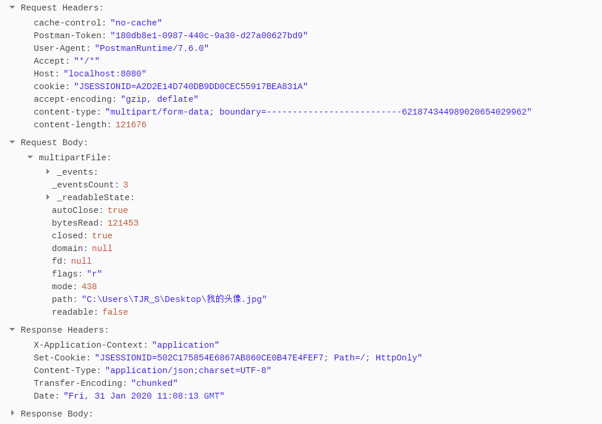

#### 借助第三方组件

使用 Commons-fileupload 组件实现文件上传，需要导入该组件相应的支撑 jar 包： Commons-fileupload 和commons-io。 commons-io 不属于文件上传组件的开发 jar 文件，但Commons-fileupload 组件从 1.1 版本开始，它工作时需要 commons-io 包的支持。  

### 传统方式

解释request,但是不成功，已经传上去了，应该是拿不到那个FileItem，解析有问题

### springMVC方式

#### 部署项目的绝对路径

```java
/**
 * File对象使用部署项目的绝对路径，因此绝对不会出错，在自己的电脑运行时，由于springBoot内置tomcat，因此每次的项目部署路径都不一样，和外置tomcat可以指定不一样
 * springBoot 项目路径类似：" C:\Users\TJR_S\AppData\Local\Temp\tomcat-docbase.6219784484981217917.8080\uploads "
 * 外置Tomcat的项目路径在 artifact哪里设置
 */
@RestController
@RequestMapping("/file/absolute")
public class FileController {

	private static final Logger logger = LoggerFactory.getLogger(FileController.class);

	private static final String FOLDER = "uploads/";

	@PostMapping
	public FileInfo upload(MultipartFile multipartFile, HttpServletRequest request) throws IOException {
		//使用项目的绝对路径
		// 上传的位置
		String path = request.getSession().getServletContext().getRealPath(FOLDER);//"/uploads/"和 "uploads/"没有区别
		// 判断，该路径是否存在
		File file = new File(path);
		if (!file.exists()) {
			// 创建该文件夹
			file.mkdirs();
		}

		logger.info(multipartFile.getName());//multipart form的参数名字
		logger.info(multipartFile.getOriginalFilename());//file name

		File localFile = new File(file, System.currentTimeMillis() + multipartFile.getOriginalFilename());

		multipartFile.transferTo(localFile);

		return new FileInfo(localFile.getPath());
	}

	//因为取文件的时候不能拿到文件后缀名（.txt被忽略），因此存文件的时候最好不要存后缀名（额外数据库存）；或者取文件的时候额外加一个参数：文件后缀名
	@GetMapping("/{filename}")
	public void download(@PathVariable String filename, HttpServletRequest request, HttpServletResponse response) {

		//部署项目的绝对路径
		String path = request.getSession().getServletContext().getRealPath(FOLDER);
		File file = new File(path + filename + ".jpg");//url会自动给删除后缀，因此需要自己添加文件后缀，
		logger.info(file.getAbsolutePath());

		try (InputStream inputStream = new FileInputStream(file);
		     ServletOutputStream outputStream = response.getOutputStream()) {

			response.setContentType("application/x-download");
			response.addHeader("Content-Disposition", "attachment;filename=" + file.getName());

			IOUtils.copy(inputStream, outputStream);
			outputStream.flush();

		} catch (Exception e) {
			logger.error(e.getMessage(), e);
		}
	}
}
```

#### 相对路径

> transferTo()有问题，需要把相对路径的File转换为绝对路径的File
>
> https://blog.csdn.net/daniel7443/article/details/51620308

```java
/**
 * File使用相对工作目录的路径,transferTo()，还是需要转换绝对路径，相对路径会出错，并且File需要区分根路径，有'/'和没有是不一样的
 */
@RestController
@RequestMapping("/file/relative")
public class FileController2 {

	private static final Logger logger = LoggerFactory.getLogger(FileController.class);

	private static final String FOLDER = "uploads/";

	{
		File file1 = new File("/uploads/"); // "/uploads/"使用盘符作根路径 	  D:\uploads
		File file = new File(FOLDER); 	// "uploads/"使用工作目录作根路径		D:\project\demo_code\spring\spring-mvc\uploads
		if (!file.exists()) {
			// 创建该文件夹
			file.mkdirs();
		}
	}

	@PostMapping
	public FileInfo upload(MultipartFile multipartFile) throws IOException {
		logger.info(multipartFile.getName());
		logger.info(multipartFile.getOriginalFilename());

		String filePath = String.format("%s%s%s", FOLDER, System.currentTimeMillis(), multipartFile.getOriginalFilename());

		//把相对路径转换成绝对路径，因为transferTo()源码问题
		String absolutePath = new File(filePath).getAbsolutePath();
		File localFile = new File(absolutePath);

		multipartFile.transferTo(localFile);

		return new FileInfo(localFile.getPath());
	}

	@GetMapping("/{id}")
	public void download(@PathVariable String id, HttpServletRequest request, HttpServletResponse response) {

		String filePath = String.format("%s%s.%s", FOLDER, id, "txt");
		File file = new File(filePath);
		logger.info(file.getAbsolutePath());

		//inputStream会精确读到相对路径，不会出现问题
		try (InputStream inputStream = new FileInputStream(file);
		     ServletOutputStream outputStream = response.getOutputStream()) {

			response.setContentType("application/x-download");
			response.addHeader("Content-Disposition", "attachment;filename=" + file.getName());

			IOUtils.copy(inputStream, outputStream);
			outputStream.flush();

		} catch (Exception e) {
			logger.error(e.getMessage(), e);
		}

	}

}
	//或者使用postman
	@Test
	public void whenUploadSuccess() throws Exception {
		MockHttpServletRequestBuilder request = fileUpload("/file")
				.file(new MockMultipartFile("multipartFile", "test.txt", "multipart/form-data", "hello upload".getBytes(Charset.forName("UTF-8"))));

		String result = mockMvc.perform(request)
				.andExpect(status().isOk())
				.andReturn().getResponse().getContentAsString();
		logger.info(result);
	}
```

#### 代码和路径

**springboot项目**

项目路径在temp文件夹下

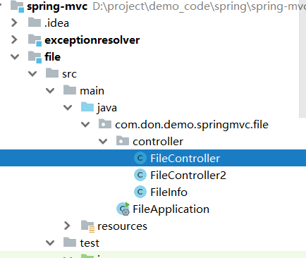

**外置tomcat的项目路径**

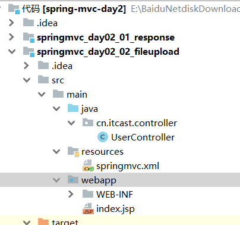 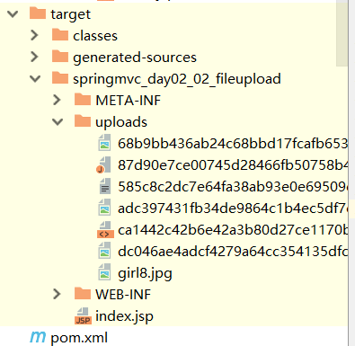

**mockmvc的根路径**

在main/webapp，会自动创建

**前端**

jsp，html，postman，mockmvc都可以

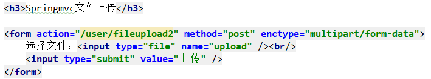 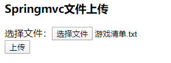

## mockmvc

模拟web请求

如何使用jsonPath 的路径  https://github.com/json-path/JsonPath 

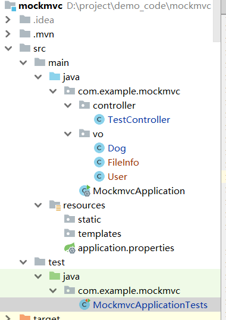

## 异步多线程

[使用DeferredResult异步处理SpringMVC请求](https://zhuanlan.zhihu.com/p/31223106)

看tomcat
 

> 

# SpringBoot

#### springBoot访问WEB-INF的jsp文件出错

```properties
#前缀 这个配置是没有意义的，因为WEB-INF是安全文件夹，需要其他一些配置才能访问，例如添加jar包（我还没找到）
spring.mvc.view.prefix=/WEB-INF/
#后缀 jsp模板视图的解析需要引入其他依赖，不然无法解析，只会下载文件
spring.mvc.view.suffix=.jsp
```

建议不要使用 `WEB-INF` 文件夹，改名字

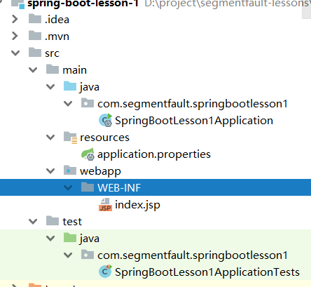

#### springboot配置视图路径

> 未验证

springboot项目默认将加载页面路径是classpath下面的templates和static文件，如果你需要将路径修改的化，可以通过如下配置修改页面加载路径

```java
@Configuration
public class FreemakerConfig extends WebMvcConfigurerAdapter{
      @Bean
        public ViewResolver viewResolver() {
            FreeMarkerViewResolver resolver = new FreeMarkerViewResolver();
            resolver.setCache(true);
            resolver.setSuffix(".ftl");
            resolver.setContentType("text/html; charset=UTF-8");
            return resolver;
        }
      
      @Bean
        public FreeMarkerConfigurer freemarkerConfig() throws IOException, TemplateException {
            FreeMarkerConfigurer configurer = new FreeMarkerConfigurer();
            configurer.setTemplateLoaderPath("/WEB-INF/views/");
            configurer.setTemplateLoaderPaths("/WEB-INF/views/","/WEB-INF/common/");//在configures.setTemplateLoaderPaths可以设置成多个路径，springboot项目会一次从这里面去找对应的页面

            configurer.setDefaultEncoding("UTF-8");
            return configurer;
        }

}
————————————————
版权声明：本文为CSDN博主「lj872224」的原创zz文章，遵循 CC 4.0 BY-SA 版权协议，转载请附上原文出处链接及本声明。
原文链接：https://blog.csdn.net/lj872224/article/details/81474640
```

#### 监控

配置文件

```properties
endpoints.enabled = true
endpoints.sensitive = false
```

