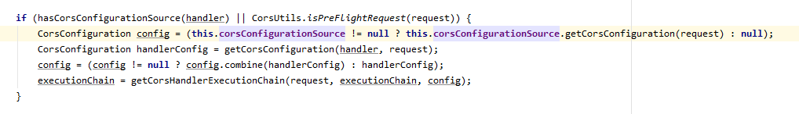

**从servlet的角度来看，不是spring-boot，spring-boot底层也是一样的。**

`DispatcherServlet`和 `ContextLoaderListener` 内部的初始化机制是差不多的，注入参数，初始化对应的ioc容器，有各自的配置文件，不仅仅可以用xml，可以配成无xml格式，自己看源码。

两者的区别在于`ContextLoaderListener`初始化的为root ioc容器，会在contextservlet的attribute中保存，这是他的主要职责，顶层容器公用。

`DispatcherServlet`初始化时会把root ioc作为父容器。起到一个分层加载（不同层的bean放在不同的容器中）的效果。其实直接用 `DispatcherServlet`加载全部也是可以的，这样root ioc容器就是null。然后`DispatcherServlet`会从自己的容器中找到自己需要的mvc组件，没有就使用默认的，完成`DispatcherServlet`的初始化。这样mvc和spring就结合了起来了。

> 总结mvc和spring的结合：tomcat初始化servlet，servlet组件中初始化容器，当初始化servlet时，从容器中找到自己需要的field，set 好 field，启动完成。过程会用到servlet规范提供的各种帮助，主要是参数的设置。
>
> 启动web服务器的时候，先用ioc构建中间层服务的容器，包括service层，dao层之类的，然后放在utizl中，当然是static。作为父容器。
> 然后各自的web框架通过util引入spring的ioc，获取该父容器。要适配肯定要经过一番改造。

spring mvc 流程 

### RequestMappingHandlerMapping初始化:

afterPropertiesSet

BuilderConfiguration

initHandlerMethods

RequestMappingInfo

registerHandlerMethod

### RequestMappingHandlerAdapter

```
initControllerAdviceCache
@ControllerAdvice
modelAttributeAdviceCache
initBinderAdviceCache
argumentResolvers
initBinderArgumentResolvers
returnValueHandlers
```


# 参考文献

https://fangshixiang.blog.csdn.net/category_7941357_4.html

[Spring MVC之RequestMappingHandlerAdapter调用解析处理方法详解](https://blog.csdn.net/qq_40718168/article/details/96991273#:~:text=%E6%80%BB%E7%9A%84%E6%9D%A5%E8%AE%B2%EF%BC%8CRequestMappingHandlerAdapter,%E9%80%9A%E8%BF%87View%E5%AF%B9%E8%B1%A1%E8%BF%9B%E8%A1%8C%E7%9A%84)

[SpringMVC源码学习笔记](https://blog.csdn.net/abap_brave/category_9277043.html)

[spring Web入门及源码学习](https://tianjunwei.blog.csdn.net/category_6348297.html)

https://mp.weixin.qq.com/mp/appmsgalbum?__biz=MzI1NDY0MTkzNQ==&action=getalbum&album_id=1762570575379513345&scene=173&from_msgid=2247492374&from_itemidx=1&count=3&nolastread=1#wechat_redirect

[Callable和DeferredResult实现服务器向客户端信息的推送](https://www.cnblogs.com/code-sayhi/articles/10191526.html)

[Spring 3.2矩阵变量是什么？ - 第1部分](https://blog.csdn.net/dnc8371/article/details/106704568)

[Method Arguments](https://docs.spring.io/spring-framework/reference/web/webmvc/mvc-controller/ann-methods/arguments.html)

[[原创]SpringMVC中@ModelAttribute用法小结](https://blog.csdn.net/u014645508/article/details/88871482)

[@ModelAttribute注解的使用](https://www.jianshu.com/p/0ec4e7afb7ed)

[@SessionAttributes 和 @SessionAttribute的区别](https://www.cnblogs.com/flydean/p/12680344.html)

  [我所理解的SpringMVC](https://zhuanlan.zhihu.com/p/88255639)

[Spring之SpringMVC的RequestToViewNameTranslator(源码)分析 ](https://www.cnblogs.com/zhangminghui/p/4957901.html)  

[getContextPath、getServletPath、getRequestURI的区别](https://www.cnblogs.com/yasepix/p/7442368.html)

[Spring5 里边的新玩法！这种 URL 请求让我涨见识了！](https://www.51cto.com/article/648729.html)

# @PathVariable

[@PathVariable性能损耗分析](https://www.cnblogs.com/aboruo/p/10575105.html)

[SpringMVC 性能优化（不使用@pathvariable注解）](https://blog.csdn.net/qq_35623773/article/details/103103050)

[@pathvarible性能差](https://www.google.com/search?q=%40pathvarible%E6%80%A7%E8%83%BD%E5%B7%AE&newwindow=1&rlz=1C1CHBD_enHK943HK944&sxsrf=ALiCzsaxehyOIMSCs2w1XKXhsnKu1G5C1g%3A1668572371711&ei=02R0Y7yIK53gkPIP_LuI6A8&ved=0ahUKEwj8vf277LH7AhUdMEQIHfwdAv0Q4dUDCBA&uact=5&oq=%40pathvarible%E6%80%A7%E8%83%BD%E5%B7%AE&gs_lcp=Cgxnd3Mtd2l6LXNlcnAQA0oECEEYAEoECEYYAFAAWABgvgRoAHAAeACAAfgBiAH4AZIBAzItMZgBAKABAcABAQ&sclient=gws-wiz-serp)

#  @MatrixVariable

[Spring 注解面面通 之 @MatrixVariable参数绑定源码解析](https://securitit.blog.csdn.net/article/details/110676001)

# 跨域

[为什么springmvc要提供跨域支持](https://www.google.com/search?q=%E4%B8%BA%E4%BB%80%E4%B9%88springmvc%E8%A6%81%E6%8F%90%E4%BE%9B%E8%B7%A8%E5%9F%9F%E6%94%AF%E6%8C%81&rlz=1C1CHBD_enHK943HK944&oq=%E4%B8%BA%E4%BB%80%E4%B9%88springmvc%E8%A6%81%E6%8F%90%E4%BE%9B%E8%B7%A8%E5%9F%9F%E6%94%AF%E6%8C%81&aqs=chrome..69i57j0i546.8377j0j7&sourceid=chrome&ie=UTF-8)

[学会Spring Mvc 跨域你只需要看完这一篇](https://cloud.tencent.com/developer/article/1549146)

  DelegatingWebMvcConfiguration



https://blog.csdn.net/idomyway/article/details/79572973 | 解决 js ajax跨域访问报“No 'Access-Control-Allow-Origin' header is present on the requested resource.”错误_idomyway的博客-CSDN博客
https://stackoverflow.com/questions/47390025/no-access-control-allow-origin-header-is-present-on-the-requested-resource-or | angularjs - No 'Access-Control-Allow-Origin' header is present on the requested resource. Origin 'localhost 'is therefore not allowed access - Stack Overflow
https://stackoverflow.com/questions/20035101/why-does-my-javascript-code-receive-a-no-access-control-allow-origin-header-i | jquery - Why does my JavaScript code receive a "No 'Access-Control-Allow-Origin' header is present on the requested resource" error, while Postman does not? - Stack Overflow
https://stackoverflow.com/questions/29524036/the-access-control-allow-origin-header-contains-multiple-values-but-on | asp.net - The 'Access-Control-Allow-Origin' header contains multiple values '*, *', but only one is allowed - Stack Overflow
https://blog.csdn.net/q646926099/article/details/79082204 | 跨域：The 'Access-Control-Allow-Origin' header contains multiple values '*, *', but only one is allowed_跨域 *.* but one_xiaoqiu_net的博客-CSDN博客

# 异步

https://blog.csdn.net/f641385712/article/details/88710676 | 【小家Spring】高性能关键技术之---体验Spring MVC的异步模式（ResponseBodyEmitter、SseEmitter、StreamingResponseBody） 高级使用篇_YourBatman的博客-CSDN博客
https://blog.csdn.net/f641385712/article/details/88692534 | 【小家Spring】高性能关键技术之---体验Spring MVC的异步模式（Callable、WebAsyncTask、DeferredResult） 基础使用篇_YourBatman的博客-CSDN博客

