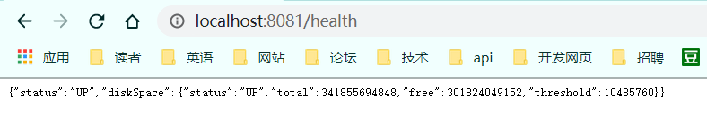

运维监控检测

```xml
<dependency>
   <groupId>org.springframework.boot</groupId>
   <artifactId>spring-boot-starter-actuator</artifactId>
</dependency>
```

配置文件

```properties
management.port = 8081
```

访问，还有很多url

