# 介绍

## 1.1  原有Spring优缺点分析

### 1.1.1 Spring的优点分析

Spring是Java企业版（Java Enterprise Edition，JEE，也称J2EE）的轻量级代替品。无需开发重量级的Enterprise JavaBean（EJB），Spring为企业级Java开发提供了一种相对简单的方法，通过依赖注入和面向切面编程，用简单的Java对象（Plain Old Java Object，POJO）实现了EJB的功能。

### 1.1.2 Spring的缺点分析

虽然Spring的组件代码是轻量级的，但它的配置却是重量级的。一开始，Spring用XML配置，而且是很多XML配置。Spring 2.5引入了基于注解的组件扫描，这消除了大量针对应用程序自身组件的显式XML配置。Spring 3.0引入了基于Java的配置，这是一种类型安全的可重构配置方式，可以代替XML。

所有这些配置都代表了开发时的损耗。因为在思考Spring特性配置和解决业务问题之间需要进行思维切换，所以编写配置挤占了编写应用程序逻辑的时间。和所有框架一样，Spring实用，但与此同时它要求的回报也不少。

除此之外，项目的依赖管理也是一件耗时耗力的事情。在环境搭建时，需要分析要导入哪些库的坐标，而且还需要分析导入与之有依赖关系的其他库的坐标，一旦选错了依赖的版本，随之而来的不兼容问题就会严重阻碍项目的开发进度。

## 1.2 SpringBoot的概述

### 1.2.1 SpringBoot解决上述Spring的缺点

SpringBoot对上述Spring的缺点进行的改善和优化，基于约定优于配置的思想，可以让开发人员不必在配置与逻辑业务之间进行思维的切换，全身心的投入到逻辑业务的代码编写中，从而大大提高了开发的效率，一定程度上缩短了项目周期。

### 1.2.2 SpringBoot的特点

- 为基于Spring的开发提供更快的入门体验
- 开箱即用，没有代码生成，也无需XML配置。同时也可以修改默认值来满足特定的需求
- 提供了一些大型项目中常见的非功能性特性，如嵌入式服务器、安全、指标，健康检测、外部配置等
- SpringBoot不是对Spring功能上的增强，而是提供了一种快速使用Spring的方式

### 1.2.3 SpringBoot的核心功能

- 起步依赖

  起步依赖本质上是一个Maven项目对象模型（Project Object Model，POM），定义了对其他库的传递依赖，这些东西加在一起即支持某项功能。

  简单的说，起步依赖就是将具备某种功能的坐标打包到一起，并提供一些默认的功能。

- 自动配置

  Spring Boot的自动配置是一个运行时（更准确地说，是应用程序启动时）的过程，考虑了众多因素，才决定Spring配置应该用哪个，不该用哪个。该过程是Spring自动完成的。

# 快速入门

## 代码实现

### 2.1.1 创建Maven工程

使用idea工具创建一个maven工程，该工程为普通的java工程即可


### 2.1.2 添加SpringBoot的起步依赖

SpringBoot要求，项目要继承SpringBoot的起步依赖spring-boot-starter-parent

```xml
<parent>
    <groupId>org.springframework.boot</groupId>
    <artifactId>spring-boot-starter-parent</artifactId>
    <version>2.0.1.RELEASE</version>
</parent>
```

SpringBoot要集成SpringMVC进行Controller的开发，所以项目要导入web的启动依赖

```xml
<dependencies>
    <dependency>
        <groupId>org.springframework.boot</groupId>
        <artifactId>spring-boot-starter-web</artifactId>
    </dependency>
</dependencies>
```


### 2.1.3 编写SpringBoot引导类

要通过SpringBoot提供的引导类起步SpringBoot才可以进行访问

```java
package com.itheima;

import org.springframework.boot.SpringApplication;
import org.springframework.boot.autoconfigure.SpringBootApplication;

@SpringBootApplication
public class MySpringBootApplication {

    public static void main(String[] args) {
        SpringApplication.run(MySpringBootApplication.class);
    }

}
```

### 2.1.4 编写Controller

在引导类MySpringBootApplication同级包或者子级包中创建QuickStartController

```java
package com.itheima.controller;

import org.springframework.stereotype.Controller;
import org.springframework.web.bind.annotation.RequestMapping;
import org.springframework.web.bind.annotation.ResponseBody;

@Controller
public class QuickStartController {
    
    @RequestMapping("/quick")
    @ResponseBody
    public String quick(){
        return "springboot 访问成功!";
    }
    
}
```

### 2.1.5 测试

执行SpringBoot起步类的主方法，控制台打印日志如下：

```properties
.   ____          _            __ _ _
 /\\ / ___'_ __ _ _(_)_ __  __ _ \ \ \ \
( ( )\___ | '_ | '_| | '_ \/ _` | \ \ \ \
 \\/  ___)| |_)| | | | | || (_| |  ) ) ) )
  '  |____| .__|_| |_|_| |_\__, | / / / /
 =========|_|==============|___/=/_/_/_/
 :: Spring Boot ::        (v2.0.1.RELEASE)

2018-05-08 14:29:59.714  INFO 5672 --- [           main] com.itheima.MySpringBootApplication      : Starting MySpringBootApplication on DESKTOP-RRUNFUH with PID 5672 (C:\Users\muzimoo\IdeaProjects\IdeaTest\springboot_quick\target\classes started by muzimoo in C:\Users\muzimoo\IdeaProjects\IdeaTest)
... ... ...
o.s.w.s.handler.SimpleUrlHandlerMapping  : Mapped URL path [/**] onto handler of type [class org.springframework.web.servlet.resource.ResourceHttpRequestHandler]
2018-05-08 14:30:03.126  INFO 5672 --- [           main] o.s.j.e.a.AnnotationMBeanExporter        : Registering beans for JMX exposure on startup
2018-05-08 14:30:03.196  INFO 5672 --- [           main] o.s.b.w.embedded.tomcat.TomcatWebServer  : Tomcat started on port(s): 8080 (http) with context path ''
2018-05-08 14:30:03.206  INFO 5672 --- [           main] com.itheima.MySpringBootApplication      : Started MySpringBootApplication in 4.252 seconds (JVM running for 5.583)
```

通过日志发现，Tomcat started on port(s): 8080 (http) with context path ''

tomcat已经起步，端口监听8080，web应用的虚拟工程名称为空

打开浏览器访问url地址为：http://localhost:8080/quick


## IDEA的Spring Initialize


通过idea快速创建的SpringBoot项目的pom.xml中已经导入了我们选择的web的起步依赖的坐标

```xml
<?xml version="1.0" encoding="UTF-8"?>
<project xmlns="http://maven.apache.org/POM/4.0.0" xmlns:xsi="http://www.w3.org/2001/XMLSchema-instance"
	xsi:schemaLocation="http://maven.apache.org/POM/4.0.0 http://maven.apache.org/xsd/maven-4.0.0.xsd">
	<modelVersion>4.0.0</modelVersion>

	<groupId>com.itheima</groupId>
	<artifactId>springboot_quick2</artifactId>
	<version>0.0.1-SNAPSHOT</version>
	<packaging>jar</packaging>

	<name>springboot_quick2</name>
	<description>Demo project for Spring Boot</description>

	<parent>
		<groupId>org.springframework.boot</groupId>
		<artifactId>spring-boot-starter-parent</artifactId>
		<version>2.0.1.RELEASE</version>
		<relativePath/> <!-- lookup parent from repository -->
	</parent>

	<properties>
		<project.build.sourceEncoding>UTF-8</project.build.sourceEncoding>
		<project.reporting.outputEncoding>UTF-8</project.reporting.outputEncoding>
		<java.version>9</java.version>
	</properties>

	<dependencies>
		<dependency>
			<groupId>org.springframework.boot</groupId>
			<artifactId>spring-boot-starter-web</artifactId>
		</dependency>

		<dependency>
			<groupId>org.springframework.boot</groupId>
			<artifactId>spring-boot-starter-test</artifactId>
			<scope>test</scope>
		</dependency>
	</dependencies>

	<build>
		<plugins>
			<plugin>
				<groupId>org.springframework.boot</groupId>
				<artifactId>spring-boot-maven-plugin</artifactId>
			</plugin>
		</plugins>
	</build>


</project>

```

可以使用快速入门的方式创建Controller进行访问，此处不再赘述


# 原理分析

## 3.1 起步依赖原理分析

 1. Starter没有具体的类，都是下面的结构，并且加一个pom

    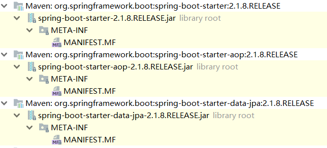

    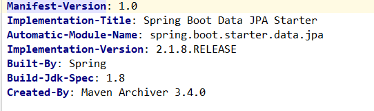

### 3.1.1 分析spring-boot-starter-parent 版本锁定

按住Ctrl点击pom.xml中的spring-boot-starter-parent，跳转到了spring-boot-starter-parent的pom.xml，xml配置如下（只摘抄了部分重点配置）：

```xml
<parent>
  <groupId>org.springframework.boot</groupId>
  <artifactId>spring-boot-dependencies</artifactId>
  <version>2.0.1.RELEASE</version>
  <relativePath>../../spring-boot-dependencies</relativePath>
</parent>
```

按住Ctrl点击pom.xml中的spring-boot-dependencies，跳转到了spring-boot-dependencies的pom.xml，xml配置如下（只摘抄了部分重点配置）：

```xml
<properties>
  	<activemq.version>5.15.3</activemq.version>
  	<antlr2.version>2.7.7</antlr2.version>
  	<appengine-sdk.version>1.9.63</appengine-sdk.version>
  	<artemis.version>2.4.0</artemis.version>
  	<aspectj.version>1.8.13</aspectj.version>
  	<assertj.version>3.9.1</assertj.version>
  	<atomikos.version>4.0.6</atomikos.version>
  	<bitronix.version>2.1.4</bitronix.version>
  	<build-helper-maven-plugin.version>3.0.0</build-helper-maven-plugin.version>
  	<byte-buddy.version>1.7.11</byte-buddy.version>
  	... ... ...
</properties>
<dependencyManagement>
  	<dependencies>
      	<dependency>
        	<groupId>org.springframework.boot</groupId>
        	<artifactId>spring-boot</artifactId>
        	<version>2.0.1.RELEASE</version>
      	</dependency>
      	<dependency>
        	<groupId>org.springframework.boot</groupId>
        	<artifactId>spring-boot-test</artifactId>
        	<version>2.0.1.RELEASE</version>
      	</dependency>
      	... ... ...
	</dependencies>
</dependencyManagement>
<build>
  	<pluginManagement>
    	<plugins>
      		<plugin>
        		<groupId>org.jetbrains.kotlin</groupId>
        		<artifactId>kotlin-maven-plugin</artifactId>
        		<version>${kotlin.version}</version>
      		</plugin>
      		<plugin>
        		<groupId>org.jooq</groupId>
        		<artifactId>jooq-codegen-maven</artifactId>
        		<version>${jooq.version}</version>
      		</plugin>
      		<plugin>
        		<groupId>org.springframework.boot</groupId>
        		<artifactId>spring-boot-maven-plugin</artifactId>
        		<version>2.0.1.RELEASE</version>
      		</plugin>
          	... ... ...
    	</plugins>
  	</pluginManagement>
</build>
```

从上面的spring-boot-dependencies的pom.xml中我们可以发现，一部分坐标的版本、依赖管理、插件管理已经定义好，所以我们的SpringBoot工程继承spring-boot-starter-parent后已经具备**版本锁定**等配置了。所以起**步依赖的作用就是进行依赖的传递。**

### 3.1.2 分析spring-boot-starter-web 依赖传递

按住Ctrl点击pom.xml中的spring-boot-starter-web，跳转到了spring-boot-starter-web的pom.xml，xml配置如下（只摘抄了部分重点配置）：

```xml
<?xml version="1.0" encoding="UTF-8"?>
<project xsi:schemaLocation="http://maven.apache.org/POM/4.0.0 http://maven.apache.org/xsd/maven-4.0.0.xsd" xmlns="http://maven.apache.org/POM/4.0.0"
    xmlns:xsi="http://www.w3.org/2001/XMLSchema-instance">
  	<modelVersion>4.0.0</modelVersion>
  	<parent>
    	<groupId>org.springframework.boot</groupId>
    	<artifactId>spring-boot-starters</artifactId>
    	<version>2.0.1.RELEASE</version>
  	</parent>
  	<groupId>org.springframework.boot</groupId>
  	<artifactId>spring-boot-starter-web</artifactId>
  	<version>2.0.1.RELEASE</version>
  	<name>Spring Boot Web Starter</name>
  
  	<dependencies>
    	<dependency>
      		<groupId>org.springframework.boot</groupId>
      		<artifactId>spring-boot-starter</artifactId>
      		<version>2.0.1.RELEASE</version>
      		<scope>compile</scope>
    	</dependency>
    	<dependency>
      		<groupId>org.springframework.boot</groupId>
      		<artifactId>spring-boot-starter-json</artifactId>
      		<version>2.0.1.RELEASE</version>
      		<scope>compile</scope>
    	</dependency>
    	<dependency>
      		<groupId>org.springframework.boot</groupId>
      		<artifactId>spring-boot-starter-tomcat</artifactId>
      		<version>2.0.1.RELEASE</version>
      		<scope>compile</scope>
    	</dependency>
    	<dependency>
      		<groupId>org.hibernate.validator</groupId>
      		<artifactId>hibernate-validator</artifactId>
      		<version>6.0.9.Final</version>
      		<scope>compile</scope>
    	</dependency>
    	<dependency>
      		<groupId>org.springframework</groupId>
      		<artifactId>spring-web</artifactId>
      		<version>5.0.5.RELEASE</version>
      		<scope>compile</scope>
    	</dependency>
    	<dependency>
      		<groupId>org.springframework</groupId>
      		<artifactId>spring-webmvc</artifactId>
      		<version>5.0.5.RELEASE</version>
      		<scope>compile</scope>
    	</dependency>
  	</dependencies>
</project>

```

从上面的spring-boot-starter-web的pom.xml中我们可以发现，spring-boot-starter-web就是将web开发要使用的spring-web、spring-webmvc等坐标进行了“打包”，这样我们的工程只要引入spring-boot-starter-web起步依赖的坐标就可以进行web开发了，同样体现了**依赖传递**的作用。


## 3.2 自动配置原理解析

按住Ctrl点击查看启动类MySpringBootApplication上的注解@SpringBootApplication

```java
@SpringBootApplication
public class MySpringBootApplication {
    public static void main(String[] args) {
        SpringApplication.run(MySpringBootApplication.class);
    }
}
```

注解@SpringBootApplication的源码

```java
@Target(ElementType.TYPE)
@Retention(RetentionPolicy.RUNTIME)
@Documented
@Inherited
@SpringBootConfiguration
@EnableAutoConfiguration
@ComponentScan(excludeFilters = {
		@Filter(type = FilterType.CUSTOM, classes = TypeExcludeFilter.class),
		@Filter(type = FilterType.CUSTOM, classes = AutoConfigurationExcludeFilter.class) })
public @interface SpringBootApplication {

	/**
	 * Exclude specific auto-configuration classes such that they will never be applied.
	 * @return the classes to exclude
	 */
	@AliasFor(annotation = EnableAutoConfiguration.class)
	Class<?>[] exclude() default {};

	... ... ...

}
```

其中，

@SpringBootConfiguration：等同与@Configuration，既标注该类是Spring的一个配置类

@EnableAutoConfiguration：SpringBoot自动配置功能开启

按住Ctrl点击查看注解@EnableAutoConfiguration

```java
@Target(ElementType.TYPE)
@Retention(RetentionPolicy.RUNTIME)
@Documented
@Inherited
@AutoConfigurationPackage
@Import(AutoConfigurationImportSelector.class)
public @interface EnableAutoConfiguration {
	... ... ...
}
```

其中，@Import(AutoConfigurationImportSelector.class) 导入了AutoConfigurationImportSelector类

按住Ctrl点击查看AutoConfigurationImportSelector源码

```java
public String[] selectImports(AnnotationMetadata annotationMetadata) {
        ... ... ...
        List<String> configurations = getCandidateConfigurations(annotationMetadata,
                                                                   attributes);
        configurations = removeDuplicates(configurations);
        Set<String> exclusions = getExclusions(annotationMetadata, attributes);
        checkExcludedClasses(configurations, exclusions);
        configurations.removeAll(exclusions);
        configurations = filter(configurations, autoConfigurationMetadata);
        fireAutoConfigurationImportEvents(configurations, exclusions);
        return StringUtils.toStringArray(configurations);
}


protected List<String> getCandidateConfigurations(AnnotationMetadata metadata,
			AnnotationAttributes attributes) {
		List<String> configurations = SpringFactoriesLoader.loadFactoryNames(
				getSpringFactoriesLoaderFactoryClass(), getBeanClassLoader());
		
		return configurations;
}

```

其中，SpringFactoriesLoader.loadFactoryNames 方法的作用就是从META-INF/spring.factories文件中读取指定类对应的类名称列表 


spring.factories 文件中有关自动配置的配置信息如下：

```
... ... ...

org.springframework.boot.autoconfigure.web.reactive.function.client.WebClientAutoConfiguration,\
org.springframework.boot.autoconfigure.web.servlet.DispatcherServletAutoConfiguration,\
org.springframework.boot.autoconfigure.web.servlet.ServletWebServerFactoryAutoConfiguration,\
org.springframework.boot.autoconfigure.web.servlet.error.ErrorMvcAutoConfiguration,\
org.springframework.boot.autoconfigure.web.servlet.HttpEncodingAutoConfiguration,\
org.springframework.boot.autoconfigure.web.servlet.MultipartAutoConfiguration,\

... ... ...
```

上面配置文件存在大量的以Configuration为结尾的类名称，这些类就是存有自动配置信息的类，而SpringApplication在获取这些类名后再加载

我们以ServletWebServerFactoryAutoConfiguration为例来分析源码：

```java
@Configuration
@AutoConfigureOrder(Ordered.HIGHEST_PRECEDENCE)
@ConditionalOnClass(ServletRequest.class)
@ConditionalOnWebApplication(type = Type.SERVLET)
@EnableConfigurationProperties(ServerProperties.class)
@Import({ ServletWebServerFactoryAutoConfiguration.BeanPostProcessorsRegistrar.class,
		ServletWebServerFactoryConfiguration.EmbeddedTomcat.class,
		ServletWebServerFactoryConfiguration.EmbeddedJetty.class,
		ServletWebServerFactoryConfiguration.EmbeddedUndertow.class })
public class ServletWebServerFactoryAutoConfiguration {
	... ... ...
}

```

其中，

@EnableConfigurationProperties(ServerProperties.class) 代表加载ServerProperties服务器配置属性类

进入ServerProperties.class源码如下：

```java
@ConfigurationProperties(prefix = "server", ignoreUnknownFields = true)
public class ServerProperties {

	/**
	 * Server HTTP port.
	 */
	private Integer port;

	/**
	 * Network address to which the server should bind.
	 */
	private InetAddress address;
  
  	... ... ...
  
}
```

其中，

prefix = "server" 表示SpringBoot配置文件中的前缀，SpringBoot会将配置文件中以server开始的属性映射到该类的字段中。映射关系如下：


## Tomcat配置

以前是xml，现在都配在bean里面了，例如下面，小马哥教的方法

```
org.springframework.boot.context.embedded.EmbeddedServletContainerCustomizer

org.springframework.boot.context.embedded.ConfigurableEmbeddedServletContainer
```


```java
    @Bean
    public static EmbeddedServletContainerCustomizer embeddedServletContainerCustomizer() {
        return new EmbeddedServletContainerCustomizer() {

            @Override
            public void customize(ConfigurableEmbeddedServletContainer container) {


                if (container instanceof TomcatEmbeddedServletContainerFactory) {
                    TomcatEmbeddedServletContainerFactory factory = TomcatEmbeddedServletContainerFactory.class.cast(container);

                    factory.addContextCustomizers(new TomcatContextCustomizer() {
                        @Override
                        public void customize(Context context) {

                            context.setPath("/spring-boot");
                        }
                    });

                    factory.addConnectorCustomizers(new TomcatConnectorCustomizer() {
                        @Override
                        public void customize(Connector connector) {
                            connector.setPort(8888);
                            connector.setProtocol(Http11Nio2Protocol.class.getName());
                        }
                    });
                }

            }
        };
    }
```

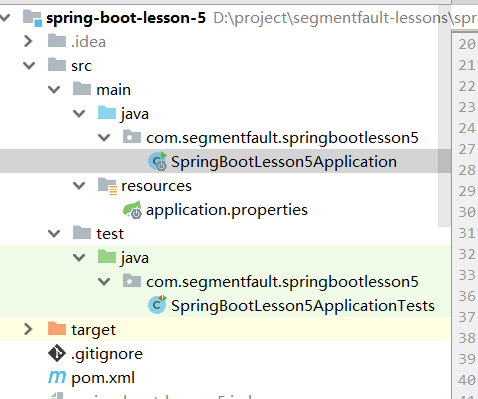

# 配置文件

##  application.yml

#### 4.1.2.1 yml配置文件简介

YML文件格式是YAML (YAML Aint Markup Language)编写的文件格式，YAML是一种直观的能够被电脑识别的的数据数据序列化格式，并且容易被人类阅读，容易和脚本语言交互的，可以被支持YAML库的不同的编程语言程序导入，比如： C/C++, Ruby, Python, Java, Perl, C#, PHP等。YML文件是以数据为核心的，比传统的xml方式更加简洁。

YML文件的扩展名可以使用.yml或者.yaml。

#### 4.1.2.2 yml配置文件的语法

##### 4.1.2.2.1 配置普通数据

- 语法： key: value

- 示例代码：

- ```yaml
  name: haohao
  ```

- 注意：value之前有一个空格

##### 4.1.2.2.2 配置对象数据

- 语法： 

  ​	key: 

  ​		key1: value1

  ​		key2: value2

  ​	或者：

  ​	key: {key1: value1,key2: value2}

- 示例代码：

- ```yaml
  person:
    name: haohao
    age: 31
    addr: beijing
  
  #或者
  
  person: {name: haohao,age: 31,addr: beijing}
  ```

- 注意：key1前面的空格个数不限定，在yml语法中，相同缩进代表同一个级别

##### 4.1.2.2.2 配置Map数据 

同上面的对象写法

##### 4.1.2.2.3 配置数组（List、Set）数据

- 语法： 

  ​	key: 

  ​		- value1

  ​		- value2

  或者：

  ​	key: [value1,value2]

- 示例代码：

- ```yaml
  city:
    - beijing
    - tianjin
    - shanghai
    - chongqing
    
  #或者
  
  city: [beijing,tianjin,shanghai,chongqing]
  
  #集合中的元素是对象形式
  student:
    - name: zhangsan
      age: 18
      score: 100
    - name: lisi
      age: 28
      score: 88
    - name: wangwu
      age: 38
      score: 90
  ```

- 注意：value1与之间的 - 之间存在一个空格

### 密码

**password：** 密码第一位是*，yml文件不支持。所以需要加单引号。同时如下，password是用char[]接收的，如果你的密码是纯数字也需要加单引号。

```yml
spring:
  data:
    mongodb:
      host: 127.0.0.1
      port: 27017
      database: mini
      option:
        max-connection-idle-time: 1500
        max-connection-per-host: 200
        max-wait-time: 60000
        max-connection-life-time: 0
        connect-timeout: 10000
        socket-timeout: 60000
      password: '*sxasasda'
      username: user

```


## Bootstrap、application

1. SpringBoot本身并不支持Bootstrap，看[here](https://cloud.spring.io/spring-cloud-commons/multi/multi__spring_cloud_context_application_context_services.html)，不会加载这个配置文件，Boostrap是用在spring-cloud中的，通常用于spring-config中的，并且早于application加载。

   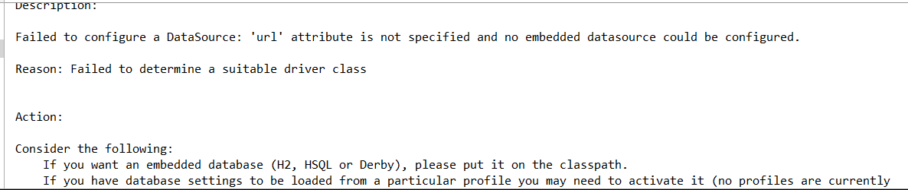


## 查询配置信息

上面提及过，SpringBoot的配置文件，主要的目的就是对配置信息进行修改的，但在配置时的key从哪里去查询呢？我们可以查阅SpringBoot的官方文档

文档URL：https://docs.spring.io/spring-boot/docs/2.0.1.RELEASE/reference/htmlsingle/#common-application-properties

常用的配置摘抄如下：

```properties
# QUARTZ SCHEDULER (QuartzProperties)
spring.quartz.jdbc.initialize-schema=embedded # Database schema initialization mode.
spring.quartz.jdbc.schema=classpath:org/quartz/impl/jdbcjobstore/tables_@@platform@@.sql # Path to the SQL file to use to initialize the database schema.
spring.quartz.job-store-type=memory # Quartz job store type.
spring.quartz.properties.*= # Additional Quartz Scheduler properties.

# ----------------------------------------
# WEB PROPERTIES
# ----------------------------------------

# EMBEDDED SERVER CONFIGURATION (ServerProperties)
server.port=8080 # Server HTTP port.
server.servlet.context-path= # Context path of the application.
server.servlet.path=/ # Path of the main dispatcher servlet.

# HTTP encoding (HttpEncodingProperties)
spring.http.encoding.charset=UTF-8 # Charset of HTTP requests and responses. Added to the "Content-Type" header if not set explicitly.

# JACKSON (JacksonProperties)
spring.jackson.date-format= # Date format string or a fully-qualified date format class name. For instance, `yyyy-MM-dd HH:mm:ss`.

# SPRING MVC (WebMvcProperties)
spring.mvc.servlet.load-on-startup=-1 # Load on startup priority of the dispatcher servlet.
spring.mvc.static-path-pattern=/** # Path pattern used for static resources.
spring.mvc.view.prefix= # Spring MVC view prefix.
spring.mvc.view.suffix= # Spring MVC view suffix.

# DATASOURCE (DataSourceAutoConfiguration & DataSourceProperties)
spring.datasource.driver-class-name= # Fully qualified name of the JDBC driver. Auto-detected based on the URL by default.
spring.datasource.password= # Login password of the database.
spring.datasource.url= # JDBC URL of the database.
spring.datasource.username= # Login username of the database.

# JEST (Elasticsearch HTTP client) (JestProperties)
spring.elasticsearch.jest.password= # Login password.
spring.elasticsearch.jest.proxy.host= # Proxy host the HTTP client should use.
spring.elasticsearch.jest.proxy.port= # Proxy port the HTTP client should use.
spring.elasticsearch.jest.read-timeout=3s # Read timeout.
spring.elasticsearch.jest.username= # Login username.

```

我们可以通过配置application.poperties 或者 application.yml 来修改SpringBoot的默认配置

例如：

application.properties文件

```properties
server.port=8888
server.servlet.context-path=demo
```

application.yml文件

```yaml
server:
  port: 8888
  servlet:
    context-path: /demo
```


##  配置文件与配置类的属性映射方式

### 4.2.1 使用注解@Value映射

我们可以通过@Value注解将配置文件中的值映射到一个Spring管理的Bean的字段上

例如：

application.properties配置如下：

```properties
person:
  name: zhangsan
  age: 18
```

或者，application.yml配置如下：

```yaml
person:
  name: zhangsan
  age: 18
```

实体Bean代码如下：

```java
@Controller
public class QuickStartController {

    @Value("${person.name}")
    private String name;
    @Value("${person.age}")
    private Integer age;


    @RequestMapping("/quick")
    @ResponseBody
    public String quick(){
        return "springboot 访问成功! name="+name+",age="+age;
    }

}
```

浏览器访问地址：http://localhost:8080/quick 结果如下：


### @ConfigurationProperties

通过注解@ConfigurationProperties(prefix="配置文件中的key的前缀")可以将配置文件中的配置自动与实体进行映射

application.properties配置如下：

```properties
person:
  name: zhangsan
  age: 18
```

或者，application.yml配置如下：

```yaml
person:
  name: zhangsan
  age: 18
```

实体Bean代码如下：

```java
@Controller
@ConfigurationProperties(prefix = "person")
public class QuickStartController {

    private String name;
    private Integer age;

    @RequestMapping("/quick")
    @ResponseBody
    public String quick(){
        return "springboot 访问成功! name="+name+",age="+age;
    }

    public void setName(String name) {
        this.name = name;
    }

    public void setAge(Integer age) {
        this.age = age;
    }
}
```

浏览器访

问地址：http://localhost:8080/quick 结果如下：


注意：使用@ConfigurationProperties方式可以进行配置文件与实体字段的自动映射，但需要字段必须提供set方法才可以，而使用@Value注解修饰的字段不需要提供set方法

## [spring.profiles.active来分区配置](https://www.cnblogs.com/anakin/p/8569827.html)

- **spring.profiles.active**

很多时候，我们项目在开发环境和生成环境的环境配置是不一样的，例如，数据库配置，在开发的时候，我们一般用测试数据库，而在生产环境的时候，我们是用正式的数据，这时候，我们可以利用profile在不同的环境下配置用不同的配置文件或者不同的配置

spring boot允许你通过命名约定按照一定的格式(application-{profile}.properties)来定义多个配置文件，然后通过在application.properyies通过spring.profiles.active来具体激活一个或者多个配置文件，如果没有没有指定任何profile的配置文件的话，spring boot默认会启动application-default.properties。

> profile的配置文件可以按照application.properyies的放置位置一样，放于以下四个位置，
>
> 1. 当前目录的 “/config”的子目录下
> 2. 当前目录下
> 3. classpath根目录的“/config”包下
> 4. classpath的根目录下

在这里我们就定义俩个profile文件，application-cus1.properties和application-cus2.properties，并在俩个文件中都分别写上变量cusvar=cus1和cusvar=cus2

我们在application.properyies也写上，并把profile切换到application-cus1.properties的配置文件

```properties
cusvar=cus3
spring.profiles.active=cus1
```

可以通过这样子来测试

```java
@RestController
@RequestMapping("/task")
public class TaskController {

    @RequestMapping(value = {"/",""})
    public String hellTask(@Value("${cusvar}")String cusvar ){

        return "hello task !! myage is " + cusvar;
    }

}
```

> 在这里可以看到spring.profiles.active激活的profile不同，打印出来的结果也不一样。会覆盖默认的属性

- @**Profile**

除了可以用profile的配置文件来分区配置我们的环境变量，在代码里，我们还可以直接用@Profile注解来进行配置，例如数据库配置，这里我们先定义一个接口

```java
public interface DBConnector {
    public void configure();    
}
```

分别定义俩个实现类来实现它

```java
/**
  * 测试数据库
  */
@Component
@Profile("testdb")
public class TestDBConnector implements DBConnector {

    @Override
    public void configure() {

        System.out.println("testdb");

    }
}

/**
 * 生产数据库
 */
@Component
@Profile("devdb")
public class DevDBConnector implements DBConnector {

    @Override
    public void configure() {

        System.out.println("devdb");

    }

}
```

通过在配置文件激活具体使用哪个实现类

```
spring.profiles.active=testdb
```

然后就可以这么用了

```java
@RestController
@RequestMapping("/task")
public class TaskController {

    @Autowired DBConnector connector ;

    @RequestMapping(value = {"/",""})
    public String hellTask(){

        connector.configure(); //最终打印testdb     
        return "hello task !! myage is " + myage;
    }

}
```

除了spring.profiles.active来激活一个或者多个profile之外，还可以用spring.profiles.include来叠加profile

```properties
spring.profiles: testdb
spring.profiles.include: proddb,prodmq
```

以上就是spring boot用profile的作用

## 通过命令行设置属性值

相信使用过一段时间Spring Boot的用户，一定知道这条命令：`java -jar xxx.jar --server.port=8888`，通过使用--server.port属性来设置xxx.jar应用的端口为8888。

在命令行运行时，连续的两个减号`--`就是对`application.properties`中的属性值进行赋值的标识。所以，`java -jar xxx.jar --server.port=8888`命令，等价于我们在`application.properties`中添加属性`server.port=8888`，该设置在样例工程中可见，读者可通过删除该值或使用命令行来设置该值来验证。

通过命令行来修改属性值固然提供了不错的便利性，但是通过命令行就能更改应用运行的参数，那岂不是很不安全？是的，所以Spring Boot也贴心的提供了屏蔽命令行访问属性的设置，只需要这句设置就能屏蔽：`SpringApplication.setAddCommandLineProperties(false)`。


# 项目部署路径

1. springboot的项目部署路径在temp路径下 **？不一定，存疑**

   类似  `C:\Users\TJR_S\AppData\Local\Temp\tomcat-docbase.6219784484981217917.8080\uploads`

   2. mockmvc的路径是在main/webapp下，会自动创建的。可以自己设置test 启动项的工作目录路径

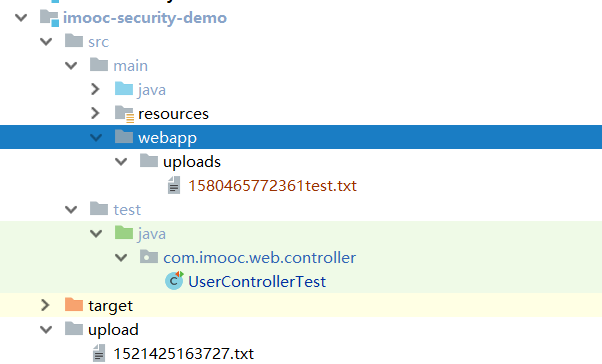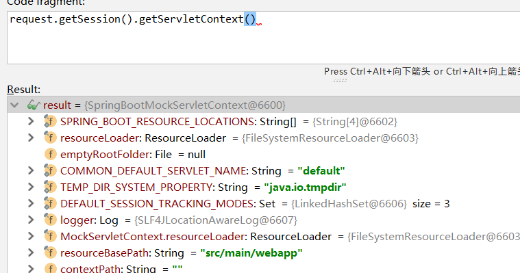

3. 工作目录 ：ar目录或者idea启动项设置的工作目录

# 打包运行

## 打成jar独立运行

```xml
<!--
springboot聚合工程要打包工程引用其他模块的jar包打包时报程序包找不到，原因是springboot工程打包编译时，会生成两种jar包，一种是普通的jar包，另一种时可执行jar包，默认情况下两个jar的名称相同，因此在不做额外配置的情况下，普通的jar先生成，可执行jar后生成，这种情况下可执行jar会覆盖普通jar，而我们要引用的就是普通jar，所以打包时会报错。 --> 
<!--    父pom依赖控制-->
    <build>
        <pluginManagement>
            <plugins>
                <plugin>
                    <groupId>org.springframework.boot</groupId>
                    <artifactId>spring-boot-maven-plugin</artifactId>
                    <configuration>
                        <classifier>runnable</classifier> <!--修改可运行spring-boot项目 jar包的名字-->
                    </configuration>
                </plugin>
            </plugins>
        </pluginManagement>
    </build>

    <!--子pom使用spring-boot打成可运行jar包-->
    <build>
        <plugins>
            <plugin>
                <groupId>org.springframework.boot</groupId>
                <artifactId>spring-boot-maven-plugin</artifactId>
            </plugin>
        </plugins>
    </build>
```

结果，生成两个jar包


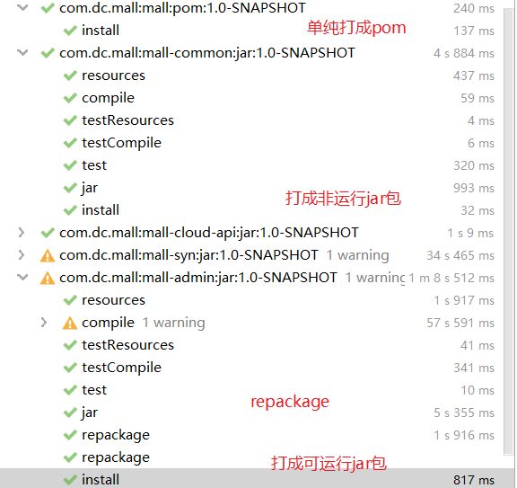

## 达成war部署在外部tomcat

https://blog.csdn.net/weixin_42237752/article/details/88770230

# 多环境部署

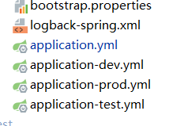

```bash
java -jar -Dspring.profiles.active=prod -Dfile.encoding=UTF-8  mall-crawl-2.1.3.RELEASE.jar #powerShell下需要添加""，这里还设定了文件编码
```

# 热部署

我们在开发中反复修改类、页面等资源，每次修改后都是需要重新启动才生效，这样每次启动都很麻烦，浪费了大量的时间，我们可以在修改代码后不重启就能生效，在 pom.xml 中添加如下配置就可以实现这样的功能，我们称之为热部署。

```xml
<!--热部署配置-->
<dependency>
    <groupId>org.springframework.boot</groupId>
    <artifactId>spring-boot-devtools</artifactId>
</dependency>
```

注意：IDEA进行SpringBoot热部署失败原因

出现这种情况，并不是热部署配置问题，其根本原因是因为Intellij IEDA默认情况下不会自动编译，需要对IDEA进行自动编译的设置，如下：


然后 Shift+Ctrl+Alt+/，选择Registry


# Mybatis

### 依赖

```xml
<!--mybatis起步依赖-->
<dependency>
    <groupId>org.mybatis.spring.boot</groupId>
    <artifactId>mybatis-spring-boot-starter</artifactId>
    <version>1.1.1</version>
</dependency>

<!-- MySQL连接驱动 -->
<dependency>
    <groupId>mysql</groupId>
    <artifactId>mysql-connector-java</artifactId>
</dependency>
```

### 配置数据源

```properties
#DB Configuration:
spring.datasource.driverClassName=com.mysql.jdbc.Driver
spring.datasource.url=jdbc:mysql://127.0.0.1:3306/test?useUnicode=true&characterEncoding=utf8
spring.datasource.username=root
spring.datasource.password=root
```

### 配置xml文件和其他mybatis配置

```yaml
#spring集成Mybatis环境
mybatis:
	type-aliases-package： com.itheima.domain  #pojo别名扫描包，没什么用
#    configLocation: classpath:/mybatis/mybatis-config.xml # 通常不用，类似mybatis原始的那种配置，外置配置文件
    configuration:
        default-enum-type-handler: org.apache.ibatis.type.EnumOrdinalTypeHandler  #处理枚举类如何对应
        map-underscore-to-camel-case: true
    mapper-locations: #数组
    	- classpath:mybatis/mapper/*.xml #找到xml的文件位置
    	- classpath:dao/*.xml #找到xml的文件位置
```

### 配置mapper客户端

@Mapper、@MapperScan扫描mapper类，自动生成代理对象，进入容器 

```java
//org.apache.ibatis.annotations.Mapper , mybatis自身的,扫描单个
@Mapper //标记该类是一个mybatis的mapper接口，可以被spring boot自动扫描到spring上下文中
public interface UserMapper {
	public List<User> queryUserList();
}

//org.mybatis.spring.annotation.MapperScan; mybatis spring给的，扫描包
@MapperScan({"com.dc.mall.mapper","com.dc.mall.dao"})
@Configuration
public class foo(){}
```

### SQL XML

在src\main\resources\mapper路径下加入UserMapper.xml配置文件"

```xml
<?xml version="1.0" encoding="utf-8" ?>
<!DOCTYPE mapper PUBLIC "-//mybatis.org//DTD Mapper 3.0//EN" "http://mybatis.org/dtd/mybatis-3-mapper.dtd" >
<mapper namespace="com.itheima.mapper.UserMapper">
    <select id="queryUserList" resultType="user">
        select * from user
    </select>
</mapper>
```

### SqlSessionTemplate

SpringBoot提供了一个简单的template供我们使用

```JAVA
@Autowired
private SqlSessionTemplate sqlSessionTemplate;

User user = sqlSessionTemplate.selectOne("com.segmentfault.springbootlesson7.mapper.UserMapper.selectOneUser", id);
```

# Junit

### 5.2.1 添加Junit的起步依赖

```xml
<!--测试的起步依赖-->
<dependency>
    <groupId>org.springframework.boot</groupId>
    <artifactId>spring-boot-starter-test</artifactId>
    <scope>test</scope>
</dependency>
```

### 5.2.2 编写测试类

```java
package com.itheima.test;

import com.itheima.MySpringBootApplication;
import com.itheima.domain.User;
import com.itheima.mapper.UserMapper;
import org.junit.Test;
import org.junit.runner.RunWith;
import org.springframework.beans.factory.annotation.Autowired;
import org.springframework.boot.test.context.SpringBootTest;
import org.springframework.test.context.junit4.SpringRunner;

import java.util.List;

@RunWith(SpringRunner.class)
@SpringBootTest(classes = MySpringBootApplication.class)
public class MapperTest {

    @Autowired
    private UserMapper userMapper;

    @Test
    public void test() {
        List<User> users = userMapper.queryUserList();
        System.out.println(users);
    }

}
```

其中，

SpringRunner继承自SpringJUnit4ClassRunner，使用哪一个Spring提供的测试测试引擎都可以

```java
public final class SpringRunner extends SpringJUnit4ClassRunner 
```

@SpringBootTest的属性指定的是引导类的字节码对象


### 5.2.3 控制台打印信息


# Spring Data JPA

### 依赖

```xml
<dependency>
    <groupId>org.springframework.boot</groupId>
    <artifactId>spring-boot-starter-data-jpa</artifactId>
</dependency>
<!-- MySQL连接驱动 -->
<dependency>
    <groupId>mysql</groupId>
    <artifactId>mysql-connector-java</artifactId>
</dependency>
```

### 配置

```yaml
spring:
    datasource:
        driverClassName: com.mysql.jdbc.Driver
        password: root
        url: jdbc:mysql://127.0.0.1:3306/test?useUnicode=true&characterEncoding=utf8
        username: root
    jpa:
        database: MySQL
        generate-ddl: true
        hibernate:
            ddl-auto: update
            naming_strategy: org.hibernate.cfg.ImprovedNamingStrategy
        show-sql: true
```

### 代码

```java
@Entity
public class User {
    // 主键
    @Id
    @GeneratedValue(strategy = GenerationType.IDENTITY)
    private Long id;
    // 用户名
    private String username;
    // 密码
    private String password;
    // 姓名
    private String name;
 
    //此处省略setter和getter方法... ...
}
```

```java
public interface UserRepository extends JpaRepository<User,Long>{
    public List<User> findAll();
}
```

### console


注意：如果是jdk9，执行报错如下：


原因：jdk缺少相应的jar

解决方案：手动导入对应的maven坐标，如下：

```xml
<!--jdk9需要导入如下坐标-->
<dependency>
    <groupId>javax.xml.bind</groupId>
    <artifactId>jaxb-api</artifactId>
    <version>2.3.0</version>
</dependency>
```


# Redis

### 5.4.1 添加redis的起步依赖

```xml
<!-- 配置使用redis启动器 -->
<dependency>
    <groupId>org.springframework.boot</groupId>
    <artifactId>spring-boot-starter-data-redis</artifactId>
</dependency>
```

### 5.4.2 配置redis的连接信息

```properties
#Redis
spring.redis.host=127.0.0.1
spring.redis.port=6379
```

### 5.4.3 注入RedisTemplate测试redis操作

```java
@RunWith(SpringRunner.class)
@SpringBootTest(classes = SpringbootJpaApplication.class)
public class RedisTest {

    @Autowired
    private UserRepository userRepository;

    @Autowired
    private RedisTemplate<String, String> redisTemplate;

    @Test
    public void test() throws JsonProcessingException {
        //从redis缓存中获得指定的数据
        String userListData = redisTemplate.boundValueOps("user.findAll").get();
        //如果redis中没有数据的话
        if(null==userListData){
            //查询数据库获得数据
            List<User> all = userRepository.findAll();
            //转换成json格式字符串
            ObjectMapper om = new ObjectMapper();
            userListData = om.writeValueAsString(all);
            //将数据存储到redis中，下次在查询直接从redis中获得数据，不用在查询数据库
            redisTemplate.boundValueOps("user.findAll").set(userListData);
            System.out.println("===============从数据库获得数据===============");
        }else{
            System.out.println("===============从redis缓存中获得数据===============");
        }

        System.out.println(userListData);

    }

}
```

# web相关

## 注册三大组件

### 原生注解

1. springboot开启Servlet 组件扫描

   ```java
   //指定包路径扫描
   String[] value() default {}
   String[] basePackages() default {}
   
   //指定类扫描
   Class<?>[] basePackageClasses() default {}
   
   ```

   ```java
   import org.springframework.boot.web.servlet.ServletComponentScan;
   @SpringBootApplication
   @ServletComponentScan(basePackages = {"com.segmentfault.segmentfaultlesson4.servlet"})
   public class SegmentfaultLesson4Application extends SpringBootServletInitializer {
   ```

2. 扩展对应的类，然后使用相应的注解，注解都是tomcat中的

   ```
   //以下是部分接口，还有其他
   org.springframework.web.filter.OncePerRequestFilter
   
   javax.servlet.http.HttpServlet
   org.springframework.web.servlet.FrameworkServlet
   
   javax.servlet.ServletContextListener
   javax.servlet.http.HttpSessionListener
   javax.servlet.http.HttpSessionActivationListener
   javax.servlet.ServletRequestListener
   javax.servlet.ServletContextAttributeListener
   javax.servlet.http.HttpSessionAttributeListener
   javax.servlet.http.HttpSessionBindingListener
   javax.servlet.ServletRequestAttributeListener
   ```

   **例子**

   ```java
   //先经过listener的前面在来filter
   @WebFilter(urlPatterns = "/myservlet")
   public class MyFilter extends OncePerRequestFilter {
   ```

   ```java
   //filter后进入servlet
   @WebServlet(
   		name = "myServlet",
   		urlPatterns = "/myservlet",
   		initParams = {
   				@WebInitParam(name = "myname", value = "myvalue")
   		}
   )
   public class MyServlet extends HttpServlet {
   ```

   ```java
   //going out of scope when it exits the last servlet or the first filter in the chain.
   @WebListener
   public class MyServletRequestListener implements ServletRequestListener {
   ```

### @Component

spring-mvc.md有介绍

### Spring Boot API方式注册

1. 实现上面所说的接口，

2. xxxRegistrationBean注册
3. @Bean工厂方式

```java
	@Bean//注册servlet
	public static ServletRegistrationBean servletRegistrationBean() {

		ServletRegistrationBean servletRegistrationBean = new ServletRegistrationBean();

		servletRegistrationBean.setServlet(new MyServlet2());
		servletRegistrationBean.setName("my-servlet2");
		servletRegistrationBean.addUrlMappings("/spring-boot/myservlet2");
		servletRegistrationBean.addInitParameter("myname", "myvalue");

		return servletRegistrationBean;

	}

	@Bean//注册filter
	public static FilterRegistrationBean filterRegistrationBean() {
		FilterRegistrationBean filterRegistrationBean = new FilterRegistrationBean();

		filterRegistrationBean.setFilter(new MyFilter2());
		filterRegistrationBean.addServletNames("my-servlet2");

		filterRegistrationBean.setDispatcherTypes(DispatcherType.REQUEST, DispatcherType.FORWARD, DispatcherType.INCLUDE);

		return filterRegistrationBean;

	}

	//重复注册，生成两个不同的listener，生效两次
	@Bean//注册listener
	public static ServletListenerRegistrationBean servletListenerRegistrationBean() {
		ServletListenerRegistrationBean servletListenerRegistrationBean = new ServletListenerRegistrationBean();
		servletListenerRegistrationBean.setListener(new MyServletRequestListener());
		return servletListenerRegistrationBean;
	}
```

**注意版本区别**

```
Spring Boot 1.4.0 开始支持
org.springframework.boot.web.servlet.xxxRegistrationBean
Spring Boot  1.4.0 之前
org.springframework.boot.context.embedded.xxxRegistrationBean
```

### 例子

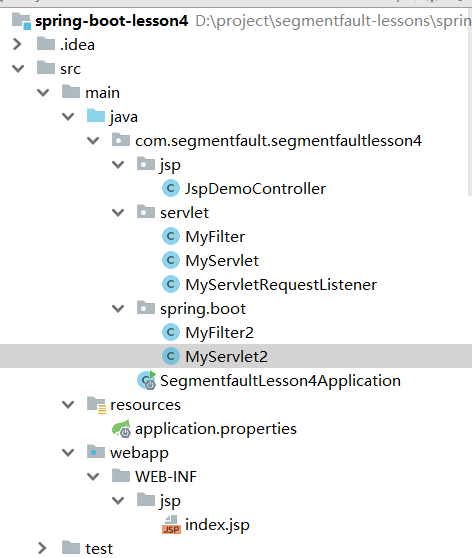

## 启动JSP模板

1. 引入依赖，激活 传统Servlet Web部署

   ```xml
           <dependency>
               <groupId>org.springframework.boot</groupId>
               <artifactId>spring-boot-starter-web</artifactId>
           </dependency>
   
           <!-- JSP 渲染引擎 -->
           <dependency>
               <groupId>org.apache.tomcat.embed</groupId>
               <artifactId>tomcat-embed-jasper</artifactId>
           </dependency>
   
           <!-- JSTL -->
           <dependency>
               <groupId>javax.servlet</groupId>
               <artifactId>jstl</artifactId>
           </dependency>
   ```

   ```java
   //Spring Boot 1.4.0 开始
   //SpringBoot启动类继承org.springframework.boot.web.support.SpringBootServletInitializer
   @SpringBootApplication
   public class SegmentfaultLesson4Application extends SpringBootServletInitializer {..}
   ```

2. 组装 org.springframework.boot.builder.SpringApplicationBuilder

   ```java
   // springBoot启动类 重写方法	protected SpringApplicationBuilder configure(SpringApplicationBuilder builder) {..}
   
   	protected SpringApplicationBuilder configure(SpringApplicationBuilder builder) {
   		builder.sources(SegmentfaultLesson4Application.class);
   		return builder;
   	}
   ```

3. 配置JSP视图、配置文件

   org.springframework.boot.autoconfigure.web.WebMvcProperties

   ```properties
   spring.mvc.view.prefix = /WEB-INF/jsp/
   spring.mvc.view.suffix = .jsp
   ```

   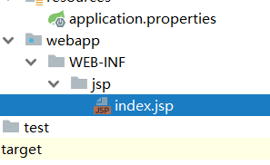

4. 看要不要转发 WEB-INF文件夹

   ```java
   //web-inf属于被保护的东西，因此需要转发，内部
   @Controller
   public class JspDemoController {
   
   	@RequestMapping("index")
   	public String index(Model model) {
   
   		model.addAttribute("message", "Mercy");
   
   		return "index";
   	}
   
   }
   ```

5. 例子

   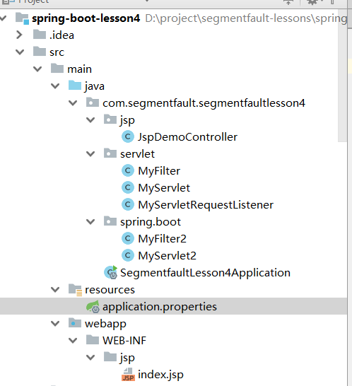

# log

- **开发环境**
  - JDK 8
  - Spring Boot 2.0.4 RELEASE
  - Maven
  - Windows 10
  - IDEA 2018.2
  
  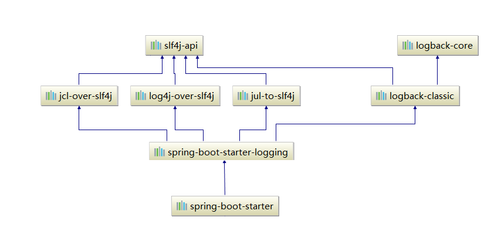

## logback

### 使用

Spring Boot默认集成了Logback，可以开箱即用，非常方便。因为spring-boot-starter-logging是Logback的日志实现，而Spring Boot启动项spring-boot-starter又依赖了spring-boot-starter-logging，所以Spring Boot就默认集成了Logback，包依赖如下图：

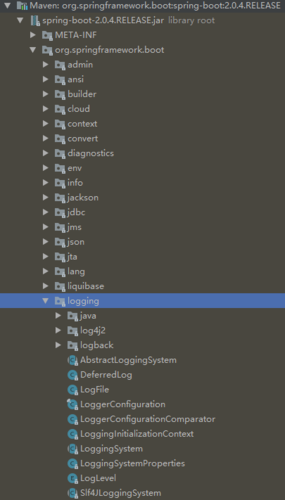

日志是默认控制台输出的，我们程序启动的时候就使用Logback，如下图所示：

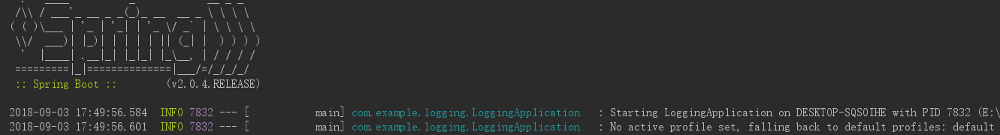

日志组成解读：

- 日期和时间：毫秒精度，易于排序
- 日志级别：trace、debug、info、warn、error（日志级别依次从低到高）
- 进程ID
- `---`分隔符
- 线程名称：括在方括号中(可以截断控制台输出)
- 记录器名称：这通常是源类名(通常缩写)
- 日志具体信息

### 配置

#### yaml配置

如果需要输出日志到文件，只需要设置：logging.file或logging.path，示例如下：

```yaml
debug: true
logging:
    level:
        root: info
    file: log/log.log    # 现在是工作目录路径，\log.log就是磁盘目录D
        max-history: 100 # 日志最大容量设置，默认10M超过则分割为多个文件。注意spring-boot版本
```

可以通过设置日志的级别，忽略更低级别的日志输出。

注意： logging.file和logging.path设置一个属性即可，如果两个都设置，则以logging.file为主，logging.path无效。

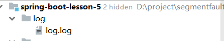

#### 自定义日志配置

日志服务在ApplicationContext创建前就初始化了，所以通过设置属性和传统的配置XML文件，可以对日志进行管理和控制。

只需要在src/main/resources下，创建好约定名称的XML文件，即可完成对日志系统的设置，不同的日志系统有不同的约定名称，如下列表：

[个性化配置](https://docs.spring.io/spring-boot/docs/current/reference/html/spring-boot-features.html#boot-features-logback-extensions)

| 日志    | 名称                                                         |
| ------- | ------------------------------------------------------------ |
| logback | logback-spring.xml, logback-spring.groovy, logback.xml, 或者 logback.groovy |
| log4j2  | log4j2-spring.xml 或者 log4j2.xml                            |

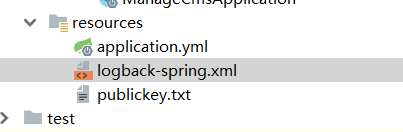

Spring Boot官方建议使用“-spring”的命名规则，进行日志配置，如：logback-spring.xml而不是logback.xml。

当然你也可以自定义日志名称，只需要在application.properties配置即可，代码如下：

```properties
logging.config=classpath:logging-config.xml
```


## log4j2

### 依赖

Spring Boot添加Log4j2依赖的同时，需要排除Logback依赖，配置pom.xml代码如下：

```xml
<dependencies>
		<dependency>
			<groupId>org.springframework.boot</groupId>
			<artifactId>spring-boot-starter-web</artifactId>
			<exclusions><!-- 去掉logback配置 -->
				<exclusion>
					<groupId>org.springframework.boot</groupId>
					<artifactId>spring-boot-starter-logging</artifactId>
				</exclusion>
			</exclusions>
		</dependency>
		
		<dependency> <!-- 引入log4j2依赖 -->
			<groupId>org.springframework.boot</groupId>
			<artifactId>spring-boot-starter-log4j2</artifactId>
		</dependency>
</dependencies>

```

### 配置

添加log4j2-spring.xml文件在src/main/resources文件下，配置文件代码如下：

```xml
<?xml version="1.0" encoding="UTF-8"?>
<configuration>
	<Appenders>
		<Console name="CONSOLE" target="SYSTEM_OUT">
			<PatternLayout charset="UTF-8" pattern="[%-5p] %d %c - %m%n" />
		</Console>

		<File name="File" fileName="D:\\mylog.log">
			<PatternLayout pattern="%m%n" />
		</File>
	</Appenders>

	<Loggers>
		<root level="info">
			<AppenderRef ref="CONSOLE" />
			<AppenderRef ref="File" />
		</root>
	</Loggers>
</configuration>
```

输入日志到控制台和D盘mylog.log文件中。

到此为止，已经完成了log4j2的集成，运行项目，查看日志。

## 参考

Logback：https://github.com/qos-ch/logback

log4j2：https://github.com/apache/logging-log4j2

http://blog.didispace.com/spring-boot-learning-1x/

# cache

## 进程内缓存

随着时间的积累，应用的使用用户不断增加，数据规模也越来越大，往往数据库查询操作会成为影响用户使用体验的瓶颈，此时使用缓存往往是解决这一问题非常好的手段之一。Spring 3开始提供了强大的基于注解的缓存支持，可以通过注解配置方式低侵入的给原有Spring应用增加缓存功能，提高数据访问性能。

在Spring Boot中对于缓存的支持，提供了一系列的自动化配置，使我们可以非常方便的使用缓存。下面我们通过一个简单的例子来展示，我们是如何给一个既有应用增加缓存功能的。

### 快速入门

#### 不使用缓存

为了更好的理解缓存，我们先对该工程做一些简单的改造。

- `application.properties`文件中新增`spring.jpa.properties.hibernate.show_sql=true`，开启hibernate对sql语句的打印
- 修改单元测试`ApplicationTests`，初始化插入User表一条用户名为AAA，年龄为10的数据。并通过findByName函数完成两次查询。

```java
@RunWith(SpringJUnit4ClassRunner.class)
@SpringApplicationConfiguration(Application.class)
public class ApplicationTests {

	@Autowired
	private UserRepository userRepository;

	@Before
	public void before() {
		userRepository.save(new User("AAA", 10));
	}

	@Test
	public void test() throws Exception {
		User u1 = userRepository.findByName("AAA");
		System.out.println("第一次查询：" + u1.getAge());

		User u2 = userRepository.findByName("AAA");
		System.out.println("第二次查询：" + u2.getAge());
	}

}
```

- 执行单元测试，我们可以在控制台中看到下面内容。

```sql
Hibernate: insert into user (age, name) values (?, ?)
Hibernate: select user0_.id as id1_0_, user0_.age as age2_0_, user0_.name as name3_0_ from user user0_ where user0_.name=?
第一次查询：10
Hibernate: select user0_.id as id1_0_, user0_.age as age2_0_, user0_.name as name3_0_ from user user0_ where user0_.name=?
第二次查询：10
```

在测试用例执行前，插入了一条User记录。然后每次findByName调用时，都执行了一句select语句来查询用户名为AAA的记录。

#### 引入缓存

- 在`pom.xml`中引入cache依赖，添加如下内容：

```xml
<dependency>
    <groupId>org.springframework.boot</groupId>
    <artifactId>spring-boot-starter-cache</artifactId>
</dependency>
```

- 在Spring Boot主类中增加`@EnableCaching`注解开启缓存功能，如下：

```java
@SpringBootApplication
@EnableCaching
public class Application {

	public static void main(String[] args) {
		SpringApplication.run(Application.class, args);
	}

}
```

- 在数据访问接口中，增加缓存配置注解，如：

```java
@CacheConfig(cacheNames = "users")
public interface UserRepository extends JpaRepository<User, Long> {
    @Cacheable
    User findByName(String name);
}
```

- 再来执行以下单元测试，可以在控制台中输出了下面的内容：

```xml
Hibernate: insert into user (age, name) values (?, ?)
Hibernate: select user0_.id as id1_0_, user0_.age as age2_0_, user0_.name as name3_0_ from user user0_ where user0_.name=?
第一次查询：10
第二次查询：10
```

到这里，我们可以看到，在调用第二次findByName函数时，没有再执行select语句，也就直接减少了一次数据库的读取操作。

为了可以更好的观察，缓存的存储，我们可以在单元测试中注入cacheManager。

```java
@Autowired
private CacheManager cacheManager;
```

使用debug模式运行单元测试，观察cacheManager中的缓存集users以及其中的User对象的缓存加深理解。

### 注解

#### @EnableCaching

开启缓存功能

#### @CacheConfig

- 主要用于配置该类中会用到的一些共用的缓存配置。在这里`@CacheConfig(cacheNames = "users")`：配置了该数据访问对象中返回的内容将存储于名为users的缓存对象中，我们也可以不使用该注解，直接通过`@Cacheable`自己配置缓存集的名字来定义。

#### @Cacheable

配置了findByName函数的返回值将被加入缓存。同时在查询时，会先从缓存中获取，若不存在才再发起对数据库的访问。该注解主要有下面几个参数：

- **value、cacheNames**

  两个等同的参数（cacheNames为Spring 4新增，作为value的别名），用于指定缓存存储的集合名。由于Spring 4中新增了`@CacheConfig`，因此在Spring 3中原本必须有的value属性，也成为非必需项了

- **key**

  缓存对象存储在Map集合中的key值，非必需，缺省按照函数的所有参数组合作为key值，若自己配置需使用SpEL表达式，比如：`@Cacheable(key = "#p0")`：使用函数第一个参数作为缓存的key值，更多关于SpEL表达式的详细内容可参考[官方文档](http://docs.spring.io/spring/docs/current/spring-framework-reference/html/cache.html#cache-spel-context)

- **condition**

  缓存对象的条件，非必需，也需使用SpEL表达式，只有满足表达式条件的内容才会被缓存，比如：`@Cacheable(key = "#p0", condition = "#p0.length() < 3")`，表示只有当第一个参数的长度小于3的时候才会被缓存，若做此配置上面的AAA用户就不会被缓存，读者可自行实验尝试。

- **unless**

  另外一个缓存条件参数，非必需，需使用SpEL表达式。它不同于condition参数的地方在于它的判断时机，该条件是在函数被调用之后才做判断的，所以它可以通过对result进行判断。

- **keyGenerator**：

  用于指定key生成器，非必需。若需要指定一个自定义的key生成器，我们需要去实现`org.springframework.cache.interceptor.KeyGenerator`接口，并使用该参数来指定。需要注意的是：**该参数与key是互斥的**

- **cacheManager**

  用于指定使用哪个缓存管理器，非必需。只有当有多个时才需要使用

- **cacheResolver**

  用于指定使用那个缓存解析器，非必需。需通过`org.springframework.cache.interceptor.CacheResolver`接口来实现自己的缓存解析器，并用该参数指定。

#### @CachePut

配置于函数上，能够根据参数定义条件来进行缓存，它与`@Cacheable`不同的是，它每次都会真是调用函数，所以主要用于数据新增和修改操作上。它的参数与`@Cacheable`类似，具体功能可参考上面对`@Cacheable`参数的解析

#### @CacheEvict

配置于函数上，通常用在删除方法上，用来从缓存中移除相应数据。除了同@Cacheable一样的参数之外，它还有下面两个参数：

- allEntries

  非必需，默认为false。当为true时，会移除所有数据

- beforeInvocation

  非必需，默认为false，会在调用方法之后移除数据。当为true时，会在调用方法之前移除数据。

#### @Caching

### 配置

在Spring Boot中通过`@EnableCaching`注解自动化配置合适的缓存管理器（CacheManager），Spring Boot根据下面的顺序去侦测缓存提供者：

- Generic
- JCache (JSR-107)
- EhCache 2.x
- Hazelcast
- Infinispan
- Redis
- Guava
- Simple

除了按顺序侦测外，我们也可以通过配置属性`spring.cache.type`来强制指定。我们可以通过debug调试查看cacheManager对象的实例来判断当前使用了什么缓存。

本文中不对所有的缓存做详细介绍，下面以常用的EhCache为例，看看如何配置来使用EhCache进行缓存管理。

在Spring Boot中开启EhCache非常简单，只需要在工程中加入`ehcache.xml`配置文件并在pom.xml中增加ehcache依赖，框架只要发现该文件，就会创建EhCache的缓存管理器。

- 在`src/main/resources`目录下创建：`ehcache.xml`

```xml
<ehcache xmlns:xsi="http://www.w3.org/2001/XMLSchema-instance"
         xsi:noNamespaceSchemaLocation="ehcache.xsd">
    <cache name="users"
           maxEntriesLocalHeap="200"
           timeToLiveSeconds="600">
    </cache>
</ehcache>
```

- 在pom.xml中加入

```xml
<dependency>
    <groupId>net.sf.ehcache</groupId>
    <artifactId>ehcache</artifactId>
</dependency>
```

完成上面的配置之后，再通过debug模式运行单元测试，观察此时CacheManager已经是EhCacheManager实例，说明EhCache开启成功了。

对于EhCache的配置文件也可以通过`application.properties`文件中使用`spring.cache.ehcache.config`属性来指定，比如：

```
spring.cache.ehcache.config=classpath:config/another-config.xml
```

#### 代码示例

本文的相关例子可以查看下面仓库中的`chapter4-4-1`目录：

## 集中式缓存Redis

### 介绍

虽然EhCache已经能够适用很多应用场景，但是由于EhCache是进程内的缓存框架，在集群模式下时，各应用服务器之间的缓存都是独立的，因此在不同服务器的进程间会存在缓存不一致的情况。即使EhCache提供了集群环境下的缓存同步策略，但是同步依然需要一定的时间，短暂的缓存不一致依然存在。

在一些要求高一致性（任何数据变化都能及时的被查询到）的系统和应用中，就不能再使用EhCache来解决了，这个时候使用集中式缓存是个不错的选择，因此本文将介绍如何在Spring Boot的缓存支持中使用Redis进行数据缓存。

下面以上一篇的例子作为基础进行改造，将缓存内容迁移到redis中。

### 准备工作

可以下载案例[Chapter4-4-1](http://git.oschina.net/didispace/SpringBoot-Learning)，进行下面改造步骤。

先来回顾一下在此案例中，我们做了什么内容：

- 引入了spring-data-jpa和EhCache
- 定义了User实体，包含id、name、age字段
- 使用spring-data-jpa实现了对User对象的数据访问接口UserRepository
- 使用Cache相关注解配置了缓存
- 单元测试，通过连续的查询和更新数据后的查询来验证缓存是否生效

### 开始改造

- 删除EhCache的配置文件`src/main/resources/ehcache.xml`
- pom.xml中删除EhCache的依赖，增加redis的依赖：

```xml
<dependency>
    <groupId>org.springframework.boot</groupId>
    <artifactId>spring-boot-starter-redis</artifactId>
</dependency>
```

- `application.properties`中增加redis配置，以本地运行为例，比如：

```properties
spring.redis.host=localhost
spring.redis.port=6379
spring.redis.pool.max-idle=8
spring.redis.pool.min-idle=0
spring.redis.pool.max-active=8
spring.redis.pool.max-wait=-1
```

我们需要做的配置到这里就已经完成了，Spring Boot会在侦测到存在Redis的依赖并且Redis的配置是可用的情况下，使用`RedisCacheManager`初始化`CacheManager`。

为此，我们可以单步运行我们的单元测试，可以观察到此时`CacheManager`的实例是`org.springframework.data.redis.cache.RedisCacheManager`，并获得下面的执行结果：

```
Hibernate: insert into user (age, name) values (?, ?)
Hibernate: select user0_.id as id1_0_, user0_.age as age2_0_, user0_.name as name3_0_ from user user0_ where user0_.name=?
第一次查询：10
第二次查询：10
Hibernate: select user0_.id as id1_0_0_, user0_.age as age2_0_0_, user0_.name as name3_0_0_ from user user0_ where user0_.id=?
Hibernate: update user set age=?, name=? where id=?
第三次查询：10
```

可以观察到，在第一次查询的时候，执行了select语句；第二次查询没有执行select语句，说明是从缓存中获得了结果；而第三次查询，我们获得了一个错误的结果，根据我们的测试逻辑，在查询之前我们已经将age更新为20，但是我们从缓存中获取到的age还是为10。

### 问题思考

为什么同样的逻辑在EhCache中没有问题，但是到Redis中会出现这个问题呢？

在EhCache缓存时没有问题，主要是由于EhCache是进程内的缓存框架，第一次通过select查询出的结果被加入到EhCache缓存中，第二次查询从EhCache取出的对象与第一次查询对象实际上是同一个对象（可以在使用Chapter4-4-1工程中，观察u1==u2来看看是否是同一个对象），因此我们在更新age的时候，实际已经更新了EhCache中的缓存对象。

而Redis的缓存独立存在于我们的Spring应用之外，我们对数据库中数据做了更新操作之后，没有通知Redis去更新相应的内容，因此我们取到了缓存中未修改的数据，导致了数据库与缓存中数据的不一致。

**因此我们在使用缓存的时候，要注意缓存的生命周期，利用好上一篇上提到的几个注解来做好缓存的更新、删除**

### 进一步修改

针对上面的问题，我们只需要在更新age的时候，通过`@CachePut`来让数据更新操作同步到缓存中，就像下面这样：

```java
@CacheConfig(cacheNames = "users")
public interface UserRepository extends JpaRepository<User, Long> {

    @Cacheable(key = "#p0")
    User findByName(String name);

    @CachePut(key = "#p0.name")
    User save(User user);

}
```

在redis-cli中flushdb，清空一下之前的缓存内容，再执行单元测试，可以获得下面的结果：

```
Hibernate: insert into user (age, name) values (?, ?)
第一次查询：10
第二次查询：10
Hibernate: select user0_.id as id1_0_0_, user0_.age as age2_0_0_, user0_.name as name3_0_0_ from user user0_ where user0_.id=?
Hibernate: update user set age=?, name=? where id=?
第三次查询：20
```

可以看到，我们的第三次查询获得了正确的结果！同时，我们的第一次查询也不是通过select查询获得的，因为在初始化数据的时候，调用save方法时，就已经将这条数据加入了redis缓存中，因此后续的查询就直接从redis中获取了。

本文内容到此为止，主要介绍了为什么要使用Redis做缓存，以及如何在Spring Boot中使用Redis做缓存，并且通过一个小问题来帮助大家理解缓存机制，在使用过程中，一定要注意缓存生命周期的控制，防止数据不一致的情况出现。

# spring-actuator

运维监控检测

```xml
<dependency>
   <groupId>org.springframework.boot</groupId>
   <artifactId>spring-boot-starter-actuator</artifactId>
</dependency>
```

配置文件

```properties
management.port = 8081
```

访问，还有很多url


# schedule

实现定时任务的方案

1. 使用 JDK 的Timer和TimerTask实现
   可以实现简单的间隔执行任务，无法实现按日历去调度执行任务。
2. 使用Quartz实现
   Quartz 是一个异步任务调度框架，功能丰富，可以实现按日历调度。
3. 使用Spring Task实现
   Spring 3.0后提供Spring Task实现任务调度，支持按日历调度，相比Quartz功能稍简单，但是在开发基本够用，支持注解编程方式

## 快速入门

### 单线程串行化执行，同步

```java
@EnableScheduling
//启动类或者配置类加上该注解开启
```

```java
@Component
public class SerializedTask {
    private static final Logger LOGGER = LoggerFactory.getLogger(SerializedTask.class);


//    定义任务调试策略
    @Scheduled(initialDelay = 3000, fixedRate = 5000) //第一次延迟3秒，以后每隔5秒执行一次
//    @Scheduled(cron = "0/3 * * * * *")//每隔3秒去执行
//    @Scheduled(fixedRate = 3000) //在任务开始后3秒执行下一次调度
//    @Scheduled(fixedDelay = 3000) //在任务结束后3秒后才开始执行
    public void task1() {
        LOGGER.info("===============测试定时任务1开始===============");
        try {
            Thread.sleep(5000);
        } catch (InterruptedException e) {
            e.printStackTrace();
        }
        LOGGER.info("===============测试定时任务1结束===============");

    }

//    定义任务调试策略
    @Scheduled(cron = "0/3 * * * * *")//每隔3秒去执行
//    @Scheduled(fixedRate = 3000) //在任务开始后3秒执行下一次调度
//    @Scheduled(fixedDelay = 3000) //在任务结束后3秒后才开始执行
    public void task2() {
        LOGGER.info("===============测试定时任务2开始===============");
        try {
            Thread.sleep(5000);
        } catch (InterruptedException e) {
            e.printStackTrace();
        }
        LOGGER.info("===============测试定时任务2结束===============");

    }
}
```

### 异步执行

配置类添加线程池

```java
@Configuration
@EnableScheduling
public class AsyncTaskConfig implements SchedulingConfigurer, AsyncConfigurer {
    //线程池线程数量
    private int corePoolSize = 5;

    @Bean
    public ThreadPoolTaskScheduler taskScheduler() {
        ThreadPoolTaskScheduler scheduler = new ThreadPoolTaskScheduler();
        scheduler.initialize();//初始化线程池
        scheduler.setPoolSize(corePoolSize);//线程池容量
        return scheduler;
    }

    @Override
    public Executor getAsyncExecutor() {
        return taskScheduler();
    }

    @Override
    public AsyncUncaughtExceptionHandler getAsyncUncaughtExceptionHandler() {
        return null;
    }

    @Override
    public void configureTasks(ScheduledTaskRegistrar scheduledTaskRegistrar) {
        scheduledTaskRegistrar.setTaskScheduler(taskScheduler());
    }
}
```

### 代码


## cron表达式

- **cron表达式包括6部分**：

  秒（0~59） 

  分钟（0~59）

  小时（0~23） 

  月中的天（1~31） 

  月（1~12） 

  周中的天（填写MON，TUE，WED，THU，FRI，SAT,SUN，或数字1~7 1表示MON，依次类推）

- **特殊字符介绍**：
  “/”字符表示指定数值的增量
  “*”字符表示所有可能的值
  “-”字符表示区间范围
  "," 字符表示列举
  “？”字符仅被用于月中的天和周中的天两个子表达式，表示不指定值

- **例子**：
  0/3 * * * * * 每隔3秒执行
  0 0/5 * * * * 每隔5分钟执行
  0 0 0 * * * 表示每天0点执行
  0 0 12 ? * WEN 每周三12点执行
  0 15 10 ? * MON-FRI 每月的周一到周五10点 15分执行
  0 15 10 ? * MON,FRI 每月的周一和周五10点 15分执行

# hateoas

类似swagger的暴露接口的工具

```xml
<dependency>
    <groupId>org.springframework.boot</groupId>
    <artifactId>spring-boot-starter-hateoas</artifactId>
</dependency>
```

```java
import org.springframework.hateoas.ResourceSupport;

public class User extends ResourceSupport {

    @GetMapping(path = "/json/user",
            produces = MediaType.APPLICATION_JSON_VALUE)
    public User user() {
		//暴露接口，不过很麻烦
        user.add(linkTo(methodOn(JSONRestController.class).setUserName(user.getName())).withSelfRel());
        user.add(linkTo(methodOn(JSONRestController.class).setUserAge(user.getAge())).withSelfRel());

        return user;
    }
```

