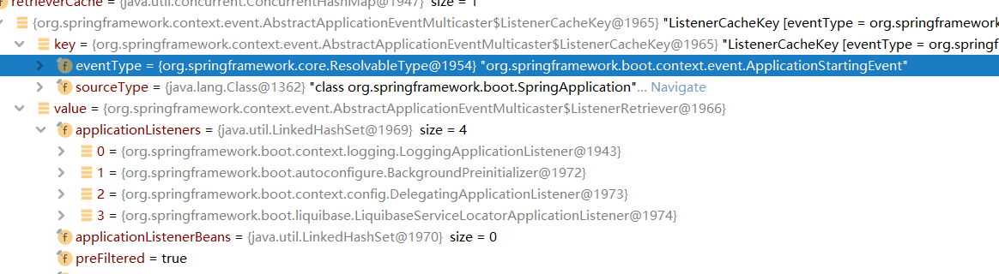
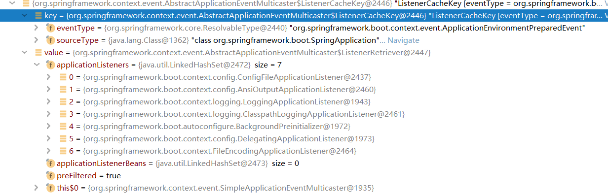
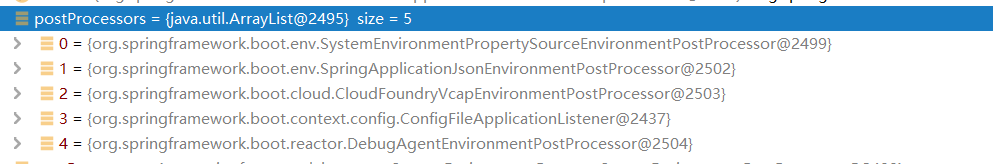
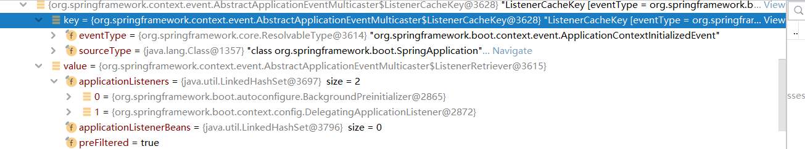
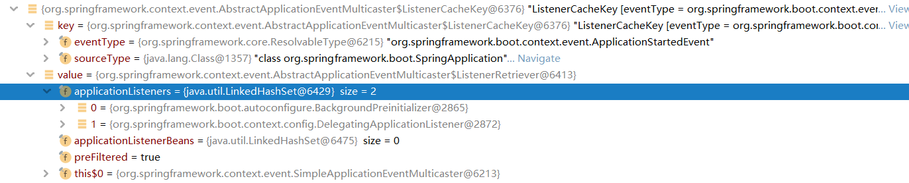
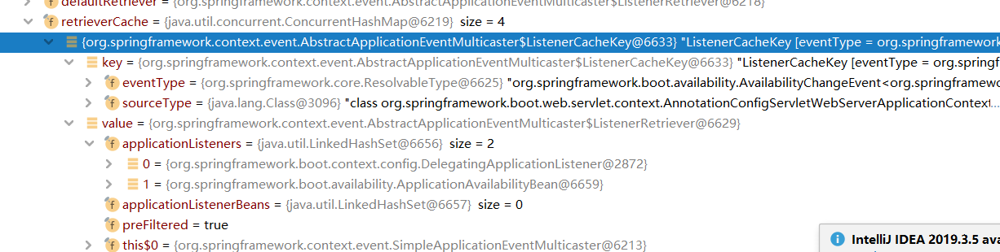

# 启动过程

主要是设置环境，设置监听点，启动容器，这就是spring-boot的启动所作的东西了。启动过程除了一些监听器和从spring。factories中导入的类，没有体现太多的东西，也没有体现自动配置类。只是加了一些普通的监听器，没有关键功能，加载属性可能算一个。

```java
@SpringBootApplication
public class DemoApplication implements ApplicationRunner {

    public static void main(String[] args) {
        SpringApplication.run(DemoApplication.class, args);
    }

    @Autowired
    private Environment environment;

    @Override
    public void run(ApplicationArguments args) throws Exception {
        String property = environment.getProperty("server.port");
        System.out.println();
    }
}
```

1. 从`spring.factories`中加载`ApplicationContextInitializer`和`ApplicationListener`

2. 加载listener体系，暴露工具类`SpringApplicationRunListeners`，把之前得到的listener放进去

3. `listeners.starting();`，事件ApplicationStartingEvent。一些日志和初始化的listener

4. 解析main入口的属性

   ```java
   ApplicationArguments applicationArguments = new DefaultApplicationArguments(args);
   ```

5. 准备好`environment`

   1. 创建

   2. 设置`ConversionService conversionService = ApplicationConversionService.getSharedInstance();`

   3. 设置propertysource ，放进`SpringApplication`本身设置的属性和`commanline`属性（java命令）

   4. 设置profile `org.springframework.boot.SpringApplication#additionalProfiles`

   5. 设置一个特别的ConfigurationPropertySourcesPropertySource

   6. `listeners.environmentPrepared(environment);`事件`ApplicationEnvironmentPreparedEvent`

      设置environment，propertysource ，profile，日志，提前加载一些类

      1. `ConfigFileApplicationListener`比较复杂，使用了很多`EnvironmentPostProcessor`来处理environment。大多是设置添加property source

         例如`RandomValuePropertySource`，并且，使用了`PropertySourceLoader`把yaml和property文件处理成property source，找到对应的profile，设置进environment。

      2. ```java
         	private void onApplicationEnvironmentPreparedEvent(ApplicationEnvironmentPreparedEvent event) {
         		List<EnvironmentPostProcessor> postProcessors = loadPostProcessors();
         		postProcessors.add(this);
         		AnnotationAwareOrderComparator.sort(postProcessors);
         		for (EnvironmentPostProcessor postProcessor : postProcessors) {
         			postProcessor.postProcessEnvironment(event.getEnvironment(), event.getSpringApplication());
         		}
         	}
         ```

      3. 

6. 打印banner

7. 创建容器类，并且预处理 `prepareContext()`

   1. 替换原生的environment

   2. 加入conversion `context.getBeanFactory().setConversionService(ApplicationConversionService.getSharedInstance());`

   3. `applyInitializers(context);`

      主要是预先加入一些bean和BeanFactoryPostProcessor，设置容器id，ContextId，设置容器的listener，可以从 `context.initializer.classes`属性中获取initializer

      

      ```java
      //ConfigurationWarningsApplicationContextInitializer; 
      //用于检测@ComponentScan是否包含不应该扫的包，有的话发出警告
      context.addBeanFactoryPostProcessor(new ConfigurationWarningsPostProcessor(getChecks()));
      
      //SharedMetadataReaderFactoryContextInitializer
      //用于导入SharedMetadataReaderFactoryBean，ConcurrentReferenceCachingMetadataReaderFactory
      //替换org.springframework.context.annotation.ConfigurationClassPostProcessor#metadataReaderFactory
      //listener: 之后会清空缓存，用不上了
      applicationContext.addBeanFactoryPostProcessor(new CachingMetadataReaderFactoryPostProcessor());
      
      //listener：把webserver的端口放进environment，一般来说默认属性名 "local.server.port"
      ServerPortInfoApplicationContextInitializer;
          setPortProperty(event.getApplicationContext(), propertyName, event.getWebServer().getPort());
      
      //listener: 把ConditionEvaluationReport打印出日志，一般只有debug才打印，如何fail，那么会提醒你用debug
      ConditionEvaluationReportLoggingListener;
      logAutoConfigurationReport();
      ```

   4. `listeners.contextPrepared(context);`  事件ApplicationContextInitializedEvent，没什么动作

      

   5. 打印日志

   6. 注册 springApplicationArguments和springBootBanner两个bean

   7. 设置allowBeanDefinitionOverriding 

   8. 因为容器创建时使用的是无参构造器，因此没有load任何bean定义，这里手动load，其实一般就是一个启动类main

   9. `listeners.contextLoaded(context);` 事件ApplicationPreparedEvent

      把spring-boot的所有listener全部注入到容器中，添加PropertySourceOrderingPostProcessor和修改日志配置，注册日志相关的bean

      ```Java
      	@Override
      	public void contextLoaded(ConfigurableApplicationContext context) {
      		for (ApplicationListener<?> listener : this.application.getListeners()) {
      			if (listener instanceof ApplicationContextAware) {
      				((ApplicationContextAware) listener).setApplicationContext(context);
      			}
      			context.addApplicationListener(listener);
      		}
      		this.initialMulticaster.multicastEvent(new ApplicationPreparedEvent(this.application, this.args, context));
      	}
      ```

      

8. 启动容器refresh

9. `listeners.started(context);` ApplicationStartedEvent

   由于已经启动了容器，那么便直接使用容器的监听器体系，注意是新的multicast。有两个事件需要发布，第二个用于记录spring-boot的状态，用不上的。

   ```java
   	@Override
   	public void started(ConfigurableApplicationContext context) {
   		context.publishEvent(new ApplicationStartedEvent(this.application, this.args, context));
   		AvailabilityChangeEvent.publish(context, LivenessState.CORRECT);
   	}
   ```

   

   

10. 从容器中拿出runner运行

11. `listeners.running(context);` ApplicationReadyEvent

    设置mxbean的状态

    ```java
    	@Override
    	public void running(ConfigurableApplicationContext context) {
    		context.publishEvent(new ApplicationReadyEvent(this.application, this.args, context));
    		AvailabilityChangeEvent.publish(context, ReadinessState.ACCEPTING_TRAFFIC);
    	}
    ```

    

12.spring-boot启动完毕。

事件序列


# 自动装配功能

其实就是去获取配置文件中EnableAutoConfiguration下面的类，然后根据注解进行排序过滤

```java
@AutoConfigurationPackage
@Import(AutoConfigurationImportSelector.class)
public @interface EnableAutoConfiguration {}
```

# 包结构

# origin

org.springframework.boot.origin.Origin

不知道有啥用，实现类不多，接口方法没有

有两个相关接口配合使用

`org.springframework.boot.origin.OriginLookup`

`org.springframework.boot.origin.OriginProvider`

**OriginAwareSystemEnvironmentPropertySource**替换

SystemEnvironmentPropertySource 就是多了个original方法。

# listener

spring-boot则用 `SpringApplicationRunListeners`作工具类，`SpringApplicationRunListener`

作第一层listener，可以通过工厂导入，一般只有一个，为`EventPublishingRunListener`，然后内部通过`SimpleApplicationEventMulticaster`代理给 `ApplicationListener`，这一步和spring一模一样。

# 参考文献

[Spring-Boot和Spring的监听器模式区别和联系](https://blog.csdn.net/tanglihai/article/details/122067921)

[几篇文章讲讲spring-boot的几个分散的功能点](https://github.com/coderbruis/JavaSourceCodeLearning/tree/master/note/SpringBoot)

https://fangshixiang.blog.csdn.net/article/details/105762050

[你能说出SpringBoot自动装配的原理吗？ _](https://www.cnblogs.com/xfeiyun/p/15707730.html)

[【㊫SpringBoot】Springboot自动装配以及启动原理解析 _](https://www.cnblogs.com/xfeiyun/p/17282030.html)