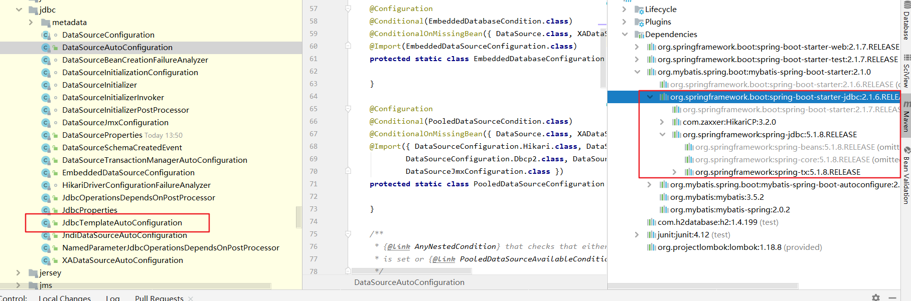
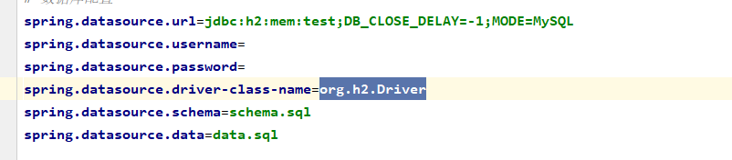
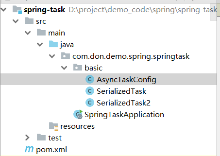

# jdbc

dao薄层封装，属于spring自己做的封装。



jdbc起步依赖主要是激活了spring-boot-autoconfigure中官方集成的jdbc自动配置，引入连接池，spring-jdbc主要是提供jdbctemplate，还有transactional依赖注解的使用。当然还需要一个驱动依赖来说明具体要使用哪个数据库。这里使用的是h2数据库。

是官方集成的依赖，所以不需要额外的auto configure。




> 公共配置

# Mybatis

### 依赖

```xml
<!--mybatis起步依赖-->
<dependency>
    <groupId>org.mybatis.spring.boot</groupId>
    <artifactId>mybatis-spring-boot-starter</artifactId>
    <version>1.1.1</version>
</dependency>

<!-- MySQL连接驱动 -->
<dependency>
    <groupId>mysql</groupId>
    <artifactId>mysql-connector-java</artifactId>
</dependency>
```

### 配置数据源

```properties
#DB Configuration:
spring.datasource.driverClassName=com.mysql.jdbc.Driver
spring.datasource.url=jdbc:mysql://127.0.0.1:3306/test?useUnicode=true&characterEncoding=utf8
spring.datasource.username=root
spring.datasource.password=root
```

### 配置xml文件和其他mybatis配置

```yaml
#spring集成Mybatis环境
mybatis:
	type-aliases-package： com.itheima.domain  #pojo别名扫描包，没什么用
#    configLocation: classpath:/mybatis/mybatis-config.xml # 通常不用，类似mybatis原始的那种配置，外置配置文件
    configuration:
        default-enum-type-handler: org.apache.ibatis.type.EnumOrdinalTypeHandler  #处理枚举类如何对应
        map-underscore-to-camel-case: true
    mapper-locations: #数组
    	- classpath:mybatis/mapper/*.xml #找到xml的文件位置
    	- classpath:dao/*.xml #找到xml的文件位置
```

### 配置mapper客户端

@Mapper、@MapperScan扫描mapper类，自动生成代理对象，进入容器 

```java
//org.apache.ibatis.annotations.Mapper , mybatis自身的,扫描单个
@Mapper //标记该类是一个mybatis的mapper接口，可以被spring boot自动扫描到spring上下文中
public interface UserMapper {
	public List<User> queryUserList();
}

//org.mybatis.spring.annotation.MapperScan; mybatis spring给的，扫描包
@MapperScan({"com.dc.mall.mapper","com.dc.mall.dao"})
@Configuration
public class foo(){}
```

### SQL XML

在src\main\resources\mapper路径下加入UserMapper.xml配置文件"

```xml
<?xml version="1.0" encoding="utf-8" ?>
<!DOCTYPE mapper PUBLIC "-//mybatis.org//DTD Mapper 3.0//EN" "http://mybatis.org/dtd/mybatis-3-mapper.dtd" >
<mapper namespace="com.itheima.mapper.UserMapper">
    <select id="queryUserList" resultType="user">
        select * from user
    </select>
</mapper>
```

### SqlSessionTemplate

SpringBoot提供了一个简单的template供我们使用

```JAVA
@Autowired
private SqlSessionTemplate sqlSessionTemplate;

User user = sqlSessionTemplate.selectOne("com.segmentfault.springbootlesson7.mapper.UserMapper.selectOneUser", id);
```

### 本人解释

引用jdbc的图，在jdbc起步依赖的基础上，引入mybatis的相关配置，还有一个新的包用于兼容处理spring的mapper。

# Junit

### 5.2.1 添加Junit的起步依赖

```xml
<!--测试的起步依赖-->
<dependency>
    <groupId>org.springframework.boot</groupId>
    <artifactId>spring-boot-starter-test</artifactId>
    <scope>test</scope>
</dependency>
```

### 5.2.2 编写测试类

```java
package com.itheima.test;

import com.itheima.MySpringBootApplication;
import com.itheima.domain.User;
import com.itheima.mapper.UserMapper;
import org.junit.Test;
import org.junit.runner.RunWith;
import org.springframework.beans.factory.annotation.Autowired;
import org.springframework.boot.test.context.SpringBootTest;
import org.springframework.test.context.junit4.SpringRunner;

import java.util.List;

@RunWith(SpringRunner.class)
@SpringBootTest(classes = MySpringBootApplication.class)
public class MapperTest {

    @Autowired
    private UserMapper userMapper;

    @Test
    public void test() {
        List<User> users = userMapper.queryUserList();
        System.out.println(users);
    }

}
```

其中，

SpringRunner继承自SpringJUnit4ClassRunner，使用哪一个Spring提供的测试测试引擎都可以

```java
public final class SpringRunner extends SpringJUnit4ClassRunner 
```

@SpringBootTest的属性指定的是引导类的字节码对象


### 5.2.3 控制台打印信息


# Spring Data JPA

### 依赖

```xml
<dependency>
    <groupId>org.springframework.boot</groupId>
    <artifactId>spring-boot-starter-data-jpa</artifactId>
</dependency>
<!-- MySQL连接驱动 -->
<dependency>
    <groupId>mysql</groupId>
    <artifactId>mysql-connector-java</artifactId>
</dependency>
```

### 配置

```yaml
spring:
    datasource:
        driverClassName: com.mysql.jdbc.Driver
        password: root
        url: jdbc:mysql://127.0.0.1:3306/test?useUnicode=true&characterEncoding=utf8
        username: root
    jpa:
        database: MySQL
        generate-ddl: true
        hibernate:
            ddl-auto: update
            naming_strategy: org.hibernate.cfg.ImprovedNamingStrategy
        show-sql: true
```

### 代码

```java
@Entity
public class User {
    // 主键
    @Id
    @GeneratedValue(strategy = GenerationType.IDENTITY)
    private Long id;
    // 用户名
    private String username;
    // 密码
    private String password;
    // 姓名
    private String name;
 
    //此处省略setter和getter方法... ...
}
```

```java
public interface UserRepository extends JpaRepository<User,Long>{
    public List<User> findAll();
}
```

### console


注意：如果是jdk9，执行报错如下：


原因：jdk缺少相应的jar

解决方案：手动导入对应的maven坐标，如下：

```xml
<!--jdk9需要导入如下坐标-->
<dependency>
    <groupId>javax.xml.bind</groupId>
    <artifactId>jaxb-api</artifactId>
    <version>2.3.0</version>
</dependency>
```


# Redis

### 5.4.1 添加redis的起步依赖

```xml
<!-- 配置使用redis启动器 -->
<dependency>
    <groupId>org.springframework.boot</groupId>
    <artifactId>spring-boot-starter-data-redis</artifactId>
</dependency>
```

### 5.4.2 配置redis的连接信息

```properties
#Redis
spring.redis.host=127.0.0.1
spring.redis.port=6379
```

### 5.4.3 注入RedisTemplate测试redis操作

```java
@RunWith(SpringRunner.class)
@SpringBootTest(classes = SpringbootJpaApplication.class)
public class RedisTest {

    @Autowired
    private UserRepository userRepository;

    @Autowired
    private RedisTemplate<String, String> redisTemplate;

    @Test
    public void test() throws JsonProcessingException {
        //从redis缓存中获得指定的数据
        String userListData = redisTemplate.boundValueOps("user.findAll").get();
        //如果redis中没有数据的话
        if(null==userListData){
            //查询数据库获得数据
            List<User> all = userRepository.findAll();
            //转换成json格式字符串
            ObjectMapper om = new ObjectMapper();
            userListData = om.writeValueAsString(all);
            //将数据存储到redis中，下次在查询直接从redis中获得数据，不用在查询数据库
            redisTemplate.boundValueOps("user.findAll").set(userListData);
            System.out.println("===============从数据库获得数据===============");
        }else{
            System.out.println("===============从redis缓存中获得数据===============");
        }

        System.out.println(userListData);

    }

}
```

# web相关

## 注册三大组件

### 原生注解

1. springboot开启Servlet 组件扫描

   ```java
   //指定包路径扫描
   String[] value() default {}
   String[] basePackages() default {}
   
   //指定类扫描
   Class<?>[] basePackageClasses() default {}
   
   ```

   ```java
   import org.springframework.boot.web.servlet.ServletComponentScan;
   @SpringBootApplication
   @ServletComponentScan(basePackages = {"com.segmentfault.segmentfaultlesson4.servlet"})
   public class SegmentfaultLesson4Application extends SpringBootServletInitializer {
   ```

2. 扩展对应的类，然后使用相应的注解，注解都是tomcat中的

   ```
   //以下是部分接口，还有其他
   org.springframework.web.filter.OncePerRequestFilter
   
   javax.servlet.http.HttpServlet
   org.springframework.web.servlet.FrameworkServlet
   
   javax.servlet.ServletContextListener
   javax.servlet.http.HttpSessionListener
   javax.servlet.http.HttpSessionActivationListener
   javax.servlet.ServletRequestListener
   javax.servlet.ServletContextAttributeListener
   javax.servlet.http.HttpSessionAttributeListener
   javax.servlet.http.HttpSessionBindingListener
   javax.servlet.ServletRequestAttributeListener
   ```

   **例子**

   ```java
   //先经过listener的前面在来filter
   @WebFilter(urlPatterns = "/myservlet")
   public class MyFilter extends OncePerRequestFilter {
   ```

   ```java
   //filter后进入servlet
   @WebServlet(
   		name = "myServlet",
   		urlPatterns = "/myservlet",
   		initParams = {
   				@WebInitParam(name = "myname", value = "myvalue")
   		}
   )
   public class MyServlet extends HttpServlet {
   ```

   ```java
   //going out of scope when it exits the last servlet or the first filter in the chain.
   @WebListener
   public class MyServletRequestListener implements ServletRequestListener {
   ```

### @Component

spring-mvc.md有介绍

### Spring Boot API方式注册

1. 实现上面所说的接口，

2. xxxRegistrationBean注册
3. @Bean工厂方式

```java
	@Bean//注册servlet
	public static ServletRegistrationBean servletRegistrationBean() {

		ServletRegistrationBean servletRegistrationBean = new ServletRegistrationBean();

		servletRegistrationBean.setServlet(new MyServlet2());
		servletRegistrationBean.setName("my-servlet2");
		servletRegistrationBean.addUrlMappings("/spring-boot/myservlet2");
		servletRegistrationBean.addInitParameter("myname", "myvalue");

		return servletRegistrationBean;

	}

	@Bean//注册filter
	public static FilterRegistrationBean filterRegistrationBean() {
		FilterRegistrationBean filterRegistrationBean = new FilterRegistrationBean();

		filterRegistrationBean.setFilter(new MyFilter2());
		filterRegistrationBean.addServletNames("my-servlet2");

		filterRegistrationBean.setDispatcherTypes(DispatcherType.REQUEST, DispatcherType.FORWARD, DispatcherType.INCLUDE);

		return filterRegistrationBean;

	}

	//重复注册，生成两个不同的listener，生效两次
	@Bean//注册listener
	public static ServletListenerRegistrationBean servletListenerRegistrationBean() {
		ServletListenerRegistrationBean servletListenerRegistrationBean = new ServletListenerRegistrationBean();
		servletListenerRegistrationBean.setListener(new MyServletRequestListener());
		return servletListenerRegistrationBean;
	}
```

**注意版本区别**

```
Spring Boot 1.4.0 开始支持
org.springframework.boot.web.servlet.xxxRegistrationBean
Spring Boot  1.4.0 之前
org.springframework.boot.context.embedded.xxxRegistrationBean
```

### 例子


## 启动JSP模板

1. 引入依赖，激活 传统Servlet Web部署

   ```xml
           <dependency>
               <groupId>org.springframework.boot</groupId>
               <artifactId>spring-boot-starter-web</artifactId>
           </dependency>
   
           <!-- JSP 渲染引擎 -->
           <dependency>
               <groupId>org.apache.tomcat.embed</groupId>
               <artifactId>tomcat-embed-jasper</artifactId>
           </dependency>
   
           <!-- JSTL -->
           <dependency>
               <groupId>javax.servlet</groupId>
               <artifactId>jstl</artifactId>
           </dependency>
   ```

   ```java
   //Spring Boot 1.4.0 开始
   //SpringBoot启动类继承org.springframework.boot.web.support.SpringBootServletInitializer
   @SpringBootApplication
   public class SegmentfaultLesson4Application extends SpringBootServletInitializer {..}
   ```

2. 组装 org.springframework.boot.builder.SpringApplicationBuilder

   ```java
   // springBoot启动类 重写方法	protected SpringApplicationBuilder configure(SpringApplicationBuilder builder) {..}
   
   	protected SpringApplicationBuilder configure(SpringApplicationBuilder builder) {
   		builder.sources(SegmentfaultLesson4Application.class);
   		return builder;
   	}
   ```

3. 配置JSP视图、配置文件

   org.springframework.boot.autoconfigure.web.WebMvcProperties

   ```properties
   spring.mvc.view.prefix = /WEB-INF/jsp/
   spring.mvc.view.suffix = .jsp
   ```

   

4. 看要不要转发 WEB-INF文件夹

   ```java
   //web-inf属于被保护的东西，因此需要转发，内部
   @Controller
   public class JspDemoController {
   
   	@RequestMapping("index")
   	public String index(Model model) {
   
   		model.addAttribute("message", "Mercy");
   
   		return "index";
   	}
   
   }
   ```

5. 例子

   

# log

- **开发环境**

  - JDK 8
  - Spring Boot 2.0.4 RELEASE
  - Maven
  - Windows 10
  - IDEA 2018.2

  

## logback

### 使用

Spring Boot默认集成了Logback，可以开箱即用，非常方便。因为spring-boot-starter-logging是Logback的日志实现，而Spring Boot启动项spring-boot-starter又依赖了spring-boot-starter-logging，所以Spring Boot就默认集成了Logback，包依赖如下图：


日志是默认控制台输出的，我们程序启动的时候就使用Logback，如下图所示：


日志组成解读：

- 日期和时间：毫秒精度，易于排序
- 日志级别：trace、debug、info、warn、error（日志级别依次从低到高）
- 进程ID
- `---`分隔符
- 线程名称：括在方括号中(可以截断控制台输出)
- 记录器名称：这通常是源类名(通常缩写)
- 日志具体信息

### 配置

#### yaml配置

如果需要输出日志到文件，只需要设置：logging.file或logging.path，示例如下：

```yaml
debug: true
logging:
    level:
        root: info
    file: log/log.log    # 现在是工作目录路径，\log.log就是磁盘目录D
        max-history: 100 # 日志最大容量设置，默认10M超过则分割为多个文件。注意spring-boot版本
```

可以通过设置日志的级别，忽略更低级别的日志输出。

注意： logging.file和logging.path设置一个属性即可，如果两个都设置，则以logging.file为主，logging.path无效。


#### 自定义日志配置

日志服务在ApplicationContext创建前就初始化了，所以通过设置属性和传统的配置XML文件，可以对日志进行管理和控制。

只需要在src/main/resources下，创建好约定名称的XML文件，即可完成对日志系统的设置，不同的日志系统有不同的约定名称，如下列表：

[个性化配置](https://docs.spring.io/spring-boot/docs/current/reference/html/spring-boot-features.html#boot-features-logback-extensions)

| 日志    | 名称                                                         |
| ------- | ------------------------------------------------------------ |
| logback | logback-spring.xml, logback-spring.groovy, logback.xml, 或者 logback.groovy |
| log4j2  | log4j2-spring.xml 或者 log4j2.xml                            |


Spring Boot官方建议使用“-spring”的命名规则，进行日志配置，如：logback-spring.xml而不是logback.xml。

当然你也可以自定义日志名称，只需要在application.properties配置即可，代码如下：

```properties
logging.config=classpath:logging-config.xml
```


## log4j2

### 依赖

Spring Boot添加Log4j2依赖的同时，需要排除Logback依赖，配置pom.xml代码如下：

```xml
<dependencies>
		<dependency>
			<groupId>org.springframework.boot</groupId>
			<artifactId>spring-boot-starter-web</artifactId>
			<exclusions><!-- 去掉logback配置 -->
				<exclusion>
					<groupId>org.springframework.boot</groupId>
					<artifactId>spring-boot-starter-logging</artifactId>
				</exclusion>
			</exclusions>
		</dependency>
		
		<dependency> <!-- 引入log4j2依赖 -->
			<groupId>org.springframework.boot</groupId>
			<artifactId>spring-boot-starter-log4j2</artifactId>
		</dependency>
</dependencies>

```

### 配置

添加log4j2-spring.xml文件在src/main/resources文件下，配置文件代码如下：

```xml
<?xml version="1.0" encoding="UTF-8"?>
<configuration>
	<Appenders>
		<Console name="CONSOLE" target="SYSTEM_OUT">
			<PatternLayout charset="UTF-8" pattern="[%-5p] %d %c - %m%n" />
		</Console>

		<File name="File" fileName="D:\\mylog.log">
			<PatternLayout pattern="%m%n" />
		</File>
	</Appenders>

	<Loggers>
		<root level="info">
			<AppenderRef ref="CONSOLE" />
			<AppenderRef ref="File" />
		</root>
	</Loggers>
</configuration>
```

输入日志到控制台和D盘mylog.log文件中。

到此为止，已经完成了log4j2的集成，运行项目，查看日志。

## 参考

Logback：https://github.com/qos-ch/logback

log4j2：https://github.com/apache/logging-log4j2

http://blog.didispace.com/spring-boot-learning-1x/

# cache

## 进程内缓存

随着时间的积累，应用的使用用户不断增加，数据规模也越来越大，往往数据库查询操作会成为影响用户使用体验的瓶颈，此时使用缓存往往是解决这一问题非常好的手段之一。Spring 3开始提供了强大的基于注解的缓存支持，可以通过注解配置方式低侵入的给原有Spring应用增加缓存功能，提高数据访问性能。

在Spring Boot中对于缓存的支持，提供了一系列的自动化配置，使我们可以非常方便的使用缓存。下面我们通过一个简单的例子来展示，我们是如何给一个既有应用增加缓存功能的。

### 快速入门

#### 不使用缓存

为了更好的理解缓存，我们先对该工程做一些简单的改造。

- `application.properties`文件中新增`spring.jpa.properties.hibernate.show_sql=true`，开启hibernate对sql语句的打印
- 修改单元测试`ApplicationTests`，初始化插入User表一条用户名为AAA，年龄为10的数据。并通过findByName函数完成两次查询。

```java
@RunWith(SpringJUnit4ClassRunner.class)
@SpringApplicationConfiguration(Application.class)
public class ApplicationTests {

	@Autowired
	private UserRepository userRepository;

	@Before
	public void before() {
		userRepository.save(new User("AAA", 10));
	}

	@Test
	public void test() throws Exception {
		User u1 = userRepository.findByName("AAA");
		System.out.println("第一次查询：" + u1.getAge());

		User u2 = userRepository.findByName("AAA");
		System.out.println("第二次查询：" + u2.getAge());
	}

}
```

- 执行单元测试，我们可以在控制台中看到下面内容。

```sql
Hibernate: insert into user (age, name) values (?, ?)
Hibernate: select user0_.id as id1_0_, user0_.age as age2_0_, user0_.name as name3_0_ from user user0_ where user0_.name=?
第一次查询：10
Hibernate: select user0_.id as id1_0_, user0_.age as age2_0_, user0_.name as name3_0_ from user user0_ where user0_.name=?
第二次查询：10
```

在测试用例执行前，插入了一条User记录。然后每次findByName调用时，都执行了一句select语句来查询用户名为AAA的记录。

#### 引入缓存

- 在`pom.xml`中引入cache依赖，添加如下内容：

```xml
<dependency>
    <groupId>org.springframework.boot</groupId>
    <artifactId>spring-boot-starter-cache</artifactId>
</dependency>
```

- 在Spring Boot主类中增加`@EnableCaching`注解开启缓存功能，如下：

```java
@SpringBootApplication
@EnableCaching
public class Application {

	public static void main(String[] args) {
		SpringApplication.run(Application.class, args);
	}

}
```

- 在数据访问接口中，增加缓存配置注解，如：

```java
@CacheConfig(cacheNames = "users")
public interface UserRepository extends JpaRepository<User, Long> {
    @Cacheable
    User findByName(String name);
}
```

- 再来执行以下单元测试，可以在控制台中输出了下面的内容：

```xml
Hibernate: insert into user (age, name) values (?, ?)
Hibernate: select user0_.id as id1_0_, user0_.age as age2_0_, user0_.name as name3_0_ from user user0_ where user0_.name=?
第一次查询：10
第二次查询：10
```

到这里，我们可以看到，在调用第二次findByName函数时，没有再执行select语句，也就直接减少了一次数据库的读取操作。

为了可以更好的观察，缓存的存储，我们可以在单元测试中注入cacheManager。

```java
@Autowired
private CacheManager cacheManager;
```

使用debug模式运行单元测试，观察cacheManager中的缓存集users以及其中的User对象的缓存加深理解。

### 注解

#### @EnableCaching

开启缓存功能

#### @CacheConfig

- 主要用于配置该类中会用到的一些共用的缓存配置。在这里`@CacheConfig(cacheNames = "users")`：配置了该数据访问对象中返回的内容将存储于名为users的缓存对象中，我们也可以不使用该注解，直接通过`@Cacheable`自己配置缓存集的名字来定义。

#### @Cacheable

配置了findByName函数的返回值将被加入缓存。同时在查询时，会先从缓存中获取，若不存在才再发起对数据库的访问。该注解主要有下面几个参数：

- **value、cacheNames**

  两个等同的参数（cacheNames为Spring 4新增，作为value的别名），用于指定缓存存储的集合名。由于Spring 4中新增了`@CacheConfig`，因此在Spring 3中原本必须有的value属性，也成为非必需项了

- **key**

  缓存对象存储在Map集合中的key值，非必需，缺省按照函数的所有参数组合作为key值，若自己配置需使用SpEL表达式，比如：`@Cacheable(key = "#p0")`：使用函数第一个参数作为缓存的key值，更多关于SpEL表达式的详细内容可参考[官方文档](http://docs.spring.io/spring/docs/current/spring-framework-reference/html/cache.html#cache-spel-context)

- **condition**

  缓存对象的条件，非必需，也需使用SpEL表达式，只有满足表达式条件的内容才会被缓存，比如：`@Cacheable(key = "#p0", condition = "#p0.length() < 3")`，表示只有当第一个参数的长度小于3的时候才会被缓存，若做此配置上面的AAA用户就不会被缓存，读者可自行实验尝试。

- **unless**

  另外一个缓存条件参数，非必需，需使用SpEL表达式。它不同于condition参数的地方在于它的判断时机，该条件是在函数被调用之后才做判断的，所以它可以通过对result进行判断。

- **keyGenerator**：

  用于指定key生成器，非必需。若需要指定一个自定义的key生成器，我们需要去实现`org.springframework.cache.interceptor.KeyGenerator`接口，并使用该参数来指定。需要注意的是：**该参数与key是互斥的**

- **cacheManager**

  用于指定使用哪个缓存管理器，非必需。只有当有多个时才需要使用

- **cacheResolver**

  用于指定使用那个缓存解析器，非必需。需通过`org.springframework.cache.interceptor.CacheResolver`接口来实现自己的缓存解析器，并用该参数指定。

#### @CachePut

配置于函数上，能够根据参数定义条件来进行缓存，它与`@Cacheable`不同的是，它每次都会真是调用函数，所以主要用于数据新增和修改操作上。它的参数与`@Cacheable`类似，具体功能可参考上面对`@Cacheable`参数的解析

#### @CacheEvict

配置于函数上，通常用在删除方法上，用来从缓存中移除相应数据。除了同@Cacheable一样的参数之外，它还有下面两个参数：

- allEntries

  非必需，默认为false。当为true时，会移除所有数据

- beforeInvocation

  非必需，默认为false，会在调用方法之后移除数据。当为true时，会在调用方法之前移除数据。

#### @Caching

### 配置

在Spring Boot中通过`@EnableCaching`注解自动化配置合适的缓存管理器（CacheManager），Spring Boot根据下面的顺序去侦测缓存提供者：

- Generic
- JCache (JSR-107)
- EhCache 2.x
- Hazelcast
- Infinispan
- Redis
- Guava
- Simple

除了按顺序侦测外，我们也可以通过配置属性`spring.cache.type`来强制指定。我们可以通过debug调试查看cacheManager对象的实例来判断当前使用了什么缓存。

本文中不对所有的缓存做详细介绍，下面以常用的EhCache为例，看看如何配置来使用EhCache进行缓存管理。

在Spring Boot中开启EhCache非常简单，只需要在工程中加入`ehcache.xml`配置文件并在pom.xml中增加ehcache依赖，框架只要发现该文件，就会创建EhCache的缓存管理器。

- 在`src/main/resources`目录下创建：`ehcache.xml`

```xml
<ehcache xmlns:xsi="http://www.w3.org/2001/XMLSchema-instance"
         xsi:noNamespaceSchemaLocation="ehcache.xsd">
    <cache name="users"
           maxEntriesLocalHeap="200"
           timeToLiveSeconds="600">
    </cache>
</ehcache>
```

- 在pom.xml中加入

```xml
<dependency>
    <groupId>net.sf.ehcache</groupId>
    <artifactId>ehcache</artifactId>
</dependency>
```

完成上面的配置之后，再通过debug模式运行单元测试，观察此时CacheManager已经是EhCacheManager实例，说明EhCache开启成功了。

对于EhCache的配置文件也可以通过`application.properties`文件中使用`spring.cache.ehcache.config`属性来指定，比如：

```
spring.cache.ehcache.config=classpath:config/another-config.xml
```

#### 代码示例

本文的相关例子可以查看下面仓库中的`chapter4-4-1`目录：

## 集中式缓存Redis

### 介绍

虽然EhCache已经能够适用很多应用场景，但是由于EhCache是进程内的缓存框架，在集群模式下时，各应用服务器之间的缓存都是独立的，因此在不同服务器的进程间会存在缓存不一致的情况。即使EhCache提供了集群环境下的缓存同步策略，但是同步依然需要一定的时间，短暂的缓存不一致依然存在。

在一些要求高一致性（任何数据变化都能及时的被查询到）的系统和应用中，就不能再使用EhCache来解决了，这个时候使用集中式缓存是个不错的选择，因此本文将介绍如何在Spring Boot的缓存支持中使用Redis进行数据缓存。

下面以上一篇的例子作为基础进行改造，将缓存内容迁移到redis中。

### 准备工作

可以下载案例[Chapter4-4-1](http://git.oschina.net/didispace/SpringBoot-Learning)，进行下面改造步骤。

先来回顾一下在此案例中，我们做了什么内容：

- 引入了spring-data-jpa和EhCache
- 定义了User实体，包含id、name、age字段
- 使用spring-data-jpa实现了对User对象的数据访问接口UserRepository
- 使用Cache相关注解配置了缓存
- 单元测试，通过连续的查询和更新数据后的查询来验证缓存是否生效

### 开始改造

- 删除EhCache的配置文件`src/main/resources/ehcache.xml`
- pom.xml中删除EhCache的依赖，增加redis的依赖：

```xml
<dependency>
    <groupId>org.springframework.boot</groupId>
    <artifactId>spring-boot-starter-redis</artifactId>
</dependency>
```

- `application.properties`中增加redis配置，以本地运行为例，比如：

```properties
spring.redis.host=localhost
spring.redis.port=6379
spring.redis.pool.max-idle=8
spring.redis.pool.min-idle=0
spring.redis.pool.max-active=8
spring.redis.pool.max-wait=-1
```

我们需要做的配置到这里就已经完成了，Spring Boot会在侦测到存在Redis的依赖并且Redis的配置是可用的情况下，使用`RedisCacheManager`初始化`CacheManager`。

为此，我们可以单步运行我们的单元测试，可以观察到此时`CacheManager`的实例是`org.springframework.data.redis.cache.RedisCacheManager`，并获得下面的执行结果：

```
Hibernate: insert into user (age, name) values (?, ?)
Hibernate: select user0_.id as id1_0_, user0_.age as age2_0_, user0_.name as name3_0_ from user user0_ where user0_.name=?
第一次查询：10
第二次查询：10
Hibernate: select user0_.id as id1_0_0_, user0_.age as age2_0_0_, user0_.name as name3_0_0_ from user user0_ where user0_.id=?
Hibernate: update user set age=?, name=? where id=?
第三次查询：10
```

可以观察到，在第一次查询的时候，执行了select语句；第二次查询没有执行select语句，说明是从缓存中获得了结果；而第三次查询，我们获得了一个错误的结果，根据我们的测试逻辑，在查询之前我们已经将age更新为20，但是我们从缓存中获取到的age还是为10。

### 问题思考

为什么同样的逻辑在EhCache中没有问题，但是到Redis中会出现这个问题呢？

在EhCache缓存时没有问题，主要是由于EhCache是进程内的缓存框架，第一次通过select查询出的结果被加入到EhCache缓存中，第二次查询从EhCache取出的对象与第一次查询对象实际上是同一个对象（可以在使用Chapter4-4-1工程中，观察u1==u2来看看是否是同一个对象），因此我们在更新age的时候，实际已经更新了EhCache中的缓存对象。

而Redis的缓存独立存在于我们的Spring应用之外，我们对数据库中数据做了更新操作之后，没有通知Redis去更新相应的内容，因此我们取到了缓存中未修改的数据，导致了数据库与缓存中数据的不一致。

**因此我们在使用缓存的时候，要注意缓存的生命周期，利用好上一篇上提到的几个注解来做好缓存的更新、删除**

### 进一步修改

针对上面的问题，我们只需要在更新age的时候，通过`@CachePut`来让数据更新操作同步到缓存中，就像下面这样：

```java
@CacheConfig(cacheNames = "users")
public interface UserRepository extends JpaRepository<User, Long> {

    @Cacheable(key = "#p0")
    User findByName(String name);

    @CachePut(key = "#p0.name")
    User save(User user);

}
```

在redis-cli中flushdb，清空一下之前的缓存内容，再执行单元测试，可以获得下面的结果：

```
Hibernate: insert into user (age, name) values (?, ?)
第一次查询：10
第二次查询：10
Hibernate: select user0_.id as id1_0_0_, user0_.age as age2_0_0_, user0_.name as name3_0_0_ from user user0_ where user0_.id=?
Hibernate: update user set age=?, name=? where id=?
第三次查询：20
```

可以看到，我们的第三次查询获得了正确的结果！同时，我们的第一次查询也不是通过select查询获得的，因为在初始化数据的时候，调用save方法时，就已经将这条数据加入了redis缓存中，因此后续的查询就直接从redis中获取了。

本文内容到此为止，主要介绍了为什么要使用Redis做缓存，以及如何在Spring Boot中使用Redis做缓存，并且通过一个小问题来帮助大家理解缓存机制，在使用过程中，一定要注意缓存生命周期的控制，防止数据不一致的情况出现。

# spring-actuator

运维监控检测

```xml
<dependency>
   <groupId>org.springframework.boot</groupId>
   <artifactId>spring-boot-starter-actuator</artifactId>
</dependency>
```

配置文件

```properties
management.port = 8081
```

访问，还有很多url


# schedule

实现定时任务的方案

1. 使用 JDK 的Timer和TimerTask实现
   可以实现简单的间隔执行任务，无法实现按日历去调度执行任务。
2. 使用Quartz实现
   Quartz 是一个异步任务调度框架，功能丰富，可以实现按日历调度。
3. 使用Spring Task实现
   Spring 3.0后提供Spring Task实现任务调度，支持按日历调度，相比Quartz功能稍简单，但是在开发基本够用，支持注解编程方式

## 快速入门

### 单线程串行化执行，同步

```java
@EnableScheduling
//启动类或者配置类加上该注解开启
```

```java
@Component
public class SerializedTask {
    private static final Logger LOGGER = LoggerFactory.getLogger(SerializedTask.class);


//    定义任务调试策略
    @Scheduled(initialDelay = 3000, fixedRate = 5000) //第一次延迟3秒，以后每隔5秒执行一次
//    @Scheduled(cron = "0/3 * * * * *")//每隔3秒去执行
//    @Scheduled(fixedRate = 3000) //在任务开始后3秒执行下一次调度
//    @Scheduled(fixedDelay = 3000) //在任务结束后3秒后才开始执行
    public void task1() {
        LOGGER.info("===============测试定时任务1开始===============");
        try {
            Thread.sleep(5000);
        } catch (InterruptedException e) {
            e.printStackTrace();
        }
        LOGGER.info("===============测试定时任务1结束===============");

    }

//    定义任务调试策略
    @Scheduled(cron = "0/3 * * * * *")//每隔3秒去执行
//    @Scheduled(fixedRate = 3000) //在任务开始后3秒执行下一次调度
//    @Scheduled(fixedDelay = 3000) //在任务结束后3秒后才开始执行
    public void task2() {
        LOGGER.info("===============测试定时任务2开始===============");
        try {
            Thread.sleep(5000);
        } catch (InterruptedException e) {
            e.printStackTrace();
        }
        LOGGER.info("===============测试定时任务2结束===============");

    }
}
```

### 异步执行

配置类添加线程池

```java
@Configuration
@EnableScheduling
public class AsyncTaskConfig implements SchedulingConfigurer, AsyncConfigurer {
    //线程池线程数量
    private int corePoolSize = 5;

    @Bean
    public ThreadPoolTaskScheduler taskScheduler() {
        ThreadPoolTaskScheduler scheduler = new ThreadPoolTaskScheduler();
        scheduler.initialize();//初始化线程池
        scheduler.setPoolSize(corePoolSize);//线程池容量
        return scheduler;
    }

    @Override
    public Executor getAsyncExecutor() {
        return taskScheduler();
    }

    @Override
    public AsyncUncaughtExceptionHandler getAsyncUncaughtExceptionHandler() {
        return null;
    }

    @Override
    public void configureTasks(ScheduledTaskRegistrar scheduledTaskRegistrar) {
        scheduledTaskRegistrar.setTaskScheduler(taskScheduler());
    }
}
```

### 代码



## cron表达式

- **cron表达式包括6部分**：

  秒（0~59） 

  分钟（0~59）

  小时（0~23） 

  月中的天（1~31） 

  月（1~12） 

  周中的天（填写MON，TUE，WED，THU，FRI，SAT,SUN，或数字1~7 1表示MON，依次类推）

- **特殊字符介绍**：
  “/”字符表示指定数值的增量
  “*”字符表示所有可能的值
  “-”字符表示区间范围
  "," 字符表示列举
  “？”字符仅被用于月中的天和周中的天两个子表达式，表示不指定值

- **例子**：
  0/3 * * * * * 每隔3秒执行
  0 0/5 * * * * 每隔5分钟执行
  0 0 0 * * * 表示每天0点执行
  0 0 12 ? * WEN 每周三12点执行
  0 15 10 ? * MON-FRI 每月的周一到周五10点 15分执行
  0 15 10 ? * MON,FRI 每月的周一和周五10点 15分执行

# hateoas

类似swagger的暴露接口的工具

```xml
<dependency>
    <groupId>org.springframework.boot</groupId>
    <artifactId>spring-boot-starter-hateoas</artifactId>
</dependency>
```

```java
import org.springframework.hateoas.ResourceSupport;

public class User extends ResourceSupport {

    @GetMapping(path = "/json/user",
            produces = MediaType.APPLICATION_JSON_VALUE)
    public User user() {
		//暴露接口，不过很麻烦
        user.add(linkTo(methodOn(JSONRestController.class).setUserName(user.getName())).withSelfRel());
        user.add(linkTo(methodOn(JSONRestController.class).setUserAge(user.getAge())).withSelfRel());

        return user;
    }
```

