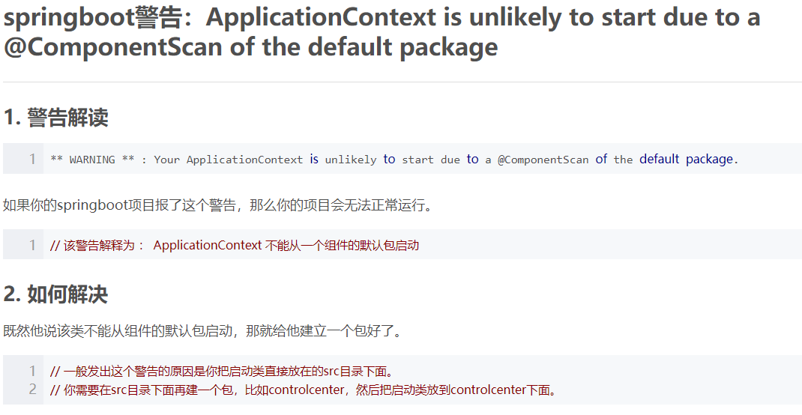

# 数据库

```yml
# Cannot determine embedded database driver class for database type NONE 原因是没有配置数据库
spring:
  datasource:
    driver-class-name: com.mysql.jdbc.Driver
# Establishing SSL connection without server's identity verification is not recommended.
# According to MySQL 5.5.45+, 5.6.26+ and 5.7.6+ requirements SSL connection must be established
# by default if explicit option isn't set. For compliance with existing applications not using
# SSL the verifyServerCertificate property is set to 'false'. You need either to explicitly disable SSL
# by setting useSSL=false, or set useSSL=true and provide truststore for server certificate verification.
# jdbc url 后面增加参数 useSSL=false 即可
    url: jdbc:mysql://127.0.0.1:3306/imooc-demo?useUnicode=true&characterEncoding=UTF-8&useSSL=false
    username: root
    password: 1234
```

# session

```yml
# No Spring Session store is configured: set the 'spring.session.store-type' property
spring: 
  session:
    store-type: none
```

# redis

```yml
#org.springframework.data.redis.RedisConnectionFailureException: Cannot get Jedis connection; nested exception is redis.clients.jedis.exceptions.JedisConnectionException: Could not get a resource from the pool
#需要安装并配置 redis 服务器参数

spring: 
  redis: 
    host: 127.0.0.1
    port: 6379
```

# security

```yml
# 关闭身份验证
security:
  basic:
    enabled: false
```

# SpringBoot

* java.lang.IllegalStateException: Unable to find a @SpringBootConfiguration, you need to use @ContextConfiguration or @SpringBootTest(classes=...) with your test

  解决方法：https://stackoverflow.com/questions/39084491/unable-to-find-a-springbootconfiguration-when-doing-a-jpatest

  ```java
  @SpringBootTest(classes = DemoApplication.class)
  public class UserControllerTest {
    ...
  }
  ```

* springBoot启动类

  

- springboot热部署会启动jettyServer（开发环境使用）

  会有session持久化功能，因此有某些对象无法serialization就会发出异常

  参考http://www.jfinal.com/feedback/4718