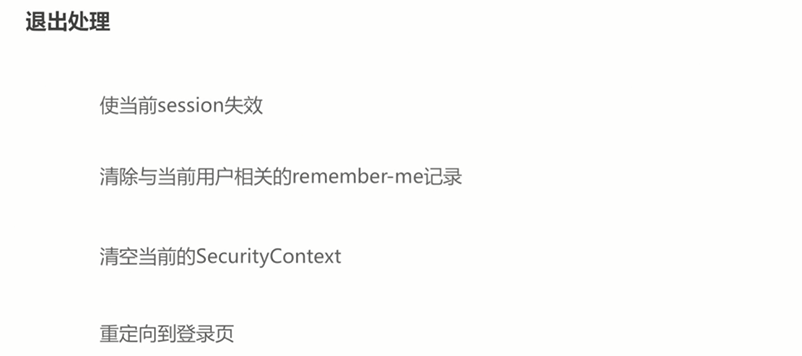
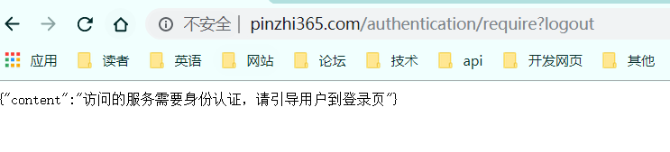
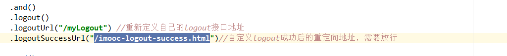

# 5-11 退出登录

## 1. 默认操作

> 退出到`.loginPage(SecurityConstants.DEFAULT_UNAUTHENTICATION_URL)`中去

## 2. 自定义设置

​	`logoutUrl`：登出触发地址，下面url和handler二选一

​	`logoutSuccessUrl`： 

​	`logoutSuccessHandler`：

