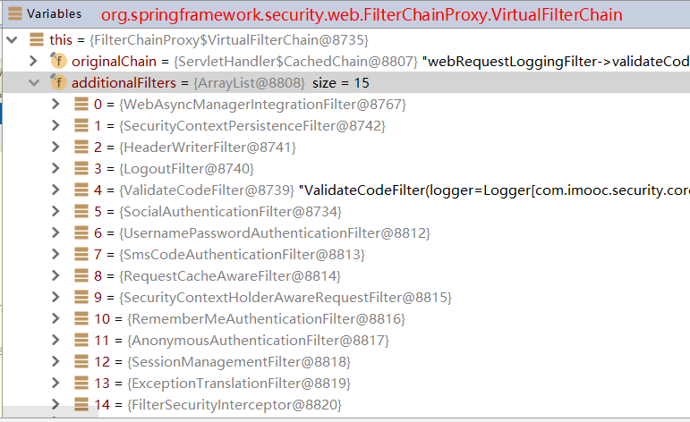
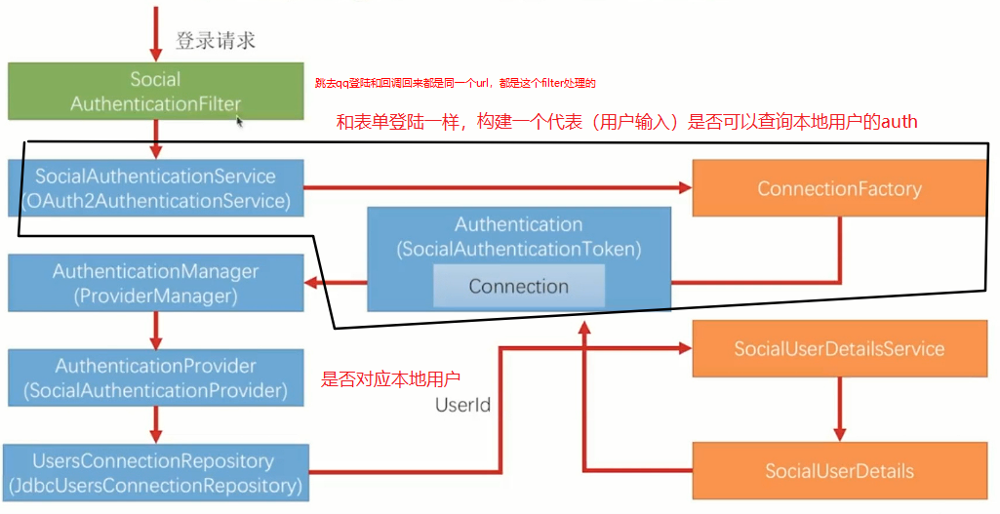
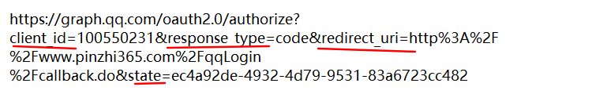
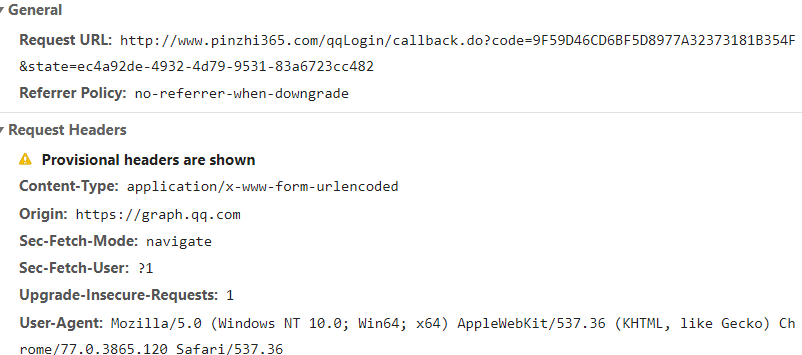
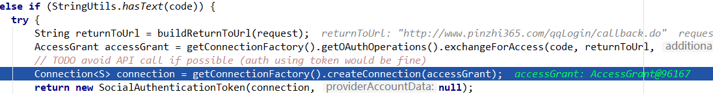
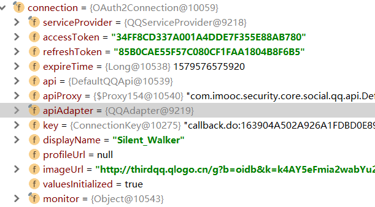
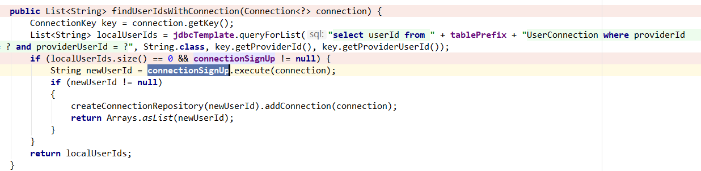
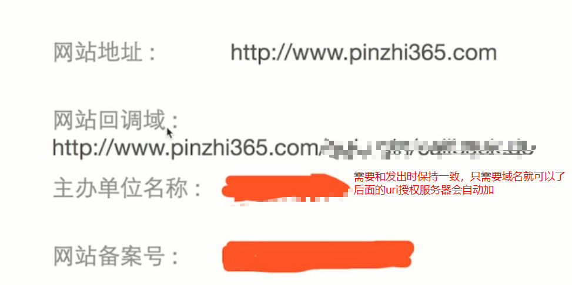

# 	5-2 SpringSocial —作为OAuth2的client端

## Spring Social和 OAuth的关系

spring Social属于OAuth的接口使用方，也就是第三方client，仅仅用到OAuth的一部分。

## SpringSocial 基本原理

> 只要访问某些页面或者url，请求就会被某个Filter拦截，然后带领用户走完整个流程，得到Authentication

## SpringSocial 主要接口

> 前面1-5步是标准流程，6是个性化流程，key不一样
>
> 
>
> 服务提供商的用户信息封装在Connection里面
>
> Connection由Factory创建
>
> Factory需要两个配件
>
> ​	ServiceProvider也需要两个配件
>
> ​			OAuth2Operations负责前5步，拿到`accessToken`
>
> ​			Api负责第六步，读取用户信息（服务提供商相关），这里需要发一个http请求

# 5-4 开发QQ登录原理

QQ互联文档资料 https://wiki.connect.qq.com/ 

> 上面顺序错了

------

1. **请求QQ登陆**：

   > 从点击qq登陆开始，跳转到<a href="/qqLogin/callback.do">，这时候是会抛出异常的，并且redirect到另一个url，向qq授权服务器请求`authCode`。例如url：

   

2. **跳转到qq认证服务器请求授权,redirect**

   > 用户授权（扫码或者登陆qq等操作）后，qq认证服务器在自己服务器处理完之后会redirect回自己的网站，带着AuthCode

   ​	

   

3. **请求AccessToken**（`OAuth2AuthenticationService`）

   > 返回服务器后，这时也是由同一个过滤器处理，如果请求中带有`code参数`，会再次向qq授权按服务器发送请求AccessToken

   

4. **创建OAuth2Connection**

   > 获得qq授权服务器的回应后，把`AccessToken`封装到`AccessGrant`然后再把`AccessGrant`中的`field`和`ServiceProvider`和`ApiAdapter`设置到`Connection`中
   >
   > `Connection`保存了最重要的个性化的`AccssToken`，这是所有不同社交网站都是相同的。然后在初始化的时候会再调用`apiAdapter`来调用属于这个`Connection`的`Api`，获取并初始化某些**个人信息**
   >
   > 对于QQ来说例如先获取`openId`，然后在调用api
   >
   > > ​	OpenID是此网站上或应用中唯一对应用户身份的标识，网站或应用可将此ID进行存储，便于用户下次登录时辨识其身份，或将其与用户在网站上或应用中的原有账号进行绑定。 
   >
   > 

5. **创建Token**

   > 创建`AuthToken`(待auth)：根据`Connection`创建`SocialAuthenticationToken`

6. **选择合适的provider验证AuthToken**  （SocialAuthenticationProvider）

   > - 1. 查userConnection表，得到userID
   >
   >   主要逻辑和表单一样，都是拿一个唯一标识去数据库查是否有这个用户，有就可以，没有就隐式注册或者显示注册。由于这里的connection都是社交信息，只有AccessToken（有时限）和openId（无时限）唯一对应一个社交用户，因此需要用无时限的openId来进行用户绑定，查询也是先查询UserConnection表找出userId然后调用userService查询用户表。
   >
   >   - 1.1 调用`findUserIdsWithConnection`	查得到（已经注册），返回，继续下一步	
   >   - 1.2 **查不到**（需要注册）
   >     - 1.2.1 如果有`ConnectionSignUp`，自动隐式注册，写入两个表中，并且需要自己重写注册的业务逻辑，
   >     - 1.2.2 没有`ConnectionSignUp`，导航到`signupUrl`，用户自己注册，会把第三方的用户信息放到session中，通过访问自己配的`/social/user`，拿到信息，展示。在注册页面，最后providerSignUtils会从session中拿出数据加上userID一起存储
   >
   > - 查询userDetails表

   

   

   > 回调地址，只需要改一下host文件就可以引到localhost
   >
   > 还需要把服务器改为80端口

   

# 5-7 开发微信登录原理

需要修改一些类，思路多多

主要时经常继承类和重写方法