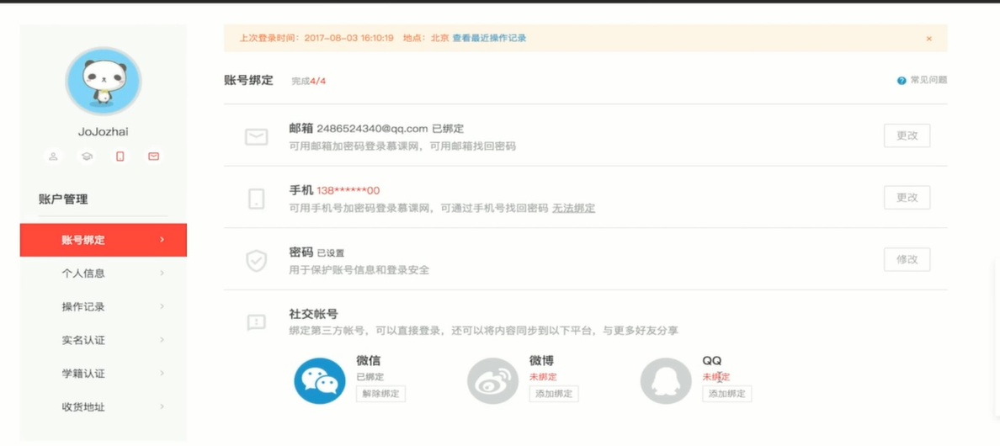
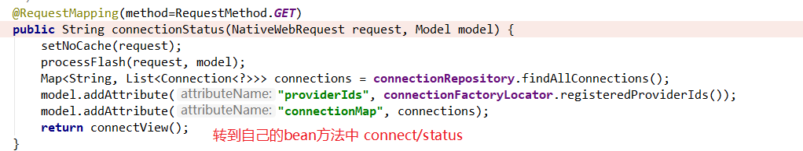
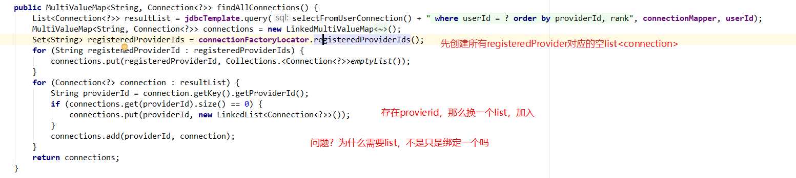
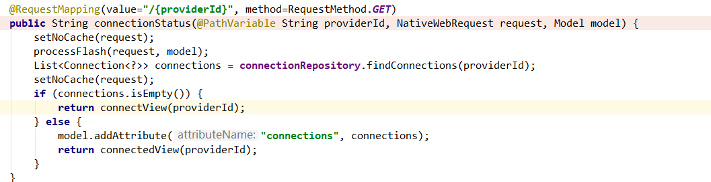
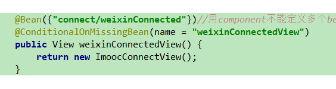
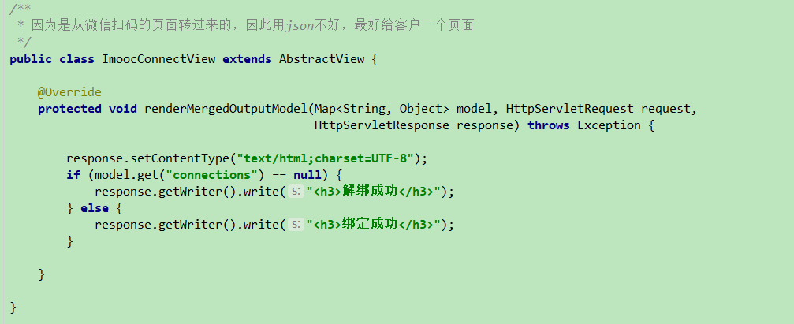

# 5-8 spring social 绑定和解绑处理

> **在已经登陆的前提下进行的，已知当前用户是谁**

## 0. 查看绑定状态

## 1. 绑定

> 应该也是要通过第三方授权
>
> 视图可以寻找AbstractView，当让也携带数据

## 2. 解绑

> 解绑只是简单地删除数据库的信息
>
> 需要用的是delete方法，用postman，并且把web的cookie粘贴过来

