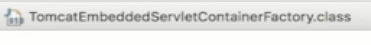
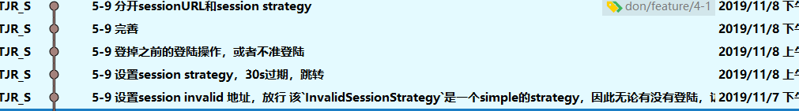

# 5-9 单机Session管理

## 1. session invalid timeout

> 至少需要1min，事实上是错误的，我10s就失效了
>

- **session invalid url **

  > session失效时跳转的地址，记得放行
  >
  > **问题**
  >
  > 该`InvalidSessionStrategy`是一个simple的strategy，因此无论有没有登陆，访问的网页是否需要登陆，只要超过valid时间，都会重定向`sessionInvalid_URL`，因此需要重新写一个新类
  >
  > 或者在cookie中插入一个值，提示是否已经登陆，如果已经登陆并且访问保护页面则需要提示登陆

- **session invalid strategy**

  > 过期strategy

## 2.  多点登录

- 设置session最大数量：可为1

- 超过最大数量时的动作：

  - 不准登陆

  - 登掉之前的登陆

    > ​	只要用户在另一个地方登陆，就要把这个session注销掉

