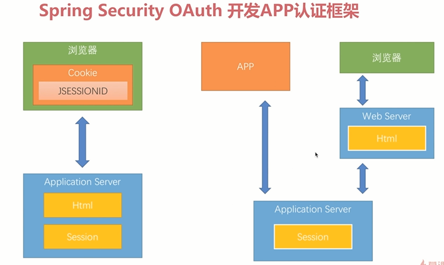
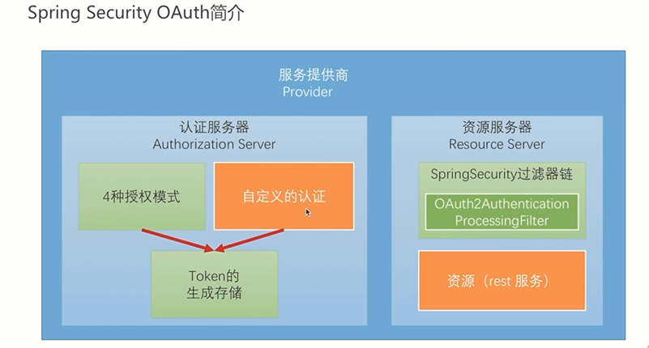

# 6-1 SpringSecurityOAuth简介

搭建全方位的认证服务器和资源服务器

## 1. 问题

> 1. **web端直接访问Application Server**
>
>    之前都是用cookie来实现登陆信息保存的，通过sessionId来查找session，如果有就返回，如果没有就新建一个session
>
> 2. **第三方（node.js，app）访问Application Server**

1. 开发繁琐，cookies是浏览器内置好的，不需要自己写代码

2. 安全性和客户体验冲突，别人拿到SessionId就可以 登陆，安全性差；设置sessionID过期时间过短比较安全，但是频繁登陆体验不好

3. 有些前端技术不支持cookie，例如小程序

## 2. Spring OAuth filter架构

## 3. 关键

1. 访问的时候改为cookie以外的其他header（token），看配的filter如何控制并且解析

2. 如何请求得到token，如果需要保密，使用open Auth(需要多个controller用于转发)，否则一个controller生成即可（类似表单登录，不过此时一般写在controller中，其实完全可以改写表单登录的filter）