## 介绍

这里搭建标准的认证服务器和资源服务器，之后通过默认的方式获取authorization token，然后所有securityContext的authentication都可以使用token进行创建。（用于鉴权）

注意，标准配置没有basic认证，也没有其他登录认证方式，那么就没有filter把认证成功后的authentication写入session。token成为唯一认证成功凭证。

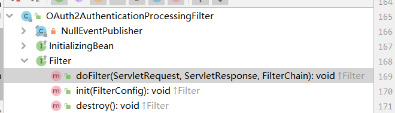

## 认证服务器

### 启动

1. demo依赖于app

2. 搭建认证服务器，添加注解，到6-2之后，基本上搭好了一个标准的OAuth服务器，不过全部使用原生的。

   ​	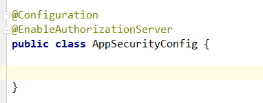

   ​	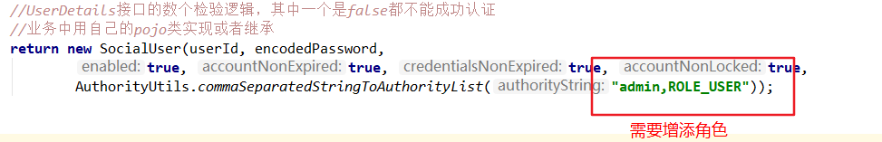

   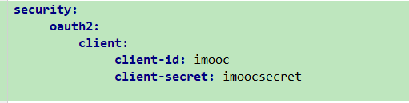	

3. 启动程序（me）

### **授权码请求token**

#### **注意**

1. 一个负责处理授权码的请求，一个负责token的申请。

   	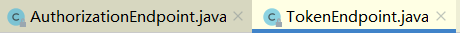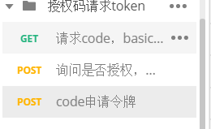

2. 两个endPoint的入口使用basic filter，因为这时候只有最基础的配置，没有配置其他登录。如果需要其他登录方法可以像以前一样配置，很重要，需要用表单登录、手机登录等保护起来。

   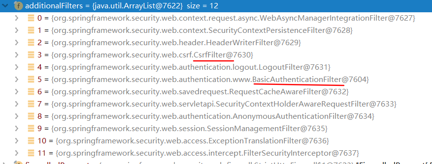

3. 当要访问保护资源的时候会使用OAuth filter。

   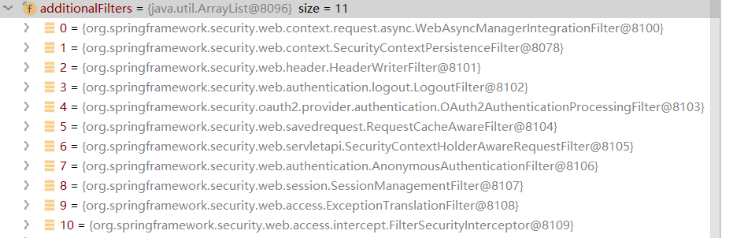

4. 要的参数不能少，程序都有用

5. 还有很多辅助类，但并不是OAuth独有，源码没追，原来的挺好用，但是如果不需要开发给第三方使用，那么挺麻烦的。

#### 流程

1. 申请授权码 

   get请求，记住，这个url是第三方引导跳转的

   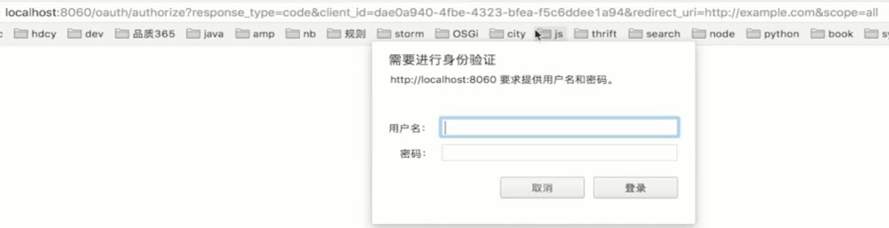

   这里`me`是认证服务器，该uri地址是`me`提供给`第三方客户端client`（有多个）的获取授权码的uri，`第三方客户端client`把`用户`引导到`me`这里，该密码是`用户`在`me`的服务器的用户密码。

   ​	**有人向me请求授权，me确认几件事：**

   > 1. 哪个第三方客户端client在向我请求授权码---------clientId（百度，qq，新浪之类的）
   > 2. 请求me的哪个用户给你授权--------上面的登陆 
   > 3. 需要授权那些资源---scope参数定义，me自定义
   > 4. 这里需要回调地址是因为要把授权码返回给第三方客户端

   ​	**好像不能重复授权，没有追源码，不看了**

   如果第一次请求没有加上basic header，那么就会弹出上面的弹框，提示输入，浏览器携带basic header再次发送原请求

2. 之后会询问是否授权，授权范围

   post请求，和上面是同一个url

3. 根据授权码申请令牌，加上Basic Authorization

    ​	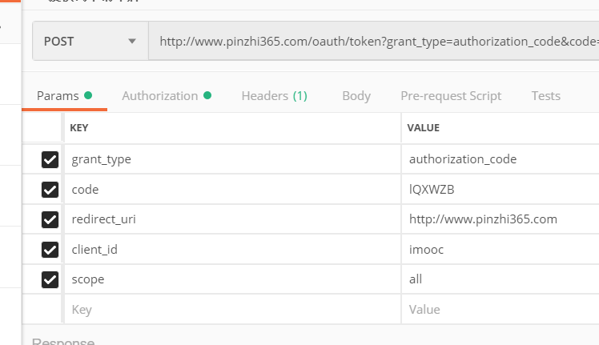

### 源码

```java
/**
Convenience annotation for enabling an Authorization Server (i.e. an AuthorizationEndpoint and a TokenEndpoint) in the current application context, which must be a DispatcherServlet context. Many features of the server can be customized using @Beans of type AuthorizationServerConfigurer (e.g. by extending AuthorizationServerConfigurerAdapter). The user is responsible for securing the Authorization Endpoint (/oauth/authorize) using normal Spring Security features (@EnableWebSecurity etc.), but the Token Endpoint (/oauth/token) will be automatically secured using HTTP Basic authentication on the client's credentials. Clients must be registered by providing a ClientDetailsService through one or more AuthorizationServerConfigurers.
*/
@EnableAuthorizationServer

// * Strategy for managing OAuth2 requests: {@link AuthorizationRequest}, {@link TokenRequest}, {@link OAuth2Request}.
org.springframework.security.oauth2.provider.OAuth2RequestFactory; 

//A request for authorization by an OAuth 2 Client, normally received and processed by the AuthorizationEndpoint.  more on doc...
org.springframework.security.oauth2.provider.AuthorizationRequest;

//Represents an OAuth2 token request, made at the TokenEndpoint. 
org.springframework.security.oauth2.provider.TokenRequest;

//Represents a stored authorization or token request. Used as part of the OAuth2Authentication object to store a request's authentication information
org.springframework.security.oauth2.provider.OAuth2Request;


```


#### 底层

底层是生成一个AuthorizationRequest 存储在session，通过cookie存取，第一次生成，第二次拿出通过，然后重定向（存在里面的参数）

### **密码申请授权码**

根据密码申请授权码，该模式等价于把用户密码直接给了第三方，只有第三方和认证服务器是同一家公司才安全

​	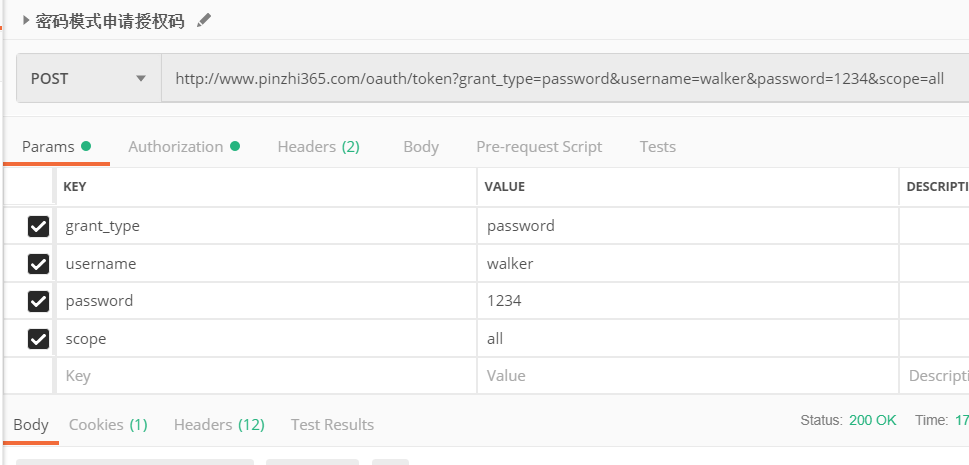

> 这种模式可以把用户登陆和申请令牌结合起来，登陆不要存储到session中，而是直接申请令牌
>
> 多次请求，spring security oauth 会发同一个token 


## 资源服务器

开启资源服务器后就不会使用session保存security context，而是每次拿到token进行构建，这个类作构建

```java
/**
 * A pre-authentication filter for OAuth2 protected resources. Extracts an OAuth2 token from the incoming request and
 * uses it to populate the Spring Security context with an {@link OAuth2Authentication} (if used in conjunction with an
 * {@link OAuth2AuthenticationManager}).
 */   
org.springframework.security.oauth2.provider.authentication.OAuth2AuthenticationProcessingFilter
```

​	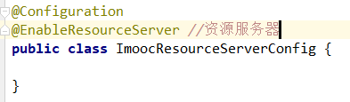

​	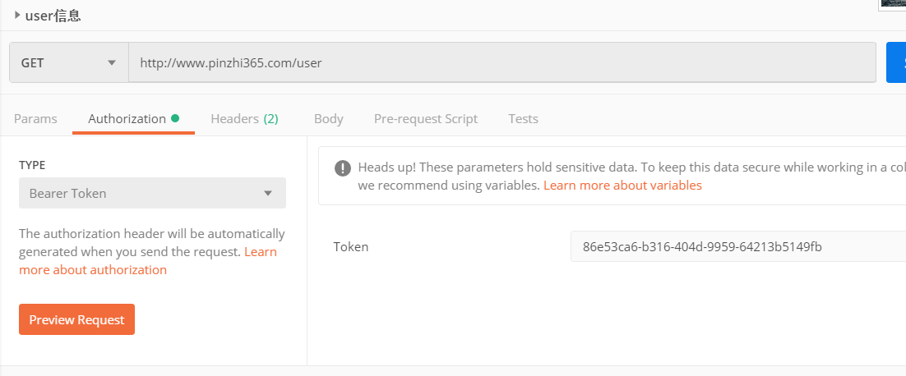

> 此时token是储存在内存中的


## 一些地址，参控

### OAuth2的api地址

 https://tools.ietf.org/html/rfc6749#section-4.1.1 

### 申请授权码的uri

qq登陆（provider）的授权url

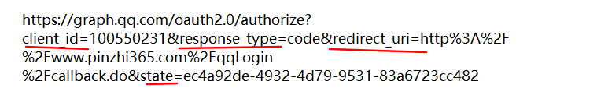

本网站（provider）的授权url


