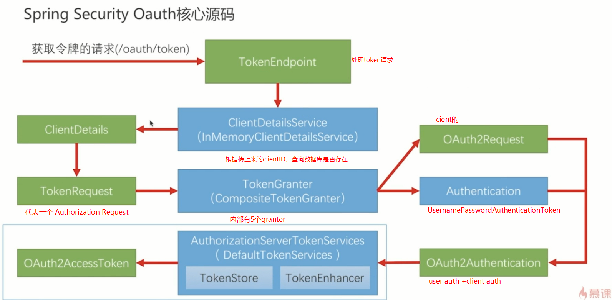
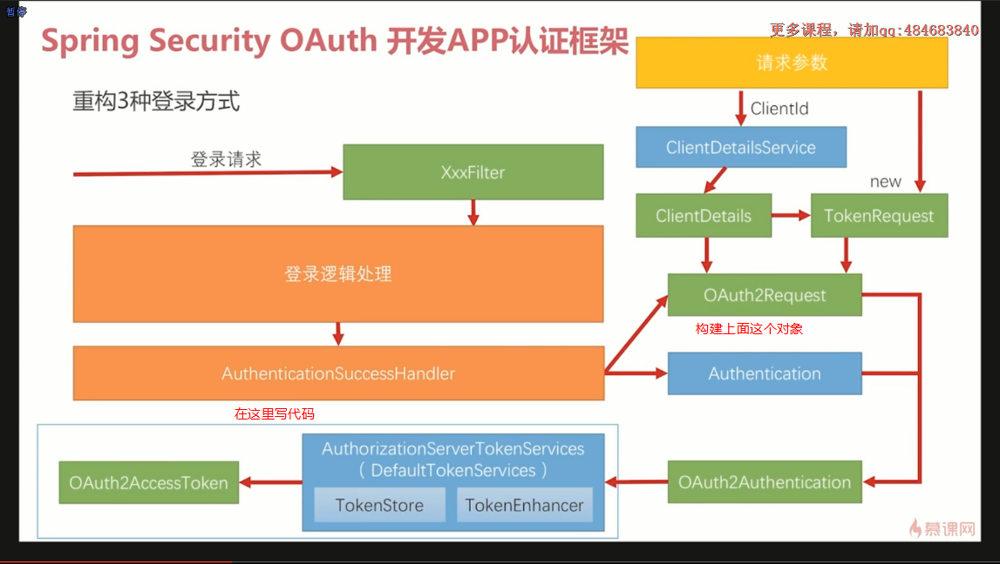
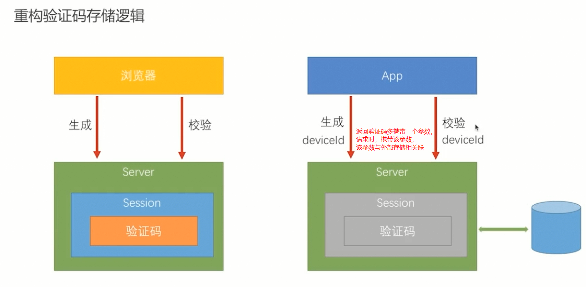
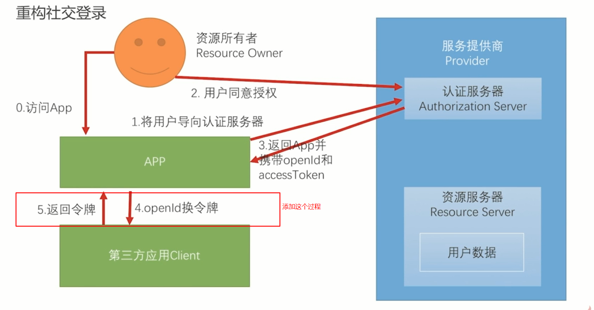
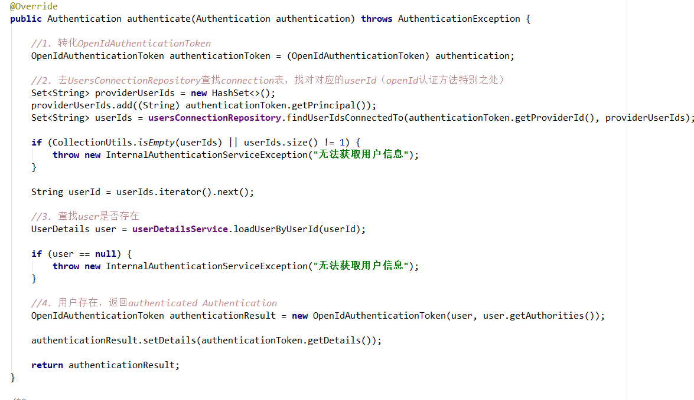
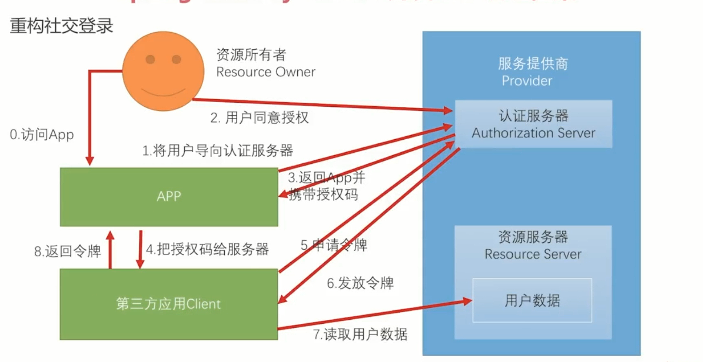
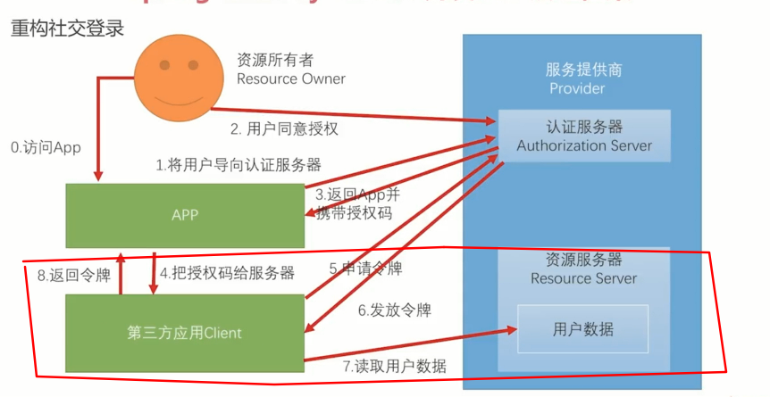
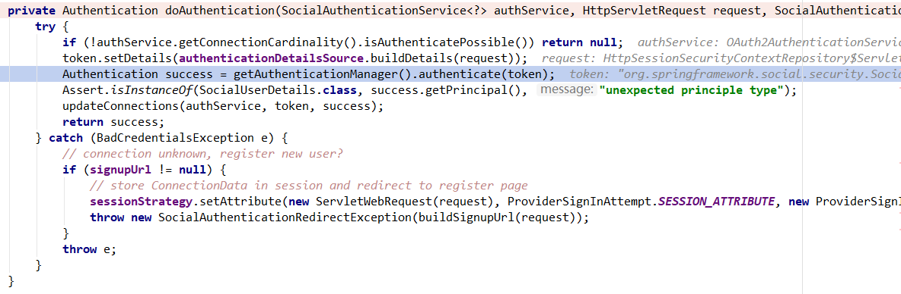
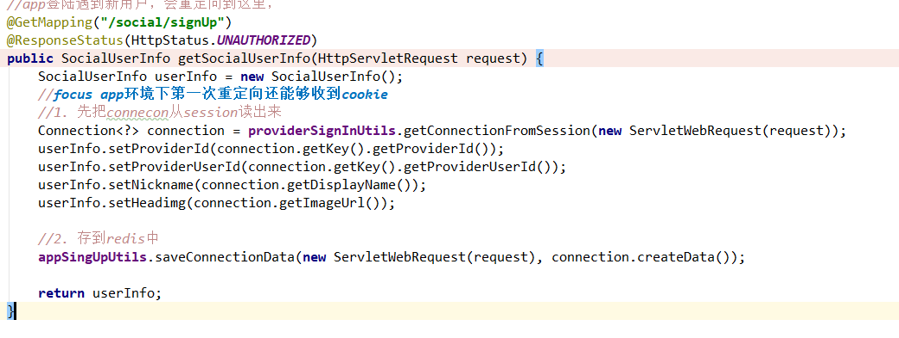

# 介绍

重构的目的：

开启认证服务器后，只能使用accessToken进行构建authentication，但是默认的认证endPoint相当复杂，而且如果不用提供给第三方client 的话没有必要使用，因此改造其他认证方式生成token，也可以直接通过controller生成token。

# 6-4 重构用户名密码登录

> 现在只是增加了表单登陆，并没有增加验证码filter，因此不需要验证码检验

> 核心在于认证成功后要增加生成发送令牌这一步骤

# 6-5 重构短信登录

> 添加验证码登陆filter后有一个问题，那就是如果app没有cookie，找不到session，因此验证码不能存储在session

> 用postman，其他工具发送请求还是可以携带cookie的，但是如果linux等就可以去掉cookie

请求验证码的时候需要header：deviceID，是前端给的，

> 如果是后台发的话会有些麻烦：
>
> ​		每次用户申请验证码的时候，生成一个独一无二的deviceID，然后关联验证码，和验证码一起发过去
>
> ​		然后前端需要保存起来，放在页面处一个变量，然后需要用到验证码的地方需要放在header中一起发送请求，修改header form表单是比较无力的

修改验证码保存、获取、删除逻辑，使用validateCodeRepository接口，浏览器的实现使用session，app的实现使用redis

# 6-6 重构社交登录

> **重点** ：**openId FIlter存在的意义在于把spring social的一部分工作分给前端，后端只需要获取前端发来的openId和providerId就可以了。**
>
> 在成功后要生成发送令牌，需要clientId和clientSecret
>
> 

## 1. 授权后就有openID，并且不需要获取用户数据，因为已经登陆（忽略注册）

> 基本逻辑和手机登陆是一样的，不同点在于需要给filter加一个successHandler生成返回令牌（携带clientId和clientSecret）
>
> provider和openId可以定位唯一用户

> 不需要更改，因为和原来的相比较真是redirect授权码的那一段多了一次转发而已，
>
> 问题：
>
> ​		需要给filter加一个successHandler生成返回令牌，（因此该转发需要携带clientId和clientSecret）

> 测试：在给予授权后，截除qq服务器的转发，加上clientId和clientSecret（basic auth）、deviceId（防止未注册），就可以拿到令牌

# 6-7 重构注册逻辑

> 和上一节一样，存到外部存储上去
>
> **关键点**
>
> 登陆有可能未成功，转往注册页面；而存储connection是在转发授权码的请求中完成的，因此需要在请求加上一个header ：deviceId

1. 关掉隐式登陆
2. 当登陆找不到userId的时候就会把connection存到session，然redirect转到"/social/signUp"，再进行读取到redis中（因此转达授权码的请求需要携带一个deviceId）。（**浏览器没有cookie还可以读取**）
3. 用户注册页面使用appproviderUtil，但这个不是认证成功后的注册页面，是返回给前端的数据，注册由前端去完成

> 测试：在给予授权后，截除qq服务器的转发，加上deviceId，clientId和clientSecret（basic auth）（防止已经注册需要申请令牌），就可以跳转了

