# 6-8 默认令牌配置

1. 配置令牌外部存储 tokenStore
2. 配置认证服务器的入口点和第三方client（哪些client可以申请open auth）
3. 增加securityProperties类


# 6-9 使用JWT替换默认令牌

> **原因**
>
> 普通令牌是随机uuid生成的，因此没有携带任何用户信息，如果redis故障宕机就会丢失，jwt令牌自包含，因此可以保存用户信息，也就不需要存储在服务器

**Json Web Token**

> 自包含：包含一些信息（最好不要放隐私信息）
>
> 密签：可以对jwt令牌进行密签，防止他人篡改，但是不能丢失密钥
>
> 可扩展：可以往里面加东西


**jwt令牌**


**jwt自包含**

解密能看到

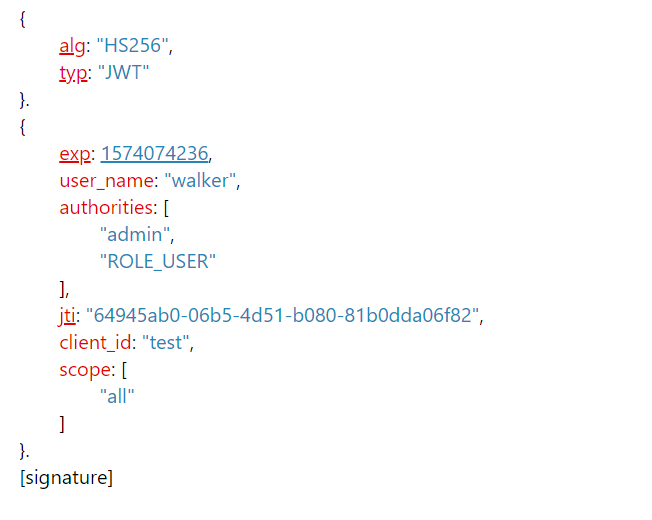

**用令牌查出的authentication**

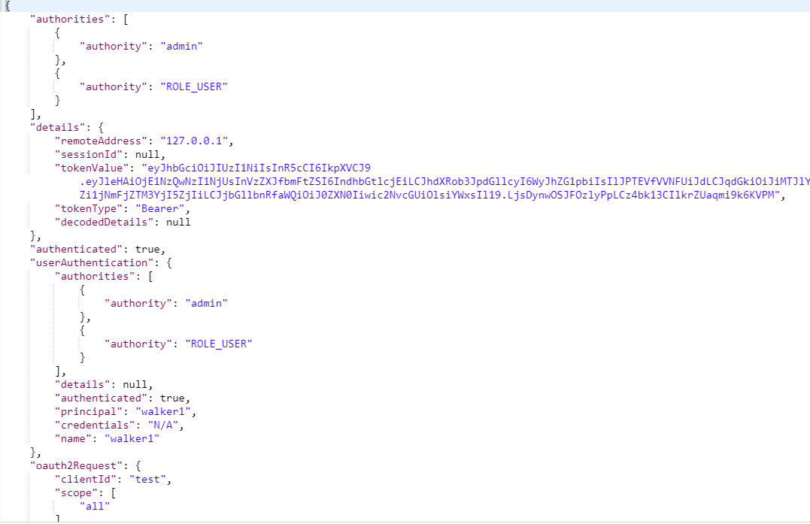

**jwt可扩展**

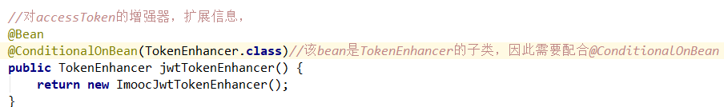

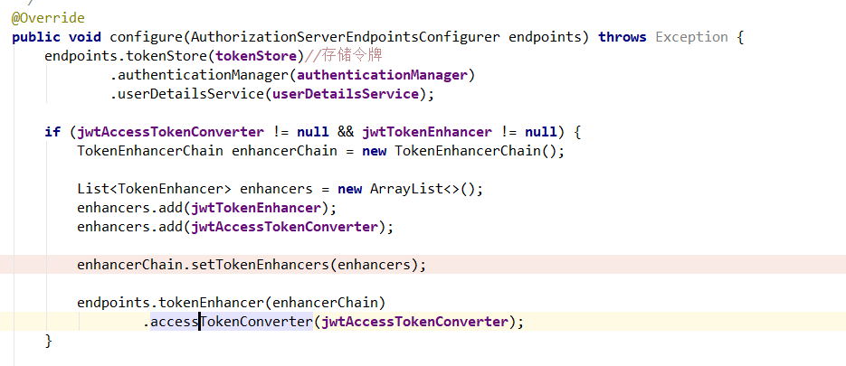

**解析jwt令牌**

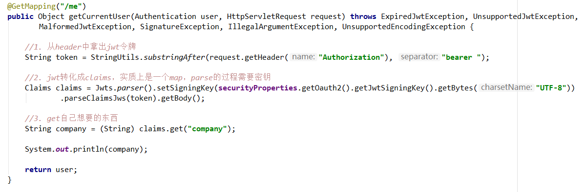


**refresh令牌**

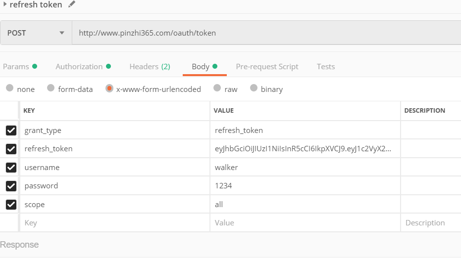

# 6-10 基于JWT实现SSO单点登录

这个sso没有使用@EnableResourceServer ，不使用令牌，还是使用cookie，但也是sso的一种实现，通常需要配合全球session

```java
//An OAuth2 client filter that can be used to acquire an OAuth2 access token from an authorization server, and load an authentication object into the SecurityContext
org.springframework.security.oauth2.client.filter.OAuth2ClientAuthenticationProcessingFilter;
public class OAuth2ClientAuthenticationProcessingFilter extends AbstractAuthenticationProcessingFilter {
}
//其实和基本的表单登录和basic登录没什么分别，只是换了一个filter,认证状态还是通过cookie：JSSESSIONID， org.springframework.security.web.context.HttpSessionSecurityContextRepository 存取session。只不过在
```


> 不仅仅是一个服务器，而且还是不同的服务器，不同的域名

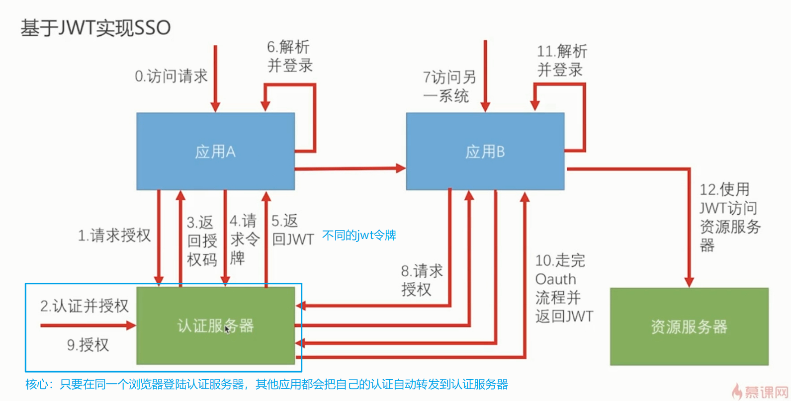

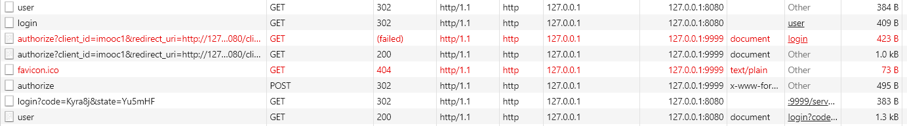

user和login后的JSSESSION会变更，然后state参数必须是内部设置，不能自定义，不然拿不到

爬虫模拟的时候所有的请求都要模拟一次，特别是获取state那一个


##  1. 认证流程

1. 第一次login，拿到cookie和重定向url和state

   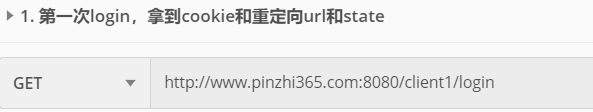

   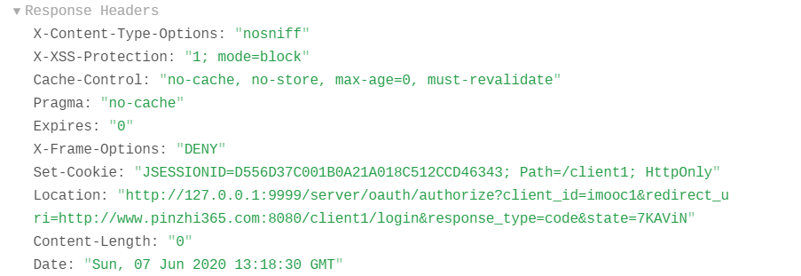

   

2. 向server请求code，client用户basic登录，建立authentication request 的所属cookie

   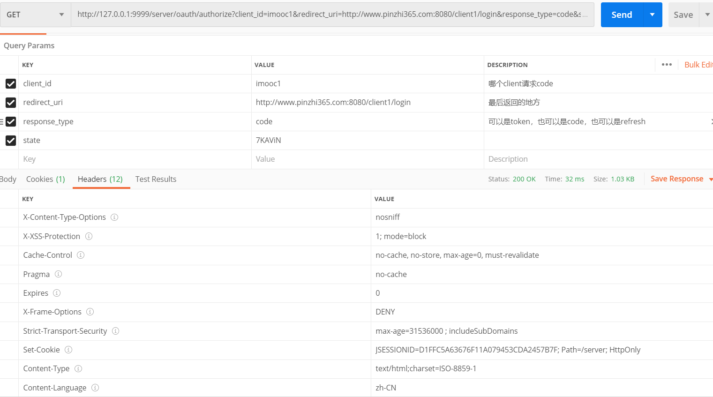

3. 用户在server授权，需要basic认证，cookie关联authentication request，自动重定向回client端

   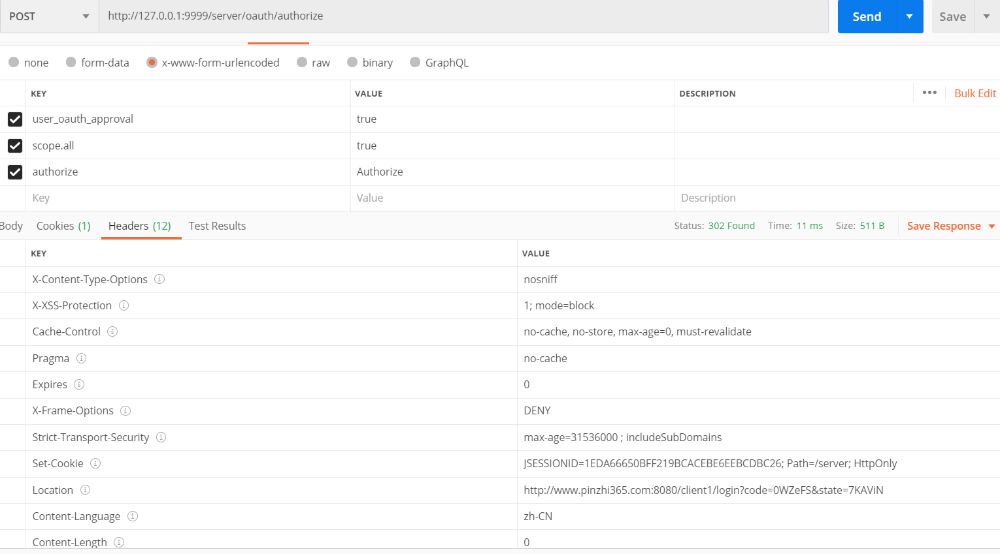

4. 第二次login，server重定向回login，第三次是client内部做，我们不需要自己做，此是刷新cookie，为认证成功状态

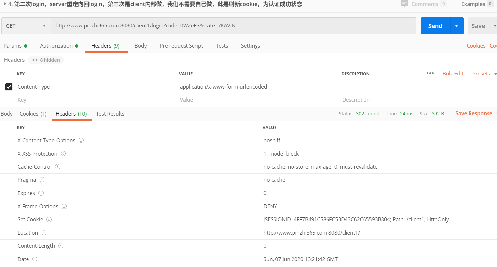

5.  使用cookie请求user，向client1

   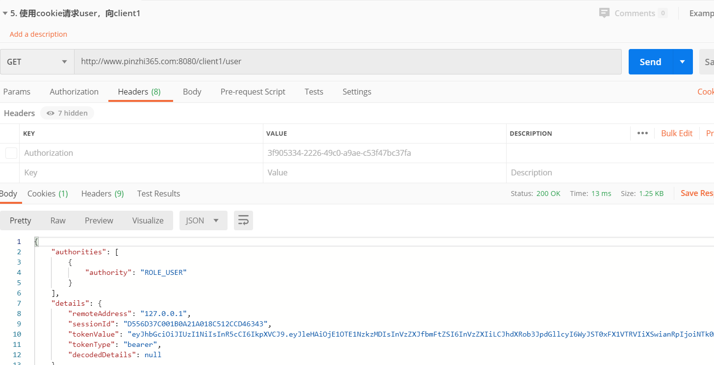

   

## 2. 表单登陆和定制用户

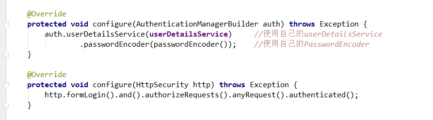

## 3. 用户授权

**1. 默认控制用户授权的类**

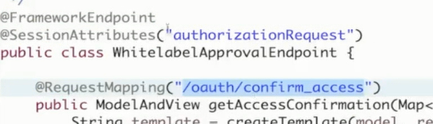

**2. 重写改类**

## 4. 改造成认证服务器、资源服务器分离

只需要在

```java
@SpringBootApplication
@RestController
@EnableOAuth2Sso //启动Sso单点登陆
@EnableResourceServer//改造成资源服务器，上面@EnableOAuth2Sso所引入的filter无效了
public class SsoClient1Application {
```

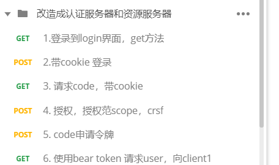