# 3-10 使用多线程提高REST服务性能

## 异步处理 REST 服务

* **使用 Runnable 异步处理 REST 服务**

  > 控制器内部自己调用线程

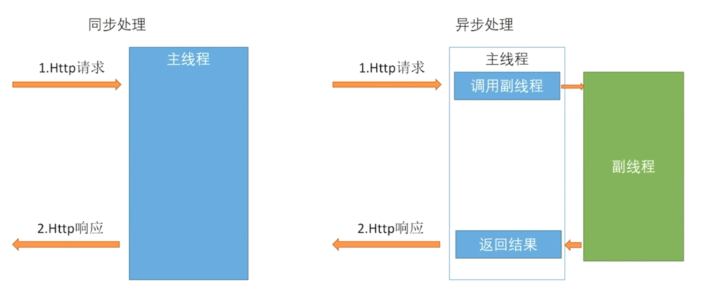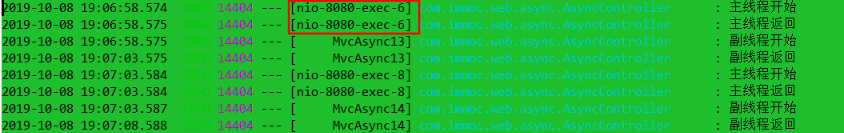主线程很快就结束了

* **使用 DeferredResult 异步处理 REST 服务**

> 控制器内部不启动线程，只传给消息队列，然后监听消息队列返回的信息，修改DeferredResult 

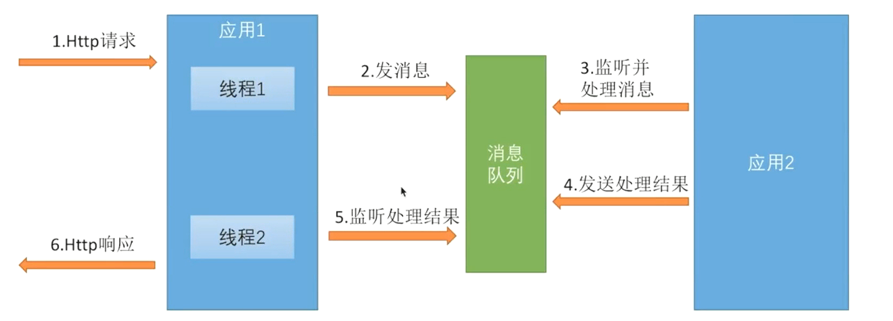

* **异步处理配置**


> 一个有四个配置，两个拦截器，默认超时时间；线程池

- [ ] **如何体现？不知道！！？？？**

  主线程怎么会结束，原理是什么

# 4-1 简介

## Spring Security 核心功能

- 认证（你是谁）
- 授权（你能干什么）
- 攻击防护（防止伪造身份）

## Spring Security 开发基于表单的认证

### 内容简介

- Spring Security 基本原理
- 实现用户名 + 密码认证
- 实现手机号 + 短信认证

# 4-2 SpringSecurity默认配置

> 只要一加入jar包，spring boot就会自动添加最基础的配置

```xml
<dependency>
    <groupId>org.springframework.cloud</groupId>
    <artifactId>spring-cloud-starter-oauth2</artifactId>
</dependency>
```

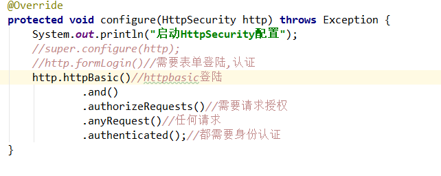

```java
//看文档注释
//默认Basic方式登陆,默认用户名user,密码会在控制台输出，使用以下的filter进行认证
org.springframework.security.web.authentication.www.BasicAuthenticationFilter
    //处理 Authorization header，认证、鉴权成功，继续doFilter直至鉴权和restAPI
    //认证失败则默认不再进入
    
    //安全性低，文档建议使用digest认证
    org.springframework.security.web.authentication.www.DigestAuthenticationFilter
```


# 4-3 自定义用户获取逻辑，UserDetailsService

## 自定义用户认证逻辑（都是接口，并且都是bean）

1. **处理用户信息获取逻辑**

> `UserDetailsService`

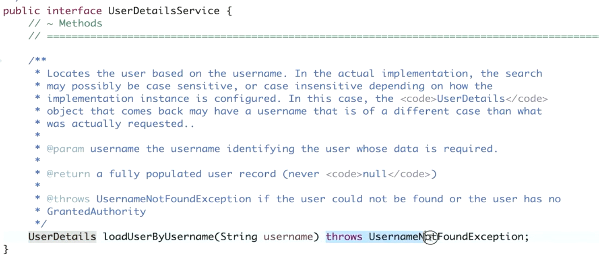

------


- **2. 处理用户校验逻辑**            

  > `UserDetails`

  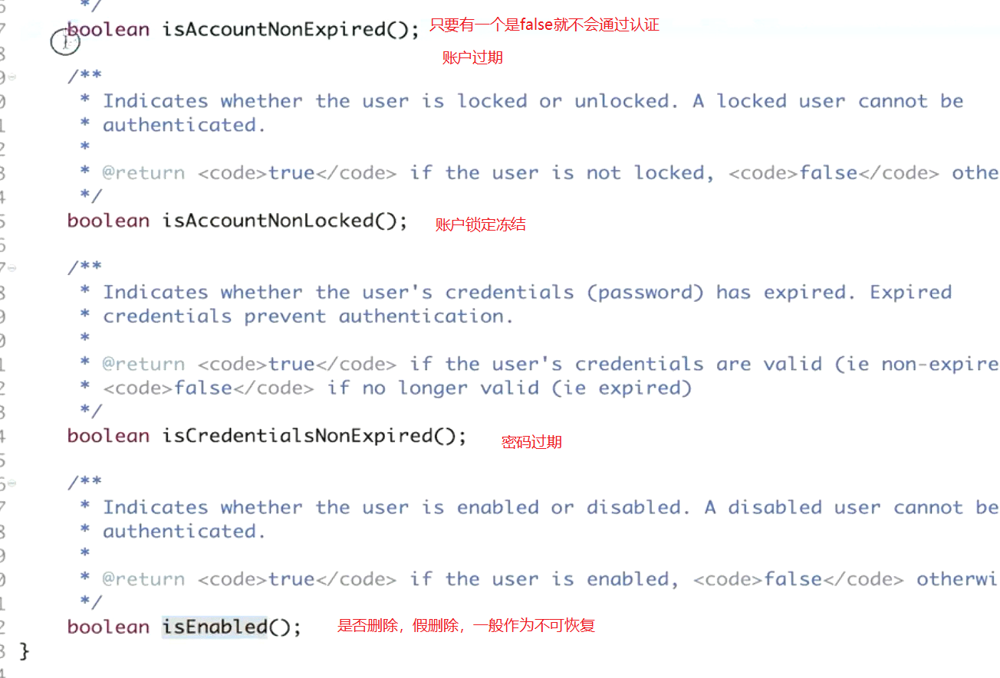

  ------

  

- **3. 处理密码加密解密**          

  > `PasswordEncoder`

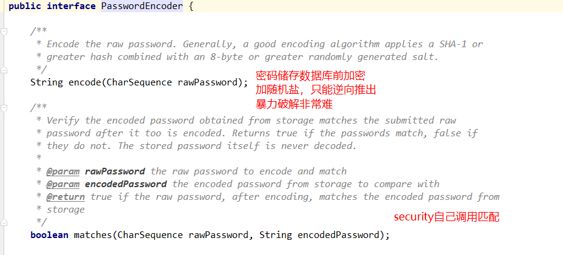

```java
public class BCryptUtil {

    /**
     * 每次都不一样，结果应该包含了某些信息
     */
    public static String encode(String password) {
        PasswordEncoder passwordEncoder = new BCryptPasswordEncoder();
        String hashPass = passwordEncoder.encode(password);
        return hashPass;
    }

    /**
     * 只要hashPass是用同一个密码生成的，那一定能对上
     */
    public static boolean matches(String password, String hashPass) {
        PasswordEncoder passwordEncoder = new BCryptPasswordEncoder();
        boolean f = passwordEncoder.matches(password, hashPass);
        return f;
    }

    public static void main(String[] args) {
        System.out.println(matches("sdfsdf", encode("sdfsdf")));//true
    }
}
```

# 4-4 个性化用户认证流程

### 问题

1. 访问权限限制url需要重定向的url
2. 设置重定向url（一般为登录页面的url），可以自定义html地址或者其他响应报文
3. 如何设置表单登录
4. 登录成功：往session中写入securityContext，然后返回成功信息或者跳转请求（如果有缓存），下次用户请求资源就会从session中拿securityContext
5. 登录失败如何处理

### **自定义登陆页面**

**也就是要不要进入真正的登陆页面**

`http.formLogin().loginPage("/authentication/require")`  


------

### 表单登录

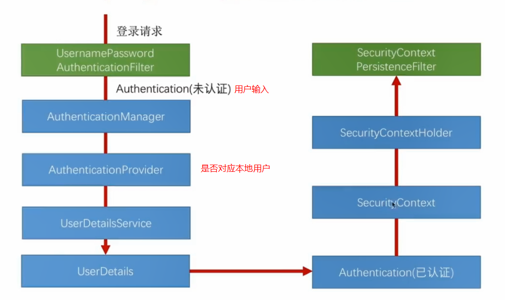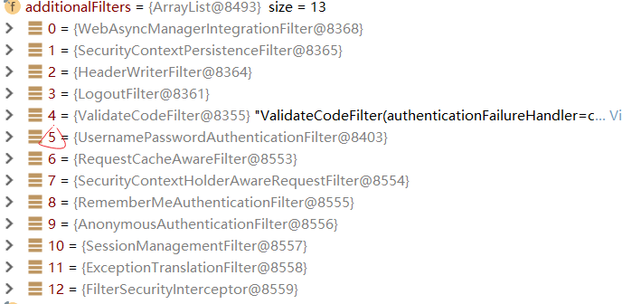

```java
@Override
protected void configure(HttpSecurity http) throws Exception {
    http.formLogin()
      .loginPage("/login.html")//登录页面
      .loginProcessingUrl("/perform_login")//表单提交的url
      .defaultSuccessUrl("/homepage.html",true)
      .failureUrl("/login.html?error=true")//默认handler SimpleUrlAuthenticationFailureHandler 的url
}
```

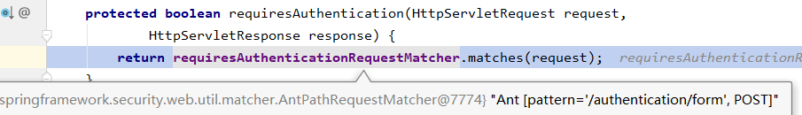

### **自定义登陆成功处理**

`AuthenticationSuccessHandler`

- **spring security默认处理**

> 直接访问其他页面html，登陆后，是跳到引发登陆的那个请求上；
>
> 现在通常是前端发送一个ajax访问认证url ，登陆后，直接返回index.html，不怎么好； 例子如下

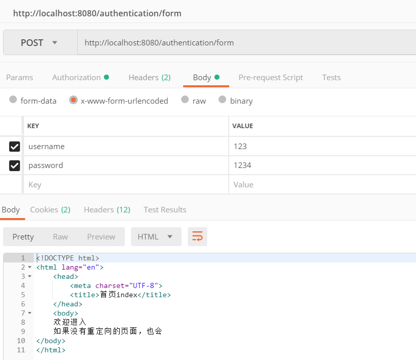

- **异步请求，直接请求`loginProcessingUrl`**

配合前后端分离，后端不再负责返回html页面，不需要转发，登陆是单独的请求，并且是异步的，无需在登陆成功后重启请求，此时需要自定义json返回

------


### 自定义登陆失败处理

`AuthenticationFailureHandler`

> 对于restful请求，如果没认证成功则需要返回json数据，而不是html


### 系统配置封装

- SecurityProperties

- BrowserProperties

- ValidateCodeProperties

- OAuth2Properties

- SocialProperties

  	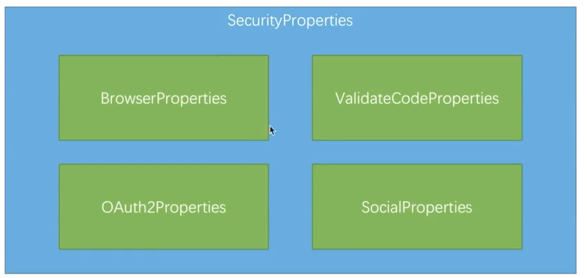

# 4-7 图片验证码

## 实现图形验证码功能

- 开发生成图形验证码接口
- 在认证流程中加入图形验证码校验filter，成功下一个，失败写响应报文
- 重构代码

## 生成图形验证码

- 根据随机数生成图片
- 将随机数存到 Session 中
- 将生成的图片写到接口的响应中

## 重构图形验证码接口

- 验证码基本参数可配置
- 验证码拦截的接口可配置
- 验证码的生成逻辑可配置

### 验证码基本参数可配置

- 默认配置

  > 配置值写在 imooc-security-core

- 应用级配置

  > 配置值写在 imooc-security-demo

- 请求级配置

  > 配置值在调用接口时传递

## **验证码的生成逻辑可配置**

> 扩张功能使用接口，自定义一个默认实现类；另外接口的实际实现类可以更改
>
> 应用到spring用bean工厂搭配@`ConditionalOnMissingBean`

# 4-9 添加记住我功能

## 实现"记住我"功能

其实就是把sessionid持久化了，不止在服务器中，这样服务器重新启动不需要再次登录。类似于把session存储到外部环境。直接用jwt或者redis做session不是更好。还要多此一举。

- 记住我功能基本原理
- 记住我功能具体实现
- 记住我功能 Spring Security 源码解析

### 记住我基本原理


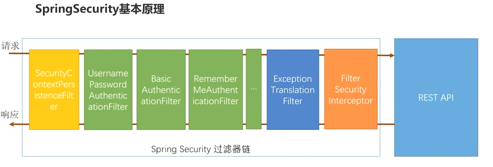

也可以再url请求添加true，1，on等参数来实现个性定制，属于非强制选项，但有默认选项

# 4-10 短信验证码接口开发

## 实现短信验证码登陆

> 这一掌重要的是思想：分层设计，抽象类居中（多态），依赖搜索，
>
> 全部采用接口

### 1. 开发短信验证码接口

### 2. 校验短信验证码并登陆

> **关键： 可扩展性——→其中功能都用接口代替，实体类都用父类子类架构**

### 3. 重构代码

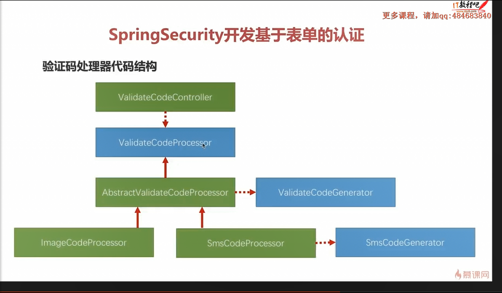

**依赖搜索**

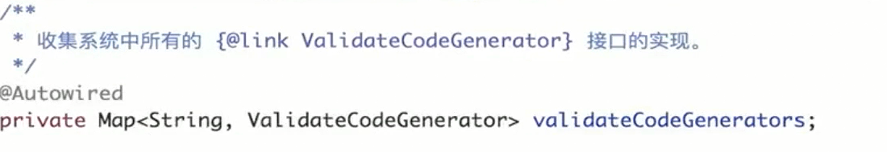

- 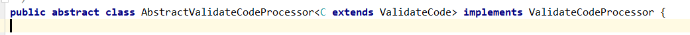

  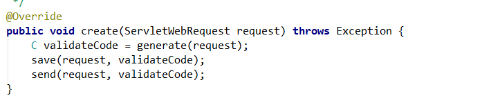

# 4-11 短信登录开发

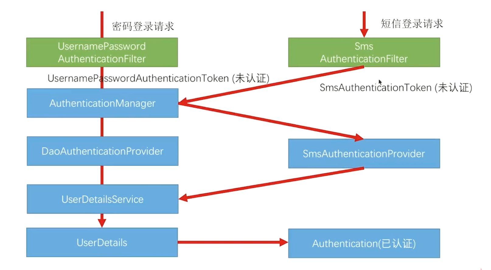

# 4-12 短信登录配置及重构

## imooc-security-core

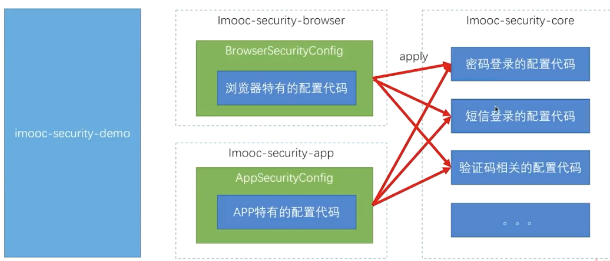

## imooc-security-browser

- 浏览器特有的配置代码

  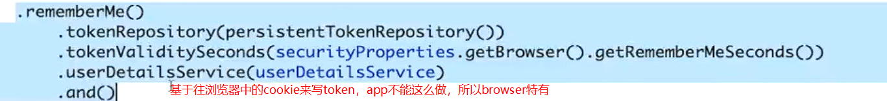

## imooc-security-app

- App特有的配置代码

 


> ValidateCodeSecurityConfig注入一个validateCodeFilter
> 	封装url和对应的type进map（多个对象处理同一个东西）
> 	请求到达，开始doFilter
> 			根据url查找出请求的的ValidateCodeType
> 			根据ValidateCodeType找到对应的processor来validate	
>
> ​	