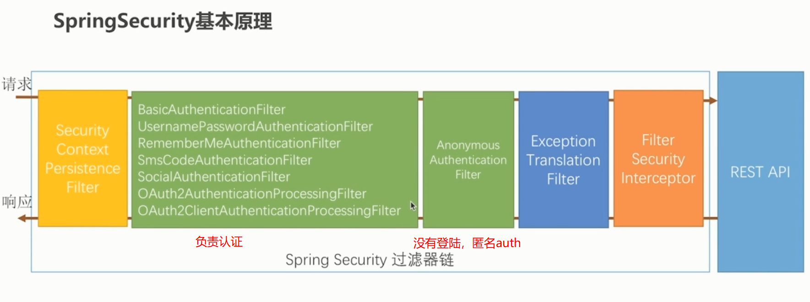
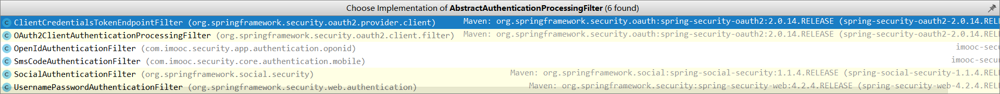
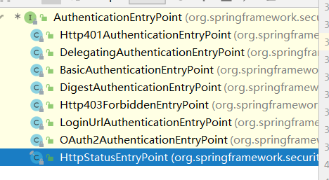
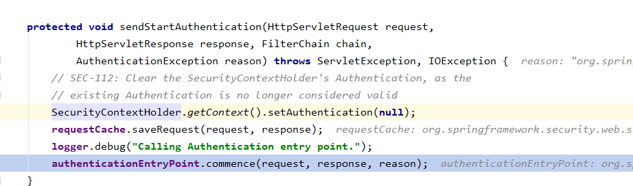

# 基本原理

每个版本都可能有filter和设置更新的，要看官方文档啊

[基础架构](https://docs.spring.io/spring-security/reference/5.7/servlet/architecture.html#servlet-filters-review)


spring security 是单独的模块，在servlet中是一个filter，因此需要注册到tomcat中，用[ WebApplicationInitializer](https://docs.spring.io/spring/docs/3.2.x/spring-framework-reference/html/mvc.html#mvc-container-config)，如果是spring-boot那么就已经自动注册好了，在这个类中org.springframework.boot.autoconfigure.security.servlet.SecurityFilterAutoConfiguration。

## SecurityFilterChain 过滤器链

* 请求
* UsernamePasswordAuthenticationFilter    *表单登陆*
* BasicAuthenticationFilter    *Http Basic认证*
* ...
* ExceptionTranslationFilter    *异常处理，认证鉴权失败处理响应报文*
* FilterSecurityInterceptor    *最终处理是否通过认证*
* REST API
* 响应 （如果没有进入restApi，自定义的filter也没有写响应报文和响应体，那么返回的报文是没有响应体的）




## Spring Security的核心组件

核心是security context，在整个链条中流动。filter都是在crud security context。security context一般从SecurityContextRepository中crud，然后放在security context holder中（线程变量）。

spring security两个入口filter分别如下：

- AbstractAuthenticationProcessingFilter(`主要处理登录`)，各种认证filter的抽象类
- FilterSecurityInterceptor(`主要处理鉴权`)
  - 所有的请求到了这一个filter，如果这个filter之前没有执行过的话，那么首先执行的InterceptorStatusToken token = super.beforeInvocation(fi);这个是由AbstractSecurityInterceptor提供。它就是spring security处理鉴权的入口。 

而SecurityContextPersistenceFilter主要是为这两个filter准备security context，可能事后也会更新。



- ```java
  SecurityContextHolder	;//提供对SecurityContext的访问，使用ThreadLocal实现线程持有
  SecurityContext			;//持有Authentication对象和其他可能需要的信息
  
  //1. 认证
  AuthenticationManager 	;//其中可以包含多个AuthenticationProvider，Processes an {@link Authentication} request.
  	ProviderManager 		;//对象为AuthenticationManager接口的实现类
  AuthenticationProvider 	;//主要用来进行认证操作的类 调用其中的authenticate()方法去进行认证操作，Indicates a class can process a specific Authentication implementation
  Authentication			;//Spring Security方式的认证主体
  GrantedAuthority		;//对认证主题的应用层面的授权，含当前用户的权限信息，通常使用角色表示
  UserDetails				;//构建Authentication对象必须的信息，可以自定义，可能需要访问DB得到
  UserDetailsService		;//通过username构建UserDetails对象
  
  //2. 失败
  AuthenticationEntryPoint	;//认证失败、鉴权失败后的进入点，提示需要再次进入认证点，相当于controller，实现commence(...)中写报文
  
  //3. 如何保存认证状态
    //filter，里面使用SecurityContextRepository接口把SecurityContext存储起来，保存本次session的认证状态。因此可以根据需要使用不同的SecurityContextRepository实现类。注意由于保存认证状态是处理完controller之后，所以需要注意。
    org.springframework.security.web.context.SecurityContextPersistenceFilter;
    // Used by SecurityContextPersistenceFilter to obtain the context which should be used for the current thread of execution and to store the context once it has been removed from thread-local storage and the request has completed.
    // The persistence mechanism used will depend on the implementation, but most commonly the HttpSession will be used to store the context.
    	  org.springframework.security.web.context.SecurityContextRepository
        //实现类 
        org.springframework.security.web.context.HttpSessionSecurityContextRepository //一般用这个
       		// 认证成功后在这个方法中会把context security存入session，如果改写了，那么就在
        		org.springframework.security.web.authentication.SavedRequestAwareAuthenticationSuccessHandler#onAuthenticationSuccess
        org.springframework.security.web.context.NullSecurityContextRepository; // 开启@EnableResourceServer后使用这个
  
    //* A pre-authentication filter for OAuth2 protected resources. Extracts an OAuth2 token from the incoming request and
    //* uses it to populate the Spring Security context with an {@link OAuth2Authentication} (if used in conjunction with an
    //* {@link OAuth2AuthenticationManager}).
    org.springframework.security.oauth2.provider.authentication.OAuth2AuthenticationProcessingFilter //配合NullSecurityContextRepository
  ```

​      


  

## filter顺序

spring security内置的各种filter：

| Alias                        | Filter Class                                                 | Namespace Element or Attribute         |
| :--------------------------- | :----------------------------------------------------------- | :------------------------------------- |
| CHANNEL_FILTER               | ChannelProcessingFilter                                      | http/intercept-url@requires-channel    |
| SECURITY_CONTEXT_FILTER      | SecurityContextPersistenceFilter                             | http                                   |
| CONCURRENT_SESSION_FILTER    | ConcurrentSessionFilter                                      | session-management/concurrency-control |
| HEADERS_FILTER               | HeaderWriterFilter                                           | http/headers                           |
| CSRF_FILTER                  | CsrfFilter                                                   | http/csrf                              |
| LOGOUT_FILTER                | LogoutFilter                                                 | http/logout                            |
| X509_FILTER                  | X509AuthenticationFilter                                     | http/x509                              |
| PRE_AUTH_FILTER              | AbstractPreAuthenticatedProcessingFilter Subclasses          | N/A                                    |
| CAS_FILTER                   | CasAuthenticationFilter                                      | N/A                                    |
| FORM_LOGIN_FILTER            | UsernamePasswordAuthenticationFilter                         | http/form-login                        |
| BASIC_AUTH_FILTER            | BasicAuthenticationFilter                                    | http/http-basic                        |
| SERVLET_API_SUPPORT_FILTER   | SecurityContextHolderAwareRequestFilter                      | http/@servlet-api-provision            |
| JAAS_API_SUPPORT_FILTER      | JaasApiIntegrationFilter                                     | http/@jaas-api-provision               |
| REMEMBER_ME_FILTER           | RememberMeAuthenticationFilter                               | http/remember-me                       |
| ANONYMOUS_FILTER             | AnonymousAuthenticationFilter                                | http/anonymous                         |
| SESSION_MANAGEMENT_FILTER    | [SessionManagementFilter](https://blog.csdn.net/andy_zhang2007/article/details/84896907) | session-management                     |
| EXCEPTION_TRANSLATION_FILTER | ExceptionTranslationFilter                                   | http                                   |
| FILTER_SECURITY_INTERCEPTOR  | FilterSecurityInterceptor                                    | http                                   |
| SWITCH_USER_FILTER           | SwitchUserFilter                                             | N/A                                    |

## FilterChainProxy

用于启动spring-security的所有internal-filter，delegate 给内部filter，spring-security的入口

## SecurityContextPersistenceFilter

> 可以看到SecurityContextPersistenceFilter优先级仅次于ChannelProcessingFilter

> SecurityContextPersistenceFilter代理给SecurityContextRepository接口。`HttpSessionSecurityContextRepository`往session存取名为`SPRING_SECURITY_CONTEXT`，值为`SecurityContext`的attribute，来为后续filter建立所需的上下文，包括登录态。其中：
>
> - before filter取出或创建新的context，放在线程中，tomcat一个请求一条线程
>
> - AbstractAuthenticationProcessingFilter认证成功后，见authentication写入context
>
> - 认证成功后可能获取savedRequest然后处理鉴权，
>
>   能否进入controller，处理request，写入响应报文，然后返回filter
>
> - `chain.doFilter(holder.getRequest(), holder.getResponse())`  后，保存context到request相关的session（http无状态），然后把context从线程中消去

# [配置](https://docs.spring.io/spring-security/reference/5.7/servlet/configuration/java.html)

## spring-security

@EnableWebSecurity启动spring-security。

WebSecurityConfiguration通过WebSecurity,创建核心filter bean `springSecurityFilterChain`，所有的配置最终都到WebSecurity，实际上只是一个builder，用来build filter。WebSecurity里面包含了SecurityFilterChains，封装成SecurityBuilders。

`org.springframework.security.config.annotation.web.configuration.WebSecurityConfiguration#springSecurityFilterChain`

SecurityFilterChain是通过httpsecurity来创建的。而HttpSecurityConfiguration暴露了一个原型httpSecurity，来供外部使用。

自己的项目配置只需要输出几个SecurityFilterChain bean就行了。每个bean控制各自的url，需要认真的部分。

WebSecurityCustomizer也可以配合控制，指出不需要认证的部分。

```
     @Bean
     public SecurityFilterChain securityFilterChain(HttpSecurity http) throws Exception {
         http
             .authorizeHttpRequests((authz) ->
                 authz.anyRequest().authenticated()
             );
             // ...
         return http.build();
     }

    @Bean
    public WebSecurityCustomizer webSecurityCustomizer() {
        return (web) -> web.ignoring().antMatchers("/resources/**");
    }
```

WebSecurityConfigurerAdapter已经被弃用了。是以前的方法。也是用httpSecurity build。

https://spring.io/blog/2022/02/21/spring-security-without-the-websecurityconfigureradapter

# oauth

open auth 的一些常规用法，介绍，也就是各个角色和如何实现，

重定向到第三方，然后授权登陆，再重定向回来，拿到token后，然后就可以走自己的逻辑了

 

通过open auth实现的单点登录其实是第三方登录，只是做成了注解，自动化配置，整合自己的登录

#  bulder和configurer

各种builder，依靠各种configurer来配置内部东西，几乎一个configurer等于添加一个配置，然后是一个list

Websecurity 依靠 web adapter 配 http security

httpsecurity依靠各种configurer添加filter 

然后authenticationmanager builder也是依靠各种configurer来创建内部东西

# 参考文献

[官网](https://docs.spring.io/spring-security/reference/servlet/authentication/persistence.html)

https://github.com/spring-projects/spring-security-samples/tree/6.2.x

https://blog.csdn.net/liuyanglglg/category_9821787.html | spring security_Young~^_^的博客-CSDN博客
https://www.cnblogs.com/lywJ/p/10985259.html | Spring Security(四) —— 核心过滤器源码分析 - lywJee - 博客园
https://www.javaboy.org/categories/Spring-Security/page/6/ | 分类: Spring Security - 江南一点雨

新版本教程合集

[111](https://mp.weixin.qq.com/mp/appmsgalbum?__biz=MzI1NDY0MTkzNQ==&action=getalbum&album_id=1319828555819286528&scene=173&subscene=&sessionid=svr_45de9b4b25d&enterid=1729908155&from_msgid=2247489207&from_itemidx=1&count=3&nolastread=1#wechat_redirect | #SpringSecurity系列__)

[222](https://mp.weixin.qq.com/mp/appmsgalbum?__biz=MzI1NDY0MTkzNQ==&action=getalbum&album_id=1319833457266163712&scene=173&subscene=&sessionid=svr_1edce44d2d1&enterid=1729341552&from_msgid=2247488267&from_itemidx=2&count=3&nolastread=1#wechat_redirect | #OAuth2系列__)

[3333](https://mp.weixin.qq.com/mp/appmsgalbum?__biz=MzI1NDY0MTkzNQ==&action=getalbum&album_id=1818393942174810113&scene=173&subscene=&sessionid=svr_a44ba8e97fa&enterid=1722401978&from_msgid=2247503768&from_itemidx=1&count=3&nolastread=1#wechat_redirect | #SpringSecurity)

https://www.javaboy.org/categories/Spring-Security/ | 分类: Spring Security - 江南一点雨