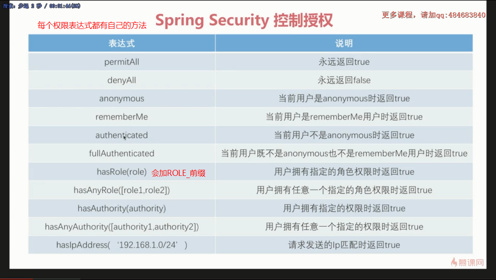
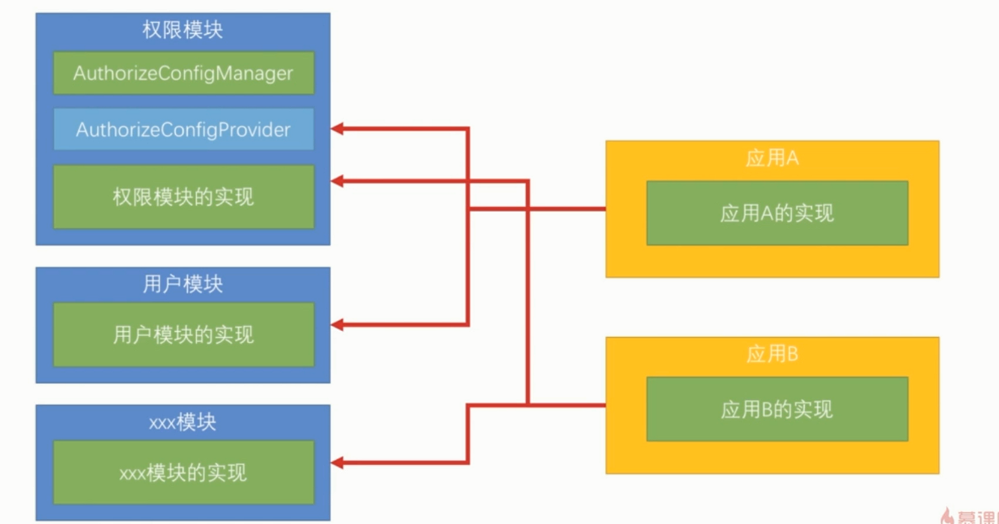
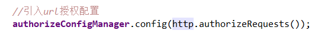
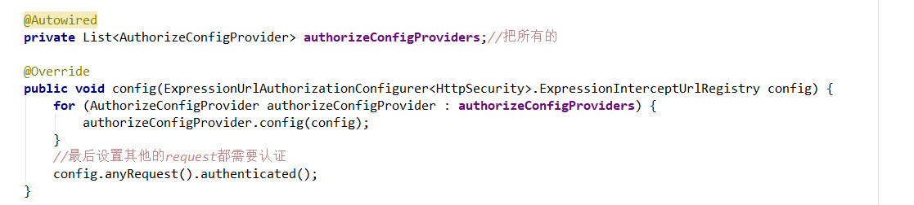
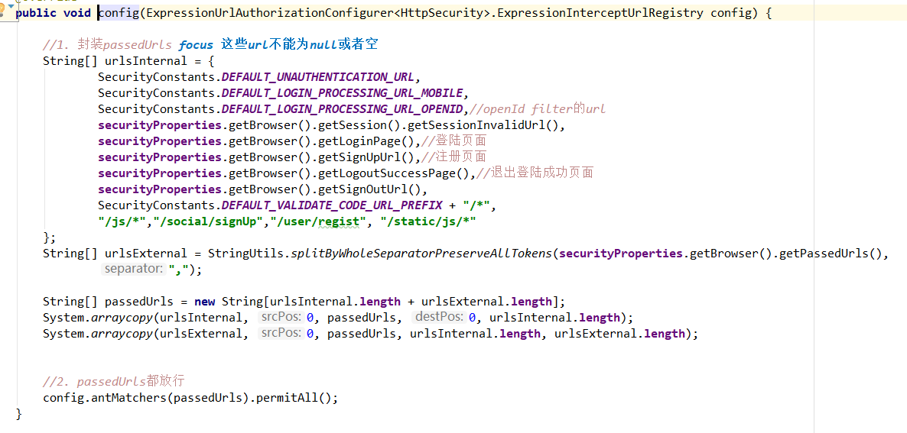
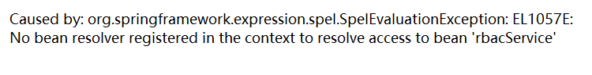

# 原理


# 源码

```java
//具体逻辑和这个类的一样，但是spring security没有使用这个类
org.springframework.security.web.access.DefaultWebInvocationPrivilegeEvaluator;
//这里是鉴权的方法体
InterceptorStatusToken token = super.beforeInvocation(fi);
Collection<ConfigAttribute> attributes = this.obtainSecurityMetadataSource().getAttributes(object);
this.accessDecisionManager.decide(authenticated, object, attributes);
org.springframework.security.web.access.expression.WebExpressionVoter#vote
org.springframework.security.access.expression.ExpressionUtils#evaluateAsBoolean
```

# 权限表达式

默认底层都是通过权限表达式来判断是否有权限

 https://www.iteye.com/blog/elim-2247073 

**基本的权限表达式**（返回boolean）



**合并的权限表达式**


# 实操添加权限

## spring security 配置类

之前一直使用的配置，硬代码控制。

### 优化1：配置文件

把权限配置加入到配置文件，读取到配置类

### 优化2：模块化配置

写一个代理类收集所有的配置bean，然后迭代注入配置。可以做到模块化，提供子接口给其他人用










## 全球方法注解控制权限

比较死板，写死了的，主要是用于不能修改的某些基础资源

 https://blog.csdn.net/lizc_lizc/article/details/84189915 


​					 [代码地址](https://github.com/923226145/SpringSecurity/tree/master/chapter11)  https://github.com/923226145/SpringSecurity/tree/master/chapter11 

## 基于数据库Rbac数据模型控制权限，动态修改权限

> 这种方法会屏蔽权限表达式和方法权限注解

### 数据库模型

> 需要配合数据库使用，这里的关键是连接数据库读取用户拥有的角色和角色拥有的urls


## 权限表达式调用service层

> 把用户拥有的权限和request请求对应起来，然后判断（自己实现的权限表达式）

```java
//动态获取权限
@Component("rbacService")
public class RbacServiceImpl implements RbacService {

	private AntPathMatcher antPathMatcher = new AntPathMatcher();

	/**
	 * 把用户的所有有权限的url和request中的url比较，返回boolean
	 * <p>
	 * 这里默认一律返回false
	 */
	@Override
	public boolean hasPermission(HttpServletRequest request, Authentication authentication) {
		//1. 默认permission为null
		boolean hasPermission = false;

		//2. 从auth中拿出userDetails,如果认证成功会有一个
		Object principal = authentication.getPrincipal();
		if (principal instanceof UserDetails) {

			String username = ((UserDetails) principal).getUsername();
			//3. 读取用户所拥有权限的所有URL，根据用户--角色--资源
			//..数据库代码
			Set<String> urls = new HashSet<>();
			//逐个比较
			for (String url : urls) {
				if (antPathMatcher.match(url, request.getRequestURI())) {
					hasPermission = true;
					break;
				}
			}
		}
		//4. 返回
		return hasPermission;
	}

}

//配置权限表达式使用service层
@Component
@Order(Integer.MIN_VALUE)
public class DemoAuthorizeConifgProvider implements AuthorizeConfigProvider {

	@Autowired
	private RbacService rbacService;

	@Override
	public void config(ExpressionUrlAuthorizationConfigurer<HttpSecurity>.ExpressionInterceptUrlRegistry config) {

		//role角色大小要对的上
		config.antMatchers("/user").hasRole("USER");
		//config.antMatchers("/user").hasRole("USER");

		//使用rbacService的权限表达式
		config.anyRequest().access("@rbacService.hasPermission(request, authentication)");

	}

}
```


# 异常

​	

**解决：**https://github.com/spring-projects/spring-security-oauth/issues/730 