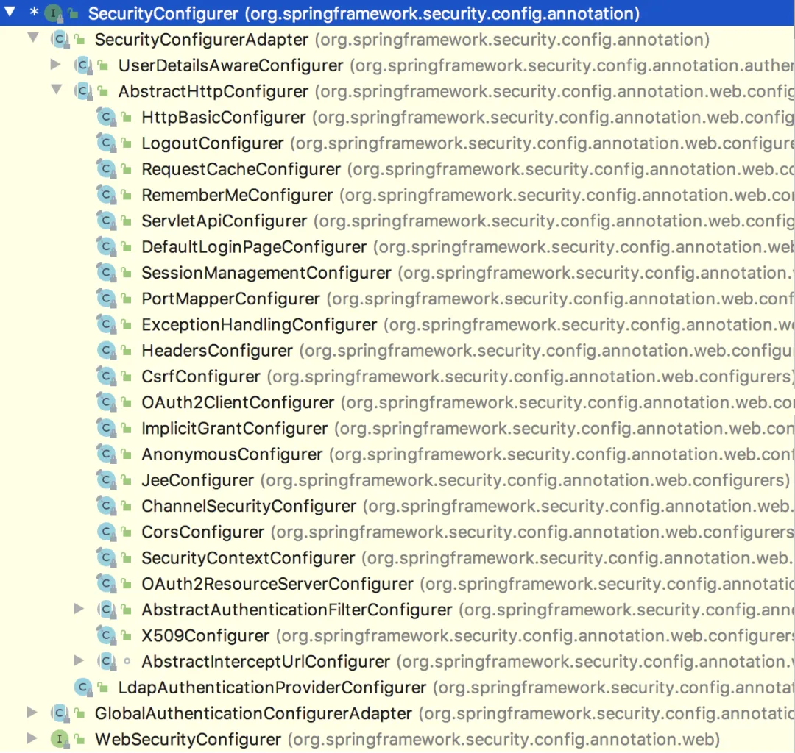
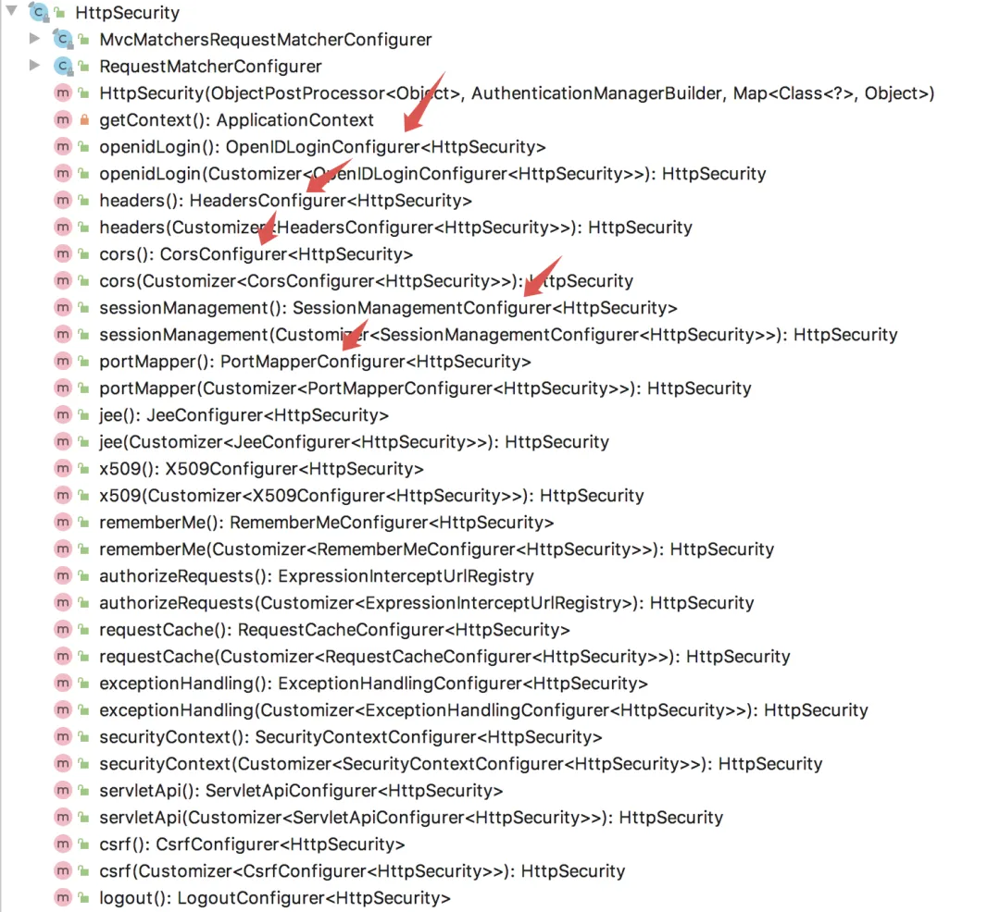

# Spring Security 配置中的 and 到底该怎么理解？

Original 江南一点雨 [江南一点雨](javascript:void(0);) *2020年06月24日 08:08*

松哥原创的 Spring Boot + Spring Security系列视频教程已经杀青，感兴趣的小伙伴戳这里-->[Spring Boot+Vue+微人事视频教程](https://mp.weixin.qq.com/s?__biz=MzI1NDY0MTkzNQ==&mid=2247488799&idx=1&sn=cdfd5315ff18c979b6f5d390ab4d9059&scene=21#wechat_redirect)

我们先来看一个简单的配置：

```
@Override
protected void configure(HttpSecurity http) throws Exception {
    http.authorizeRequests()
            .anyRequest().authenticated()
            .and()
            .formLogin()
            .loginProcessingUrl("/doLogin")
            .permitAll()
            .and()
            .logout()
            .logoutUrl("/logout")
            .permitAll()
            .and()
            .csrf().disable();
}
```

这样的配置在 Spring Security 中很常见，通过 and 方法，可以将所有的配置连接在一起，一条线下来，所有的东西都配置好了。

但是有小伙伴对这里的 and 表示很迷，不知道什么时候 and 方法该出场，什么时候 and 不该出场！

所以今天松哥就花点时间来和大家聊一下这里的 and 方法，希望大家看完完整后，能够明白 and 到底怎么玩！

本文是 Spring Security 系列第 33 篇，阅读前面文章有助于更好的理解本文：

1. [挖一个大坑，Spring Security 开搞！](https://mp.weixin.qq.com/s?__biz=MzI1NDY0MTkzNQ==&mid=2247488106&idx=1&sn=258fc609661f22de5517e1bc5c0915ed&scene=21#wechat_redirect)
2. [松哥手把手带你入门 Spring Security，别再问密码怎么解密了](https://mp.weixin.qq.com/s?__biz=MzI1NDY0MTkzNQ==&mid=2247488113&idx=1&sn=01168c492e22fa287043eb746950da73&scene=21#wechat_redirect)
3. [手把手教你定制 Spring Security 中的表单登录](https://mp.weixin.qq.com/s?__biz=MzI1NDY0MTkzNQ==&mid=2247488138&idx=1&sn=25d18a61a14e4e6316537b6d45e43dd4&scene=21#wechat_redirect)
4. [Spring Security 做前后端分离，咱就别做页面跳转了！统统 JSON 交互](https://mp.weixin.qq.com/s?__biz=MzI1NDY0MTkzNQ==&mid=2247488157&idx=2&sn=845178d45e73232a94ed46df12ea76cc&scene=21#wechat_redirect)
5. [Spring Security 中的授权操作原来这么简单](https://mp.weixin.qq.com/s?__biz=MzI1NDY0MTkzNQ==&mid=2247488185&idx=1&sn=6fe677703312905d39615a001e191bd2&scene=21#wechat_redirect)
6. [Spring Security 如何将用户数据存入数据库？](https://mp.weixin.qq.com/s?__biz=MzI1NDY0MTkzNQ==&mid=2247488194&idx=1&sn=7103031896ba8b9d34095524b292265e&scene=21#wechat_redirect)
7. [Spring Security+Spring Data Jpa 强强联手，安全管理只有更简单！](https://mp.weixin.qq.com/s?__biz=MzI1NDY0MTkzNQ==&mid=2247488229&idx=1&sn=2911c04bf19d41b00b4933d4044590f8&scene=21#wechat_redirect)
8. [Spring Boot + Spring Security 实现自动登录功能](https://mp.weixin.qq.com/s?__biz=MzI1NDY0MTkzNQ==&mid=2247488300&idx=1&sn=5f08f7d5c9e98a0eb89eeb999b83c66b&scene=21#wechat_redirect)
9. [Spring Boot 自动登录，安全风险要怎么控制？](https://mp.weixin.qq.com/s?__biz=MzI1NDY0MTkzNQ==&mid=2247488306&idx=2&sn=97966ecdad08575eb466dc6dfc717097&scene=21#wechat_redirect)
10. [在微服务项目中，Spring Security 比 Shiro 强在哪？](https://mp.weixin.qq.com/s?__biz=MzI1NDY0MTkzNQ==&mid=2247488312&idx=1&sn=61e67f7ca0f8a55749dcb064b9456a38&scene=21#wechat_redirect)
11. [SpringSecurity 自定义认证逻辑的两种方式(高级玩法)](https://mp.weixin.qq.com/s?__biz=MzI1NDY0MTkzNQ==&mid=2247488364&idx=1&sn=fd69d3f218e0b4ab4bad96ec623f5a33&scene=21#wechat_redirect)
12. [Spring Security 中如何快速查看登录用户 IP 地址等信息？](https://mp.weixin.qq.com/s?__biz=MzI1NDY0MTkzNQ==&mid=2247488386&idx=2&sn=fd36262c28bc1f03493d2c0e5262d106&scene=21#wechat_redirect)
13. [Spring Security 自动踢掉前一个登录用户，一个配置搞定！](https://mp.weixin.qq.com/s?__biz=MzI1NDY0MTkzNQ==&mid=2247488392&idx=2&sn=e350435c511041021c254137fbe2fa3e&scene=21#wechat_redirect)
14. [Spring Boot + Vue 前后端分离项目，如何踢掉已登录用户？](https://mp.weixin.qq.com/s?__biz=MzI1NDY0MTkzNQ==&mid=2247488399&idx=1&sn=73a4875d272fcb1aa8c26f7e94bb692f&scene=21#wechat_redirect)
15. [Spring Security 自带防火墙！你都不知道自己的系统有多安全！](https://mp.weixin.qq.com/s?__biz=MzI1NDY0MTkzNQ==&mid=2247488496&idx=1&sn=3a153a207f112786a4ef1668f9d2a600&scene=21#wechat_redirect)
16. [什么是会话固定攻击？Spring Boot 中要如何防御会话固定攻击？](https://mp.weixin.qq.com/s?__biz=MzI1NDY0MTkzNQ==&mid=2247488533&idx=1&sn=65ac13778ba829806448979c5934d2b5&scene=21#wechat_redirect)
17. [集群化部署，Spring Security 要如何处理 session 共享？](https://mp.weixin.qq.com/s?__biz=MzI1NDY0MTkzNQ==&mid=2247488621&idx=1&sn=cb2f66b79fe3779f8d6f7ede91e37605&scene=21#wechat_redirect)
18. [松哥手把手教你在 SpringBoot 中防御 CSRF 攻击！so easy！](https://mp.weixin.qq.com/s?__biz=MzI1NDY0MTkzNQ==&mid=2247488656&idx=2&sn=f00c9c9d51caf76caa76a813961ba38a&scene=21#wechat_redirect)
19. [要学就学透彻！Spring Security 中 CSRF 防御源码解析](https://mp.weixin.qq.com/s?__biz=MzI1NDY0MTkzNQ==&mid=2247488680&idx=1&sn=dbadb73a552619aa42d10f4ac13ece6d&scene=21#wechat_redirect)
20. [Spring Boot 中密码加密的两种姿势！](https://mp.weixin.qq.com/s?__biz=MzI1NDY0MTkzNQ==&mid=2247488697&idx=1&sn=ce056ca96b2c5f0d6a83e67d1742a7c8&scene=21#wechat_redirect)
21. [Spring Security 要怎么学？为什么一定要成体系的学习？](https://mp.weixin.qq.com/s?__biz=MzI1NDY0MTkzNQ==&mid=2247488710&idx=1&sn=e89ed36d1141bc009b0d35954d4fe794&scene=21#wechat_redirect)
22. [Spring Security 两种资源放行策略，千万别用错了！](https://mp.weixin.qq.com/s?__biz=MzI1NDY0MTkzNQ==&mid=2247488812&idx=1&sn=4db81eb24508743076d93207046d1572&scene=21#wechat_redirect)
23. [松哥手把手教你入门 Spring Boot + CAS 单点登录](https://mp.weixin.qq.com/s?__biz=MzI1NDY0MTkzNQ==&mid=2247488872&idx=1&sn=3ac483e2e4b58b9940e1aa5458baddd8&scene=21#wechat_redirect)
24. [Spring Boot 实现单点登录的第三种方案！](https://mp.weixin.qq.com/s?__biz=MzI1NDY0MTkzNQ==&mid=2247488913&idx=1&sn=605b35708ddf3b0e6e32a170cd1aea57&scene=21#wechat_redirect)
25. [Spring Boot+CAS 单点登录，如何对接数据库？](https://mp.weixin.qq.com/s?__biz=MzI1NDY0MTkzNQ==&mid=2247488924&idx=2&sn=6b0d567181dd4d6b52c56894071ced1e&scene=21#wechat_redirect)
26. [Spring Boot+CAS 默认登录页面太丑了，怎么办？](https://mp.weixin.qq.com/s?__biz=MzI1NDY0MTkzNQ==&mid=2247488952&idx=2&sn=f5a16f45ef22ee28f37e41d08e6fecd5&scene=21#wechat_redirect)
27. [用 Swagger 测试接口，怎么在请求头中携带 Token？](https://mp.weixin.qq.com/s?__biz=MzI1NDY0MTkzNQ==&mid=2247488969&idx=1&sn=97edbfe4621c3b65d9b6af27158cb88c&scene=21#wechat_redirect)
28. [Spring Boot 中三种跨域场景总结](https://mp.weixin.qq.com/s?__biz=MzI1NDY0MTkzNQ==&mid=2247488989&idx=1&sn=00881de1a77c2e4027ee948164644485&scene=21#wechat_redirect)
29. [Spring Boot 中如何实现 HTTP 认证？](https://mp.weixin.qq.com/s?__biz=MzI1NDY0MTkzNQ==&mid=2247489048&idx=2&sn=7c5878a9255a51fa880284463ae0ff30&scene=21#wechat_redirect)
30. [Spring Security 中的四种权限控制方式](https://mp.weixin.qq.com/s?__biz=MzI1NDY0MTkzNQ==&mid=2247489063&idx=1&sn=4102eeb3af9ec768ba6254cad6312283&scene=21#wechat_redirect)
31. [Spring Security 多种加密方案共存，老破旧系统整合利器！](https://mp.weixin.qq.com/s?__biz=MzI1NDY0MTkzNQ==&mid=2247489069&idx=1&sn=c3120b71d8fd46748c4b6f85bb6dc738&scene=21#wechat_redirect)
32. [神奇！自己 new 出来的对象一样也可以被 Spring 容器管理！](https://mp.weixin.qq.com/s?__biz=MzI1NDY0MTkzNQ==&mid=2247489117&idx=1&sn=c4d557410ceecf00074623a9bc4a8430&scene=21#wechat_redirect)

## 1.原始配置

在 Spring Boot 出现之前，我们使用 Spring Security ，都是通过 XML 文件来配置 Spring Security 的，即使现在大家在网上搜索 Spring Security 的文章，还是能够找到很多 XML 配置的。

但是小伙伴们明白，无论是 XML 配置还是 Java 配置，只是在用不同的方式描述同一件事情，从这里角度来看，我们现在所使用的 Java 配置，和以前使用的 XML 配置，应该有某种异曲同工之妙。

可能有小伙伴没见过 XML 配置的 Spring Security，我在这里给大家简单举几个例子：

```
<http>
    <intercept-url pattern="/login" access="permitAll" />
    <form-login login-page="/login" />
    <http-basic />
</http>
```

这段 XML 大家稍微瞅一眼大概就能明白其中的含义：

1. intercept-url 相当于配置拦截规则
2. form-login 是配置表单登录
3. http-basic 是配置 HttpBasic 认证

如果我们使用了 Java 配置，这些 XML 配置都有对应的写法，例如 `.anyRequest().authenticated()` 就是配置拦截规则的，`.formLogin()` 是配置表单登录细节的。

仅仅从语义层面来理解，and 有点类似于 XML 中的结束标签，每当 and 出现，当前的配置项就结束了，可以开启下一个配置了。

那么从代码层面上，这个要如何理解呢？

## 2.代码层面的理解

小伙伴们知道，Spring Security 中的功能是由一系列的过滤器来实现的，默认的过滤器一共有 15 个，这 15 个过滤器松哥以后会和大家挨个介绍。

每一个过滤器都有一个对应的 configurer 来对其进行配置，例如我们常见的 UsernamePasswordAuthenticationFilter 过滤器就是通过 AbstractAuthenticationFilterConfigurer 来进行配置的。

这些 configure 都有一个共同的父类，那就是 SecurityConfigurer，给大家大致看一下 SecurityConfigurer 的继承关系图：



可以看到，它的实现类还是蛮多的。

SecurityConfigurer 的源码很简单：

```
public interface SecurityConfigurer<O, B extends SecurityBuilder<O>> {
 void init(B builder) throws Exception;
 void configure(B builder) throws Exception;
}
```

就两个方法，第一个 init 用来做初始化操作，第二个 configure 用来做具体的配置。

在 Spring Security 框架初始化的时候，会把所有的这些 xxxConfigurer 收集起来，然后再统一调用每一个 xxxConfigurer 里边的 init 和 configure 方法（松哥在以后的文章中会和大家详细讨论这个过程），调用完成后，Spring Security 默认的过滤器链就形成了。

这就是我们所说的 xxxConfigurer 的作用！

在文章一开始，松哥列出来的示例代码中，HttpSecurity 中其实就是在配置各种各样的 xxxConfigurer。

SecurityConfigurer 有一个重要的实现类就是 SecurityConfigurerAdapter，默认的 15 个过滤器的 Configurer 类都是继承自它！而在 SecurityConfigurerAdapter 中就多出来一个方法：

```
public abstract class SecurityConfigurerAdapter<O, B extends SecurityBuilder<O>>
  implements SecurityConfigurer<O, B> {

 public void init(B builder) throws Exception {
 }

 public void configure(B builder) throws Exception {
 }
 public B and() {
  return getBuilder();
 }

}
```

没错，就是大家所熟知的 and 方法。and 方法的返回值是一个 SecurityBuilder 的子类，其实就是 HttpSecurity，也就是 and 方法总是让我们回到 HttpSecurity，从而开启新一轮的 xxxConfigurer 配置。

我们再来瞅一眼 HttpSecurity 中到底都有啥方法（方法比较多，我这里仅列举一部分）：



可以看到，每一个类型的配置，都有一个对应的返回 Configure 的方法，例如 OpenIDLoginConfigurer、HeadersConfigurer、CorsConfigurer 等等，大家注意，每一个 configure 方法都有一个 HttpSecurity 作为泛型，这实际上就指定了 and 方法的返回类型。

我再举个例子，大家可能更清楚一些，以 HttpSecurity 中 RememberME 的配置为例，有两个方法：

- RememberMeConfigurerrememberMe()
- HttpSecurity rememberMe(Customizer<RememberMeConfigurer> rememberMeCustomizer)

1. 第一个 rememberMe 方法没有参数，但是返回值是一个 RememberMeConfigurer，我们可以在这个 RememberMeConfigurer 上继续配置 RememberME 相关的其他属性，配置完成后，通过 and 方法重新回到 HttpSecurity 对象，松哥前面文章基本上都是采用这种方式配置的，这里我就不重复举例子了。
2. 第二个 rememberMe 方法有参数，参数是一个 Customizer ，但是带着一个 RememberMeConfigurer 泛型。其实 Customizer 就是一个接口，我们可以通过匿名内部类的方式来实现该接口，这个接口中就一个实例方法，而且该方法的参数还是你传入的泛型，即 RememberMeConfigurer，其实也就是我们换了个地方去配置 RememberMeConfigurer 了，配置完成后，这个方法会直接返回 HttpSecurity，此时就不再需要 and 方法了。配置示例如下（注意配置完成后不需要 and 方法就能继续后面的配置了）：

```
@Override
protected void configure(HttpSecurity http) throws Exception {
    http.authorizeRequests()
            .antMatchers("/admin/**").hasRole("admin")
            .antMatchers("/user/**").hasRole("user")
            .anyRequest().authenticated()
            .and()
            .formLogin()
            .permitAll()
            .and()
            .rememberMe(new Customizer<RememberMeConfigurer<HttpSecurity>>() {
                @Override
                public void customize(RememberMeConfigurer<HttpSecurity> httpSecurityRememberMeConfigurer) {
                    httpSecurityRememberMeConfigurer.key("123");
                }
            })
            .csrf().disable();
}
```

这就是我们在 configure(HttpSecurity http) 方法中的配置过程。

## 3.小结

通过前面的讲解，不知道小伙伴们有没有看懂呢？我再给大家总结下。

Spring Security 的功能主要是通过各种各样的过滤器来实现的，各种各样的过滤器都由对应的 xxxConfigurer 来进行配置，我们在 configure(HttpSecurity http) 中所做的配置其实就是在配置 xxxConfigurer，也是在间接的配置过滤器，每一个 and 方法会将我们带回到 HttpSecurity 实例中，从而开启新一轮的配置。

大致就是这样！

**小伙伴们如果觉得有收获，记得点个在看鼓励下松哥哦～**

今日干货


刚刚发表

查看:66666回复:666

公众号后台回复 ssm，免费获取松哥纯手敲的 SSM 框架学习干货。

SpringSecurity系列52

SpringSecurity系列 · 目录


上一篇神奇！自己 new 出来的对象一样也可以被 Spring 容器管理！下一篇一文搞定 Spring Security 异常处理机制！


# 


Scan to Follow