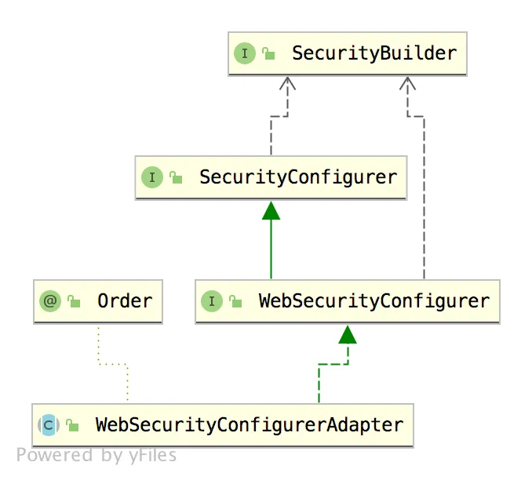

# 深入理解 WebSecurityConfigurerAdapter【源码篇】

Original 江南一点雨 [江南一点雨](javascript:void(0);) *2020年07月29日 08:08*

松哥原创的 Spring Boot 视频教程已经杀青，感兴趣的小伙伴戳这里-->[Spring Boot+Vue+微人事视频教程](https://mp.weixin.qq.com/s?__biz=MzI1NDY0MTkzNQ==&mid=2247488799&idx=1&sn=cdfd5315ff18c979b6f5d390ab4d9059&scene=21#wechat_redirect)

------

我们继续来撸 Spring Security 源码，今天来撸一个非常重要的 WebSecurityConfigurerAdapter。

我们的自定义都是继承自 WebSecurityConfigurerAdapter 来实现的，但是对于 WebSecurityConfigurerAdapter 内部的工作原理，配置原理，很多小伙伴可能都还不太熟悉，因此我们今天就来捋一捋。

我们先来看一张 WebSecurityConfigurerAdapter 的继承关系图：



在这层继承关系中，有两个非常重要的类：

- SecurityBuilder
- SecurityConfigurer

这两个类松哥在之前的文章中都和大家分享过了，具体参考：

- [深入理解 HttpSecurity【源码篇】](https://mp.weixin.qq.com/s?__biz=MzI1NDY0MTkzNQ==&mid=2247489405&idx=2&sn=b7790a660b787eec6d7604409aec41c3&scene=21#wechat_redirect)(本文讲的是 SecurityBuilder 体系)
- [深入理解 SecurityConfigurer 【源码篇】](https://mp.weixin.qq.com/s?__biz=MzI1NDY0MTkzNQ==&mid=2247489399&idx=1&sn=a450a7e432cdd0a4e2ee279604984f3a&scene=21#wechat_redirect)

所以关于这两个类的介绍以及作用，松哥这里就不赘述了。咱们直接从 WebSecurityConfigurer 开始看起。

## 1.WebSecurityConfigurer

WebSecurityConfigurer 其实是一个空接口，但是它里边约束了一些泛型，如下：

```
public interface WebSecurityConfigurer<T extends SecurityBuilder<Filter>> extends
  SecurityConfigurer<Filter, T> {

}
```

这里边的泛型很关键，这关乎到 WebSecurityConfigurer 的目的是啥！

1. SecurityBuilder 中的泛型 Filter，表示 SecurityBuilder 最终的目的是为了构建一个 Filter 对象出来。
2. SecurityConfigurer 中两个泛型，第一个表示的含义也是 SecurityBuilder 最终构建的对象。

同时这里还定义了新的泛型 T，T 需要继承自 SecurityBuilder，根据 WebSecurityConfigurerAdapter 中的定义，我们可以知道，T 就是 WebSecurity，我们也大概能猜出 WebSecurity 就是 SecurityBuilder的子类。

所以 WebSecurityConfigurer 的目的我们可以理解为就是为了配置 WebSecurity。

## 2.WebSecurity

我们来看下 WebSecurity 的定义：

```
public final class WebSecurity extends
  AbstractConfiguredSecurityBuilder<Filter, WebSecurity> implements
  SecurityBuilder<Filter>, ApplicationContextAware {
}
```

没错，确实是这样！WebSecurity 继承自 AbstractConfiguredSecurityBuilder<Filter, WebSecurity> 同时实现了 SecurityBuilder接口。

WebSecurity 的这些接口和继承类，松哥在前面的源码分析中都和大家介绍过了，可能有的小伙伴忘记了，我再来和大家复习一下。

**AbstractConfiguredSecurityBuilder**

首先 AbstractConfiguredSecurityBuilder 中定义了一个枚举类，将整个构建过程分为 5 种状态，也可以理解为构建过程生命周期的五个阶段，如下：

```
private enum BuildState {
 UNBUILT(0),
 INITIALIZING(1),
 CONFIGURING(2),
 BUILDING(3),
 BUILT(4);
 private final int order;
 BuildState(int order) {
  this.order = order;
 }
 public boolean isInitializing() {
  return INITIALIZING.order == order;
 }
 public boolean isConfigured() {
  return order >= CONFIGURING.order;
 }
}
```

五种状态分别是 UNBUILT、INITIALIZING、CONFIGURING、BUILDING 以及 BUILT。另外还提供了两个判断方法，isInitializing 判断是否正在初始化，isConfigured 表示是否已经配置完毕。

AbstractConfiguredSecurityBuilder 中的方法比较多，松哥在这里列出来两个关键的方法和大家分析：

```
private <C extends SecurityConfigurer<O, B>> void add(C configurer) {
 Assert.notNull(configurer, "configurer cannot be null");
 Class<? extends SecurityConfigurer<O, B>> clazz = (Class<? extends SecurityConfigurer<O, B>>) configurer
   .getClass();
 synchronized (configurers) {
  if (buildState.isConfigured()) {
   throw new IllegalStateException("Cannot apply " + configurer
     + " to already built object");
  }
  List<SecurityConfigurer<O, B>> configs = allowConfigurersOfSameType ? this.configurers
    .get(clazz) : null;
  if (configs == null) {
   configs = new ArrayList<>(1);
  }
  configs.add(configurer);
  this.configurers.put(clazz, configs);
  if (buildState.isInitializing()) {
   this.configurersAddedInInitializing.add(configurer);
  }
 }
}
private Collection<SecurityConfigurer<O, B>> getConfigurers() {
 List<SecurityConfigurer<O, B>> result = new ArrayList<>();
 for (List<SecurityConfigurer<O, B>> configs : this.configurers.values()) {
  result.addAll(configs);
 }
 return result;
}
```

第一个就是这个 add 方法，这相当于是在收集所有的配置类。将所有的 xxxConfigure 收集起来存储到 configurers 中，将来再统一初始化并配置，configurers 本身是一个 LinkedHashMap ，key 是配置类的 class，value 是一个集合，集合里边放着 xxxConfigure 配置类。当需要对这些配置类进行集中配置的时候，会通过 getConfigurers 方法获取配置类，这个获取过程就是把 LinkedHashMap 中的 value 拿出来，放到一个集合中返回。

另一个方法就是 doBuild 方法。

```
@Override
protected final O doBuild() throws Exception {
 synchronized (configurers) {
  buildState = BuildState.INITIALIZING;
  beforeInit();
  init();
  buildState = BuildState.CONFIGURING;
  beforeConfigure();
  configure();
  buildState = BuildState.BUILDING;
  O result = performBuild();
  buildState = BuildState.BUILT;
  return result;
 }
}
private void init() throws Exception {
 Collection<SecurityConfigurer<O, B>> configurers = getConfigurers();
 for (SecurityConfigurer<O, B> configurer : configurers) {
  configurer.init((B) this);
 }
 for (SecurityConfigurer<O, B> configurer : configurersAddedInInitializing) {
  configurer.init((B) this);
 }
}
private void configure() throws Exception {
 Collection<SecurityConfigurer<O, B>> configurers = getConfigurers();
 for (SecurityConfigurer<O, B> configurer : configurers) {
  configurer.configure((B) this);
 }
}
```

在 AbstractSecurityBuilder 类中，过滤器的构建被转移到 doBuild 方法上面了，不过在 AbstractSecurityBuilder 中只是定义了抽象的 doBuild 方法，具体的实现在 AbstractConfiguredSecurityBuilder。

doBuild 方法就是一边更新状态，进行进行初始化。

beforeInit 是一个预留方法，没有任何实现。

init 方法就是找到所有的 xxxConfigure，挨个调用其 init 方法进行初始化。

beforeConfigure 是一个预留方法，没有任何实现。

configure 方法就是找到所有的 xxxConfigure，挨个调用其 configure 方法进行配置。

最后则是 performBuild 方法，是真正的过滤器链构建方法，但是在 AbstractConfiguredSecurityBuilder 中 performBuild 方法只是一个抽象方法，具体的实现在它的子类中，也就是 WebSecurityConfigurer。

**SecurityBuilder**

SecurityBuilder 就是用来构建过滤器链的，在 HttpSecurity 实现 SecurityBuilder 时，传入的泛型就是 DefaultSecurityFilterChain，所以 SecurityBuilder#build 方法的功能很明确，就是用来构建一个过滤器链出来，但是那个过滤器链是 Spring Security 中的。在 WebSecurityConfigurerAdapter 中定义的泛型是 SecurityBuilder，所以最终构建的是一个普通 Filter，其实就是 FilterChainProxy，关于 FilterChainProxy ，大家可以参考[深入理解 FilterChainProxy【源码篇】](https://mp.weixin.qq.com/s?__biz=MzI1NDY0MTkzNQ==&mid=2247489390&idx=2&sn=c42833e530d4d258a236a07deb922229&scene=21#wechat_redirect)。

**WebSecurity**

WebSecurity 的核心逻辑集中在 performBuild 构建方法上，我们一起来看下：

```
@Override
protected Filter performBuild() throws Exception {
 Assert.state(
   !securityFilterChainBuilders.isEmpty(),
   () -> "At least one SecurityBuilder<? extends SecurityFilterChain> needs to be specified. "
     + "Typically this done by adding a @Configuration that extends WebSecurityConfigurerAdapter. "
     + "More advanced users can invoke "
     + WebSecurity.class.getSimpleName()
     + ".addSecurityFilterChainBuilder directly");
 int chainSize = ignoredRequests.size() + securityFilterChainBuilders.size();
 List<SecurityFilterChain> securityFilterChains = new ArrayList<>(
   chainSize);
 for (RequestMatcher ignoredRequest : ignoredRequests) {
  securityFilterChains.add(new DefaultSecurityFilterChain(ignoredRequest));
 }
 for (SecurityBuilder<? extends SecurityFilterChain> securityFilterChainBuilder : securityFilterChainBuilders) {
  securityFilterChains.add(securityFilterChainBuilder.build());
 }
 FilterChainProxy filterChainProxy = new FilterChainProxy(securityFilterChains);
 if (httpFirewall != null) {
  filterChainProxy.setFirewall(httpFirewall);
 }
 filterChainProxy.afterPropertiesSet();
 Filter result = filterChainProxy;
 if (debugEnabled) {
  logger.warn("\n\n"
    + "********************************************************************\n"
    + "**********        Security debugging is enabled.       *************\n"
    + "**********    This may include sensitive information.  *************\n"
    + "**********      Do not use in a production system!     *************\n"
    + "********************************************************************\n\n");
  result = new DebugFilter(filterChainProxy);
 }
 postBuildAction.run();
 return result;
}
```

先来说一句，这里的 performBuild 方法只有一个功能，那就是构建 FilterChainProxy，如果你还不了解什么是 FilterChainProxy，可以参考松哥之前的介绍：[深入理解 FilterChainProxy【源码篇】](https://mp.weixin.qq.com/s?__biz=MzI1NDY0MTkzNQ==&mid=2247489390&idx=2&sn=c42833e530d4d258a236a07deb922229&scene=21#wechat_redirect)。

把握住了这条主线，我们再来看方法的实现就很容易了。

1. 首先统计过滤器链的总条数，总条数包括两个方面，一个是 ignoredRequests，这是忽略的请求，通过 WebSecurity 配置的忽略请求，松哥之前介绍过，参见：[Spring Security 两种资源放行策略，千万别用错了！](https://mp.weixin.qq.com/s?__biz=MzI1NDY0MTkzNQ==&mid=2247488812&idx=1&sn=4db81eb24508743076d93207046d1572&scene=21#wechat_redirect)，另一个则是 securityFilterChainBuilders，也就是我们通过 HttpSecurity 配置的过滤器链，有几个就算几个。
2. 创建 securityFilterChains 集合，并且遍历上面提到的两种类型的过滤器链，并将过滤器链放入 securityFilterChains 集合中。
3. 我在[深入理解 HttpSecurity【源码篇】](https://mp.weixin.qq.com/s?__biz=MzI1NDY0MTkzNQ==&mid=2247489405&idx=2&sn=b7790a660b787eec6d7604409aec41c3&scene=21#wechat_redirect)一文中介绍过，HttpSecurity 构建出来的过滤器链对象就是 DefaultSecurityFilterChain，所以可以直接将 build 结果放入 securityFilterChains 中，而 ignoredRequests 中保存的则需要重构一下才可以存入 securityFilterChains。
4. securityFilterChains 中有数据之后，接下来创建一个 FilterChainProxy。
5. 给新建的 FilterChainProxy 配置上防火墙，防火墙的介绍参考松哥之前的：[Spring Security 自带防火墙！你都不知道自己的系统有多安全！](https://mp.weixin.qq.com/s?__biz=MzI1NDY0MTkzNQ==&mid=2247488496&idx=1&sn=3a153a207f112786a4ef1668f9d2a600&scene=21#wechat_redirect)。
6. 最后我们返回的就是 FilterChainProxy 的实例。

从这段分析中，我们可以看出来 WebSecurity 和 HttpSecurity 的区别：

1. HttpSecurity 目的是构建过滤器链，一个 HttpSecurity 对象构建一条过滤器链，一个过滤器链中有 N 个过滤器，HttpSecurity 所做的事情实际上就是在配置这 N 个过滤器。
2. WebSecurity 目的是构建 FilterChainProxy，一个 FilterChainProxy 中包含有多个过滤器链和一个 Firewall。

这就是 WebSecurity 的主要作用，核心方法是 performBuild，其他方法都比较简单，松哥就不一一解释了。

## 3.WebSecurityConfigurerAdapter

最后我们再来看 WebSecurityConfigurerAdapter，由于 WebSecurityConfigurer 只是一个空接口，WebSecurityConfigurerAdapter 就是针对这个空接口提供一个具体的实现，最终目的还是为了方便你配置 WebSecurity。

WebSecurityConfigurerAdapter 中的方法比较多，但是根据我们前面的分析，提纲挈领的方法就两个，一个是 init，还有一个 configure(WebSecurity web)，其他方法都是为这两个方法服务的。那我们就来看下这两个方法：

先看 init 方法：

```
public void init(final WebSecurity web) throws Exception {
 final HttpSecurity http = getHttp();
 web.addSecurityFilterChainBuilder(http).postBuildAction(() -> {
  FilterSecurityInterceptor securityInterceptor = http
    .getSharedObject(FilterSecurityInterceptor.class);
  web.securityInterceptor(securityInterceptor);
 });
}
protected final HttpSecurity getHttp() throws Exception {
 if (http != null) {
  return http;
 }
 AuthenticationEventPublisher eventPublisher = getAuthenticationEventPublisher();
 localConfigureAuthenticationBldr.authenticationEventPublisher(eventPublisher);
 AuthenticationManager authenticationManager = authenticationManager();
 authenticationBuilder.parentAuthenticationManager(authenticationManager);
 Map<Class<?>, Object> sharedObjects = createSharedObjects();
 http = new HttpSecurity(objectPostProcessor, authenticationBuilder,
   sharedObjects);
 if (!disableDefaults) {
  // @formatter:off
  http
   .csrf().and()
   .addFilter(new WebAsyncManagerIntegrationFilter())
   .exceptionHandling().and()
   .headers().and()
   .sessionManagement().and()
   .securityContext().and()
   .requestCache().and()
   .anonymous().and()
   .servletApi().and()
   .apply(new DefaultLoginPageConfigurer<>()).and()
   .logout();
  // @formatter:on
  ClassLoader classLoader = this.context.getClassLoader();
  List<AbstractHttpConfigurer> defaultHttpConfigurers =
    SpringFactoriesLoader.loadFactories(AbstractHttpConfigurer.class, classLoader);
  for (AbstractHttpConfigurer configurer : defaultHttpConfigurers) {
   http.apply(configurer);
  }
 }
 configure(http);
 return http;
}
protected void configure(HttpSecurity http) throws Exception {
 logger.debug("Using default configure(HttpSecurity). If subclassed this will potentially override subclass configure(HttpSecurity).");
 http
  .authorizeRequests()
   .anyRequest().authenticated()
   .and()
  .formLogin().and()
  .httpBasic();
}
```

init 方法可以算是这里的入口方法了：首先调用 getHttp 方法进行 HttpSecurity 的初始化。HttpSecurity 的初始化，实际上就是配置了一堆默认的过滤器，配置完成后，最终还调用了 configure(http) 方法，该方法又配置了一些拦截器，不过在实际开发中，我们经常会重写 configure(http) 方法，在松哥本系列前面的文章中，configure(http) 方法几乎都有重写。HttpSecurity 配置完成后，再将 HttpSecurity 放入 WebSecurity 中，保存在 WebSecurity 的 securityFilterChainBuilders 集合里，具体参见：[深入理解 HttpSecurity【源码篇】](https://mp.weixin.qq.com/s?__biz=MzI1NDY0MTkzNQ==&mid=2247489405&idx=2&sn=b7790a660b787eec6d7604409aec41c3&scene=21#wechat_redirect)。

configure(WebSecurity web) 方法实际上是一个空方法，我们在实际开发中可能会重写该方法（参见 [Spring Security 两种资源放行策略，千万别用错了！](https://mp.weixin.qq.com/s?__biz=MzI1NDY0MTkzNQ==&mid=2247488812&idx=1&sn=4db81eb24508743076d93207046d1572&scene=21#wechat_redirect) 一文）：

```
public void configure(WebSecurity web) throws Exception {
}
```

## 4.小结

这便是 WebSecurityConfigurerAdapter，整体上来说并不难，但是要和松哥前面几篇源码分析文章一起看，理解会更加深刻一些。

传送门：

1. [深入理解 FilterChainProxy【源码篇】](https://mp.weixin.qq.com/s?__biz=MzI1NDY0MTkzNQ==&mid=2247489390&idx=2&sn=c42833e530d4d258a236a07deb922229&scene=21#wechat_redirect)
2. [深入理解 SecurityConfigurer 【源码篇】](https://mp.weixin.qq.com/s?__biz=MzI1NDY0MTkzNQ==&mid=2247489399&idx=1&sn=a450a7e432cdd0a4e2ee279604984f3a&scene=21#wechat_redirect)
3. [深入理解 HttpSecurity【源码篇】](https://mp.weixin.qq.com/s?__biz=MzI1NDY0MTkzNQ==&mid=2247489405&idx=2&sn=b7790a660b787eec6d7604409aec41c3&scene=21#wechat_redirect)
4. [深入理解 AuthenticationManagerBuilder 【源码篇】](https://mp.weixin.qq.com/s?__biz=MzI1NDY0MTkzNQ==&mid=2247489418&idx=1&sn=e41628d258fcd0b2d00fb291fa0cfdef&scene=21#wechat_redirect)

**好啦，小伙伴们要是有收获，记得点个在看鼓励下松哥哦～**

今日干货


刚刚发表

查看:13500回复:135

公众号后台回复 SpringBoot，免费获取 274 页SpringBoot修炼手册。

SpringSecurity系列52

SpringSecurity系列 · 目录


上一篇深入理解 HttpSecurity【源码篇】下一篇盘点 Spring Security 框架中的八大经典设计模式


# 