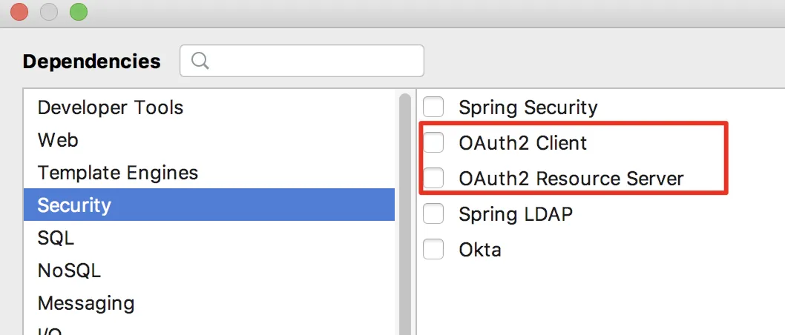
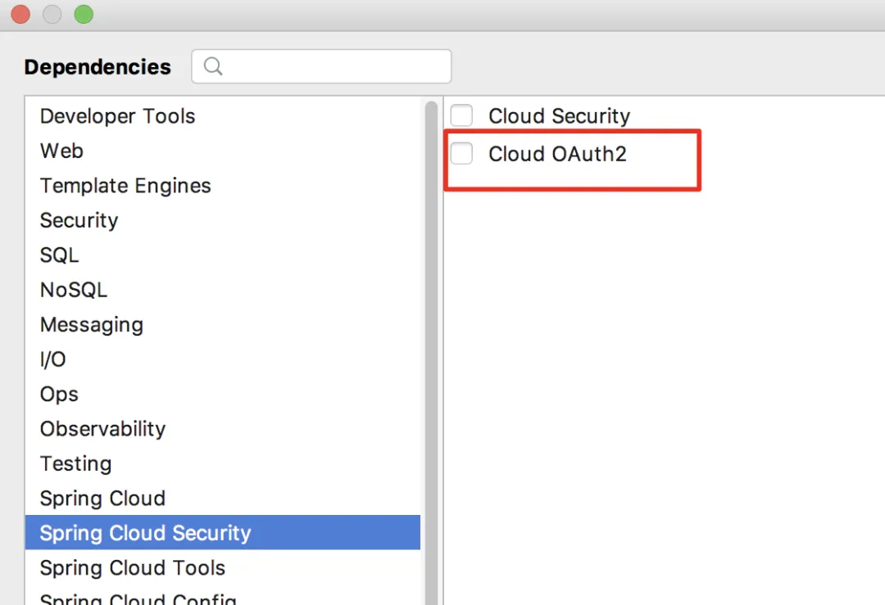

# 为什么你使用的 Spring Security OAuth 过期了？松哥来和大家捋一捋！

Original 江南一点雨 [江南一点雨](javascript:void(0);) *2020年08月28日 08:08*

松哥原创的 Spring Boot 视频教程已经杀青，感兴趣的小伙伴戳这里-->[Spring Boot+Vue+微人事视频教程](https://mp.weixin.qq.com/s?__biz=MzI1NDY0MTkzNQ==&mid=2247488799&idx=1&sn=cdfd5315ff18c979b6f5d390ab4d9059&scene=21#wechat_redirect)

------

最近一段时间，大家在用 Spring Security OAuth2 时可能发现有很多类过期了。

大家在选择 OAuth2 依赖的时候，可能也会困惑，有好几个地方都可以选：





那么到底选择哪一个依赖合适呢？这不同的依赖又有什么区别？今天松哥就来和大家聊一聊 Spring Security 中关于 OAuth2 的恩怨。

## 前言

先来大致介绍一下 OAuth2 在 Spring 框架中的发展历程。

大约十年前，Spring 引入了一个社区驱动的开源项目 Spring Security OAuth，并将其纳入 Spring 项目组合中。到今天，它已经发展成为一个成熟的项目，可以支持大部分 OAuth 规范，包括`资源服务器`、`客户端`和`授权服务器`等。

现在它已成为 UAA（User Account and Authentication Server） 的基础。Spring Security OAuth 项目已成为一个样板项目，它证明了 Spring 社区可以出色的完成工作。

然而早期的项目存在这样一些问题：

1. OAuth 是在很早的时候完成的，开发者无法预料未来的变化以及这些代码到底要被怎么用，导致很多 Spring 项目提供了自己的 OAuth 支持，这就带来了 OAuth2 支持的碎片化。
2. 最早的 OAuth 项目同时支持 OAuth1.0 和 OAuth2.0，现在 OAuth1.0 早已经不再使用，可以放弃了。
3. 现在我们有更多的库可以选择，可以在这些库的基础上去开发，以便更好的支持 JWT 等新玩意。

基于以上这些原因，官方决定在社区成功的基础上，重写 Spring Security OAuth，以更好地协调 Spring 和 OAuth，并简化代码库，以使 Spring 的 OAuth 支持更加灵活。

然而，在重写的过程中，发生了不少波折。

## 2018.01.30

事情得从 2018 年 1 月 30 号讲起。

那天 Spring 官方发了一个通知，说是要逐渐停止现有的 OAuth2 支持，而在 Spring Security5 中构建下一代 OAuth2.0 支持。

为什么要这样呢？

大家知道，OAuth2 只是一种协议，Spring 框架通过代码对这种协议进行落地。

当时 OAuth2 的落地方案比较混乱（这种混乱到今天依然存在），在 Spring Security OAuth、Spring Cloud Security、Spring Boot 1.5.x 以及当时最新的 Spring Security5.x 中都提供了对 OAuth2 的实现。

以至于当开发者需要使用 OAuth2 时，不得不问，到底选哪一个依赖合适呢？已经有三个地方提供了 OAuth2 的支持，已经够混乱了，为什么还要在最新的 Spring Security5.x 中继续提供实现呢？

太乱了！

所以 Spring 官方决定有必要将 OAuth2.0 的支持统一到一个项目中，以便为用户提供明确的选择并避免任何潜在的混乱，同时 OAuth2 的开发文档也要重新编写，以方便开发人员学习。所有的决定将在 Spring Security5 中开始，构建下一代 OAuth2.0 的支持。

从那个时候起，Spring Security OAuth 项目就正式处于维护模式。官方将提供至少 1 年的错误/安全修复程序，并且会考虑添加次要功能，但不会添加主要功能。同时将 Spring Security OAuth 中的所有功能重构到 Spring Security5.x 中。

**老实说，这是一个英明的决定，当时并没有引起太多的反响。但是接下来的事情就不是那么顺利了。**

## 2019.11.14

时间到了 2019.11.14。

这天，官方又发了个通知。

先说了 Spring Security OAuth 在迁往 Spring Security5.x 的过程非常顺利，大部分迁移工作已经完成了，剩下的将在 5.3 版本中完成迁移，在迁移的过程中还添加了许多新功能，包括对 OpenID Connect1.0 的支持

接下来话锋一转，说了一件很多人难以接受的事情，那就是将**不再提供对授权服务器的支持**（要是小伙伴们不懂什么是授权服务器，可以在公众号江南一点雨后台回复 `OAuth2` ，有松哥写的 OAuth2 教程）。

不提供的原因，官方给了两个：

1. 在 2019 年，将有大量的商业和开源授权服务器可用。
2. 授权服务器是使用一个库来构建产品，而 Spring Security 作为框架，并不适合做这件事情。

一石激起千层浪，许多开发者表示对此难以接受。这件事也在 Spring 社区引发了激烈的讨论，好在 Spring 官方愿意倾听来自社区的声音。

## 2020.04.15

这天，官方又发了个通知。

这次宣布了 Spring Authorization Server 项目。这是一个由 Spring Security 团队领导的社区驱动的项目，致力于向 Spring 社区提供 Authorization Server 支持。

官方倾听了来自社区的声音，决定继续提供授权服务器。

这次只是宣布了一下，算是安抚了一下社区的情绪，但是项目还没开发出来。

## 2020.08.21

Spring Authorization Server 0.0.1 正式发布！

同时公布了项目源码地址：https://github.com/spring-projects-experimental/spring-authorization-server

在这个版本中，主要提供了如下功能：

- OAuth 2.0授权代码授予  -RFC 6749
- OAuth 2.0客户端凭据授予  -RFC 6749
- JSON Web令牌（JWT）  -RFC 7519
- JSON Web签名（JWS）  -RFC 7515
- JSON Web密钥（JWK）  -RFC 7517
- 密钥管理，用于在签署JWT（JWS）时提供密钥

其他功能还在紧锣密鼓的开发中。

这就是 OAuth2 最近几年的变更之路。

## 回到问题

回到最开始的问题。

**类过期了怎么办？**

类过期是因为旧的写法已经不被支持，松哥举个简单例子，以前我们定义资源服务器是这样的：

```
@Configuration
@EnableResourceServer
public class ResourceServerConfig extends ResourceServerConfigurerAdapter {
    @Bean
    RemoteTokenServices tokenServices() {
        RemoteTokenServices services = new RemoteTokenServices();
        services.setCheckTokenEndpointUrl("http://localhost:8080/oauth/check_token");
        services.setClientId("javaboy");
        services.setClientSecret("123");
        return services;
    }
    @Override
    public void configure(ResourceServerSecurityConfigurer resources) throws Exception {
        resources.resourceId("res1").tokenServices(tokenServices());
    }

    @Override
    public void configure(HttpSecurity http) throws Exception {
        http.authorizeRequests()
                .antMatchers("/admin/**").hasRole("admin")
                .anyRequest().authenticated();
    }
}
```

现在迁移到 Spring Security5.x 中之后，我们是这样定义的：

```
@Configuration
public class MyResourceServer extends WebSecurityConfigurerAdapter {
    @Override
    protected void configure(HttpSecurity http) throws Exception {
        http.authorizeRequests()
                .anyRequest().authenticated()
                .and()
                .oauth2ResourceServer()
                .opaqueToken()
                .introspectionUri("http://localhost:8080/oauth/check_token")
                .introspectionClientCredentials("javaboy", "123");
    }
}
```

这两段代码作用是一样的。后面的是目前最新写法，不存在过期的问题。

**选哪个依赖**

现在大家已经知道为什么会存在多种不同的依赖，Spring Cloud Security OAuth2 中使用旧的写法并不会提示过期，但是它同时也支持新的写法，建议小伙伴们用新的写法，反正迟早都要改过来。

松哥在四月份的时候出了一个 OAuth2 的教程，当时就是基于 Spring Cloud Security OAuth2 来做的，用了旧的写法，但是没有提示过期的问题，感兴趣的小伙伴可以看看（公众号后台回复 OAuth2），无论新旧，只要会其中一个，另外一个上手就很容易了。

当然，后面我也会结合最新的 Spring Security5.x 来更新一套 OAuth2 教程，欢迎大家关注～

今日干货


刚刚发表

查看:66666回复:666

公众号后台回复 ssm，免费获取松哥纯手敲的 SSM 框架学习干货。

SpringSecurity系列52

SpringSecurity系列 · 目录


上一篇Spring Security 初始化流程梳理下一篇一个诡异的登录问题


# 


Scan to Follow