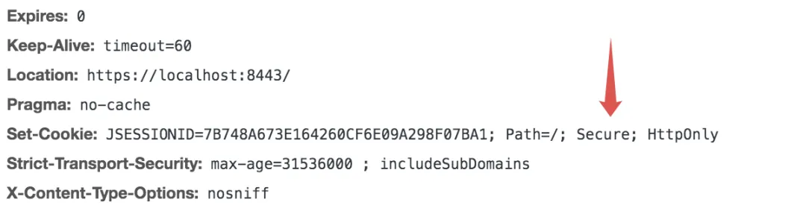

# 一个诡异的登录问题

Original 江南一点雨 [江南一点雨](javascript:void(0);) *2020年08月31日 10:09*

松哥原创的 Spring Boot 视频教程已经杀青，感兴趣的小伙伴戳这里-->[Spring Boot+Vue+微人事视频教程](https://mp.weixin.qq.com/s?__biz=MzI1NDY0MTkzNQ==&mid=2247489641&idx=1&sn=4cee9122a2fa2677bdc71abf5c7e8c00&scene=21#wechat_redirect)

------

美好周末，从解 BUG 开始！

上周五本来想早点下班，临了有一个简单的需求突然提上来，心想着整完了就走，没想到一下折腾了 1 个多小时才搞定，愉快的周末就从加班中开启了。回到家里把这件事复盘一下，小伙伴们看看是否能够从中 GET 到一些未知的东西。

需求是这样的：

项目是 `Spring Boot` 项目，里边对请求进行了划分，有的请求是 `HTTP` 协议，有的请求是 `HTTPS` 协议，项目规定，有一些请求必须是 `HTTPS` 协议，例如 /https 接口，该接口必须使用 `HTTPS` 协议访问，如果用户使用了 `HTTP` 协议访问，那么会自动发生请求重定向，重定向到 `HTTPS` 协议上；同时也有一些请求必须是 `HTTP` 协议，例如 /http 接口，该接口必须使用 `HTTP` 协议访问，如果用户使用了 `HTTPS` 协议访问，那么会自动发生请求重定向，重定向到 `HTTP` 协议上。对于一些没有明确规定的接口，当用户访问 `HTTP` 协议时，不需要自动跳转到 `HTTPS` 协议上，即用户如果使用 `HTTP` 协议就是 `HTTP` 协议，用户如果使用 `HTTPS` 协议就是 `HTTPS` 协议。

这个任务实在是小 case，由于项目本身已经支持 `HTTPS` 了，我只需要再添加一个 `HTTP` 监听的端口即可([Spring Boot 中配置 Https](https://mp.weixin.qq.com/s?__biz=MzI1NDY0MTkzNQ==&mid=2247486559&idx=2&sn=8a78f43c2ba9d820011ec1f953b1e9d0&scene=21#wechat_redirect))，添加如下配置：

```
@Configuration
public class TomcatConfig {
    @Bean
    TomcatServletWebServerFactory tomcatServletWebServerFactory() {
        TomcatServletWebServerFactory factory = new TomcatServletWebServerFactory();
        factory.addAdditionalTomcatConnectors(createTomcatConnector());
        return factory;
    }
    private Connector createTomcatConnector() {
        Connector connector = new
                Connector("org.apache.coyote.http11.Http11NioProtocol");
        connector.setScheme("http");
        connector.setPort(8080);
        return connector;
    }
}
```

添加完成后，项目启动日志如下：


可以看到，项目已经同时支持 `HTTPS` 和 `HTTP` 了，两者分别在不同的端口上监听。

接下来利用 Spring Security 中的 `HTTPS` 校验转发功能对请求进行区分：

```
@Configuration
public class SecurityConfig extends WebSecurityConfigurerAdapter {
    @Override
    protected void configure(HttpSecurity http) throws Exception {
        http.
  //省略其他
                .requiresChannel()
                .antMatchers("/https").requiresSecure()
                .antMatchers("/http").requiresInsecure()
                .and()
                .csrf().disable();
    }
}
```

大功告成，so easy!

配置完成后，启动项目，如下两个地址都可以访问到登录页面：

- http://localhost:8080/login
- https://localhost:8444/login

可以使用任意一个地址登录。

假如使用了 `HTTP` 协议登录，登录成功后，如果直接访问 `http://localhost:8080/http` 请求，可以直接访问到，没有任何问题；如果登录成功后访问 `http://localhost:8080/https` 请求，则会自动重定向到 `https://localhost:8444/https`，一切看起来都很完美。

似乎可以下班了。

别急，我再用 `HTTPS` 登录测试了，打开 `https://localhost:8444/login` 页面，登录成功，请求 `https://localhost:8444/https` 地址没有问题，请求 `https://localhost:8444/http` ，傻眼了。

当我使用 `HTTPS` 登录成功后，请求 `https://localhost:8444/http` 地址时，按理说会重定向到 `http://localhost:8080/http`，结果并没有，而是重定向到登录页面，这是咋回事？更为诡异的是，现在在登录页面，无论我怎么做，都登录失败。

看来 965 到底是海市蜃楼，还是继续解决问题吧。

那就从登录开始，好端端的为什么突然就无法登录了呢？

先清除浏览器缓存试试？咦，清除浏览器缓存后登录成功了！

经过多次尝试后，我总结出来了如下规律：

如果使用 `HTTP` 协议登录，登录成功后，HTTP 协议和 `HTTPS` 协议之间互相重定向没有任何问题。如果使用了 `HTTPS` 协议登录，登录成功后，HTTPS 协议重定向到 `HTTP` 协议时，需要重新登录，并且在登录页面总是登录失败，需要清除浏览器缓存才能登录成功。

> ❝
>
> 先找到规律这个很重要，有的小伙伴微信问松哥问题时候，喜欢说，`这个东西它一会可以一会又不行`，老实说，这个问题提的非常业余！所有看似无规律的 BUG 背后都是有规律的，找到规律才是解决 BUG 的第一步。

在整个过程中，最为诡异的是从 `HTTPS` 重定向到 `HTTP` 之后，无论怎么样都登录不了，服务端重启也没用，只能清除浏览器缓存，这个非常奇怪，我觉得就先从这个地方入手 DEBUG。

那就 DEBUG，浏览器发送登录请求，服务端我把 `Spring Security` 登录流程走了一遍，貌似没问题，登录成功后重定向到 http://localhost:8080/ ，这也是正常的，继续 DEBUG，重定向到 http://localhost:8080/ 地址时，出现了一点点意外，该请求在 Spring Security 过滤器链的最后一个环节 FilterSecurityInterceptor 中执行时候抛出异常了，异常原因是因为检查用户身份，发现这是个匿名用户！（[一文搞定 Spring Security 异常处理机制！](https://mp.weixin.qq.com/s?__biz=MzI1NDY0MTkzNQ==&mid=2247489179&idx=1&sn=01aae04306638e68d9ea483e508d56ac&scene=21#wechat_redirect)）

不对呀，一开始已经登录成功了，怎么会是匿名用户呢？`Spring Security` 在登录成功后，会将用户信息保存在 `SecurityContextHolder` 中（[在 Spring Security 中，我就想从子线程获取用户登录信息，怎么办？](https://mp.weixin.qq.com/s?__biz=MzI1NDY0MTkzNQ==&mid=2247489370&idx=1&sn=d3f8efbcb5fd8b4180746affafbd7abf&scene=21#wechat_redirect)），是不是没保存？重新检查登录过程，发现登录成功后是保存了用户信息的。但是当登录成功后再次发送请求却说我没登录，还剩一种可能，是不是前端请求的问题，JSESSIONID 拿错了？或者没拿？

浏览器 F12 检查前端请求，发现登录成功后，重定向到 `http://localhost:8080/` 地址时，果然没有携带 Cookie！

现在的问题是为什么它就不携带 Cookie 呢？

一瞬间脑子里闪过了诸多可能性，是不是浏览器 SameSite 机制导致的？是不是。。。最后思维定格在 Cookie 的 Secure 标记上。

如果请求是 HTTPS，则服务端响应的 Cookie 中含有 Secure 标记：



这个标记表示该 Cookie 只可以在安全环境下（HTTPS）传输，如果请求是 `HTTP` 协议，则不会携带该 Cookie。这样就能解释通为什么登录成功后重定向时不携带 Cookie 了。

新的问题来了，我使用的是 `HTTP` 协议登录，为什么 Cookie 中有 Secure 标记呢？回答这个问题，我们要完整的梳理一遍登录过程。

首先我们使用 `HTTPS` 协议登录，登录成功后，返回的 Cookie 中含有 Secure 标记，接下来我们访问 `https://localhost:8444/http`，该请求重定向到 `http://localhost:8080/http`，重定向的请求是 `HTTP` 请求，而 Cookie 只可以在 `HTTPS` 环境下传输，所以不会携带 Cookie，服务端以为这是一个匿名请求，所以要求重定向到登录页面，回到登录页面继续登录，此时发起的登录是 `HTTP` 请求，即端口是 8080，由于 Cookie 并不会区分端口号，所以使用 8080 登录成功后，使用的还是之前 8444 生成的 Cookie，但是 8080 又无法在发送请求时，自动携带该 Cookie，所以看到的就是总是登录失败，当清除浏览器缓存后，8444 的 Cookie 就被清除了，8080 再次登录就可以生成自己的没有 Secure 标记的 Cookie，此时一切又恢复正常了。

这里边其实主要涉及到两个知识点：

1. 含有 Secure 标记的 Cookie 只可以在安全环境下（HTTPS）传输。
2. Cookie 是不区分端口号的，如果 Cookie 名相同，会自动覆盖，并且读取的是相同的数据。所以 8080 和 8444 并不会自动使用两个 Cookie。

至此，总算搞清楚这个诡异的登录问题了。那么接下来的解决方案就很容易了。

还是那句话，所有看似无规律的 BUG 都是有规律的，找到规律才有解决问题的可能性！

**精彩文章推荐：**

[Spring Boot 要怎么学？要学哪些东西？要不要先学 SSM？松哥说说看法](http://mp.weixin.qq.com/s?__biz=MzI1NDY0MTkzNQ==&mid=2247487918&idx=1&sn=12f4a387e904750d333671cb96028d54&chksm=e9c343cedeb4cad8aa6e36a24f9e86877afbbb3429fb2f9023d5c2c9bfb3bd69b1fdbd9978af&scene=21#wechat_redirect)

[274 页 pdf 文档，Spring Boot 教程也有离线版了](http://mp.weixin.qq.com/s?__biz=MzI1NDY0MTkzNQ==&mid=2247487663&idx=1&sn=32f69ef10578191ad8540b9b99d83002&chksm=e9c342cfdeb4cbd9aba62f6ed84f64788c6cbcd60a348d83ef28803ec2f8169edf4a38d9f81a&scene=21#wechat_redirect)


**喜欢就点个****"在看"****呗^_^**

SpringSecurity系列52

SpringSecurity系列 · 目录


上一篇为什么你使用的 Spring Security OAuth 过期了？松哥来和大家捋一捋！下一篇Spring Security 中如何让上级拥有下级的所有权限？


# 