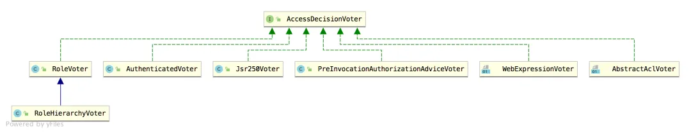
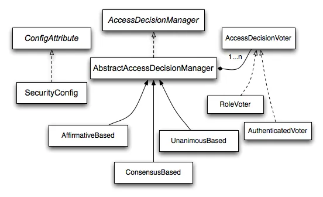

# Spring Security 权限管理的投票器与表决机制

Original 江南一点雨 [江南一点雨](javascript:void(0);) *2020年09月11日 10:08*

松哥原创的 Spring Boot 视频教程已经杀青，感兴趣的小伙伴戳这里-->[Spring Boot+Vue+微人事视频教程](https://mp.weixin.qq.com/s?__biz=MzI1NDY0MTkzNQ==&mid=2247489641&idx=1&sn=4cee9122a2fa2677bdc71abf5c7e8c00&scene=21#wechat_redirect)

------

今天咱们来聊一聊 Spring Security 中的表决机制与投票器。

当用户想访问 Spring Security 中一个受保护的资源时，用户具备一些角色，该资源的访问也需要一些角色，在比对用户具备的角色和资源需要的角色时，就会用到投票器和表决机制。

当用户想要访问某一个资源时，投票器根据用户的角色投出赞成或者反对票，表决方式则根据投票器的结果进行表决。

在 Spring Security 中，默认提供了三种表决机制，当然，我们也可以不用系统提供的表决机制和投票器，而是完全自己来定义，这也是可以的。

本文松哥将和大家重点介绍三种表决机制和默认的投票器。

## 1.投票器

先来看投票器。

在 Spring Security 中，投票器是由 AccessDecisionVoter 接口来规范的，我们来看下 AccessDecisionVoter 接口的实现：



可以看到，投票器的实现有好多种，我们可以选择其中一种或多种投票器，也可以自定义投票器，默认的投票器是 WebExpressionVoter。

我们来看 AccessDecisionVoter 的定义：

```
public interface AccessDecisionVoter<S> {
 int ACCESS_GRANTED = 1;
 int ACCESS_ABSTAIN = 0;
 int ACCESS_DENIED = -1;
 boolean supports(ConfigAttribute attribute);
 boolean supports(Class<?> clazz);
 int vote(Authentication authentication, S object,
   Collection<ConfigAttribute> attributes);
}
```

我稍微解释下：

1. 首先一上来定义了三个常量，从常量名字中就可以看出每个常量的含义，1 表示赞成；0 表示弃权；-1 表示拒绝。
2. 两个 supports 方法用来判断投票器是否支持当前请求。
3. vote 则是具体的投票方法。在不同的实现类中实现。三个参数，authentication 表示当前登录主体；object 是一个 ilterInvocation，里边封装了当前请求；attributes 表示当前所访问的接口所需要的角色集合。

我们来分别看下几个投票器的实现。

### 1.1 RoleVoter

RoleVoter 主要用来判断当前请求是否具备该接口所需要的角色，我们来看下其 vote 方法：

```
public int vote(Authentication authentication, Object object,
  Collection<ConfigAttribute> attributes) {
 if (authentication == null) {
  return ACCESS_DENIED;
 }
 int result = ACCESS_ABSTAIN;
 Collection<? extends GrantedAuthority> authorities = extractAuthorities(authentication);
 for (ConfigAttribute attribute : attributes) {
  if (this.supports(attribute)) {
   result = ACCESS_DENIED;
   for (GrantedAuthority authority : authorities) {
    if (attribute.getAttribute().equals(authority.getAuthority())) {
     return ACCESS_GRANTED;
    }
   }
  }
 }
 return result;
}
```

这个方法的判断逻辑很简单，如果当前登录主体为 null，则直接返回 ACCESS_DENIED 表示拒绝访问；否则就从当前登录主体 authentication 中抽取出角色信息，然后和 attributes 进行对比，如果具备 attributes 中所需角色的任意一种，则返回 ACCESS_GRANTED 表示允许访问。例如 attributes 中的角色为 [a,b,c]，当前用户具备 a，则允许访问，不需要三种角色同时具备。

另外还有一个需要注意的地方，就是 RoleVoter 的 supports 方法，我们来看下：

```
public class RoleVoter implements AccessDecisionVoter<Object> {
 private String rolePrefix = "ROLE_";
 public String getRolePrefix() {
  return rolePrefix;
 }
 public void setRolePrefix(String rolePrefix) {
  this.rolePrefix = rolePrefix;
 }
 public boolean supports(ConfigAttribute attribute) {
  if ((attribute.getAttribute() != null)
    && attribute.getAttribute().startsWith(getRolePrefix())) {
   return true;
  }
  else {
   return false;
  }
 }
 public boolean supports(Class<?> clazz) {
  return true;
 }
}
```

可以看到，这里涉及到了一个 rolePrefix 前缀，这个前缀是 `ROLE_`，在 supports 方法中，只有主体角色前缀是 `ROLE_`，这个 supoorts 方法才会返回 true，这个投票器才会生效。

### 1.2 RoleHierarchyVoter

RoleHierarchyVoter 是 RoleVoter 的一个子类，在 RoleVoter 角色判断的基础上，引入了角色分层管理，也就是角色继承，关于角色继承，小伙伴们可以参考松哥之前的文章（[Spring Security 中如何让上级拥有下级的所有权限？](https://mp.weixin.qq.com/s?__biz=MzI1NDY0MTkzNQ==&mid=2247490079&idx=1&sn=5e4db34940ae1112b306f1e29d016bc5&scene=21#wechat_redirect)）。

RoleHierarchyVoter 类的 vote 方法和 RoleVoter 一致，唯一的区别在于 RoleHierarchyVoter 类重写了 extractAuthorities 方法。

```
@Override
Collection<? extends GrantedAuthority> extractAuthorities(
  Authentication authentication) {
 return roleHierarchy.getReachableGrantedAuthorities(authentication
   .getAuthorities());
}
```

角色分层之后，需要通过 getReachableGrantedAuthorities 方法获取实际具备的角色，具体请参考：Spring Security 中如何让上级拥有下级的所有权限？一文。

### 1.3 WebExpressionVoter

这是一个基于表达式权限控制的投票器，松哥后面专门花点时间和小伙伴们聊一聊基于表达式的权限控制，这里我们先不做过多展开，简单看下它的 vote 方法：

```
public int vote(Authentication authentication, FilterInvocation fi,
  Collection<ConfigAttribute> attributes) {
 assert authentication != null;
 assert fi != null;
 assert attributes != null;
 WebExpressionConfigAttribute weca = findConfigAttribute(attributes);
 if (weca == null) {
  return ACCESS_ABSTAIN;
 }
 EvaluationContext ctx = expressionHandler.createEvaluationContext(authentication,
   fi);
 ctx = weca.postProcess(ctx, fi);
 return ExpressionUtils.evaluateAsBoolean(weca.getAuthorizeExpression(), ctx) ? ACCESS_GRANTED
   : ACCESS_DENIED;
}
```

如果你熟练使用 SpEL 的话，这段代码应该说还是很好理解的，不过根据我的经验，实际工作中用到 SpEL 场景虽然有，但是不多，所以可能有很多小伙伴并不了解 SpEL 的用法，这个需要小伙伴们自行复习下，我也给大家推荐一篇还不错的文章：https://www.cnblogs.com/larryzeal/p/5964621.html。

这里代码实际上就是根据传入的 attributes 属性构建 weca 对象，然后根据传入的 authentication 参数构建 ctx 对象，最后调用 evaluateAsBoolean 方法去判断权限是否匹配。

上面介绍这三个投票器是我们在实际开发中使用较多的三个。

### 1.4 其他

另外还有几个比较冷门的投票器，松哥也稍微说下，小伙伴们了解下。

Jsr250Voter

处理 Jsr-250 权限注解的投票器，如 `@PermitAll`，`@DenyAll` 等。

AuthenticatedVoter

AuthenticatedVoter 用于判断 ConfigAttribute 上是否拥有 IS_AUTHENTICATED_FULLY、IS_AUTHENTICATED_REMEMBERED、IS_AUTHENTICATED_ANONYMOUSLY 三种角色。

IS_AUTHENTICATED_FULLY 表示当前认证用户必须是通过用户名/密码的方式认证的，通过 RememberMe 的方式认证无效。

IS_AUTHENTICATED_REMEMBERED 表示当前登录用户必须是通过 RememberMe 的方式完成认证的。

IS_AUTHENTICATED_ANONYMOUSLY 表示当前登录用户必须是匿名用户。

当项目引入 RememberMe 并且想区分不同的认证方式时，可以考虑这个投票器。

AbstractAclVoter

提供编写域对象 ACL 选项的帮助方法，没有绑定到任何特定的 ACL 系统。

PreInvocationAuthorizationAdviceVoter

使用 @PreFilter 和 @PreAuthorize 注解处理的权限，通过 PreInvocationAuthorizationAdvice 来授权。

当然，如果这些投票器不能满足需求，也可以自定义。

## 2.表决机制

一个请求不一定只有一个投票器，也可能有多个投票器，所以在投票器的基础上我们还需要表决机制。



表决相关的类主要是三个：

- AffirmativeBased
- ConsensusBased
- UnanimousBased

他们的继承关系如上图。

三个决策器都会把项目中的所有投票器调用一遍，默认使用的决策器是 AffirmativeBased。

三个决策器的区别如下：

- AffirmativeBased：有一个投票器同意了，就通过。
- ConsensusBased：多数投票器同意就通过，平局的话，则看 allowIfEqualGrantedDeniedDecisions 参数的取值。
- UnanimousBased 所有投票器都同意，请求才通过。

这里的具体判断逻辑比较简单，松哥就不贴源码了，感兴趣的小伙伴可以自己看看。

## 3.在哪里配置

当我们使用基于表达式的权限控制时，像下面这样：

```
http.authorizeRequests()
        .antMatchers("/admin/**").hasRole("admin")
        .antMatchers("/user/**").hasRole("user")
        .anyRequest().fullyAuthenticated()
```

那么默认的投票器和决策器是在 AbstractInterceptUrlConfigurer#createDefaultAccessDecisionManager 方法中配置的：

```
private AccessDecisionManager createDefaultAccessDecisionManager(H http) {
 AffirmativeBased result = new AffirmativeBased(getDecisionVoters(http));
 return postProcess(result);
}
List<AccessDecisionVoter<?>> getDecisionVoters(H http) {
 List<AccessDecisionVoter<?>> decisionVoters = new ArrayList<>();
 WebExpressionVoter expressionVoter = new WebExpressionVoter();
 expressionVoter.setExpressionHandler(getExpressionHandler(http));
 decisionVoters.add(expressionVoter);
 return decisionVoters;
}
```

这里就可以看到默认的决策器和投票器，并且决策器 AffirmativeBased 对象创建好之后，还调用 postProcess 方法注册到 Spring 容器中去了，结合松哥本系列前面的文章，大家知道，如果我们想要修改该对象就非常容易了：

```
http.authorizeRequests()
        .antMatchers("/admin/**").hasRole("admin")
        .antMatchers("/user/**").hasRole("user")
        .anyRequest().fullyAuthenticated()
        .withObjectPostProcessor(new ObjectPostProcessor<AffirmativeBased>() {
            @Override
            public <O extends AffirmativeBased> O postProcess(O object) {
                List<AccessDecisionVoter<?>> decisionVoters = new ArrayList<>();
                decisionVoters.add(new RoleHierarchyVoter(roleHierarchy()));
                AffirmativeBased affirmativeBased = new AffirmativeBased(decisionVoters);
                return (O) affirmativeBased;
            }
        })
        .and()
        .csrf()
        .disable();
```

这里只是给大家一个演示，正常来说我们是不需要这样修改的。 当我们使用不同的权限配置方式时，会有自动配置对应的投票器和决策器。或者我们手动配置投票器和决策器，如果是系统配置好的，大部分情况下并不需要我们修改。

## 4.小结

本文主要和小伙伴们简单分享一下 Spring Security 中的投票器和决策器，关于授权的更多知识，松哥下篇文章继续和小伙伴们细聊。

今日干货


刚刚发表

查看:66666回复:666

公众号后台回复 ssm，免费获取松哥纯手敲的 SSM 框架学习干货。

SpringSecurity系列52

SpringSecurity系列 · 目录


上一篇Spring Security 中如何让上级拥有下级的所有权限？下一篇Spring Security 中的 hasRole 和 hasAuthority 有区别吗？


# 