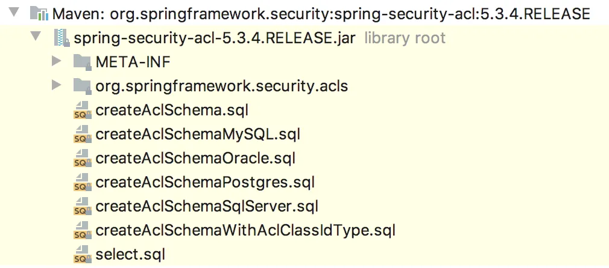
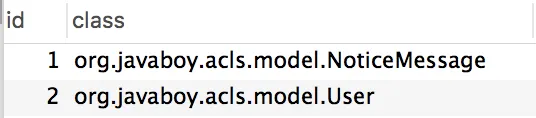
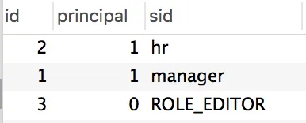
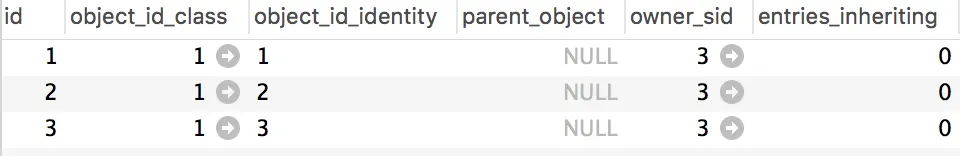
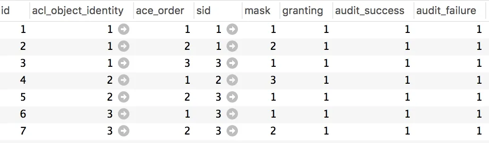

# Spring Security 中如何细化权限粒度？

Original 江南一点雨 [江南一点雨](javascript:void(0);) *2020年09月16日 08:08*

松哥原创的 Spring Boot 视频教程已经杀青，感兴趣的小伙伴戳这里-->[Spring Boot+Vue+微人事视频教程](https://mp.weixin.qq.com/s?__biz=MzI1NDY0MTkzNQ==&mid=2247489641&idx=1&sn=4cee9122a2fa2677bdc71abf5c7e8c00&scene=21#wechat_redirect)

------

有小伙伴表示微人事(https://github.com/lenve/vhr)的权限粒度不够细。不过松哥想说的是，技术都是相通的，明白了 vhr 中权限管理的原理，在此基础上就可以去细化权限管理粒度，细化过程和还是用的 vhr 中用的技术，只不过设计层面重新规划而已。

当然今天我想说的并不是这个话题，主要是想和大家聊一聊 Spring Security 中权限管理粒度细化的问题。因为这个问题会涉及到不同的权限管理模型，今天和小伙伴们聊一聊～

## 1.权限管理模型

要想将细化权限粒度，我们不可避免会涉及到一些权限模型，例如 ACL、RBAC、DAC、MAC 以及 ABAC、PBAC 等。

在这些众多的权限模型中，我们使用较多的是 RBAC，ACL 也有一些项目在使用，另外几种则使用相对较少。因此松哥这里重点和大家介绍 ACL 和 RBAC。

### 1.1 ACL

ACL 是一种比较古老的权限控制模型。英文全称是 Access Control List，中文称作访问控制列表，这是一种面向资源的访问控制模型，所有的权限配置都是针对资源的。

它的原理是这样：

对于系统中的每一个资源，都会配置一个访问列表，这个列表中记录了用户/角色对于资源的 CURD 权限，当系统需要访问这些资源时，会首先检查列表中是否存在当前用户的访问权限，进而确定当前用户是否可以执行相应的操作。

ACL 的使用非常简单，搞明白它的原理自己分分钟就能实现。但是 ACL 有一个明显的缺点，就是需要维护大量的访问权限列表。大量的访问控制列表带来的问题就是性能下降以及维护复杂。

### 1.2 RBAC

RBAC（Role-based access control）是一种以角色为基础的访问控制，也是目前使用较多的一种权限模型，它有多种不同的变体，松哥后面会专门写一篇文章来介绍 RBAC，这里仅简单科普下。

RBAC 权限模型将用户按角色进行归类，通过用户的角色来确定用户对某项资源是否具备操作权限。RBAC 简化了用户与权限的管理，它将用户与角色关联、角色与权限管理、权限与资源关联，这种模式使得用户的授权管理变得非常简单和易于维护。

### 1.3 其他

下面这些使用常见较少，小伙伴们做一个了解即可，感兴趣的小伙伴也可以自行研究下。

- **ABAC**：这是一种基于属性的访问控制。
- **PBAC**：这是一种基于策略的访问控制。
- **DAC**：除了权限控制，主体也可以将权限授予其他主体。
- **MAC**：资源可以被哪些类别的主体进行哪些操作，主体可以对哪些等级的资源进行哪些操作，这两个条件同时满足时，允许访问。

## 2.ACL

接下来松哥要和大家仔细介绍一下 ACL 这种权限模型，RBAC 我后面专门写文章介绍，本文先不做讨论。

Acl 的全称是 Access Control List，也就是我们所说的访问控制列表，是用以控制对象的访问权限的。Acl 的一个核心思路就是将某个对象的某种权限授予某个用户或某种角色，它们之间的关系是多对多，即一个用户/角色可以具备某个对象的多种权限，某个对象的权限也可以被多个用户/角色所持有。

举个简单例子：

现在有一个 User 对象，针对该对象有查询、修改、删除等权限，可以将这些权限赋值给某一个用户，也可以将这些权限赋值给某一个角色，当用户具备这些角色时就具有执行相应操作的权限。

从这个角度看，Acl 是一种粒度非常细的权限控制，它就是专门控制某一个对象的操作权限。所有的这些权限都记录在数据库中，这带来了另外一个问题就是需要维护的权限数据量非常庞大，不利于后期扩展。当然，对于一个简单的系统，使用 Acl 还是可以的，没有任何问题。

### 2.1 核心概念

接下来我们来看看 Acl 中一些核心概念。

**Sid**

Sid 代表了用户和角色，它有两种：GrantedAuthoritySid 和 PrincipalSid，前者代表角色，后者代表用户。在 Spring Security 中，用户和角色信息都是保存在 Authentication 对象中的，即 Sid 是从 Authentication 对象中提取出来的，提取出来的值是 GrantedAuthoritySid+PrincipalSid，而不是其中某一项，具体的提取方法是 SidRetrievalStrategyImpl#getSids，相关源码如下：

```
public List<Sid> getSids(Authentication authentication) {
 Collection<? extends GrantedAuthority> authorities = roleHierarchy
   .getReachableGrantedAuthorities(authentication.getAuthorities());
 List<Sid> sids = new ArrayList<>(authorities.size() + 1);
 sids.add(new PrincipalSid(authentication));
 for (GrantedAuthority authority : authorities) {
  sids.add(new GrantedAuthoritySid(authority));
 }
 return sids;
}
```

这个 Sid 大家可以简单理解为当前用户的权限（这个说法不是很准确，可以近似理解）。

**ObjectIdentity**

ObjectIdentity 是一个域对象，这是官方的说法，有点拗口。实际上这就是你要操作的对象。

例如我有一个 User 对象，如果直接去记录能够对 User 对象执行哪些操作，这就会导致高耦和。所以我们需要对其解耦，将所有需要操作的对象通过 ObjectIdentity 描述出来，这样就能确保权限系统不和具体的业务绑定。

ObjectIdentity 中有两个关键方法，getType 和 getIdentifier。一般来说，getType 方法返回真实对象类的全路径，例如 `org.javaboy.acl.model.User`，getIdentifier 方法则返回真实对象的 id，通过这两个方法，就能够锁定一个对象。

**Acl**

看名字就知道，这算是整个系统的核心调度部分。

一个 Acl 对象会关联一个 ObjectIdentity，一个 Acl 对象还拥有一个 Sid，这个 Sid 表示这个 Acl 是属于谁的？属于谁，谁就可以修改甚至删除这个 Acl 对象。

**AccessControlEntry**

AccessControlEntry 简写为 ACE，一个 AccessControlEntry 对象代表一条权限记录。每一个 AccessControlEntry 都对应了一个 Acl，一个 Acl 对象对应多个 AccessControlEntry，有了这层对应关系，相当于就知道这个权限操作的是哪个对象。

然后 AccessControlEntry 中还包含一个 Sid 和一个 Permission 对象，表示某个 Sid 具备某种权限。

可以看到，Acl+ACE，就描述出来了某个 Sid 可以具备某个 ObjectIdentity 的某种 Permission。

**Permission**

这个就是具体的权限对象。似乎是受 Linux 影响，它使用了权限掩码，最多支持 232-1 种权限。

Spring Security 种默认定义了五种：

```
public class BasePermission extends AbstractPermission {
 public static final Permission READ = new BasePermission(1 << 0, 'R'); // 1
 public static final Permission WRITE = new BasePermission(1 << 1, 'W'); // 2
 public static final Permission CREATE = new BasePermission(1 << 2, 'C'); // 4
 public static final Permission DELETE = new BasePermission(1 << 3, 'D'); // 8
 public static final Permission ADMINISTRATION = new BasePermission(1 << 4, 'A'); // 16

 protected BasePermission(int mask) {
  super(mask);
 }

 protected BasePermission(int mask, char code) {
  super(mask, code);
 }
}
```

**AclService**

AclService 接口中主要定义了一些解析 Acl 对象的方法，通过 ObjectIdentity 对象解析出其对应的 Acl。

AclService 主要有两类实现接口：

- JdbcAclService
- JdbcMutableAclService

前者主要是针对 Acl 的查询操作，后者支持 Acl 的添加、更新以及删除等操作。我们常用的是 JdbcMutableAclService。

至此，Acl 中一些核心概念就和小伙伴们介绍完了。

### 2.2 Acl 数据表

上面提到的对象数据，都需要对应的数据表来维护，在 spring-security-acl 依赖中，为这些数据表都提供了脚本。



可以看到，针对不同类型的数据库，都有对应的脚本。

这里主要涉及到四张表，接下来松哥以 MySQL 脚本为例，来分别介绍每张表的作用及其字段的含义。

**acl_class**

acl_class 是用来保存对象类型的全路径，如下：



这里的 id 自增长，class 中保存的是相应对象的全路径名。

**acl_sid**

acl_sid 表用来保存 Sid 的。



根据前面的介绍，存在两种类型的 Sid，GrantedAuthoritySid 和 PrincipalSid。所以这里的 principal 字段表示该 Sid 是哪种类型的。

**acl_object_identity**

acl_object_identity 用来保存需要进行访问控制的对象信息。



- object_id_class：关联 acl_class.id。
- object_id_identity：需要控制的对象的 id。
- parent_object：父对象 ID，关联一条 acl_object_identity 记录。
- owner_sid：这个 acl 记录拥有者的 sid。
- entries_inheriting：是否需要继承父对象的权限。

简单来说，这个表中的 object_id_class 和 object_id_identity 字段锁定了你要进行权限控制的对象，具体如何控制呢？则要看 acl_entry 中的关联关系了。

**acl_entry**

这个表单纯看数据，一堆数字。



松哥来捋一下，大家就懂了。

- acl_object_identity：关联 acl_object_identity.id。
- ace_order：权限顺序。acl_object_identity 和 ace_order 的组合要唯一。
- sid：关联 acl_sid.id。这条权限记录关联哪个用户/角色。
- mask：权限掩码。
- granting：表示当前记录是否生效。
- audit_success/audit_failure：审计信息。

简单来说，acl_entry 中的一条记录，关联了一个要操作的对象（acl_object_identity 和 ace_order 字段），关联了 Sid（sid 字段），也描述了权限（mask），将权限涉及到的东西都在该字段中整合起来了。

## 3.小结

好啦，这就本文和小伙伴们科普一下 ACL 的概念，下篇文章松哥通过一个完整的案例来和小伙伴们演示具体用法～

参考资料：

1. https://blog.gaoyuexiang.cn/2020/07/02/spring-security-acl-conception-and-component
2. https://www.iteye.com/blog/elim-2269021

今日干货


刚刚发表

查看:66666回复:666

公众号后台回复 ssm，免费获取松哥纯手敲的 SSM 框架学习干货。

SpringSecurity系列52

SpringSecurity系列 · 目录


上一篇Spring Security 中的 hasRole 和 hasAuthority 有区别吗？


# 