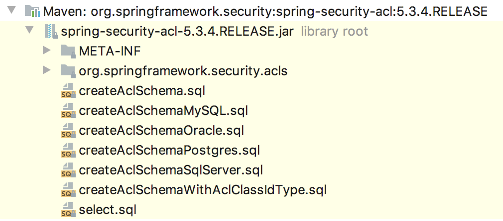
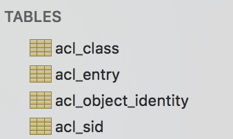

# 一个案例演示 Spring Security 中粒度超细的权限控制！

想要细化权限控制粒度，办法很多。本文接着上文（[Spring Security 中如何细化权限粒度？](https://mp.weixin.qq.com/s/Q9lfrJ3iioUpYEO9elCtsw)），通过一个具体的案例来向小伙伴们展示基于 Acl 的权限控制。其他的权限控制模型后面也会一一介绍。


## 1.准备工作

首先创建一个 Spring Boot 项目，由于我们这里涉及到数据库操作，所以除了 Spring Security 依赖之外，还需要加入数据库驱动以及 MyBatis 依赖。

由于没有 acl 相关的 starter，所以需要我们手动添加 acl 依赖，另外 acl 还依赖于 ehcache 缓存，所以还需要加上缓存依赖。

最终的 pom.xml 文件如下：

```
<dependency>
    <groupId>org.springframework.boot</groupId>
    <artifactId>spring-boot-starter-security</artifactId>
</dependency>
<dependency>
    <groupId>org.springframework.boot</groupId>
    <artifactId>spring-boot-starter-web</artifactId>
</dependency>
<dependency>
    <groupId>org.springframework.security</groupId>
    <artifactId>spring-security-acl</artifactId>
    <version>5.3.4.RELEASE</version>
</dependency>
<dependency>
    <groupId>org.mybatis.spring.boot</groupId>
    <artifactId>mybatis-spring-boot-starter</artifactId>
    <version>2.1.3</version>
</dependency>
<dependency>
    <groupId>mysql</groupId>
    <artifactId>mysql-connector-java</artifactId>
</dependency>
<dependency>
    <groupId>net.sf.ehcache</groupId>
    <artifactId>ehcache</artifactId>
    <version>2.10.4</version>
</dependency>
<dependency>
    <groupId>com.alibaba</groupId>
    <artifactId>druid-spring-boot-starter</artifactId>
    <version>1.1.23</version>
</dependency>
<dependency>
    <groupId>org.springframework</groupId>
    <artifactId>spring-context-support</artifactId>
</dependency>
```

项目创建成功之后，我们在 acl 的 jar 包中可以找到数据库脚本文件：

[](http://img.itboyhub.com/2020/07/20200913155708.png)

根据自己的数据库选择合适的脚本执行，执行后一共创建了四张表，如下：

[](http://img.itboyhub.com/2020/07/20200913173811.png)

表的含义我就不做过多解释了，不清楚的小伙伴可以参考上篇文章：[Spring Security 中如何细化权限粒度？](https://mp.weixin.qq.com/s/Q9lfrJ3iioUpYEO9elCtsw)

最后，再在项目的 application.properties 文件中配置数据库信息，如下：

```
spring.datasource.url=jdbc:mysql:///acls?useUnicode=true&characterEncoding=UTF-8&serverTimezone=Asia/Shanghai
spring.datasource.username=root
spring.datasource.password=123
spring.datasource.driver-class-name=com.mysql.cj.jdbc.Driver
```

至此，准备工作就算完成了。接下来我们来看配置。

## 2.ACL 配置

这块配置代码量比较大，我先把代码摆上来，我们再逐个分析：

```
@Configuration
@EnableGlobalMethodSecurity(prePostEnabled = true, securedEnabled = true)
public class AclConfig {

    @Autowired
    DataSource dataSource;

    @Bean
    public AclAuthorizationStrategy aclAuthorizationStrategy() {
        return new AclAuthorizationStrategyImpl(new SimpleGrantedAuthority("ROLE_ADMIN"));
    }

    @Bean
    public PermissionGrantingStrategy permissionGrantingStrategy() {
        return new DefaultPermissionGrantingStrategy(new ConsoleAuditLogger());
    }

    @Bean
    public AclCache aclCache() {
        return new EhCacheBasedAclCache(aclEhCacheFactoryBean().getObject(), permissionGrantingStrategy(), aclAuthorizationStrategy());
    }

    @Bean
    public EhCacheFactoryBean aclEhCacheFactoryBean() {
        EhCacheFactoryBean ehCacheFactoryBean = new EhCacheFactoryBean();
        ehCacheFactoryBean.setCacheManager(aclCacheManager().getObject());
        ehCacheFactoryBean.setCacheName("aclCache");
        return ehCacheFactoryBean;
    }

    @Bean
    public EhCacheManagerFactoryBean aclCacheManager() {
        return new EhCacheManagerFactoryBean();
    }

    @Bean
    public LookupStrategy lookupStrategy() {
        return new BasicLookupStrategy(dataSource, aclCache(), aclAuthorizationStrategy(), new ConsoleAuditLogger()
        );
    }

    @Bean
    public AclService aclService() {
        return new JdbcMutableAclService(dataSource, lookupStrategy(), aclCache());
    }

    @Bean
    PermissionEvaluator permissionEvaluator() {
        AclPermissionEvaluator permissionEvaluator = new AclPermissionEvaluator(aclService());
        return permissionEvaluator;
    }
}
```

1. @EnableGlobalMethodSecurity 注解的配置表示开启项目中 @PreAuthorize、@PostAuthorize 以及 @Secured 注解的使用，一会我们要通过这些注解配置权限。
2. 由于引入了数据库的一整套东西，并且配置了数据库连接信息，所以这里可以注入 DataSource 实例以备后续使用。
3. AclAuthorizationStrategy 实例用来判断当前的认证主体是否有修改 Acl 的权限，准确来说是三种权限：修改 Acl 的 owner；修改 Acl 的审计信息以及修改 ACE 本身。这个接口只有一个实现类就是 AclAuthorizationStrategyImpl，我们在创建实例时，可以传入三个参数，分别对应了这三种权限，也可以传入一个参数，表示这一个角色可以干三件事。
4. PermissionGrantingStrategy 接口提供了一个 isGranted 方法，这个方法就是最终真正进行权限比对的方法，该接口只有一个实现类 DefaultPermissionGrantingStrategy，直接 new 就行了。
5. 在 ACL 体系中，由于权限比对总是要查询数据库，造成了性能问题，因此引入了 Ehcache 做缓存。AclCache 共有两个实现类：SpringCacheBasedAclCache 和 EhCacheBasedAclCache。我们前面已经引入了 ehcache 实例，所以这里配置 EhCacheBasedAclCache 实例即可。
6. LookupStrategy 可以通过 ObjectIdentity 解析出对应的 Acl。LookupStrategy 只有一个实现类就是 BasicLookupStrategy，直接 new 即可。
7. AclService 这个我们在上文已经介绍过了，这里不再赘述。
8. PermissionEvaluator 是为表达式 hasPermission 提供支持的。由于本案例后面使用类似于 `@PreAuthorize("hasPermission(#noticeMessage, 'WRITE')")` 这样的注解进行权限控制，因此之类需要配置一个 PermissionEvaluator 实例。

至此，这里的配置类就和大家介绍完了。

## 3.情节设定

假设我现在有一个通知消息类 NoticeMessage，如下：

```
public class NoticeMessage {
    private Integer id;
    private String content;

    @Override
    public String toString() {
        return "NoticeMessage{" +
                "id=" + id +
                ", content='" + content + '\'' +
                '}';
    }

    public Integer getId() {
        return id;
    }

    public void setId(Integer id) {
        this.id = id;
    }

    public String getContent() {
        return content;
    }

    public void setContent(String content) {
        this.content = content;
    }
}
```

然后根据该类创建了数据表：

```
CREATE TABLE `system_message` (
  `id` int(11) unsigned NOT NULL AUTO_INCREMENT,
  `content` varchar(255) COLLATE utf8mb4_unicode_ci DEFAULT NULL,
  PRIMARY KEY (`id`)
) ENGINE=InnoDB DEFAULT CHARSET=utf8mb4 COLLATE=utf8mb4_unicode_ci;
```

那么接下来的权限控制就是针对这个 NoticeMessage 的。

创建 NoticeMessageMapper，并添加几个测试方法：

```
@Mapper
public interface NoticeMessageMapper {
    List<NoticeMessage> findAll();

    NoticeMessage findById(Integer id);

    void save(NoticeMessage noticeMessage);

    void update(NoticeMessage noticeMessage);
}
```

NoticeMessageMapper.xml 内容如下：

```
<!DOCTYPE mapper
        PUBLIC "-//mybatis.org//DTD Mapper 3.0//EN"
        "http://mybatis.org/dtd/mybatis-3-mapper.dtd">
<mapper namespace="org.javaboy.acls.mapper.NoticeMessageMapper">


    <select id="findAll" resultType="org.javaboy.acls.model.NoticeMessage">
        select * from system_message;
    </select>

    <select id="findById" resultType="org.javaboy.acls.model.NoticeMessage">
        select * from system_message where id=#{id};
    </select>

    <insert id="save" parameterType="org.javaboy.acls.model.NoticeMessage">
        insert into system_message (id,content) values (#{id},#{content});
    </insert>

    <update id="update" parameterType="org.javaboy.acls.model.NoticeMessage">
        update system_message set content = #{content} where id=#{id};
    </update>
</mapper>
```

这些应该都好理解，没啥好说的。

接下来创建 NoticeMessageService，如下：

```
@Service
public class NoticeMessageService {
    @Autowired
    NoticeMessageMapper noticeMessageMapper;

    @PostFilter("hasPermission(filterObject, 'READ')")
    public List<NoticeMessage> findAll() {
        List<NoticeMessage> all = noticeMessageMapper.findAll();
        return all;
    }

    @PostAuthorize("hasPermission(returnObject, 'READ')")
    public NoticeMessage findById(Integer id) {
        return noticeMessageMapper.findById(id);
    }

    @PreAuthorize("hasPermission(#noticeMessage, 'CREATE')")
    public NoticeMessage save(NoticeMessage noticeMessage) {
        noticeMessageMapper.save(noticeMessage);
        return noticeMessage;
    }
    
    @PreAuthorize("hasPermission(#noticeMessage, 'WRITE')")
    public void update(NoticeMessage noticeMessage) {
        noticeMessageMapper.update(noticeMessage);
    }

}
```

涉及到了两个新注解，稍微说下：

- @PostFilter：在执行方法后过滤返回的集合或数组（筛选出当前用户具有 READ 权限的数据），returnObject 就表示方法的返回值。有一个和它对应的注解 @PreFilter，这个注解允许方法调用，但必须在进入方法之前对参数进行过滤。
- @PostAuthorize：允许方法调用，但是如果表达式计算结果为false，将抛出一个安全性异常，`#noticeMessage` 对应了方法的参数。
- @PreAuthorize：在方法调用之前，基于表达式的计算结果来限制对方法的访问。

明白了注解的含义，那么上面的方法应该就不用多做解释了吧。

配置完成，接下来我们进行测试。

## 4.测试

为了方便测试，我们首先准备几条测试数据，如下：

```
INSERT INTO `acl_class` (`id`, `class`)
VALUES
	(1,'org.javaboy.acls.model.NoticeMessage');
INSERT INTO `acl_sid` (`id`, `principal`, `sid`)
VALUES
	(2,1,'hr'),
	(1,1,'manager'),
	(3,0,'ROLE_EDITOR');
INSERT INTO `system_message` (`id`, `content`)
VALUES
	(1,'111'),
	(2,'222'),
	(3,'333');
```

首先添加了 acl_class，然后添加了三个 Sid，两个是用户，一个是角色，最后添加了三个 NoticeMessage 实例。

目前没有任何用户/角色能够访问到 system_message 中的三条数据。例如执行如下代码获取不到任何数据：

```
@Test
@WithMockUser(roles = "EDITOR")
public void test01() {
    List<NoticeMessage> all = noticeMessageService.findAll();
    System.out.println("all = " + all);
}
```

> @WithMockUser(roles = “EDITOR”) 表示使用 EDITOR 角色访问。松哥这里是为了方便。小伙伴们也可以自己给 Spring Security 配置用户，设置相关接口，然后 Controller 中添加接口进行测试，我这里就不那么麻烦了。

现在我们对其进行配置。

首先我想设置让 hr 这个用户可以读取 system_message 表中 id 为 1 的记录，方式如下：

```
@Autowired
NoticeMessageService noticeMessageService;
@Autowired
JdbcMutableAclService jdbcMutableAclService;
@Test
@WithMockUser(username = "javaboy")
@Transactional
@Rollback(value = false)
public void test02() {
    ObjectIdentity objectIdentity = new ObjectIdentityImpl(NoticeMessage.class, 1);
    Permission p = BasePermission.READ;
    MutableAcl acl = jdbcMutableAclService.createAcl(objectIdentity);
    acl.insertAce(acl.getEntries().size(), p, new PrincipalSid("hr"), true);
    jdbcMutableAclService.updateAcl(acl);
}
```

我们设置了 mock user 是 javaboy，也就是这个 acl 创建好之后，它的 owner 是 javaboy，但是我们前面预设数据中 Sid 没有 javaboy，所以会自动向 acl_sid 表中添加一条记录，值为 javaboy。

在这个过程中，会分别向 acl_entry、acl_object_identity 以及 acl_sid 三张表中添加记录，因此需要添加事务，同时因为我们是在单元测试中执行，为了确保能够看到数据库中数据的变化，所以需要添加 @Rollback(value = false) 注解让事务不要自动回滚。

在方法内部，首先分别创建 ObjectIdentity 和 Permission 对象，然后创建一个 acl 对象出来，这个过程中会将 javaboy 添加到 acl_sid 表中。

接下来调用 acl_insertAce 方法，将 ace 存入 acl 中，最后调用 updateAcl 方法去更新 acl 对象即可。

配置完成后，执行该方法，执行完成后，数据库中就会有相应的记录了。

接下来，使用 hr 这个用户就可以读取到 id 为 1 的记录了。如下：

```
@Test
@WithMockUser(username = "hr")
public void test03() {
    List<NoticeMessage> all = noticeMessageService.findAll();
    assertNotNull(all);
    assertEquals(1, all.size());
    assertEquals(1, all.get(0).getId());
    NoticeMessage byId = noticeMessageService.findById(1);
    assertNotNull(byId);
    assertEquals(1, byId.getId());
}
```

松哥这里用了两个方法来和大家演示。首先我们调用了 findAll，这个方法会查询出所有的数据，然后返回结果会被自动过滤，只剩下 hr 用户具有读取权限的数据，即 id 为 1 的数据；另一个调用的就是 findById 方法，传入参数为 1，这个好理解。

如果此时想利用 hr 这个用户修改对象，则是不可以的。我们可以继续使用上面的代码，让 hr 这个用户可以修改 id 为 1 的记录，如下：

```
@Test
@WithMockUser(username = "javaboy")
@Transactional
@Rollback(value = false)
public void test02() {
    ObjectIdentity objectIdentity = new ObjectIdentityImpl(NoticeMessage.class, 1);
    Permission p = BasePermission.WRITE;
    MutableAcl acl = (MutableAcl) jdbcMutableAclService.readAclById(objectIdentity);
    acl.insertAce(acl.getEntries().size(), p, new PrincipalSid("hr"), true);
    jdbcMutableAclService.updateAcl(acl);
}
```

注意这里权限改为 WRITE 权限。由于 acl 中已经存在这个 ObjectIdentity 了，所以这里通过 readAclById 方法直接读取已有的 acl 即可。方法执行完毕后，我们再进行 hr 用户写权限的测试：

```
@Test
@WithMockUser(username = "hr")
public void test04() {
    NoticeMessage msg = noticeMessageService.findById(1);
    assertNotNull(msg);
    assertEquals(1, msg.getId());
    msg.setContent("javaboy-1111");
    noticeMessageService.update(msg);
    msg = noticeMessageService.findById(1);
    assertNotNull(msg);
    assertEquals("javaboy-1111", msg.getContent());
}
```

此时，hr 就可以使用 WRITE 权限去修改对象了。

假设我现在想让 manager 这个用户去创建一个 id 为 99 的 NoticeMessage，默认情况下，manager 是没有这个权限的。我们现在可以给他赋权：

```
@Test
@WithMockUser(username = "javaboy")
@Transactional
@Rollback(value = false)
public void test02() {
    ObjectIdentity objectIdentity = new ObjectIdentityImpl(NoticeMessage.class, 99);
    Permission p = BasePermission.CREATE;
    MutableAcl acl = jdbcMutableAclService.createAcl(objectIdentity);
    acl.insertAce(acl.getEntries().size(), p, new PrincipalSid("manager"), true);
    jdbcMutableAclService.updateAcl(acl);
}
```

注意，这里的权限是 CREATE。

接下来使用 manager 用户就可以添加数据了：

```
@Test
@WithMockUser(username = "manager")
public void test05() {
    NoticeMessage noticeMessage = new NoticeMessage();
    noticeMessage.setId(99);
    noticeMessage.setContent("999");
    noticeMessageService.save(noticeMessage);
}
```

此时就可以添加成功了。添加成功后，manager 这个用户没有读 id 为 99 的数据的权限，可以参考前面案例自行添加。

## 5.小结

从上面的案例中大家可以看到，ACL 权限模型中的权限控制真的是非常非常细，细到每一个对象的 CURD。

优点就不用说了，够细！同时将业务和权限成功分离。缺点也很明显，权限数据量庞大，扩展性弱。

最后，公号后台回复 acl 获取本文案例下载链接。

\#[Spring Security](https://www.javaboy.org/tags/Spring-Security/)

喜欢这篇文章吗？扫码关注公众号**【江南一点雨】**，**【江南一点雨】**专注于 SPRING BOOT+微服务以及前后端分离技术，每天推送原创技术干货，关注后回复 JAVA，领取松哥为你精心准备的 JAVA 干货!