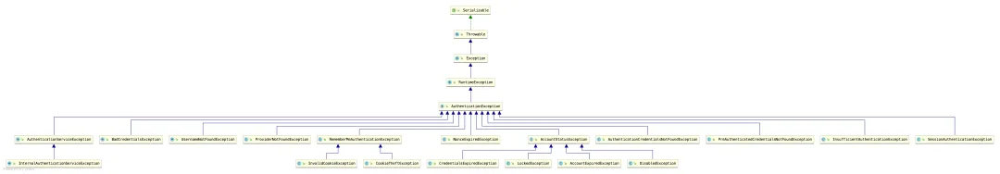
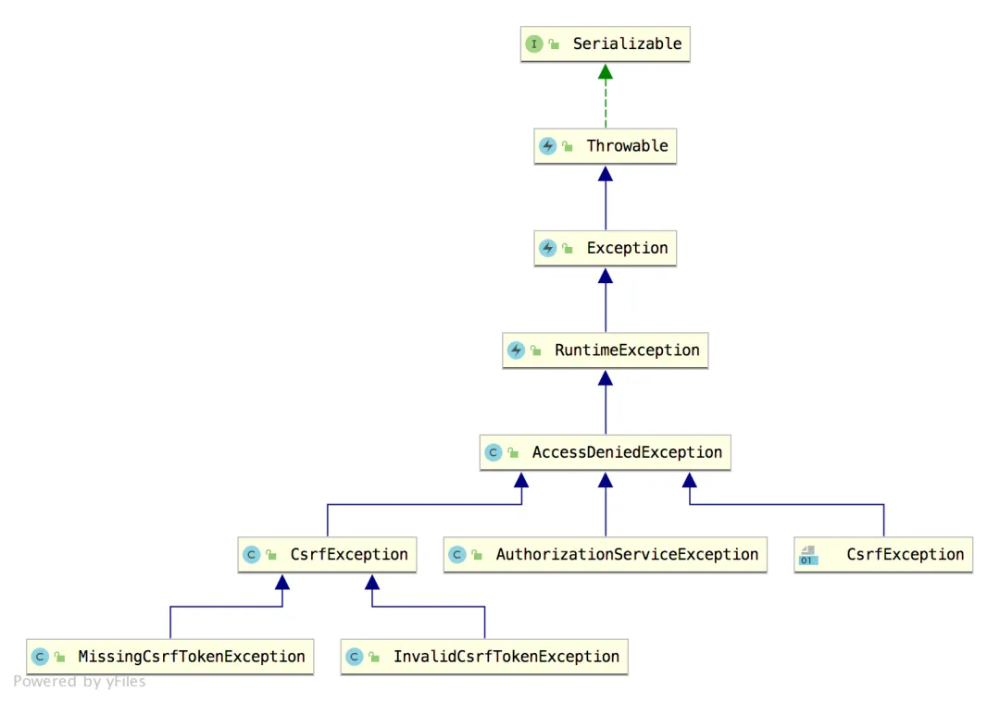

# 一文搞定 Spring Security 异常处理机制！

Original 江南一点雨 [江南一点雨](javascript:void(0);) *2020年06月30日 08:08*

松哥原创的 Spring Boot 视频教程已经杀青，感兴趣的小伙伴戳这里-->[Spring Boot+Vue+微人事视频教程](https://mp.weixin.qq.com/s?__biz=MzI1NDY0MTkzNQ==&mid=2247488799&idx=1&sn=cdfd5315ff18c979b6f5d390ab4d9059&scene=21#wechat_redirect)

今天来和小伙伴们聊一聊 Spring Security 中的异常处理机制。

在 Spring Security 的过滤器链中，ExceptionTranslationFilter 过滤器专门用来处理异常，在 ExceptionTranslationFilter 中，我们可以看到，异常被分为了两大类：认证异常和授权异常，两种异常分别由不同的回调函数来处理，今天松哥就来和大家分享一下这里的条条框框。

## 1.异常分类

Spring Security 中的异常可以分为两大类，一种是认证异常，一种是授权异常。

认证异常就是 AuthenticationException，它有众多的实现类：



可以看到，这里的异常实现类还是蛮多的，都是都是认证相关的异常，也就是登录失败的异常。这些异常，有的松哥在之前的文章中都和大家介绍过了，例如下面这段代码(节选自：[Spring Security 做前后端分离，咱就别做页面跳转了！统统 JSON 交互](https://mp.weixin.qq.com/s?__biz=MzI1NDY0MTkzNQ==&mid=2247488157&idx=2&sn=845178d45e73232a94ed46df12ea76cc&scene=21#wechat_redirect))：

```
resp.setContentType("application/json;charset=utf-8");
PrintWriter out = resp.getWriter();
RespBean respBean = RespBean.error(e.getMessage());
if (e instanceof LockedException) {
    respBean.setMsg("账户被锁定，请联系管理员!");
} else if (e instanceof CredentialsExpiredException) {
    respBean.setMsg("密码过期，请联系管理员!");
} else if (e instanceof AccountExpiredException) {
    respBean.setMsg("账户过期，请联系管理员!");
} else if (e instanceof DisabledException) {
    respBean.setMsg("账户被禁用，请联系管理员!");
} else if (e instanceof BadCredentialsException) {
    respBean.setMsg("用户名或者密码输入错误，请重新输入!");
}
out.write(new ObjectMapper().writeValueAsString(respBean));
out.flush();
out.close();
```

另一类就是授权异常 AccessDeniedException，授权异常的实现类比较少，因为授权失败的可能原因比较少。



## 2.ExceptionTranslationFilter

ExceptionTranslationFilter 是 Spring Security 中专门负责处理异常的过滤器，默认情况下，这个过滤器已经被自动加载到过滤器链中。

有的小伙伴可能不清楚是怎么被加载的，我这里和大家稍微说一下。

当我们使用 Spring Security 的时候，如果需要自定义实现逻辑，都是继承自 WebSecurityConfigurerAdapter 进行扩展，WebSecurityConfigurerAdapter 中本身就进行了一部分的初始化操作，我们来看下它里边 HttpSecurity 的初始化过程：

```
protected final HttpSecurity getHttp() throws Exception {
 if (http != null) {
  return http;
 }
 AuthenticationEventPublisher eventPublisher = getAuthenticationEventPublisher();
 localConfigureAuthenticationBldr.authenticationEventPublisher(eventPublisher);
 AuthenticationManager authenticationManager = authenticationManager();
 authenticationBuilder.parentAuthenticationManager(authenticationManager);
 Map<Class<?>, Object> sharedObjects = createSharedObjects();
 http = new HttpSecurity(objectPostProcessor, authenticationBuilder,
   sharedObjects);
 if (!disableDefaults) {
  http
   .csrf().and()
   .addFilter(new WebAsyncManagerIntegrationFilter())
   .exceptionHandling().and()
   .headers().and()
   .sessionManagement().and()
   .securityContext().and()
   .requestCache().and()
   .anonymous().and()
   .servletApi().and()
   .apply(new DefaultLoginPageConfigurer<>()).and()
   .logout();
  ClassLoader classLoader = this.context.getClassLoader();
  List<AbstractHttpConfigurer> defaultHttpConfigurers =
    SpringFactoriesLoader.loadFactories(AbstractHttpConfigurer.class, classLoader);
  for (AbstractHttpConfigurer configurer : defaultHttpConfigurers) {
   http.apply(configurer);
  }
 }
 configure(http);
 return http;
}
```

可以看到，在 getHttp 方法的最后，调用了 `configure(http);`，我们在使用 Spring Security 时，自定义配置类继承自 WebSecurityConfigurerAdapter 并重写的 configure(HttpSecurity http) 方法就是在这里调用的，换句话说，当我们去配置 HttpSecurity 时，其实它已经完成了一波初始化了。

在默认的 HttpSecurity 初始化的过程中，调用了 exceptionHandling 方法，这个方法会将 ExceptionHandlingConfigurer 配置进来，最终调用 ExceptionHandlingConfigurer#configure 方法将 ExceptionTranslationFilter 添加到 Spring Security 过滤器链中。

我们来看下 ExceptionHandlingConfigurer#configure 方法源码：

```
@Override
public void configure(H http) {
 AuthenticationEntryPoint entryPoint = getAuthenticationEntryPoint(http);
 ExceptionTranslationFilter exceptionTranslationFilter = new ExceptionTranslationFilter(
   entryPoint, getRequestCache(http));
 AccessDeniedHandler deniedHandler = getAccessDeniedHandler(http);
 exceptionTranslationFilter.setAccessDeniedHandler(deniedHandler);
 exceptionTranslationFilter = postProcess(exceptionTranslationFilter);
 http.addFilter(exceptionTranslationFilter);
}
```

可以看到，这里构造了两个对象传入到 ExceptionTranslationFilter 中：

- AuthenticationEntryPoint 这个用来处理认证异常。
- AccessDeniedHandler 这个用来处理授权异常。

具体的处理逻辑则在 ExceptionTranslationFilter 中，我们来看一下：

```
public class ExceptionTranslationFilter extends GenericFilterBean {
 public ExceptionTranslationFilter(AuthenticationEntryPoint authenticationEntryPoint,
   RequestCache requestCache) {
  this.authenticationEntryPoint = authenticationEntryPoint;
  this.requestCache = requestCache;
 }
 public void doFilter(ServletRequest req, ServletResponse res, FilterChain chain)
   throws IOException, ServletException {
  HttpServletRequest request = (HttpServletRequest) req;
  HttpServletResponse response = (HttpServletResponse) res;
  try {
   chain.doFilter(request, response);
  }
  catch (IOException ex) {
   throw ex;
  }
  catch (Exception ex) {
   Throwable[] causeChain = throwableAnalyzer.determineCauseChain(ex);
   RuntimeException ase = (AuthenticationException) throwableAnalyzer
     .getFirstThrowableOfType(AuthenticationException.class, causeChain);
   if (ase == null) {
    ase = (AccessDeniedException) throwableAnalyzer.getFirstThrowableOfType(
      AccessDeniedException.class, causeChain);
   }
   if (ase != null) {
    if (response.isCommitted()) {
     throw new ServletException("Unable to handle the Spring Security Exception because the response is already committed.", ex);
    }
    handleSpringSecurityException(request, response, chain, ase);
   }
   else {
    if (ex instanceof ServletException) {
     throw (ServletException) ex;
    }
    else if (ex instanceof RuntimeException) {
     throw (RuntimeException) ex;
    }
    throw new RuntimeException(ex);
   }
  }
 }
 private void handleSpringSecurityException(HttpServletRequest request,
   HttpServletResponse response, FilterChain chain, RuntimeException exception)
   throws IOException, ServletException {
  if (exception instanceof AuthenticationException) {
   sendStartAuthentication(request, response, chain,
     (AuthenticationException) exception);
  }
  else if (exception instanceof AccessDeniedException) {
   Authentication authentication = SecurityContextHolder.getContext().getAuthentication();
   if (authenticationTrustResolver.isAnonymous(authentication) || authenticationTrustResolver.isRememberMe(authentication)) {
    sendStartAuthentication(
      request,
      response,
      chain,
      new InsufficientAuthenticationException(
       messages.getMessage(
        "ExceptionTranslationFilter.insufficientAuthentication",
        "Full authentication is required to access this resource")));
   }
   else {
    accessDeniedHandler.handle(request, response,
      (AccessDeniedException) exception);
   }
  }
 }
 protected void sendStartAuthentication(HttpServletRequest request,
   HttpServletResponse response, FilterChain chain,
   AuthenticationException reason) throws ServletException, IOException {
  SecurityContextHolder.getContext().setAuthentication(null);
  requestCache.saveRequest(request, response);
  logger.debug("Calling Authentication entry point.");
  authenticationEntryPoint.commence(request, response, reason);
 }
}
```

ExceptionTranslationFilter 的源码比较长，我这里列出来核心的部分和大家分析：

1. 过滤器最核心的当然是 doFilter 方法，我们就从 doFilter 方法看起。这里的 doFilter 方法中过滤器链继续向下执行，ExceptionTranslationFilter 处于 Spring Security 过滤器链的倒数第二个，最后一个是 FilterSecurityInterceptor，FilterSecurityInterceptor 专门处理授权问题，在处理授权问题时，就会发现用户未登录、未授权等，进而抛出异常，抛出的异常，最终会被 ExceptionTranslationFilter#doFilter 方法捕获。
2. 当捕获到异常之后，接下来通过调用 `throwableAnalyzer.getFirstThrowableOfType` 方法来判断是认证异常还是授权异常，判断出异常类型之后，进入到 handleSpringSecurityException 方法进行处理；如果不是 Spring Security 中的异常类型，则走 ServletException 异常类型的处理逻辑。
3. 进入到 handleSpringSecurityException 方法之后，还是根据异常类型判断，如果是认证相关的异常，就走 sendStartAuthentication 方法，最终被 authenticationEntryPoint.commence 方法处理；如果是授权相关的异常，就走 accessDeniedHandler.handle 方法进行处理。

AuthenticationEntryPoint 的默认实现类是 LoginUrlAuthenticationEntryPoint，因此默认的认证异常处理逻辑就是 LoginUrlAuthenticationEntryPoint#commence 方法，如下：

```
public void commence(HttpServletRequest request, HttpServletResponse response,
  AuthenticationException authException) throws IOException, ServletException {
 String redirectUrl = null;
 if (useForward) {
  if (forceHttps && "http".equals(request.getScheme())) {
   redirectUrl = buildHttpsRedirectUrlForRequest(request);
  }
  if (redirectUrl == null) {
   String loginForm = determineUrlToUseForThisRequest(request, response,
     authException);
   RequestDispatcher dispatcher = request.getRequestDispatcher(loginForm);
   dispatcher.forward(request, response);
   return;
  }
 }
 else {
  redirectUrl = buildRedirectUrlToLoginPage(request, response, authException);
 }
 redirectStrategy.sendRedirect(request, response, redirectUrl);
}
```

可以看到，就是重定向，重定向到登录页面（即当我们未登录就去访问一个需要登录才能访问的资源时，会自动重定向到登录页面）。

AccessDeniedHandler 的默认实现类则是 AccessDeniedHandlerImpl，所以授权异常默认是在 AccessDeniedHandlerImpl#handle 方法中处理的：

```
public void handle(HttpServletRequest request, HttpServletResponse response,
  AccessDeniedException accessDeniedException) throws IOException,
  ServletException {
 if (!response.isCommitted()) {
  if (errorPage != null) {
   request.setAttribute(WebAttributes.ACCESS_DENIED_403,
     accessDeniedException);
   response.setStatus(HttpStatus.FORBIDDEN.value());
   RequestDispatcher dispatcher = request.getRequestDispatcher(errorPage);
   dispatcher.forward(request, response);
  }
  else {
   response.sendError(HttpStatus.FORBIDDEN.value(),
    HttpStatus.FORBIDDEN.getReasonPhrase());
  }
 }
}
```

可以看到，这里就是服务端跳转返回 403。

## 3.自定义处理

前面和大家介绍了 Spring Security 中默认的处理逻辑，实际开发中，我们可以需要做一些调整，很简单，在 exceptionHandling 上进行配置即可。

首先自定义认证异常处理类和授权异常处理类：

```
@Component
public class MyAuthenticationEntryPoint implements AuthenticationEntryPoint {
    @Override
    public void commence(HttpServletRequest request, HttpServletResponse response, AuthenticationException authException) throws IOException, ServletException {
        response.getWriter().write("login failed:" + authException.getMessage());
    }
}
@Component
public class MyAccessDeniedHandler implements AccessDeniedHandler {
    @Override
    public void handle(HttpServletRequest request, HttpServletResponse response, AccessDeniedException accessDeniedException) throws IOException, ServletException {
        response.setStatus(403);
        response.getWriter().write("Forbidden:" + accessDeniedException.getMessage());
    }
}
```

然后在 SecurityConfig 中进行配置，如下：

```
@Configuration
public class SecurityConfig extends WebSecurityConfigurerAdapter {
    @Override
    protected void configure(HttpSecurity http) throws Exception {
        http.authorizeRequests()
                ...
                ...
                .and()
                .exceptionHandling()
                .authenticationEntryPoint(myAuthenticationEntryPoint)
                .accessDeniedHandler(myAccessDeniedHandler)
                .and()
                ...
                ...
    }
}
```

配置完成后，重启项目，认证异常和授权异常就会走我们自定义的逻辑了。

## 4.小结

好啦，今天主要和小伙伴们分享了 Spring Security 中的异常处理机制，感兴趣的小伙伴可以试一试哦～

文中代码下载地址：https://github.com/lenve/spring-security-samples

**小伙伴们如果觉得有收获，记得点个在看鼓励下松哥哦～**

今日干货


刚刚发表

查看:66666回复:666

公众号后台回复 ssm，免费获取松哥纯手敲的 SSM 框架学习干货。

SpringSecurity系列52

SpringSecurity系列 · 目录


上一篇Spring Security 配置中的 and 到底该怎么理解？下一篇写了这么多年代码，这样的登录方式还是头一回见！


# 


Scan to Follow