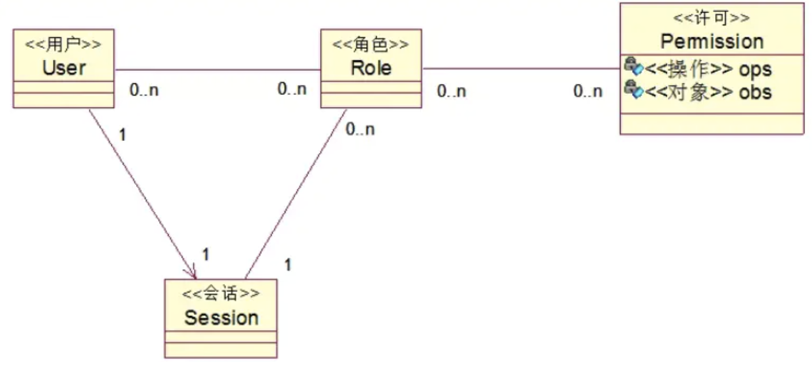
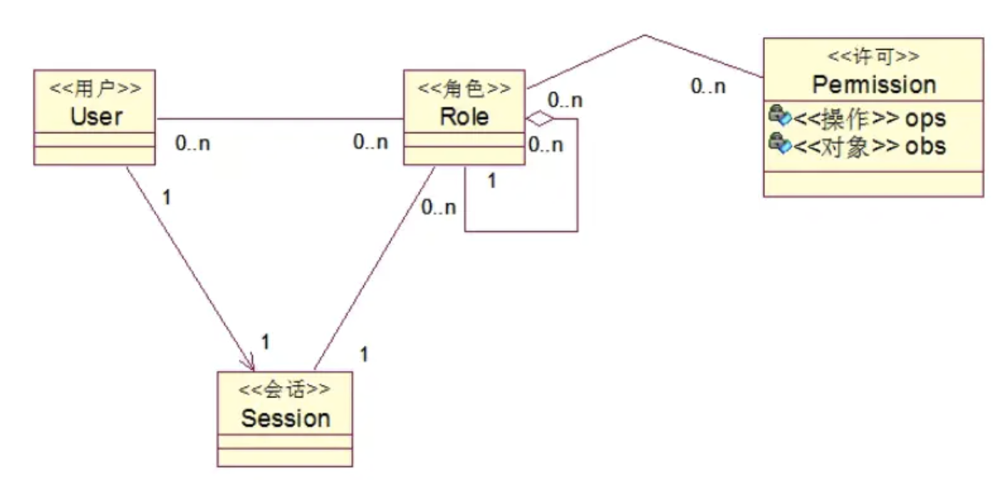
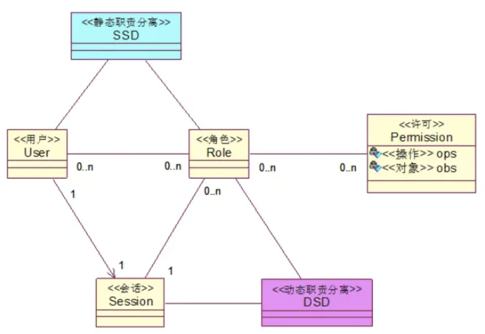
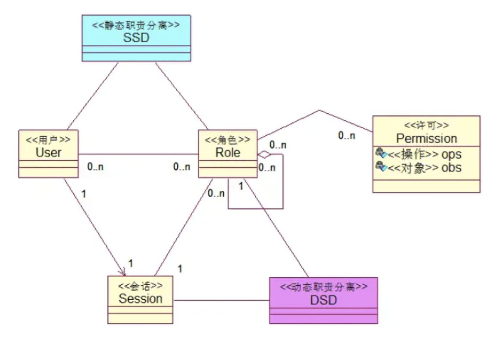

# Spring Security 中最流行的权限管理模型！

前面和大家说了 ACL，讲了理论，也给了一个完整的案例，相信小伙伴们对于 ACL 权限控制模型都已经比较了解了。

本文我要和大家聊一聊另外一个非常流行的权限管理模型，那就是 RBAC。

## 1.RBAC 简介

RBAC（Role-based access control）是一种以角色为基础的访问控制（Role-based access control，RBAC），它是一种较新且广为使用的权限控制机制，这种机制不是直接给用户赋予权限，而是将权限赋予角色。

RBAC 权限模型将用户按角色进行归类，通过用户的角色来确定用户对某项资源是否具备操作权限。RBAC 简化了用户与权限的管理，它将用户与角色关联、角色与权限关联、权限与资源关联，这种模式使得用户的授权管理变得非常简单和易于维护。

## 2.RBAC 的提出

权限、角色这些东西，在早期 1970 年代的商业计算机程序中就可以找到相关的应用，但是早期的程序相对简单，而且并不存在一个明确的、通用的、公认的权限管理模型。

Ferraiolo 和 Kuhn 两位大佬于 1992 年提出了一种基于通用角色的访问控制模型（看来这个模型比松哥年龄还大），首次提出了 RBAC 权限模型用来代替传统的 MAC 和 DAC 两种权限控制方案，并且就 RBAC 中的相关概念给出了解释。

Ferraiolo，Cugini 和 Kuhn 于 1995 年扩展了 1992 年提出的权限模型。该模型的主要功能是所有访问都是通过角色进行的，而角色本质上是权限的集合，并且所有用户只能通过角色获得权限。在组织内，角色相对稳定，而用户和权限都很多，并且可能会迅速变化。因此，通过角色控制权限可以简化访问控制的管理和检查。

到了 1996 年，Sandhu，Coyne，Feinstein 和 Youman 正式提出了 RBAC 模型，该模型以模块化方式细化了 RBAC，并提出了基于该理论的 RBAC0-RBAC3 四种不同模型。

今天，大多数信息技术供应商已将 RBAC 纳入其产品线，除了常规的企业级应用，RBAC 也广泛应用在医疗、国防等领域。

目前网上关于 RBAC 理论性的东西松哥只找到英文的，感兴趣的小伙伴可以看下，地址是：

- <https://csrc.nist.gov/projects/Role-Based-Access-Control>

如果小伙伴们有中文的资料链接，欢迎留言说明。

## 3.RBAC 三原则

1. 最小权限：给角色配置的权限是其完成任务所需要的最小权限集合。
2. 责任分离：通过相互独立互斥的角色来共同完成任务。
3. 数据抽象：通过权限的抽象来体现，RBAC 支持的数据抽象程度与 RBAC 的实现细节有关。

## 4.RBAC 模型分类

说到 RBAC，我们就得从它的模型分类开始看起。

### 4.1 RBAC0

RBAC0 是最简单的用户、角色、权限模型。RBAC0 是 RBAC 权限模型中最核心的一部分，后面其他模型都是在此基础上建立。

[图片源自网络](http://img.itboyhub.com/2020/07/20200920112318.png)

在 RBAC0 中，一个用户可以具备多个角色，一个角色可以具备多个权限，最终用户所具备的权限是用户所具备的角色的权限并集。

### 4.2 RBAC1

RBAC1 则是在 RABC0 的基础上引入了角色继承，让角色有了上下级关系。

[图片源自网络](http://img.itboyhub.com/2020/07/20200920112156.png)

在本系列前面的文章中，松哥也曾多次向大家介绍过 Spring Security 中的角色继承。

### 4.3 RBAC2

RBAC2 也是在 RBAC0 的基础上进行扩展，引入了静态职责分离和动态职责分离。

[图片源自网络](http://img.itboyhub.com/2020/07/20200920112222.png)

要理解职责分离，我们得先明白角色互斥。

在实际项目中，有一些角色是互斥的，对立的，例如财务这个角色一般是不能和其他角色兼任的，否则自己报账自己审批，岂不是爽歪歪！

通过职责分离可以解决这个问题：

**静态职责分离**

在设置阶段就做好了限制。比如同一用户不能授予互斥的角色，用户只能有有限个角色，用户获得高级权限之前要有低级权限等等。

**动态职责分离**

在运行阶段进行限制。比如运行时同一用户下5个角色中只能同时有2个角色激活等等。

### 4.4 RBAC3

将 RBAC1 和 RBAC2 结合起来，就形成了 RBAC3。

[图片源自网络](http://img.itboyhub.com/2020/07/20200920112247.png)

## 5.扩展

我们日常见到的很多权限模型都是在 RBAC 的基础上扩展出来的。

例如在有的系统中我们可以见到用户组的概念，就是将用户分组，用户同时具备自身的角色以及分组的角色。

## 6.小结

好啦，今天就和小伙伴们简单介绍下 RBAC 权限模型。其实 RBAC 只要把权限模型搞清楚了，技术上来说，基本上没啥问题。如果你把松哥 vhr 中涉及到的 Spring Security 技术搞懂了，结合今天的文章，用 Spring Security 实现 RBAC 完全不成问题～当然，我后面也抽空给大家整一个 RBAC 的 DEMO。

\#[Spring Security](https://www.javaboy.org/tags/Spring-Security/)

喜欢这篇文章吗？扫码关注公众号**【江南一点雨】**，**【江南一点雨】**专注于 SPRING BOOT+微服务以及前后端分离技术，每天推送原创技术干货，关注后回复 JAVA，领取松哥为你精心准备的 JAVA 干货!