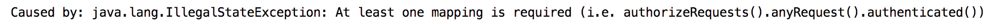
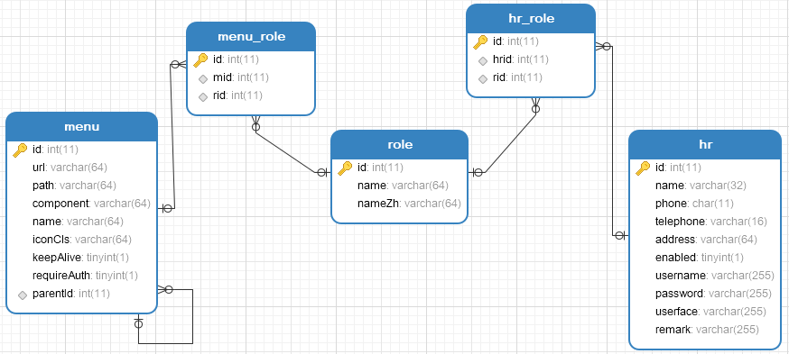
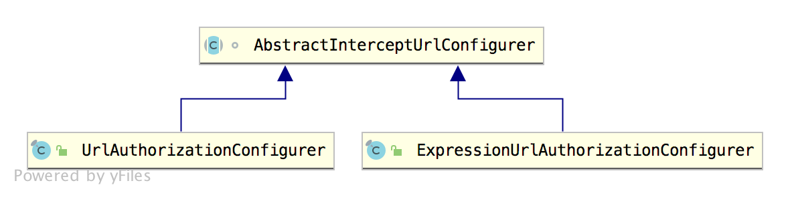
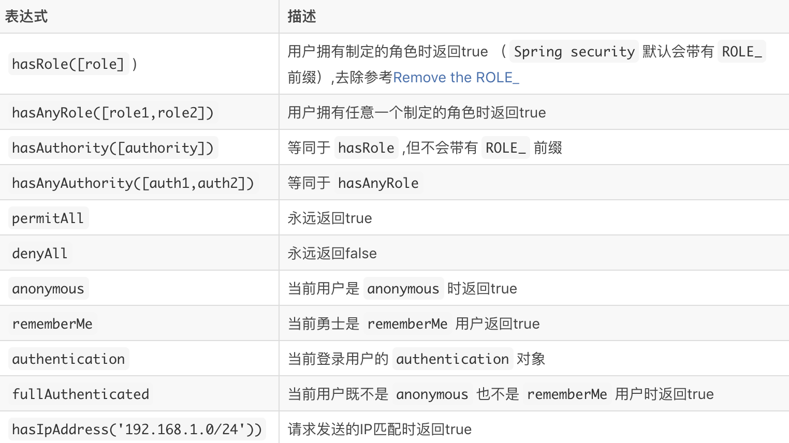

# 我又发现 Spring Security 中一个小秘密！

说来惭愧，Spring Security 系列前前后后写了 60 多篇文章了，竟然漏掉了如此重要的一块。


平时在公司项目中，都是能用则用，先把需求整出来，有的时候也不去深究它的原理，这无形中就给自己挖了大坑。

松哥这次就是，不过也因此又发现了 Spring Security 的一个用法，今天就和小伙伴们分享下。

## 1.缘起

事情是这样的，看过 vhr 项目（<https://github.com/lenve/vhr）的小伙伴都知道> vhr 里边有一个动态权限管理功能，实现的思路就是重写了 FilterInvocationSecurityMetadataSource 以及决策管理器 AccessDecisionManager，代码就类似下面这样（小伙伴们可以在 GitHub 上查看完整代码）：

```
@Override
protected void configure(HttpSecurity http) throws Exception {
    http.authorizeRequests()
            .withObjectPostProcessor(new ObjectPostProcessor<FilterSecurityInterceptor>() {
                @Override
                public <O extends FilterSecurityInterceptor> O postProcess(O object) {
                    object.setAccessDecisionManager(customUrlDecisionManager);
                    object.setSecurityMetadataSource(customFilterInvocationSecurityMetadataSource);
                    return object;
                }
            })
            .and()
            .formLogin()
            .permitAll()
            .and()
            .csrf().disable();
}
```

昨天我想再写一个类似的功能，本想着很简单，三下五除二就搞定，大家看下：

```
http
        .authorizeRequests()
        .withObjectPostProcessor(new ObjectPostProcessor<FilterSecurityInterceptor>() {
            @Override
            public <O extends FilterSecurityInterceptor> O postProcess(O object) {
                object.setSecurityMetadataSource(customSecurityMetadataSource);
                object.setAccessDecisionManager(accessDecisionManager());
                return object;
            }
        })
        .and()
        .formLogin()
        .and()
        .csrf().disable();
```

小伙伴们能看出这两段代码的差别吗？

写完之后，启动项目，一启动就报错了！

[](http://img.itboyhub.com/2020/07/20200922092356.png)

我就有点懵。之前的 vhr 启动是没问题的，但是这次新的项目启动就有问题。

在 IDEA 中，通过 Ctrl+Shift+F 全局搜索，找到了异常抛出的位置：

[](http://img.itboyhub.com/2020/07/20200922092547.png)

如果 requestMap 变量为空，就会抛出异常。requestMap 就是我们在 configure 方法中配置的请求和权限的映射，不过在上面的案例中，我是想像 vhr 那样做动态权限管理，所以请求和角色的映射关系我是保存在数据库中，没有必要在代码中配置。

但是根据异常提示，我就先随便加一个映射，果然启动就不报错了：

```
http
        .authorizeRequests()
        .withObjectPostProcessor(new ObjectPostProcessor<FilterSecurityInterceptor>() {
            @Override
            public <O extends FilterSecurityInterceptor> O postProcess(O object) {
                object.setSecurityMetadataSource(customSecurityMetadataSource);
                object.setAccessDecisionManager(accessDecisionManager());
                return object;
            }
        })
        .antMatchers("/hello").hasRole("admin")
        .and()
        .formLogin()
        .and()
        .csrf().disable();
```

现在让我有两个郁闷的地方：

1. vhr 为什么可以启动而不报错
2. 这里代码中多出来的一行映射明显是累赘，最好能够去掉

## 2.问题分析

第一个问题很好办，仔细对比最开始贴出来的代码就能找到端倪，vhr 中的代码多了一个 permitAll 方法，这就是一个表达式，有了该方法，就意味着里边多了一个映射关系，`/login -> permitAll`，这样 requestMap 就不会为空，所以启动时就不报错了。

按照这个思路，我去修改了自己的代码，去除冗余的映射，加上 permitAll，这次果然可以了。

问题虽然解决了，但是心里还是有点膈应。

为什么呢？因为用户-角色-资源的映射关系我都保存在数据库中了，权限数据库类似下面这样：

[](http://img.itboyhub.com/2020/07/20200922094346.png)

既然所有的权限管理都保存在数据库中了，再在代码中配置似乎就不太合适！但是不配置，项目启动又会出错，看来还是得从源码入手。

于是松哥花了点时间，把这里涉及到的相关源码仔细梳理了一遍。

## 3.源码梳理

首先大家知道，Spring Security 中的权限控制有两种不同的方式：

1. 通过 URL 请求地址进行控制。
2. 通过方法进行控制。

如果通过 URL 请求地址进行控制，负责控制类配置的是 AbstractInterceptUrlConfigurer，我们来看下它的子类：

[](http://img.itboyhub.com/2020/07/AbstractInterceptUrlConfigurer.png)

可以看到它有两个子类：

- ExpressionUrlAuthorizationConfigurer
- UrlAuthorizationConfigurer

两个都可以处理基于 URL 请求地址的权限控制。不同的是，第一个 ExpressionUrlAuthorizationConfigurer
支持权限表达式，第二个不支持。

什么是权限表达式？其实大家都有用，只是可能没注意过这些概念，下图就是 Spring Security 中提供的内置通用权限表达式：

[](http://img.itboyhub.com/2020/07/20200922102919.png)

[图片源自网络](http://img.itboyhub.com/2020/07/20200922102919.png)


ExpressionUrlAuthorizationConfigurer 支持权限表达式的原因是因为它使用的投票器是 WebExpressionVoter，这个投票器就是用来处理权限表达式的。

而 UrlAuthorizationConfigurer 不支持权限表达式，是因为它使用的投票器是 RoleVoter 和 AuthenticatedVoter，这两者可以用来处理角色或者权限，但是没法处理权限表达式。

关于投票器，小伙伴们可以参考松哥之前的文章：[Spring Security 权限管理的投票器与表决机制](https://mp.weixin.qq.com/s/sU97RQjQq2-XXQt49LkSeQ)。

上面说的都是默认行为，我们也可以通过修改配置，让 UrlAuthorizationConfigurer 支持权限表达式，不过一般来说没必要这样做，如果需要支持权限表达式，直接用 ExpressionUrlAuthorizationConfigurer 即可。

当我们调用如下这行代码时：

```
http.authorizeRequests()
```

实际上就是通过 ExpressionUrlAuthorizationConfigurer 去配置基于 URL 请求地址的权限控制，所以它是支持权限表达式的。例如下面这段大家再熟悉不过的代码：

```
http.authorizeRequests()
        .antMatchers("/admin/**").hasRole("ADMIN")
        .antMatchers("/user/**").access("hasRole('USER')")
```

在 ExpressionUrlAuthorizationConfigurer 中创建 SecurityMetadataSource 时，就会检查映射关系，如果 requestMap 为空就会抛出异常：

```
@Override
ExpressionBasedFilterInvocationSecurityMetadataSource createMetadataSource(
		H http) {
	LinkedHashMap<RequestMatcher, Collection<ConfigAttribute>> requestMap = REGISTRY
			.createRequestMap();
	if (requestMap.isEmpty()) {
		throw new IllegalStateException(
				"At least one mapping is required (i.e. authorizeRequests().anyRequest().authenticated())");
	}
	return new ExpressionBasedFilterInvocationSecurityMetadataSource(requestMap,
			getExpressionHandler(http));
}
```

UrlAuthorizationConfigurer 中也有 createMetadataSource 方法，但是却是另外一套实现方案：

```
@Override
FilterInvocationSecurityMetadataSource createMetadataSource(H http) {
	return new DefaultFilterInvocationSecurityMetadataSource(
			REGISTRY.createRequestMap());
}
```

UrlAuthorizationConfigurer 并不会检查 requestMap 是否为空，但是它会在 createRequestMap 方法中检查一下映射关系是否完整，例如下面这样：

```
.antMatchers("/admin/**").access("ROLE_ADMIN")
.mvcMatchers("/user/**").access("ROLE_USER")
.antMatchers("/getinfo");
```

最后的 /getinfo 没有指定需要的权限，这种就是不完整，就会抛出异常。

现在大家应该大致明白 ExpressionUrlAuthorizationConfigurer 和 UrlAuthorizationConfigurer 的区别了吧。

## 4.问题解决

ExpressionUrlAuthorizationConfigurer 会要求至少配置一个映射关系，UrlAuthorizationConfigurer 则无此要求。

当我们想要动态配置权限拦截时，一般来说也不会使用权限表达式，数据库中保存的就是普通的权限或者角色，所以这个时候我们可以选择 UrlAuthorizationConfigurer 而不是 ExpressionUrlAuthorizationConfigurer。

反映到代码上，就是下面这样：

```
@Override
protected void configure(HttpSecurity http) throws Exception {
    ApplicationContext applicationContext = http.getSharedObject(ApplicationContext.class);
    http.apply(new UrlAuthorizationConfigurer<>(applicationContext))
            .withObjectPostProcessor(new ObjectPostProcessor<FilterSecurityInterceptor>() {
                @Override
                public <O extends FilterSecurityInterceptor> O postProcess(O object) {
                    object.setSecurityMetadataSource(customSecurityMetadataSource);
                    return object;
                }
            });
    http.formLogin()
            .and()
            .csrf().disable();
}
```

这样看起来就更合理一些，不用额外配置一条映射关系。

今天这篇文章可能对没了解过动态权限控制的小伙伴来说略难，大家可以参考松哥的 vhr（<https://github.com/lenve/vhr）项目去了解下动态权限控制。当然，也可以参考松哥的[Spring> Boot+Vue+微人事视频教程](<https://mp.weixin.qq.com/s/EEmEL6tpuBT0qLfPwhj2OQ)，里边也有讲动态权限控制问题。>

好啦，今天就和小伙伴们分享这么多，要不是这次遇到问题，我一直都懒得去研究 ExpressionUrlAuthorizationConfigurer 和 UrlAuthorizationConfigurer 有什么区别。感兴趣的小伙伴可以自己 DEBUG 验证下本文内容哦～

\#[Spring Security](https://www.javaboy.org/tags/Spring-Security/)

喜欢这篇文章吗？扫码关注公众号**【江南一点雨】**，**【江南一点雨】**专注于 SPRING BOOT+微服务以及前后端分离技术，每天推送原创技术干货，关注后回复 JAVA，领取松哥为你精心准备的 JAVA 干货!