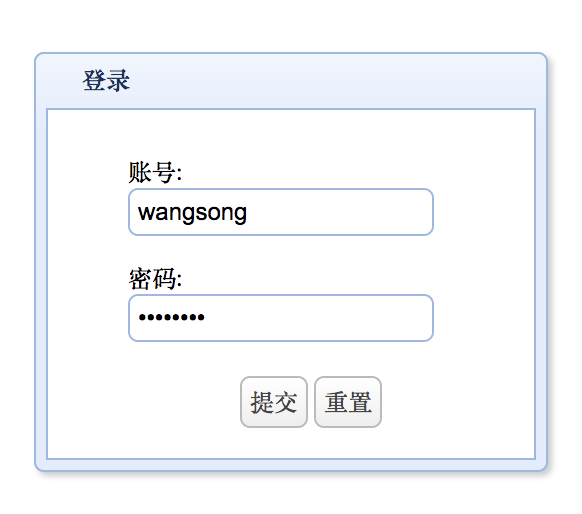
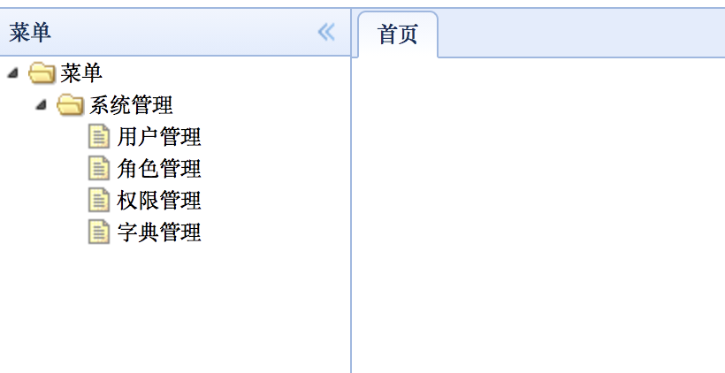
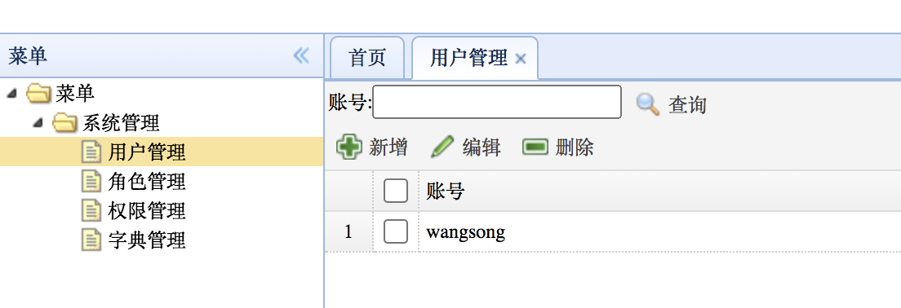
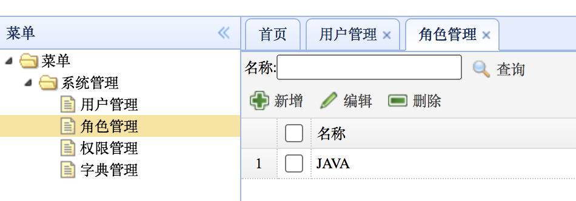
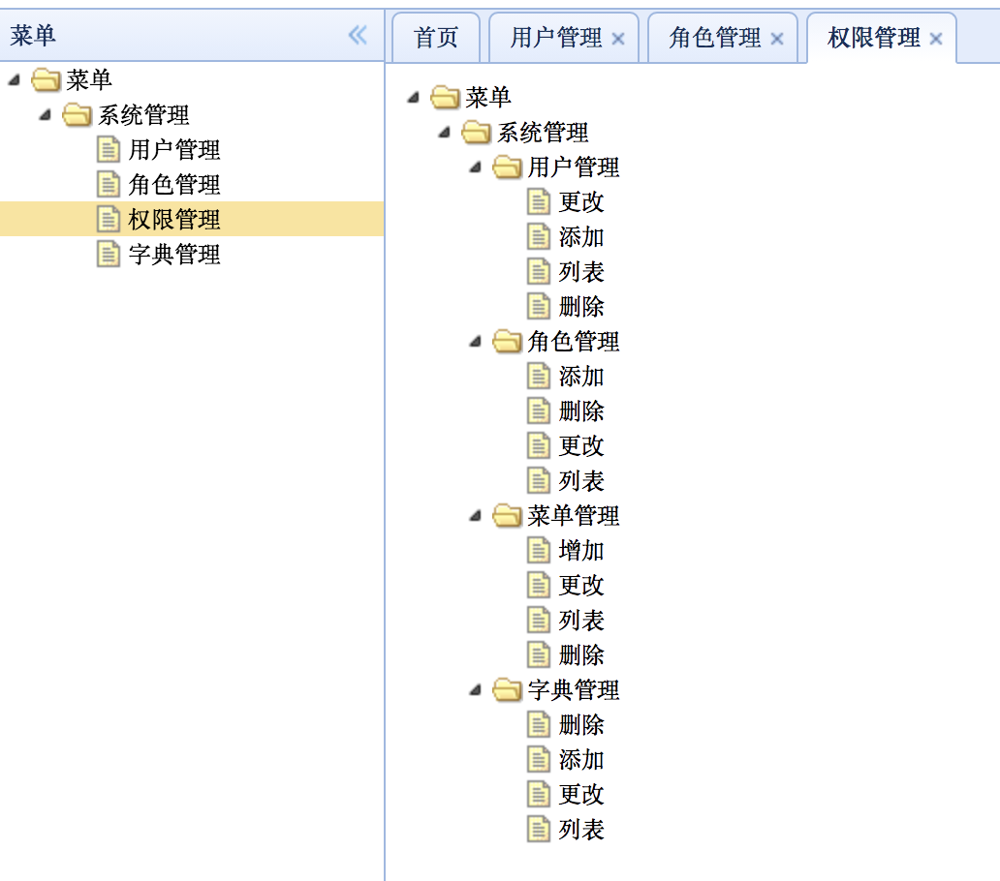
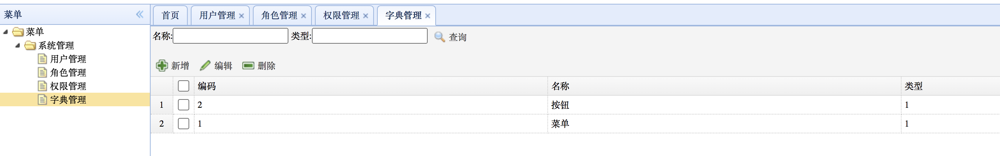
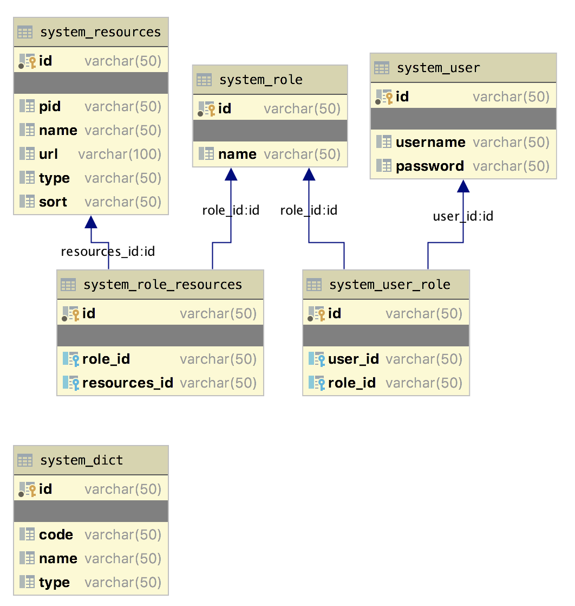

# 假期结束了，撸一篇技术和大伙分享下吧！

> 这篇文章是国庆节期间断断续续写的

松哥从上个月 25 号开始一直在外奔波，直到 4 号参加完一个小伙伴的婚礼，见了好多多年未见的同学，现在总算闲下来，可以正式开启国庆假期了，这不赶紧坐在电脑前撸一篇技术文章（没错，国庆节的正确打开方式就是撸文章。


今天还是想和大家伙扯一扯 RBAC 的问题，因为[上篇文章](https://mp.weixin.qq.com/s/K5YDMBREzObp2yrmLtGdjw)发了后，我发现小伙伴们对这个话题很感兴趣，也有很多疑问，所以今天我想再和大家聊一个关于 RBAC 的案例。对于自己不熟悉的东西，多看几个别人写的，然后在某一天的某一刻，你就会突然“顿悟”。

今天要和小伙伴们分享的是一个来自 Gitee 上的权限管理项目，项目地址是：

- <https://gitee.com/vmaps/spring-app>

这个项目的包命名竟然是 com.wangsong，但是小伙伴们注意，这个项目并不是我写的，松哥的项目一般都是 org.javaboy。

## 项目介绍

springboot-rbac 是 J2EE 基础开发平台，技术栈包括：Spring-Boot、MyBatis、Spring-Security，业务模块包括：用户管理，角色管理、权限管理，字典管理。

该项目主要包含如下业务功能：

1. 用户管理：用户增删改查与角色关系
2. 角色管理：角色增删改查与权限关系
3. 菜单管理：菜单增删改查（树形结构）
4. 字典管理：字典增删改查

该项目涉及到的技术栈有：

1. Spring-Boot 依赖注入，切面
2. MyBatis ORM
3. Spring-Security 权限会话

和[上篇文章](https://mp.weixin.qq.com/s/K5YDMBREzObp2yrmLtGdjw)中介绍的 RBAC 项目相比，这个项目最大的优势在于它是通过 Spring Security 来实现的 RBAC，对于项目使用 Spring Security 的小伙伴而言，这个就具备较高的参考价值。

## 项目部署

1. 导入数据库脚本 springboot-app.sql
2. 启动 sprtingboot-rbac 位置 com.wangsong.Application
3. 访问 /html/login.html

这是官方给出的部署流程，松哥再详细说两句。

首先下载下来的项目根目录下就有 SQL 脚本，直接执行即可。

执行完毕后，在 application.properties 中修改数据库配置信息，主要是数据库连接地址以及数据库用户名/密码。

由于 JAXB API 是 JavaEE 的 API，因此在 JavaSE 9.0 中不再包含这个 Jar 包。Java9 中引入了模块的概念，默认情况下，JavaSE 中将不再包含 JavaEE 的 Jar 包。而在 Java6/7/8 中这个 API 都是捆绑在一起的。

所以如果你使用的 JDK9（含）以上的版本，还需要额外添加依赖：

```
<dependency>
    <groupId>javax.xml.bind</groupId>
    <artifactId>jaxb-api</artifactId>
    <version>2.3.0</version>
</dependency>
<dependency>
    <groupId>com.sun.xml.bind</groupId>
    <artifactId>jaxb-impl</artifactId>
    <version>2.3.0</version>
</dependency>
<dependency>
    <groupId>com.sun.xml.bind</groupId>
    <artifactId>jaxb-core</artifactId>
    <version>2.3.0</version>
</dependency>
<dependency>
    <groupId>javax.activation</groupId>
    <artifactId>activation</artifactId>
    <version>1.1.1</version>
</dependency>
```

否则会报如下异常：

```
java.lang.NoClassDefFoundError: javax/xml/bind/DatatypeConverter
```

配置完成后，启动项目即可。启动后访问 <http://localhost:8080/html/login.html> 页面即可。

这个项目的前端是使用 jQuery EasyUI 来做的，虽然有点过时，但是这并不妨碍我们理解后端的权限管理系统。

我们来看几张效果图：

[](http://img.itboyhub.com/2020/07/20201005110117.png)

[登录页面](http://img.itboyhub.com/2020/07/20201005110117.png)


[](http://img.itboyhub.com/2020/07/20201005110150.png)

[项目首页](http://img.itboyhub.com/2020/07/20201005110150.png)


[](http://img.itboyhub.com/2020/07/20201005111038.png)

[用户管理](http://img.itboyhub.com/2020/07/20201005111038.png)


[](http://img.itboyhub.com/2020/07/20201005111107.png)

[角色管理](http://img.itboyhub.com/2020/07/20201005111107.png)


[](http://img.itboyhub.com/2020/07/20201005211134.png)

[权限管理](http://img.itboyhub.com/2020/07/20201005211134.png)


[](http://img.itboyhub.com/2020/07/20201005211204.png)

[字典管理](http://img.itboyhub.com/2020/07/20201005211204.png)


可以看到，一个权限管理的基础功能都是有的。

## 数据库分析

正常来说，RBAC0 需要 5 张表，这个项目里给出了 6 张表，其中一个是 system_dict 字典表，字典表的作用是定义了权限的类型。

权限的类型分为两种，菜单权限和按钮权限。

菜单权限就是类似于微人事（<https://github.com/lenve/vhr）中的那种，用户是否具备某一个菜单的访问权限，如果具备，左边显示的菜单列表就有对应的菜单项。>

按钮权限就是用户是否具备某一个按钮的点击权限。

一般来说，如果用户不具备某一个按钮的点击权限，在前端我们应当将这个按钮隐藏起来，不让用户看到有这个按钮。当然后端也要通过注解等方式做出相应的权限控制。

该项目设计的权限表结构如下：

[](http://img.itboyhub.com/2020/07/20201005212920.png)

作者给出的数据库脚本中都没有注释，不过看字段名大概也能猜出其含义，猜不出来的话，可以参考 Java 代码中对应的实体类，实体类上面都有注释。

## 代码分析

这个项目的代码虽然量比较大，但是和 Spring Security 相关的并不多，松哥来和大家简单梳理一下，方便大家理解这个项目。

**CustomUserDetails**

这个项目的标准用户类，也就是能被 Spring Security 识别的用户类，我们来看下其定义：

```
@Data
@NoArgsConstructor
@AllArgsConstructor
@ApiModel(value = "User", description = "用户")
public class User implements Serializable {

    @ApiModelProperty(value = "id")
    private String id;
    @ApiModelProperty(value = "账户名")
    private String username;
    @ApiModelProperty(value = "密码")
    private String password;

}

@Getter
@ToString
public class CustomUserDetails extends User implements UserDetails {

    private static final long serialVersionUID = 1702923242319850756L;

    private final boolean enabled;
    private final boolean accountNonExpired;
    private final boolean credentialsNonExpired;
    private final boolean accountNonLocked;
    private final Set<GrantedAuthority> authorities;

    public CustomUserDetails(User user, boolean enabled, boolean accountNonExpired, boolean credentialsNonExpired, boolean accountNonLocked, Collection<? extends GrantedAuthority> authorities) {
        if (user != null
                && !StringUtils.isBlank(user.getUsername())
                && !StringUtils.isBlank(user.getPassword())) {
            setId(user.getId());
            setUsername(user.getUsername());
            setPassword(user.getPassword());
            this.enabled = enabled;
            this.accountNonExpired = accountNonExpired;
            this.credentialsNonExpired = credentialsNonExpired;
            this.accountNonLocked = accountNonLocked;
            this.authorities = Collections.unmodifiableSet(new HashSet<>(CollectionUtils.emptyIfNull(authorities)));
        } else {
            throw new IllegalArgumentException("Cannot pass null or empty values to constructor");
        }
    }

}
```

可以看到，用户信息由普通的用户类 User 接收，然后其他属性通过构造方法参数传入进来。这个定义是比较简单的，松哥担心有的小伙伴发现 User 类没有实现 UserDetails 接口会觉得奇怪，因此这里说一下。

**JWTLoginFilter**

```
public class JWTLoginFilter extends UsernamePasswordAuthenticationFilter {

  private AuthenticationManager authenticationManager;
  private UserService userService;
  public JWTLoginFilter(AuthenticationManager authenticationManager) {
    this.authenticationManager = authenticationManager;
  }

  public JWTLoginFilter(AuthenticationManager authenticationManager, UserService userService) {
    this.authenticationManager = authenticationManager;
    this.userService = userService;
  }

  // 接收并解析用户凭证
  @Override
  public Authentication attemptAuthentication(HttpServletRequest req,
                                              HttpServletResponse res) throws AuthenticationException {
    String username =  req.getParameter("username");
    String password = req.getParameter("password");

    UserDetails userDetails = userService.loadUserByUsername(username);
    return authenticationManager.authenticate(
        new UsernamePasswordAuthenticationToken(username, password, userDetails.getAuthorities()));
  }

  // 用户成功登录后，这个方法会被调用，我们在这个方法里生成token
  @Override
  protected void successfulAuthentication(HttpServletRequest req,
                                          HttpServletResponse res,
                                          FilterChain chain,
                                          Authentication auth) throws IOException, ServletException {

    String token = Jwts.builder()
        .setSubject(((CustomUserDetails) auth.getPrincipal()).getUsername())
        .setExpiration(new Date(System.currentTimeMillis() + 60 * 60 * 24 * 1000))
        .signWith(SignatureAlgorithm.HS512, "MyJwtSecret")
        .compact();
    res.addHeader("Authorization", "Bearer " + token);
  }

}
```

这是一个自定义过滤器，用来替代 Spring Security 中默认的验证逻辑，在这里验证用户名密码正确后，生成一个 token，并将 token 返回给客户端。

该类继承自 UsernamePasswordAuthenticationFilter，重写了其中的两个方法：

- attemptAuthentication：接收并解析用户凭证。
- successfulAuthentication：用户成功登录后，这个方法会被调用，我们在这个方法里生成 token 并添加到响应头中。

这就是登录生成 JWT 的过程。

**JWTAuthenticationFilter**

```
public class JWTAuthenticationFilter extends BasicAuthenticationFilter {
  private UserService userService;
  public JWTAuthenticationFilter(AuthenticationManager authenticationManager) {
    super(authenticationManager);
  }

  public JWTAuthenticationFilter(AuthenticationManager authenticationManager, UserService userService) {
    super(authenticationManager);
    this.userService=userService;
  }

  @Override
  protected void doFilterInternal(HttpServletRequest request, HttpServletResponse response, FilterChain chain) throws IOException, ServletException {
    String header = request.getHeader("Authorization");

    if (header == null || !header.startsWith("Bearer ")) {
      chain.doFilter(request, response);
      return;
    }

    UsernamePasswordAuthenticationToken authentication = getAuthentication(request);

    SecurityContextHolder.getContext().setAuthentication(authentication);
    chain.doFilter(request, response);

  }

  private UsernamePasswordAuthenticationToken getAuthentication(HttpServletRequest request) {
    String token = request.getHeader("Authorization");
    if (token != null) {
      // parse the token.
      String user = Jwts.parser()
          .setSigningKey("MyJwtSecret")
          .parseClaimsJws(token.replace("Bearer ", ""))
          .getBody()
          .getSubject();

      if (user != null) {
        UserDetails userDetails = userService.loadUserByUsername(user);
        return new UsernamePasswordAuthenticationToken(user, null, userDetails.getAuthorities());
      }
      return null;
    }
    return null;
  }

}
```

这也是一个自定义过滤器。当用户登录成功后，以后所有的请求都会携带一个 JWT 令牌，携带 JWT 令牌的请求将在这个过滤器中进行验证，验证成功后，将登录主体信息放入 SecurityContextHolder 中即可。

最后在 Security 配置类中，将两个自定义的过滤器添加进去即可：

```
@EnableGlobalMethodSecurity(prePostEnabled = true,securedEnabled =true)//激活方法上的PreAuthorize注解
public class WebSecurityConfig extends WebSecurityConfigurerAdapter {

  private UserService userService;


  public WebSecurityConfig(UserService userService) {
    this.userService = userService;
  }

  @Override
  protected void configure(HttpSecurity http) throws Exception {
    http.headers().frameOptions().disable();
    http.cors().and().csrf().disable().authorizeRequests()
        .antMatchers("/html/**","/login").permitAll()
        .anyRequest().authenticated()
        .and()
        .addFilter(new JWTLoginFilter(authenticationManager(),userService))
        .addFilter(new JWTAuthenticationFilter(authenticationManager(),userService));
  }

}
```

最后在各个 Controller 方法上通过注解去控制权限：

```
@Api(value = "权限管理")
@Controller
@RequestMapping("/system/resources")
public class ResourcesController extends BaseController {
    @Autowired
    private ResourcesService resourcesService;
    @Autowired
    private UserService userService;
    @ApiOperation(value = "增加", httpMethod = "POST")
    @PreAuthorize("hasAuthority('/system/resources/add')")
    @RequestMapping(value = "/add")
    @ResponseBody
    public Result add(@ModelAttribute Resources resources) {
        resourcesService.insertResources(resources);
        return new Result(CodeEnum.SUCCESS.getCode(), null);
    }

    @ApiOperation(value = "删除", httpMethod = "POST")
    @ApiImplicitParams({
            @ApiImplicitParam(name = "id", value = "id", paramType = "form"),
    })
    @PreAuthorize("hasAuthority('/system/resources/delete')")
    @RequestMapping(value = "/delete")
    @ResponseBody
    public Result delete(String[] id) {
        resourcesService.deleteResources(id);
        return new Result(CodeEnum.SUCCESS.getCode(), null);
    }

    @ApiOperation(value = "更新", httpMethod = "POST")
    @PreAuthorize("hasAuthority('/system/resources/update')")
    @RequestMapping(value = "/update")
    @ResponseBody
    public Result update(@ModelAttribute Resources resources) {
        resourcesService.updateResources(resources);
        return new Result(CodeEnum.SUCCESS.getCode(), null);

    }

    @ApiOperation(value = "列表", httpMethod = "POST")
    @PreAuthorize("hasAuthority('/system/resources/list')")
    @RequestMapping(value = "/list")
    @ResponseBody
    public Result list() {
        return new Result(CodeEnum.SUCCESS.getCode(), resourcesService.findResources());
    }


    @ApiOperation(value = "权限码列表", httpMethod = "POST")
    @RequestMapping(value = "/findResourcesEMUByResources")
    @ResponseBody
    public Result findResourcesEMUByResources() {
        String userDetails = (String) SecurityContextHolder.getContext()
                .getAuthentication()
                .getPrincipal();
        User u=new User();
        u.setUsername(userDetails);
        User tByT = userService.findTByT(u);
        return new Result(CodeEnum.SUCCESS.getCode(), resourcesService.findResourcesEMUByResources(tByT.getId()));
    }

    @ApiOperation(value = "单条", httpMethod = "POST")
    @ApiImplicitParams({
            @ApiImplicitParam(name = "id", value = "id", paramType = "form"),
    })
    @RequestMapping(value = "/selectByPrimaryKey")
    @ResponseBody
    public Result selectByPrimaryKey(String id) {
        return new Result(CodeEnum.SUCCESS.getCode(), resourcesService.selectByPrimaryKey(id));
    }

}
```

从这里可以看到，资源和权限是绑定的，要修改就只能修改代码了。

但是权限和角色、角色和用户是在数据库中绑定的，如果需要调整用户的访问资源，只需要针对数据库做相应的增删改查即可。

整体来说，这个项目的实现思路还是非常 Easy 的，只要小伙伴们看了松哥本系列前面的文章，这个项目应该是很好理解的。

## 小结

老实说，这个项目代码细节有一些槽点，不过单纯看 RBAC 的实现思路还是没问题的，槽点松哥这里就不多说了，我们只需要关注对我们有用的东西即可。小伙伴们也可以在学习过程中把重点放在理解 RBAC 实现思路上。

\#[Spring Security](https://www.javaboy.org/tags/Spring-Security/)

喜欢这篇文章吗？扫码关注公众号**【江南一点雨】**，**【江南一点雨】**专注于 SPRING BOOT+微服务以及前后端分离技术，每天推送原创技术干货，关注后回复 JAVA，领取松哥为你精心准备的 JAVA 干货!