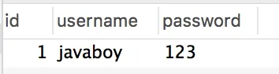
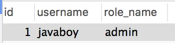

# 写了这么多年代码，这样的登录方式还是头一回见！

Original 江南一点雨 [江南一点雨](javascript:void(0);) *2020年07月03日 08:08*

松哥原创的 Spring Boot 视频教程已经杀青，感兴趣的小伙伴戳这里-->[Spring Boot+Vue+微人事视频教程](https://mp.weixin.qq.com/s?__biz=MzI1NDY0MTkzNQ==&mid=2247488799&idx=1&sn=cdfd5315ff18c979b6f5d390ab4d9059&scene=21#wechat_redirect)

Spring Security 系列还没搞完，最近还在研究。

有的时候我不禁想，如果从 Spring Security 诞生的第一天开始，我们就一直在追踪它，那么今天再去看它的源码一定很简单，因为我们了解到每一行代码的缘由。

然而事实上我们大部分人都是中途接触到它的，包括松哥自己。所以在阅读源码的时候，有时候会遇到一些不是那么容易理解的东西，并不是说这个有多难，只是我们不了解 N 年前的开发环境，因此也就不容易理解某一行代码出现的意义。

所以为了搞透彻这个框架，有时候我们还得去了解之前发生了什么。

这就跟学 Spring Boot 一样，很多小伙伴问要不要跳过 SSM ，我说不要，甚至还专门写了一篇文章（[Spring Boot 要怎么学？要学哪些东西？要不要先学 SSM？](https://mp.weixin.qq.com/s?__biz=MzI1NDY0MTkzNQ==&mid=2247487918&idx=1&sn=12f4a387e904750d333671cb96028d54&scene=21#wechat_redirect)），跳过了 SSM ，Spring Boot 中的很多东西就无法真正理解。

扯远了。。。

Spring Security 中对 HttpServletRequest 请求进行了封装，重写了 HttpServletRequest 中的几个和安全管理相关的方法，想要理解 Spring Security 中的重写，就要先从 HttpServletRequest 开始看起。

有小伙伴可能会说，HttpServletRequest 能跟安全管理扯上什么关系？今天松哥就来和大家捋一捋，我们不讲 Spring Security，就来单纯讲讲 HttpServletRequest 中的安全管理方法。

## 1.HttpServletRequest

在 HttpServletRequest 中，我们常用的方法如：

- public String getHeader(String name);
- public String getParameter(String name);
- public ServletInputStream getInputStream()
- ...

这些常见的方法可能大家都有用过，还有一些不常见的，和安全相关的方法：

```
public String getRemoteUser();
public boolean isUserInRole(String role);
public java.security.Principal getUserPrincipal();
public boolean authenticate(HttpServletResponse response)
            throws IOException, ServletException;
public void login(String username, String password) throws ServletException;
public void logout() throws ServletException;
```

前面三个方法，在之前的 Servlet 中就有，后面三个方法，则是从 Servlet3.0 开始新增加的方法。从方法名上就可以看出，这些都是和认证相关的方法，但是这些方法，我估计很多小伙伴都没用过，因为不太实用。

在 Spring Security 框架中，对这些方法进行了重写，进而带来了一些好玩并且方便的特性，这个松哥在后面的文章中再和大家分享。

要理解 Spring Security 中的封装，就得先来看看，不用框架，这些方法该怎么用！

## 2.实践出真知

我们创建一个**普普通通的 Web 项目**，不使用任何框架（后面的案例都基于此），然后在 doGet 方法中打印出 HttpServletRequest 的类型，代码如下：

```
@Override
protected void doGet(HttpServletRequest request, HttpServletResponse resp) throws ServletException, IOException {
    System.out.println("request.getClass() = " + request.getClass());
}
```

代码运行打印结果如下：

```
request.getClass() = class org.apache.catalina.connector.RequestFacade
```

HttpServletRequest 是一个接口，而 RequestFacade 则是一个正儿八经的 class。

HttpServletRequest 是 Servlet 规范中定义的 ServletRequest，这相当于是标准的 Request；但是在 Tomcat 中的 Request 则是 Tomcat 自己自定义的 Request，自定义的 Request 实现了 HttpServletRequest 接口并且还定义了很多自己的方法，这些方法还是 public 的，如果直接使用 Tomcat 自定义的 Request，开发者只需要向下转型就能调用这些 Tomcat 内部方法，这是有问题的，所以又用 RequestFacade 封装了一下，以至于我们实际上用到的就是 RequestFacade 对象。

那么毫无疑问，HttpServletRequest#login 方法具体实现就是在 Tomcat 的 Request#login 方法中完成的。经过源码追踪，我们发现，登录的数据源是由 Tomcat 中的 Realm 提供的，**注意这个 Realm 不是 Shiro 中的 Realm。**

Tomcat 中提供了 6 种 Realm，可以支持与各种数据源的对接：

- JDBCRealm：很明显，这个 Realm 可以对接到数据库中的用户信息。
- DataSourceRealm：它通过一个 JNDI 命名的 JDBC 数据源在关系型数据库中查找用户。
- JNDIRealm：通过一个 JNDI 提供者1在 LDAP 目录服务器中查找用户。
- UserDatabaseRealm：这个数据源在 Tomcat 的配置文件中 conf/tomcat-users.xml。
- MemoryRealm：这个数据源是在内存中，内存中的数据也是从 conf/tomcat-users.xml 配置文件中加载的。
- JAASRealm：JAAS 架构来实现对用户身份的验证。

如果这些 Realm 无法满足需求，当然我们也可以自定义 Realm，只不过一般我们不这样做，为啥？因为这这种登录方式用的太少了！今天这篇文章纯粹是和小伙伴们开开眼界。

如果自定义 Realm 的话，我们只需要实现 org.apache.catalina.Realm 接口，然后将编译好的 jar 放到 $CATALINA_HOME/lib 下即可，具体的配置则和下面介绍的一致。

接下来我和大家介绍两种配置方式，一个是 UserDatabaseRealm，另一个是 JDBCRealm。

### 2.1 基于配置文件登录

我们先来定义一个 LoginServlet：

```
@WebServlet(urlPatterns = "/login")
public class LoginServlet extends HttpServlet {
    @Override
    protected void doGet(HttpServletRequest req, HttpServletResponse resp) throws ServletException, IOException {
        doPost(req, resp);
    }

    @Override
    protected void doPost(HttpServletRequest req, HttpServletResponse resp) throws ServletException, IOException {
        String username = req.getParameter("username");
        String password = req.getParameter("password");
        try {
            req.login(username, password);
        } catch (ServletException e) {
            req.getRequestDispatcher("/login.jsp").forward(req, resp);
            return;
        }
        boolean login = req.getUserPrincipal() != null && req.isUserInRole("admin");
        if (login) {
            resp.sendRedirect("/hello");
            return;
        } else {
            req.getRequestDispatcher("/login.jsp").forward(req, resp);
        }
    }
}
```

当请求到达后，先提取出用户名和密码，然后调用 req.login 方法进行登录，如果登录失败，则跳转到登录页面。

登录完成后，通过获取登录用户信息以及判断登录用户角色，来确保用户是否登录成功。

如果登录成功，就跳转到项目应用首页，否则就跳转到登录页面。

接下来定义 HelloServlet：

```
@WebServlet(urlPatterns = "/hello")
public class HelloServlet extends HttpServlet {
    @Override
    protected void doGet(HttpServletRequest req, HttpServletResponse resp) throws ServletException, IOException {
        doPost(req,resp);
    }

    @Override
    protected void doPost(HttpServletRequest req, HttpServletResponse resp) throws ServletException, IOException {
        Principal userPrincipal = req.getUserPrincipal();
        if (userPrincipal == null) {
            resp.setStatus(401);
            resp.getWriter().write("please login");
        } else if (!req.isUserInRole("admin")) {
            resp.setStatus(403);
            resp.getWriter().write("forbidden");
        }else{
            resp.getWriter().write("hello");
        }
    }
}
```

在 HelloServlet 中，先判断用户是否已经登录，没登录的话，就返回 401，已经登录但是不具备相应的角色，就返回 403，否则就返回 hello。

接下来再定义 LogoutServlet，执行注销操作：

```
@WebServlet(urlPatterns = "/logout")
public class LogoutServlet extends HttpServlet {
    @Override
    protected void doGet(HttpServletRequest req, HttpServletResponse resp) throws ServletException, IOException {
        doPost(req,resp);
    }

    @Override
    protected void doPost(HttpServletRequest req, HttpServletResponse resp) throws ServletException, IOException {
        req.logout();
        resp.sendRedirect("/hello");
    }
}
```

logout 方法也是 HttpServletRequest 自带的。

最后再简单定义一个 login.jsp 页面，如下：

```
<%@ page contentType="text/html;charset=UTF-8" language="java" %>
<html>
<head>
    <title>Title</title>
</head>
<body>
<form action="/login" method="post">
    <input type="text" name="username">
    <input type="text" name="password">
    <input type="submit" value="登录">
</form>
</body>
</html>
```

所有工作都准备好了，接下来就是数据源了，默认情况下加载的是 conf/tomcat-users.xml 中的数据，找到 Tomcat 的这个配置文件，修改之后内容如下：

```
<?xml version="1.0" encoding="UTF-8"?>
<tomcat-users>
    <role rolename="admin"/>
    <user username="javaboy" password="123" roles="admin"/>
</tomcat-users>
```

配置完成后，启动项目进行测试。登录用户名是 javaboy，登录密码是 123，具体的测试过程我就不再演示了。

### 2.2 基于数据库登录

如果想基于数据库登录，我们需要先准备好数据库和表，需要两张表，user 表和 role 表，如下：

```
CREATE TABLE `user` (
  `id` int(11) unsigned NOT NULL AUTO_INCREMENT,
  `username` varchar(255) COLLATE utf8mb4_unicode_ci DEFAULT NULL,
  `password` varchar(255) COLLATE utf8mb4_unicode_ci DEFAULT NULL,
  PRIMARY KEY (`id`)
) ENGINE=InnoDB AUTO_INCREMENT=2 DEFAULT CHARSET=utf8mb4 COLLATE=utf8mb4_unicode_ci;
CREATE TABLE `role` (
  `id` int(11) unsigned NOT NULL AUTO_INCREMENT,
  `username` varchar(255) COLLATE utf8mb4_unicode_ci DEFAULT NULL,
  `role_name` varchar(255) COLLATE utf8mb4_unicode_ci DEFAULT NULL,
  PRIMARY KEY (`id`)
) ENGINE=InnoDB AUTO_INCREMENT=2 DEFAULT CHARSET=utf8mb4 COLLATE=utf8mb4_unicode_ci;
```

然后向表中添加两行模拟数据：



接下来，找到 Tomcat 的 conf/server.xml 文件，修改配置，如下：

```
<Realm className="org.apache.catalina.realm.LockOutRealm">
  <Realm  className="org.apache.catalina.realm.JDBCRealm" debug="99"
        driverName="com.mysql.jdbc.Driver"
        connectionURL="jdbc:mysql://localhost:3306/basiclogin"
        connectionName="root" connectionPassword="123"
        userTable="user" userNameCol="username"    
        userCredCol="password"
        userRoleTable="role" roleNameCol="role_name" />
</Realm>
```

在这段配置中：

- 指定 JDBCRealm。
- 指定数据库驱动。
- 指定数据库连接地址。
- 指定数据库连接用户名/密码。
- 指定用户表名称；用户名的字段名以及密码字段名。
- 指定角色表名称；以及角色字段名。

配置完成后，再次登录测试，此时的登录数据就是来自数据库的数据了。

## 3.优化

前面的 HelloServlet，我们是在代码中手动配置的，要是每个 Servlet 都这样配置，这要搞到猴年马月了～

所以我们对此可以在 web.xml 中进行手动配置。

首先我们创建一个 AdminServlet 进行测试，如下：

```
@WebServlet(urlPatterns = "/admin/hello")
public class AdminServlet extends HttpServlet {
    @Override
    protected void doGet(HttpServletRequest req, HttpServletResponse resp) throws ServletException, IOException {
        resp.getWriter().write("hello admin!");
    }
}
```

然后在 web.xml 中进行配置：

```
<security-constraint>
    <web-resource-collection>
        <web-resource-name>admin</web-resource-name>
        <url-pattern>/admin/*</url-pattern>
    </web-resource-collection>
    <auth-constraint>
        <role-name>admin</role-name>
    </auth-constraint>
</security-constraint>
<security-role>
    <role-name>admin</role-name>
</security-role>
```

这个配置表示 `/admin/*` 格式的请求路径，都需要具有 admin 角色才能访问，否则就访问不到，这样，每一个 Admin 相关的 Servlet 就被保护起来了，不用在 Servlet 中写代码判断了。

## 4.小结

好啦，经过本文的介绍，相信小伙伴们对于 HttpServletRequest 中关于认证的几个方法基本上都了解了，接下来的文章松哥将继续和大家介绍这些方法在 Spring Security 框架中是如何进行演化的，看懂了本文，后面的文章就很好理解了～

本文案例下载地址：https://github.com/lenve/javaboy-code-samples

好啦，**小伙伴们如果觉得有收获，记得点个在看鼓励下松哥哦～**

今日干货


刚刚发表

查看:66666回复:666

公众号后台回复 ssm，免费获取松哥纯手敲的 SSM 框架学习干货。

SpringSecurity系列52

SpringSecurity系列 · 目录


上一篇一文搞定 Spring Security 异常处理机制！下一篇Spring Security 竟然可以同时存在多个过滤器链？


# 


Scan to Follow