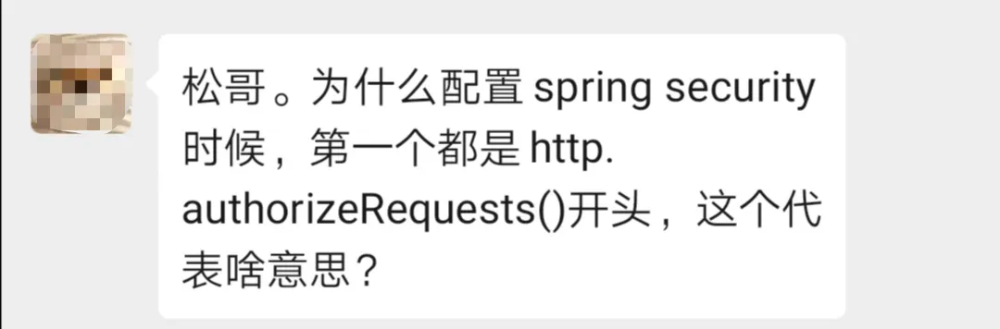
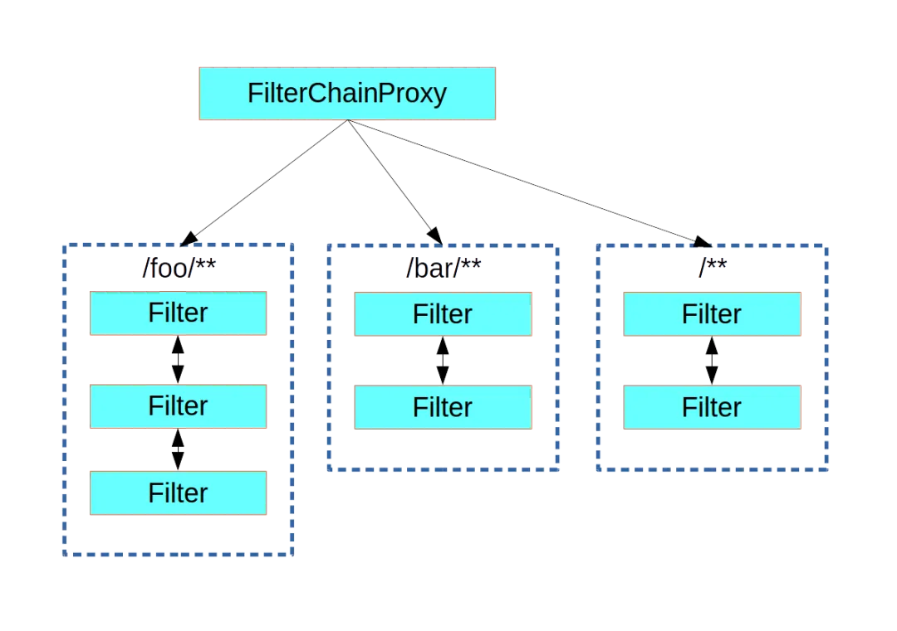

# Spring Security 竟然可以同时存在多个过滤器链？

Original 江南一点雨 [江南一点雨](javascript:void(0);) *2020年07月10日 08:55*

松哥原创的 Spring Boot 视频教程已经杀青，感兴趣的小伙伴戳这里-->[Spring Boot+Vue+Spring Security+微人事视频教程](https://mp.weixin.qq.com/s?__biz=MzI1NDY0MTkzNQ==&mid=2247488799&idx=1&sn=cdfd5315ff18c979b6f5d390ab4d9059&scene=21#wechat_redirect)

这是来自一个小伙伴的提问，我觉得很有必要和大家聊一聊这个问题：



首先这个问题本身是有点问题的，因为 `http.authorizeRequests()` 并非总是第一个，虽然大部分情况下，我们看到的是第一个，但是也有很多情况 `http.authorizeRequests()` 不是首先出现。要搞明白这个问题，我们就要搞清楚 `http.authorizeRequests()` 到底是啥意思！

这就涉及到 Spring Security 中过滤器链的配置问题了，本文松哥就来和大家稍微聊一聊。

本文是 Spring Security 系列第 36 篇，阅读前面文章有助于更好的理解本文：

1. [挖一个大坑，Spring Security 开搞！](https://mp.weixin.qq.com/s?__biz=MzI1NDY0MTkzNQ==&mid=2247488106&idx=1&sn=258fc609661f22de5517e1bc5c0915ed&scene=21#wechat_redirect)
2. [松哥手把手带你入门 Spring Security，别再问密码怎么解密了](https://mp.weixin.qq.com/s?__biz=MzI1NDY0MTkzNQ==&mid=2247488113&idx=1&sn=01168c492e22fa287043eb746950da73&scene=21#wechat_redirect)
3. [手把手教你定制 Spring Security 中的表单登录](https://mp.weixin.qq.com/s?__biz=MzI1NDY0MTkzNQ==&mid=2247488138&idx=1&sn=25d18a61a14e4e6316537b6d45e43dd4&scene=21#wechat_redirect)
4. [Spring Security 做前后端分离，咱就别做页面跳转了！统统 JSON 交互](https://mp.weixin.qq.com/s?__biz=MzI1NDY0MTkzNQ==&mid=2247488157&idx=2&sn=845178d45e73232a94ed46df12ea76cc&scene=21#wechat_redirect)
5. [Spring Security 中的授权操作原来这么简单](https://mp.weixin.qq.com/s?__biz=MzI1NDY0MTkzNQ==&mid=2247488185&idx=1&sn=6fe677703312905d39615a001e191bd2&scene=21#wechat_redirect)
6. [Spring Security 如何将用户数据存入数据库？](https://mp.weixin.qq.com/s?__biz=MzI1NDY0MTkzNQ==&mid=2247488194&idx=1&sn=7103031896ba8b9d34095524b292265e&scene=21#wechat_redirect)
7. [Spring Security+Spring Data Jpa 强强联手，安全管理只有更简单！](https://mp.weixin.qq.com/s?__biz=MzI1NDY0MTkzNQ==&mid=2247488229&idx=1&sn=2911c04bf19d41b00b4933d4044590f8&scene=21#wechat_redirect)
8. [Spring Boot + Spring Security 实现自动登录功能](https://mp.weixin.qq.com/s?__biz=MzI1NDY0MTkzNQ==&mid=2247488300&idx=1&sn=5f08f7d5c9e98a0eb89eeb999b83c66b&scene=21#wechat_redirect)
9. [Spring Boot 自动登录，安全风险要怎么控制？](https://mp.weixin.qq.com/s?__biz=MzI1NDY0MTkzNQ==&mid=2247488306&idx=2&sn=97966ecdad08575eb466dc6dfc717097&scene=21#wechat_redirect)
10. [在微服务项目中，Spring Security 比 Shiro 强在哪？](https://mp.weixin.qq.com/s?__biz=MzI1NDY0MTkzNQ==&mid=2247488312&idx=1&sn=61e67f7ca0f8a55749dcb064b9456a38&scene=21#wechat_redirect)
11. [SpringSecurity 自定义认证逻辑的两种方式(高级玩法)](https://mp.weixin.qq.com/s?__biz=MzI1NDY0MTkzNQ==&mid=2247488364&idx=1&sn=fd69d3f218e0b4ab4bad96ec623f5a33&scene=21#wechat_redirect)
12. [Spring Security 中如何快速查看登录用户 IP 地址等信息？](https://mp.weixin.qq.com/s?__biz=MzI1NDY0MTkzNQ==&mid=2247488386&idx=2&sn=fd36262c28bc1f03493d2c0e5262d106&scene=21#wechat_redirect)
13. [Spring Security 自动踢掉前一个登录用户，一个配置搞定！](https://mp.weixin.qq.com/s?__biz=MzI1NDY0MTkzNQ==&mid=2247488392&idx=2&sn=e350435c511041021c254137fbe2fa3e&scene=21#wechat_redirect)
14. [Spring Boot + Vue 前后端分离项目，如何踢掉已登录用户？](https://mp.weixin.qq.com/s?__biz=MzI1NDY0MTkzNQ==&mid=2247488399&idx=1&sn=73a4875d272fcb1aa8c26f7e94bb692f&scene=21#wechat_redirect)
15. [Spring Security 自带防火墙！你都不知道自己的系统有多安全！](https://mp.weixin.qq.com/s?__biz=MzI1NDY0MTkzNQ==&mid=2247488496&idx=1&sn=3a153a207f112786a4ef1668f9d2a600&scene=21#wechat_redirect)
16. [什么是会话固定攻击？Spring Boot 中要如何防御会话固定攻击？](https://mp.weixin.qq.com/s?__biz=MzI1NDY0MTkzNQ==&mid=2247488533&idx=1&sn=65ac13778ba829806448979c5934d2b5&scene=21#wechat_redirect)
17. [集群化部署，Spring Security 要如何处理 session 共享？](https://mp.weixin.qq.com/s?__biz=MzI1NDY0MTkzNQ==&mid=2247488621&idx=1&sn=cb2f66b79fe3779f8d6f7ede91e37605&scene=21#wechat_redirect)
18. [松哥手把手教你在 SpringBoot 中防御 CSRF 攻击！so easy！](https://mp.weixin.qq.com/s?__biz=MzI1NDY0MTkzNQ==&mid=2247488656&idx=2&sn=f00c9c9d51caf76caa76a813961ba38a&scene=21#wechat_redirect)
19. [要学就学透彻！Spring Security 中 CSRF 防御源码解析](https://mp.weixin.qq.com/s?__biz=MzI1NDY0MTkzNQ==&mid=2247488680&idx=1&sn=dbadb73a552619aa42d10f4ac13ece6d&scene=21#wechat_redirect)
20. [Spring Boot 中密码加密的两种姿势！](https://mp.weixin.qq.com/s?__biz=MzI1NDY0MTkzNQ==&mid=2247488697&idx=1&sn=ce056ca96b2c5f0d6a83e67d1742a7c8&scene=21#wechat_redirect)
21. [Spring Security 要怎么学？为什么一定要成体系的学习？](https://mp.weixin.qq.com/s?__biz=MzI1NDY0MTkzNQ==&mid=2247488710&idx=1&sn=e89ed36d1141bc009b0d35954d4fe794&scene=21#wechat_redirect)
22. [Spring Security 两种资源放行策略，千万别用错了！](https://mp.weixin.qq.com/s?__biz=MzI1NDY0MTkzNQ==&mid=2247488812&idx=1&sn=4db81eb24508743076d93207046d1572&scene=21#wechat_redirect)
23. [松哥手把手教你入门 Spring Boot + CAS 单点登录](https://mp.weixin.qq.com/s?__biz=MzI1NDY0MTkzNQ==&mid=2247488872&idx=1&sn=3ac483e2e4b58b9940e1aa5458baddd8&scene=21#wechat_redirect)
24. [Spring Boot 实现单点登录的第三种方案！](https://mp.weixin.qq.com/s?__biz=MzI1NDY0MTkzNQ==&mid=2247488913&idx=1&sn=605b35708ddf3b0e6e32a170cd1aea57&scene=21#wechat_redirect)
25. [Spring Boot+CAS 单点登录，如何对接数据库？](https://mp.weixin.qq.com/s?__biz=MzI1NDY0MTkzNQ==&mid=2247488924&idx=2&sn=6b0d567181dd4d6b52c56894071ced1e&scene=21#wechat_redirect)
26. [Spring Boot+CAS 默认登录页面太丑了，怎么办？](https://mp.weixin.qq.com/s?__biz=MzI1NDY0MTkzNQ==&mid=2247488952&idx=2&sn=f5a16f45ef22ee28f37e41d08e6fecd5&scene=21#wechat_redirect)
27. [用 Swagger 测试接口，怎么在请求头中携带 Token？](https://mp.weixin.qq.com/s?__biz=MzI1NDY0MTkzNQ==&mid=2247488969&idx=1&sn=97edbfe4621c3b65d9b6af27158cb88c&scene=21#wechat_redirect)
28. [Spring Boot 中三种跨域场景总结](https://mp.weixin.qq.com/s?__biz=MzI1NDY0MTkzNQ==&mid=2247488989&idx=1&sn=00881de1a77c2e4027ee948164644485&scene=21#wechat_redirect)
29. [Spring Boot 中如何实现 HTTP 认证？](https://mp.weixin.qq.com/s?__biz=MzI1NDY0MTkzNQ==&mid=2247489048&idx=2&sn=7c5878a9255a51fa880284463ae0ff30&scene=21#wechat_redirect)
30. [Spring Security 中的四种权限控制方式](https://mp.weixin.qq.com/s?__biz=MzI1NDY0MTkzNQ==&mid=2247489063&idx=1&sn=4102eeb3af9ec768ba6254cad6312283&scene=21#wechat_redirect)
31. [Spring Security 多种加密方案共存，老破旧系统整合利器！](https://mp.weixin.qq.com/s?__biz=MzI1NDY0MTkzNQ==&mid=2247489069&idx=1&sn=c3120b71d8fd46748c4b6f85bb6dc738&scene=21#wechat_redirect)
32. [神奇！自己 new 出来的对象一样也可以被 Spring 容器管理！](https://mp.weixin.qq.com/s?__biz=MzI1NDY0MTkzNQ==&mid=2247489117&idx=1&sn=c4d557410ceecf00074623a9bc4a8430&scene=21#wechat_redirect)
33. [Spring Security 配置中的 and 到底该怎么理解？](https://mp.weixin.qq.com/s?__biz=MzI1NDY0MTkzNQ==&mid=2247489124&idx=1&sn=f4553f71b05f4426ba6f73d95daef3cb&scene=21#wechat_redirect)
34. [一文搞定 Spring Security 异常处理机制！](https://mp.weixin.qq.com/s?__biz=MzI1NDY0MTkzNQ==&mid=2247489179&idx=1&sn=01aae04306638e68d9ea483e508d56ac&scene=21#wechat_redirect)
35. [写了这么多年代码，这样的登录方式还是头一回见！](https://mp.weixin.qq.com/s?__biz=MzI1NDY0MTkzNQ==&mid=2247489207&idx=1&sn=8d134e2afe80d7f72bc3dec8d6d102e5&scene=21#wechat_redirect)

## 1.从过滤器开始

即使大家没有仔细研究过 Spring Security 中认证、授权功能的实现机制，大概也都多多少少听说过 Spring Security 这些功能是通过过滤器来实现的。

是的，没错！Spring Security 中一共提供了 32 个过滤器，其中默认使用的有 15 个，这些过滤器松哥在以后的文章中再和大家细说，今天我们就先来看看过滤器的配置问题。

在一个 Web 项目中，请求流程大概如下图所示：


请求从客户端发起（例如浏览器），然后穿过层层 Filter，最终来到 Servlet 上，被 Servlet 所处理。

那有小伙伴要问了，Spring Security 中默认的 15 个过滤器就是这样嵌套在 Client 和 Servlet 之间吗？

不是的！

上图中的 Filter 我们可以称之为 Web Filter，Spring Security 中的 Filter 我们可以称之为 Security Filter，它们之间的关系如下图：


可以看到，Spring Security Filter 并不是直接嵌入到 Web Filter 中的，而是通过 FilterChainProxy 来统一管理 Spring Security Filter，FilterChainProxy 本身则通过 Spring 提供的 DelegatingFilterProxy 代理过滤器嵌入到 Web Filter 之中。

> ❝
>
> DelegatingFilterProxy 很多小伙伴应该比较熟悉，在 Spring 中手工整合 Spring Session、Shiro 等工具时都离不开它，现在用了 Spring Boot，很多事情 Spring Boot 帮我们做了，所以有时候会感觉 DelegatingFilterProxy 的存在感有所降低，实际上它一直都在。

## 2.多个过滤器链

上面和大家介绍的是单个过滤器链，实际上，在 Spring Security 中，可能存在多个过滤器链。

在松哥前面讲 OAuth2 系列的时候，有涉及到多个过滤器链，但是一直没有拎出来单独讲过，今天就来和大家分享一下。

有人会问，下面这种配置是不是就是多个过滤器链？

```
@Override
protected void configure(HttpSecurity http) throws Exception {
    http.authorizeRequests()
            .antMatchers("/admin/**").hasRole("admin")
            .antMatchers("/user/**").hasRole("user")
            .anyRequest().authenticated()
            ...
            .csrf().disable();
}
```

这样的配置相信大家都见过，但是这并不是多个过滤器链，这是一个过滤器链。因为不管是 `/admin/**` 还是 `/user/**` ，走过的过滤器都是一样的，只是不同的路径判断条件不一样而已。

如果系统存在多个过滤器链，多个过滤器链会在 FilterChainProxy 中进行划分，如下图：



可以看到，当请求到达 FilterChainProxy 之后，FilterChainProxy 会根据请求的路径，将请求转发到不同的 Spring Security Filters 上面去，不同的 Spring Security Filters 对应了不同的过滤器，也就是不同的请求将经过不同的过滤器。

正常情况下，我们配置的都是一个过滤器链，多个过滤器链怎么配置呢？松哥给大家一个举一个简单的例子：

```
@Configuration
public class SecurityConfig {
    @Bean
    protected UserDetailsService userDetailsService() {
        InMemoryUserDetailsManager manager = new InMemoryUserDetailsManager();
        manager.createUser(User.withUsername("javaboy").password("{bcrypt}$2a$10$Sb1gAUH4wwazfNiqflKZve4Ubh.spJcxgHG8Cp29DeGya5zsHENqi").roles("admin", "aaa", "bbb").build());
        manager.createUser(User.withUsername("sang").password("{noop}123").roles("admin").build());
        manager.createUser(User.withUsername("江南一点雨").password("{MD5}{Wucj/L8wMTMzFi3oBKWsETNeXbMFaHZW9vCK9mahMHc=}4d43db282b36d7f0421498fdc693f2a2").roles("user", "aaa", "bbb").build());
        return manager;
    }

    @Configuration
    @Order(1)
    static class DefaultWebSecurityConfig extends WebSecurityConfigurerAdapter {

        @Override
        protected void configure(HttpSecurity http) throws Exception {
            http.antMatcher("/foo/**")
                    .authorizeRequests()
                    .anyRequest().hasRole("admin")
                    .and()
                    .csrf().disable();
        }
    }

    @Configuration
    @Order(2)
    static class DefaultWebSecurityConfig2 extends WebSecurityConfigurerAdapter {

        @Override
        protected void configure(HttpSecurity http) throws Exception {
            http.antMatcher("/bar/**")
                    .authorizeRequests()
                    .anyRequest().hasRole("user")
                    .and()
                    .formLogin()
                    .permitAll()
                    .and()
                    .csrf().disable();
        }
    }
}
```

1. 首先，SecurityConfig 不再需要继承自 WebSecurityConfigurerAdapter 了，只是作为一个普通的配置类，加上 @Configuration 注解即可。
2. 提供 UserDetailsService 实例，相当于是我们的数据源。
3. 创建静态内部类继承 WebSecurityConfigurerAdapter 类，同时用 @Configuration 注解标记静态内部类是一个配置类，配置类里边的代码就和之前的一样了，无需赘述。
4. 每一个静态内部类相当于就是一个过滤器链的配置。
5. 注意在静态内部类里边，我没有使用 `http.authorizeRequests()` 开始，`http.authorizeRequests()` 配置表示该过滤器链过滤的路径是 `/**`。在静态内部类里边，我是用了 `http.antMatcher("/bar/**")` 开启配置，表示将当前过滤器链的拦截范围限定在 `/bar/**`。
6. 当存在多个过滤器链的时候，必然会有一个优先级的问题，所以每一个过滤器链的配置类上通过 @Order(2) 注解来标记优先级。

从上面这段代码中大家可以看到，configure(HttpSecurity http) 方法似乎就是在配置过滤器链？是的没错！我们在该方法中的配置，都是在添加/移除/修改 Spring Security 默认提供的过滤器，所以该方法就是在配置 Spring Security 中的过滤器链，至于是怎么配置的，松哥以后抽时间再来和大家细说。

## 3.回到问题

最后，我们在回到一开始小伙伴提的问题。

首先，`http.authorizeRequests()` 配置并非总在第一行出现，如果只有一个过滤器链，他总是在第一行出现，表示该过滤器链的拦截规则是 `/**`（**请求只有先被过滤器链拦截下来，接下来才会进入到不同的 Security Filters 中进行处理**），如果存在多个过滤器链，就不一定了。

仅仅从字面意思来理解，authorizeRequests() 方法的返回值是 ExpressionUrlAuthorizationConfigurer.ExpressionInterceptUrlRegistry，ExpressionUrlAuthorizationConfigurer 可以为多组不同的 RequestMatcher 配置不同的权限规则，就是大家看到的 `.antMatchers("/admin/**").hasRole("admin").antMatchers("/user/**").hasRole("user")`。

## 4.小结

好啦，今天就和小伙伴们简单分享一下 Spring Security 中过滤器链的问题，后面松哥再抽时间和大家聊一聊过滤器链中每一个过滤器的配置以及含义～

**如果小伙伴们觉得有收获，记得点个在看鼓励下松哥哦～**

今日干货


刚刚发表

查看:66666回复:666

公众号后台回复 ssm，免费获取松哥纯手敲的 SSM 框架学习干货。

SpringSecurity系列52

SpringSecurity系列 · 目录


上一篇写了这么多年代码，这样的登录方式还是头一回见！下一篇Spring Security 可以同时对接多个用户表？


# 


Scan to Follow