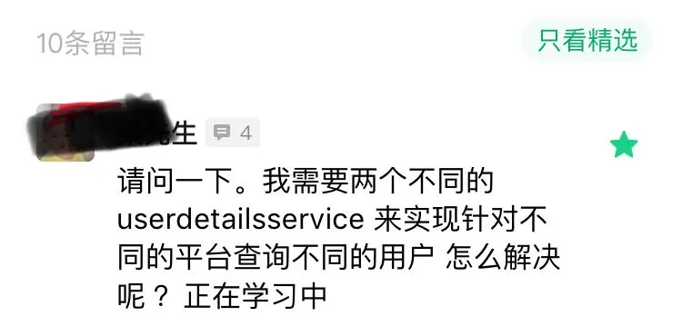
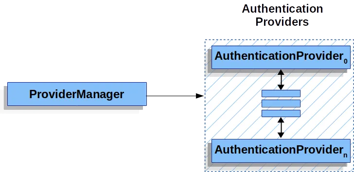

# Spring Security 可以同时对接多个用户表？

Original 江南一点雨 [江南一点雨](javascript:void(0);) *2020年07月14日 08:08*

松哥原创的 Spring Boot 视频教程已经杀青，感兴趣的小伙伴戳这里-->[👉Spring Boot+Vue+微人事视频教程](https://mp.weixin.qq.com/s?__biz=MzI1NDY0MTkzNQ==&mid=2247488799&idx=1&sn=cdfd5315ff18c979b6f5d390ab4d9059&scene=21#wechat_redirect)

这个问题也是来自小伙伴的提问：



其实这个问题有好几位小伙伴问过我，但是这个需求比较冷门，我一直没写文章。

其实只要看懂了松哥前面的文章，这个需求是可以做出来的。因为一个核心点就是 ProviderManager，搞懂了这个，其他的就很容易了。

今天松哥花一点时间，来和大家分析一下这个问题的核心，同时通过一个小小案例来演示一下如何同时连接多个数据源。

## 1.原理

### 1.1 Authentication

玩过 Spring Security 的小伙伴都知道，在 Spring Security 中有一个非常重要的对象叫做 Authentication，我们可以在任何地方注入 Authentication 进而获取到当前登录用户信息，Authentication 本身是一个接口，它实际上对 java.security.Principal 做的进一步封装，我们来看下 Authentication 的定义：

```
public interface Authentication extends Principal, Serializable {
 Collection<? extends GrantedAuthority> getAuthorities();
 Object getCredentials();
 Object getDetails();
 Object getPrincipal();
 boolean isAuthenticated();
 void setAuthenticated(boolean isAuthenticated) throws IllegalArgumentException;
}
```

可以看到，这里接口中的方法也没几个，我来大概解释下：

1. getAuthorities 方法用来获取用户的权限。
2. getCredentials 方法用来获取用户凭证，一般来说就是密码。
3. getDetails 方法用来获取用户携带的详细信息，可能是当前请求之类的东西。
4. getPrincipal 方法用来获取当前用户，可能是一个用户名，也可能是一个用户对象。
5. isAuthenticated 当前用户是否认证成功。

Authentication 作为一个接口，它定义了用户，或者说 Principal 的一些基本行为，它有很多实现类：


在这些实现类中，我们最常用的就是 UsernamePasswordAuthenticationToken 了，而每一个 Authentication 都有适合它的 AuthenticationProvider 去处理校验。例如处理 UsernamePasswordAuthenticationToken 的 AuthenticationProvider 是 DaoAuthenticationProvider。

### 1.2 AuthenticationManager

在 Spring Security 中，用来处理身份认证的类是 AuthenticationManager，我们也称之为认证管理器。

AuthenticationManager 中规范了 Spring Security 的过滤器要如何执行身份认证，并在身份认证成功后返回一个经过认证的 Authentication 对象。AuthenticationManager 是一个接口，我们可以自定义它的实现，但是通常我们使用更多的是系统提供的 ProviderManager。

### 1.3 ProviderManager

ProviderManager 是的最常用的 AuthenticationManager 实现类。

ProviderManager 管理了一个 AuthenticationProvider 列表，每个 AuthenticationProvider 都是一个认证器，不同的 AuthenticationProvider 用来处理不同的 Authentication 对象的认证。一次完整的身份认证流程可能会经过多个 AuthenticationProvider。

ProviderManager 相当于代理了多个 AuthenticationProvider，他们的关系如下图：



### 1.4 AuthenticationProvider

AuthenticationProvider 定义了 Spring Security 中的验证逻辑，我们来看下 AuthenticationProvider 的定义：

```
public interface AuthenticationProvider {
 Authentication authenticate(Authentication authentication)
   throws AuthenticationException;
 boolean supports(Class<?> authentication);
}
```

可以看到，AuthenticationProvider 中就两个方法：

- authenticate 方法用来做验证，就是验证用户身份。
- supports 则用来判断当前的 AuthenticationProvider 是否支持对应的 Authentication。

在一次完整的认证中，可能包含多个 AuthenticationProvider，而这多个 AuthenticationProvider 则由 ProviderManager 进行统一管理，具体可以参考松哥之前的文章：[👉松哥手把手带你捋一遍 Spring Security 登录流程](https://mp.weixin.qq.com/s?__biz=MzI1NDY0MTkzNQ==&mid=2247488026&idx=2&sn=3bd96d91e822abf753a8e91142e036be&scene=21#wechat_redirect)。

这里我们来重点看一下 DaoAuthenticationProvider，因为这是我们最常用的一个，当我们使用用户名/密码登录的时候，用的就是它，DaoAuthenticationProvider 的父类是 AbstractUserDetailsAuthenticationProvider，我们就先从它的父类看起：

```
public abstract class AbstractUserDetailsAuthenticationProvider implements
  AuthenticationProvider, InitializingBean, MessageSourceAware {
 public Authentication authenticate(Authentication authentication)
   throws AuthenticationException {
  String username = (authentication.getPrincipal() == null) ? "NONE_PROVIDED"
    : authentication.getName();
  boolean cacheWasUsed = true;
  UserDetails user = this.userCache.getUserFromCache(username);
  if (user == null) {
   cacheWasUsed = false;
   try {
    user = retrieveUser(username,
      (UsernamePasswordAuthenticationToken) authentication);
   }
   catch (UsernameNotFoundException notFound) {
    logger.debug("User '" + username + "' not found");

    if (hideUserNotFoundExceptions) {
     throw new BadCredentialsException(messages.getMessage(
       "AbstractUserDetailsAuthenticationProvider.badCredentials",
       "Bad credentials"));
    }
    else {
     throw notFound;
    }
   }
  }

  try {
   preAuthenticationChecks.check(user);
   additionalAuthenticationChecks(user,
     (UsernamePasswordAuthenticationToken) authentication);
  }
  catch (AuthenticationException exception) {
   if (cacheWasUsed) {
    cacheWasUsed = false;
    user = retrieveUser(username,
      (UsernamePasswordAuthenticationToken) authentication);
    preAuthenticationChecks.check(user);
    additionalAuthenticationChecks(user,
      (UsernamePasswordAuthenticationToken) authentication);
   }
   else {
    throw exception;
   }
  }

  postAuthenticationChecks.check(user);

  if (!cacheWasUsed) {
   this.userCache.putUserInCache(user);
  }

  Object principalToReturn = user;

  if (forcePrincipalAsString) {
   principalToReturn = user.getUsername();
  }

  return createSuccessAuthentication(principalToReturn, authentication, user);
 }
 public boolean supports(Class<?> authentication) {
  return (UsernamePasswordAuthenticationToken.class
    .isAssignableFrom(authentication));
 }
}
```

AbstractUserDetailsAuthenticationProvider 的代码还是挺长的，这里我们重点关注两个方法：authenticate 和 supports。

authenticate 方法就是用来做认证的方法，我们来简单看下方法流程：

1. 首先从 Authentication 提取出登录用户名。
2. 然后通过拿着 username 去调用 retrieveUser 方法去获取当前用户对象，这一步会调用我们自己在登录时候的写的 loadUserByUsername 方法，所以这里返回的 user 其实就是你的登录对象，可以参考微人事的 org/javaboy/vhr/service/HrService.java#L34，也可以参考本系列之前的文章：[👉Spring Security+Spring Data Jpa 强强联手，安全管理只有更简单！](https://mp.weixin.qq.com/s?__biz=MzI1NDY0MTkzNQ==&mid=2247488229&idx=1&sn=2911c04bf19d41b00b4933d4044590f8&scene=21#wechat_redirect)。
3. 接下来调用 preAuthenticationChecks.check 方法去检验 user 中的各个账户状态属性是否正常，例如账户是否被禁用、账户是否被锁定、账户是否过期等等。
4. additionalAuthenticationChecks 方法则是做密码比对的，好多小伙伴好奇 Spring Security 的密码加密之后，是如何进行比较的，看这里就懂了，因为比较的逻辑很简单，我这里就不贴代码出来了。但是注意，additionalAuthenticationChecks 方法是一个抽象方法，具体的实现是在 AbstractUserDetailsAuthenticationProvider 的子类中实现的，也就是 DaoAuthenticationProvider。这个其实很好理解，因为 AbstractUserDetailsAuthenticationProvider 作为一个较通用的父类，处理一些通用的行为，我们在登录的时候，有的登录方式并不需要密码，所以 additionalAuthenticationChecks 方法一般交给它的子类去实现，在 DaoAuthenticationProvider 类中，additionalAuthenticationChecks 方法就是做密码比对的，在其他的 AuthenticationProvider 中，additionalAuthenticationChecks 方法的作用就不一定了。
5. 最后在 postAuthenticationChecks.check 方法中检查密码是否过期。
6. 接下来有一个 forcePrincipalAsString 属性，这个是是否强制将 Authentication 中的 principal 属性设置为字符串，这个属性我们一开始在 UsernamePasswordAuthenticationFilter 类中其实就是设置为字符串的（即 username），但是默认情况下，当用户登录成功之后， 这个属性的值就变成当前用户这个对象了。之所以会这样，就是因为 forcePrincipalAsString 默认为 false，不过这块其实不用改，就用 false，这样在后期获取当前用户信息的时候反而方便很多。
7. 最后，通过 createSuccessAuthentication 方法构建一个新的 UsernamePasswordAuthenticationToken。

supports 方法就比较简单了，主要用来判断当前的 Authentication 是否是 UsernamePasswordAuthenticationToken。

由于 AbstractUserDetailsAuthenticationProvider 已经把 authenticate 和 supports 方法实现了，所以在 DaoAuthenticationProvider 中，我们主要关注 additionalAuthenticationChecks 方法即可：

```
public class DaoAuthenticationProvider extends AbstractUserDetailsAuthenticationProvider {
 @SuppressWarnings("deprecation")
 protected void additionalAuthenticationChecks(UserDetails userDetails,
   UsernamePasswordAuthenticationToken authentication)
   throws AuthenticationException {
  if (authentication.getCredentials() == null) {
   throw new BadCredentialsException(messages.getMessage(
     "AbstractUserDetailsAuthenticationProvider.badCredentials",
     "Bad credentials"));
  }
  String presentedPassword = authentication.getCredentials().toString();
  if (!passwordEncoder.matches(presentedPassword, userDetails.getPassword())) {
   throw new BadCredentialsException(messages.getMessage(
     "AbstractUserDetailsAuthenticationProvider.badCredentials",
     "Bad credentials"));
  }
 }
}
```

大家可以看到，additionalAuthenticationChecks 方法主要用来做密码比对的，逻辑也比较简单，就是调用 PasswordEncoder 的 matches 方法做比对，如果密码不对则直接抛出异常即可。

**正常情况下，我们使用用户名/密码登录，最终都会走到这一步。**

而 AuthenticationProvider 都是通过 ProviderManager#authenticate 方法来调用的。由于我们的一次认证可能会存在多个 AuthenticationProvider，所以，在 ProviderManager#authenticate 方法中会逐个遍历 AuthenticationProvider，并调用他们的 authenticate 方法做认证，我们来稍微瞅一眼 ProviderManager#authenticate 方法：

```
public Authentication authenticate(Authentication authentication)
  throws AuthenticationException {
 for (AuthenticationProvider provider : getProviders()) {
  result = provider.authenticate(authentication);
  if (result != null) {
   copyDetails(authentication, result);
   break;
  }
 }
    ...
    ...
}
```

可以看到，在这个方法中，会遍历所有的 AuthenticationProvider，并调用它的 authenticate 方法进行认证。

好了，大致的认证流程说完之后，相信大家已经明白了我们要从哪里下手了。

## 2.案例

要想接入多个数据源，我们只需要提供多个自定义的 AuthenticationProvider，并交给 ProviderManager 进行管理，每一个 AuthenticationProvider 对应不同的数据源即可。

首先我们创建一个 Spring Boot 项目，引入 security 和 web 依赖：

```
<dependency>
    <groupId>org.springframework.boot</groupId>
    <artifactId>spring-boot-starter-web</artifactId>
</dependency>
<dependency>
    <groupId>org.springframework.boot</groupId>
    <artifactId>spring-boot-starter-security</artifactId>
</dependency>
```

然后创建一个测试 Controller，如下：

```
@RestController
public class HelloController {
    @GetMapping("/hello")
    public String hello() {
        return "hello";
    }
    @GetMapping("/admin")
    public String admin() {
        return "admin";
    }
}
```

最后配置 SecurityConfig：

```
@Configuration
public class SecurityConfig extends WebSecurityConfigurerAdapter {
    @Bean
    @Primary
    UserDetailsService us1() {
        return new InMemoryUserDetailsManager(User.builder().username("javaboy").password("{noop}123").roles("admin").build());
    }
    @Bean
    UserDetailsService us2() {
        return new InMemoryUserDetailsManager(User.builder().username("sang").password("{noop}123").roles("user").build());
    }
    @Override
    @Bean
    protected AuthenticationManager authenticationManager() throws Exception {
        DaoAuthenticationProvider dao1 = new DaoAuthenticationProvider();
        dao1.setUserDetailsService(us1());

        DaoAuthenticationProvider dao2 = new DaoAuthenticationProvider();
        dao2.setUserDetailsService(us2());

        ProviderManager manager = new ProviderManager(dao1, dao2);
        return manager;
    }
    @Override
    protected void configure(HttpSecurity http) throws Exception {
        http.authorizeRequests()
                .antMatchers("/hello").hasRole("user")
                .antMatchers("/admin").hasRole("admin")
                .and()
                .formLogin()
                .loginProcessingUrl("/doLogin")
                .permitAll()
                .and()
                .csrf().disable();
    }
}
```

1. 首先提供两个 UserDetailsService 实例，这里为了方便演示，我采用 InMemoryUserDetailsManager 来构建 UserDetailsService，在实际开发中，大家自行定义 UserDetailsService 即可，可以参考（[👉Spring Security+Spring Data Jpa 强强联手，安全管理只有更简单！](https://mp.weixin.qq.com/s?__biz=MzI1NDY0MTkzNQ==&mid=2247488229&idx=1&sn=2911c04bf19d41b00b4933d4044590f8&scene=21#wechat_redirect)）一文。
2. 接下来自定义 AuthenticationManager，AuthenticationManager 的实例实际上就是 ProviderManager。先构造两个 DaoAuthenticationProvider 实例，每一个传入不同的 UserDetailsService 实例，相当于每一个 DaoAuthenticationProvider 代表了一个 UserDetailsService 实例。
3. 最后配置 HttpSecurity，这个本系列前面文章讲过很多次了，这里就不再赘述。

**根据第一小节中的原理，在用户身份认证时，两个 DaoAuthenticationProvider 会被依次执行，这样我们配置的两个数据源就生效了。**

配置完成后，启动项目。

在 postman 中进行测试，我们可以使用 javaboy 登录，登录成功后的用户具备 admin 角色，所以可以访问 http://localhost:8080/admin，也可以使用 sang 登录，登录后的用户具备 user 角色，可以访问 http://localhost:8080/hello。

## 3.小结

好啦，本文和小伙伴们分享了一下 Spring Security 中如何同时接入多个数据源的问题，感兴趣的小伙伴可以尝试一下哦～

微信公众号【江南一点雨】后台回复 **multiusers** 可以获取本文案例下载地址哦～

**如果小伙伴们觉得有收获，记得点个在看鼓励下松哥哦～**

今日干货

' fill='%23FFFFFF'%3E%3Crect x='249' y='126' width='1' height='1'%3E%3C/rect%3E%3C/g%3E%3C/g%3E%3C/svg%3E)

刚刚发表

查看:66666回复:666

公众号后台回复 ssm，免费获取松哥纯手敲的 SSM 框架学习干货。

SpringSecurity系列52

SpringSecurity系列 · 目录


上一篇Spring Security 竟然可以同时存在多个过滤器链？下一篇深入理解 FilterChainProxy【源码篇】


# 


Scan to Follow